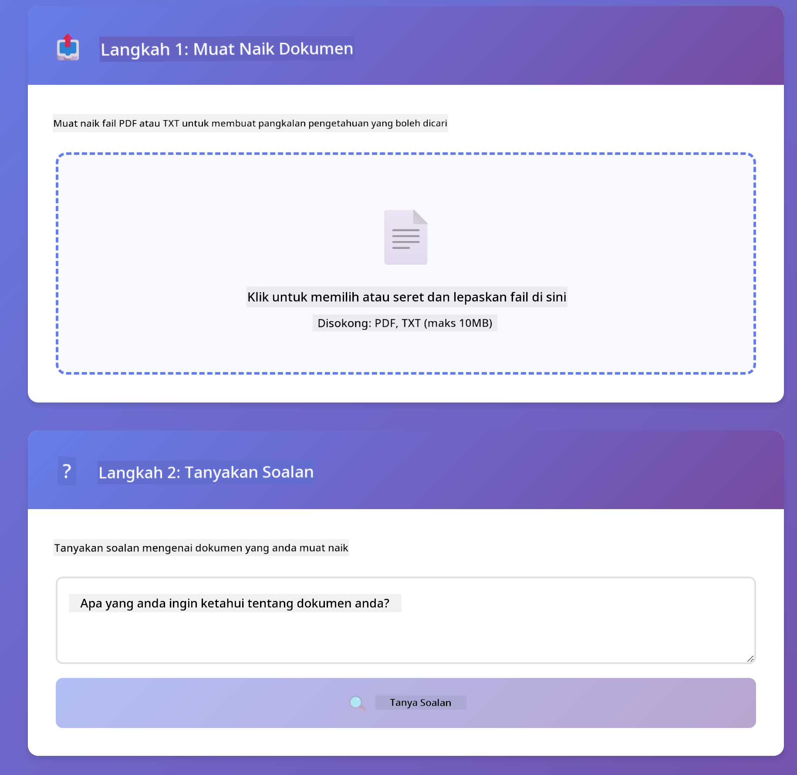

<!--
CO_OP_TRANSLATOR_METADATA:
{
  "original_hash": "f538a51cfd13147d40d84e936a0f485c",
  "translation_date": "2025-12-13T17:11:18+00:00",
  "source_file": "03-rag/README.md",
  "language_code": "ms"
}
-->
# Modul 03: RAG (Generasi Dipertingkatkan dengan Pengambilan)

## Jadual Kandungan

- [Apa yang Anda Akan Pelajari](../../../03-rag)
- [Prasyarat](../../../03-rag)
- [Memahami RAG](../../../03-rag)
- [Bagaimana Ia Berfungsi](../../../03-rag)
  - [Pemprosesan Dokumen](../../../03-rag)
  - [Mewujudkan Embedding](../../../03-rag)
  - [Carian Semantik](../../../03-rag)
  - [Penjanaan Jawapan](../../../03-rag)
- [Jalankan Aplikasi](../../../03-rag)
- [Menggunakan Aplikasi](../../../03-rag)
  - [Muat Naik Dokumen](../../../03-rag)
  - [Tanya Soalan](../../../03-rag)
  - [Semak Rujukan Sumber](../../../03-rag)
  - [Eksperimen dengan Soalan](../../../03-rag)
- [Konsep Utama](../../../03-rag)
  - [Strategi Pemecahan](../../../03-rag)
  - [Skor Kesamaan](../../../03-rag)
  - [Penyimpanan Dalam Memori](../../../03-rag)
  - [Pengurusan Tetingkap Konteks](../../../03-rag)
- [Bila RAG Penting](../../../03-rag)
- [Langkah Seterusnya](../../../03-rag)

## Apa yang Anda Akan Pelajari

Dalam modul-modul sebelum ini, anda telah belajar bagaimana untuk berinteraksi dengan AI dan menyusun arahan anda dengan berkesan. Tetapi terdapat had asas: model bahasa hanya tahu apa yang mereka pelajari semasa latihan. Mereka tidak boleh menjawab soalan tentang polisi syarikat anda, dokumentasi projek anda, atau sebarang maklumat yang mereka tidak dilatih.

RAG (Generasi Dipertingkatkan dengan Pengambilan) menyelesaikan masalah ini. Daripada cuba mengajar model maklumat anda (yang mahal dan tidak praktikal), anda memberinya keupayaan untuk mencari melalui dokumen anda. Apabila seseorang bertanya soalan, sistem mencari maklumat yang relevan dan memasukkannya ke dalam arahan. Model kemudian menjawab berdasarkan konteks yang diperoleh itu.

Fikirkan RAG sebagai memberikan model sebuah perpustakaan rujukan. Apabila anda bertanya soalan, sistem:

1. **Pertanyaan Pengguna** - Anda bertanya soalan
2. **Embedding** - Menukar soalan anda kepada vektor
3. **Carian Vektor** - Mencari potongan dokumen yang serupa
4. **Penyusunan Konteks** - Menambah potongan relevan ke dalam arahan
5. **Respons** - LLM menjana jawapan berdasarkan konteks

Ini menjadikan jawapan model berasaskan data sebenar anda dan bukannya bergantung pada pengetahuan latihan atau mereka-reka jawapan.


*Aliran kerja RAG - dari pertanyaan pengguna ke carian semantik ke penjanaan jawapan kontekstual*

## Prasyarat

- Modul 01 telah disiapkan (sumber Azure OpenAI telah dideploy)
- Fail `.env` di direktori root dengan kelayakan Azure (dicipta oleh `azd up` dalam Modul 01)

> **Nota:** Jika anda belum menyiapkan Modul 01, ikut arahan deployment di sana terlebih dahulu.

## Bagaimana Ia Berfungsi

**Pemprosesan Dokumen** - [DocumentService.java](../../../03-rag/src/main/java/com/example/langchain4j/rag/service/DocumentService.java)

Apabila anda memuat naik dokumen, sistem memecahkannya kepada potongan-potongan kecil - bahagian yang lebih kecil yang muat dengan selesa dalam tetingkap konteks model. Potongan ini bertindih sedikit supaya konteks di sempadan tidak hilang.

```java
Document document = FileSystemDocumentLoader.loadDocument("sample-document.txt");

DocumentSplitter splitter = DocumentSplitters
    .recursive(300, 30, new OpenAiTokenizer());

List<TextSegment> segments = splitter.split(document);
```

> **🤖 Cuba dengan [GitHub Copilot](https://github.com/features/copilot) Chat:** Buka [`DocumentService.java`](../../../03-rag/src/main/java/com/example/langchain4j/rag/service/DocumentService.java) dan tanya:
> - "Bagaimana LangChain4j memecah dokumen kepada potongan dan mengapa pertindihan penting?"
> - "Apakah saiz potongan optimum untuk jenis dokumen berbeza dan mengapa?"
> - "Bagaimana saya mengendalikan dokumen dalam pelbagai bahasa atau dengan format khas?"

**Mewujudkan Embedding** - [LangChainRagConfig.java](../../../03-rag/src/main/java/com/example/langchain4j/rag/config/LangChainRagConfig.java)

Setiap potongan ditukar menjadi representasi berangka yang dipanggil embedding - pada dasarnya cap jari matematik yang menangkap makna teks. Teks yang serupa menghasilkan embedding yang serupa.

```java
@Bean
public EmbeddingModel embeddingModel() {
    return OpenAiOfficialEmbeddingModel.builder()
        .baseUrl(azureOpenAiEndpoint)
        .apiKey(azureOpenAiKey)
        .modelName(azureEmbeddingDeploymentName)
        .build();
}

EmbeddingStore<TextSegment> embeddingStore = 
    new InMemoryEmbeddingStore<>();
```


*Dokumen diwakili sebagai vektor dalam ruang embedding - kandungan serupa berkumpul bersama*

**Carian Semantik** - [RagService.java](../../../03-rag/src/main/java/com/example/langchain4j/rag/service/RagService.java)

Apabila anda bertanya soalan, soalan anda juga menjadi embedding. Sistem membandingkan embedding soalan anda dengan semua embedding potongan dokumen. Ia mencari potongan yang mempunyai makna paling serupa - bukan hanya padanan kata kunci, tetapi kesamaan semantik sebenar.

```java
Embedding queryEmbedding = embeddingModel.embed(question).content();

List<EmbeddingMatch<TextSegment>> matches = 
    embeddingStore.findRelevant(queryEmbedding, 5, 0.7);

for (EmbeddingMatch<TextSegment> match : matches) {
    String relevantText = match.embedded().text();
    double score = match.score();
}
```

> **🤖 Cuba dengan [GitHub Copilot](https://github.com/features/copilot) Chat:** Buka [`RagService.java`](../../../03-rag/src/main/java/com/example/langchain4j/rag/service/RagService.java) dan tanya:
> - "Bagaimana carian kesamaan berfungsi dengan embedding dan apa yang menentukan skor?"
> - "Apakah ambang kesamaan yang harus saya gunakan dan bagaimana ia mempengaruhi keputusan?"
> - "Bagaimana saya mengendalikan kes di mana tiada dokumen relevan ditemui?"

**Penjanaan Jawapan** - [RagService.java](../../../03-rag/src/main/java/com/example/langchain4j/rag/service/RagService.java)

Potongan yang paling relevan dimasukkan ke dalam arahan kepada model. Model membaca potongan tersebut dan menjawab soalan anda berdasarkan maklumat itu. Ini mengelakkan halusinasi - model hanya boleh menjawab dari apa yang ada di hadapannya.

## Jalankan Aplikasi

**Sahkan deployment:**

Pastikan fail `.env` wujud di direktori root dengan kelayakan Azure (dicipta semasa Modul 01):
```bash
cat ../.env  # Patut menunjukkan AZURE_OPENAI_ENDPOINT, API_KEY, DEPLOYMENT
```

**Mulakan aplikasi:**

> **Nota:** Jika anda sudah memulakan semua aplikasi menggunakan `./start-all.sh` dari Modul 01, modul ini sudah berjalan pada port 8081. Anda boleh langkau arahan mula di bawah dan terus ke http://localhost:8081.

**Pilihan 1: Menggunakan Spring Boot Dashboard (Disyorkan untuk pengguna VS Code)**

Kontena pembangunan termasuk sambungan Spring Boot Dashboard, yang menyediakan antara muka visual untuk mengurus semua aplikasi Spring Boot. Anda boleh menemuinya di Bar Aktiviti di sebelah kiri VS Code (cari ikon Spring Boot).

Dari Spring Boot Dashboard, anda boleh:
- Melihat semua aplikasi Spring Boot yang tersedia dalam ruang kerja
- Mulakan/hentikan aplikasi dengan satu klik
- Lihat log aplikasi secara masa nyata
- Pantau status aplikasi

Klik butang main di sebelah "rag" untuk memulakan modul ini, atau mulakan semua modul sekaligus.


**Pilihan 2: Menggunakan skrip shell**

Mulakan semua aplikasi web (modul 01-04):

**Bash:**
```bash
cd ..  # Dari direktori root
./start-all.sh
```

**PowerShell:**
```powershell
cd ..  # Dari direktori root
.\start-all.ps1
```

Atau mulakan hanya modul ini:

**Bash:**
```bash
cd 03-rag
./start.sh
```

**PowerShell:**
```powershell
cd 03-rag
.\start.ps1
```

Kedua-dua skrip secara automatik memuatkan pembolehubah persekitaran dari fail `.env` root dan akan membina JAR jika belum wujud.

> **Nota:** Jika anda lebih suka membina semua modul secara manual sebelum memulakan:
>
> **Bash:**
> ```bash
> cd ..  # Go to root directory
> mvn clean package -DskipTests
> ```
>
> **PowerShell:**
> ```powershell
> cd ..  # Go to root directory
> mvn clean package -DskipTests
> ```

Buka http://localhost:8081 dalam pelayar anda.

**Untuk berhenti:**

**Bash:**
```bash
./stop.sh  # Modul ini sahaja
# Atau
cd .. && ./stop-all.sh  # Semua modul
```

**PowerShell:**
```powershell
.\stop.ps1  # Modul ini sahaja
# Atau
cd ..; .\stop-all.ps1  # Semua modul
```

## Menggunakan Aplikasi

Aplikasi menyediakan antara muka web untuk muat naik dokumen dan bertanya soalan.

<a href="images/rag-homepage.png"></a>

*Antara muka aplikasi RAG - muat naik dokumen dan tanya soalan*

**Muat Naik Dokumen**

Mulakan dengan memuat naik dokumen - fail TXT paling sesuai untuk ujian. Satu `sample-document.txt` disediakan dalam direktori ini yang mengandungi maklumat tentang ciri LangChain4j, pelaksanaan RAG, dan amalan terbaik - sesuai untuk menguji sistem.

Sistem memproses dokumen anda, memecahkannya kepada potongan, dan mewujudkan embedding untuk setiap potongan. Ini berlaku secara automatik apabila anda memuat naik.

**Tanya Soalan**

Sekarang tanya soalan khusus tentang kandungan dokumen. Cuba sesuatu yang faktual yang dinyatakan dengan jelas dalam dokumen. Sistem mencari potongan relevan, memasukkannya ke dalam arahan, dan menjana jawapan.

**Semak Rujukan Sumber**

Perhatikan setiap jawapan termasuk rujukan sumber dengan skor kesamaan. Skor ini (0 hingga 1) menunjukkan betapa relevannya setiap potongan dengan soalan anda. Skor lebih tinggi bermakna padanan lebih baik. Ini membolehkan anda mengesahkan jawapan dengan bahan sumber.

<a href="images/rag-query-results.png"></a>

*Keputusan pertanyaan menunjukkan jawapan dengan rujukan sumber dan skor relevan*

**Eksperimen dengan Soalan**

Cuba pelbagai jenis soalan:
- Fakta khusus: "Apakah topik utama?"
- Perbandingan: "Apakah perbezaan antara X dan Y?"
- Ringkasan: "Ringkaskan perkara utama tentang Z"

Perhatikan bagaimana skor relevan berubah berdasarkan sejauh mana soalan anda sepadan dengan kandungan dokumen.

## Konsep Utama

**Strategi Pemecahan**

Dokumen dipecah kepada potongan 300 token dengan 30 token pertindihan. Keseimbangan ini memastikan setiap potongan mempunyai cukup konteks untuk bermakna sambil kekal cukup kecil untuk memasukkan beberapa potongan dalam satu arahan.

**Skor Kesamaan**

Skor berkisar dari 0 hingga 1:
- 0.7-1.0: Sangat relevan, padanan tepat
- 0.5-0.7: Relevan, konteks baik
- Di bawah 0.5: Ditapis keluar, terlalu berbeza

Sistem hanya mengambil potongan di atas ambang minimum untuk memastikan kualiti.

**Penyimpanan Dalam Memori**

Modul ini menggunakan penyimpanan dalam memori untuk kesederhanaan. Apabila anda mulakan semula aplikasi, dokumen yang dimuat naik akan hilang. Sistem produksi menggunakan pangkalan data vektor kekal seperti Qdrant atau Azure AI Search.

**Pengurusan Tetingkap Konteks**

Setiap model mempunyai tetingkap konteks maksimum. Anda tidak boleh memasukkan setiap potongan dari dokumen besar. Sistem mengambil N potongan paling relevan (default 5) untuk kekal dalam had sambil menyediakan cukup konteks untuk jawapan tepat.

## Bila RAG Penting

**Gunakan RAG apabila:**
- Menjawab soalan tentang dokumen proprietari
- Maklumat berubah kerap (polisi, harga, spesifikasi)
- Ketepatan memerlukan atribusi sumber
- Kandungan terlalu besar untuk dimasukkan dalam satu arahan
- Anda memerlukan jawapan yang boleh disahkan dan berasaskan fakta

**Jangan gunakan RAG apabila:**
- Soalan memerlukan pengetahuan umum yang sudah ada pada model
- Data masa nyata diperlukan (RAG berfungsi pada dokumen yang dimuat naik)
- Kandungan cukup kecil untuk dimasukkan terus dalam arahan

## Langkah Seterusnya

**Modul Seterusnya:** [04-tools - Ejen AI dengan Alat](../04-tools/README.md)

---

**Navigasi:** [← Sebelumnya: Modul 02 - Kejuruteraan Arahan](../02-prompt-engineering/README.md) | [Kembali ke Utama](../README.md) | [Seterusnya: Modul 04 - Alat →](../04-tools/README.md)

---

<!-- CO-OP TRANSLATOR DISCLAIMER START -->
**Penafian**:  
Dokumen ini telah diterjemahkan menggunakan perkhidmatan terjemahan AI [Co-op Translator](https://github.com/Azure/co-op-translator). Walaupun kami berusaha untuk ketepatan, sila ambil maklum bahawa terjemahan automatik mungkin mengandungi kesilapan atau ketidaktepatan. Dokumen asal dalam bahasa asalnya harus dianggap sebagai sumber yang sahih. Untuk maklumat penting, terjemahan profesional oleh manusia adalah disyorkan. Kami tidak bertanggungjawab atas sebarang salah faham atau salah tafsir yang timbul daripada penggunaan terjemahan ini.
<!-- CO-OP TRANSLATOR DISCLAIMER END -->