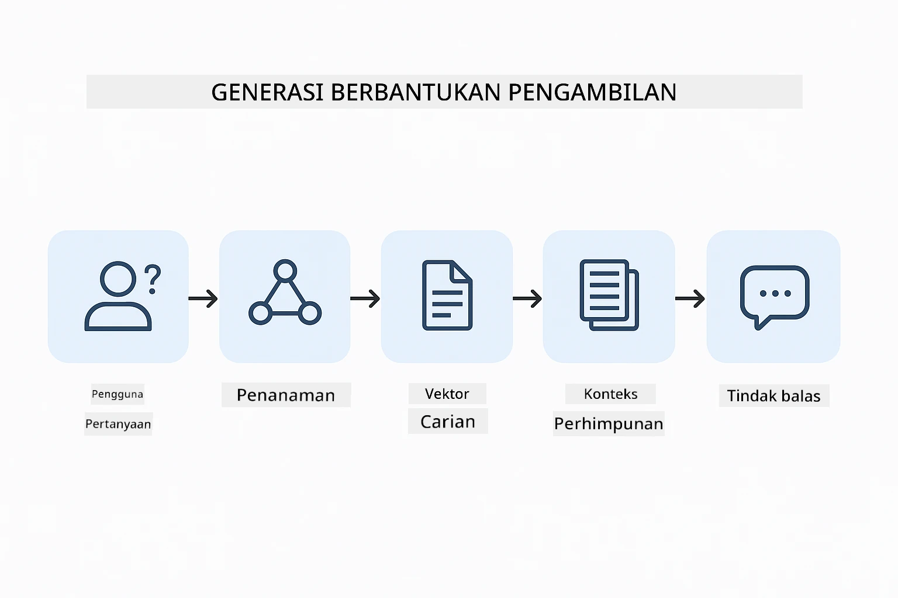
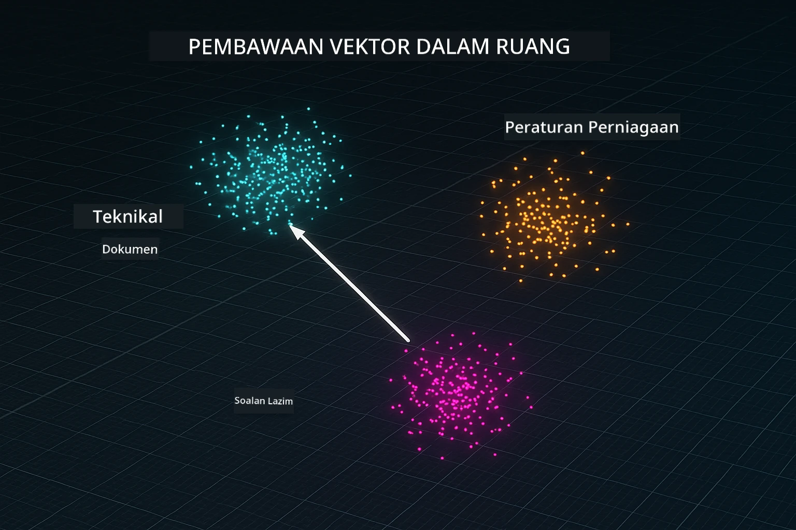
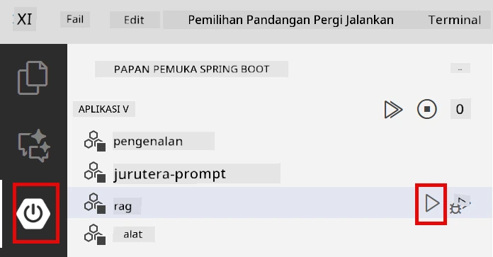
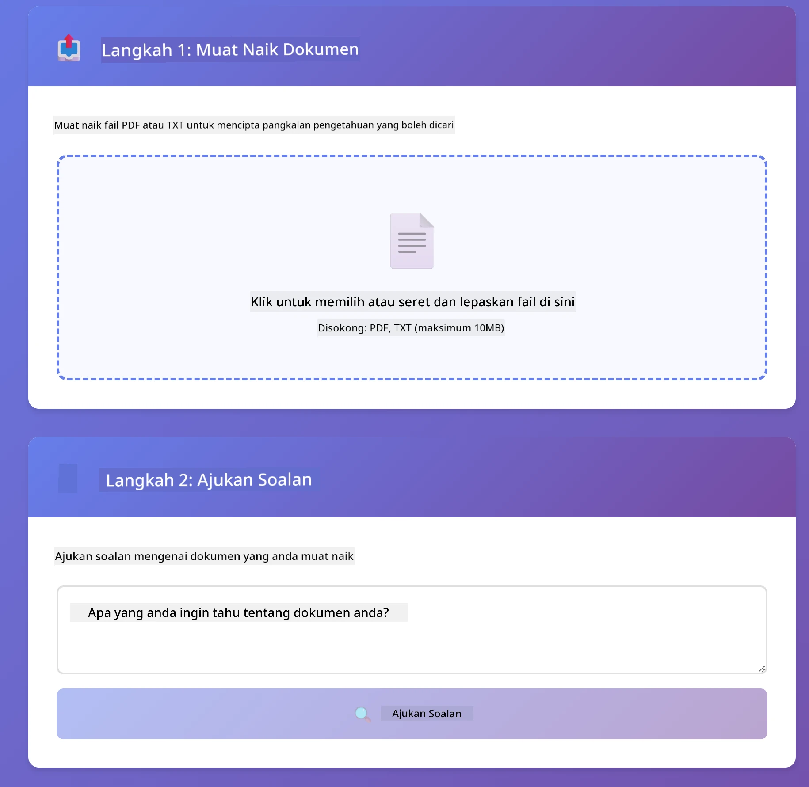
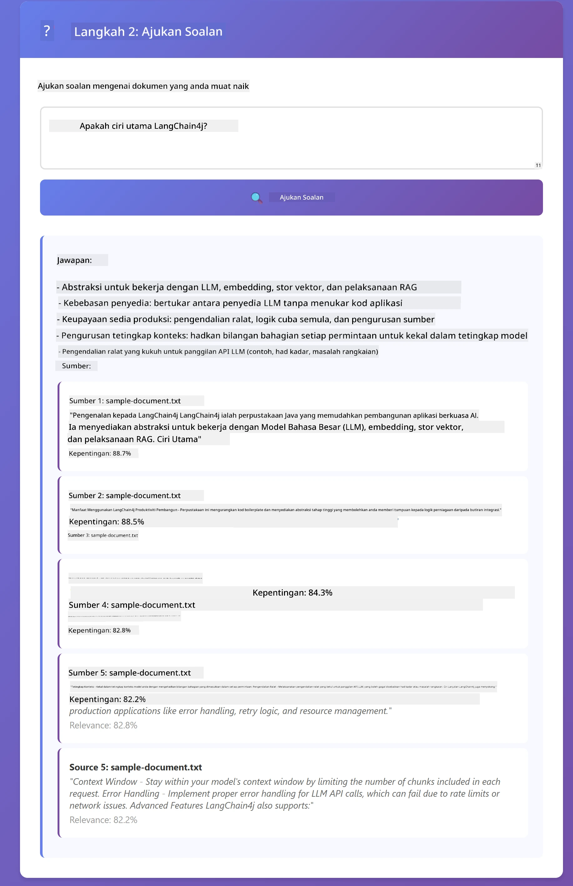

# Modul 03: RAG (Retrieval-Augmented Generation)

## Jadual Kandungan

- [Video Panduan](#video-panduan)
- [Apa yang Anda Akan Pelajari](#apa-yang-anda-akan-pelajari)
- [Prasyarat](#prasyarat)
- [Memahami RAG](#memahami-rag)
  - [Pendekatan RAG Mana yang Digunakan Tutorial Ini?](#pendekatan-rag-mana-yang-digunakan-tutorial-ini)
- [Bagaimana Ia Berfungsi](#bagaimana-ia-berfungsi)
  - [Pemprosesan Dokumen](#pemprosesan-dokumen)
  - [Membuat Embedding](#membuat-embedding)
  - [Carian Semantik](#carian-semantik)
  - [Penjanaan Jawapan](#penjanaan-jawapan)
- [Jalankan Aplikasi](#jalankan-aplikasi)
- [Menggunakan Aplikasi](#menggunakan-aplikasi)
  - [Muat Naik Dokumen](#muat-naik-dokumen)
  - [Tanya Soalan](#tanyakan-soalan)
  - [Periksa Rujukan Sumber](#semak-rujukan-sumber)
  - [Eksperimen dengan Soalan](#eksperimen-dengan-soalan)
- [Konsep Utama](#konsep-utama)
  - [Strategi Memecah Bahagian](#strategi-pemecahan-kepingan-chunking)
  - [Skor Kesamaan](#skor-kesamaan)
  - [Simpanan Dalam Memori](#penyimpanan-dalam-memori)
  - [Pengurusan Tetingkap Konteks](#pengurusan-tetingkap-konteks)
- [Bila RAG Penting](#bila-rag-penting)
- [Langkah Seterusnya](#langkah-seterusnya)

## Video Panduan

Tonton sesi langsung ini yang menerangkan cara memulakan modul ini:

<a href="https://www.youtube.com/watch?v=_olq75ZH_eY"></a>

## Apa yang Anda Akan Pelajari

Dalam modul sebelumnya, anda belajar cara berinteraksi dengan AI dan menyusun prompt anda dengan berkesan. Tetapi ada had asas: model bahasa hanya tahu apa yang mereka pelajari semasa latihan. Mereka tidak boleh menjawab soalan mengenai polisi syarikat anda, dokumentasi projek anda, atau apa-apa maklumat yang mereka tidak dilatih.

RAG (Retrieval-Augmented Generation) menyelesaikan masalah ini. Daripada cuba mengajar model maklumat anda (yang mahal dan tidak praktikal), anda memberinya keupayaan untuk mencari dokumen anda. Apabila seseorang bertanya soalan, sistem mencari maklumat yang relevan dan memasukkannya dalam prompt. Model kemudian menjawab berdasarkan konteks yang diperoleh tersebut.

Fikirkan RAG sebagai memberikan model perpustakaan rujukan. Apabila anda bertanya soalan, sistem:

1. **Pertanyaan Pengguna** - Anda bertanya soalan
2. **Embedding** - Menukar soalan anda menjadi vektor
3. **Carian Vektor** - Mencari pecahan dokumen yang serupa
4. **Penyusunan Konteks** - Menambah pecahan yang relevan ke dalam prompt
5. **Respons** - LLM menjana jawapan berdasarkan konteks tersebut

Ini menjadikan jawapan model berasaskan data sebenar anda dan bukan bergantung pada pengetahuan latihan atau mereka jawapan.

## Prasyarat

- Menyelesaikan [Modul 01 - Pengenalan](../01-introduction/README.md) (sumber Azure OpenAI telah dideploy, termasuk model embedding `text-embedding-3-small`)
- Fail `.env` dalam direktori root dengan kelayakan Azure (dibuat oleh `azd up` dalam Modul 01)

> **Nota:** Jika anda belum menyelesaikan Modul 01, ikuti arahan deployment di sana terlebih dahulu. Perintah `azd up` akan mendeply kedua-dua model chat GPT dan model embedding yang digunakan oleh modul ini.

## Memahami RAG

Rajah di bawah menggambarkan konsep utama: bukannya hanya bergantung pada data latihan model, RAG memberinya perpustakaan rujukan dokumen anda untuk dirujuk sebelum menjana setiap jawapan.


*Rajah ini menunjukkan perbezaan antara LLM standard (yang membuat tekaan dari data latihan) dan LLM yang dipertingkatkan RAG (yang merujuk dokumen anda terlebih dahulu).*

Berikut adalah bagaimana komponen-komponen tersebut bersambung dari hujung ke hujung. Soalan pengguna mengalir melalui empat tahap — embedding, carian vektor, penyusunan konteks, dan penjanaan jawapan — setiap satu membina berdasarkan yang sebelumnya:



*Rajah ini menunjukkan saluran RAG dari hujung ke hujung — pertanyaan pengguna mengalir melalui embedding, carian vektor, penyusunan konteks, dan penjanaan jawapan.*

Selepas ini, modul ini menerangkan setiap peringkat dengan terperinci, lengkap dengan kod yang anda boleh jalankan dan ubah suai.

### Pendekatan RAG Mana yang Digunakan Tutorial Ini?

LangChain4j menawarkan tiga cara untuk melaksanakan RAG, setiap satu dengan tahap abstraksi yang berbeza. Rajah di bawah membandingkannya secara sebelah menyebelah:


*Rajah ini membandingkan tiga pendekatan RAG LangChain4j — Mudah, Asli, dan Lanjutan — menunjukkan komponen utama mereka dan bila hendak guna setiap satu.*

| Pendekatan | Apa yang Dilakukan | Penukaran |
|---|---|---|
| **Easy RAG** | Menyusun semua secara automatik melalui `AiServices` dan `ContentRetriever`. Anda anotasi antara muka, lampirkan retriever, dan LangChain4j mengendalikan embedding, carian, dan penyusunan prompt di belakang tabir. | Kod minimum, tetapi anda tidak nampak apa yang berlaku pada setiap langkah. |
| **Native RAG** | Anda memanggil model embedding, mencari stor, membina prompt, dan menjana jawapan sendiri — satu langkah eksplisit pada satu masa. | Kod lebih banyak, tetapi setiap tahap nampak dan boleh diubah suai. |
| **Advanced RAG** | Menggunakan kerangka `RetrievalAugmentor` dengan transformer pertanyaan boleh dipasang, router, re-ranker, dan content injector untuk saluran pengeluaran kelas tinggi. | Fleksibiliti maksimum, tetapi dengan kerumitan yang lebih besar. |

**Tutorial ini menggunakan pendekatan Native.** Setiap langkah saluran RAG — embedding pertanyaan, mencari dalam stor vektor, menyusun konteks, dan menjana jawapan — ditulis secara jelas dalam [`RagService.java`](../../../03-rag/src/main/java/com/example/langchain4j/rag/service/RagService.java). Ini disengajakan: sebagai sumber pembelajaran, lebih penting anda melihat dan memahami setiap peringkat daripada mengurangkan kod. Setelah anda selesa dengan bagaimana bahagian-bahagian bersambung, anda boleh beralih ke Easy RAG untuk prototaip cepat atau Advanced RAG untuk sistem pengeluaran.

> **💡 Tertanya-tanya tentang Easy RAG?** LangChain4j juga menawarkan pendekatan *Easy RAG* di mana `AiServices` dan `ContentRetriever` mengendalikan embedding, carian, dan penyusunan prompt secara automatik. Modul ini mengambil laluan yang lebih eksplisit — membuka saluran tersebut supaya anda boleh lihat dan kawal setiap peringkat sendiri.

Rajah di bawah menunjukkan saluran Easy RAG. Perhatikan bagaimana `AiServices` dan `EmbeddingStoreContentRetriever` menyembunyikan semua kerumitan — anda muat naik dokumen, lampirkan retriever, dan dapatkan jawapan. Pendekatan Native dalam modul ini membuka setiap langkah tersembunyi tersebut:


*Rajah ini menunjukkan saluran Easy RAG. Bandingkan dengan pendekatan Native yang digunakan dalam modul ini: Easy RAG menyembunyikan embedding, pencarian, dan penyusunan prompt di belakang `AiServices` dan `ContentRetriever` — anda muat naik dokumen, lampirkan retriever, dan terima jawapan. Pendekatan Native dalam modul ini membuka saluran tersebut supaya anda memanggil setiap peringkat (embed, cari, susun konteks, jana) sendiri, memberi anda kawalan dan keterlihatan penuh.*

## Bagaimana Ia Berfungsi

Saluran RAG dalam modul ini dibahagikan kepada empat tahap yang berjalan secara berurutan setiap kali pengguna bertanya soalan. Pertama, dokumen yang dimuat naik **diparse dan dipecah** menjadi bahagian mudah urus. Bahagian-bahagian tersebut ditukar menjadi **embedding vektor** dan disimpan supaya boleh dibandingkan secara matematik. Apabila pertanyaan diterima, sistem menjalankan **carian semantik** untuk mencari bahagian paling relevan, dan akhirnya menghantar ia sebagai konteks kepada LLM untuk **penjanaan jawapan**. Bahagian-bahagian berikut membahas setiap tahap dengan kod sebenar dan rajah. Mari lihat langkah pertama.

### Pemprosesan Dokumen

[DocumentService.java](../../../03-rag/src/main/java/com/example/langchain4j/rag/service/DocumentService.java)

Apabila anda memuat naik dokumen, sistem memparsenya (PDF atau teks biasa), melampir metadata seperti nama fail, dan kemudian memecahkannya kepada bahagian kecil — pecahan yang lebih kecil yang sesuai dengan tetingkap konteks model. Bahagian ini bertindih sedikit supaya konteks pada sempadan tidak hilang.

```java
// Huraikan fail yang dimuat naik dan bungkus ia dalam Dokumen LangChain4j
Document document = Document.from(content, metadata);

// Bahagikan kepada kepingan 300 token dengan tumpang tindih 30 token
DocumentSplitter splitter = DocumentSplitters
    .recursive(300, 30);

List<TextSegment> segments = splitter.split(document);
```

Rajah di bawah menunjukkan bagaimana ini berfungsi secara visual. Perhatikan bagaimana setiap pecahan berkongsi beberapa token dengan jirannya — lebihan token sebanyak 30 memastikan tiada konteks penting yang hilang di antara sempadan:


*Rajah ini menunjukkan dokumen dibahagi kepada pecahan 300-token dengan lebihan 30-token, mengekalkan konteks pada sempadan pecahan.*

> **🤖 Cuba dengan [GitHub Copilot](https://github.com/features/copilot) Chat:** Buka [`DocumentService.java`](../../../03-rag/src/main/java/com/example/langchain4j/rag/service/DocumentService.java) dan tanya:
> - "Bagaimana LangChain4j membahagi dokumen kepada bahagian dan mengapa lebihan penting?"
> - "Apakah saiz pecahan optimum untuk jenis dokumen berbeza dan mengapa?"
> - "Bagaimana saya mengendalikan dokumen pelbagai bahasa atau dengan format khas?"

### Membuat Embedding

[LangChainRagConfig.java](../../../03-rag/src/main/java/com/example/langchain4j/rag/config/LangChainRagConfig.java)

Setiap pecahan ditukar menjadi representasi berangka yang dipanggil embedding — secara asasnya penukar makna kepada nombor. Model embedding ini tidak "bijak" seperti model chat; ia tidak boleh mengikuti arahan, berfikir logik, atau menjawab soalan. Apa yang boleh ia lakukan adalah memetakan teks ke ruang matematik di mana makna serupa berhampiran — "kereta" berhampiran "automobil," "polisi pulangan" berhampiran "pulangkan wang saya." Fikirkan model chat sebagai orang yang anda boleh bercakap; model embedding adalah sistem fail yang sangat baik.

Rajah di bawah memvisualkan konsep ini — teks masuk, vektor berangka keluar, dan makna yang serupa menghasilkan vektor berhampiran:


*Rajah ini menunjukkan bagaimana model embedding menukar teks menjadi vektor berangka, meletakkan makna serupa — seperti "kereta" dan "automobil" — berhampiran satu sama lain dalam ruang vektor.*

```java
@Bean
public EmbeddingModel embeddingModel() {
    return OpenAiOfficialEmbeddingModel.builder()
        .baseUrl(azureOpenAiEndpoint)
        .apiKey(azureOpenAiKey)
        .modelName(azureEmbeddingDeploymentName)
        .build();
}

EmbeddingStore<TextSegment> embeddingStore = 
    new InMemoryEmbeddingStore<>();
```

Rajah kelas di bawah menunjukkan dua aliran berasingan dalam saluran RAG dan kelas LangChain4j yang melaksanakannya. **Aliran pengambilan** (berjalan sekali ketika muat naik) memecah dokumen, membuat embedding pecahan, dan menyimpannya melalui `.addAll()`. **Aliran pertanyaan** (berjalan setiap kali pengguna bertanya) membuat embedding soalan, mencari dalam stor melalui `.search()`, dan menghantar konteks yang sesuai ke model chat. Kedua-dua aliran bertemu pada antara muka `EmbeddingStore<TextSegment>` yang dikongsi:


*Rajah ini menunjukkan dua aliran dalam saluran RAG — pengambilan dan pertanyaan — dan bagaimana mereka bersambung melalui EmbeddingStore yang dikongsi.*

Setelah embedding disimpan, kandungan yang serupa secara semula jadi berkumpul dalam ruang vektor. Visualisasi di bawah menunjukkan bagaimana dokumen bertema berkaitan berakhir sebagai titik berhampiran, yang membolehkan carian semantik:



*Visualisasi ini menunjukkan bagaimana dokumen berkaitan berkumpul dalam ruang vektor 3D, dengan topik seperti Dokumen Teknikal, Peraturan Perniagaan, dan FAQ membentuk kumpulan berbeza.*

Apabila pengguna mencari, sistem mengikuti empat langkah: membuat embedding dokumen sekali, membuat embedding pertanyaan setiap kali cari, membandingkan vektor pertanyaan dengan semua vektor disimpan menggunakan kesamaan kosinus, dan mengembalikan pecahan top-K dengan skor tertinggi. Rajah di bawah menerangkan setiap langkah dan kelas LangChain4j yang terlibat:


*Rajah ini menunjukkan proses carian embedding empat langkah: embed dokumen, embed pertanyaan, bandingkan vektor dengan kesamaan kosinus, dan pulangkan hasil top-K.*

### Carian Semantik

[RagService.java](../../../03-rag/src/main/java/com/example/langchain4j/rag/service/RagService.java)

Apabila anda bertanya soalan, soalan anda juga ditukar jadi embedding. Sistem membandingkan embedding soalan anda dengan semua embedding pecahan dokumen. Ia mencari pecahan dengan makna paling serupa — bukan hanya padanan kata kunci, tetapi kesamaan semantik yang sebenar.

```java
Embedding queryEmbedding = embeddingModel.embed(question).content();

EmbeddingSearchRequest searchRequest = EmbeddingSearchRequest.builder()
    .queryEmbedding(queryEmbedding)
    .maxResults(5)
    .minScore(0.5)
    .build();

EmbeddingSearchResult<TextSegment> searchResult = embeddingStore.search(searchRequest);
List<EmbeddingMatch<TextSegment>> matches = searchResult.matches();

for (EmbeddingMatch<TextSegment> match : matches) {
    String relevantText = match.embedded().text();
    double score = match.score();
}
```

Rajah di bawah membezakan carian semantik dengan carian kata kunci tradisional. Carian kata kunci untuk "kenderaan" terlepas pecahan mengenai "kereta dan lori," tetapi carian semantik faham ia bermaksud sama dan mengembalikannya sebagai padanan skor tinggi:


*Rajah ini membandingkan carian berasaskan kata kunci dengan carian semantik, menunjukkan bagaimana carian semantik mendapat kandungan berkonsep berkaitan walaupun kata kunci sebenar berbeza.*

Di belakang tabir, kesamaan diukur menggunakan kesamaan kosinus — secara asasnya bertanya "adakah dua anak panah ini menunjuk ke arah sama?" Dua pecahan boleh menggunakan perkataan berbeza sepenuhnya, tetapi jika ia bermaksud sama, vektornya akan menunjuk ke arah sama dan mendapat skor hampir 1.0:


*Rajah ini menggambarkan kesamaan kosinus sebagai sudut antara vektor embedding — vektor yang lebih sejajar mendapat skor lebih dekat dengan 1.0, menunjukkan kesamaan semantik yang lebih tinggi.*

> **🤖 Cuba dengan [GitHub Copilot](https://github.com/features/copilot) Chat:** Buka [`RagService.java`](../../../03-rag/src/main/java/com/example/langchain4j/rag/service/RagService.java) dan tanya:
> - "Bagaimana caranya pencarian kesamaan menggunakan embeddings dan apa yang menentukan skor?"
> - "Apa ambang kesamaan yang harus saya gunakan dan bagaimana ia mempengaruhi hasil?"
> - "Bagaimana saya mengendalikan kes di mana tiada dokumen relevan dijumpai?"

### Penjanaan Jawapan

[RagService.java](../../../03-rag/src/main/java/com/example/langchain4j/rag/service/RagService.java)

Kepingan paling relevan dikumpulkan ke dalam prompt berstruktur yang merangkumi arahan eksplisit, konteks yang diperoleh, dan soalan pengguna. Model membaca kepingan khusus itu dan menjawab berdasarkan maklumat tersebut — ia hanya boleh menggunakan apa yang ada di hadapannya, yang mengelakkan halusinasi.

```java
String context = matches.stream()
    .map(match -> match.embedded().text())
    .collect(Collectors.joining("\n\n"));

String prompt = String.format("""
    Answer the question based on the following context.
    If the answer cannot be found in the context, say so.

    Context:
    %s

    Question: %s

    Answer:""", context, request.question());

String answer = chatModel.chat(prompt);
```

Rajah di bawah menunjukkan tindakan pengumpulan ini — kepingan dengan skor tertinggi dari langkah pencarian dimasukkan ke dalam templat prompt, dan `OpenAiOfficialChatModel` menjana jawapan berasaskan fakta:


*Rajah ini menunjukkan bagaimana kepingan dengan skor tertinggi dikumpulkan ke dalam prompt berstruktur, membolehkan model menghasilkan jawapan berasaskan data anda.*

## Jalankan Aplikasi

**Sahkan penyebaran:**

Pastikan fail `.env` wujud di direktori akar dengan kelayakan Azure (dicipta semasa Modul 01). Jalankan ini dari direktori modul (`03-rag/`):

**Bash:**
```bash
cat ../.env  # Perlu menunjukkan AZURE_OPENAI_ENDPOINT, API_KEY, DEPLOYMENT
```

**PowerShell:**
```powershell
Get-Content ..\.env  # Harus menunjukkan AZURE_OPENAI_ENDPOINT, API_KEY, DEPLOYMENT
```

**Mulakan aplikasi:**

> **Nota:** Jika anda sudah memulakan semua aplikasi menggunakan `./start-all.sh` dari direktori akar (seperti yang diterangkan dalam Modul 01), modul ini sudah berjalan pada port 8081. Anda boleh langkau arahan mula di bawah dan terus ke http://localhost:8081.

**Pilihan 1: Menggunakan Spring Boot Dashboard (Disarankan untuk pengguna VS Code)**

Kontena pembangunan termasuk sambungan Spring Boot Dashboard, yang menyediakan antara muka visual untuk mengurus semua aplikasi Spring Boot. Anda boleh menjumpainya di Bar Aktiviti di sebelah kiri VS Code (carilah ikon Spring Boot).

Dari Spring Boot Dashboard, anda boleh:
- Melihat semua aplikasi Spring Boot yang tersedia dalam ruang kerja
- Mulakan/berhentikan aplikasi dengan satu klik
- Lihat log aplikasi secara masa nyata
- Pantau status aplikasi

Klik butang main di sebelah "rag" untuk memulakan modul ini, atau mulakan semua modul sekaligus.



*Tangkapan skrin ini menunjukkan Spring Boot Dashboard di VS Code, di mana anda boleh memulakan, menghentikan, dan memantau aplikasi secara visual.*

**Pilihan 2: Menggunakan skrip shell**

Mulakan semua aplikasi web (modul 01-04):

**Bash:**
```bash
cd ..  # Dari direktori root
./start-all.sh
```

**PowerShell:**
```powershell
cd ..  # Dari direktori root
.\start-all.ps1
```

Atau mulakan hanya modul ini:

**Bash:**
```bash
cd 03-rag
./start.sh
```

**PowerShell:**
```powershell
cd 03-rag
.\start.ps1
```

Kedua-dua skrip secara automatik memuatkan pembolehubah persekitaran dari fail `.env` akar dan akan membina JAR jika belum wujud.

> **Nota:** Jika anda lebih suka membina semua modul secara manual sebelum memulakan:
>
> **Bash:**
> ```bash
> cd ..  # Go to root directory
> mvn clean package -DskipTests
> ```
>
> **PowerShell:**
> ```powershell
> cd ..  # Go to root directory
> mvn clean package -DskipTests
> ```

Buka http://localhost:8081 di pelayar anda.

**Untuk berhenti:**

**Bash:**
```bash
./stop.sh  # Modul ini sahaja
# Atau
cd .. && ./stop-all.sh  # Semua modul
```

**PowerShell:**
```powershell
.\stop.ps1  # Modul ini sahaja
# Atau
cd ..; .\stop-all.ps1  # Semua modul
```

## Menggunakan Aplikasi

Aplikasi menyediakan antara muka web untuk muat naik dokumen dan bertanya soalan.

<a href="images/rag-homepage.png"></a>

*Tangkapan skrin ini menunjukkan antara muka aplikasi RAG di mana anda memuat naik dokumen dan bertanya soalan.*

### Muat Naik Dokumen

Mulakan dengan memuat naik dokumen - fail TXT paling sesuai untuk ujian. Fail `sample-document.txt` disediakan dalam direktori ini yang mengandungi maklumat mengenai ciri LangChain4j, pelaksanaan RAG, dan amalan terbaik - sesuai untuk menguji sistem.

Sistem memproses dokumen anda, memecahkannya kepada kepingan, dan mencipta embeddings untuk setiap kepingan. Ini berlaku secara automatik apabila anda memuat naik.

### Tanyakan Soalan

Kini tanya soalan khusus tentang kandungan dokumen. Cuba sesuatu yang faktual yang dinyatakan dengan jelas dalam dokumen. Sistem mencari kepingan relevan, menyertakannya dalam prompt, dan menjana jawapan.

### Semak Rujukan Sumber

Perhatikan setiap jawapan termasuk rujukan sumber dengan skor kesamaan. Skor ini (0 hingga 1) menunjukkan seberapa relevan setiap kepingan terhadap soalan anda. Skor lebih tinggi bermakna padanan lebih baik. Ini membolehkan anda mengesahkan jawapan terhadap bahan sumber.

<a href="images/rag-query-results.png"></a>

*Tangkapan skrin ini menunjukkan hasil pertanyaan dengan jawapan yang dijana, rujukan sumber, dan skor relevan untuk setiap kepingan yang diperoleh.*

### Eksperimen dengan Soalan

Cuba pelbagai jenis soalan:
- Fakta spesifik: "Apakah topik utama?"
- Perbandingan: "Apakah perbezaan antara X dan Y?"
- Ringkasan: "Ringkaskan perkara utama tentang Z"

Perhatikan bagaimana skor relevan berubah berdasarkan seberapa baik soalan anda padan dengan kandungan dokumen.

## Konsep Utama

### Strategi Pemecahan Kepingan (Chunking)

Dokumen dibahagi kepada kepingan 300-tanda dengan tumpang tindih 30 tanda. Imbangan ini memastikan setiap kepingan mempunyai cukup konteks untuk bermakna sambil kekal kecil supaya banyak kepingan boleh dimasukkan dalam prompt.

### Skor Kesamaan

Setiap kepingan yang diambil datang dengan skor kesamaan antara 0 dan 1 yang menunjukkan seberapa rapat ia padan dengan soalan pengguna. Rajah di bawah memvisualisasikan julat skor dan bagaimana sistem menggunakannya untuk menapis hasil:


*Rajah ini menunjukkan julat skor dari 0 hingga 1, dengan ambang minimum 0.5 yang menapis keluar kepingan yang tidak relevan.*

Skor berkisar dari 0 hingga 1:
- 0.7-1.0: Sangat relevan, padanan tepat
- 0.5-0.7: Relevan, konteks baik
- Di bawah 0.5: Ditapis keluar, terlalu tak serupa

Sistem hanya mengambil kepingan di atas ambang minimum untuk memastikan kualiti.

Embeddings berfungsi baik apabila makna terkumpul dengan jelas, tetapi ia ada kekurangan. Rajah di bawah menunjukkan mod kegagalan biasa — kepingan yang terlalu besar menghasilkan vektor kabur, kepingan terlalu kecil kekurangan konteks, istilah samar menunjuk ke pelbagai kluster, dan carian padanan tepat (ID, nombor bahagian) langsung tidak dapat menggunakan embeddings:


*Rajah ini menunjukkan mod kegagalan embedding biasa: kepingan terlalu besar, kepingan terlalu kecil, istilah samar yang menunjuk ke pelbagai kluster, dan carian padanan tepat seperti ID.*

### Penyimpanan Dalam Memori

Modul ini menggunakan penyimpanan dalam memori untuk kesederhanaan. Apabila anda mulakan semula aplikasi, dokumen yang dimuat naik akan hilang. Sistem pengeluaran menggunakan pangkalan data vektor kekal seperti Qdrant atau Azure AI Search.

### Pengurusan Tetingkap Konteks

Setiap model mempunyai tetingkap konteks maksimum. Anda tidak boleh memasukkan setiap kepingan dari dokumen besar. Sistem mengambil kepingan N teratas yang paling relevan (lalai 5) untuk kekal dalam had sambil menyediakan cukup konteks untuk jawapan tepat.

## Bila RAG Penting

RAG tidak selalu kaedah yang betul. Panduan keputusan di bawah membantu anda menentukan bila RAG menambah nilai berbanding bila pendekatan lebih mudah — seperti memasukkan kandungan terus dalam prompt atau bergantung pada pengetahuan terbina dalam model — sudah mencukupi:


*Rajah ini menunjukkan panduan keputusan bila RAG menambah nilai berbanding bila pendekatan lebih mudah sudah mencukupi.*

## Langkah Seterusnya

**Modul Seterusnya:** [04-tools - Ejen AI dengan Alat](../04-tools/README.md)

---

**Navigasi:** [← Sebelumnya: Modul 02 - Kejuruteraan Prompt](../02-prompt-engineering/README.md) | [Kembali ke Utama](../README.md) | [Seterusnya: Modul 04 - Alat →](../04-tools/README.md)

---

<!-- CO-OP TRANSLATOR DISCLAIMER START -->
**Penafian**:
Dokumen ini telah diterjemahkan menggunakan perkhidmatan terjemahan AI [Co-op Translator](https://github.com/Azure/co-op-translator). Walaupun kami berusaha untuk ketepatan, sila ambil maklum bahawa terjemahan automatik mungkin mengandungi kesilapan atau ketidaktepatan. Dokumen asal dalam bahasa asalnya harus dianggap sebagai sumber yang sahih. Untuk maklumat penting, terjemahan oleh manusia profesional adalah disyorkan. Kami tidak bertanggungjawab terhadap sebarang salah faham atau salah tafsir yang timbul daripada penggunaan terjemahan ini.
<!-- CO-OP TRANSLATOR DISCLAIMER END -->