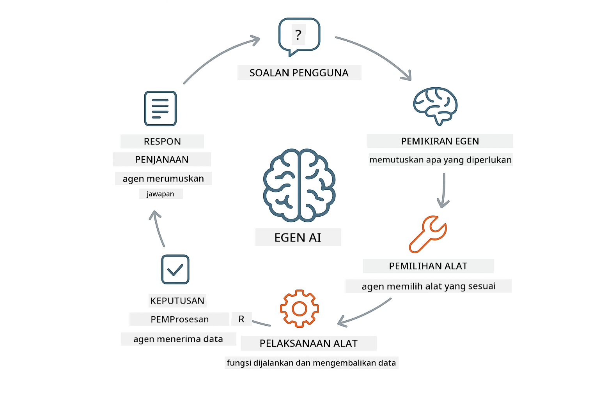

<!--
CO_OP_TRANSLATOR_METADATA:
{
  "original_hash": "13ec450c12cdd1a863baa2b778f27cd7",
  "translation_date": "2025-12-31T03:15:50+00:00",
  "source_file": "04-tools/README.md",
  "language_code": "ms"
}
-->
# Modul 04: Ejen AI dengan Alat

## Jadual Kandungan

- [Apa Yang Akan Anda Pelajari](../../../04-tools)
- [Prasyarat](../../../04-tools)
- [Memahami Ejen AI dengan Alat](../../../04-tools)
- [Bagaimana Panggilan Alat Berfungsi](../../../04-tools)
  - [Definisi Alat](../../../04-tools)
  - [Pembuatan Keputusan](../../../04-tools)
  - [Pelaksanaan](../../../04-tools)
  - [Penjanaan Respons](../../../04-tools)
- [Rantaian Alat](../../../04-tools)
- [Jalankan Aplikasi](../../../04-tools)
- [Menggunakan Aplikasi](../../../04-tools)
  - [Cuba Penggunaan Alat Mudah](../../../04-tools)
  - [Uji Rantaian Alat](../../../04-tools)
  - [Lihat Aliran Perbualan](../../../04-tools)
  - [Perhatikan Penalaran](../../../04-tools)
  - [Eksperimen dengan Permintaan Berbeza](../../../04-tools)
- [Konsep Utama](../../../04-tools)
  - [Corak ReAct (Penalaran dan Tindakan)](../../../04-tools)
  - [Penerangan Alat Penting](../../../04-tools)
  - [Pengurusan Sesi](../../../04-tools)
  - [Pengendalian Ralat](../../../04-tools)
- [Alat Tersedia](../../../04-tools)
- [Bila Menggunakan Ejen Berasaskan Alat](../../../04-tools)
- [Langkah Seterusnya](../../../04-tools)

## Apa Yang Akan Anda Pelajari

Setakat ini, anda telah belajar bagaimana mengadakan perbualan dengan AI, menyusun arahan (prompts) dengan berkesan, dan membumikan respons dalam dokumen anda. Tetapi masih terdapat satu batasan asas: model bahasa hanya boleh menjana teks. Ia tidak boleh menyemak cuaca, melakukan pengiraan, membuat pertanyaan ke atas pangkalan data, atau berinteraksi dengan sistem luaran.

Alat mengubah perkara ini. Dengan memberi model akses kepada fungsi yang boleh dipanggil, anda mengubahnya dari penjana teks menjadi ejen yang boleh mengambil tindakan. Model memutuskan bila ia memerlukan alat, alat mana yang hendak digunakan, dan parameter apa yang perlu dihantar. Kod anda melaksanakan fungsi tersebut dan mengembalikan keputusan. Model menggabungkan keputusan itu ke dalam responsnya.

## Prasyarat

- Menyelesaikan Modul 01 (sumber Azure OpenAI telah disebarkan)
- Fail `.env` di direktori root dengan kelayakan Azure (dicipta oleh `azd up` dalam Modul 01)

> **Nota:** Jika anda belum menyelesaikan Modul 01, ikut arahan penyebaran di sana terlebih dahulu.

## Memahami Ejen AI dengan Alat

> **📝 Nota:** Istilah "ejen" dalam modul ini merujuk kepada pembantu AI yang dipertingkatkan dengan kemampuan memanggil alat. Ini berbeza daripada corak **Agentic AI** (ejen autonomi dengan perancangan, memori, dan penalaran berbilang langkah) yang akan kita ulas dalam [Module 05: MCP](../05-mcp/README.md).

Ejen AI dengan alat mengikuti corak penalaran dan tindakan (ReAct):

1. Pengguna bertanya soalan
2. Ejen membuat penalaran tentang apa yang perlu diketahui
3. Ejen memutuskan jika ia memerlukan alat untuk menjawab
4. Jika ya, ejen memanggil alat yang sesuai dengan parameter yang betul
5. Alat melaksanakan dan mengembalikan data
6. Ejen memasukkan keputusan tersebut dan memberikan jawapan akhir



*Corak ReAct - bagaimana ejen AI beralih antara penalaran dan tindakan untuk menyelesaikan masalah*

Ini berlaku secara automatik. Anda mentakrifkan alat dan penerangannya. Model mengurus pembuatan keputusan bila dan bagaimana menggunakannya.

## Bagaimana Panggilan Alat Berfungsi

**Definisi Alat** - [WeatherTool.java](../../../04-tools/src/main/java/com/example/langchain4j/agents/tools/WeatherTool.java) | [TemperatureTool.java](../../../04-tools/src/main/java/com/example/langchain4j/agents/tools/TemperatureTool.java)

Anda mentakrifkan fungsi dengan penerangan yang jelas dan spesifikasi parameter. Model melihat penerangan ini dalam system prompt dan memahami apa yang setiap alat lakukan.

```java
@Component
public class WeatherTool {
    
    @Tool("Get the current weather for a location")
    public String getCurrentWeather(@P("Location name") String location) {
        // Logik carian cuaca anda
        return "Weather in " + location + ": 22°C, cloudy";
    }
}

@AiService
public interface Assistant {
    String chat(@MemoryId String sessionId, @UserMessage String message);
}

// Pembantu disambungkan secara automatik oleh Spring Boot dengan:
// - ChatModel bean
// - Semua kaedah @Tool daripada kelas @Component
// - ChatMemoryProvider untuk pengurusan sesi
```

> **🤖 Cuba dengan [GitHub Copilot](https://github.com/features/copilot) Chat:** Buka [`WeatherTool.java`](../../../04-tools/src/main/java/com/example/langchain4j/agents/tools/WeatherTool.java) dan tanya:
> - "Bagaimana saya boleh mengintegrasikan API cuaca sebenar seperti OpenWeatherMap menggantikan data tiruan?"
> - "Apa yang menjadikan penerangan alat yang baik yang membantu AI menggunakannya dengan betul?"
> - "Bagaimana saya mengendalikan ralat API dan had kadar dalam pelaksanaan alat?"

**Pembuatan Keputusan**

Apabila pengguna bertanya "Apa cuaca di Seattle?", model mengenal pasti ia memerlukan alat cuaca. Ia menjana panggilan fungsi dengan parameter lokasi ditetapkan kepada "Seattle".

**Pelaksanaan** - [AgentService.java](../../../04-tools/src/main/java/com/example/langchain4j/agents/service/AgentService.java)

Spring Boot mengautowire antara muka deklaratif `@AiService` dengan semua alat yang didaftarkan, dan LangChain4j melaksanakan panggilan alat secara automatik.

> **🤖 Cuba dengan [GitHub Copilot](https://github.com/features/copilot) Chat:** Buka [`AgentService.java`](../../../04-tools/src/main/java/com/example/langchain4j/agents/service/AgentService.java) dan tanya:
> - "Bagaimana corak ReAct berfungsi dan mengapa ia berkesan untuk ejen AI?"
> - "Bagaimana ejen memutuskan alat mana yang digunakan dan dalam susunan apa?"
> - "Apa yang berlaku jika pelaksanaan alat gagal - bagaimana saya harus mengendalikan ralat dengan kukuh?"

**Penjanaan Respons**

Model menerima data cuaca dan memformatkannya menjadi respons bahasa semula jadi untuk pengguna.

### Mengapa Menggunakan Perkhidmatan AI Deklaratif?

Modul ini menggunakan integrasi Spring Boot LangChain4j dengan antara muka `@AiService` deklaratif:

- **Spring Boot auto-wiring** - ChatModel dan alat disuntik secara automatik
- **Corak @MemoryId** - Pengurusan memori berasaskan sesi secara automatik
- **Satu instans** - Pembantu dicipta sekali dan digunakan semula untuk prestasi yang lebih baik
- **Pelaksanaan berjenis selamat** - Kaedah Java dipanggil terus dengan penukaran jenis
- **OrkestrasI berbilang-langkah** - Mengendalikan rantaian alat secara automatik
- **Tiada boilerplate** - Tiada panggilan manual AiServices.builder() atau HashMap memori

Pendekatan alternatif (manual `AiServices.builder()`) memerlukan lebih banyak kod dan kehilangan kelebihan integrasi Spring Boot.

## Rantaian Alat

**Rantaian Alat** - AI mungkin memanggil beberapa alat secara berurutan. Tanya "Apa cuaca di Seattle dan patutkah saya membawa payung?" dan perhatikan ia mengaitkan `getCurrentWeather` dengan penalaran tentang pakaian hujan.

<a href="images/tool-chaining.png"></a>

*Panggilan alat berurutan - output satu alat menjadi input kepada keputusan seterusnya*

**Kegagalan Terurus** - Minta cuaca untuk bandar yang tidak terdapat dalam data tiruan. Alat mengembalikan mesej ralat, dan AI menerangkan ia tidak dapat membantu. Alat gagal dengan selamat.

Ini berlaku dalam satu giliran perbualan. Ejen mengorkestrakan panggilan alat berganda secara autonomi.

## Jalankan Aplikasi

**Sahkan penyebaran:**

Pastikan fail `.env` wujud di direktori root dengan kelayakan Azure (dicipta semasa Modul 01):
```bash
cat ../.env  # Perlu menunjukkan AZURE_OPENAI_ENDPOINT, API_KEY, DEPLOYMENT
```

**Mulakan aplikasi:**

> **Nota:** Jika anda sudah memulakan semua aplikasi menggunakan `./start-all.sh` dari Modul 01, modul ini sudah berjalan pada port 8084. Anda boleh langkau arahan mula di bawah dan pergi terus ke http://localhost:8084.

**Pilihan 1: Menggunakan Spring Boot Dashboard (Disyorkan untuk pengguna VS Code)**

Kandungan dev container termasuk sambungan Spring Boot Dashboard, yang menyediakan antara muka visual untuk mengurus semua aplikasi Spring Boot. Anda boleh menemuinya di Bar Aktiviti di sebelah kiri VS Code (cari ikon Spring Boot).

Dari Spring Boot Dashboard, anda boleh:
- Melihat semua aplikasi Spring Boot yang tersedia dalam ruang kerja
- Mula/hentikan aplikasi dengan satu klik
- Lihat log aplikasi secara masa nyata
- Memantau status aplikasi

Klik butang main di sebelah "tools" untuk memulakan modul ini, atau mulakan semua modul sekaligus.


**Pilihan 2: Menggunakan skrip shell**

Mulakan semua aplikasi web (modul 01-04):

**Bash:**
```bash
cd ..  # Daripada direktori akar
./start-all.sh
```

**PowerShell:**
```powershell
cd ..  # Dari direktori akar
.\start-all.ps1
```

Atau mulakan hanya modul ini:

**Bash:**
```bash
cd 04-tools
./start.sh
```

**PowerShell:**
```powershell
cd 04-tools
.\start.ps1
```

Kedua-dua skrip secara automatik memuatkan pembolehubah persekitaran dari fail `.env` root dan akan membina JAR jika ia tidak wujud.

> **Nota:** Jika anda lebih suka membina semua modul secara manual sebelum memulakan:
>
> **Bash:**
> ```bash
> cd ..  # Go to root directory
> mvn clean package -DskipTests
> ```
>
> **PowerShell:**
> ```powershell
> cd ..  # Go to root directory
> mvn clean package -DskipTests
> ```

Buka http://localhost:8084 di pelayar anda.

**Untuk hentikan:**

**Bash:**
```bash
./stop.sh  # Hanya modul ini
# Atau
cd .. && ./stop-all.sh  # Semua modul
```

**PowerShell:**
```powershell
.\stop.ps1  # Hanya modul ini
# Atau
cd ..; .\stop-all.ps1  # Semua modul
```

## Menggunakan Aplikasi

Aplikasi menyediakan antara muka web di mana anda boleh berinteraksi dengan ejen AI yang mempunyai akses kepada alat cuaca dan penukaran suhu.

<a href="images/tools-homepage.png"></a>

*Antara Muka Alat Ejen AI - contoh pantas dan antara muka sembang untuk berinteraksi dengan alat*

**Cuba Penggunaan Alat Mudah**

Mulakan dengan permintaan mudah: "Tukar 100 darjah Fahrenheit kepada Celsius". Ejen mengenal pasti ia memerlukan alat penukaran suhu, memanggilnya dengan parameter yang betul, dan mengembalikan keputusan. Perhatikan betapa semulajadinya ini terasa - anda tidak menentukan alat mana yang digunakan atau bagaimana memanggilnya.

**Uji Rantaian Alat**

Sekarang cuba sesuatu yang lebih kompleks: "Apa cuaca di Seattle dan tukarkan ia kepada Fahrenheit?" Perhatikan ejen bekerja langkah demi langkah. Ia mula mendapat cuaca (yang mengembalikan Celsius), menyedari ia perlu menukar ke Fahrenheit, memanggil alat penukaran, dan menggabungkan kedua-dua keputusan ke dalam satu respons.

**Lihat Aliran Perbualan**

Antara muka sembang mengekalkan sejarah perbualan, membolehkan anda mempunyai interaksi berbilang giliran. Anda boleh melihat semua pertanyaan dan respons sebelumnya, memudahkan untuk menjejaki perbualan dan memahami bagaimana ejen membina konteks sepanjang pertukaran.

<a href="images/tools-conversation-demo.png"></a>

*Perbualan berbilang giliran yang menunjukkan penukaran mudah, carian cuaca, dan rantaian alat*

**Eksperimen dengan Permintaan Berbeza**

Cuba pelbagai gabungan:
- Carian cuaca: "Apa cuaca di Tokyo?"
- Penukaran suhu: "Berapa 25°C dalam Kelvin?"
- Pertanyaan gabungan: "Semak cuaca di Paris dan beritahu saya jika ia melebihi 20°C"

Perhatikan bagaimana ejen mentafsir bahasa semula jadi dan memetakannya kepada panggilan alat yang sesuai.

## Konsep Utama

**Corak ReAct (Penalaran dan Tindakan)**

Ejen bertukar-tukar antara penalaran (memutuskan apa yang perlu dilakukan) dan tindakan (menggunakan alat). Corak ini membolehkan penyelesaian masalah secara autonomi dan bukannya sekadar bertindak mengikut arahan.

**Penerangan Alat Penting**

Kualiti penerangan alat anda secara langsung mempengaruhi sejauh mana ejen menggunakannya dengan betul. Penerangan yang jelas dan spesifik membantu model memahami bila dan bagaimana memanggil setiap alat.

**Pengurusan Sesi**

Anotasi `@MemoryId` membolehkan pengurusan memori berasaskan sesi secara automatik. Setiap ID sesi mendapat instans `ChatMemory` sendiri yang diurus oleh bean `ChatMemoryProvider`, menghapuskan keperluan untuk penjejakan memori manual.

**Pengendalian Ralat**

Alat boleh gagal - API tamat masa, parameter mungkin tidak sah, perkhidmatan luaran turun. Ejen pengeluaran memerlukan pengendalian ralat supaya model dapat menerangkan masalah atau mencuba alternatif.

## Alat Tersedia

**Alat Cuaca** (data tiruan untuk demonstrasi):
- Dapatkan cuaca semasa untuk sesuatu lokasi
- Dapatkan ramalan berbilang-hari

**Alat Penukaran Suhu**:
- Celsius ke Fahrenheit
- Fahrenheit ke Celsius
- Celsius ke Kelvin
- Kelvin ke Celsius
- Fahrenheit ke Kelvin
- Kelvin ke Fahrenheit

Ini adalah contoh mudah, tetapi corak ini meluas kepada mana-mana fungsi: pertanyaan pangkalan data, panggilan API, pengiraan, operasi fail, atau arahan sistem.

## Bila Menggunakan Ejen Berasaskan Alat

**Gunakan alat apabila:**
- Menjawab memerlukan data masa nyata (cuaca, harga saham, inventori)
- Anda perlu melakukan pengiraan yang melebihi matematik ringkas
- Mengakses pangkalan data atau API
- Mengambil tindakan (menghantar emel, membuat tiket, mengemaskini rekod)
- Menggabungkan pelbagai sumber data

**Jangan gunakan alat apabila:**
- Soalan boleh dijawab daripada pengetahuan umum
- Respons semata-mata bersifat perbualan
- Latensi alat akan menjadikan pengalaman terlalu perlahan

## Langkah Seterusnya

**Modul Seterusnya:** [05-mcp - Model Context Protocol (MCP)](../05-mcp/README.md)

---

**Navigasi:** [← Sebelumnya: Modul 03 - RAG](../03-rag/README.md) | [Kembali ke Utama](../README.md) | [Seterusnya: Modul 05 - MCP →](../05-mcp/README.md)

---

<!-- CO-OP TRANSLATOR DISCLAIMER START -->
Penafian:
Dokumen ini telah diterjemahkan menggunakan perkhidmatan terjemahan AI [Co-op Translator](https://github.com/Azure/co-op-translator). Walaupun kami berusaha mencapai ketepatan, sila ambil perhatian bahawa terjemahan automatik mungkin mengandungi ralat atau ketidaktepatan. Dokumen asal dalam bahasa asalnya hendaklah dianggap sebagai sumber yang sahih. Untuk maklumat penting, terjemahan profesional oleh penterjemah manusia adalah disyorkan. Kami tidak bertanggungjawab terhadap sebarang salah faham atau salah tafsir yang timbul daripada penggunaan terjemahan ini.
<!-- CO-OP TRANSLATOR DISCLAIMER END -->