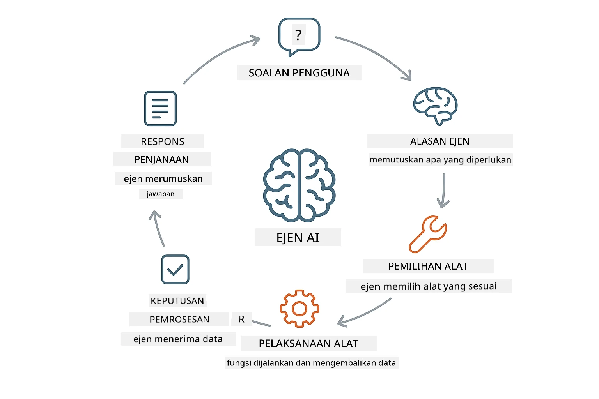
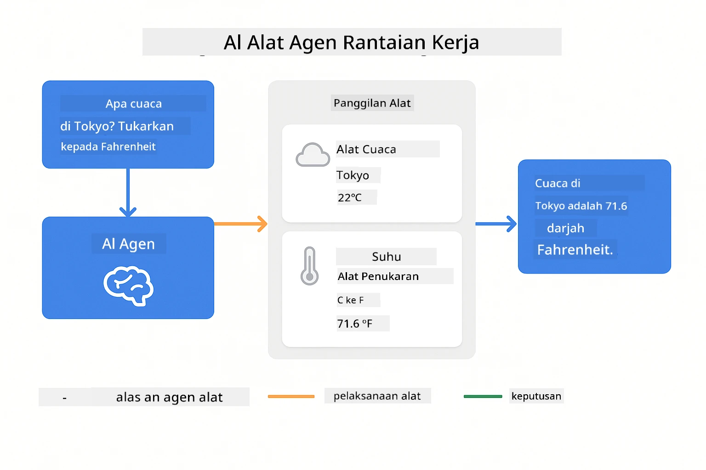
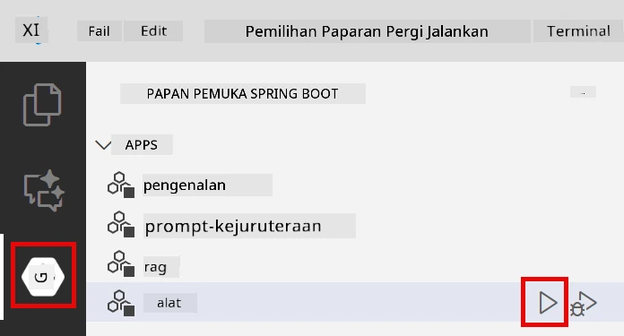
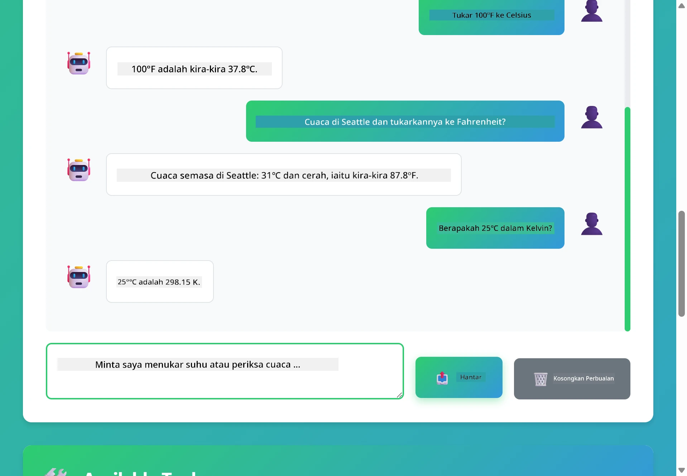

# Modul 04: Ejen AI dengan Alat

## Jadual Kandungan

- [Apa yang Anda Akan Pelajari](../../../04-tools)
- [Prasyarat](../../../04-tools)
- [Memahami Ejen AI dengan Alat](../../../04-tools)
- [Bagaimana Panggilan Alat Berfungsi](../../../04-tools)
  - [Definisi Alat](../../../04-tools)
  - [Pengambilan Keputusan](../../../04-tools)
  - [Pelaksanaan](../../../04-tools)
  - [Penjanaan Respons](../../../04-tools)
- [Rantaian Alat](../../../04-tools)
- [Jalankan Aplikasi](../../../04-tools)
- [Menggunakan Aplikasi](../../../04-tools)
  - [Cuba Penggunaan Alat Mudah](../../../04-tools)
  - [Uji Rantaian Alat](../../../04-tools)
  - [Lihat Aliran Perbualan](../../../04-tools)
  - [Eksperimen dengan Permintaan Berbeza](../../../04-tools)
- [Konsep Utama](../../../04-tools)
  - [Corak ReAct (Penalaran dan Bertindak)](../../../04-tools)
  - [Deskripsi Alat Penting](../../../04-tools)
  - [Pengurusan Sesi](../../../04-tools)
  - [Pengendalian Ralat](../../../04-tools)
- [Alat Tersedia](../../../04-tools)
- [Bila Menggunakan Ejen Berasaskan Alat](../../../04-tools)
- [Langkah Seterusnya](../../../04-tools)

## Apa yang Anda Akan Pelajari

Sehingga kini, anda telah belajar bagaimana untuk bersembang dengan AI, menyusun arahan dengan berkesan, dan mendasari respons dalam dokumen anda. Tetapi masih ada had asas: model bahasa hanya boleh menjana teks. Ia tidak boleh memeriksa cuaca, melakukan pengiraan, membuat pertanyaan pangkalan data, atau berinteraksi dengan sistem luar.

Alat mengubah ini. Dengan memberikan model akses kepada fungsi yang boleh ia panggil, anda mengubahnya dari penjana teks menjadi ejen yang boleh mengambil tindakan. Model memutuskan bila ia memerlukan alat, alat mana yang hendak digunakan, dan parameter apa yang hendak dihantar. Kod anda melaksanakan fungsi itu dan mengembalikan hasilnya. Model memasukkan hasil itu ke dalam responsnya.

## Prasyarat

- Menyelesaikan Modul 01 (sumber Azure OpenAI telah dideploy)
- Fail `.env` di direktori utama dengan kelayakan Azure (dibuat oleh `azd up` dalam Modul 01)

> **Nota:** Jika anda belum menyiapkan Modul 01, ikuti arahan pengedaran di situ dahulu.

## Memahami Ejen AI dengan Alat

> **📝 Nota:** Istilah "ejen" dalam modul ini merujuk kepada pembantu AI yang dipertingkatkan dengan keupayaan panggilan alat. Ini berbeza dengan corak **Agentic AI** (ejen autonomi dengan perancangan, memori, dan penalaran berbilang langkah) yang akan kita bahas dalam [Modul 05: MCP](../05-mcp/README.md).

Ejen AI dengan alat mengikuti corak penalaran dan bertindak (ReAct):

1. Pengguna mengemukakan soalan
2. Ejen berfikir tentang apa yang perlu diketahui
3. Ejen memutuskan jika ia memerlukan alat untuk menjawab
4. Jika ya, ejen memanggil alat yang sesuai dengan parameter betul
5. Alat melaksanakan dan mengembalikan data
6. Ejen memasukkan hasil itu dan memberi jawapan akhir



*Corak ReAct - bagaimana ejen AI bergilir-gilir antara penalaran dan tindakan untuk menyelesaikan masalah*

Ini berlaku secara automatik. Anda mentakrif alat dan deskripsi mereka. Model mengendalikan pengambilan keputusan bila dan bagaimana menggunakannya.

## Bagaimana Panggilan Alat Berfungsi

### Definisi Alat

[WeatherTool.java](../../../04-tools/src/main/java/com/example/langchain4j/agents/tools/WeatherTool.java) | [TemperatureTool.java](../../../04-tools/src/main/java/com/example/langchain4j/agents/tools/TemperatureTool.java)

Anda mentakrif fungsi dengan deskripsi jelas dan spesifikasi parameter. Model melihat deskripsi ini dalam arahan sistemnya dan memahami apa yang setiap alat lakukan.

```java
@Component
public class WeatherTool {
    
    @Tool("Get the current weather for a location")
    public String getCurrentWeather(@P("Location name") String location) {
        // Logik carian cuaca anda
        return "Weather in " + location + ": 22°C, cloudy";
    }
}

@AiService
public interface Assistant {
    String chat(@MemoryId String sessionId, @UserMessage String message);
}

// Pembantu disambungkan secara automatik oleh Spring Boot dengan:
// - Bean ChatModel
// - Semua kaedah @Tool dari kelas @Component
// - ChatMemoryProvider untuk pengurusan sesi
```

> **🤖 Cuba dengan [GitHub Copilot](https://github.com/features/copilot) Chat:** Buka [`WeatherTool.java`](../../../04-tools/src/main/java/com/example/langchain4j/agents/tools/WeatherTool.java) dan tanya:
> - "Bagaimana saya boleh mengintegrasikan API cuaca sebenar seperti OpenWeatherMap ganti data tiruan?"
> - "Apa yang membuat deskripsi alat yang baik supaya AI boleh menggunakannya dengan betul?"
> - "Bagaimana saya mengendalikan ralat API dan had kadar dalam pelaksanaan alat?"

### Pengambilan Keputusan

Apabila pengguna bertanya "Apa cuaca di Seattle?", model mengenal pasti ia memerlukan alat cuaca. Ia menjana panggilan fungsi dengan parameter lokasi diset ke "Seattle".

### Pelaksanaan

[AgentService.java](../../../04-tools/src/main/java/com/example/langchain4j/agents/service/AgentService.java)

Spring Boot secara automatik memautkan antara muka deklaratif `@AiService` dengan semua alat berdaftar, dan LangChain4j melaksanakan panggilan alat secara automatik.

> **🤖 Cuba dengan [GitHub Copilot](https://github.com/features/copilot) Chat:** Buka [`AgentService.java`](../../../04-tools/src/main/java/com/example/langchain4j/agents/service/AgentService.java) dan tanya:
> - "Bagaimana corak ReAct berfungsi dan mengapa ia berkesan untuk ejen AI?"
> - "Bagaimana ejen memutuskan alat mana untuk digunakan dan dalam susunan apa?"
> - "Apa yang berlaku jika pelaksanaan alat gagal - bagaimana saya harus mengendalikan ralat dengan kukuh?"

### Penjanaan Respons

Model menerima data cuaca dan memformatnya menjadi respons bahasa semula jadi untuk pengguna.

### Kenapa Gunakan Perkhidmatan AI Deklaratif?

Modul ini menggunakan integrasi LangChain4j Spring Boot dengan antara muka deklaratif `@AiService`:

- **Pautan automatik Spring Boot** - ChatModel dan alat dimasukkan secara automatik
- **Corak @MemoryId** - Pengurusan memori berasaskan sesi secara automatik
- **Satu instans sahaja** - Pembantu dicipta sekali dan digunakan semula untuk prestasi lebih baik
- **Pelaksanaan jenis-selamat** - Kaedah Java dipanggil terus dengan penukaran jenis
- **Orkestrasi pelbagai giliran** - Mengendalikan rantaian alat secara automatik
- **Tiada kod tambahan** - Tiada panggilan manual AiServices.builder() atau HashMap memori

Pendekatan alternatif (manual `AiServices.builder()`) memerlukan lebih banyak kod dan kehilangan manfaat integrasi Spring Boot.

## Rantaian Alat

**Rantaian Alat** - AI mungkin memanggil beberapa alat secara berturutan. Tanya "Apa cuaca di Seattle dan patutkah saya bawa payung?" dan lihat ia merantai `getCurrentWeather` dengan penalaran tentang peralatan hujan.

<a href="images/tool-chaining.png"></a>

*Panggilan alat berturutan - output satu alat menjadi input keputusan seterusnya*

**Kegagalan Sopan** - Tanya cuaca di bandar yang tidak ada dalam data tiruan. Alat mengembalikan mesej ralat, dan AI menerangkan ia tidak dapat membantu. Alat gagal dengan selamat.

Ini berlaku dalam satu giliran perbualan. Ejen mengatur beberapa panggilan alat secara autonomi.

## Jalankan Aplikasi

**Sahkan pengedaran:**

Pastikan fail `.env` wujud di direktori utama dengan kelayakan Azure (dibuat semasa Modul 01):
```bash
cat ../.env  # Patut menunjukkan AZURE_OPENAI_ENDPOINT, API_KEY, DEPLOYMENT
```

**Mulakan aplikasi:**

> **Nota:** Jika anda sudah memulakan semua aplikasi menggunakan `./start-all.sh` dari Modul 01, modul ini sudah berjalan pada port 8084. Anda boleh langkau arahan mula di bawah dan terus ke http://localhost:8084.

**Pilihan 1: Menggunakan Spring Boot Dashboard (Dicadangkan untuk pengguna VS Code)**

Bekas pembangunan menyertakan peluasan Spring Boot Dashboard, yang menyediakan antara muka visual untuk mengurus semua aplikasi Spring Boot. Anda boleh mencarinya di Bar Aktiviti di sebelah kiri VS Code (cari ikon Spring Boot).

Dari Spring Boot Dashboard, anda boleh:
- Lihat semua aplikasi Spring Boot tersedia dalam ruang kerja
- Mulakan/hentikan aplikasi dengan satu klik
- Lihat log aplikasi secara masa nyata
- Pantau status aplikasi

Klik butang main di sebelah "tools" untuk memulakan modul ini, atau mulakan semua modul sekaligus.



**Pilihan 2: Menggunakan skrip shell**

Mulakan semua aplikasi web (modul 01-04):

**Bash:**
```bash
cd ..  # Dari direktori akar
./start-all.sh
```

**PowerShell:**
```powershell
cd ..  # Dari direktori root
.\start-all.ps1
```

Atau mulakan hanya modul ini:

**Bash:**
```bash
cd 04-tools
./start.sh
```

**PowerShell:**
```powershell
cd 04-tools
.\start.ps1
```

Kedua-dua skrip memuatkan pembolehubah persekitaran dari fail `.env` root secara automatik dan akan membina JAR jika belum wujud.

> **Nota:** Jika anda lebih suka membina semua modul secara manual sebelum mula:
>
> **Bash:**
> ```bash
> cd ..  # Go to root directory
> mvn clean package -DskipTests
> ```
>
> **PowerShell:**
> ```powershell
> cd ..  # Go to root directory
> mvn clean package -DskipTests
> ```

Buka http://localhost:8084 dalam pelayar anda.

**Untuk berhenti:**

**Bash:**
```bash
./stop.sh  # Modul ini sahaja
# Atau
cd .. && ./stop-all.sh  # Semua modul
```

**PowerShell:**
```powershell
.\stop.ps1  # Modul ini sahaja
# Atau
cd ..; .\stop-all.ps1  # Semua modul
```

## Menggunakan Aplikasi

Aplikasi menyediakan antara muka web di mana anda boleh berinteraksi dengan ejen AI yang mempunyai akses kepada alat cuaca dan penukaran suhu.

<a href="images/tools-homepage.png"></a>

*Antara muka Alat Ejen AI - contoh cepat dan antara muka sembang untuk berinteraksi dengan alat*

### Cuba Penggunaan Alat Mudah

Mulakan dengan permintaan mudah: "Tukar 100 darjah Fahrenheit ke Celsius". Ejen mengenali ia memerlukan alat penukaran suhu, memanggilnya dengan parameter betul, dan mengembalikan hasil. Perhatikan bagaimana ia terasa semula jadi - anda tidak menyatakan alat mana hendak digunakan atau bagaimana memanggilnya.

### Uji Rantaian Alat

Sekarang cuba sesuatu yang lebih kompleks: "Apa cuaca di Seattle dan tukarkan ke Fahrenheit?" Lihat ejen bekerja langkah demi langkah. Ia mula dapatkan cuaca (yang kembali dalam Celsius), mengenali ia perlu menukar ke Fahrenheit, memanggil alat penukaran, dan menggabungkan kedua-dua hasil itu menjadi satu respons.

### Lihat Aliran Perbualan

Antara muka sembang menyimpan sejarah perbualan, membolehkan anda berinteraksi berbilang giliran. Anda boleh melihat semua pertanyaan dan respons sebelumnya, memudahkan menjejaki perbualan dan memahami bagaimana ejen membina konteks sepanjang pertukaran.

<a href="images/tools-conversation-demo.png"></a>

*Perbualan berbilang giliran menunjukkan penukaran mudah, carian cuaca, dan rantaian alat*

### Eksperimen dengan Permintaan Berbeza

Cuba pelbagai gabungan:
- Carian cuaca: "Apa cuaca di Tokyo?"
- Penukaran suhu: "Berapa 25°C dalam Kelvin?"
- Soalan gabungan: "Semak cuaca di Paris dan beritahu jika lebih dari 20°C"

Perhatikan bagaimana ejen mentafsir bahasa semula jadi dan memadankan ke panggilan alat yang sesuai.

## Konsep Utama

### Corak ReAct (Penalaran dan Bertindak)

Ejen bergilir antara penalaran (memutuskan apa hendak dibuat) dan bertindak (menggunakan alat). Corak ini membolehkan penyelesaian masalah autonomi dan bukan sekadar respon arahan.

### Deskripsi Alat Penting

Kualiti deskripsi alat anda terus mempengaruhi bagaimana baik ejen menggunakannya. Deskripsi yang jelas dan spesifik membantu model faham bila dan bagaimana memanggil setiap alat.

### Pengurusan Sesi

Anotasi `@MemoryId` mengaktifkan pengurusan memori berasaskan sesi secara automatik. Setiap ID sesi mendapat instans `ChatMemory` sendiri yang dikendalikan oleh bean `ChatMemoryProvider`, menghilangkan keperluan untuk penjejakan memori manual.

### Pengendalian Ralat

Alat boleh gagal - API tamat masa, parameter mungkin tidak sah, perkhidmatan luar turun. Ejen produksi memerlukan pengendalian ralat supaya model boleh menerangkan masalah atau cuba alternatif.

## Alat Tersedia

**Alat Cuaca** (data tiruan untuk demontrasi):
- Dapatkan cuaca semasa untuk sesuatu lokasi
- Dapatkan ramalan berbilang hari

**Alat Penukaran Suhu**:
- Celsius ke Fahrenheit
- Fahrenheit ke Celsius
- Celsius ke Kelvin
- Kelvin ke Celsius
- Fahrenheit ke Kelvin
- Kelvin ke Fahrenheit

Ini contoh mudah, tetapi corak ini meluas ke mana-mana fungsi: pertanyaan pangkalan data, panggilan API, pengiraan, operasi fail, atau arahan sistem.

## Bila Menggunakan Ejen Berasaskan Alat

**Gunakan alat apabila:**
- Menjawab memerlukan data masa nyata (cuaca, harga saham, inventori)
- Anda perlu melakukan pengiraan lebih daripada matematik mudah
- Mengakses pangkalan data atau API
- Mengambil tindakan (menghantar email, mencipta tiket, mengemas kini rekod)
- Menggabungkan pelbagai sumber data

**Jangan gunakan alat apabila:**
- Soalan boleh dijawab dari pengetahuan umum
- Respons hanya bersifat perbualan
- Kelewatan alat akan menjadikan pengalaman terlalu perlahan

## Langkah Seterusnya

**Modul Seterusnya:** [05-mcp - Protokol Konteks Model (MCP)](../05-mcp/README.md)

---

**Navigasi:** [← Sebelumnya: Modul 03 - RAG](../03-rag/README.md) | [Kembali ke Utama](../README.md) | [Seterusnya: Modul 05 - MCP →](../05-mcp/README.md)

---

<!-- CO-OP TRANSLATOR DISCLAIMER START -->
**Penafian**:
Dokumen ini telah diterjemahkan menggunakan perkhidmatan terjemahan AI [Co-op Translator](https://github.com/Azure/co-op-translator). Walaupun kami berusaha untuk ketepatan, sila maklum bahawa terjemahan automatik mungkin mengandungi kesilapan atau ketidaktepatan. Dokumen asal dalam bahasa asalnya harus dianggap sebagai sumber yang sahih. Untuk maklumat penting, terjemahan profesional oleh manusia adalah disyorkan. Kami tidak bertanggungjawab terhadap sebarang salah faham atau salah tafsir yang timbul daripada penggunaan terjemahan ini.
<!-- CO-OP TRANSLATOR DISCLAIMER END -->