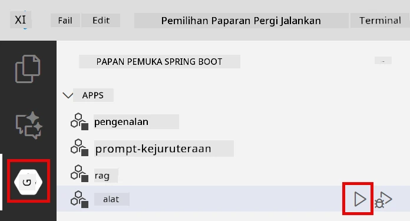
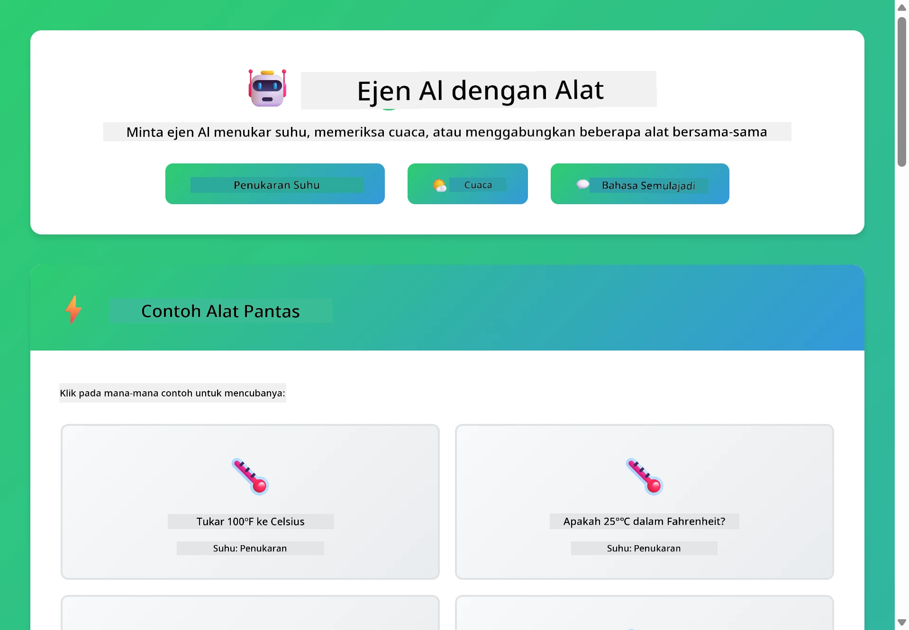
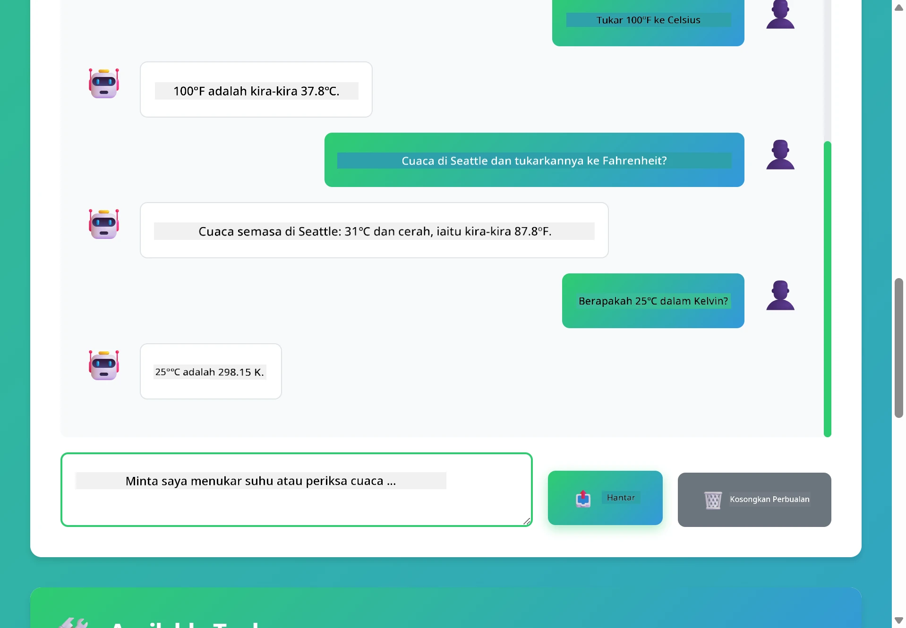

# Modul 04: Ejen AI dengan Alat

## Jadual Kandungan

- [Video Panduan](#video-panduan)
- [Apa yang Anda Akan Pelajari](#apa-yang-anda-akan-pelajari)
- [Prasyarat](#prasyarat)
- [Memahami Ejen AI dengan Alat](#memahami-ejen-ai-dengan-alat)
- [Bagaimana Panggilan Alat Berfungsi](#bagaimana-panggilan-alat-berfungsi)
  - [Definisi Alat](#definisi-alat)
  - [Pengambilan Keputusan](#pengambilan-keputusan)
  - [Pelaksanaan](#pelaksanaan)
  - [Penciptaan Respons](#penciptaan-respons)
  - [Seni Bina: Auto-Wiring Spring Boot](#seni-bina-auto-wiring-spring-boot)
- [Rantaian Alat](#rantaian-alat)
- [Jalankan Aplikasi](#jalankan-aplikasi)
- [Menggunakan Aplikasi](#menggunakan-aplikasi)
  - [Cuba Penggunaan Alat Ringkas](#cuba-penggunaan-alat-mudah)
  - [Uji Rantaian Alat](#uji-rantaian-alat)
  - [Lihat Aliran Perbualan](#lihat-aliran-perbualan)
  - [Eksperimen dengan Permintaan Berbeza](#cuba-permintaan-berbeza)
- [Konsep Utama](#konsep-utama)
  - [Corak ReAct (Berfikir dan Bertindak)](#corak-react-penalaran-dan-tindakan)
  - [Penerangan Alat Penting](#penerangan-alat-penting)
  - [Pengurusan Sesi](#pengurusan-sesi)
  - [Pengendalian Ralat](#pengendalian-ralat)
- [Alat yang Tersedia](#alat-tersedia)
- [Bila Menggunakan Ejen Berasaskan Alat](#bila-perlu-guna-ejen-berasaskan-alat)
- [Alat vs RAG](#alat-vs-rag)
- [Langkah Seterusnya](#langkah-seterusnya)

## Video Panduan

Tonton sesi langsung ini yang menerangkan cara memulakan modul ini:

<a href="https://www.youtube.com/watch?v=O_J30kZc0rw"></a>

## Apa yang Anda Akan Pelajari

Setakat ini, anda telah belajar bagaimana mengadakan perbualan dengan AI, menyusun prompt dengan berkesan, dan mengikat respons dalam dokumen anda. Tetapi masih terdapat had asas: model bahasa hanya boleh menjana teks. Ia tidak boleh menyemak cuaca, melakukan pengiraan, membuat pertanyaan pangkalan data, atau berinteraksi dengan sistem luaran.

Alat mengubah ini. Dengan memberi model akses kepada fungsi yang boleh dipanggil, anda menukarnya dari penjana teks menjadi ejen yang boleh bertindak. Model menentukan bila ia memerlukan alat, alat mana yang akan digunakan, dan parameter apa untuk dihantar. Kod anda melaksanakan fungsi itu dan memulangkan hasilnya. Model menggabungkan hasil itu ke dalam responsnya.

## Prasyarat

- Telah menyelesaikan [Modul 01 - Pengenalan](../01-introduction/README.md) (sumber Azure OpenAI telah dikerahkan)
- Modul terdahulu disyorkan diselesaikan (modul ini merujuk [konsep RAG dari Modul 03](../03-rag/README.md) dalam perbandingan Alat vs RAG)
- Fail `.env` di direktori akar dengan kredensial Azure (dicipta oleh `azd up` dalam Modul 01)

> **Nota:** Jika anda belum menyelesaikan Modul 01, ikuti arahan penerapan di sana terlebih dahulu.

## Memahami Ejen AI dengan Alat

> **📝 Nota:** Istilah "ejen" dalam modul ini merujuk kepada pembantu AI yang dipertingkatkan dengan kemampuan panggilan alat. Ini berbeza dengan corak **Agentic AI** (ejen autonomi dengan perancangan, ingatan, dan penaakulan berbilang langkah) yang akan kita bincangkan dalam [Modul 05: MCP](../05-mcp/README.md).

Tanpa alat, model bahasa hanya boleh menjana teks berdasarkan data latihannya. Tanya cuaca semasa, ia terpaksa mengagak. Beri alat, ia boleh memanggil API cuaca, melakukan pengiraan, atau bertanya pangkalan data — kemudian mengaitkan keputusan sebenar itu ke dalam responsnya.


*Tanpa alat model hanya mengagak — dengan alat ia boleh memanggil API, menjalankan pengiraan, dan memulangkan data masa nyata.*

Ejen AI dengan alat mengikuti corak **Berfikir dan Bertindak (ReAct)**. Model bukan sekadar memberi respons — ia memikirkan apa yang diperlukan, bertindak dengan memanggil alat, memerhati hasil, dan kemudian memutuskan sama ada bertindak lagi atau memberikan jawapan akhir:

1. **Berfikir** — Ejen menganalisis soalan pengguna dan menentukan maklumat yang diperlukan  
2. **Bertindak** — Ejen memilih alat yang tepat, menjana parameter yang betul, dan memanggilnya  
3. **Memerhati** — Ejen menerima output alat dan menilai hasilnya  
4. **Ulang atau Respons** — Jika data lebih diperlukan, ejen mengulangi; jika tidak, ia menyusun jawapan dalam bahasa semula jadi  


*Kitaran ReAct — ejen berfikir tentang apa yang perlu dilakukan, bertindak dengan memanggil alat, memerhati hasil, dan mengulangi sehingga boleh memberikan jawapan akhir.*

Ini berlaku secara automatik. Anda mentakrifkan alat dan penerangannya. Model mengurus pengambilan keputusan bila dan bagaimana menggunakannya.

## Bagaimana Panggilan Alat Berfungsi

### Definisi Alat

[WeatherTool.java](../../../04-tools/src/main/java/com/example/langchain4j/agents/tools/WeatherTool.java) | [TemperatureTool.java](../../../04-tools/src/main/java/com/example/langchain4j/agents/tools/TemperatureTool.java)

Anda mentakrifkan fungsi dengan penerangan jelas dan spesifikasi parameter. Model melihat penerangan ini dalam prompt sistemnya dan memahami apa yang dilakukan oleh setiap alat.

```java
@Component
public class WeatherTool {
    
    @Tool("Get the current weather for a location")
    public String getCurrentWeather(@P("Location name") String location) {
        // Logik carian cuaca anda
        return "Weather in " + location + ": 22°C, cloudy";
    }
}

@AiService
public interface Assistant {
    String chat(@MemoryId String sessionId, @UserMessage String message);
}

// Pembantu secara automatik dihubungkan oleh Spring Boot dengan:
// - Bean ChatModel
// - Semua kaedah @Tool dari kelas @Component
// - ChatMemoryProvider untuk pengurusan sesi
```
  
Rajah di bawah memperincikan setiap anotasi dan menunjukkan bagaimana setiap bahagian membantu AI memahami bila untuk memanggil alat dan argumen apa yang perlu dihantar:


*Anatomi definisi alat — @Tool memberitahu AI bila menggunakannya, @P menerangkan setiap parameter, dan @AiService menghubungkan semuanya semasa startup.*

> **🤖 Cuba dengan [GitHub Copilot](https://github.com/features/copilot) Chat:** Buka [`WeatherTool.java`](../../../04-tools/src/main/java/com/example/langchain4j/agents/tools/WeatherTool.java) dan tanya:  
> - "Bagaimana saya mengintegrasikan API cuaca sebenar seperti OpenWeatherMap menggantikan data tiruan?"  
> - "Apakah yang menjadikan penerangan alat yang baik supaya AI menggunakannya dengan betul?"  
> - "Bagaimana saya mengendalikan ralat API dan had kadar dalam pelaksanaan alat?"

### Pengambilan Keputusan

Apabila pengguna bertanya "Bagaimana cuaca di Seattle?", model tidak memilih alat secara rawak. Ia membandingkan niat pengguna dengan setiap penerangan alat yang ada, memberikan skor kepentingan, dan memilih padanan terbaik. Model kemudian menjana panggilan fungsi berstruktur dengan parameter tepat — dalam kes ini, menetapkan `location` kepada `"Seattle"`.

Jika tiada alat sesuai dengan permintaan pengguna, model kembali menjawab berdasarkan pengetahuannya sendiri. Jika beberapa alat sesuai, ia memilih yang paling khusus.


*Model menilai setiap alat tersedia berbanding niat pengguna dan memilih padanan terbaik — sebab itulah menulis penerangan alat yang jelas dan spesifik adalah penting.*

### Pelaksanaan

[AgentService.java](../../../04-tools/src/main/java/com/example/langchain4j/agents/service/AgentService.java)

Spring Boot auto-wire antara muka deklaratif `@AiService` dengan semua alat berdaftar, dan LangChain4j melaksanakan panggilan alat secara automatik. Di belakang tabir, panggilan alat lengkap melalui enam peringkat — dari soalan bahasa semula jadi pengguna kembali ke jawapan bahasa semula jadi:


*Aliran hujung ke hujung — pengguna bertanya soalan, model memilih alat, LangChain4j melaksanakan, dan model menganyam hasilnya ke dalam respons semula jadi.*

Di belakang tabir, `AiServices` menjalankan gelung panggilan alat yang sama untuk mana-mana alat — di sini digambarkan dengan `Calculator` yang ringkas. Rajah susunan di bawah menunjukkan dengan tepat apa yang berlaku di belakang tabir:


*Gulung panggilan alat — `AiServices` menghantar mesej anda dan skema alat ke LLM, LLM membalas dengan panggilan fungsi seperti `add(42, 58)`, LangChain4j melaksanakan metod `Calculator` secara tempatan, dan memulangkan hasil untuk jawapan akhir.*

> **🤖 Cuba dengan [GitHub Copilot](https://github.com/features/copilot) Chat:** Buka [`AgentService.java`](../../../04-tools/src/main/java/com/example/langchain4j/agents/service/AgentService.java) dan tanya:  
> - "Bagaimana corak ReAct berfungsi dan mengapa ia berkesan untuk ejen AI?"  
> - "Bagaimana ejen menentukan alat mana yang hendak digunakan dan dalam susunan apa?"  
> - "Apa yang berlaku jika pelaksanaan alat gagal - bagaimana saya hendak mengendalikan ralat secara kukuh?"

### Penciptaan Respons

Model menerima data cuaca dan memformatnya ke dalam respons bahasa semula jadi untuk pengguna.

### Seni Bina: Auto-Wiring Spring Boot

Modul ini menggunakan integrasi Spring Boot LangChain4j dengan antara muka deklaratif `@AiService`. Semasa startup, Spring Boot menemui setiap `@Component` yang mengandungi metod `@Tool`, bean `ChatModel` anda, dan `ChatMemoryProvider` — kemudian menghubungkannya semuanya ke dalam satu antara muka `Assistant` tanpa sebarang kod boilerplate.


*Antara muka @AiService mengikat bersama ChatModel, komponen alat, dan penyedia memori — Spring Boot menguruskan semua wiring secara automatik.*

Berikut adalah kitaran hidup permintaan penuh sebagai rajah susunan — dari permintaan HTTP melalui controller, service, dan proksi auto-wired, hingga pelaksanaan alat dan kembali:


*Kitaran hidup permintaan Spring Boot lengkap — permintaan HTTP mengalir melalui controller dan service ke proksi Assistant auto-wired, yang mengatur LLM dan panggilan alat secara automatik.*

Manfaat utama pendekatan ini:

- **Auto-wiring Spring Boot** — ChatModel dan alat disuntik secara automatik  
- **Corak @MemoryId** — Pengurusan memori berasaskan sesi secara automatik  
- **Instans tunggal** — Assistant dicipta sekali dan digunakan semula untuk prestasi lebih baik  
- **Pelaksanaan selamat jenis** — Metod Java dipanggil terus dengan penukaran jenis  
- **Orkestrasi berbilang giliran** — Mengawal rantaian alat secara automatik  
- **Tiada boilerplate** — Tiada panggilan manual `AiServices.builder()` atau HashMap memori  

Pendekatan alternatif (manual `AiServices.builder()`) memerlukan lebih banyak kod dan tidak mendapat manfaat integrasi Spring Boot.

## Rantaian Alat

**Rantaian Alat** — Kuasa sebenar ejen berasaskan alat muncul apabila satu soalan memerlukan pelbagai alat. Tanya "Bagaimana cuaca di Seattle dalam Fahrenheit?" dan ejen secara automatik menyambungkan dua alat: pertama ia memanggil `getCurrentWeather` untuk mendapatkan suhu dalam Celsius, kemudian menghantar nilai itu ke `celsiusToFahrenheit` untuk penukaran — semuanya dalam satu giliran perbualan.


*Rantaian alat dalam tindakan — ejen memanggil getCurrentWeather dahulu, kemudian menyalurkan hasil Celsius ke celsiusToFahrenheit, dan memberikan jawapan gabungan.*

**Kegagalan Anggun** — Tanya cuaca di bandar yang tiada dalam data tiruan. Alat memulangkan mesej ralat, dan AI menerangkan ia tidak boleh membantu daripada aplikasi terhenti. Alat gagal dengan selamat. Rajah di bawah membezakan dua pendekatan — dengan pengendalian ralat yang betul, ejen menangkap pengecualian dan menjawab dengan bantuan, manakala tanpa ia aplikasi keseluruhan terhenti:


*Apabila alat gagal, ejen menangkap ralat dan memberi penjelasan berguna berbanding aplikasi yang terhenti.*

Ini berlaku dalam satu giliran perbualan. Ejen mengatur panggilan pelbagai alat secara autonomi.

## Jalankan Aplikasi

**Sahkan penerapan:**

Pastikan fail `.env` wujud di direktori akar dengan kredensial Azure (dicipta semasa Modul 01). Jalankan ini dari direktori modul (`04-tools/`):

**Bash:**  
```bash
cat ../.env  # Patut menunjukkan AZURE_OPENAI_ENDPOINT, API_KEY, DEPLOYMENT
```
  
**PowerShell:**  
```powershell
Get-Content ..\.env  # Patut menunjukkan AZURE_OPENAI_ENDPOINT, API_KEY, DEPLOYMENT
```
  
**Mulakan aplikasi:**

> **Nota:** Jika anda sudah memulakan semua aplikasi menggunakan `./start-all.sh` dari direktori akar (seperti yang diterangkan dalam Modul 01), modul ini sudah berjalan di port 8084. Anda boleh langkau arahan mula di bawah dan terus ke http://localhost:8084.

**Pilihan 1: Menggunakan Spring Boot Dashboard (Disyorkan untuk pengguna VS Code)**

Bekas pembangunan (dev container) menyertakan peluasan Spring Boot Dashboard, yang menyediakan antaramuka visual untuk mengurus semua aplikasi Spring Boot. Anda boleh menjumpainya di Bar Aktiviti di sebelah kiri VS Code (cari ikon Spring Boot).

Daripada Spring Boot Dashboard, anda boleh:  
- Melihat semua aplikasi Spring Boot yang tersedia dalam workspace  
- Mula/berhenti aplikasi dengan satu klik  
- Melihat log aplikasi secara masa nyata  
- Memantau status aplikasi  

Cukup klik butang main di sebelah "tools" untuk memulakan modul ini, atau mulakan semua modul sekaligus.

Ini rupa Spring Boot Dashboard dalam VS Code:


*Papan Pemuka Spring Boot dalam VS Code — mula, berhenti, dan pantau semua modul dari satu tempat*

**Pilihan 2: Menggunakan skrip shell**

Mulakan semua aplikasi web (modul 01-04):

**Bash:**
```bash
cd ..  # Dari direktori root
./start-all.sh
```

**PowerShell:**
```powershell
cd ..  # Dari direktori root
.\start-all.ps1
```

Atau mulakan modul ini sahaja:

**Bash:**
```bash
cd 04-tools
./start.sh
```

**PowerShell:**
```powershell
cd 04-tools
.\start.ps1
```

Kedua-dua skrip secara automatik memuatkan pembolehubah persekitaran dari fail `.env` di akar dan akan membina JAR jika ia tidak wujud.

> **Nota:** Jika anda lebih suka membina semua modul secara manual sebelum mula:
>
> **Bash:**
> ```bash
> cd ..  # Go to root directory
> mvn clean package -DskipTests
> ```
>
> **PowerShell:**
> ```powershell
> cd ..  # Go to root directory
> mvn clean package -DskipTests
> ```

Buka http://localhost:8084 dalam pelayar anda.

**Untuk berhenti:**

**Bash:**
```bash
./stop.sh  # Modul ini sahaja
# Atau
cd .. && ./stop-all.sh  # Semua modul
```

**PowerShell:**
```powershell
.\stop.ps1  # Modul ini sahaja
# Atau
cd ..; .\stop-all.ps1  # Semua modul
```

## Menggunakan Aplikasi

Aplikasi ini menyediakan antara muka web di mana anda boleh berinteraksi dengan ejen AI yang mempunyai akses kepada alat cuaca dan penukaran suhu. Inilah rupa antara muka itu — ia termasuk contoh permulaan cepat dan panel sembang untuk menghantar permintaan:

<a href="images/tools-homepage.png"></a>

*Antara Muka Alat Ejen AI - contoh pantas dan antara muka sembang untuk berinteraksi dengan alat*

### Cuba Penggunaan Alat Mudah

Mulakan dengan permintaan mudah: "Tukar 100 darjah Fahrenheit kepada Celsius". Ejen mengenal pasti ia memerlukan alat penukaran suhu, memanggilnya dengan parameter yang betul, dan mengembalikan hasilnya. Perhatikan betapa semulajadinya ini - anda tidak menentukan alat mana yang perlu digunakan atau bagaimana memanggilnya.

### Uji Rantaian Alat

Sekarang cuba sesuatu yang lebih kompleks: "Apa cuaca di Seattle dan tukar ke Fahrenheit?" Tonton ejen melaluinya secara berperingkat. Ia mula-mula mendapatkan cuaca (yang mengembalikan Celsius), mengenal pasti ia perlu menukar ke Fahrenheit, memanggil alat penukaran, dan menggabungkan kedua-dua hasil menjadi satu respons.

### Lihat Aliran Perbualan

Antara muka sembang mengekalkan sejarah perbualan, membolehkan anda mempunyai interaksi berturutan. Anda boleh melihat semua pertanyaan dan jawapan sebelumnya, memudahkan menjejak perbualan dan memahami bagaimana ejen membina konteks dalam beberapa pertukaran.

<a href="images/tools-conversation-demo.png"></a>

*Perbualan berturutan menunjukkan penukaran mudah, carian cuaca, dan rantaian alat*

### Cuba Permintaan Berbeza

Cuba pelbagai gabungan:
- Carian cuaca: "Apa cuaca di Tokyo?"
- Penukaran suhu: "Berapakah 25°C dalam Kelvin?"
- Pertanyaan gabungan: "Semak cuaca di Paris dan beritahu saya jika melebihi 20°C"

Perhatikan bagaimana ejen mentafsir bahasa semula jadi dan memetakannya kepada panggilan alat yang sesuai.

## Konsep Utama

### Corak ReAct (Penalaran dan Tindakan)

Ejen bergilir-gilir antara penalaran (memutuskan apa yang perlu dilakukan) dan tindakan (menggunakan alat). Corak ini membolehkan penyelesaian masalah secara autonomi dan bukan sekadar membalas arahan.

### Penerangan Alat Penting

Kualiti penerangan alat anda secara langsung mempengaruhi bagaimana ejen menggunakannya. Penerangan jelas dan spesifik membantu model memahami bila dan bagaimana memanggil setiap alat.

### Pengurusan Sesi

Anotasi `@MemoryId` membolehkan pengurusan memori berasaskan sesi secara automatik. Setiap ID sesi mendapat contoh `ChatMemory` sendiri yang diuruskan oleh bean `ChatMemoryProvider`, jadi pelbagai pengguna boleh berinteraksi dengan ejen secara serentak tanpa perbualan mereka bercampur. Rajah berikut menunjukkan bagaimana pelbagai pengguna dihala ke stor memori yang terasing berdasarkan ID sesi mereka:


*Setiap ID sesi dipetakan kepada sejarah perbualan yang terasing — pengguna tidak pernah melihat mesej antara satu sama lain.*

### Pengendalian Ralat

Alat boleh gagal — API tamat masa, parameter mungkin tidak sah, perkhidmatan luaran tidak berfungsi. Ejen produksi memerlukan pengendalian ralat supaya model boleh menerangkan masalah atau cuba alternatif dan bukannya merosakkan seluruh aplikasi. Apabila alat melemparkan pengecualian, LangChain4j menangkapnya dan memberi balik mesej ralat kepada model, yang kemudian boleh menerangkan masalah dalam bahasa semula jadi.

## Alat Tersedia

Rajah di bawah menunjukkan ekosistem luas alat yang boleh anda bina. Modul ini menunjukkan alat cuaca dan suhu, tetapi corak `@Tool` yang sama berfungsi untuk mana-mana kaedah Java — dari pertanyaan pangkalan data hingga pemprosesan pembayaran.


*Mana-mana kaedah Java yang dianotasi dengan @Tool menjadi tersedia untuk AI — corak ini meluas ke pangkalan data, API, emel, operasi fail, dan banyak lagi.*

## Bila Perlu Guna Ejen Berasaskan Alat

Tidak semua permintaan memerlukan alat. Keputusan bergantung kepada sama ada AI perlu berinteraksi dengan sistem luaran atau boleh memberi jawapan dari pengetahuannya sendiri. Panduan berikut meringkaskan bila alat menambah nilai dan bila ia tidak perlu:


*Panduan keputusan cepat — alat untuk data masa nyata, pengiraan, dan tindakan; pengetahuan umum dan tugas kreatif tidak memerlukannya.*

## Alat vs RAG

Modul 03 dan 04 kedua-duanya memperluas apa yang AI boleh lakukan, tetapi dengan cara yang berbeza secara mendasar. RAG memberi model akses kepada **pengetahuan** dengan mendapatkan dokumen. Alat memberi model kebolehan untuk mengambil **tindakan** dengan memanggil fungsi. Rajah di bawah membandingkan kedua-dua pendekatan ini sebelah menyebelah — dari bagaimana setiap aliran kerja beroperasi hingga pertukaran antara keduanya:


*RAG mendapatkan maklumat dari dokumen statik — Alat melaksanakan tindakan dan mendapatkan data dinamik masa nyata. Banyak sistem produksi menggabungkan kedua-duanya.*

Dalam praktik, banyak sistem produksi menggabungkan kedua-dua pendekatan: RAG untuk mendasari jawapan dalam dokumentasi anda, dan Alat untuk mendapatkan data langsung atau menjalankan operasi.

## Langkah Seterusnya

**Modul Seterusnya:** [05-mcp - Protokol Konteks Model (MCP)](../05-mcp/README.md)

---

**Navigasi:** [← Sebelumnya: Modul 03 - RAG](../03-rag/README.md) | [Kembali ke Utama](../README.md) | [Seterusnya: Modul 05 - MCP →](../05-mcp/README.md)

---

<!-- CO-OP TRANSLATOR DISCLAIMER START -->
**Penafian**:
Dokumen ini telah diterjemahkan menggunakan perkhidmatan terjemahan AI [Co-op Translator](https://github.com/Azure/co-op-translator). Walaupun kami berusaha untuk ketepatan, sila ambil maklum bahawa terjemahan automatik mungkin mengandungi kesilapan atau ketidaktepatan. Dokumen asal dalam bahasa asalnya harus dianggap sebagai sumber yang sahih. Untuk maklumat penting, terjemahan oleh manusia profesional adalah disyorkan. Kami tidak bertanggungjawab terhadap sebarang salah faham atau salah tafsir yang timbul daripada penggunaan terjemahan ini.
<!-- CO-OP TRANSLATOR DISCLAIMER END -->