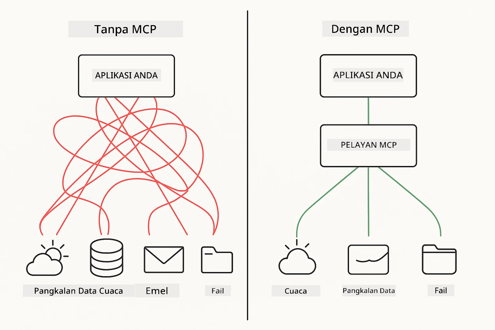
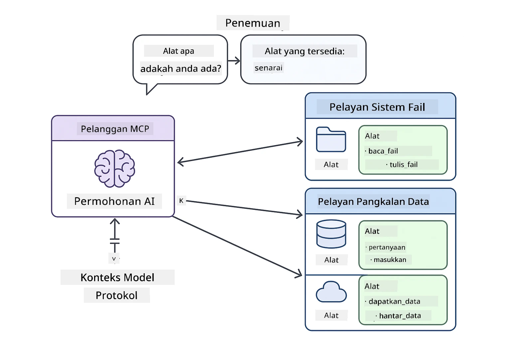
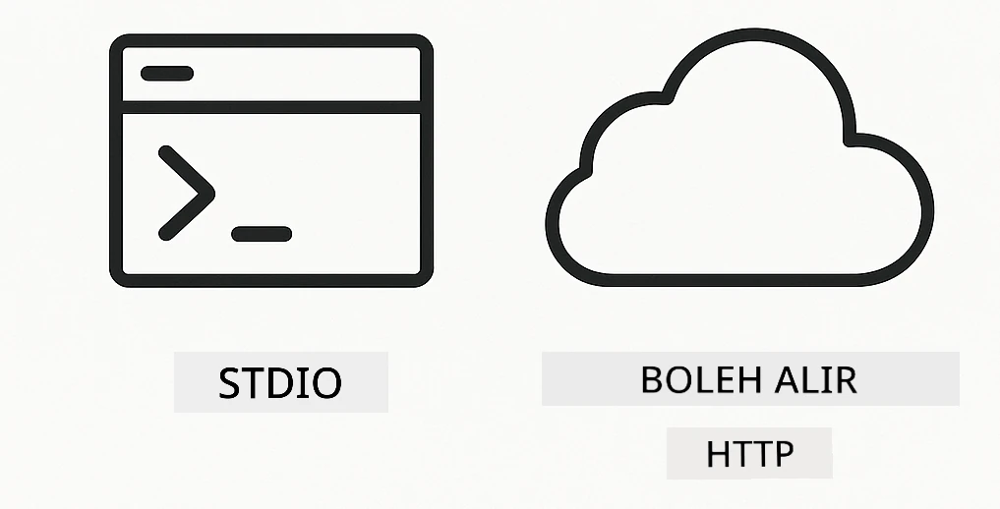
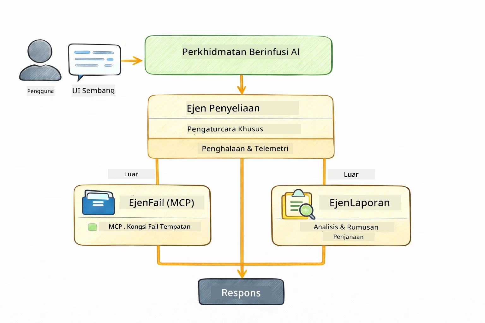

<!--
CO_OP_TRANSLATOR_METADATA:
{
  "original_hash": "6c816d130a1fa47570c11907e72d84ae",
  "translation_date": "2026-01-06T00:26:59+00:00",
  "source_file": "05-mcp/README.md",
  "language_code": "ms"
}
-->
# Modul 05: Protokol Konteks Model (MCP)

## Jadual Kandungan

- [Apa Yang Anda Akan Pelajari](../../../05-mcp)
- [Apakah MCP?](../../../05-mcp)
- [Bagaimana MCP Berfungsi](../../../05-mcp)
- [Modul Agentik](../../../05-mcp)
- [Menjalankan Contoh](../../../05-mcp)
  - [Prasyarat](../../../05-mcp)
- [Mula Cepat](../../../05-mcp)
  - [Operasi Fail (Stdio)](../../../05-mcp)
  - [Ejen Penyelia](../../../05-mcp)
    - [Memahami Output](../../../05-mcp)
    - [Strategi Respons](../../../05-mcp)
    - [Penjelasan Ciri-ciri Modul Agentik](../../../05-mcp)
- [Konsep Utama](../../../05-mcp)
- [Tahniah!](../../../05-mcp)
  - [Apa Seterusnya?](../../../05-mcp)

## Apa Yang Anda Akan Pelajari

Anda telah membina AI perbualan, menguasai arahan, memantapkan respons dalam dokumen, dan mencipta ejen dengan alat. Tetapi semua alat itu dibina khusus untuk aplikasi anda. Bagaimana jika anda boleh memberikan AI anda akses kepada ekosistem alat piawai yang sesiapa sahaja boleh cipta dan kongsi? Dalam modul ini, anda akan belajar bagaimana melakukan itu dengan Protokol Konteks Model (MCP) dan modul agentik LangChain4j. Kami mula-mula mempamerkan pembaca fail MCP mudah dan kemudian menunjukkan bagaimana ia mudah diintegrasikan ke dalam aliran kerja agentik yang maju menggunakan corak Ejen Penyelia.

## Apakah MCP?

Protokol Konteks Model (MCP) menyediakan tepat itu — kaedah piawai untuk aplikasi AI mencari dan menggunakan alat luaran. Daripada menulis integrasi khusus bagi setiap sumber data atau perkhidmatan, anda boleh sambung ke pelayan MCP yang mendedahkan keupayaan mereka dalam format konsisten. Ejen AI anda kemudian boleh mencari dan menggunakan alat ini secara automatik.



*Sebelum MCP: Integrasi titik-ke-titik yang rumit. Selepas MCP: Satu protokol, kemungkinan tanpa batas.*

MCP menyelesaikan masalah asas dalam pembangunan AI: setiap integrasi adalah khusus. Mahu akses GitHub? Kod khusus. Mahu baca fail? Kod khusus. Mahu kueri pangkalan data? Kod khusus. Dan tiada satu pun integrasi ini berfungsi dengan aplikasi AI lain.

MCP mempiawai perkara ini. Pelayan MCP mendedahkan alat dengan keterangan dan skema parameter yang jelas. Mana-mana klien MCP boleh sambung, mencari alat tersedia, dan menggunakannya. Bina sekali, guna di mana-mana.



*Seni bina Protokol Konteks Model – penemuan dan pelaksanaan alat piawai*

## Bagaimana MCP Berfungsi

**Seni Bina Pelayan-Klien**

MCP menggunakan model klien-pelayan. Pelayan menyediakan alat — membaca fail, mengkueri pangkalan data, memanggil API. Klien (aplikasi AI anda) menyambung ke pelayan dan menggunakan alat mereka.

Untuk menggunakan MCP dengan LangChain4j, tambah kebergantungan Maven ini:

```xml
<dependency>
    <groupId>dev.langchain4j</groupId>
    <artifactId>langchain4j-mcp</artifactId>
    <version>${langchain4j.version}</version>
</dependency>
```

**Penemuan Alat**

Apabila klien anda menyambung ke pelayan MCP, ia bertanya "Apakah alat yang anda ada?" Pelayan membalas dengan senarai alat yang tersedia, setiap satu dengan keterangan dan skema parameter. Ejen AI anda kemudian boleh memutuskan alat mana yang hendak digunakan berdasarkan permintaan pengguna.

**Mekanisme Pengangkutan**

MCP menyokong pelbagai mekanisme pengangkutan. Modul ini menunjukan pengangkutan Stdio untuk proses tempatan:



*Mekanisme pengangkutan MCP: HTTP untuk pelayan jauh, Stdio untuk proses tempatan*

**Stdio** - [StdioTransportDemo.java](../../../05-mcp/src/main/java/com/example/langchain4j/mcp/StdioTransportDemo.java)

Untuk proses tempatan. Aplikasi anda melahirkan pelayan sebagai subprocess dan berkomunikasi melalui input/output standard. Berguna untuk akses sistem fail atau alat baris perintah.

```java
McpTransport stdioTransport = new StdioMcpTransport.Builder()
    .command(List.of(
        npmCmd, "exec",
        "@modelcontextprotocol/server-filesystem@2025.12.18",
        resourcesDir
    ))
    .logEvents(false)
    .build();
```

> **🤖 Cuba dengan [GitHub Copilot](https://github.com/features/copilot) Chat:** Buka [`StdioTransportDemo.java`](../../../05-mcp/src/main/java/com/example/langchain4j/mcp/StdioTransportDemo.java) dan tanya:
> - "Bagaimana pengangkutan Stdio berfungsi dan bila saya patut gunakan ia vs HTTP?"
> - "Bagaimana LangChain4j menguruskan kitaran hidup proses pelayan MCP yang dilahirkan?"
> - "Apakah implikasi keselamatan memberikan AI akses kepada sistem fail?"

## Modul Agentik

Walaupun MCP menyediakan alat piawai, modul **agentik** LangChain4j memberikan cara deklaratif untuk membina ejen yang mengatur alat tersebut. Anotasi `@Agent` dan `AgenticServices` membolehkan anda menentukan tingkah laku ejen melalui antara muka daripada kod imperatif.

Dalam modul ini, anda akan meneroka corak **Ejen Penyelia** — pendekatan AI agentik maju di mana ejen "penyelia" membuat keputusan dinamik ejen sub mana yang hendak dilaksanakan berdasarkan permintaan pengguna. Kami menggabungkan kedua-dua konsep dengan memberikan salah satu sub-ejen kami keupayaan akses fail berkuasa MCP.

Untuk menggunakan modul agentik, tambah kebergantungan Maven ini:

```xml
<dependency>
    <groupId>dev.langchain4j</groupId>
    <artifactId>langchain4j-agentic</artifactId>
    <version>${langchain4j.mcp.version}</version>
</dependency>
```

> **⚠️ Eksperimen:** Modul `langchain4j-agentic` adalah **eksperimen** dan tertakluk kepada perubahan. Cara stabil untuk membina pembantu AI masih `langchain4j-core` dengan alat tersuai (Modul 04).

## Menjalankan Contoh

### Prasyarat

- Java 21+, Maven 3.9+
- Node.js 16+ dan npm (untuk pelayan MCP)
- Pembolehubah persekitaran disusun dalam fail `.env` (dari direktori akar):
  - `AZURE_OPENAI_ENDPOINT`, `AZURE_OPENAI_API_KEY`, `AZURE_OPENAI_DEPLOYMENT` (sama seperti Modul 01-04)

> **Nota:** Jika anda belum menyusun pembolehubah persekitaran anda, lihat [Modul 00 - Mula Cepat](../00-quick-start/README.md) untuk arahan, atau salin `.env.example` ke `.env` di direktori akar dan isi nilai anda.

## Mula Cepat

**Menggunakan VS Code:** Cukup klik kanan pada mana-mana fail demo dalam Penjelajah dan pilih **"Run Java"**, atau gunakan konfigurasi pelancaran dari panel Run and Debug (pastikan token anda telah ditambah dalam fail `.env` terlebih dahulu).

**Menggunakan Maven:** Sebagai alternatif, anda boleh jalankan dari baris perintah dengan contoh di bawah.

### Operasi Fail (Stdio)

Ini menunjukkan alat subprocess tempatan.

**✅ Tiada prasyarat diperlukan** - pelayan MCP dilahirkan secara automatik.

**Menggunakan Skrip Mula (Disyorkan):**

Skrip mula memuatkan pembolehubah persekitaran secara automatik dari fail `.env` akar:

**Bash:**
```bash
cd 05-mcp
chmod +x start-stdio.sh
./start-stdio.sh
```

**PowerShell:**
```powershell
cd 05-mcp
.\start-stdio.ps1
```

**Menggunakan VS Code:** Klik kanan pada `StdioTransportDemo.java` dan pilih **"Run Java"** (pastikan fail `.env` anda disediakan).

Aplikasi itu melahirkan pelayan MCP sistem fail secara automatik dan membaca fail tempatan. Perhatikan bagaimana pengurusan subprocess dilakukan untuk anda.

**Output dijangka:**
```
Assistant response: The file provides an overview of LangChain4j, an open-source Java library
for integrating Large Language Models (LLMs) into Java applications...
```

### Ejen Penyelia

**Corak Ejen Penyelia** adalah bentuk AI agentik yang **fleksibel**. Penyelia menggunakan LLM untuk membuat keputusan secara autonomi ejen mana yang hendak dilaksanakan berdasarkan permintaan pengguna. Dalam contoh seterusnya, kami gabungkan akses fail berkuasa MCP dengan ejen LLM untuk mencipta aliran kerja baca fail → laporan yang diawasi.

Dalam demo, `FileAgent` membaca fail menggunakan alat MCP sistem fail, dan `ReportAgent` menjana laporan berstruktur dengan ringkasan eksekutif (1 ayat), 3 poin utama, dan cadangan. Penyelia mengatur aliran ini secara automatik:



```
┌─────────────┐      ┌──────────────┐
│  FileAgent  │ ───▶ │ ReportAgent  │
│ (MCP tools) │      │  (pure LLM)  │
└─────────────┘      └──────────────┘
   outputKey:           outputKey:
  'fileContent'         'report'
```

Setiap ejen menyimpan outputnya dalam **Skop Agentik** (memori dikongsi), membolehkan ejen berikutnya mengakses hasil sebelumnya. Ini menunjukkan bagaimana alat MCP menyatu lancar ke dalam aliran kerja agentik — Penyelia tidak perlu tahu *bagaimana* fail dibaca, hanya bahawa `FileAgent` boleh melakukannya.

#### Menjalankan Demo

Skrip mula memuatkan pembolehubah persekitaran secara automatik dari fail `.env` akar:

**Bash:**
```bash
cd 05-mcp
chmod +x start-supervisor.sh
./start-supervisor.sh
```

**PowerShell:**
```powershell
cd 05-mcp
.\start-supervisor.ps1
```

**Menggunakan VS Code:** Klik kanan pada `SupervisorAgentDemo.java` dan pilih **"Run Java"** (pastikan fail `.env` anda disediakan).

#### Cara Penyelia Berfungsi

```java
// Langkah 1: FileAgent membaca fail menggunakan alat MCP
FileAgent fileAgent = AgenticServices.agentBuilder(FileAgent.class)
        .chatModel(model)
        .toolProvider(mcpToolProvider)  // Mempunyai alat MCP untuk operasi fail
        .build();

// Langkah 2: ReportAgent menjana laporan berstruktur
ReportAgent reportAgent = AgenticServices.agentBuilder(ReportAgent.class)
        .chatModel(model)
        .build();

// Penyelia mengatur aliran kerja fail → laporan
SupervisorAgent supervisor = AgenticServices.supervisorBuilder()
        .chatModel(model)
        .subAgents(fileAgent, reportAgent)
        .responseStrategy(SupervisorResponseStrategy.LAST)  // Pulangkan laporan akhir
        .build();

// Penyelia menentukan ejen mana yang dipanggil berdasarkan permintaan
String response = supervisor.invoke("Read the file at /path/file.txt and generate a report");
```

#### Strategi Respons

Apabila anda mengkonfigurasi `SupervisorAgent`, anda tentukan bagaimana ia harus membentuk jawapan akhir kepada pengguna selepas sub-ejen selesai tugasan mereka. Strategi yang tersedia adalah:

| Strategi | Keterangan |
|----------|------------|
| **TERAKHIR** | Penyelia mengembalikan output sub-ejen atau alat terakhir yang dipanggil. Ini berguna apabila ejen terakhir dalam aliran kerja direka khas untuk menghasilkan jawapan lengkap dan akhir (contohnya, "Ejen Ringkasan" dalam saluran penyelidikan). |
| **RINGKASAN** | Penyelia menggunakan Model Bahasa (LLM) dalaman untuk mensintesis ringkasan keseluruhan interaksi dan semua output sub-ejen, kemudian mengembalikan ringkasan itu sebagai respons akhir. Ini menyediakan jawapan bersatu yang jelas kepada pengguna. |
| **BERSKOR** | Sistem menggunakan LLM dalaman untuk menilai baik respons TERAKHIR mahupun RINGKASAN interaksi berbanding permintaan asal pengguna, mengembalikan output yang menerima skor lebih tinggi. |

Lihat [SupervisorAgentDemo.java](../../../05-mcp/src/main/java/com/example/langchain4j/mcp/SupervisorAgentDemo.java) untuk pelaksanaan lengkap.

> **🤖 Cuba dengan [GitHub Copilot](https://github.com/features/copilot) Chat:** Buka [`SupervisorAgentDemo.java`](../../../05-mcp/src/main/java/com/example/langchain4j/mcp/SupervisorAgentDemo.java) dan tanya:
> - "Bagaimana Penyelia buat keputusan ejen mana yang hendak dilaksanakan?"
> - "Apakah perbezaan antara corak Penyelia dan aliran kerja Berurutan?"
> - "Bagaimana saya boleh sesuaikan tingkah laku perancangan Penyelia?"

#### Memahami Output

Apabila anda jalankan demo, anda akan melihat langkah demi langkah terperinci tentang bagaimana Penyelia mengatur pelbagai ejen. Berikut maksud setiap bahagian:

```
======================================================================
  FILE → REPORT WORKFLOW DEMO
======================================================================

This demo shows a clear 2-step workflow: read a file, then generate a report.
The Supervisor orchestrates the agents automatically based on the request.
```

**Tajuk utama** memperkenalkan konsep aliran kerja: saluran fokus dari pembacaan fail ke penjanaan laporan.

```
--- WORKFLOW ---------------------------------------------------------
  ┌─────────────┐      ┌──────────────┐
  │  FileAgent  │ ───▶ │ ReportAgent  │
  │ (MCP tools) │      │  (pure LLM)  │
  └─────────────┘      └──────────────┘
   outputKey:           outputKey:
   'fileContent'        'report'

--- AVAILABLE AGENTS -------------------------------------------------
  [FILE]   FileAgent   - Reads files via MCP → stores in 'fileContent'
  [REPORT] ReportAgent - Generates structured report → stores in 'report'
```

**Carta Aliran Kerja** menunjukkan aliran data antara ejen. Setiap ejen mempunyai peranan spesifik:
- **FileAgent** membaca fail menggunakan alat MCP dan menyimpan kandungan mentah dalam `fileContent`
- **ReportAgent** menggunakan kandungan itu dan menghasilkan laporan struktur dalam `report`

```
--- USER REQUEST -----------------------------------------------------
  "Read the file at .../file.txt and generate a report on its contents"
```

**Permintaan Pengguna** menunjukkan tugasan. Penyelia menganalisis ini dan memutuskan untuk memanggil FileAgent → ReportAgent.

```
--- SUPERVISOR ORCHESTRATION -----------------------------------------
  The Supervisor decides which agents to invoke and passes data between them...

  +-- STEP 1: Supervisor chose -> FileAgent (reading file via MCP)
  |
  |   Input: .../file.txt
  |
  |   Result: LangChain4j is an open-source, provider-agnostic Java framework for building LLM...
  +-- [OK] FileAgent (reading file via MCP) completed

  +-- STEP 2: Supervisor chose -> ReportAgent (generating structured report)
  |
  |   Input: LangChain4j is an open-source, provider-agnostic Java framew...
  |
  |   Result: Executive Summary...
  +-- [OK] ReportAgent (generating structured report) completed
```

**Pengurusan Penyelia** menunjukkan aliran 2 langkah dalam tindakan:
1. **FileAgent** membaca fail melalui MCP dan menyimpan kandungan
2. **ReportAgent** menerima kandungan dan menjana laporan struktur

Penyelia membuat keputusan ini **secara autonomi** berdasarkan permintaan pengguna.

```
--- FINAL RESPONSE ---------------------------------------------------
Executive Summary
...

Key Points
...

Recommendations
...

--- AGENTIC SCOPE (Data Flow) ----------------------------------------
  Each agent stores its output for downstream agents to consume:
  * fileContent: LangChain4j is an open-source, provider-agnostic Java framework...
  * report: Executive Summary...
```

#### Penjelasan Ciri-ciri Modul Agentik

Contoh menunjukkan beberapa ciri maju modul agentik. Mari kita lihat lebih dekat Skop Agentik dan Pendengar Ejen.

**Skop Agentik** menunjukkan memori dikongsi di mana ejen menyimpan hasil mereka menggunakan `@Agent(outputKey="...")`. Ini membolehkan:
- Ejen berkemudian mengakses output ejen sebelumnya
- Penyelia sintesis jawapan akhir
- Anda menyemak apa yang setiap ejen hasilkan

```java
ResultWithAgenticScope<String> result = supervisor.invokeWithAgenticScope(request);
AgenticScope scope = result.agenticScope();
String fileContent = scope.readState("fileContent");  // Data fail mentah daripada FileAgent
String report = scope.readState("report");            // Laporan berstruktur daripada ReportAgent
```

**Pendengar Ejen** membolehkan pemantauan dan debugging pelaksanaan ejen. Output langkah demi langkah yang anda lihat dalam demo datang dari AgentListener yang terhubung ke setiap panggilan ejen:
- **beforeAgentInvocation** - Dipanggil apabila Penyelia memilih ejen, membolehkan anda lihat ejen mana yang dipilih dan sebabnya
- **afterAgentInvocation** - Dipanggil apabila ejen selesai, menunjukkan hasilnya
- **inheritedBySubagents** - Jika benar, pendengar memantau semua ejen dalam hierarki

```java
AgentListener monitor = new AgentListener() {
    private int step = 0;
    
    @Override
    public void beforeAgentInvocation(AgentRequest request) {
        step++;
        System.out.println("  +-- STEP " + step + ": " + request.agentName());
    }
    
    @Override
    public void afterAgentInvocation(AgentResponse response) {
        System.out.println("  +-- [OK] " + response.agentName() + " completed");
    }
    
    @Override
    public boolean inheritedBySubagents() {
        return true; // Sebarkan kepada semua sub-ejen
    }
};
```

Selain corak Penyelia, modul `langchain4j-agentic` menyediakan beberapa corak aliran kerja dan ciri kuat:

| Corak | Keterangan | Kes Penggunaan |
|---------|-------------|----------|
| **Berurutan** | Laksanakan ejen secara teratur, output mengalir ke seterusnya | Saluran: penyelidikan → analisis → laporan |
| **Selari** | Jalankan ejen serentak | Tugasan bebas: cuaca + berita + saham |
| **Gelung** | Ulang sehingga syarat tercapai | Penilaian kualiti: perbaiki sehingga skor ≥ 0.8 |
| **Bersyarat** | Arahkan berdasarkan syarat | Klasifikasi → arah ke ejen pakar |
| **Manusia-dalam-Laluan** | Tambah titik semak manusia | Aliran kelulusan, semakan kandungan |

## Konsep Utama

Kini anda telah meneroka MCP dan modul agentik dalam tindakan, mari kita ringkaskan bila menggunakan setiap pendekatan.

**MCP** sesuai bila anda mahu memanfaatkan ekosistem alat sedia ada, membina alat yang boleh dikongsi oleh pelbagai aplikasi, mengintegrasi perkhidmatan pihak ketiga dengan protokol piawai, atau menukar implementasi alat tanpa mengubah kod.

**Modul Agentik** sesuai apabila anda mahukan definisi ejen secara deklaratif dengan anotasi `@Agent`, memerlukan pengurusan aliran kerja (berurutan, gelung, selari), lebih suka reka bentuk ejen berasaskan antara muka daripada kod imperatif, atau menggabungkan pelbagai ejen yang berkongsi output melalui `outputKey`.

**Corak Ejen Penyelia** menjadi pilihan apabila aliran kerja tidak dapat diramal di awal dan anda mahu LLM membuat keputusan, apabila anda mempunyai pelbagai ejen khusus yang memerlukan pengurusan dinamik, membina sistem perbualan yang mengarahkan ke pelbagai kebolehan, atau apabila anda mahukan tingkah laku ejen yang paling fleksibel dan adaptif.
## Tahniah!

Anda telah menamatkan kursus LangChain4j untuk Pemula. Anda telah mempelajari:

- Cara membina AI perbualan dengan ingatan (Modul 01)
- Corak kejuruteraan arahan untuk tugasan berbeza (Modul 02)
- Menyandarkan jawapan dalam dokumen anda dengan RAG (Modul 03)
- Mewujudkan ejen AI asas (pembantu) dengan alat tersuai (Modul 04)
- Mengintegrasikan alat standard dengan LangChain4j MCP dan modul Agentic (Modul 05)

### Apa Selepas Ini?

Selepas menamatkan modul, terokai [Panduan Ujian](../docs/TESTING.md) untuk melihat konsep ujian LangChain4j dalam tindakan.

**Sumber Rasmi:**
- [Dokumentasi LangChain4j](https://docs.langchain4j.dev/) - Panduan komprehensif dan rujukan API
- [LangChain4j GitHub](https://github.com/langchain4j/langchain4j) - Kod sumber dan contohnya
- [Tutorial LangChain4j](https://docs.langchain4j.dev/tutorials/) - Tutorial langkah demi langkah untuk pelbagai kes penggunaan

Terima kasih kerana menamatkan kursus ini!

---

**Navigasi:** [← Sebelumnya: Modul 04 - Alat](../04-tools/README.md) | [Kembali ke Utama](../README.md)

---

<!-- CO-OP TRANSLATOR DISCLAIMER START -->
**Penafian**:  
Dokumen ini telah diterjemahkan menggunakan perkhidmatan terjemahan AI [Co-op Translator](https://github.com/Azure/co-op-translator). Walaupun kami berusaha untuk memastikan ketepatan, sila maklum bahawa terjemahan automatik mungkin mengandungi kesilapan atau ketidaktepatan. Dokumen asal dalam bahasa asalnya hendaklah dianggap sebagai sumber yang sahih. Untuk maklumat penting, terjemahan profesional oleh manusia adalah disyorkan. Kami tidak bertanggungjawab atas sebarang salah faham atau tafsiran yang timbul daripada penggunaan terjemahan ini.
<!-- CO-OP TRANSLATOR DISCLAIMER END -->