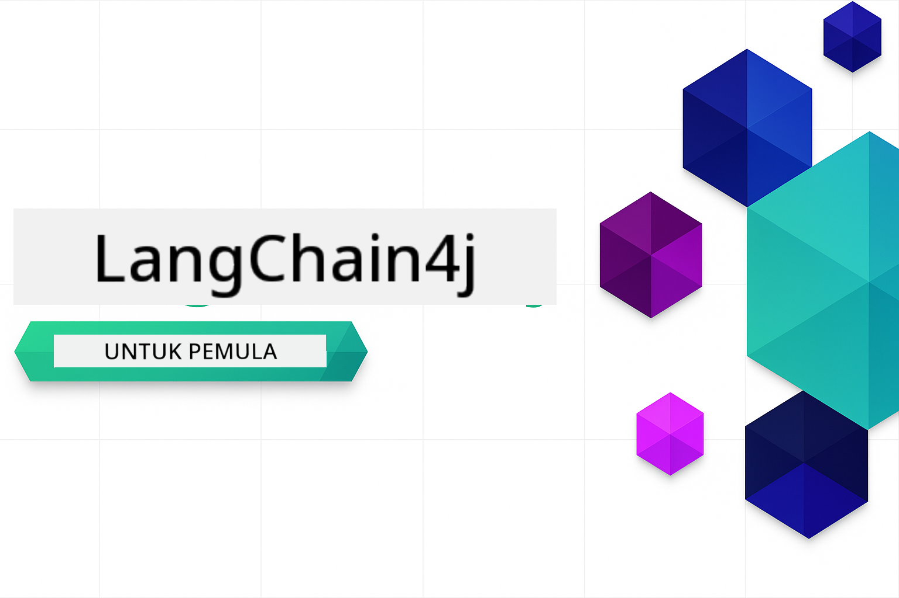
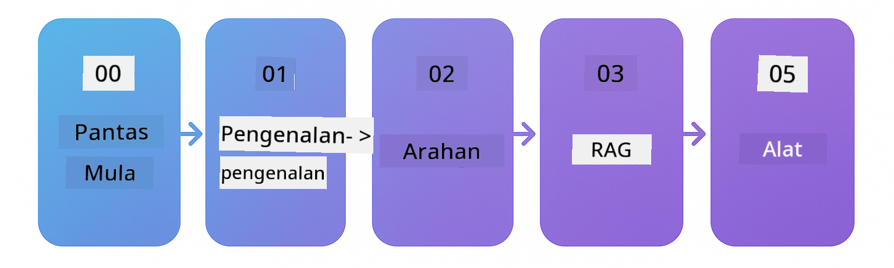

<!--
CO_OP_TRANSLATOR_METADATA:
{
  "original_hash": "d1499d1abf7e653e94fde35644629500",
  "translation_date": "2025-12-18T10:07:59+00:00",
  "source_file": "README.md",
  "language_code": "ms"
}
-->


### 🌐 Sokongan Pelbagai Bahasa

#### Disokong melalui GitHub Action (Automatik & Sentiasa Dikemas Kini)

<!-- CO-OP TRANSLATOR LANGUAGES TABLE START -->
[Arabic](../ar/README.md) | [Bengali](../bn/README.md) | [Bulgarian](../bg/README.md) | [Burmese (Myanmar)](../my/README.md) | [Chinese (Simplified)](../zh/README.md) | [Chinese (Traditional, Hong Kong)](../hk/README.md) | [Chinese (Traditional, Macau)](../mo/README.md) | [Chinese (Traditional, Taiwan)](../tw/README.md) | [Croatian](../hr/README.md) | [Czech](../cs/README.md) | [Danish](../da/README.md) | [Dutch](../nl/README.md) | [Estonian](../et/README.md) | [Finnish](../fi/README.md) | [French](../fr/README.md) | [German](../de/README.md) | [Greek](../el/README.md) | [Hebrew](../he/README.md) | [Hindi](../hi/README.md) | [Hungarian](../hu/README.md) | [Indonesian](../id/README.md) | [Italian](../it/README.md) | [Japanese](../ja/README.md) | [Kannada](../kn/README.md) | [Korean](../ko/README.md) | [Lithuanian](../lt/README.md) | [Malay](./README.md) | [Malayalam](../ml/README.md) | [Marathi](../mr/README.md) | [Nepali](../ne/README.md) | [Nigerian Pidgin](../pcm/README.md) | [Norwegian](../no/README.md) | [Persian (Farsi)](../fa/README.md) | [Polish](../pl/README.md) | [Portuguese (Brazil)](../br/README.md) | [Portuguese (Portugal)](../pt/README.md) | [Punjabi (Gurmukhi)](../pa/README.md) | [Romanian](../ro/README.md) | [Russian](../ru/README.md) | [Serbian (Cyrillic)](../sr/README.md) | [Slovak](../sk/README.md) | [Slovenian](../sl/README.md) | [Spanish](../es/README.md) | [Swahili](../sw/README.md) | [Swedish](../sv/README.md) | [Tagalog (Filipino)](../tl/README.md) | [Tamil](../ta/README.md) | [Telugu](../te/README.md) | [Thai](../th/README.md) | [Turkish](../tr/README.md) | [Ukrainian](../uk/README.md) | [Urdu](../ur/README.md) | [Vietnamese](../vi/README.md)
<!-- CO-OP TRANSLATOR LANGUAGES TABLE END -->

# LangChain4j untuk Pemula

Satu kursus untuk membina aplikasi AI dengan LangChain4j dan Azure OpenAI GPT-5, dari sembang asas hingga ejen AI.

**Baru dengan LangChain4j?** Lihat [Glosari](docs/GLOSSARY.md) untuk definisi istilah dan konsep utama.

## Jadual Kandungan

1. [Mula Pantas](00-quick-start/README.md) - Mulakan dengan LangChain4j
2. [Pengenalan](01-introduction/README.md) - Pelajari asas-asas LangChain4j
3. [Reka Bentuk Prompt](02-prompt-engineering/README.md) - Kuasai reka bentuk prompt yang berkesan
4. [RAG (Generasi Dipertingkatkan Pengambilan)](03-rag/README.md) - Bina sistem berasaskan pengetahuan yang pintar
5. [Alat](04-tools/README.md) - Integrasi alat luaran dan API dengan ejen AI
6. [MCP (Protokol Konteks Model)](05-mcp/README.md) - Bekerja dengan Protokol Konteks Model
---

## Laluan Pembelajaran

> **Mula Pantas**

1. Fork repositori ini ke akaun GitHub anda
2. Klik **Code** → tab **Codespaces** → **...** → **New with options...**
3. Gunakan tetapan lalai – ini akan memilih kontena Pembangunan yang dibuat untuk kursus ini
4. Klik **Create codespace**
5. Tunggu 5-10 minit untuk persekitaran bersedia
6. Teruskan ke [Mula Pantas](./00-quick-start/README.md) untuk bermula!

> **Lebih Suka Klon Secara Tempatan?**
>
> Repositori ini termasuk lebih 50 terjemahan bahasa yang secara signifikan meningkatkan saiz muat turun. Untuk klon tanpa terjemahan, gunakan sparse checkout:
> ```bash
> git clone --filter=blob:none --sparse https://github.com/microsoft/LangChain4j-for-Beginners.git
> cd LangChain4j-for-Beginners
> git sparse-checkout set --no-cone '/*' '!translations' '!translated_images'
> ```
> Ini memberikan anda segala yang anda perlukan untuk menyelesaikan kursus dengan muat turun yang lebih pantas.

Mulakan dengan modul [Mula Pantas](00-quick-start/README.md) dan teruskan melalui setiap modul untuk membina kemahiran anda langkah demi langkah. Anda akan mencuba contoh asas untuk memahami asas sebelum beralih ke modul [Pengenalan](01-introduction/README.md) untuk penerokaan lebih mendalam dengan GPT-5.



Selepas menamatkan modul, terokai [Panduan Ujian](docs/TESTING.md) untuk melihat konsep ujian LangChain4j dalam tindakan.

> **Nota:** Latihan ini menggunakan kedua-dua Model GitHub dan Azure OpenAI. Modul [Mula Pantas](00-quick-start/README.md) dan [MCP](05-mcp/README.md) menggunakan Model GitHub (tidak memerlukan langganan Azure), manakala modul 1-4 menggunakan Azure OpenAI GPT-5.


## Pembelajaran dengan GitHub Copilot

Untuk mula menulis kod dengan cepat, buka projek ini dalam GitHub Codespace atau IDE tempatan anda dengan devcontainer yang disediakan. Devcontainer yang digunakan dalam kursus ini telah dikonfigurasikan terlebih dahulu dengan GitHub Copilot untuk pengaturcaraan berpasangan AI.

Setiap contoh kod termasuk soalan yang dicadangkan yang boleh anda tanya kepada GitHub Copilot untuk memperdalam pemahaman anda. Cari petunjuk 💡/🤖 dalam:

- **Header fail Java** - Soalan khusus untuk setiap contoh
- **README modul** - Petunjuk penerokaan selepas contoh kod

**Cara menggunakan:** Buka mana-mana fail kod dan tanya Copilot soalan yang dicadangkan. Ia mempunyai konteks penuh kod dan boleh menerangkan, mengembangkan, dan mencadangkan alternatif.

Ingin belajar lebih lanjut? Lihat [Copilot untuk Pengaturcaraan Berpasangan AI](https://aka.ms/GitHubCopilotAI).


## Sumber Tambahan

<!-- CO-OP TRANSLATOR OTHER COURSES START -->
### LangChain
[](https://aka.ms/langchain4j-for-beginners)
[](https://aka.ms/langchainjs-for-beginners?WT.mc_id=m365-94501-dwahlin)

---

### Azure / Edge / MCP / Ejen
[](https://github.com/microsoft/AZD-for-beginners?WT.mc_id=academic-105485-koreyst)
[](https://github.com/microsoft/edgeai-for-beginners?WT.mc_id=academic-105485-koreyst)
[](https://github.com/microsoft/mcp-for-beginners?WT.mc_id=academic-105485-koreyst)
[](https://github.com/microsoft/ai-agents-for-beginners?WT.mc_id=academic-105485-koreyst)

---
 
### Siri AI Generatif
[](https://github.com/microsoft/generative-ai-for-beginners?WT.mc_id=academic-105485-koreyst)
[-9333EA?style=for-the-badge&labelColor=E5E7EB&color=9333EA)](https://github.com/microsoft/Generative-AI-for-beginners-dotnet?WT.mc_id=academic-105485-koreyst)
[-C084FC?style=for-the-badge&labelColor=E5E7EB&color=C084FC)](https://github.com/microsoft/generative-ai-for-beginners-java?WT.mc_id=academic-105485-koreyst)
[-E879F9?style=for-the-badge&labelColor=E5E7EB&color=E879F9)](https://github.com/microsoft/generative-ai-with-javascript?WT.mc_id=academic-105485-koreyst)

---
 
### Pembelajaran Teras
[](https://aka.ms/ml-beginners?WT.mc_id=academic-105485-koreyst)
[](https://aka.ms/datascience-beginners?WT.mc_id=academic-105485-koreyst)
[](https://aka.ms/ai-beginners?WT.mc_id=academic-105485-koreyst)
[](https://github.com/microsoft/Security-101?WT.mc_id=academic-96948-sayoung)
[](https://aka.ms/webdev-beginners?WT.mc_id=academic-105485-koreyst)
[](https://aka.ms/iot-beginners?WT.mc_id=academic-105485-koreyst)
[](https://github.com/microsoft/xr-development-for-beginners?WT.mc_id=academic-105485-koreyst)

---
 
### Siri Copilot
[](https://aka.ms/GitHubCopilotAI?WT.mc_id=academic-105485-koreyst)
[](https://github.com/microsoft/mastering-github-copilot-for-dotnet-csharp-developers?WT.mc_id=academic-105485-koreyst)
[](https://github.com/microsoft/CopilotAdventures?WT.mc_id=academic-105485-koreyst)
<!-- CO-OP TRANSLATOR OTHER COURSES END -->

## Mendapatkan Bantuan

Jika anda tersekat atau mempunyai sebarang soalan tentang membina aplikasi AI, sertai:

[](https://aka.ms/foundry/discord)

Jika anda mempunyai maklum balas produk atau ralat semasa membina, lawati:

[](https://aka.ms/foundry/forum)

## Lesen

Lesen MIT - Lihat fail [LICENSE](../../LICENSE) untuk maklumat lanjut.

---

<!-- CO-OP TRANSLATOR DISCLAIMER START -->
**Penafian**:  
Dokumen ini telah diterjemahkan menggunakan perkhidmatan terjemahan AI [Co-op Translator](https://github.com/Azure/co-op-translator). Walaupun kami berusaha untuk ketepatan, sila ambil maklum bahawa terjemahan automatik mungkin mengandungi kesilapan atau ketidaktepatan. Dokumen asal dalam bahasa asalnya harus dianggap sebagai sumber yang sahih. Untuk maklumat penting, terjemahan profesional oleh manusia adalah disyorkan. Kami tidak bertanggungjawab atas sebarang salah faham atau salah tafsir yang timbul daripada penggunaan terjemahan ini.
<!-- CO-OP TRANSLATOR DISCLAIMER END -->