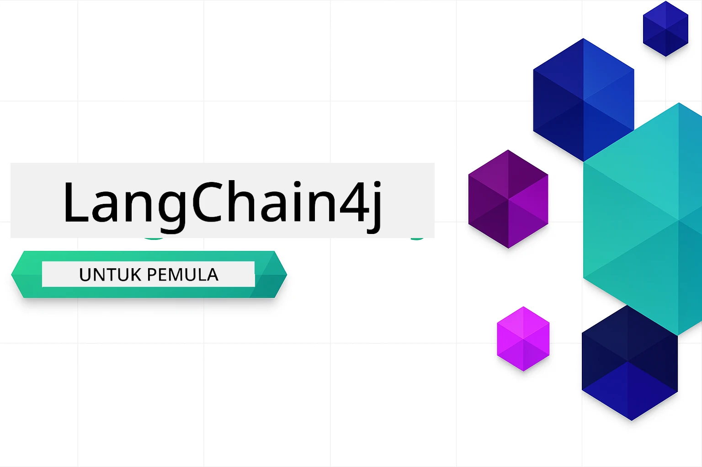

# LangChain4j untuk Pemula

Kursus untuk membina aplikasi AI dengan LangChain4j dan Azure OpenAI GPT-5.2, dari sembang asas hingga ejen AI.

### 🌐 Sokongan Pelbagai Bahasa

#### Disokong melalui GitHub Action (Automatik & Sentiasa Dikemas Kini)

<!-- CO-OP TRANSLATOR LANGUAGES TABLE START -->
[Arab](../ar/README.md) | [Bengali](../bn/README.md) | [Bulgaria](../bg/README.md) | [Burma (Myanmar)](../my/README.md) | [Cina (Ringkas)](../zh-CN/README.md) | [Cina (Tradisional, Hong Kong)](../zh-HK/README.md) | [Cina (Tradisional, Macau)](../zh-MO/README.md) | [Cina (Tradisional, Taiwan)](../zh-TW/README.md) | [Kroasia](../hr/README.md) | [Ceko](../cs/README.md) | [Denmark](../da/README.md) | [Belanda](../nl/README.md) | [Estonia](../et/README.md) | [Finland](../fi/README.md) | [Perancis](../fr/README.md) | [Jerman](../de/README.md) | [Greek](../el/README.md) | [Ibrani](../he/README.md) | [Hindi](../hi/README.md) | [Hungary](../hu/README.md) | [Indonesia](../id/README.md) | [Itali](../it/README.md) | [Jepun](../ja/README.md) | [Kannada](../kn/README.md) | [Khmer](../km/README.md) | [Korea](../ko/README.md) | [Lithuania](../lt/README.md) | [Melayu](./README.md) | [Malayalam](../ml/README.md) | [Marathi](../mr/README.md) | [Nepali](../ne/README.md) | [Pidgin Nigeria](../pcm/README.md) | [Norway](../no/README.md) | [Parsi (Farsi)](../fa/README.md) | [Poland](../pl/README.md) | [Portugis (Brazil)](../pt-BR/README.md) | [Portugis (Portugal)](../pt-PT/README.md) | [Punjabi (Gurmukhi)](../pa/README.md) | [Romania](../ro/README.md) | [Rusia](../ru/README.md) | [Serbia (Cyrillic)](../sr/README.md) | [Slovak](../sk/README.md) | [Slovenia](../sl/README.md) | [Sepanyol](../es/README.md) | [Swahili](../sw/README.md) | [Sweden](../sv/README.md) | [Tagalog (Filipina)](../tl/README.md) | [Tamil](../ta/README.md) | [Telugu](../te/README.md) | [Thai](../th/README.md) | [Turki](../tr/README.md) | [Ukraine](../uk/README.md) | [Urdu](../ur/README.md) | [Vietnam](../vi/README.md)

> **Lebih Suka Klon Secara Tempatan?**
>
> Repositori ini merangkumi 50+ terjemahan bahasa yang secara ketara meningkatkan saiz muat turun. Untuk klon tanpa terjemahan, gunakan sparse checkout:
>
> **Bash / macOS / Linux:**
> ```bash
> git clone --filter=blob:none --sparse https://github.com/microsoft/LangChain4j-for-Beginners.git
> cd LangChain4j-for-Beginners
> git sparse-checkout set --no-cone '/*' '!translations' '!translated_images'
> ```
>
> **CMD (Windows):**
> ```cmd
> git clone --filter=blob:none --sparse https://github.com/microsoft/LangChain4j-for-Beginners.git
> cd LangChain4j-for-Beginners
> git sparse-checkout set --no-cone "/*" "!translations" "!translated_images"
> ```
>
> Ini memberikan anda semua yang anda perlukan untuk menyelesaikan kursus dengan muat turun yang lebih pantas.
<!-- CO-OP TRANSLATOR LANGUAGES TABLE END -->

## Jadual Kandungan

1. [Pengenalan](01-introduction/README.md) - Pelajari asas LangChain4j
2. [Reka Bentuk Prompt](02-prompt-engineering/README.md) - Kuasai reka bentuk prompt yang berkesan
3. [RAG (Penjanaan Beraugmen Pencarian)](03-rag/README.md) - Bina sistem berasaskan pengetahuan yang pintar
4. [Alat](04-tools/README.md) - Integrasi alat luaran dan pembantu mudah
5. [MCP (Protokol Konteks Model)](05-mcp/README.md) - Bekerja dengan Protokol Konteks Model (MCP) dan modul Agentik

### Video Panduan

Setiap modul mempunyai sesi langsung sebagai teman yang menerangkan konsep dan kod langkah demi langkah.

| Modul | Video |
|--------|-------|
| 01 - Pengenalan | [Memulakan dengan LangChain4j](https://www.youtube.com/live/nl_troDm8rQ) |
| 02 - Reka Bentuk Prompt | [Reka Bentuk Prompt dengan LangChain4j](https://www.youtube.com/live/PJ6aBaE6bog) |
| 03 - RAG | [RAG dengan LangChain4j](https://www.youtube.com/watch?v=_olq75ZH_eY) |
| 04 - Alat & 05 - MCP | [Ejen AI dengan Alat dan MCP](https://www.youtube.com/watch?v=O_J30kZc0rw) |

---

## Laluan Pembelajaran

**Baru dalam LangChain4j?** Lihat [Glosari](docs/GLOSSARY.md) untuk definisi istilah dan konsep utama.

> **Mula dengan Cepat**

1. Fork repositori ini ke akaun GitHub anda
2. Klik **Code** → tab **Codespaces** → **...** → **Baru dengan pilihan...**
3. Gunakan seting lalai – ini akan memilih kontena Pembangunan yang dibuat untuk kursus ini
4. Klik **Buat codespace**
5. Tunggu 5-10 minit untuk persekitaran sedia
6. Terus ke [Pengenalan](./01-introduction/README.md) untuk bermula!

Selepas melengkapkan modul, terokai [Panduan Ujian](docs/TESTING.md) untuk melihat konsep ujian LangChain4j beraksi.

> **Catatan:** Latihan ini menggunakan Azure OpenAI. Mulakan dengan [akaun Azure PERCUMA](https://aka.ms/azure-free-account) jika anda belum ada.

## Pembelajaran dengan GitHub Copilot

Untuk mulakan pengekodan dengan cepat, buka projek ini dalam GitHub Codespace atau IDE tempatan anda dengan devcontainer yang disediakan. Devcontainer yang digunakan dalam kursus ini telah dikonfigurasikan dengan GitHub Copilot untuk pengaturcaraan berpasangan AI.

Setiap contoh kod termasuk soalan yang dicadangkan yang boleh anda tanya kepada GitHub Copilot untuk memperdalam pemahaman anda. Cari isyarat 💡/🤖 dalam:

- **Header fail Java** - Soalan khusus untuk setiap contoh
- **README modul** - Cadangan penerokaan selepas contoh kod

**Cara guna:** Buka mana-mana fail kod dan tanya Copilot soalan yang dicadangkan. Ia mempunyai konteks penuh kod dan boleh terangkan, kembangkan, dan cadangkan alternatif.

Ingin belajar lebih lanjut? Lihat [Copilot untuk Pengaturcaraan Berpasangan AI](https://aka.ms/GitHubCopilotAI).

## Sumber Tambahan

<!-- CO-OP TRANSLATOR OTHER COURSES START -->
### LangChain
[](https://aka.ms/langchain4j-for-beginners)
[](https://aka.ms/langchainjs-for-beginners?WT.mc_id=m365-94501-dwahlin)
[](https://github.com/microsoft/langchain-for-beginners?WT.mc_id=m365-94501-dwahlin)
---

### Azure / Edge / MCP / Ejen
[](https://github.com/microsoft/AZD-for-beginners?WT.mc_id=academic-105485-koreyst)
[](https://github.com/microsoft/edgeai-for-beginners?WT.mc_id=academic-105485-koreyst)
[](https://github.com/microsoft/mcp-for-beginners?WT.mc_id=academic-105485-koreyst)
[](https://github.com/microsoft/ai-agents-for-beginners?WT.mc_id=academic-105485-koreyst)

---
 
### Siri AI Generatif
[](https://github.com/microsoft/generative-ai-for-beginners?WT.mc_id=academic-105485-koreyst)
[-9333EA?style=for-the-badge&labelColor=E5E7EB&color=9333EA)](https://github.com/microsoft/Generative-AI-for-beginners-dotnet?WT.mc_id=academic-105485-koreyst)
[-C084FC?style=for-the-badge&labelColor=E5E7EB&color=C084FC)](https://github.com/microsoft/generative-ai-for-beginners-java?WT.mc_id=academic-105485-koreyst)
[-E879F9?style=for-the-badge&labelColor=E5E7EB&color=E879F9)](https://github.com/microsoft/generative-ai-with-javascript?WT.mc_id=academic-105485-koreyst)

---
 
### Pembelajaran Teras
[](https://aka.ms/ml-beginners?WT.mc_id=academic-105485-koreyst)
[](https://aka.ms/datascience-beginners?WT.mc_id=academic-105485-koreyst)
[](https://aka.ms/ai-beginners?WT.mc_id=academic-105485-koreyst)
[](https://github.com/microsoft/Security-101?WT.mc_id=academic-96948-sayoung)
[](https://aka.ms/webdev-beginners?WT.mc_id=academic-105485-koreyst)
[](https://aka.ms/iot-beginners?WT.mc_id=academic-105485-koreyst)
[](https://github.com/microsoft/xr-development-for-beginners?WT.mc_id=academic-105485-koreyst)

---
 
### Siri Copilot
[](https://aka.ms/GitHubCopilotAI?WT.mc_id=academic-105485-koreyst)
[](https://github.com/microsoft/mastering-github-copilot-for-dotnet-csharp-developers?WT.mc_id=academic-105485-koreyst)
[](https://github.com/microsoft/CopilotAdventures?WT.mc_id=academic-105485-koreyst)
<!-- CO-OP TRANSLATOR OTHER COURSES END -->

## Mendapatkan Bantuan

Jika anda tersekat atau mempunyai sebarang pertanyaan tentang membina aplikasi AI, sertai:

[](https://aka.ms/foundry/discord)

Jika anda mempunyai maklum balas produk atau ralat semasa membina, lawati:

[](https://aka.ms/foundry/forum)

## Lesen

Lesen MIT - Lihat fail [LICENSE](../../LICENSE) untuk maklumat lanjut.

---

<!-- CO-OP TRANSLATOR DISCLAIMER START -->
**Penafian**:
Dokumen ini telah diterjemahkan menggunakan perkhidmatan terjemahan AI [Co-op Translator](https://github.com/Azure/co-op-translator). Walaupun kami berusaha untuk ketepatan, sila ambil maklum bahawa terjemahan automatik mungkin mengandungi kesilapan atau ketidaktepatan. Dokumen asal dalam bahasa asalnya harus dianggap sebagai sumber yang sahih. Untuk maklumat penting, terjemahan oleh manusia profesional adalah disyorkan. Kami tidak bertanggungjawab terhadap sebarang salah faham atau salah tafsir yang timbul daripada penggunaan terjemahan ini.
<!-- CO-OP TRANSLATOR DISCLAIMER END -->