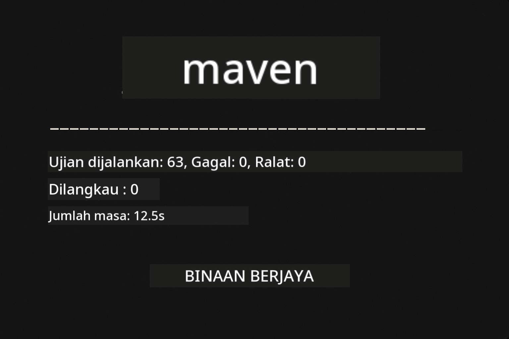
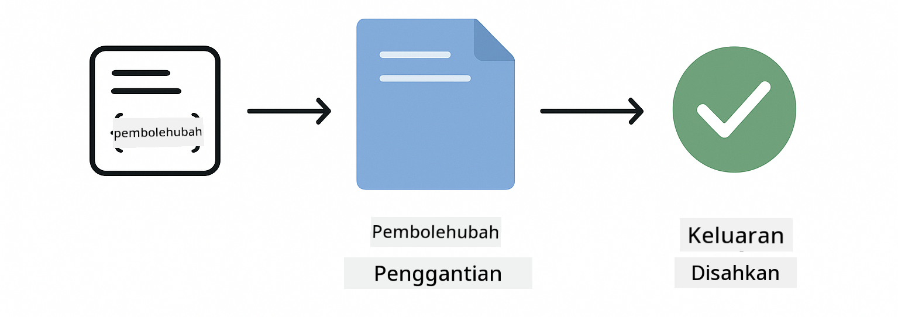
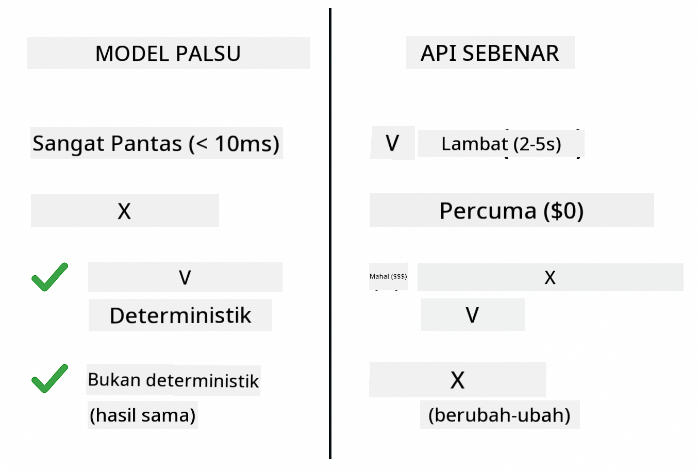
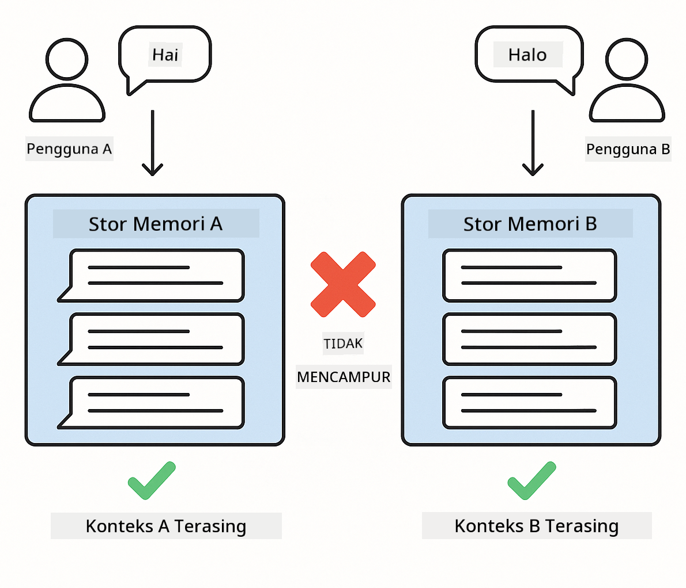

<!--
CO_OP_TRANSLATOR_METADATA:
{
  "original_hash": "b975537560c404d5f254331832811e78",
  "translation_date": "2025-12-13T21:15:26+00:00",
  "source_file": "docs/TESTING.md",
  "language_code": "ms"
}
-->
# Menguji Aplikasi LangChain4j

## Jadual Kandungan

- [Mula Pantas](../../../docs)
- [Apa yang Diliputi oleh Ujian](../../../docs)
- [Menjalankan Ujian](../../../docs)
- [Menjalankan Ujian dalam VS Code](../../../docs)
- [Corak Ujian](../../../docs)
- [Falsafah Ujian](../../../docs)
- [Langkah Seterusnya](../../../docs)

Panduan ini membimbing anda melalui ujian yang menunjukkan cara menguji aplikasi AI tanpa memerlukan kunci API atau perkhidmatan luaran.

## Mula Pantas

Jalankan semua ujian dengan satu arahan:

**Bash:**
```bash
mvn test
```

**PowerShell:**
```powershell
mvn --% test
```



*Pelaksanaan ujian berjaya menunjukkan semua ujian lulus tanpa kegagalan*

## Apa yang Diliputi oleh Ujian

Kursus ini memfokuskan pada **ujian unit** yang dijalankan secara tempatan. Setiap ujian menunjukkan konsep LangChain4j tertentu secara terasing.


*Piramid ujian menunjukkan keseimbangan antara ujian unit (pantas, terasing), ujian integrasi (komponen sebenar), dan ujian hujung-ke-hujung (sistem penuh dengan Docker). Latihan ini meliputi ujian unit.*

| Modul | Ujian | Fokus | Fail Utama |
|--------|-------|-------|-----------|
| **00 - Mula Pantas** | 6 | Templat prompt dan penggantian pembolehubah | `SimpleQuickStartTest.java` |
| **01 - Pengenalan** | 8 | Memori perbualan dan sembang berkeadaan | `SimpleConversationTest.java` |
| **02 - Kejuruteraan Prompt** | 12 | Corak GPT-5, tahap keghairahan, output berstruktur | `SimpleGpt5PromptTest.java` |
| **03 - RAG** | 10 | Pengambilan dokumen, embedding, carian kesamaan | `DocumentServiceTest.java` |
| **04 - Alat** | 12 | Panggilan fungsi dan rantaian alat | `SimpleToolsTest.java` |
| **05 - MCP** | 15 | Protokol Konteks Model dengan Docker | `SimpleMcpTest.java`, `McpDockerTransportTest.java` |

## Menjalankan Ujian

**Jalankan semua ujian dari root:**

**Bash:**
```bash
mvn test
```

**PowerShell:**
```powershell
mvn --% test
```

**Jalankan ujian untuk modul tertentu:**

**Bash:**
```bash
cd 01-introduction && mvn test
# Atau dari root
mvn test -pl 01-introduction
```

**PowerShell:**
```powershell
cd 01-introduction; mvn --% test
# Atau dari root
mvn --% test -pl 01-introduction
```

**Jalankan satu kelas ujian:**

**Bash:**
```bash
mvn test -Dtest=SimpleConversationTest
```

**PowerShell:**
```powershell
mvn --% test -Dtest=SimpleConversationTest
```

**Jalankan kaedah ujian tertentu:**

**Bash:**
```bash
mvn test -Dtest=SimpleConversationTest#harusMenjagaSejarahPerbualan
```

**PowerShell:**
```powershell
mvn --% test -Dtest=SimpleConversationTest#harusMenjagaSejarahPerbualan
```

## Menjalankan Ujian dalam VS Code

Jika anda menggunakan Visual Studio Code, Test Explorer menyediakan antara muka grafik untuk menjalankan dan menyahpepijat ujian.


*Penjelajah Ujian VS Code menunjukkan pokok ujian dengan semua kelas ujian Java dan kaedah ujian individu*

**Untuk menjalankan ujian dalam VS Code:**

1. Buka Test Explorer dengan mengklik ikon beaker di Bar Aktiviti
2. Kembangkan pokok ujian untuk melihat semua modul dan kelas ujian
3. Klik butang main di sebelah mana-mana ujian untuk menjalankannya secara individu
4. Klik "Run All Tests" untuk melaksanakan keseluruhan suite
5. Klik kanan mana-mana ujian dan pilih "Debug Test" untuk menetapkan titik henti dan langkah melalui kod

Penjelajah Ujian menunjukkan tanda semak hijau untuk ujian yang lulus dan menyediakan mesej kegagalan terperinci apabila ujian gagal.

## Corak Ujian


*Enam corak ujian untuk aplikasi LangChain4j: templat prompt, pemodelan tiruan, pengasingan perbualan, ujian alat, RAG dalam memori, dan integrasi Docker*

### Corak 1: Menguji Templat Prompt

Corak paling mudah menguji templat prompt tanpa memanggil mana-mana model AI. Anda mengesahkan bahawa penggantian pembolehubah berfungsi dengan betul dan prompt diformat seperti yang dijangkakan.



*Ujian templat prompt menunjukkan aliran penggantian pembolehubah: templat dengan tempat letak → nilai digunakan → output diformat disahkan*

```java
@Test
@DisplayName("Should format prompt template with variables")
void testPromptTemplateFormatting() {
    PromptTemplate template = PromptTemplate.from(
        "Best time to visit {{destination}} for {{activity}}?"
    );
    
    Prompt prompt = template.apply(Map.of(
        "destination", "Paris",
        "activity", "sightseeing"
    ));
    
    assertThat(prompt.text()).isEqualTo("Best time to visit Paris for sightseeing?");
}
```

Ujian ini berada di `00-quick-start/src/test/java/com/example/langchain4j/quickstart/SimpleQuickStartTest.java`.

**Jalankan ia:**

**Bash:**
```bash
cd 00-quick-start && mvn test -Dtest=SimpleQuickStartTest#ujianFormatTemplatPrompt
```

**PowerShell:**
```powershell
cd 00-quick-start; mvn --% test -Dtest=SimpleQuickStartTest#ujianFormatTemplatPrompt
```

### Corak 2: Memodelkan Tiruan Model Bahasa

Apabila menguji logik perbualan, gunakan Mockito untuk mencipta model palsu yang mengembalikan respons yang telah ditentukan. Ini menjadikan ujian pantas, percuma, dan deterministik.



*Perbandingan menunjukkan mengapa mock lebih disukai untuk ujian: ia pantas, percuma, deterministik, dan tidak memerlukan kunci API*

```java
@ExtendWith(MockitoExtension.class)
class SimpleConversationTest {
    
    private ConversationService conversationService;
    
    @Mock
    private OpenAiOfficialChatModel mockChatModel;
    
    @BeforeEach
    void setUp() {
        ChatResponse mockResponse = ChatResponse.builder()
            .aiMessage(AiMessage.from("This is a test response"))
            .build();
        when(mockChatModel.chat(anyList())).thenReturn(mockResponse);
        
        conversationService = new ConversationService(mockChatModel);
    }
    
    @Test
    void shouldMaintainConversationHistory() {
        String conversationId = conversationService.startConversation();
        
        ChatResponse mockResponse1 = ChatResponse.builder()
            .aiMessage(AiMessage.from("Response 1"))
            .build();
        ChatResponse mockResponse2 = ChatResponse.builder()
            .aiMessage(AiMessage.from("Response 2"))
            .build();
        ChatResponse mockResponse3 = ChatResponse.builder()
            .aiMessage(AiMessage.from("Response 3"))
            .build();
        
        when(mockChatModel.chat(anyList()))
            .thenReturn(mockResponse1)
            .thenReturn(mockResponse2)
            .thenReturn(mockResponse3);

        conversationService.chat(conversationId, "First message");
        conversationService.chat(conversationId, "Second message");
        conversationService.chat(conversationId, "Third message");

        List<ChatMessage> history = conversationService.getHistory(conversationId);
        assertThat(history).hasSize(6); // 3 mesej pengguna + 3 mesej AI
    }
}
```

Corak ini muncul dalam `01-introduction/src/test/java/com/example/langchain4j/service/SimpleConversationTest.java`. Mock memastikan tingkah laku konsisten supaya anda boleh mengesahkan pengurusan memori berfungsi dengan betul.

### Corak 3: Menguji Pengasingan Perbualan

Memori perbualan mesti memisahkan pelbagai pengguna. Ujian ini mengesahkan bahawa perbualan tidak mencampur konteks.



*Ujian pengasingan perbualan menunjukkan stor memori berasingan untuk pengguna berbeza bagi mengelakkan pencampuran konteks*

```java
@Test
void shouldIsolateConversationsByid() {
    String conv1 = conversationService.startConversation();
    String conv2 = conversationService.startConversation();
    
    ChatResponse mockResponse = ChatResponse.builder()
        .aiMessage(AiMessage.from("Response"))
        .build();
    when(mockChatModel.chat(anyList())).thenReturn(mockResponse);

    conversationService.chat(conv1, "Message for conversation 1");
    conversationService.chat(conv2, "Message for conversation 2");

    List<ChatMessage> history1 = conversationService.getHistory(conv1);
    List<ChatMessage> history2 = conversationService.getHistory(conv2);
    
    assertThat(history1).hasSize(2);
    assertThat(history2).hasSize(2);
}
```

Setiap perbualan mengekalkan sejarahnya sendiri yang bebas. Dalam sistem pengeluaran, pengasingan ini penting untuk aplikasi berbilang pengguna.

### Corak 4: Menguji Alat Secara Bebas

Alat adalah fungsi yang boleh dipanggil oleh AI. Uji mereka secara langsung untuk memastikan mereka berfungsi dengan betul tanpa mengira keputusan AI.


*Ujian alat secara bebas menunjukkan pelaksanaan alat tiruan tanpa panggilan AI untuk mengesahkan logik perniagaan*

```java
@Test
void shouldConvertCelsiusToFahrenheit() {
    TemperatureTool tempTool = new TemperatureTool();
    String result = tempTool.celsiusToFahrenheit(25.0);
    assertThat(result).containsPattern("77[.,]0°F");
}

@Test
void shouldDemonstrateToolChaining() {
    WeatherTool weatherTool = new WeatherTool();
    TemperatureTool tempTool = new TemperatureTool();

    String weatherResult = weatherTool.getCurrentWeather("Seattle");
    assertThat(weatherResult).containsPattern("\\d+°C");

    String conversionResult = tempTool.celsiusToFahrenheit(22.0);
    assertThat(conversionResult).containsPattern("71[.,]6°F");
}
```

Ujian ini dari `04-tools/src/test/java/com/example/langchain4j/agents/tools/SimpleToolsTest.java` mengesahkan logik alat tanpa penglibatan AI. Contoh rantaian menunjukkan bagaimana output satu alat menjadi input alat lain.

### Corak 5: Ujian RAG Dalam Memori

Sistem RAG biasanya memerlukan pangkalan data vektor dan perkhidmatan embedding. Corak dalam memori membolehkan anda menguji keseluruhan saluran tanpa kebergantungan luaran.


*Aliran kerja ujian RAG dalam memori menunjukkan penguraian dokumen, penyimpanan embedding, dan carian kesamaan tanpa memerlukan pangkalan data*

```java
@Test
void testProcessTextDocument() {
    String content = "This is a test document.\nIt has multiple lines.";
    InputStream inputStream = new ByteArrayInputStream(content.getBytes(StandardCharsets.UTF_8));
    
    DocumentService.ProcessedDocument result = 
        documentService.processDocument(inputStream, "test.txt");

    assertNotNull(result);
    assertTrue(result.segments().size() > 0);
    assertEquals("test.txt", result.segments().get(0).metadata().getString("filename"));
}
```

Ujian ini dari `03-rag/src/test/java/com/example/langchain4j/rag/service/DocumentServiceTest.java` mencipta dokumen dalam memori dan mengesahkan pemecahan dan pengendalian metadata.

### Corak 6: Ujian Integrasi dengan Docker

Sesetengah ciri memerlukan infrastruktur sebenar. Modul MCP menggunakan Testcontainers untuk memulakan kontena Docker bagi ujian integrasi. Ini mengesahkan kod anda berfungsi dengan perkhidmatan sebenar sambil mengekalkan pengasingan ujian.


*Ujian integrasi MCP dengan Testcontainers menunjukkan kitaran hayat kontena automatik: mula, pelaksanaan ujian, berhenti, dan pembersihan*

Ujian dalam `05-mcp/src/test/java/com/example/langchain4j/mcp/McpDockerTransportTest.java` memerlukan Docker berjalan.

**Jalankan mereka:**

**Bash:**
```bash
cd 05-mcp && mvn test
```

**PowerShell:**
```powershell
cd 05-mcp; mvn --% test
```

## Falsafah Ujian

Uji kod anda, bukan AI. Ujian anda harus mengesahkan kod yang anda tulis dengan memeriksa bagaimana prompt dibina, bagaimana memori diurus, dan bagaimana alat dilaksanakan. Respons AI berubah-ubah dan tidak sepatutnya menjadi sebahagian daripada penegasan ujian. Tanyakan pada diri anda sama ada templat prompt anda menggantikan pembolehubah dengan betul, bukan sama ada AI memberikan jawapan yang betul.

Gunakan mock untuk model bahasa. Mereka adalah kebergantungan luaran yang perlahan, mahal, dan tidak deterministik. Pemodelan tiruan menjadikan ujian pantas dengan milisaat berbanding saat, percuma tanpa kos API, dan deterministik dengan hasil yang sama setiap kali.

Pastikan ujian berdikari. Setiap ujian harus menyediakan data sendiri, tidak bergantung pada ujian lain, dan membersihkan selepas dirinya. Ujian harus lulus tanpa mengira susunan pelaksanaan.

Uji kes tepi selain laluan biasa. Cuba input kosong, input sangat besar, aksara khas, parameter tidak sah, dan keadaan sempadan. Ini sering mendedahkan pepijat yang tidak didedahkan oleh penggunaan biasa.

Gunakan nama yang deskriptif. Bandingkan `shouldMaintainConversationHistoryAcrossMultipleMessages()` dengan `test1()`. Yang pertama memberitahu anda dengan tepat apa yang diuji, memudahkan penyahpepijatan kegagalan.

## Langkah Seterusnya

Sekarang anda faham corak ujian, selami lebih mendalam setiap modul:

- **[00 - Mula Pantas](../00-quick-start/README.md)** - Mulakan dengan asas templat prompt
- **[01 - Pengenalan](../01-introduction/README.md)** - Pelajari pengurusan memori perbualan
- **[02 - Kejuruteraan Prompt](../02-prompt-engineering/README.md)** - Kuasai corak prompting GPT-5
- **[03 - RAG](../03-rag/README.md)** - Bina sistem penjanaan dipertingkatkan pengambilan
- **[04 - Alat](../04-tools/README.md)** - Laksanakan panggilan fungsi dan rantaian alat
- **[05 - MCP](../05-mcp/README.md)** - Integrasi Protokol Konteks Model dengan Docker

README setiap modul menyediakan penjelasan terperinci tentang konsep yang diuji di sini.

---

**Navigasi:** [← Kembali ke Utama](../README.md)

---

<!-- CO-OP TRANSLATOR DISCLAIMER START -->
**Penafian**:  
Dokumen ini telah diterjemahkan menggunakan perkhidmatan terjemahan AI [Co-op Translator](https://github.com/Azure/co-op-translator). Walaupun kami berusaha untuk ketepatan, sila ambil maklum bahawa terjemahan automatik mungkin mengandungi kesilapan atau ketidaktepatan. Dokumen asal dalam bahasa asalnya harus dianggap sebagai sumber yang sahih. Untuk maklumat penting, terjemahan profesional oleh manusia adalah disyorkan. Kami tidak bertanggungjawab atas sebarang salah faham atau salah tafsir yang timbul daripada penggunaan terjemahan ini.
<!-- CO-OP TRANSLATOR DISCLAIMER END -->