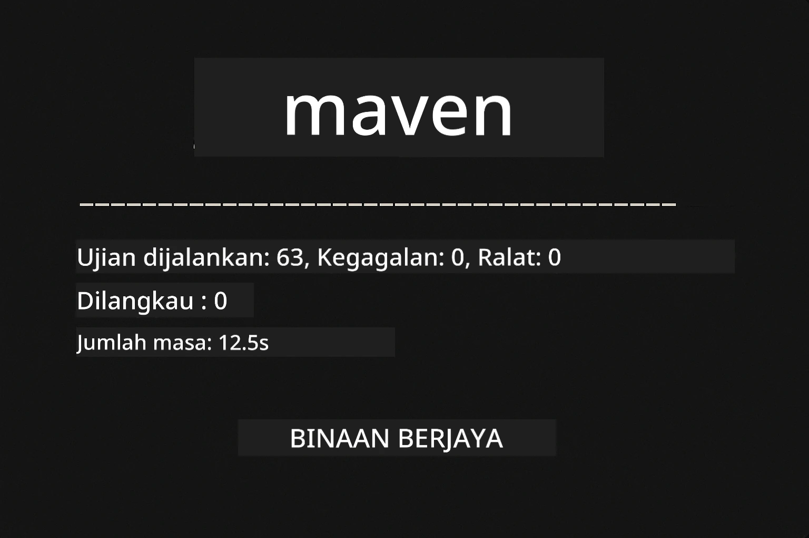
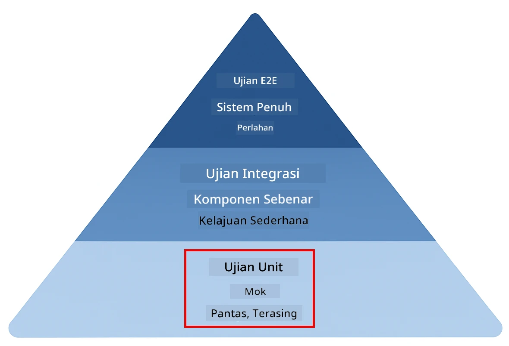
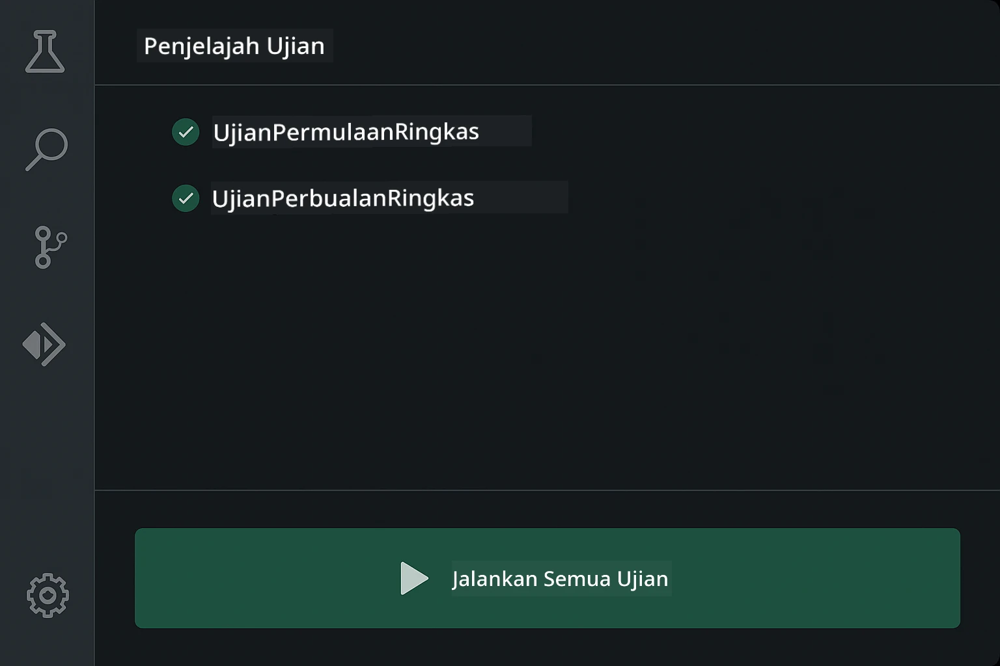
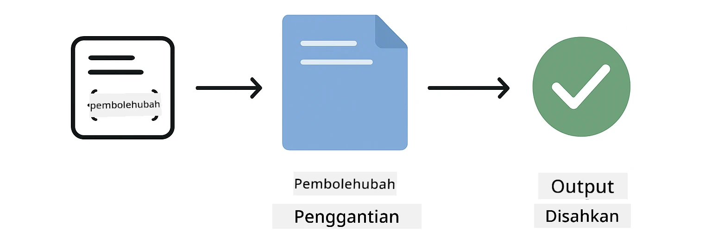
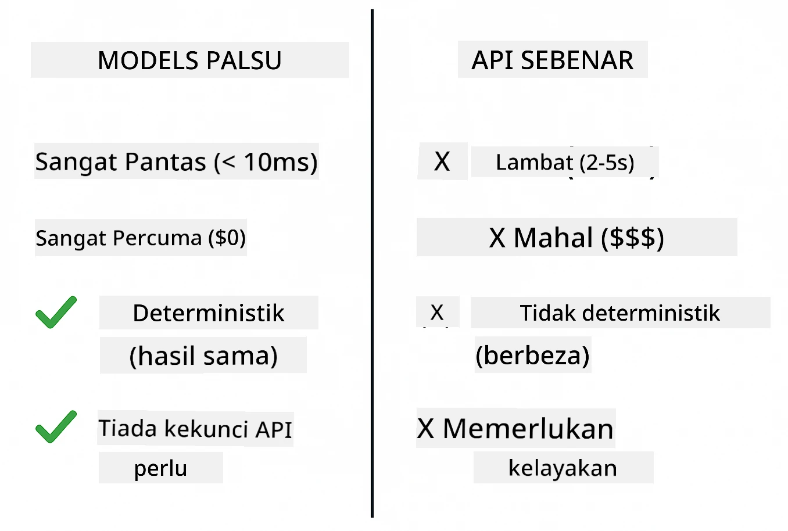
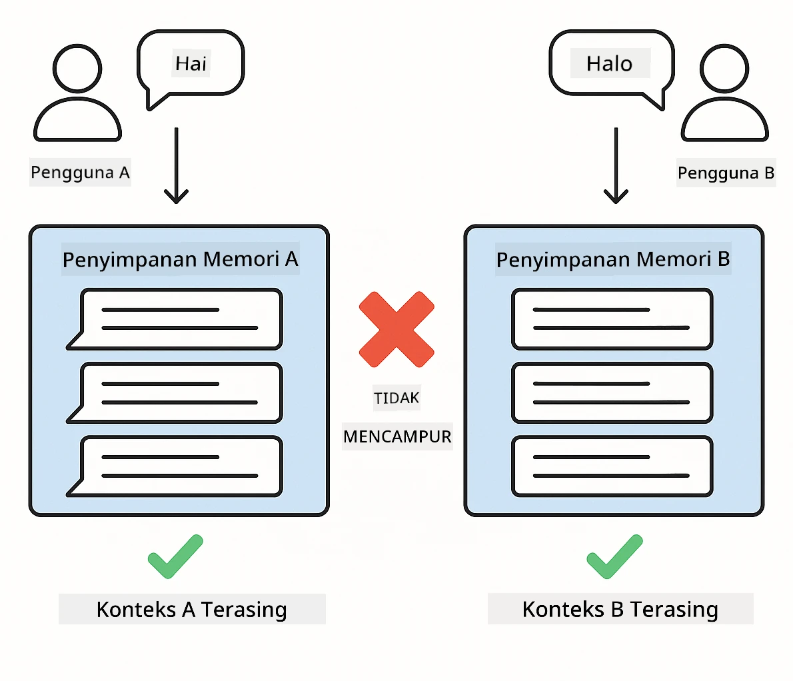
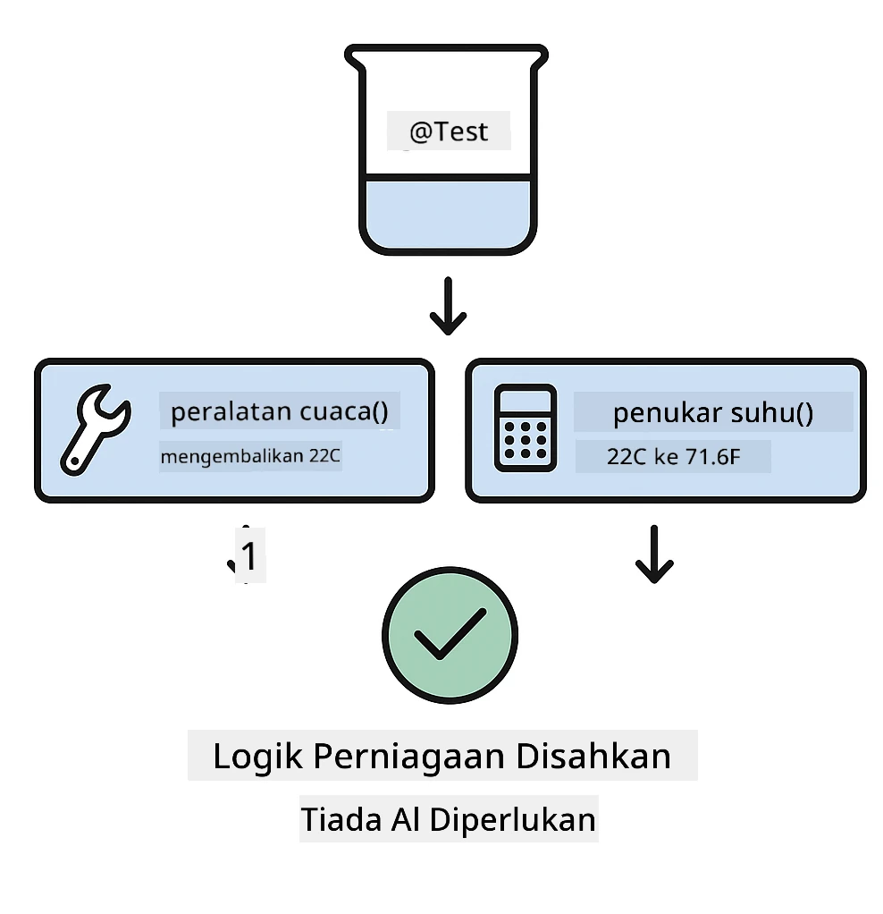
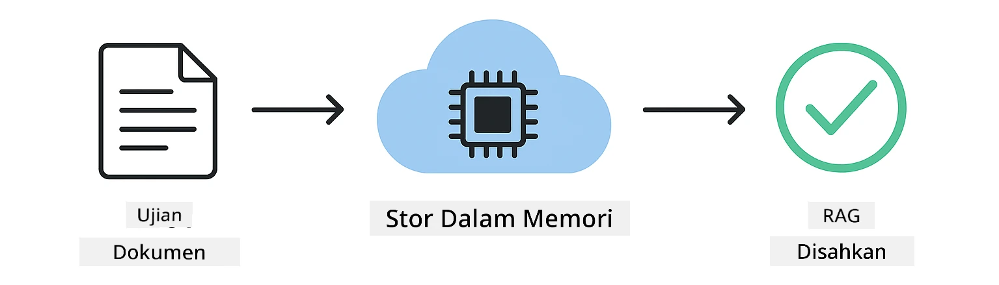

# Menguji Aplikasi LangChain4j

## Isi Kandungan

- [Permulaan Pantas](../../../docs)
- [Apakah Yang Diuji](../../../docs)
- [Menjalankan Ujian](../../../docs)
- [Menjalankan Ujian dalam VS Code](../../../docs)
- [Corak Ujian](../../../docs)
- [Falsafah Ujian](../../../docs)
- [Langkah Seterusnya](../../../docs)

Panduan ini membawa anda menerusi ujian-ujian yang menunjukkan cara menguji aplikasi AI tanpa memerlukan kekunci API atau perkhidmatan luaran.

## Permulaan Pantas

Jalankan semua ujian dengan satu arahan:

**Bash:**
```bash
mvn test
```

**PowerShell:**
```powershell
mvn --% test
```



*Pelaksanaan ujian berjaya menunjukkan semua ujian lulus tanpa sebarang kegagalan*

## Apakah Yang Diuji

Kursus ini menumpukan pada **ujian unit** yang dijalankan secara tempatan. Setiap ujian menunjukkan konsep LangChain4j tertentu secara terasing.



*Piramid ujian menunjukkan keseimbangan antara ujian unit (pantas, terasing), ujian integrasi (komponen sebenar), dan ujian hujung-ke-hujung. Latihan ini merangkumi ujian unit.*

| Modul | Ujian | Fokus | Fail Utama |
|--------|-------|-------|-----------|
| **00 - Permulaan Pantas** | 6 | Templat prompt dan penggantian pembolehubah | `SimpleQuickStartTest.java` |
| **01 - Pengenalan** | 8 | Memori perbualan dan sembang berkeadaan | `SimpleConversationTest.java` |
| **02 - Kejuruteraan Prompt** | 12 | Corak GPT-5, tahap keghairahan, keluaran berstruktur | `SimpleGpt5PromptTest.java` |
| **03 - RAG** | 10 | Ingest dokumen, embedding, carian kesamaan | `DocumentServiceTest.java` |
| **04 - Alat** | 12 | Panggilan fungsi dan rantai alat | `SimpleToolsTest.java` |
| **05 - MCP** | 8 | Model Context Protocol dengan pengangkutan Stdio | `SimpleMcpTest.java` |

## Menjalankan Ujian

**Jalankan semua ujian dari akar:**

**Bash:**
```bash
mvn test
```

**PowerShell:**
```powershell
mvn --% test
```

**Jalankan ujian untuk modul tertentu:**

**Bash:**
```bash
cd 01-introduction && mvn test
# Atau dari root
mvn test -pl 01-introduction
```

**PowerShell:**
```powershell
cd 01-introduction; mvn --% test
# Atau dari root
mvn --% test -pl 01-introduction
```

**Jalankan satu kelas ujian tunggal:**

**Bash:**
```bash
mvn test -Dtest=SimpleConversationTest
```

**PowerShell:**
```powershell
mvn --% test -Dtest=SimpleConversationTest
```

**Jalankan kaedah ujian tertentu:**

**Bash:**
```bash
mvn test -Dtest=SimpleConversationTest#sepatutnya mengekalkan sejarah perbualan
```

**PowerShell:**
```powershell
mvn --% test -Dtest=SimpleConversationTest#sepatutnya mengekalkan sejarah perbualan
```

## Menjalankan Ujian dalam VS Code

Jika anda menggunakan Visual Studio Code, Test Explorer menyediakan antara muka grafik untuk menjalankan dan mengimbas langkah demi langkah ujian.



*Peneroka Ujian VS Code menunjukkan pokok ujian dengan semua kelas ujian Java dan kaedah ujian individu*

**Untuk menjalankan ujian dalam VS Code:**

1. Buka Test Explorer dengan mengklik ikon tabung uji dalam Activity Bar
2. Kembangkan pokok ujian untuk melihat semua modul dan kelas ujian
3. Klik butang main berhampiran mana-mana ujian untuk menjalankannya secara individu
4. Klik "Run All Tests" untuk melaksanakan keseluruhan suite
5. Klik kanan mana-mana ujian dan pilih "Debug Test" untuk menetapkan breakpoint dan menjejak kod

Test Explorer menunjukkan tanda semak hijau untuk ujian yang lulus dan menyediakan mesej kegagalan terperinci apabila ujian gagal.

## Corak Ujian

### Corak 1: Menguji Templat Prompt

Corak paling ringkas menguji templat prompt tanpa memanggil mana-mana model AI. Anda mengesahkan bahawa penggantian pembolehubah berfungsi dengan betul dan prompt diformat seperti yang dijangka.



*Menguji templat prompt yang menunjukkan aliran penggantian pembolehubah: templat dengan pemegang tempat → nilai digunakan → keluaran yang diformat disahkan*

```java
@Test
@DisplayName("Should format prompt template with variables")
void testPromptTemplateFormatting() {
    PromptTemplate template = PromptTemplate.from(
        "Best time to visit {{destination}} for {{activity}}?"
    );
    
    Prompt prompt = template.apply(Map.of(
        "destination", "Paris",
        "activity", "sightseeing"
    ));
    
    assertThat(prompt.text()).isEqualTo("Best time to visit Paris for sightseeing?");
}
```

This test lives in `00-quick-start/src/test/java/com/example/langchain4j/quickstart/SimpleQuickStartTest.java`.

**Jalankan ia:**

**Bash:**
```bash
cd 00-quick-start && mvn test -Dtest=SimpleQuickStartTest#uji pemformatan templat prompt
```

**PowerShell:**
```powershell
cd 00-quick-start; mvn --% test -Dtest=SimpleQuickStartTest#uji pemformatan templat prompt
```

### Corak 2: Memock Model Bahasa

Apabila menguji logik perbualan, gunakan Mockito untuk mencipta model palsu yang mengembalikan respons yang telah ditentukan. Ini menjadikan ujian pantas, percuma, dan deterministik.



*Perbandingan yang menunjukkan mengapa mock diutamakan untuk ujian: ia pantas, percuma, deterministik, dan tidak memerlukan kekunci API*

```java
@ExtendWith(MockitoExtension.class)
class SimpleConversationTest {
    
    private ConversationService conversationService;
    
    @Mock
    private OpenAiOfficialChatModel mockChatModel;
    
    @BeforeEach
    void setUp() {
        ChatResponse mockResponse = ChatResponse.builder()
            .aiMessage(AiMessage.from("This is a test response"))
            .build();
        when(mockChatModel.chat(anyList())).thenReturn(mockResponse);
        
        conversationService = new ConversationService(mockChatModel);
    }
    
    @Test
    void shouldMaintainConversationHistory() {
        String conversationId = conversationService.startConversation();
        
        ChatResponse mockResponse1 = ChatResponse.builder()
            .aiMessage(AiMessage.from("Response 1"))
            .build();
        ChatResponse mockResponse2 = ChatResponse.builder()
            .aiMessage(AiMessage.from("Response 2"))
            .build();
        ChatResponse mockResponse3 = ChatResponse.builder()
            .aiMessage(AiMessage.from("Response 3"))
            .build();
        
        when(mockChatModel.chat(anyList()))
            .thenReturn(mockResponse1)
            .thenReturn(mockResponse2)
            .thenReturn(mockResponse3);

        conversationService.chat(conversationId, "First message");
        conversationService.chat(conversationId, "Second message");
        conversationService.chat(conversationId, "Third message");

        List<ChatMessage> history = conversationService.getHistory(conversationId);
        assertThat(history).hasSize(6); // 3 mesej pengguna + 3 mesej AI
    }
}
```

This pattern appears in `01-introduction/src/test/java/com/example/langchain4j/service/SimpleConversationTest.java`. The mock ensures consistent behavior so you can verify memory management works correctly.

### Corak 3: Menguji Pengasingan Perbualan

Memori perbualan mesti mengekalkan pemisahan antara berbilang pengguna. Ujian ini mengesahkan bahawa perbualan tidak mencampurkan konteks.



*Menguji pengasingan perbualan yang menunjukkan stor memori berasingan untuk pengguna berbeza untuk mengelakkan pencampuran konteks*

```java
@Test
void shouldIsolateConversationsByid() {
    String conv1 = conversationService.startConversation();
    String conv2 = conversationService.startConversation();
    
    ChatResponse mockResponse = ChatResponse.builder()
        .aiMessage(AiMessage.from("Response"))
        .build();
    when(mockChatModel.chat(anyList())).thenReturn(mockResponse);

    conversationService.chat(conv1, "Message for conversation 1");
    conversationService.chat(conv2, "Message for conversation 2");

    List<ChatMessage> history1 = conversationService.getHistory(conv1);
    List<ChatMessage> history2 = conversationService.getHistory(conv2);
    
    assertThat(history1).hasSize(2);
    assertThat(history2).hasSize(2);
}
```

Each conversation maintains its own independent history. In production systems, this isolation is critical for multi-user applications.

### Corak 4: Menguji Alat Secara Berasingan

Alat adalah fungsi yang boleh dipanggil oleh AI. Uji mereka secara langsung untuk memastikan ia berfungsi dengan betul tanpa mengira keputusan AI.



*Menguji alat secara berasingan yang menunjukkan pelaksanaan alat mock tanpa panggilan AI untuk mengesahkan logik perniagaan*

```java
@Test
void shouldConvertCelsiusToFahrenheit() {
    TemperatureTool tempTool = new TemperatureTool();
    String result = tempTool.celsiusToFahrenheit(25.0);
    assertThat(result).containsPattern("77[.,]0°F");
}

@Test
void shouldDemonstrateToolChaining() {
    WeatherTool weatherTool = new WeatherTool();
    TemperatureTool tempTool = new TemperatureTool();

    String weatherResult = weatherTool.getCurrentWeather("Seattle");
    assertThat(weatherResult).containsPattern("\\d+°C");

    String conversionResult = tempTool.celsiusToFahrenheit(22.0);
    assertThat(conversionResult).containsPattern("71[.,]6°F");
}
```

These tests from `04-tools/src/test/java/com/example/langchain4j/agents/tools/SimpleToolsTest.java` validate tool logic without AI involvement. The chaining example shows how one tool's output feeds into another's input.

### Corak 5: Ujian RAG Dalam Memori

Sistem RAG secara tradisinya memerlukan pangkalan data vektor dan perkhidmatan embedding. Corak dalam-memori membolehkan anda menguji keseluruhan aliran tanpa pergantungan luaran.



*Aliran kerja ujian RAG dalam memori yang menunjukkan penguraian dokumen, penyimpanan embedding, dan carian kesamaan tanpa memerlukan pangkalan data*

```java
@Test
void testProcessTextDocument() {
    String content = "This is a test document.\nIt has multiple lines.";
    InputStream inputStream = new ByteArrayInputStream(content.getBytes(StandardCharsets.UTF_8));
    
    DocumentService.ProcessedDocument result = 
        documentService.processDocument(inputStream, "test.txt");

    assertNotNull(result);
    assertTrue(result.segments().size() > 0);
    assertEquals("test.txt", result.segments().get(0).metadata().getString("filename"));
}
```

This test from `03-rag/src/test/java/com/example/langchain4j/rag/service/DocumentServiceTest.java` creates a document in memory and verifies chunking and metadata handling.

### Corak 6: Ujian Integrasi MCP

Modul MCP menguji integrasi Model Context Protocol menggunakan pengangkutan stdio. Ujian-ujian ini mengesahkan bahawa aplikasi anda boleh menerbitkan dan berkomunikasi dengan pelayan MCP sebagai proses anak.

The tests in `05-mcp/src/test/java/com/example/langchain4j/mcp/SimpleMcpTest.java` validate MCP client behavior.

**Jalankan mereka:**

**Bash:**
```bash
cd 05-mcp && mvn test
```

**PowerShell:**
```powershell
cd 05-mcp; mvn --% test
```

## Falsafah Ujian

Uji kod anda, bukan AI. Ujian anda harus mengesahkan kod yang anda tulis dengan memeriksa bagaimana prompt dibina, bagaimana memori diurus, dan bagaimana alat dilaksanakan. Respons AI berubah-ubah dan tidak sepatutnya menjadi sebahagian daripada tanggapan ujian. Tanya diri anda sama ada templat prompt anda menukar pembolehubah dengan betul, bukan sama ada AI memberikan jawapan yang betul.

Gunakan mock untuk model bahasa. Mereka adalah pergantungan luaran yang perlahan, mahal, dan tidak deterministik. Mock menjadikan ujian pantas dengan milisaat berbanding saat, percuma tanpa kos API, dan deterministik dengan keputusan yang sama setiap kali.

Pastikan ujian berdikari. Setiap ujian harus menyediakan data sendiri, tidak bergantung pada ujian lain, dan membersihkan selepas dirinya. Ujian harus lulus tanpa mengira susunan pelaksanaan.

Uji kes sempadan selain laluan gembira. Cuba input kosong, input yang sangat besar, aksara khas, parameter tidak sah, dan keadaan sempadan. Ini sering mendedahkan pepijat yang penggunaan biasa tidak tunjukkan.

Gunakan nama yang deskriptif. Bandingkan `shouldMaintainConversationHistoryAcrossMultipleMessages()` dengan `test1()`. Yang pertama memberitahu anda dengan tepat apa yang diuji, memudahkan penyahpepijatan apabila kegagalan berlaku.

## Langkah Seterusnya

Sekarang anda memahami corak ujian, selami setiap modul dengan lebih mendalam:

- **[00 - Permulaan Pantas](../00-quick-start/README.md)** - Mula dengan asas templat prompt
- **[01 - Pengenalan](../01-introduction/README.md)** - Pelajari pengurusan memori perbualan
- **[02 - Kejuruteraan Prompt](../02-prompt-engineering/README.md)** - Kuasai corak prompting GPT-5
- **[03 - RAG](../03-rag/README.md)** - Bina sistem penghasilan dengan pengayaan pemanggilan carian
- **[04 - Alat](../04-tools/README.md)** - Laksanakan panggilan fungsi dan rantai alat
- **[05 - MCP](../05-mcp/README.md)** - Integrasikan Model Context Protocol

README setiap modul menyediakan penjelasan terperinci mengenai konsep yang diuji di sini.

---

**Navigasi:** [← Kembali ke Utama](../README.md)

---

<!-- CO-OP TRANSLATOR DISCLAIMER START -->
Penafian:
Dokumen ini telah diterjemahkan menggunakan perkhidmatan terjemahan AI [Co-op Translator](https://github.com/Azure/co-op-translator). Walaupun kami berusaha untuk memastikan ketepatan, sila ambil maklum bahawa terjemahan automatik mungkin mengandungi ralat atau ketidaktepatan. Dokumen asal dalam bahasa asalnya hendaklah dianggap sebagai sumber yang sahih. Untuk maklumat yang kritikal, disarankan mendapatkan terjemahan profesional oleh penterjemah manusia. Kami tidak bertanggungjawab terhadap sebarang salah faham atau salah tafsiran yang timbul daripada penggunaan terjemahan ini.
<!-- CO-OP TRANSLATOR DISCLAIMER END -->