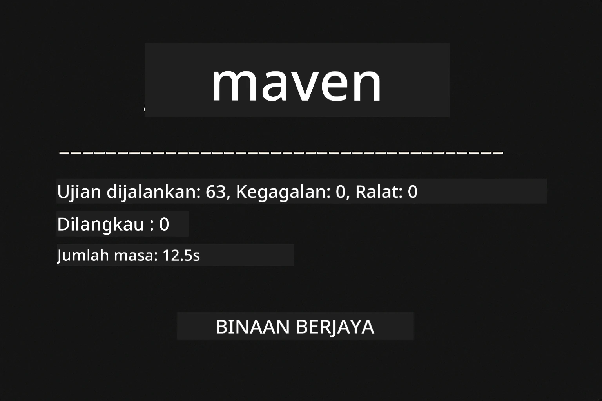
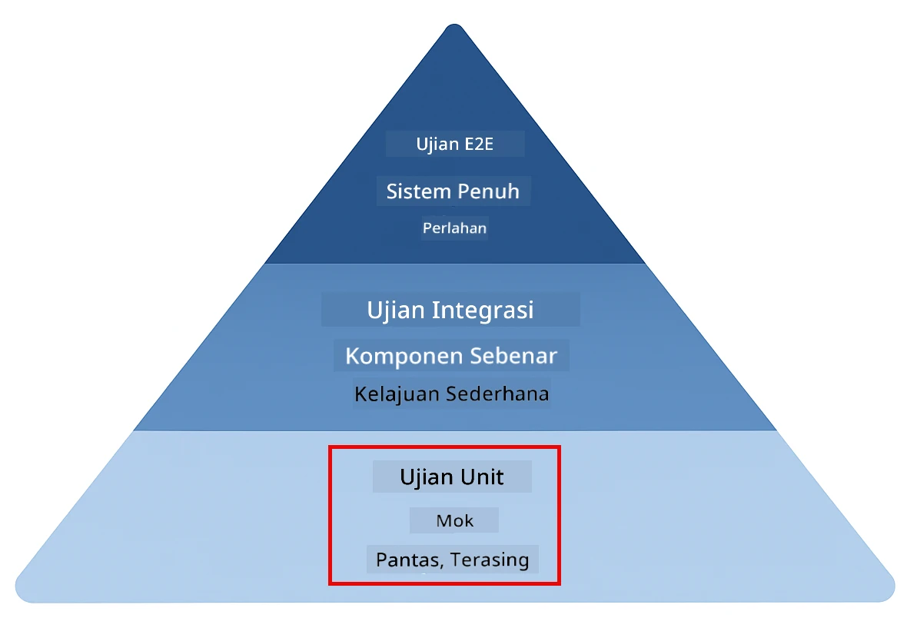
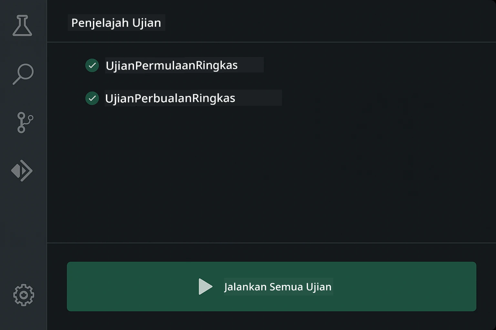
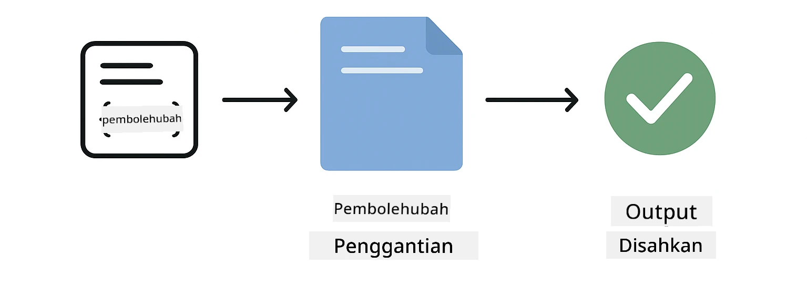
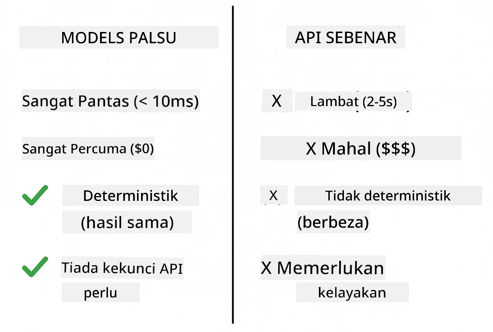
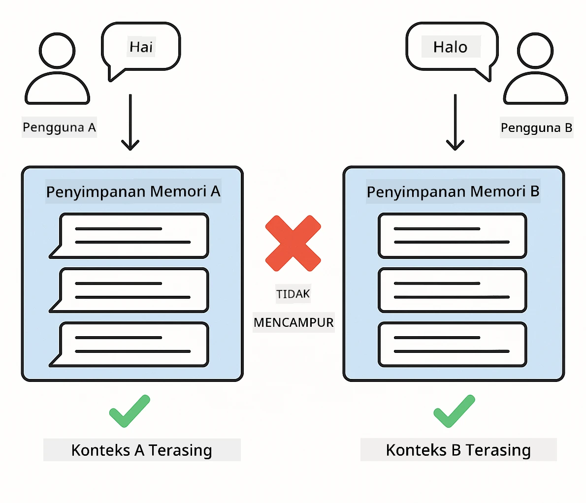
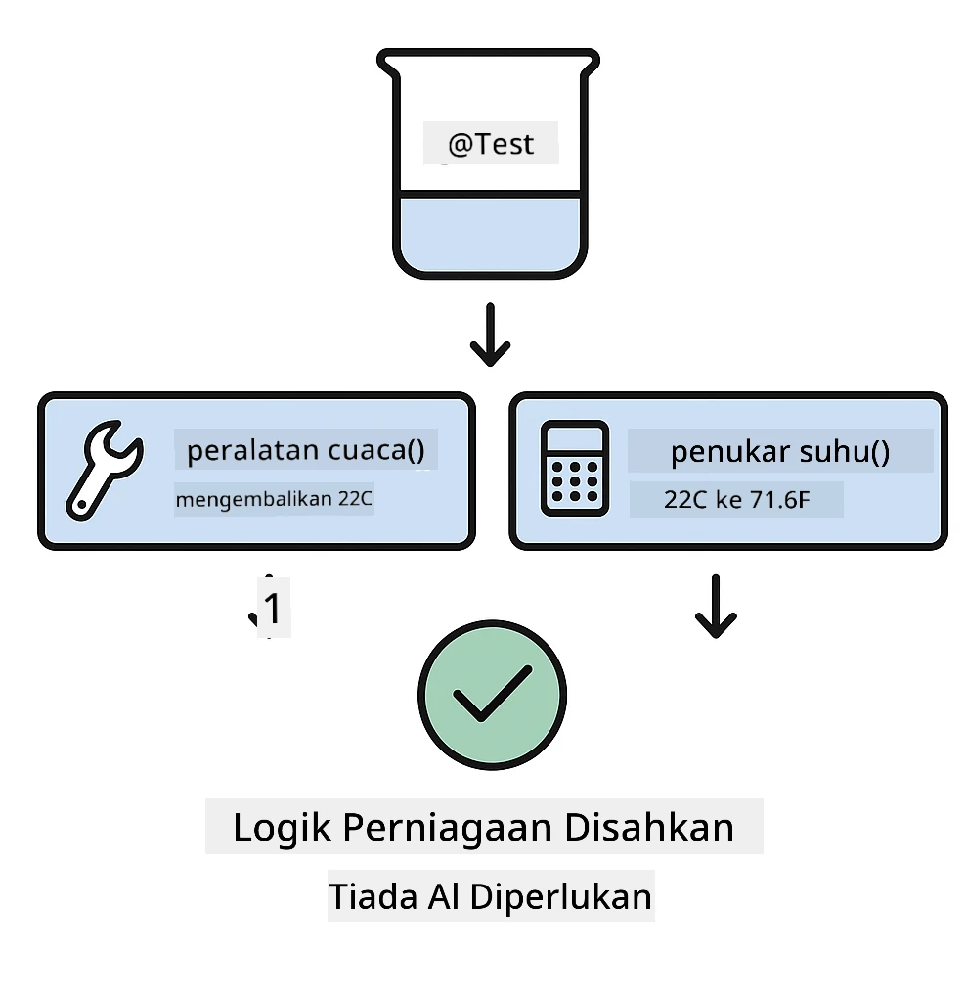
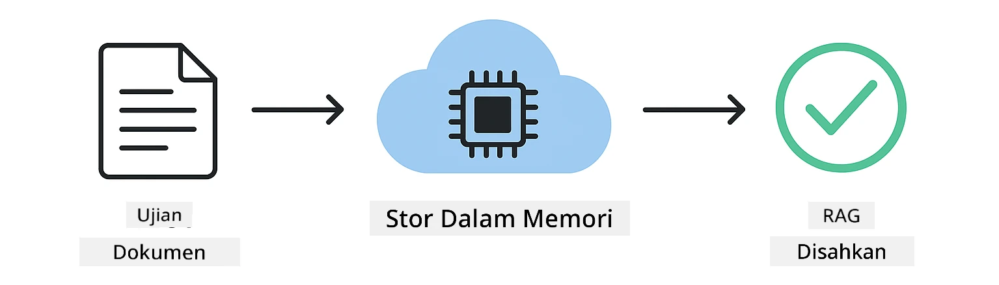

# Ujian Aplikasi LangChain4j

## Jadual Kandungan

- [Mula Cepat](#mula-cepat)
- [Apa yang Diliputi oleh Ujian](#apa-yang-diliputi-oleh-ujian)
- [Menjalankan Ujian](#menjalankan-ujian)
- [Menjalankan Ujian dalam VS Code](#menjalankan-ujian-dalam-vs-code)
- [Corak Ujian](#corak-ujian)
- [Falsafah Ujian](#falsafah-ujian)
- [Langkah Seterusnya](#langkah-seterusnya)

Panduan ini membimbing anda melalui ujian yang menunjukkan cara menguji aplikasi AI tanpa memerlukan kunci API atau perkhidmatan luaran.

## Mula Cepat

Jalankan semua ujian dengan satu arahan:

**Bash:**
```bash
mvn test
```

**PowerShell:**
```powershell
mvn --% test
```

Apabila semua ujian lulus, anda akan melihat output seperti tangkapan skrin di bawah — ujian dijalankan dengan sifar kegagalan.



*Pelaksanaan ujian berjaya menunjukkan semua ujian lulus dengan sifar kegagalan*

## Apa yang Diliputi oleh Ujian

Kursus ini memberi tumpuan kepada **ujian unit** yang dijalankan secara setempat. Setiap ujian menunjukkan konsep LangChain4j tertentu secara berasingan. Piramid ujian di bawah menunjukkan di mana ujian unit sesuai — ia membentuk asas yang pantas dan boleh dipercayai yang dibina oleh strategi ujian anda yang lain.



*Piramid ujian menunjukkan keseimbangan antara ujian unit (cepat, terasing), ujian integrasi (komponen sebenar), dan ujian hujung-ke-hujung. Latihan ini meliputi ujian unit.*

| Modul | Ujian | Fokus | Fail Utama |
|--------|-------|-------|-----------|
| **01 - Pengenalan** | 8 | Memori perbualan dan chat berkeadaan | `SimpleConversationTest.java` |
| **02 - Kejuruteraan Prompt** | 12 | Corak GPT-5.2, tahap kesungguhan, output berstruktur | `SimpleGpt5PromptTest.java` |
| **03 - RAG** | 10 | Pengambilan dokumen, penanaman, carian persamaan | `DocumentServiceTest.java` |
| **04 - Alat** | 12 | Panggilan fungsi dan rantaian alat | `SimpleToolsTest.java` |
| **05 - MCP** | 8 | Protokol Konteks Model dengan pengangkutan Stdio | `SimpleMcpTest.java` |

## Menjalankan Ujian

**Jalankan semua ujian dari akar:**

**Bash:**
```bash
mvn test
```

**PowerShell:**
```powershell
mvn --% test
```

**Jalankan ujian untuk modul tertentu:**

**Bash:**
```bash
cd 01-introduction && mvn test
# Atau dari akar
mvn test -pl 01-introduction
```

**PowerShell:**
```powershell
cd 01-introduction; mvn --% test
# Atau dari akar
mvn --% test -pl 01-introduction
```

**Jalankan kelas ujian tunggal:**

**Bash:**
```bash
mvn test -Dtest=SimpleConversationTest
```

**PowerShell:**
```powershell
mvn --% test -Dtest=SimpleConversationTest
```

**Jalankan kaedah ujian tertentu:**

**Bash:**
```bash
mvn test -Dtest=SimpleConversationTest#harusMengekalkanSejarahPerbualan
```

**PowerShell:**
```powershell
mvn --% test -Dtest=SimpleConversationTest#perluMengekalkanSejarahPerbualan
```

## Menjalankan Ujian dalam VS Code

Jika anda menggunakan Visual Studio Code, Penjelajah Ujian menyediakan antara muka grafik untuk menjalankan dan debug ujian.



*Penjelajah Ujian VS Code menunjukkan pokok ujian dengan semua kelas ujian Java dan kaedah ujian individu*

**Untuk menjalankan ujian dalam VS Code:**

1. Buka Penjelajah Ujian dengan mengklik ikon tabung uji dalam Bar Aktiviti
2. Kembangkan pokok ujian untuk melihat semua modul dan kelas ujian
3. Klik butang main di sebelah mana-mana ujian untuk menjalankannya secara individu
4. Klik "Jalankan Semua Ujian" untuk melaksanakan keseluruhan suite
5. Klik kanan mana-mana ujian dan pilih "Debug Ujian" untuk menetapkan titik henti dan langkah melalui kod

Penjelajah Ujian menunjukkan tanda cek hijau untuk ujian yang lulus dan menyediakan mesej kegagalan terperinci apabila ujian gagal.

## Corak Ujian

### Corak 1: Menguji Templat Prompt

Corak paling mudah menguji templat prompt tanpa memanggil mana-mana model AI. Anda mengesahkan bahawa penggantian pembolehubah berfungsi dengan betul dan prompt diformat seperti yang dijangka.



*Ujian templat prompt menunjukkan aliran penggantian pembolehubah: templat dengan tempat letak → nilai diterapkan → output diformat disahkan*

```java
@Test
@DisplayName("Should format prompt template with variables")
void testPromptTemplateFormatting() {
    PromptTemplate template = PromptTemplate.from(
        "Best time to visit {{destination}} for {{activity}}?"
    );
    
    Prompt prompt = template.apply(Map.of(
        "destination", "Paris",
        "activity", "sightseeing"
    ));
    
    assertThat(prompt.text()).isEqualTo("Best time to visit Paris for sightseeing?");
}
```

Corak ini mengesahkan bahawa penggantian pembolehubah berfungsi dengan betul dan prompt diformat seperti yang dijangka — tiada kunci API atau panggilan model diperlukan.

### Corak 2: Memalsukan Model Bahasa

Apabila menguji logik perbualan, gunakan Mockito untuk mencipta model palsu yang mengembalikan respons yang telah ditentukan. Ini menjadikan ujian cepat, percuma, dan deterministik.



*Perbandingan menunjukkan mengapa mock lebih disukai untuk ujian: ia pantas, percuma, deterministik, dan tidak memerlukan kunci API*

```java
@ExtendWith(MockitoExtension.class)
class SimpleConversationTest {
    
    private ConversationService conversationService;
    
    @Mock
    private OpenAiOfficialChatModel mockChatModel;
    
    @BeforeEach
    void setUp() {
        ChatResponse mockResponse = ChatResponse.builder()
            .aiMessage(AiMessage.from("This is a test response"))
            .build();
        when(mockChatModel.chat(anyList())).thenReturn(mockResponse);
        
        conversationService = new ConversationService(mockChatModel);
    }
    
    @Test
    void shouldMaintainConversationHistory() {
        String conversationId = conversationService.startConversation();
        
        ChatResponse mockResponse1 = ChatResponse.builder()
            .aiMessage(AiMessage.from("Response 1"))
            .build();
        ChatResponse mockResponse2 = ChatResponse.builder()
            .aiMessage(AiMessage.from("Response 2"))
            .build();
        ChatResponse mockResponse3 = ChatResponse.builder()
            .aiMessage(AiMessage.from("Response 3"))
            .build();
        
        when(mockChatModel.chat(anyList()))
            .thenReturn(mockResponse1)
            .thenReturn(mockResponse2)
            .thenReturn(mockResponse3);

        conversationService.chat(conversationId, "First message");
        conversationService.chat(conversationId, "Second message");
        conversationService.chat(conversationId, "Third message");

        List<ChatMessage> history = conversationService.getHistory(conversationId);
        assertThat(history).hasSize(6); // 3 mesej pengguna + 3 mesej AI
    }
}
```

Corak ini muncul dalam `01-introduction/src/test/java/com/example/langchain4j/service/SimpleConversationTest.java`. Mock memastikan tingkah laku konsisten supaya anda boleh mengesahkan pengurusan memori berfungsi dengan betul.

### Corak 3: Menguji Pengasingan Perbualan

Memori perbualan mesti memisahkan pelbagai pengguna. Ujian ini mengesahkan perbualan tidak mencampurkan konteks.



*Ujian pengasingan perbualan menunjukkan stor memori berasingan untuk pengguna berbeza bagi mengelakkan pencampuran konteks*

```java
@Test
void shouldIsolateConversationsByid() {
    String conv1 = conversationService.startConversation();
    String conv2 = conversationService.startConversation();
    
    ChatResponse mockResponse = ChatResponse.builder()
        .aiMessage(AiMessage.from("Response"))
        .build();
    when(mockChatModel.chat(anyList())).thenReturn(mockResponse);

    conversationService.chat(conv1, "Message for conversation 1");
    conversationService.chat(conv2, "Message for conversation 2");

    List<ChatMessage> history1 = conversationService.getHistory(conv1);
    List<ChatMessage> history2 = conversationService.getHistory(conv2);
    
    assertThat(history1).hasSize(2);
    assertThat(history2).hasSize(2);
}
```

Setiap perbualan mengekalkan sejarahnya sendiri secara berdikari. Dalam sistem pengeluaran, pengasingan ini kritikal untuk aplikasi berbilang pengguna.

### Corak 4: Menguji Alat Secara Bebas

Alat adalah fungsi yang boleh dipanggil AI. Uji mereka terus untuk memastikan mereka berfungsi dengan betul tanpa mengira keputusan AI.



*Ujian alat secara bebas menunjukkan pelaksanaan alat palsu tanpa panggilan AI untuk mengesahkan logik perniagaan*

```java
@Test
void shouldConvertCelsiusToFahrenheit() {
    TemperatureTool tempTool = new TemperatureTool();
    String result = tempTool.celsiusToFahrenheit(25.0);
    assertThat(result).containsPattern("77[.,]0°F");
}

@Test
void shouldDemonstrateToolChaining() {
    WeatherTool weatherTool = new WeatherTool();
    TemperatureTool tempTool = new TemperatureTool();

    String weatherResult = weatherTool.getCurrentWeather("Seattle");
    assertThat(weatherResult).containsPattern("\\d+°C");

    String conversionResult = tempTool.celsiusToFahrenheit(22.0);
    assertThat(conversionResult).containsPattern("71[.,]6°F");
}
```

Ujian-ujian ini dari `04-tools/src/test/java/com/example/langchain4j/agents/tools/SimpleToolsTest.java` mengesahkan logik alat tanpa penglibatan AI. Contoh rantaian menunjukkan bagaimana output satu alat menjadi input alat lain.

### Corak 5: Ujian RAG Dalam Memori

Sistem RAG secara tradisional memerlukan pangkalan data vektor dan perkhidmatan penanaman. Corak dalam memori membolehkan anda menguji keseluruhan saluran tanpa kebergantungan luaran.



*Aliran kerja ujian RAG dalam memori menunjukkan penguraian dokumen, penyimpanan penanaman, dan carian persamaan tanpa memerlukan pangkalan data*

```java
@Test
void testProcessTextDocument() {
    String content = "This is a test document.\nIt has multiple lines.";
    InputStream inputStream = new ByteArrayInputStream(content.getBytes(StandardCharsets.UTF_8));
    
    DocumentService.ProcessedDocument result = 
        documentService.processDocument(inputStream, "test.txt");

    assertNotNull(result);
    assertTrue(result.segments().size() > 0);
    assertEquals("test.txt", result.segments().get(0).metadata().getString("filename"));
}
```

Ujian ini dari `03-rag/src/test/java/com/example/langchain4j/rag/service/DocumentServiceTest.java` mencipta dokumen dalam memori dan mengesahkan pengpecahan dan pengendalian metadata.

### Corak 6: Ujian Integrasi MCP

Modul MCP menguji integrasi Protokol Konteks Model menggunakan pengangkutan stdio. Ujian-ujian ini mengesahkan aplikasi anda boleh memulakan dan berkomunikasi dengan pelayan MCP sebagai proses anak.

Ujian dalam `05-mcp/src/test/java/com/example/langchain4j/mcp/SimpleMcpTest.java` mengesahkan tingkah laku klien MCP.

**Jalankan mereka:**

**Bash:**
```bash
cd 05-mcp && mvn test
```

**PowerShell:**
```powershell
cd 05-mcp; mvn --% test
```

## Falsafah Ujian

Uji kod anda, bukan AI. Ujian anda harus mengesahkan kod yang anda tulis dengan memeriksa cara prompt dibina, bagaimana memori diuruskan, dan bagaimana alat dilaksanakan. Respons AI berbeza-beza dan tidak sepatutnya menjadi sebahagian daripada kenyataan ujian. Tanya diri anda sama ada templat prompt anda menggantikan pembolehubah dengan betul, bukan sama ada AI memberi jawapan yang betul.

Gunakan mock untuk model bahasa. Ia adalah kebergantungan luaran yang lambat, mahal, dan tidak deterministik. Mocking menjadikan ujian pantas dengan milisaat bukannya saat, percuma tanpa kos API, dan deterministik dengan hasil yang sama setiap kali.

Kekalkan ujian bebas. Setiap ujian harus menyediakan data sendiri, tidak bergantung pada ujian lain, dan membersihkan selepas dirinya. Ujian harus lulus tanpa mengira susunan pelaksanaan.

Uji kes tepi di luar laluan biasa. Cuba input kosong, input sangat besar, aksara khas, parameter tidak sah, dan keadaan sempadan. Ini sering mendedahkan pepijat yang tidak didedahkan penggunaan biasa.

Gunakan nama yang deskriptif. Bandingkan `shouldMaintainConversationHistoryAcrossMultipleMessages()` dengan `test1()`. Yang pertama memberitahu anda dengan tepat apa yang diuji, menjadikannya lebih mudah untuk mengesan ralat.

## Langkah Seterusnya

Sekarang anda memahami corak ujian, selami lebih mendalam setiap modul:

- **[01 - Pengenalan](../01-introduction/README.md)** - Pelajari pengurusan memori perbualan
- **[02 - Kejuruteraan Prompt](../02/prompt-engineering/README.md)** - Kuasai corak prompting GPT-5.2
- **[03 - RAG](../03-rag/README.md)** - Bina sistem retrieval-augmented generation
- **[04 - Alat](../04-tools/README.md)** - Laksanakan panggilan fungsi dan rantaian alat
- **[05 - MCP](../05-mcp/README.md)** - Integrasi Protokol Konteks Model

README setiap modul menyediakan penjelasan terperinci tentang konsep yang diuji di sini.

---

**Navigasi:** [← Kembali ke Utama](../README.md)

---

<!-- CO-OP TRANSLATOR DISCLAIMER START -->
**Penafian**:
Dokumen ini telah diterjemahkan menggunakan perkhidmatan terjemahan AI [Co-op Translator](https://github.com/Azure/co-op-translator). Walaupun kami berusaha untuk ketepatan, sila ambil maklum bahawa terjemahan automatik mungkin mengandungi kesilapan atau ketidaktepatan. Dokumen asal dalam bahasa asalnya harus dianggap sebagai sumber yang sahih. Untuk maklumat penting, terjemahan oleh manusia profesional adalah disyorkan. Kami tidak bertanggungjawab terhadap sebarang salah faham atau salah tafsir yang timbul daripada penggunaan terjemahan ini.
<!-- CO-OP TRANSLATOR DISCLAIMER END -->