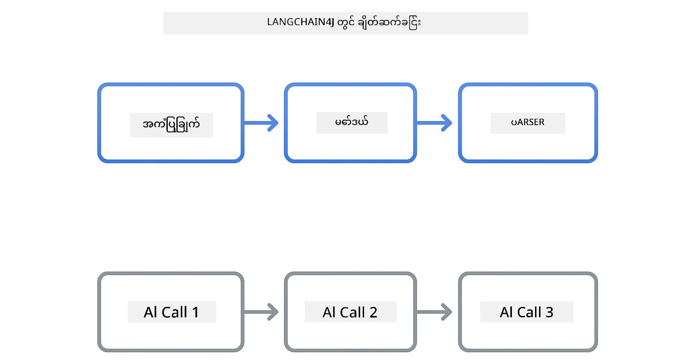
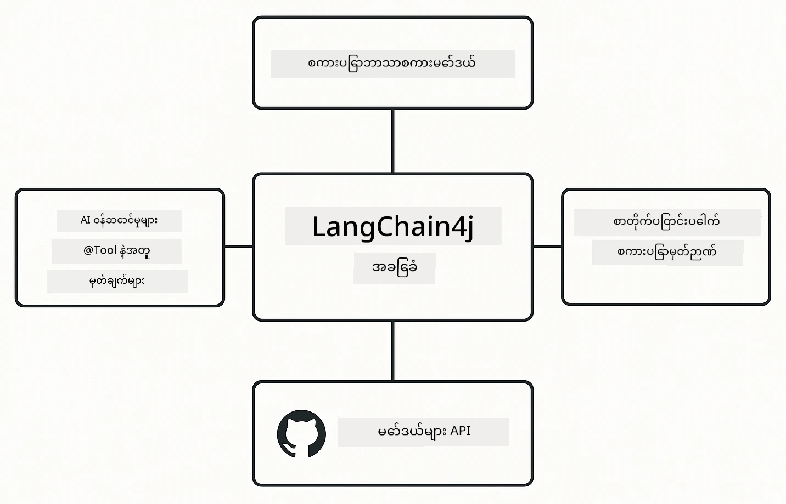

<!--
CO_OP_TRANSLATOR_METADATA:
{
  "original_hash": "22b5d7c8d7585325e38b37fd29eafe25",
  "translation_date": "2026-01-06T01:34:29+00:00",
  "source_file": "00-quick-start/README.md",
  "language_code": "my"
}
-->
# Module 00: အမြန် စတင်ခြင်း

## အကြောင်းအရာ စာရင်း

- [နိဒါန်း](../../../00-quick-start)
- [LangChain4j ဆိုတာဘာလဲ?](../../../00-quick-start)
- [LangChain4j မှာ အပ်ဒိတ်စနစ်](../../../00-quick-start)
- [လိုအပ်ချက်များ](../../../00-quick-start)
- [ဆက်တင်ခြင်း](../../../00-quick-start)
  - [1. သင်၏ GitHub Token ရယူခြင်း](../../../00-quick-start)
  - [2. သင်၏ Token သတ်မှတ်ခြင်း](../../../00-quick-start)
- [နမူနာများကို ပြေးပါ](../../../00-quick-start)
  - [1. အခြေခံ စကားပြော](../../../00-quick-start)
  - [2. Prompt Patterns](../../../00-quick-start)
  - [3. Function Calling](../../../00-quick-start)
  - [4. စာတမ်း Q&A (RAG)](../../../00-quick-start)
  - [5. တာဝန်ရှိသော AI](../../../00-quick-start)
- [နမူနာတိုင်း ပြသပုံ](../../../00-quick-start)
- [နောက်တက်ရန်အဆင့်များ](../../../00-quick-start)
- [ပြဿနာဖြေရှင်းခြင်း](../../../00-quick-start)

## နိဒါန်း

ဒီ အမြန် စတင်ခရမ်းလမ်းညွှန်မှာ LangChain4j နဲ့ ပိုမိုမြန်ဆန်စွာ လည်ပတ်နိုင်ရန်ကို ရည်ရွယ်ထားပါတယ်။ LangChain4j နဲ့ GitHub Models အသုံးပြုပြီး AI အက်ပလောကေးရှင်းများ ဖန်တီးနည်းအခြေခံကို ဖော်ပြပြီး နောက်တဖန် Modules မှာ Azure OpenAI နဲ့ ပိုမိုတိုးတက်သော အက်ပလောကေးရှင်းများ ဖန်တီးမှာ ဖြစ်သည်။

## LangChain4j ဆိုတာဘာလဲ?

LangChain4j သည် AI အင်အားဖြင့် အက်ပလောကေးရှင်းများ ဖန်တီးရန် အလွယ်တကူ အသုံးပြုနိုင်ရန် Java စာကြောင်းစာစဉ်တစ်ခု ဖြစ်သည်။ HTTP client များနှင့် JSON parsing တွေနဲ့ ရှုပ်ထွေးစရာမလိုဘဲ စင်ကြယ်သော Java API များဖြင့် အလုပ်လုပ်နိုင်သည်။

LangChain ကို “ချိန်း” ဆိုသော အဓိပ္ပာယ်မှာ ကွန်ပွန်နင့်များကို ဆက်စပ်ခြင်းဖြစ်ပြီး၊ စကားပုံတစ်ခုကို မော်ဒယ်၊ ပARSER အနေနဲ့ ချိန်း၊ ဒါမှမဟုတ် AI ခေါ်ဆိုမှုများ စဉ်ဆက်မပြတ် ချိန်းဖက်ပြီး တစ်ခုရလျှင် နောက်ထပ်ကို ထောက်ပံ့ပေးနိုင်သည်။ ဒီ အမြန် စတင်ခြင်းမှာ အခြေခံအကြောင်းအရာများသာ အာရုံစူးစိုက်ပြီး ပိုမိုရှုပ်ထွေးသော ချိန်းများကို နောက်ပိုင်း၌ ဖြေလေဖြာမည်။



*LangChain4j တွင် ချိန်းယောက် - အဆောက်အအုံများ ဆက်သွယ်ပြီး အခိုင်အမာ AI စီးရီးများ ဖန်တီးခြင်း*

ကျွန်ုပ်တို့ သုံးမည့် အဓိက အစိတ်အပိုင်းသုံးခုမှာ -

**ChatLanguageModel** - AI မော်ဒယ်နှင့် ဆက်သွယ်ရန်အင်တာဖေ့စ်။ `model.chat("prompt")` ကိုခေါ်ပြီး ဖြေကြားစာသား ရရှိမည်။ OpenAI သို့ရောက်ရှိနိုင်သော GitHub Models နှင့်အလုပ်လုပ်သော `OpenAiOfficialChatModel` ကို သုံးသည်။

**AiServices** - အသုံးပြုသူအတွက် လုံခြုံသော AI ဝန်ဆောင်မှု အင်တာဖေ့စ် ပြုလုပ်ပေးသည်။ မိုဃ်းတိမ် (methods) များသတ်မှတ်ပြီး `@Tool` ဖြင့်မှတ်သား၊ LangChain4j က ဂျာဗာနည်းလမ်းများကို အလိုအလျောက် ခေါ်ဆိုပေးသည်။

**MessageWindowChatMemory** - စကားပြောမှတ်တမ်း သိမ်းဆည်းသည်။ ဒီအပိုင်းမရှိပါက တစ်ကြိမ်ခ်င်းစီ ပြောဆိုမှုတည်ငြိမ်မှုမရှိဘူး။ ပါဝင်၍ AI သည် ယခင်စာသားများကို မှတ်မိပြီး context ကို သိမ်းဆည်းထားနိုင်သည်။



*LangChain4j တည်ဆောက်မှု - အဓိက အစိတ်အပိုင်းများ သင်၏ AI အက်ပလောကေးရှင်းများကို အားပေး ဆက်လက်လုပ်ဆောင်ခြင်း*

## LangChain4j မှာ အပ်ဒိတ်စနစ်

ဒီ အမြန် စတင်ခရမ်းလမ်းညွှန်တွင် [`pom.xml`](../../../00-quick-start/pom.xml) ထဲရှိ Maven အပေါ်ခံ နှစ်ခုကို သုံးသည်-

```xml
<!-- Core LangChain4j library -->
<dependency>
    <groupId>dev.langchain4j</groupId>
    <artifactId>langchain4j</artifactId> <!-- Inherited from BOM in root pom.xml -->
</dependency>

<!-- OpenAI integration (works with GitHub Models) -->
<dependency>
    <groupId>dev.langchain4j</groupId>
    <artifactId>langchain4j-open-ai-official</artifactId> <!-- Inherited from BOM in root pom.xml -->
</dependency>
```

`langchain4j-open-ai-official` မော်ဒူးကတော့ OpenAI API များနဲ့ချိတ်ဆက်သုံးနိုင်သော `OpenAiOfficialChatModel` class ကို ပေးသည်။ GitHub Models တွင် API ဖော်မတ် မတူပေမယ့် မတူညီမှုမျိုး မရှိဘဲ `https://models.github.ai/inference` ကို base URL အနေနဲ့ သတ်မှတ်ရုံသာ လိုအပ်သည်။

## လိုအပ်ချက်များ

**Dev Container အသုံးပြုပါသလား?** Java နဲ့ Maven များ ရှိပြီးဖြစ်သည်။ GitHub Personal Access Token တစ်ခုသာ လိုအပ်ပါသည်။

**ဒေသခံဖွံ့ဖြိုးမှု:**
- Java 21+၊ Maven 3.9+
- GitHub Personal Access Token (အောက်တွင်လမ်းညွှန်)

> **မှတ်ချက်:** ဒီ Module မှာ GitHub Models ၏ `gpt-4.1-nano` ကို သုံးသည်။ Code မှာ model အမည်ကို မပြောင်းနဲ့ - GitHub မှ ရရှိနိုင်သော မော်ဒယ်များအတွက် အလုပ်လုပ်ဖို့ ဖန်တီးထားပါသည်။

## ဆက်တင်ခြင်း

### 1. သင်၏ GitHub Token ရယူခြင်း

1. [GitHub Settings → Personal Access Tokens](https://github.com/settings/personal-access-tokens) ကို သွားပါ
2. "Generate new token" ကို နှိပ်ပါ
3. ဖော်ပြချက် အမည် တစ်ခုပေးပါ (ဥပမာ - "LangChain4j Demo")
4. သက်တမ်း သတ်မှတ်ပါ (7 ရက် အကြံပြု)
5. "Account permissions" အောက်မှ "Models" ကို "Read-only" အဖြစ် သတ်မှတ်ပါ
6. "Generate token" ကို နှိပ်ပါ
7. Token ကို ကူးယူပြီး သိမ်းဆည်းပါ - ထပ်မမြင်ရတော့ပါ

### 2. သင်၏ Token သတ်မှတ်ခြင်း

**ရွေးချယ်မှု ၁: VS Code သုံးခြင်း (အကြံပြုချက်)**

VS Code အသုံးပြုပါက, project Root ထဲ `.env` ဖိုင်တွင် Token ထည့်ပါ။

`.env` ဖိုင် မရှိပါက `.env.example` ကို `.env` အဖြစ် ကူးယူသို့မဟုတ် အသစ် ဖန်တီးပါ။

**ဥပမာ `.env` ဖိုင်:**
```bash
# /workspaces/LangChain4j-for-Beginners/.env အတွင်းတွင်
GITHUB_TOKEN=your_token_here
```

ထို့နောက် Explorer များတွင် demo ဖိုင် (ဥပမာ `BasicChatDemo.java`) ကို ရိုက်ချက်နောက်ဆုံးနှိပ်ပြီး **"Run Java"** ကို ရွေးပါ၊ ဒါမှမဟုတ် Run နှင့် Debug ပန့်မှ Launch Configurations ကို အသုံးချနိုင်သည်။

**ရွေးချယ်မှု ၂: Terminal သုံးခြင်း**

Token ကို environment variable အဖြစ် သတ်မှတ်ပါ -

**Bash:**
```bash
export GITHUB_TOKEN=your_token_here
```

**PowerShell:**
```powershell
$env:GITHUB_TOKEN=your_token_here
```

## နမူနာများကို ပြေးပါ

**VS Code အသုံးပြုမှု:** Demo ဖိုင်ရဲ့ မည်သည့် ဖိုင်မဆို Explorer မှာ ရိုက်ချက်နှိပ်၍ **"Run Java"** ရွေးပါ၊ ဒါမှမဟုတ် Run and Debug panel မှ Launch Configurations အသုံးပြုပါ (အရင်ဆုံး `.env` မှာ Token ထည့်ထားရမည်)။

**Maven အသုံးပြုမှု:** Command line မှာလည်း Run နိုင်သည် -

### 1. အခြေခံ စကားပြော

**Bash:**
```bash
mvn compile exec:java -Dexec.mainClass=com.example.langchain4j.quickstart.BasicChatDemo
```

**PowerShell:**
```powershell
mvn --% compile exec:java -Dexec.mainClass=com.example.langchain4j.quickstart.BasicChatDemo
```

### 2. Prompt Patterns

**Bash:**
```bash
mvn compile exec:java -Dexec.mainClass=com.example.langchain4j.quickstart.PromptEngineeringDemo
```

**PowerShell:**
```powershell
mvn --% compile exec:java -Dexec.mainClass=com.example.langchain4j.quickstart.PromptEngineeringDemo
```

Zero-shot, few-shot, chain-of-thought, role-based prompting များ ပြသသည်။

### 3. Function Calling

**Bash:**
```bash
mvn compile exec:java -Dexec.mainClass=com.example.langchain4j.quickstart.ToolIntegrationDemo
```

**PowerShell:**
```powershell
mvn --% compile exec:java -Dexec.mainClass=com.example.langchain4j.quickstart.ToolIntegrationDemo
```

AI သည် လိုအပ်သလို သင်၏ Java နည်းလမ်းများကို အလိုအလျောက် ခေါ်ဆိုပေးသည်။

### 4. စာတမ်း Q&A (RAG)

**Bash:**
```bash
mvn compile exec:java -Dexec.mainClass=com.example.langchain4j.quickstart.SimpleReaderDemo
```

**PowerShell:**
```powershell
mvn --% compile exec:java -Dexec.mainClass=com.example.langchain4j.quickstart.SimpleReaderDemo
```

`document.txt` ထဲက အကြောင်းအရာများအပေါ် မေးခွန်းများ မေးနိုင်သည်။

### 5. တာဝန်ရှိသော AI

**Bash:**
```bash
mvn compile exec:java -Dexec.mainClass=com.example.langchain4j.quickstart.ResponsibleAIDemo
```

**PowerShell:**
```powershell
mvn --% compile exec:java -Dexec.mainClass=com.example.langchain4j.quickstart.ResponsibleAIDemo
```

AI ဘေးအန္တရာယ် ကာကွယ်မှုစနစ်များကို ပြသသည်။

## နမူနာတိုင်း ပြသပုံ

**အခြေခံ စကားပြော** - [BasicChatDemo.java](../../../00-quick-start/src/main/java/com/example/langchain4j/quickstart/BasicChatDemo.java)

LangChain4j ၏ အခြေခံအဆင့်ကို ကြည့်ရန် ဒီနေရာက စတင်ပါ။ `OpenAiOfficialChatModel` တစ်ခု ဖန်တီး၊ `.chat()` ဖြင့် prompt ပေးပြီး ဖြေကြားချက် ရသည်။ မော်ဒယ်များကို လက်ရှိ endpoint များနှင့် API key များဖြင့် စတင်အသုံးပြုနည်းကို ဖော်ပြသည်။ ဒီနမူနာနားလည်ပါက အခြား အားလုံးကို အခြေခံနိုင်ပါသည်။

```java
ChatLanguageModel model = OpenAiOfficialChatModel.builder()
    .baseUrl("https://models.github.ai/inference")
    .apiKey(System.getenv("GITHUB_TOKEN"))
    .modelName("gpt-4.1-nano")
    .build();

String response = model.chat("What is LangChain4j?");
System.out.println(response);
```

> **🤖 GitHub Copilot Chat ဖြင့် စမ်းသပ်ပါ:** [`BasicChatDemo.java`](../../../00-quick-start/src/main/java/com/example/langchain4j/quickstart/BasicChatDemo.java) ကို ဖွင့်ပြီး မေးမြန်းပါ -
> - "ဒီ code မှာ GitHub Models မှ Azure OpenAI သို့ ဘယ်လို ပြောင်းလဲနိုင်မလဲ?"
> - "OpenAiOfficialChatModel.builder() ထဲမှာ ဘယ် parameter တွေ ထည့်လို့ ရလဲ?"
> - "တုံ့ပြန်ချက် အပြည့်အစုံ စောင့်မည့်အစား streamingResponses များ ဘယ်လို ထည့်မလဲ?"

**Prompt Engineering** - [PromptEngineeringDemo.java](../../../00-quick-start/src/main/java/com/example/langchain4j/quickstart/PromptEngineeringDemo.java)

မော်ဒယ်နဲ့ ပြောဆိုနည်းကို သိသွားပြီးနောက်၊ ဘာပြောတွေ ပြောမလဲ စမ်းကြည့်ပါ။ ဒီ demo မှာ မော်ဒယ်နဲ့ တူညီတဲ့ ဆက်တင်ဖြင့် prompt ပုံစံလေးမျိုး ပြသသည်။ မဖြစ်မနေ အချက်အလက်ပေး prompt (zero-shot), ဥပမာများမှ သင်ယူ prompt (few-shot), ခေါင်းဆောင်သဘောဆောင်အတွေး prompt (chain-of-thought), နှင့် သတ်မှတ်ထားသော နေရာ prompt (role-based) များ စမ်းကြည့်ပါ။ ထိုမော်ဒယ်သည် ပြောဆိုပုံအပေါ်မူတည်၍ တုံ့ပြန်ချက်ကွာခြားမှုကို မြင်တွေ့နိုင်ပါသည်။

```java
PromptTemplate template = PromptTemplate.from(
    "What's the best time to visit {{destination}} for {{activity}}?"
);

Prompt prompt = template.apply(Map.of(
    "destination", "Paris",
    "activity", "sightseeing"
));

String response = model.chat(prompt.text());
```

> **🤖 GitHub Copilot Chat ဖြင့် စမ်းသပ်ပါ:** [`PromptEngineeringDemo.java`](../../../00-quick-start/src/main/java/com/example/langchain4j/quickstart/PromptEngineeringDemo.java) ဖွင့်ပြီး မေးပါ -
> - "Zero-shot နဲ့ Few-shot prompting ကြားက ကွာခြားချက်ဘာလဲ၊ ဘယ်အခါသုံးသင့်တာလဲ?"
> - "Temperature parameter က မော်ဒယ်ရဲ့ တုံ့ပြန်ချက်ကို ဘယ်လို သက်ရောက်သလဲ?"
> - "တီထွင်မြောက်စွာ prompt injection တားဆီးနည်းတွေ ဘယ်လောက် ရှိလဲ?"
> - "ပုံမှန် အကြောင်းအရာတွေအတွက် ပြန်အသုံးပြုနိုင်သော PromptTemplate objects များ ဘယ်လို ဖန်တီးမလဲ?"

**Tool Integration** - [ToolIntegrationDemo.java](../../../00-quick-start/src/main/java/com/example/langchain4j/quickstart/ToolIntegrationDemo.java)

ဤနေရာတွင် LangChain4j အားသုံးစွဲမှု အင်အားပြင်းသည်။ `AiServices` ကို အသုံးပြုပြီး သင့် Java နည်းလမ်းများကို ခေါ်နိုင်သော AI အကူအညီပေးသူ ဖန်တီးမည်။ နည်းလမ်းများကို `@Tool("ဖော်ပြချက်")` ဖြင့် မှတ်သားပြီး လုပ်ငန်းစဉ်အားလုံးကို LangChain4j က စီမံခန့်ခွဲပေးသည်။ အသုံးပြုသူ မေးခွန်းအပေါ်မှ ကိုက်ညီစွာ tool များကို AI ကအလိုအလျောက် အသုံးပြုခြင်းဖြစ်ပြီး, ဒီနမူနာမှာ function calling ကို ပြသသည်။ AI သည် ပိုမိုတိုးတက်သော လုပ်ဆောင်ချက်များ ပြုလုပ်နိုင်သော နည်းလမ်းဖြစ်သည်။

```java
@Tool("Performs addition of two numeric values")
public double add(double a, double b) {
    return a + b;
}

MathAssistant assistant = AiServices.create(MathAssistant.class, model);
String response = assistant.chat("What is 25 plus 17?");
```

> **🤖 GitHub Copilot Chat ဖြင့် စမ်းသပ်ပါ:** [`ToolIntegrationDemo.java`](../../../00-quick-start/src/main/java/com/example/langchain4j/quickstart/ToolIntegrationDemo.java) ဖွင့်ပြီး မေးပါ -
> - "@Tool annotation ဘယ်လို အလုပ်လုပ်ပြီး LangChain4j က ဘာတွေ ဆောင်ရွက်သလဲ?"
> - "AI သည် အဆင့်လိုက် tool များအနက် တစ်ချို့ကို ဆက်တိုက် ခေါ်နိုင်ပါသလား?"
> - "Tool မှ Exception တစ်ခု ဖြစ်လာခဲ့ရင် error များကို ကျယ်ကျယ်ပြန့်ပြန့် မည်သို့ စီမံရမလဲ?"
> - "ဒီက အရမ်းကို ဗဟုသုတ ပြည့်ပါးသော calculator နမူနာမဟုတ်ပါဘူး၊ အမှန်တကယ် API တစ်ခု နဲ့ ဘယ်လို ပေါင်းစည်းမလဲ?"

**စာတမ်း Q&A (RAG)** - [SimpleReaderDemo.java](../../../00-quick-start/src/main/java/com/example/langchain4j/quickstart/SimpleReaderDemo.java)

ဒီမှာ RAG (retrieval-augmented generation) ၏ အခြေခံကို ကြည့်ပါမည်။ မော်ဒယ်နဲ့ သင်ခန်းစာ data မှသာ မူတည်ရာမဟုတ်ပဲ [`document.txt`](../../../00-quick-start/document.txt) ထဲက အကြောင်းအရာကို စစ်ဆေးပြီး prompt ထဲ ထည့်ထားသည်။ AI သည် သင်ထည့်သော စာရွက်အချက်အလက်အပေါ်မှသာ ဖြေကြားသည်။ သင့်ကိုယ်ပိုင် ဒေတာဖြင့် လုပ်နိုင်မည့် စနစ်များ ဖန်တီးရန် ပထမအဆင့်ဖြစ်သည်။

```java
Document document = FileSystemDocumentLoader.loadDocument("document.txt");
String content = document.text();

String prompt = "Based on this document: " + content + 
                "\nQuestion: What is the main topic?";
String response = model.chat(prompt);
```

> **မှတ်ချက်:** ဒီနည်းလမ်းမှာ ပြည့်စုံစွာစာတမ်းအား prompt ထဲထည့်သည်။ ကြီးမားသော ဖိုင်များ (10KB ကျော်) သည် context ကန့်သတ်ချက်ဖြင့် ပြဿနာဖြစ်နိုင်သည်။ Module 03 တွင် chunking နှင့် vector search နည်းလမ်းများကို ဖော်ပြမည်။

> **🤖 GitHub Copilot Chat ဖြင့် စမ်းသပ်ပါ:** [`SimpleReaderDemo.java`](../../../00-quick-start/src/main/java/com/example/langchain4j/quickstart/SimpleReaderDemo.java) ဖွင့်ပြီး မေးပါ -
> - "မော်ဒယ် data training အစား RAG က AI hallucination မဖြစ်စေနိုင်ပုံ ဘယ်လိုလဲ?"
> - "ဒီသေချာတဲ့နည်းနဲ့ vector embedding အသုံးပြုပုံ ကြားက ကွာခြားချက်ဘာလဲ?"
> - "စာရွက်အများကြီး သိုလှောင်ရာမှာတော့ ဘယ်လို စနစ်တကျ တိုးချဲ့မလဲ?"
> - "AI သည် သီးသန့် စာသားပမာဏအတွင်းမှသာ အသုံးပြုစေရန် prompt ကို ဘယ်လို ဖော်ဆောင်ရမလဲ?"

**တာဝန်ရှိသော AI** - [ResponsibleAIDemo.java](../../../00-quick-start/src/main/java/com/example/langchain4j/quickstart/ResponsibleAIDemo.java)

အနက်ရှိုင်းသော ကာကွယ်မှုဖြင့် AI လုံခြုံရေးကို တည်ဆောက်ပါ။ ဒီ demo မှာ လုံခြုံရေး အလွှာ နှစ်ခု ပေါင်းစပ်ထားသည်။

**အစိတ်အပိုင်း ၁: LangChain4j Input Guardrails** - ဆိုးရွားသော prompt များ LLM ထိခိုက်ရန်မရောက်မှ ပိတ်ဆို့ပေးသည်။ မရှောင်ရှားသင့်သော စကားလုံးများ သို့မဟုတ် ပုံစံများကို စစ်ဆေးသည့် ကိုယ်ပိုင် guardrails များ ဖန်တီးရန် ဖြစ်သည်။ ၎င်းများ သင့် code ထဲတွင် ဖန်တီးထားသဖြင့် မြန်ဆန်၍ အခမဲ့ဖြစ်သည်။

```java
class DangerousContentGuardrail implements InputGuardrail {
    @Override
    public InputGuardrailResult validate(UserMessage userMessage) {
        String text = userMessage.singleText().toLowerCase();
        if (text.contains("explosives")) {
            return fatal("Blocked: contains prohibited keyword");
        }
        return success();
    }
}
```

**အစိတ်အပိုင်း ၂: Provider Safety Filters** - GitHub Models သည် သင့် guardrails မိမိမြင်မရသည့် အရာများကို ကာကွယ်ပေးသော filter များပါဝင်သည်။ ပြင်းထန်သည့် ဖိအားကြောင့် မှတ်ချက် HTTP 400 error အစရှိသော hard blocks များနှင့် AI က စည်းကမ်းရှိစွာ ဖြည့်ဆည်းပေးသော soft refusals များ ကိုမြင်နိုင်သည်။

> **🤖 GitHub Copilot Chat ဖြင့် စမ်းသပ်ပါ:** [`ResponsibleAIDemo.java`](../../../00-quick-start/src/main/java/com/example/langchain4j/quickstart/ResponsibleAIDemo.java) ဖွင့်ပြီး မေးပါ -
> - "InputGuardrail ဆိုတာဘာလဲ၊ ကျွန်ုပ်ဘာမျိုးချည်းဖြင့် ဖန်တီးနိုင်မလဲ?"
> - "Hard block နဲ့ soft refusal ကြားက ကွာခြားချက် ဘာလဲ?"
> - "Guardrails နဲ့ provider filters နှစ်ခုကို တစ်ပြိုင်နက် သုံးရသည့် အကြောင်းရင်းဘာလဲ?"

## နောက်တက်ရန်အဆင့်များ

**နောက်ဆုံး Module:** [01-introduction - LangChain4j နှင့် gpt-5 တို့ဖြင့် Azure ပေါ်တွင် စတင်ခြင်း](../01-introduction/README.md)

---

**သွားမည့်လမ်း:** [← အဓိကစာမျက်နှာသို့ ပြန်သွားရန်](../README.md) | [နောက်တက်ရန်: Module 01 - နိဒါန်း →](../01-introduction/README.md)

---

## ပြဿနာဖြေရှင်းခြင်း

### ပထမဆုံး Maven ဖော်မြူလာတည်ဆောက်ခြင်း

**ပြဿနာ:** ပထမဆုံး `mvn clean compile` သို့မဟုတ် `mvn package` ဖြင့် အချိန် ကြာမြင့်သည် (10-15 မိနစ်ခန့်)

**အကြောင်းရင်း:** Maven သည် စတင်ဖော်ဆောင်ခြင်းတွင် Project Dependencies အားလုံးကို ဒေါင်းလုဒ်လုပ်ရန် လိုအပ်သည် (Spring Boot, LangChain4j libraries, Azure SDKs စသဖြင့်)။

**ဖြေရှင်းနည်း:**  ၎င်းကို ပုံမှန် အဖြစ်အနေအစား အနေနှင့် လျင်မြန်ခြင်းကို အတည်ပြု၊ နောက်ဆက်တွဲ အဆောက်လုပ်တွင် မြန်ဆန်သည်။ ဒေါင်းလုဒ်ချိန်သည် သင်၏ နက်ဝပ်အရှိန်ပေါ် မူတည်သည်။

### PowerShell Maven အမိန့် စာလုံးလုံး

**ပြဿနာ:** Maven အမိန့်များ PowerShell တွင် `Unknown lifecycle phase ".mainClass=..."` အမှားဖြင့် မအောင်မြင်

**အကြောင်းရင်း:** PowerShell သည် `=` ကို ပြောင်းလဲခြင်း (variable assignment) အဖြစ် ဖတ်ရှု၍ Maven property syntax ချိုးဖောက်သည်။
**ဖြေရှင်းချက်**: Maven command မတိုင်မီ stop-parsing operator `--%` ကိုအသုံးပြုပါ။

**PowerShell:**
```powershell
mvn --% compile exec:java -Dexec.mainClass=com.example.langchain4j.quickstart.BasicChatDemo
```

**Bash:**
```bash
mvn compile exec:java -Dexec.mainClass=com.example.langchain4j.quickstart.BasicChatDemo
```

`--%` operator သည် PowerShell အတွက် ကျန်နေသော argument များကို Maven ဆီသို့ အဓိပ္ပါယ်ဖော်ခြင်း မပြုဘဲ တိုက်ရိုက်ပေးပို့ရန် သတ်မှတ်ပေးသည်။

### Windows PowerShell Emoji ပြသမှု

**ပြဿနာ**: PowerShell တွင် AI ဖြေဆိုချက်များတွင် emoji များအစား အမှားအယွင်းအက္ခရာများ (ဥပမာ `????` သို့မဟုတ် `â??`) ပြသခြင်း

**အကြောင်းရင္း**: PowerShell ၏ ပုံမှန် encoding သည် UTF-8 emoji များကိုထောက်ပံ့မထားခြင်း

**ဖြေရှင်းချက်**: Java applications လည်ပတ်ရန် မတိုင်မီ ဤ command ကို run ပါ။
```cmd
chcp 65001
```

ဒါက terminal တွင် UTF-8 encoding ပေးပို့ရန် အတင်းအကျပ်ပြုလုပ်ပေးသည်။ အခြားတစ်ဖက်တွင် Unicode ထောက်ပံ့မှု ပိုမိုကောင်းမွန်သော Windows Terminal ကို အသုံးပြုနိုင်သည်။

### API Calls ကို Debug ပြုလုပ်ခြင်း

**ပြဿနာ**: Authentication error များ၊ rate limits များ သို့မဟုတ် AI မော်ဒယ်မှ မမျှော်လင့်သည့် ပြန်ကြားချက်များ

**ဖြေရှင်းချက်**: ဥပမာများတွင် `.logRequests(true)` နှင့် `.logResponses(true)` ပါဝင်ပြီး API call များကို console တွင် ပြသပေးသည်။ ၎င်းသည် authentication error များ၊ rate limit များ သို့မဟုတ် မမျှော်လင့်သည့် ပြန်ကြားချက်များကို ရှာဖွေရန် အထောက်အကူဖြစ်သည်။ ထုတ်လုပ်မှုတွင် log ဆူညံမှု လျော့ချပေးရန် အဆိုပါ flag များကို ဖယ်ရှားပါ။

---

<!-- CO-OP TRANSLATOR DISCLAIMER START -->
**မတည်ငြိမ်ချက်**  
ဤစာရွက်စာတမ်းကို AI ဘာသာပြန်ခြင်းဝန်ဆောင်မှုဖြစ်သည့် [Co-op Translator](https://github.com/Azure/co-op-translator) မှတဆင့်ဘာသာပြန်ထားသည်။ ကျွန်ုပ်တို့သည် တိကျမှန်ကန်မှုအတွက်ကြိုးပမ်းပါသည်၊ သို့ရာတွင် အလိုအလျောက်ဘာသာပြန်ခြင်းများတွင် အမှားများ သို့မဟုတ် မှားယွင်းမှုများ ပါဝင်နိုင်ကြောင်း လုပ်ဆောင်ရမည်ဖြစ်သည်။ မူလစာရွက်စာတမ်းကို မူရင်းဘာသာဖြင့်သာ အတည်ပြုထားသင့်ပါသည်။ အရေးကြီးသည့် သတင်းအချက်အလက်များအတွက် လူ့ပညာရှင်များမှ ဘာသာပြန်ထားခြင်းကို အကြံပြုပါသည်။ ဤဘာသာပြန်ချက်ကို အသုံးပြုရာတွင် ဖြစ်ပေါ်လာနိုင်သည့် နားမလည်မှုများ သို့မဟုတ် မှားယွင်းအဓိပ္ပါယ်ဖွင့်ဆိုမှုများအတွက် ကျွန်ုပ်တို့ တာဝန်မခံပါ။
<!-- CO-OP TRANSLATOR DISCLAIMER END -->