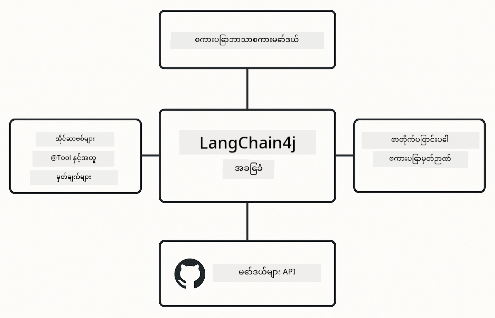

<!--
CO_OP_TRANSLATOR_METADATA:
{
  "original_hash": "377b3e3e6f8d02965bf0fbbc9ccb45c5",
  "translation_date": "2025-12-13T15:24:16+00:00",
  "source_file": "00-quick-start/README.md",
  "language_code": "my"
}
-->
# Module 00: Quick Start

## Table of Contents

- [Introduction](../../../00-quick-start)
- [What is LangChain4j?](../../../00-quick-start)
- [LangChain4j Dependencies](../../../00-quick-start)
- [Prerequisites](../../../00-quick-start)
- [Setup](../../../00-quick-start)
  - [1. Get Your GitHub Token](../../../00-quick-start)
  - [2. Set Your Token](../../../00-quick-start)
- [Run the Examples](../../../00-quick-start)
  - [1. Basic Chat](../../../00-quick-start)
  - [2. Prompt Patterns](../../../00-quick-start)
  - [3. Function Calling](../../../00-quick-start)
  - [4. Document Q&A (RAG)](../../../00-quick-start)
- [What Each Example Shows](../../../00-quick-start)
- [Next Steps](../../../00-quick-start)
- [Troubleshooting](../../../00-quick-start)

## Introduction

ဒီ quickstart က LangChain4j နဲ့ အမြန်ဆုံး စတင် အသုံးပြုနိုင်ဖို့ ရည်ရွယ်ထားတာပါ။ LangChain4j နဲ့ GitHub Models ကို အသုံးပြုပြီး AI application တွေ တည်ဆောက်ခြင်းရဲ့ အခြေခံအချက်တွေကို ဖော်ပြထားပါတယ်။ နောက် modules တွေမှာတော့ LangChain4j နဲ့ Azure OpenAI ကို အသုံးပြုပြီး ပိုမိုတိုးတက်တဲ့ application တွေ တည်ဆောက်မှာ ဖြစ်ပါတယ်။

## What is LangChain4j?

LangChain4j က Java library တစ်ခုဖြစ်ပြီး AI ပါဝင်တဲ့ application တွေ တည်ဆောက်ရာမှာ လွယ်ကူစေပါတယ်။ HTTP client တွေနဲ့ JSON parsing တွေကို ကိုင်တွယ်ဖို့မလိုပဲ သန့်ရှင်းတဲ့ Java API တွေနဲ့ အလုပ်လုပ်နိုင်ပါတယ်။

LangChain4j ရဲ့ "chain" ဆိုတာက component အများကြားကို ဆက်သွယ်ခြင်းကို ဆိုလိုပါတယ် - prompt တစ်ခုကို model တစ်ခုဆီ၊ parser တစ်ခုဆီ ဆက်သွယ်ခြင်း၊ ဒါမှမဟုတ် AI call အများကြား output တစ်ခုက input နောက်တစ်ခုကို ပေးပို့ခြင်း စတဲ့ အရာတွေပါ။ ဒီ quick start မှာတော့ အခြေခံအချက်တွေကို အဓိကထားပြီး ပိုမိုရှုပ်ထွေးတဲ့ chain တွေကို နောက်ပိုင်းမှာ လေ့လာမှာ ဖြစ်ပါတယ်။


*LangChain4j မှာ component တွေကို ဆက်သွယ်ခြင်း - အင်အားကြီးတဲ့ AI workflow တွေ ဖန်တီးရန် အခြေခံအဆောက်အအုံများ*

ကျွန်တော်တို့ သုံးမယ့် core component သုံးခုကတော့ -

**ChatLanguageModel** - AI model နဲ့ ဆက်သွယ်ဖို့ interface ဖြစ်ပါတယ်။ `model.chat("prompt")` ကို ခေါ်ပြီး response string ရယူနိုင်ပါတယ်။ ကျွန်တော်တို့ `OpenAiOfficialChatModel` ကို သုံးပြီး OpenAI-compatible endpoint တွေဖြစ်တဲ့ GitHub Models နဲ့ အလုပ်လုပ်ပါတယ်။

**AiServices** - type-safe AI service interface တွေ ဖန်တီးပေးပါတယ်။ method တွေကို သတ်မှတ်ပြီး `@Tool` နဲ့ အမှတ်အသားပေးလိုက်ရင် LangChain4j က orchestration ကို ကိုင်တွယ်ပေးပါတယ်။ AI က လိုအပ်တဲ့အချိန်မှာ သင့် Java method တွေကို အလိုအလျောက် ခေါ်သုံးပါတယ်။

**MessageWindowChatMemory** - စကားပြောသမိုင်းကို ထိန်းသိမ်းပေးပါတယ်။ ဒီ memory မရှိရင် တစ်ခုချင်း request တွေဟာ လွတ်လပ်ပါတယ်။ ရှိရင်တော့ AI က ယခင် message တွေကို မှတ်မိပြီး context ကို ထိန်းသိမ်းထားနိုင်ပါတယ်။



*LangChain4j architecture - core component တွေ ပူးပေါင်းပြီး သင့် AI application တွေကို အားပေးနေသည်*

## LangChain4j Dependencies

ဒီ quick start မှာ Maven dependency နှစ်ခုကို [`pom.xml`](../../../00-quick-start/pom.xml) ထဲမှာ သုံးထားပါတယ်-

```xml
<!-- Core LangChain4j library -->
<dependency>
    <groupId>dev.langchain4j</groupId>
    <artifactId>langchain4j</artifactId> <!-- Inherited from BOM in root pom.xml -->
</dependency>

<!-- OpenAI integration (works with GitHub Models) -->
<dependency>
    <groupId>dev.langchain4j</groupId>
    <artifactId>langchain4j-open-ai-official</artifactId> <!-- Inherited from BOM in root pom.xml -->
</dependency>
```

`langchain4j-open-ai-official` module က `OpenAiOfficialChatModel` class ကို ပေးပြီး OpenAI-compatible API တွေနဲ့ ချိတ်ဆက်ပေးပါတယ်။ GitHub Models က API format တူညီတာကြောင့် adapter အထူးမလိုပါဘူး - base URL ကို `https://models.github.ai/inference` သို့ သတ်မှတ်ပေးရုံပါပဲ။

## Prerequisites

**Dev Container ကို သုံးနေရင်?** Java နဲ့ Maven တွေ အရင်ကတည်းက ထည့်သွင်းပြီးသားဖြစ်ပါတယ်။ GitHub Personal Access Token တစ်ခုသာ လိုအပ်ပါတယ်။

**Local Development:**
- Java 21+၊ Maven 3.9+
- GitHub Personal Access Token (အောက်မှာ လမ်းညွှန်ချက်တွေ ပါပါတယ်)

> **မှတ်ချက်** - ဒီ module မှာ GitHub Models ရဲ့ `gpt-4.1-nano` ကို သုံးထားပါတယ်။ code ထဲမှာ model နာမည်ကို မပြောင်းလဲပါနဲ့ - GitHub ရဲ့ ရရှိနိုင်တဲ့ model တွေနဲ့ အလုပ်လုပ်ဖို့ အတွက် configure လုပ်ထားတာပါ။

## Setup

### 1. Get Your GitHub Token

1. [GitHub Settings → Personal Access Tokens](https://github.com/settings/personal-access-tokens) ကို သွားပါ
2. "Generate new token" ကို နှိပ်ပါ
3. အမည်တစ်ခု ထည့်ပါ (ဥပမာ - "LangChain4j Demo")
4. သက်တမ်း သတ်မှတ်ပါ (7 ရက် အကြံပြု)
5. "Account permissions" အောက်မှာ "Models" ကို ရှာပြီး "Read-only" သတ်မှတ်ပါ
6. "Generate token" ကို နှိပ်ပါ
7. Token ကို ကူးယူပြီး သိမ်းဆည်းပါ - နောက်တစ်ကြိမ် မမြင်ရတော့ပါဘူး

### 2. Set Your Token

**ရွေးချယ်မှု ၁: VS Code သုံးခြင်း (အကြံပြု)**

VS Code သုံးနေရင် project root မှာ `.env` ဖိုင်ထဲကို token ကို ထည့်ပါ။

`.env` ဖိုင် မရှိရင် `.env.example` ကို `.env` အဖြစ် ကူးယူပါ၊ ဒါမှမဟုတ် project root မှာ `.env` ဖိုင် အသစ် ဖန်တီးပါ။

**ဥပမာ `.env` ဖိုင်:**
```bash
# /workspaces/LangChain4j-for-Beginners/.env တွင်
GITHUB_TOKEN=your_token_here
```

ပြီးရင် Explorer မှာ demo ဖိုင် (ဥပမာ `BasicChatDemo.java`) ကို right-click လုပ်ပြီး **"Run Java"** ကို ရွေးချယ်နိုင်ပါတယ်၊ ဒါမှမဟုတ် Run and Debug panel မှ launch configuration တွေကို သုံးနိုင်ပါတယ်။

**ရွေးချယ်မှု ၂: Terminal သုံးခြင်း**

Token ကို environment variable အဖြစ် သတ်မှတ်ပါ-

**Bash:**
```bash
export GITHUB_TOKEN=your_token_here
```

**PowerShell:**
```powershell
$env:GITHUB_TOKEN=your_token_here
```

## Run the Examples

**VS Code သုံးနေရင်:** Explorer မှာ demo ဖိုင်ကို right-click လုပ်ပြီး **"Run Java"** ကို ရွေးချယ်ပါ၊ ဒါမှမဟုတ် Run and Debug panel မှ launch configuration တွေကို သုံးပါ (token ကို `.env` ဖိုင်ထဲ ထည့်ထားဖို့ မမေ့ပါနဲ့)။

**Maven သုံးနေရင်:** command line ကနေလည်း run လို့ရပါတယ်-

### 1. Basic Chat

**Bash:**
```bash
mvn compile exec:java -Dexec.mainClass=com.example.langchain4j.quickstart.BasicChatDemo
```

**PowerShell:**
```powershell
mvn --% compile exec:java -Dexec.mainClass=com.example.langchain4j.quickstart.BasicChatDemo
```

### 2. Prompt Patterns

**Bash:**
```bash
mvn compile exec:java -Dexec.mainClass=com.example.langchain4j.quickstart.PromptEngineeringDemo
```

**PowerShell:**
```powershell
mvn --% compile exec:java -Dexec.mainClass=com.example.langchain4j.quickstart.PromptEngineeringDemo
```

zero-shot, few-shot, chain-of-thought, role-based prompting တွေကို ပြသပါတယ်။

### 3. Function Calling

**Bash:**
```bash
mvn compile exec:java -Dexec.mainClass=com.example.langchain4j.quickstart.ToolIntegrationDemo
```

**PowerShell:**
```powershell
mvn --% compile exec:java -Dexec.mainClass=com.example.langchain4j.quickstart.ToolIntegrationDemo
```

AI က လိုအပ်တဲ့အချိန်မှာ သင့် Java method တွေကို အလိုအလျောက် ခေါ်သုံးပါတယ်။

### 4. Document Q&A (RAG)

**Bash:**
```bash
mvn compile exec:java -Dexec.mainClass=com.example.langchain4j.quickstart.SimpleReaderDemo
```

**PowerShell:**
```powershell
mvn --% compile exec:java -Dexec.mainClass=com.example.langchain4j.quickstart.SimpleReaderDemo
```

`document.txt` ထဲက အကြောင်းအရာအပေါ် မေးခွန်းတွေ မေးနိုင်ပါတယ်။

## What Each Example Shows

**Basic Chat** - [BasicChatDemo.java](../../../00-quick-start/src/main/java/com/example/langchain4j/quickstart/BasicChatDemo.java)

ဒီမှာ LangChain4j ကို အခြေခံအဆင့်မှာ ကြည့်ရှုနိုင်ပါတယ်။ `OpenAiOfficialChatModel` တစ်ခု ဖန်တီးပြီး `.chat()` နဲ့ prompt ပို့ပြီး response ရယူမှာ ဖြစ်ပါတယ်။ ဒီနည်းလမ်းက model တွေကို custom endpoint နဲ့ API key တွေနဲ့ initialize လုပ်နည်းကို ပြသပါတယ်။ ဒီနည်းကို နားလည်သွားရင် အခြားအရာတွေကိုလည်း လွယ်ကူစွာ တည်ဆောက်နိုင်မှာ ဖြစ်ပါတယ်။

```java
ChatLanguageModel model = OpenAiOfficialChatModel.builder()
    .baseUrl("https://models.github.ai/inference")
    .apiKey(System.getenv("GITHUB_TOKEN"))
    .modelName("gpt-4.1-nano")
    .build();

String response = model.chat("What is LangChain4j?");
System.out.println(response);
```

> **🤖 [GitHub Copilot](https://github.com/features/copilot) Chat နဲ့ စမ်းကြည့်ပါ:** [`BasicChatDemo.java`](../../../00-quick-start/src/main/java/com/example/langchain4j/quickstart/BasicChatDemo.java) ဖိုင်ကို ဖွင့်ပြီး မေးမြန်းပါ-
> - "GitHub Models ကနေ Azure OpenAI ကို ဒီ code မှာ ဘယ်လို ပြောင်းမလဲ?"
> - "OpenAiOfficialChatModel.builder() မှာ ဘယ် parameter တွေ configure လုပ်လို့ ရမလဲ?"
> - "response ပြည့်စုံလာအောင် စောင့်မနေဘဲ streaming response တွေ ထည့်သွင်းဖို့ ဘယ်လိုလုပ်မလဲ?"

**Prompt Engineering** - [PromptEngineeringDemo.java](../../../00-quick-start/src/main/java/com/example/langchain4j/quickstart/PromptEngineeringDemo.java)

Model နဲ့ စကားပြောနည်းကို သိပြီးနောက်၊ ဘာပြောမလဲဆိုတာကို လေ့လာကြမယ်။ ဒီ demo မှာ model setup တူညီပေမယ့် prompting pattern လေးမျိုးကို ပြသပါတယ်။ zero-shot prompts နဲ့ တိုက်ရိုက်ညွှန်ကြားချက်တွေ၊ few-shot prompts နဲ့ နမူနာတွေကနေ သင်ယူခြင်း၊ chain-of-thought prompts နဲ့ အတွေးအခေါ် အဆင့်ဆင့် ဖော်ပြခြင်း၊ role-based prompts နဲ့ context သတ်မှတ်ခြင်း စတာတွေပါ။ တူညီတဲ့ model က request ကို ဘယ်လို frame လုပ်သလဲဆိုတာပေါ် မူတည်ပြီး အရမ်းကွဲပြားတဲ့ ရလဒ်တွေ ပေးနိုင်တာကို တွေ့ရမှာပါ။

```java
PromptTemplate template = PromptTemplate.from(
    "What's the best time to visit {{destination}} for {{activity}}?"
);

Prompt prompt = template.apply(Map.of(
    "destination", "Paris",
    "activity", "sightseeing"
));

String response = model.chat(prompt.text());
```

> **🤖 [GitHub Copilot](https://github.com/features/copilot) Chat နဲ့ စမ်းကြည့်ပါ:** [`PromptEngineeringDemo.java`](../../../00-quick-start/src/main/java/com/example/langchain4j/quickstart/PromptEngineeringDemo.java) ဖိုင်ကို ဖွင့်ပြီး မေးမြန်းပါ-
> - "zero-shot နဲ့ few-shot prompting ကြားက ကွာခြားချက်က ဘာလဲ၊ ဘယ်အချိန်မှာ ဘယ်ဟာသုံးသင့်လဲ?"
> - "temperature parameter က model ရဲ့ response တွေကို ဘယ်လို သက်ရောက်မှုရှိသလဲ?"
> - "production မှာ prompt injection attack တွေကို ကာကွယ်ဖို့ နည်းလမ်းတွေ ဘာတွေရှိလဲ?"
> - "common pattern တွေအတွက် reusable PromptTemplate object တွေ ဘယ်လို ဖန်တီးမလဲ?"

**Tool Integration** - [ToolIntegrationDemo.java](../../../00-quick-start/src/main/java/com/example/langchain4j/quickstart/ToolIntegrationDemo.java)

ဒီမှာ LangChain4j ရဲ့ အင်အားကြီးတဲ့ အစိတ်အပိုင်းကို တွေ့မြင်ရမှာပါ။ `AiServices` ကို သုံးပြီး သင့် Java method တွေကို ခေါ်သုံးနိုင်တဲ့ AI assistant တစ်ခု ဖန်တီးမှာ ဖြစ်ပါတယ်။ method တွေကို `@Tool("description")` နဲ့ အမှတ်အသားပေးလိုက်ရုံနဲ့ LangChain4j က အလုပ်တွေကို ကိုင်တွယ်ပေးပါတယ် - AI က user မေးတာအပေါ် မူတည်ပြီး tool တွေကို အလိုအလျောက် သုံးဖို့ ဆုံးဖြတ်ပါတယ်။ ဒီဟာက function calling ကို ပြသတာဖြစ်ပြီး AI ကို အဖြေပြန်ပေးတာသာမက လုပ်ဆောင်ချက်တွေ လုပ်နိုင်အောင် တည်ဆောက်ရာမှာ အရေးကြီးတဲ့ နည်းလမ်းတစ်ခု ဖြစ်ပါတယ်။

```java
@Tool("Performs addition of two numeric values")
public double add(double a, double b) {
    return a + b;
}

MathAssistant assistant = AiServices.create(MathAssistant.class, model);
String response = assistant.chat("What is 25 plus 17?");
```

> **🤖 [GitHub Copilot](https://github.com/features/copilot) Chat နဲ့ စမ်းကြည့်ပါ:** [`ToolIntegrationDemo.java`](../../../00-quick-start/src/main/java/com/example/langchain4j/quickstart/ToolIntegrationDemo.java) ဖိုင်ကို ဖွင့်ပြီး မေးမြန်းပါ-
> - "@Tool annotation က ဘယ်လို အလုပ်လုပ်ပြီး LangChain4j က ဘာတွေ ပြုလုပ်သလဲ?"
> - "AI က tool တွေကို အဆက်မပြတ် ခေါ်သုံးပြီး ပြဿနာရှင်းနိုင်မလား?"
> - "tool တစ်ခုမှာ exception ဖြစ်ရင် ဘယ်လို error handling လုပ်သင့်လဲ?"
> - "ဒီ calculator example အစား real API ကို ဘယ်လို ပေါင်းစည်းမလဲ?"

**Document Q&A (RAG)** - [SimpleReaderDemo.java](../../../00-quick-start/src/main/java/com/example/langchain4j/quickstart/SimpleReaderDemo.java)

ဒီမှာ RAG (retrieval-augmented generation) ရဲ့ အခြေခံကို တွေ့မြင်ရမှာပါ။ model ရဲ့ training data ကို မူတည်မထားပဲ [`document.txt`](../../../00-quick-start/document.txt) ထဲက အကြောင်းအရာကို load လုပ်ပြီး prompt ထဲ ထည့်သုံးပါတယ်။ AI က သင့်စာရွက်အပေါ် မူတည်ပြီး ဖြေကြားပေးတာဖြစ်ပါတယ်။ ဒါက သင့် data နဲ့ အလုပ်လုပ်နိုင်တဲ့ system တွေ ဖန်တီးဖို့ ပထမဆုံးခြေလှမ်း ဖြစ်ပါတယ်။

```java
Document document = FileSystemDocumentLoader.loadDocument("document.txt");
String content = document.text();

String prompt = "Based on this document: " + content + 
                "\nQuestion: What is the main topic?";
String response = model.chat(prompt);
```

> **မှတ်ချက်** - ဒီနည်းလမ်းက စာရွက်လုံးဝ prompt ထဲ ထည့်သုံးတာပါ။ ဖိုင်ကြီး (>10KB) တွေမှာတော့ context limit ကျော်လွန်နိုင်ပါတယ်။ Module 03 မှာ chunking နဲ့ vector search ကို အသုံးပြုပြီး production RAG system တွေ ဖန်တီးနည်းကို လေ့လာမှာ ဖြစ်ပါတယ်။

> **🤖 [GitHub Copilot](https://github.com/features/copilot) Chat နဲ့ စမ်းကြည့်ပါ:** [`SimpleReaderDemo.java`](../../../00-quick-start/src/main/java/com/example/langchain4j/quickstart/SimpleReaderDemo.java) ဖိုင်ကို ဖွင့်ပြီး မေးမြန်းပါ-
> - "RAG က AI hallucination တွေကို model training data သုံးတာနဲ့ ဘယ်လို ကာကွယ်ပေးသလဲ?"
> - "ဒီနည်းလမ်းနဲ့ vector embeddings သုံးတဲ့ retrieval နည်းလမ်း ကြားက ကွာခြားချက်က ဘာလဲ?"
> - "စာရွက်အများကြီး သို့မဟုတ် knowledge base ကြီးတွေကို ဘယ်လို တိုးချဲ့နိုင်မလဲ?"
> - "AI က ပေးထားတဲ့ context ကိုသာ သုံးစွဲဖို့ prompt ကို ဘယ်လို ဖွဲ့စည်းသင့်လဲ?"

## Debugging

Example တွေမှာ `.logRequests(true)` နဲ့ `.logResponses(true)` ကို ထည့်ထားပြီး API call တွေကို console မှာ ပြသပါတယ်။ authentication error, rate limit, မမျှော်လင့်ထားတဲ့ response တွေကို ရှာဖွေစစ်ဆေးရာမှာ အထောက်အကူဖြစ်ပါတယ်။ production မှာတော့ log အဆူညံသံ လျော့ချဖို့ ဒီ flag တွေကို ဖယ်ရှားပါ။

## Next Steps

**Next Module:** [01-introduction - Getting Started with LangChain4j and gpt-5 on Azure](../01-introduction/README.md)

---

**Navigation:** [← Back to Main](../README.md) | [Next: Module 01 - Introduction →](../01-introduction/README.md)

---

## Troubleshooting

### First-Time Maven Build

**ပြဿနာ**: ပထမဆုံး `mvn clean compile` သို့မဟုတ် `mvn package` လုပ်တဲ့အခါ အချိန်ကြာတတ်သည် (10-15 မိနစ်)

**အကြောင်းရင်း**: Maven က ပထမဆုံး build မှာ project dependency အားလုံး (Spring Boot, LangChain4j libraries, Azure SDKs စသည်) ကို download လုပ်ရတာ ဖြစ်ပါတယ်။

**ဖြေရှင်းနည်း**: ဒီဟာ သာမန်ဖြစ်စဉ်ပါ။ နောက်တစ်ကြိမ် build တွေမှာတော့ dependency တွေ locally cache ထားပြီးသားဖြစ်လို့ ပိုမြန်မှာ ဖြစ်ပါတယ်။ download အချိန်က သင့် network အမြန်နှုန်းပေါ် မူတည်ပါတယ်။

### PowerShell Maven Command Syntax

**ပြဿနာ**: Maven command တွေမှာ `Unknown lifecycle phase ".mainClass=..."` ဆိုတဲ့ error ဖြစ်တတ်သည်

**အကြောင်းရင်း**: PowerShell က `=` ကို variable assignment operator အဖြစ် သတ်မှတ်တာကြောင့် Maven property syntax ကို ချိုးဖောက်သွားတယ်

**ဖြေရှင်းနည်း**: Maven command မတိုင်ခင် `--%` stop-parsing operator ကို ထည့်သုံးပါ-

**PowerShell:**
```powershell
mvn --% compile exec:java -Dexec.mainClass=com.example.langchain4j.quickstart.BasicChatDemo
```

**Bash:**
```bash
mvn compile exec:java -Dexec.mainClass=com.example.langchain4j.quickstart.BasicChatDemo
```

`--%` operator က PowerShell ကို Maven command ကို literal argument တွေ အဖြစ်ပေးပို့ဖို့ ပြောတာဖြစ်ပါတယ်။

### Windows PowerShell Emoji Display

**ပြဿနာ**: PowerShell မှာ AI response တွေမှာ emoji မပြသပဲ `????` သို့မဟုတ် `â??` စတဲ့ စာလုံးပျက်တွေ ဖြစ်တတ်သည်

**အကြောင်းရင်း**: PowerShell ရဲ့ default encoding က UTF-8 emoji တွေကို မထောက်ပံ့ပါ

**ဖြေရှင်းနည်း**: Java application run မလုပ်ခင် ဒီ command ကို ရိုက်ထည့်ပါ-
```cmd
chcp 65001
```

ဒီဟာက terminal ကို UTF-8 encoding သို့ ပြောင်းပေးတာဖြစ်ပါတယ်။ ဒါမှမဟုတ် Windows Terminal ကို သုံးပါ၊ Unicode support ပိုကောင်းပါတယ်။

---

<!-- CO-OP TRANSLATOR DISCLAIMER START -->
**အကြောင်းကြားချက်**  
ဤစာတမ်းကို AI ဘာသာပြန်ဝန်ဆောင်မှု [Co-op Translator](https://github.com/Azure/co-op-translator) ဖြင့် ဘာသာပြန်ထားပါသည်။ ကျွန်ုပ်တို့သည် တိကျမှန်ကန်မှုအတွက် ကြိုးစားသော်လည်း အလိုအလျောက် ဘာသာပြန်ချက်များတွင် အမှားများ သို့မဟုတ် မှားယွင်းချက်များ ပါဝင်နိုင်ကြောင်း သတိပြုပါရန် မေတ္တာရပ်ခံအပ်ပါသည်။ မူရင်းစာတမ်းကို မိမိဘာသာစကားဖြင့်သာ တရားဝင်အရင်းအမြစ်အဖြစ် ယူဆသင့်ပါသည်။ အရေးကြီးသော အချက်အလက်များအတွက် လူ့ဘာသာပြန်ပညာရှင်မှ ဘာသာပြန်ခြင်းကို အကြံပြုပါသည်။ ဤဘာသာပြန်ချက်ကို အသုံးပြုရာမှ ဖြစ်ပေါ်လာနိုင်သည့် နားလည်မှုမှားယွင်းမှုများအတွက် ကျွန်ုပ်တို့သည် တာဝန်မယူပါ။
<!-- CO-OP TRANSLATOR DISCLAIMER END -->