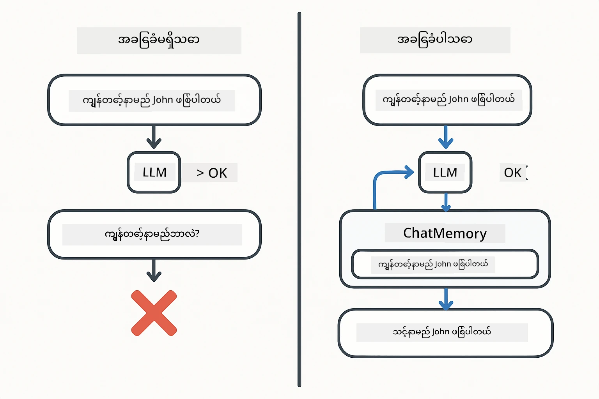
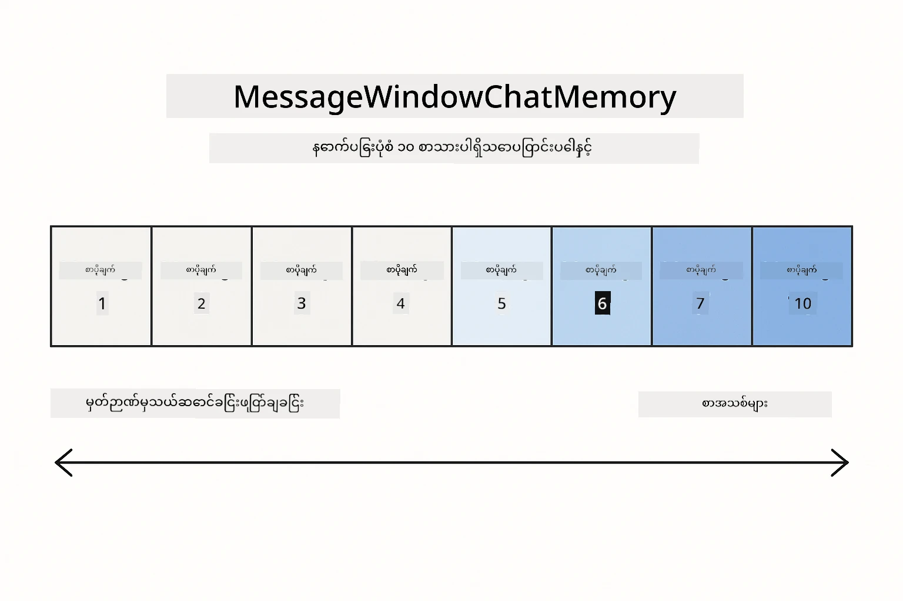
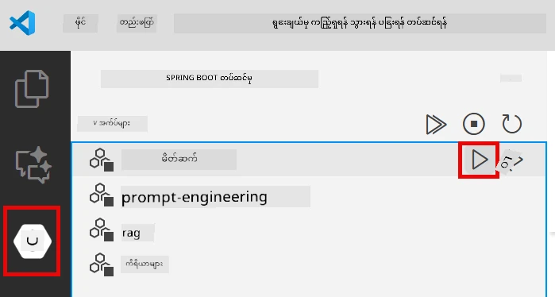
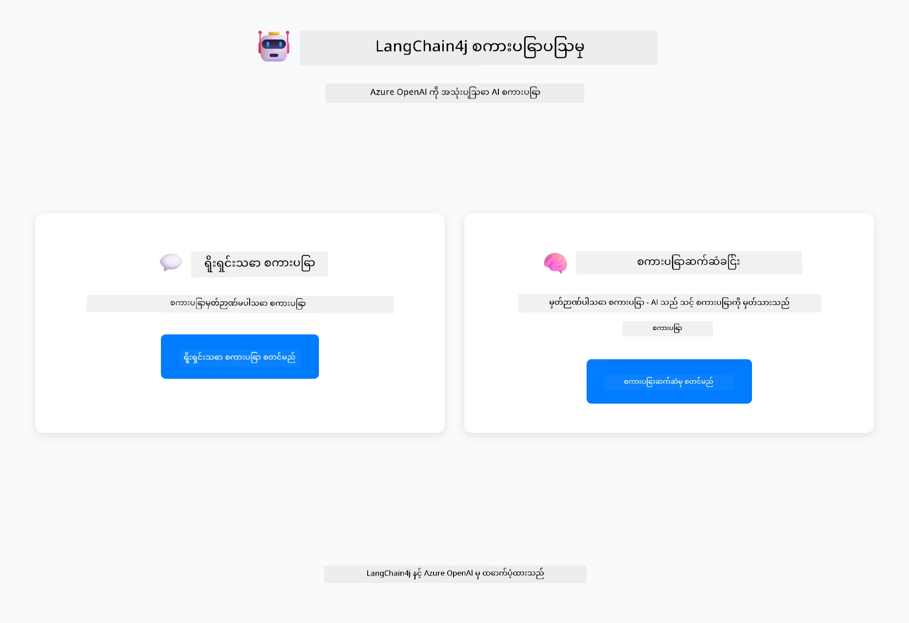
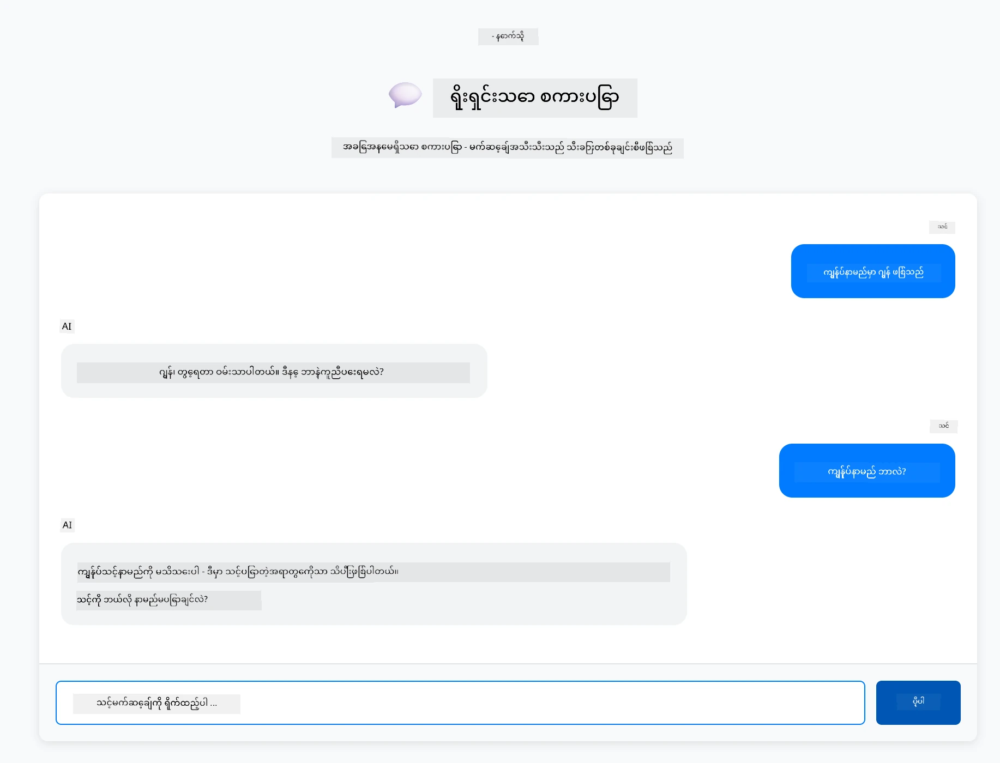
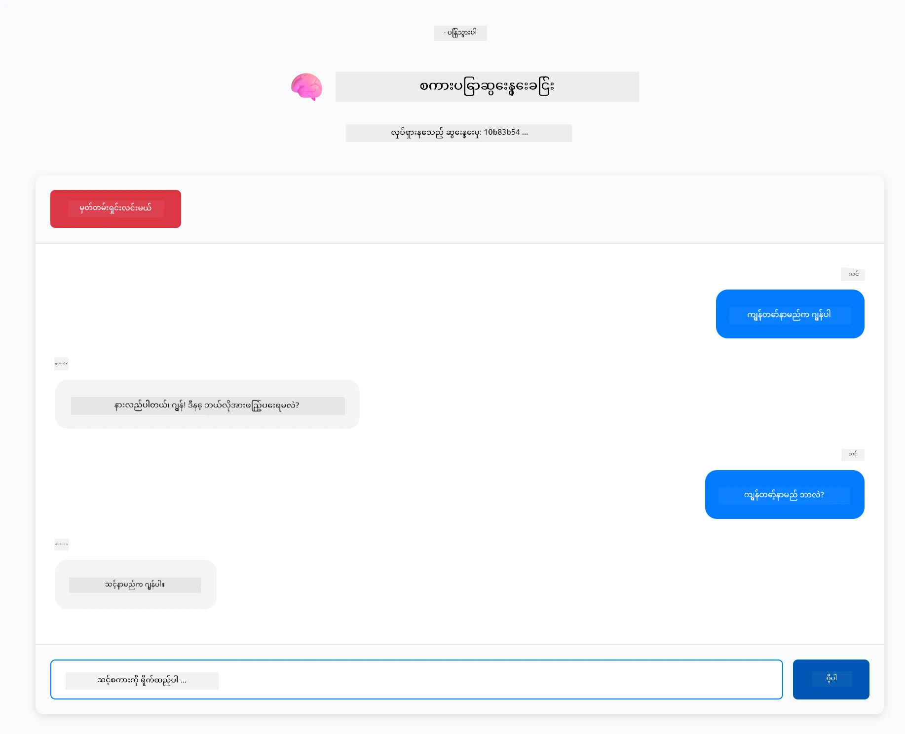

<!--
CO_OP_TRANSLATOR_METADATA:
{
  "original_hash": "c3e07ca58d0b8a3f47d3bf5728541e0a",
  "translation_date": "2025-12-13T14:11:03+00:00",
  "source_file": "01-introduction/README.md",
  "language_code": "my"
}
-->
# Module 01: LangChain4j ဖြင့် စတင်လေ့လာခြင်း

## အကြောင်းအရာ စာရင်း

- [သင်ယူမည့်အကြောင်းအရာများ](../../../01-introduction)
- [လိုအပ်ချက်များ](../../../01-introduction)
- [အဓိကပြဿနာကိုနားလည်ခြင်း](../../../01-introduction)
- [Token များကိုနားလည်ခြင်း](../../../01-introduction)
- [မှတ်ဉာဏ်ကိစ္စအလုပ်လုပ်ပုံ](../../../01-introduction)
- [LangChain4j ကိုဘယ်လိုအသုံးပြုသလဲ](../../../01-introduction)
- [Azure OpenAI အခြေခံအဆောက်အအုံ တပ်ဆင်ခြင်း](../../../01-introduction)
- [အက်ပလီကေးရှင်းကို ဒေသတွင်းတွင် ပြေးဆွဲခြင်း](../../../01-introduction)
- [အက်ပလီကေးရှင်းကို အသုံးပြုခြင်း](../../../01-introduction)
  - [Stateless Chat (ဘယ်ဘက် Panel)](../../../01-introduction)
  - [Stateful Chat (ညာဘက် Panel)](../../../01-introduction)
- [နောက်တစ်ဆင့်များ](../../../01-introduction)

## သင်ယူမည့်အကြောင်းအရာများ

Quick start ကိုပြီးမြောက်ခဲ့ပါက prompt များပို့ပြီး တုံ့ပြန်ချက်များရရှိနည်းကို မြင်တွေ့ခဲ့ပါပြီ။ ၎င်းသည် အခြေခံဖြစ်သော်လည်း အမှန်တကယ် အသုံးပြုမည့် အက်ပလီကေးရှင်းများတွင် ပိုမိုလိုအပ်သည်။ ဤ module သည် context ကို မှတ်မိပြီး state ကို ထိန်းသိမ်းထားသော စကားပြော AI တည်ဆောက်နည်းကို သင်ကြားပေးမည်ဖြစ်ပြီး ၎င်းသည် တစ်ကြိမ်ပြသမှုနှင့် ထုတ်လုပ်မှုအဆင့်အတွက် အသုံးပြုနိုင်သော အက်ပလီကေးရှင်းအကြား ကွာခြားချက်ဖြစ်သည်။

ဤလမ်းညွှန်တစ်လျှောက် Azure OpenAI ၏ GPT-5 ကို အသုံးပြုမည်ဖြစ်ပြီး ၎င်း၏ တိုးတက်သော အတွေးအခေါ်စွမ်းရည်များကြောင့် မတူညီသော ပုံစံများ၏ အပြုအမူများ ပိုမိုရှင်းလင်းစေသည်။ မှတ်ဉာဏ် ထည့်သွင်းပါက ကွာခြားချက်ကို ပိုမိုရှင်းလင်းစွာ မြင်တွေ့နိုင်မည်ဖြစ်သည်။ ၎င်းသည် သင့်အက်ပလီကေးရှင်းတွင် အစိတ်အပိုင်းတစ်ခုချင်းစီ၏ အကျိုးသက်ရောက်မှုကို နားလည်ရန် ပိုမိုလွယ်ကူစေသည်။

သင်သည် ပုံစံနှစ်ခုစလုံးကို ပြသသည့် အက်ပလီကေးရှင်းတစ်ခု တည်ဆောက်မည်ဖြစ်သည်-

**Stateless Chat** - တစ်ခုချင်းစီသော တောင်းဆိုမှုသည် လွတ်လပ်ပြီး မတူညီပါ။ မော်ဒယ်သည် ယခင်စာတိုက်များကို မှတ်မိခြင်းမရှိပါ။ ၎င်းသည် quick start တွင် သုံးခဲ့သည့် ပုံစံဖြစ်သည်။

**Stateful Conversation** - တစ်ခုချင်းစီသော တောင်းဆိုမှုတွင် စကားပြောသမိုင်းပါဝင်သည်။ မော်ဒယ်သည် အကြိမ်ရေများစွာတွင် context ကို ထိန်းသိမ်းထားသည်။ ၎င်းသည် ထုတ်လုပ်မှုအက်ပလီကေးရှင်းများတွင် လိုအပ်သည်။

## လိုအပ်ချက်များ

- Azure subscription နှင့် Azure OpenAI ဝင်ရောက်ခွင့်
- Java 21, Maven 3.9+
- Azure CLI (https://learn.microsoft.com/en-us/cli/azure/install-azure-cli)
- Azure Developer CLI (azd) (https://learn.microsoft.com/en-us/azure/developer/azure-developer-cli/install-azd)

> **မှတ်ချက်:** Java, Maven, Azure CLI နှင့် Azure Developer CLI (azd) များကို ပေးထားသော devcontainer တွင် ကြိုတင်တပ်ဆင်ထားသည်။

> **မှတ်ချက်:** ဤ module သည် Azure OpenAI တွင် GPT-5 ကို အသုံးပြုသည်။ deployment ကို `azd up` ဖြင့် အလိုအလျောက် ပြုလုပ်ထားပြီး code တွင် မော်ဒယ်အမည်ကို မပြောင်းလဲရ။

## အဓိကပြဿနာကိုနားလည်ခြင်း

ဘာသာစကားမော်ဒယ်များသည် stateless ဖြစ်သည်။ တစ်ခုချင်းသော API ခေါ်ဆိုမှုသည် လွတ်လပ်သည်။ "My name is John" ဟု ပို့ပြီးနောက် "What's my name?" ဟု မေးလျှင် မော်ဒယ်သည် သင်ကိုယ်တိုင်ကို မိတ်ဆက်ခဲ့ကြောင်း မသိပါ။ ၎င်းသည် တောင်းဆိုမှုတိုင်းကို သင်၏ ပထမဆုံး စကားပြောမှုလို ထင်မြင်ဆောင်ရွက်သည်။

ဤအခြေအနေသည် ရိုးရှင်းသော Q&A များအတွက် သင့်တော်သော်လည်း အမှန်တကယ် အသုံးပြုမည့် အက်ပလီကေးရှင်းများအတွက် မသင့်တော်ပါ။ ဖောက်သည်ဝန်ဆောင်မှု bot များသည် သင်ပြောခဲ့သည့်အရာကို မှတ်မိရန် လိုအပ်သည်။ ကိုယ်ပိုင်အကူအညီပေးသူများသည် context လိုအပ်သည်။ အကြိမ်ရေများစွာ စကားပြောမှုများတွင် မှတ်ဉာဏ် လိုအပ်သည်။



*stateless (လွတ်လပ်သော ခေါ်ဆိုမှုများ) နှင့် stateful (context ကို သိရှိသော) စကားပြောမှုများအကြား ကွာခြားချက်*

## Token များကိုနားလည်ခြင်း

စကားပြောမှုများထဲသို့ ဝင်မည့်အခါ token များကို နားလည်ထားခြင်း အရေးကြီးသည် - ဘာသာစကားမော်ဒယ်များက စာသားကို အခြေခံယူနစ်များဖြစ်သော token များအဖြစ် လုပ်ဆောင်သည်။


*စာသားကို token များအဖြစ် ခွဲခြားပုံ - "I love AI!" သည် ၄ ခုခွဲခြားသော လုပ်ဆောင်မှုယူနစ်များဖြစ်သည်*

Token များသည် AI မော်ဒယ်များ၏ စာသားတိုင်းတာခြင်းနှင့် လုပ်ဆောင်မှုအခြေခံဖြစ်သည်။ စကားလုံးများ၊ အနားအတားများနှင့် အာကာသများလည်း token ဖြစ်နိုင်သည်။ သင့်မော်ဒယ်တွင် တစ်ကြိမ်တည်းတွင် လုပ်ဆောင်နိုင်သည့် token အရေအတွက် ကန့်သတ်ချက်ရှိသည် (GPT-5 အတွက် ၄၀၀,၀၀၀ token, ၂၇၂,၀၀၀ input token နှင့် ၁၂၈,၀၀၀ output token အထိ)။ token များကို နားလည်ခြင်းဖြင့် စကားပြောမှု အရှည်နှင့် ကုန်ကျစရိတ်ကို ထိန်းချုပ်နိုင်သည်။

## မှတ်ဉာဏ်ကိစ္စအလုပ်လုပ်ပုံ

Chat မှတ်ဉာဏ်သည် stateless ပြဿနာကို စကားပြောသမိုင်းကို ထိန်းသိမ်းခြင်းဖြင့် ဖြေရှင်းသည်။ မော်ဒယ်သို့ တောင်းဆိုမှု ပို့မည့်အခါ framework သည် သက်ဆိုင်ရာ ယခင်စာတိုက်များကို မျှဝေထည့်ပေးသည်။ "What's my name?" ဟု မေးလျှင် စနစ်သည် စကားပြောသမိုင်းအားလုံးကို ပို့ပြီး မော်ဒယ်သည် သင် "My name is John" ဟု ပြောခဲ့ကြောင်း မြင်နိုင်သည်။

LangChain4j သည် ဤလုပ်ဆောင်ချက်ကို အလိုအလျောက် စီမံခန့်ခွဲပေးသည့် မှတ်ဉာဏ် အကောင်အထည်ဖော်မှုများကို ပံ့ပိုးပေးသည်။ သင်သည် သိမ်းဆည်းမည့် စာတိုက်အရေအတွက်ကို ရွေးချယ်ပြီး framework သည် context window ကို စီမံခန့်ခွဲပေးသည်။



*MessageWindowChatMemory သည် နောက်ဆုံးစာတိုက်များ၏ sliding window ကို ထိန်းသိမ်းပြီး အဟောင်းများကို အလိုအလျောက် ဖယ်ရှားပေးသည်*

## LangChain4j ကိုဘယ်လိုအသုံးပြုသလဲ

ဤ module သည် quick start ကို တိုးချဲ့ပြီး Spring Boot နှင့် စကားပြောမှတ်ဉာဏ် ထည့်သွင်းထားသည်။ အစိတ်အပိုင်းများသည် အောက်ပါအတိုင်း ဆက်သွယ်ထားသည်-

**Dependencies** - LangChain4j စာကြည့်တိုက် နှစ်ခု ထည့်သွင်းပါ-

```xml
<dependency>
    <groupId>dev.langchain4j</groupId>
    <artifactId>langchain4j</artifactId> <!-- Inherited from BOM in root pom.xml -->
</dependency>
<dependency>
    <groupId>dev.langchain4j</groupId>
    <artifactId>langchain4j-open-ai-official</artifactId> <!-- Inherited from BOM in root pom.xml -->
</dependency>
```

**Chat Model** - Azure OpenAI ကို Spring bean အဖြစ် ပြင်ဆင်ပါ ([LangChainConfig.java](../../../01-introduction/src/main/java/com/example/langchain4j/config/LangChainConfig.java)):

```java
@Bean
public OpenAiOfficialChatModel openAiOfficialChatModel() {
    return OpenAiOfficialChatModel.builder()
            .baseUrl(azureEndpoint)
            .apiKey(azureApiKey)
            .modelName(deploymentName)
            .timeout(Duration.ofMinutes(5))
            .maxRetries(3)
            .build();
}
```

Builder သည် `azd up` ဖြင့် သတ်မှတ်ထားသော environment variables မှ အတည်ပြုချက်များကို ဖတ်ယူသည်။ `baseUrl` ကို သင့် Azure endpoint သို့ သတ်မှတ်ခြင်းဖြင့် OpenAI client သည် Azure OpenAI နှင့် လုပ်ဆောင်နိုင်သည်။

**Conversation Memory** - MessageWindowChatMemory ဖြင့် စကားပြောသမိုင်းကို ထိန်းသိမ်းပါ ([ConversationService.java](../../../01-introduction/src/main/java/com/example/langchain4j/service/ConversationService.java)):

```java
ChatMemory memory = MessageWindowChatMemory.withMaxMessages(10);

memory.add(UserMessage.from("My name is John"));
memory.add(AiMessage.from("Nice to meet you, John!"));

memory.add(UserMessage.from("What's my name?"));
AiMessage aiMessage = chatModel.chat(memory.messages()).aiMessage();
memory.add(aiMessage);
```

`withMaxMessages(10)` ဖြင့် နောက်ဆုံး ၁၀ စာတိုက်များကို သိမ်းဆည်းရန် memory ကို ဖန်တီးပါ။ အသုံးပြုသူနှင့် AI စာတိုက်များကို `UserMessage.from(text)` နှင့် `AiMessage.from(text)` ဖြင့် ထည့်သွင်းပါ။ သမိုင်းကို `memory.messages()` ဖြင့် ရယူပြီး မော်ဒယ်သို့ ပို့ပါ။ ၎င်းဝန်ဆောင်မှုသည် စကားပြော ID တစ်ခုချင်းစီအတွက် သီးခြား memory instance များကို သိမ်းဆည်းပြီး အသုံးပြုသူများစွာ တပြိုင်နက် စကားပြောနိုင်သည်။

> **🤖 GitHub Copilot Chat ဖြင့် စမ်းသပ်ပါ:** [`ConversationService.java`](../../../01-introduction/src/main/java/com/example/langchain4j/service/ConversationService.java) ဖိုင်ကို ဖွင့်ပြီး မေးမြန်းပါ-
> - "MessageWindowChatMemory သည် window ပြည့်သည့်အခါ မည်သည့်စာတိုက်များကို ဖယ်ရှားမည်ကို မည်သို့ဆုံးဖြတ်သနည်း?"
> - "In-memory အစား database အသုံးပြု၍ custom memory storage ကို မည်သို့ အကောင်အထည်ဖော်နိုင်သနည်း?"
> - "အဟောင်း စကားပြောသမိုင်းကို စုစည်းဖျော့ချရန် summarization ကို မည်သို့ ထည့်သွင်းနိုင်သနည်း?"

Stateless chat endpoint သည် memory ကို မသုံးဘဲ `chatModel.chat(prompt)` ကဲ့သို့ quick start နှင့်တူ သုံးသည်။ Stateful endpoint သည် memory ထဲသို့ စာတိုက်များ ထည့်သွင်းပြီး သမိုင်းကို ရယူကာ တောင်းဆိုမှုတိုင်းတွင် context အဖြစ် ထည့်သွင်းသည်။ မော်ဒယ်ပြင်ဆင်မှု တူညီသော်လည်း ပုံစံကွာခြားသည်။

## Azure OpenAI အခြေခံအဆောက်အအုံ တပ်ဆင်ခြင်း

**Bash:**
```bash
cd 01-introduction
azd up  # စာရင်းသွင်းမှုနှင့် တည်နေရာ (eastus2 အကြံပြုသည်) ကို ရွေးချယ်ပါ။
```

**PowerShell:**
```powershell
cd 01-introduction
azd up  # စာရင်းသွင်းမှုနှင့် တည်နေရာ (eastus2 အကြံပြုသည်) ကို ရွေးချယ်ပါ။
```

> **မှတ်ချက်:** timeout error (`RequestConflict: Cannot modify resource ... provisioning state is not terminal`) ဖြစ်ပါက `azd up` ကို ထပ်မံ ပြေးဆွဲပါ။ Azure အရင်းအမြစ်များသည် နောက်ခံတွင် မကြာသေးမီကာလ provisioning ဖြစ်နေပြီး ပြန်လည်ကြိုးစားခြင်းဖြင့် အရင်းအမြစ်များ terminal state に ရောက်ရှိသည့်အခါ deployment ပြီးမြောက်နိုင်သည်။

ဤအဆင့်များသည်-
1. GPT-5 နှင့် text-embedding-3-small မော်ဒယ်များပါရှိသည့် Azure OpenAI အရင်းအမြစ် တပ်ဆင်သည်
2. project root တွင် credentials ပါရှိသည့် `.env` ဖိုင်ကို အလိုအလျောက် ဖန်တီးသည်
3. လိုအပ်သည့် environment variables များအားလုံးကို သတ်မှတ်ပေးသည်

**တပ်ဆင်မှု ပြဿနာများ ရှိပါသလား?** [Infrastructure README](infra/README.md) တွင် subdomain name conflicts, Azure Portal မှ လက်ဖြင့် တပ်ဆင်ခြင်းနည်းလမ်းများနှင့် မော်ဒယ် ပြင်ဆင်ခြင်း လမ်းညွှန်ချက်များ ပါရှိသည်။

**တပ်ဆင်မှု အောင်မြင်ကြောင်း အတည်ပြုရန်:**

**Bash:**
```bash
cat ../.env  # AZURE_OPENAI_ENDPOINT, API_KEY, စသည်တို့ကို ပြသသင့်သည်။
```

**PowerShell:**
```powershell
Get-Content ..\.env  # AZURE_OPENAI_ENDPOINT, API_KEY, စသည်တို့ကို ပြသသင့်သည်။
```

> **မှတ်ချက်:** `azd up` command သည် `.env` ဖိုင်ကို အလိုအလျောက် ဖန်တီးပေးသည်။ နောက်ပိုင်းတွင် ပြင်ဆင်လိုပါက `.env` ဖိုင်ကို လက်ဖြင့် ပြင်ဆင်နိုင်သလို အောက်ပါအတိုင်း ထပ်မံ ဖန်တီးနိုင်သည်-
>
> **Bash:**
> ```bash
> cd ..
> bash .azd-env.sh
> ```
>
> **PowerShell:**
> ```powershell
> cd ..
> .\.azd-env.ps1
> ```

## အက်ပလီကေးရှင်းကို ဒေသတွင်းတွင် ပြေးဆွဲခြင်း

**တပ်ဆင်မှု အတည်ပြုခြင်း:**

Azure credentials ပါရှိသည့် `.env` ဖိုင်ကို root directory တွင် ရှိမရှိ စစ်ဆေးပါ-

**Bash:**
```bash
cat ../.env  # AZURE_OPENAI_ENDPOINT, API_KEY, DEPLOYMENT ကိုပြသသင့်သည်။
```

**PowerShell:**
```powershell
Get-Content ..\.env  # AZURE_OPENAI_ENDPOINT, API_KEY, DEPLOYMENT ကိုပြသသင့်သည်။
```

**အက်ပလီကေးရှင်းများ စတင်ရန်:**

**ရွေးချယ်မှု ၁: Spring Boot Dashboard အသုံးပြုခြင်း (VS Code အသုံးပြုသူများအတွက် အကြံပြုချက်)**

Dev container တွင် Spring Boot Dashboard extension ပါဝင်ပြီး Spring Boot အက်ပလီကေးရှင်းများအားလုံးကို visual interface ဖြင့် စီမံခန့်ခွဲနိုင်သည်။ VS Code ၏ ဘယ်ဘက် Activity Bar တွင် Spring Boot icon ကို ရှာဖွေပါ။

Spring Boot Dashboard မှ-
- workspace တွင် ရရှိနိုင်သည့် Spring Boot အက်ပလီကေးရှင်းများအားလုံးကို ကြည့်ရှုနိုင်သည်
- တစ်ချက်နှိပ်ခြင်းဖြင့် အက်ပလီကေးရှင်းများ စတင်/ရပ်တန့်နိုင်သည်
- အက်ပလီကေးရှင်း log များကို အချိန်နှင့်တပြေးညီ ကြည့်ရှုနိုင်သည်
- အက်ပလီကေးရှင်း အခြေအနေကို စောင့်ကြည့်နိုင်သည်

"introduction" အနီးရှိ play ခလုတ်ကို နှိပ်၍ ဤ module ကို စတင်ပါ၊ သို့မဟုတ် module များအားလုံးကို တပြိုင်နက် စတင်နိုင်သည်။



**ရွေးချယ်မှု ၂: shell script များ အသုံးပြုခြင်း**

Web applications အားလုံး (module 01-04) ကို စတင်ရန်-

**Bash:**
```bash
cd ..  # မူလဖိုင်လမ်းကြောင်းမှ
./start-all.sh
```

**PowerShell:**
```powershell
cd ..  # မူလဖိုင်လမ်းကြောင်းမှ
.\start-all.ps1
```

သို့မဟုတ် ဤ module သာ စတင်ရန်-

**Bash:**
```bash
cd 01-introduction
./start.sh
```

**PowerShell:**
```powershell
cd 01-introduction
.\start.ps1
```

script နှစ်ခုလုံးသည် root `.env` ဖိုင်မှ environment variables များကို အလိုအလျောက် load လုပ်ပြီး JAR မရှိပါက build လုပ်ပေးသည်။

> **မှတ်ချက်:** စတင်မပြေးမီ module များအားလုံးကို လက်ဖြင့် build လုပ်လိုပါက-
>
> **Bash:**
> ```bash
> cd ..  # Go to root directory
> mvn clean package -DskipTests
> ```
>
> **PowerShell:**
> ```powershell
> cd ..  # Go to root directory
> mvn clean package -DskipTests
> ```

http://localhost:8080 ကို browser တွင် ဖွင့်ပါ။

**ရပ်တန့်ရန်:**

**Bash:**
```bash
./stop.sh  # ဒီမော်ဂျူးသာ
# ဒါမှမဟုတ်
cd .. && ./stop-all.sh  # မော်ဂျူးအားလုံး
```

**PowerShell:**
```powershell
.\stop.ps1  # ဒီမော်ဂျူးသာ
# ဒါမှမဟုတ်
cd ..; .\stop-all.ps1  # မော်ဂျူးအားလုံး
```

## အက်ပလီကေးရှင်းကို အသုံးပြုခြင်း

အက်ပလီကေးရှင်းသည် chat implementation နှစ်မျိုးကို ဘေးဘေးတွင် ပြသသည့် web interface ကို ပံ့ပိုးပေးသည်။



*Simple Chat (stateless) နှင့် Conversational Chat (stateful) ရွေးချယ်စရာများပါရှိသည့် Dashboard*

### Stateless Chat (ဘယ်ဘက် Panel)

ဤကို ပထမဦးဆုံး စမ်းသပ်ပါ။ "My name is John" ဟု မေးပြီးနောက် "What's my name?" ဟု မေးပါ။ မော်ဒယ်သည် မှတ်မိခြင်းမရှိပါဘူး၊ အကြောင်းမှာ တစ်ခုချင်းစီသော စာတိုက်များသည် လွတ်လပ်ခြင်း ဖြစ်သည်။ ၎င်းသည် အခြေခံဘာသာစကားမော်ဒယ် ပေါင်းစည်းမှု၏ အဓိကပြဿနာကို ပြသသည် - စကားပြော context မရှိခြင်း။



*AI သည် ယခင်စာတိုက်မှ သင့်နာမည်ကို မှတ်မိခြင်း မရှိပါ*

### Stateful Chat (ညာဘက် Panel)

ယခု အတူတူ စဉ်ဆက်ကို ဒီမှာ စမ်းသပ်ပါ။ "My name is John" ဟု မေးပြီးနောက် "What's my name?" ဟု မေးပါ။ ယခုအခါ မှတ်မိသည်။ ကွာခြားချက်မှာ MessageWindowChatMemory ဖြစ်ပြီး စကားပြောသမိုင်းကို ထိန်းသိမ်းကာ တောင်းဆိုမှုတိုင်းတွင် ထည့်သွင်းပေးသည်။ ၎င်းသည် ထုတ်လုပ်မှု conversational AI ၏ လုပ်ဆောင်ပုံဖြစ်သည်။



*AI သည် စကားပြောမှုအတွင်း သင့်နာမည်ကို မှတ်မိထားသည်*

Panel နှစ်ခုလုံးသည် GPT-5 မော်ဒယ်တူညီကို အသုံးပြုသည်။ ကွာခြားချက်တစ်ခုသာ မှတ်ဉာဏ်ဖြစ်သည်။ ၎င်းသည် မှတ်ဉာဏ်သည် သင့်အက်ပလီကေးရှင်းတွင် ဘာကို ပေးစွမ်းပြီး အမှန်တကယ် အသုံးပြုမှုအတွက် အရေးကြီးကြောင်း ရှင်းလင်းစေသည်။

## နောက်တစ်ဆင့်များ

**နောက်တစ်ခု Module:** [02-prompt-engineering - GPT-5 ဖြင့် Prompt Engineering](../02-prompt-engineering/README.md)

---

**လမ်းညွှန်:** [← ယခင်: Module 00 - Quick Start](../00-quick-start/README.md) | [ပင်မသို့ ပြန်သွားရန်](../README.md) | [နောက်တစ်ခု: Module 02 - Prompt Engineering →](../02-prompt-engineering/README.md)

---

<!-- CO-OP TRANSLATOR DISCLAIMER START -->
**အကြောင်းကြားချက်**  
ဤစာတမ်းကို AI ဘာသာပြန်ဝန်ဆောင်မှု [Co-op Translator](https://github.com/Azure/co-op-translator) ဖြင့် ဘာသာပြန်ထားပါသည်။ ကျွန်ုပ်တို့သည် တိကျမှန်ကန်မှုအတွက် ကြိုးစားသော်လည်း အလိုအလျောက် ဘာသာပြန်ချက်များတွင် အမှားများ သို့မဟုတ် မှားယွင်းချက်များ ပါဝင်နိုင်ကြောင်း သတိပြုပါရန် မေတ္တာရပ်ခံအပ်ပါသည်။ မူရင်းစာတမ်းကို မိမိဘာသာစကားဖြင့်သာ တရားဝင်အရင်းအမြစ်အဖြစ် သတ်မှတ်သင့်ပါသည်။ အရေးကြီးသော အချက်အလက်များအတွက် လူ့ဘာသာပြန်ပညာရှင်မှ ဘာသာပြန်ခြင်းကို အကြံပြုပါသည်။ ဤဘာသာပြန်ချက်ကို အသုံးပြုရာမှ ဖြစ်ပေါ်လာနိုင်သည့် နားလည်မှုမှားယွင်းမှုများ သို့မဟုတ် မှားဖတ်မှုများအတွက် ကျွန်ုပ်တို့ တာဝန်မယူပါ။
<!-- CO-OP TRANSLATOR DISCLAIMER END -->