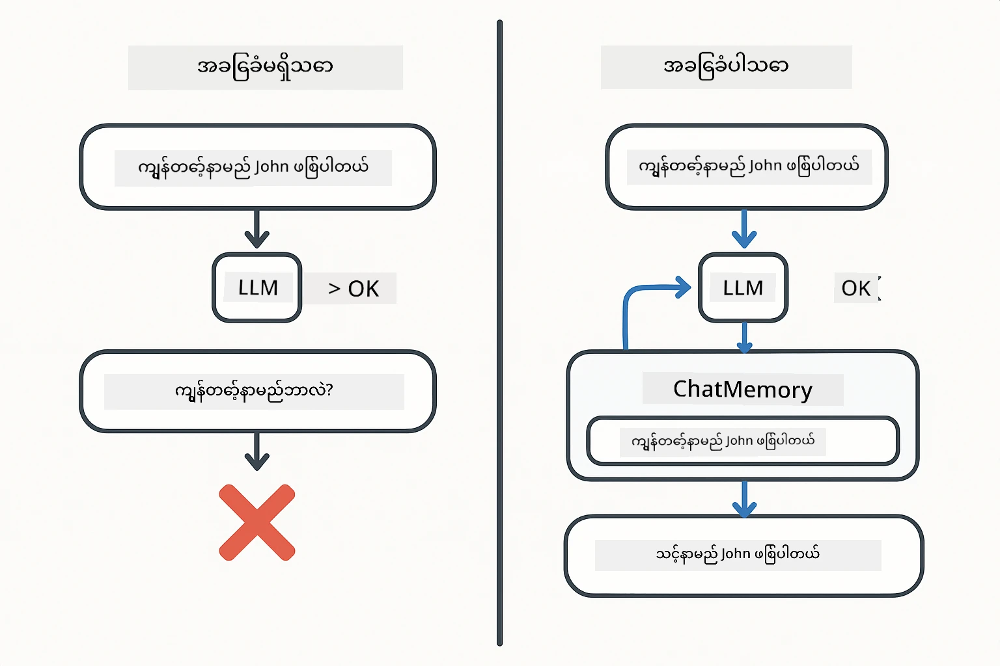
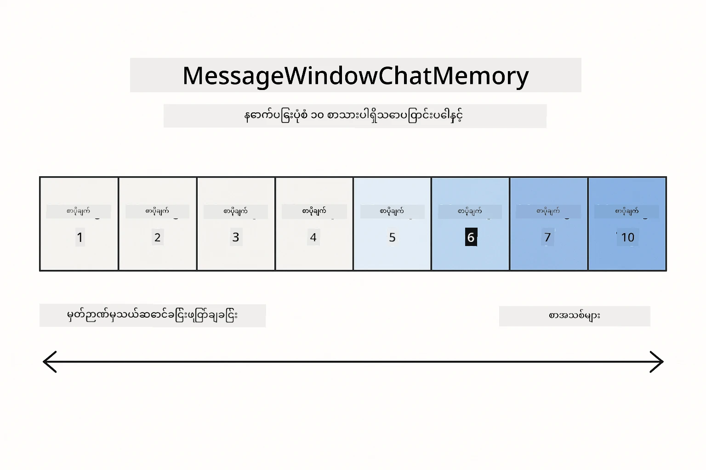
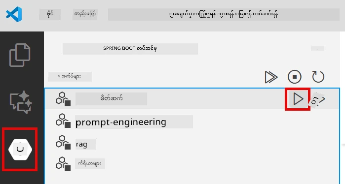
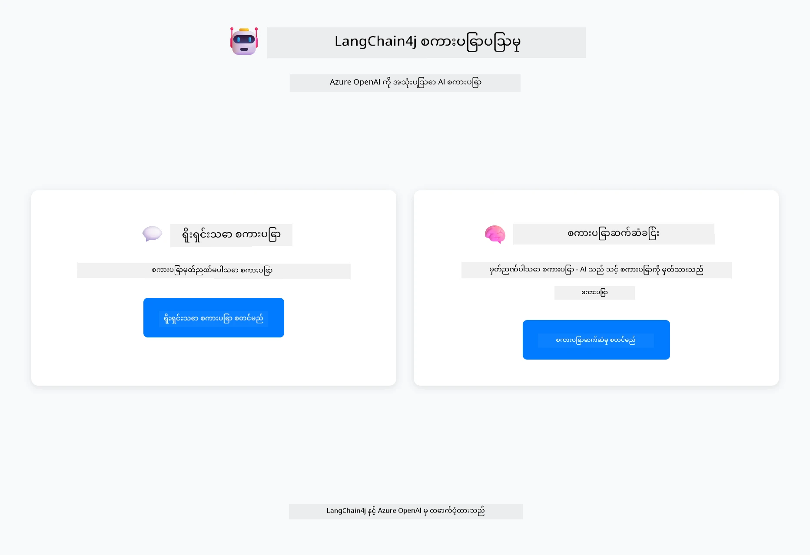
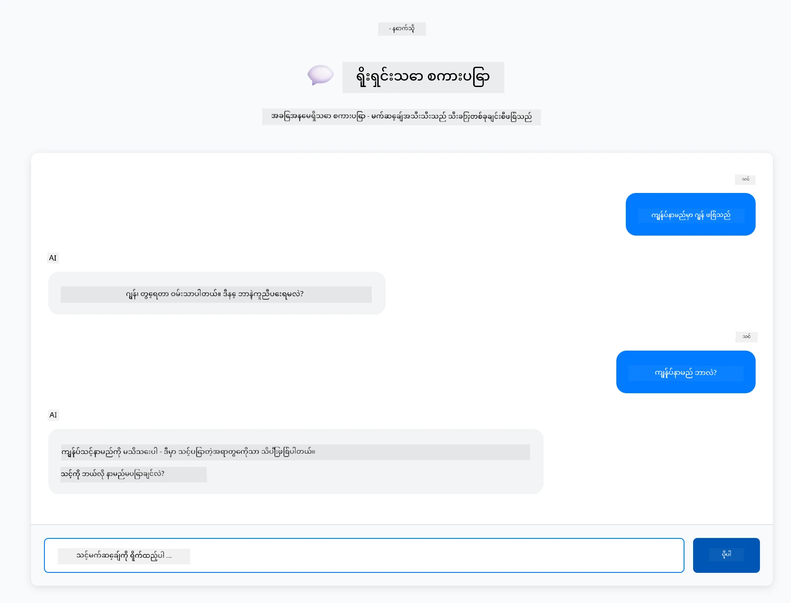
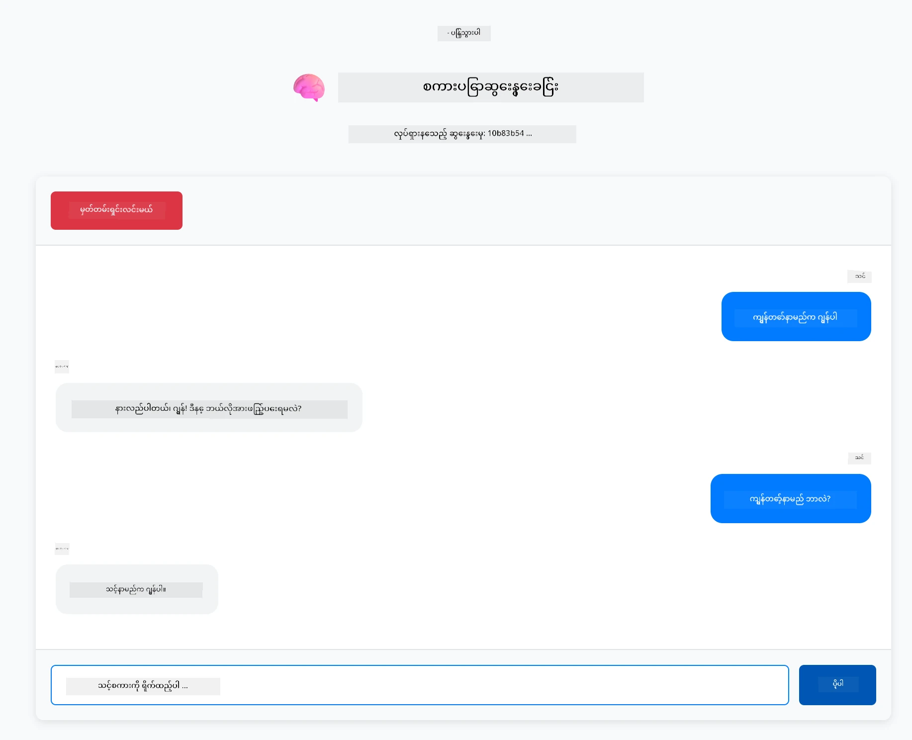

# Module 01: LangChain4j နှင့် စတင်လေ့လာခြင်း

## အကြောင်းအရာ အပေါ်အနေနှင့်

- [ဗီဒီယို လမ်းညွှန်](#ဗီဒီယို-လမ်းညွှန်)
- [သင်လေ့လာရန် မျှော်မှန်းချက်များ](#သင်လေ့လာရန်-မျှော်မှန်းချက်များ)
- [လိုအပ်သော ရှေ့ဆက်ချက်များ](#လိုအပ်သော-ရှေ့ဆက်ချက်များ)
- [အဓိက ပြဿနာကိုနားလည်ခြင်း](#အဓိက-ပြဿနာကိုနားလည်ခြင်း)
- [တိုးကင်များကိုနားလည်ခြင်း](#တိုးကင်များကိုနားလည်ခြင်း)
- [မှတ်ဉာဏ်က 어떻게 လုပ်ဆောင်သည်](#မှတ်ဉာဏ်က-어떻게-လုပ်ဆောင်သည်)
- [LangChain4j ကိုဘယ်လို သုံးထားသလဲ](#langchain4j-ကို-ဘယ်လို-သုံးထားသလဲ)
- [Azure OpenAI အပြည့်အစုံစုစည်းမှု တပ်ဆင်ခြင်း](#azure-openai-အပြည့်အစုံစုစည်းမှု-တပ်ဆင်ခြင်း)
- [အက်ပ်လီကေးရှင်းကို ဒေသတွင်း လည်ပတ်ခြင်း](#အက်ပ်လီကေးရှင်းကို-ဒေသတွင်း-လည်ပတ်ခြင်း)
- [အက်ပ်လီကေးရှင်း အသုံးပြုခြင်း](#အက်ပ်လီကေးရှင်း-အသုံးပြုခြင်း)
  - [Stateless Chat ( ဘယ်ဘက် Panel)](#stateless-chat-ဘယ်ဘက်-panel)
  - [Stateful Chat ( ညာဘက် Panel)](#stateful-chat-ညာဘက်-panel)
- [နောက်တည့်ခြင်း လမ်းကြောင်း](#နောက်တည့်ခြင်း-လမ်းကြောင်း)

## ဗီဒီယို လမ်းညွှန်

ဒီ Live session ကို ကြည့်ရှုပါ၊ ဒီ module နဲ့ ဘယ်လို စတင်ရမယ်ဆိုတာ ရှင်းပြထားပါတယ်။

<a href="https://www.youtube.com/live/nl_troDm8rQ?si=6b85S8xGjWnT2fX9"></a>

## သင်လေ့လာရန် မျှော်မှန်းချက်များ

ဒါဟာ LangChain4j နဲ့ Azure OpenAI ကို စတင်သုံးစွဲနိုင်ဖို့ အစဖြစ်ပါတယ်။ အခြေခံတွေကနေ စတင်ပြီး ထုတ်လုပ်မှု အဆင့်ဆိုင်ရာ အက်ပ်များ ပြုလုပ်သွားမှာဖြစ်ပါတယ်။ ဒီ module က context ကို မှတ်မိပြီး state ကို ထိန်းသိမ်းထားတဲ့ စကားပြော AI ကို အဓိကထားပါသည် — နောက်ပိုင်း module တစ်ခုချင်းစီ အခြေခံ သဘောတရားတွေ ဖြစ်ပါတယ်။

ဒီလမ်းညွှန်မှာ Azure OpenAI ရဲ့ GPT-5.2 ကို စဉ်ဆက်အသုံးပြုပါမယ်၊ ရှေ့ပြေး အဆင့်မြှင့် သုံးသပ်နိုင်စွမ်းကြောင့် မတူညီတဲ့ ပုံစံတွေ၏ အပြုအမူကို ပိုရှင်းလင်းစေပါတယ်။ မှတ်ဉာဏ်ကို ထည့်လိုက်ရင် အနည်းငယ်ကွာခြားချက်တွေ မျှတစွာ မြင်တွေ့နိုင်မှာဖြစ်ပါတယ်။ ဒါကြောင့် တစ်စိတ်တစ်ပိုင်းစီဟာ သင့်အက်ပ်လီကေးရှင်းမှာ ဘာတွေလုပ်ဆောင်ပေးနေသလဲ နားလည်ရလွယ်ကူပါတယ်။

သင် တစ်ခုသော အက်ပ်လီကေးရှင်းကို တည်ဆောက်ပါမယ်၊ နှစ်ခုအမျိုးအစား ဆက်ပြသမယ်။

**Stateless Chat** - တောင်းဆိုမှုတစ်ခုချင်းစီဟာ လွတ်လပ်စွာ ရှိပါတယ်။ မော်ဒယ်က စကားပြော မက်ဆေ့ဂ်အရင်ဆုကို မှတ်မိထားခြင်းမရှိပါ။ အခြေခံဆုံး စတင်မှုဖြစ်ပါတယ်။

**Stateful Conversation** - တောင်းဆိုမှုတစ်ခုချင်းစီမှာ စကားပြော သမိုင်းကြောင်း ပါဝင်သည်။ မော်ဒယ်က အကြိမ်ကြိမ် ဆက်သွယ်မှုများအတွက် context ကို ထိန်းသိမ်းပါသည်။ ထိုအရာသည် ထုတ်လုပ်မှု အက်ပ်လီကေးရှင်းများတွင် လိုအပ်သည်။

## လိုအပ်သော ရှေ့ဆက်ချက်များ

- Azure subscription နဲ့ Azure OpenAI အတွေ့အကြုံရှိရမည်
- Java 21, Maven 3.9+
- Azure CLI (https://learn.microsoft.com/en-us/cli/azure/install-azure-cli)
- Azure Developer CLI (azd) (https://learn.microsoft.com/en-us/azure/developer/azure-developer-cli/install-azd)

> **မှတ်ချက်**: မိမိသုံးနေသော devcontainer ထဲတွင် Java, Maven, Azure CLI နဲ့ Azure Developer CLI (azd) များ ကြိုတင်တပ်ဆင်ထားသည်။

> **မှတ်ချက်**: ဒီ module သည် Azure OpenAI မှ GPT-5.2 ကို သုံးထားပါသည်။ Deployment သည် `azd up` မှတစ်ဆင့် မော်ဒယ်နာမည်ကို ကုဒ်အတွင်း ပြင်ဆင်ပေးရန် မလိုအပ်ပါ။

## အဓိက ပြဿနာကိုနားလည်ခြင်း

ဘာသာစကားပုံစံများဟာ stateless ဖြစ်ပါတယ်။ API ခေါ်ဆိုမှု တစ်ချက်ချင်းစီဟာ လွတ်လပ်မှုရှိသည်။ "My name is John" လို့ ပေးပို့ပြီးနောက် "What's my name?" လို့မေးလျှင်၊ မော်ဒယ်က မိမိနာမည်ကို မသိနိုင်ပါဘူး။ တောင်းဆိုချက်တိုင်းကို ပထမဆုံး စကားပြောရေးရာလို့ ထင်မြင်ကြည့်နေသလို ဖြစ်ပါတယ်။

ဒီအနေအထားက အရိုးရှင်း Q&A မှာ ကောင်းသောတစ်ခု ဖြစ်ပေမယ့် ဆောင်ရွက်ရန် ရည်ရွယ်ချက်များတွင် အကျိုးမရှိပါဘူး။ ဖောက်သည်ဝန်ဆောင်မှုပေးရေး စက်ရုပ်များဟာ အသုံးပြုသူပြောသောအရာများကို မှတ်သားထားရမည်။ လူရေးကူညီသူတွေမှာ context လိုအပ်သည်။ စကားပြောအကြိမ်များ အတူတူ လို့ဆိုရင် မှတ်ဉာဏ် လိုအပ်ပါသည်။

အောက်ပါ ပုံပြင်မှာ နှစ်မျိုးကြား ကွာခြားချက်ကို ပြသထားသည် - ဘယ်ဘက်တွင် stateless ခေါ်ဆိုမှုဖြစ်ပြီး သင့်နာမည် မေ့နေသည်၊ ညာဘက်တွင် stateful ခေါ်ဆိုမှု၊ ChatMemory မှ ကူညီထားသည်။



*Stateless (အမဲလိုက်ခေါ်ဆိုမှု) နှင့် Stateful (context သိပြီး ခေါ်ဆိုမှု) စကားပြောများကြား ကွာခြားချက်များ*

## တိုးကင်များကိုနားလည်ခြင်း

စကားပြောတွေထဲ ဝင်မတိုင်မီ၊ tokens ဆိုတာကို နားလည်ရမည် - ဘာသာစကားပိုင်းဆိုင်ရာ မော်ဒယ်များ လုပ်ငန်းဖြစ်စဉ်အတွက် အခြေခံ အဖွဲ့အစည်းများဖြစ်သည်။


*စာသားများကို tokens အဖြစ် ခွဲခြားသုံးသပ်မှု ဥပမာ - "I love AI!" သည် ၄ ခုအသီးအသီး တစ်ခုချင်းစီ လုပ်ငန်းယူနစ်များဖြစ်သည်*

Tokens များသည် AI မော်ဒယ်များအတွက် စာသားတိုင်းကို တိုင်းတာထား၊ လုပ်ဆောင်ရာတွင် အသုံးပြုသည်။ စကားလုံးများ၊ ကြိယာပေါင်းချုပ်များ၊ နေရာများစသည်တို့သည် token ဖြစ်နိုင်သည်။ မော်ဒယ်တွင် ရုပ်ပိုင်းဆိုင်ရာ သတ်မှတ်ချက်ရှိသည် (GPT-5.2 အတွက် token များ ၄၀၀,၀၀၀ အထိ၊ ၂၇၂,၀၀၀ input token နှင့် ၁၂၈,၀၀၀ output token အထိ)။ Token များကို နားလည်ထားခြင်းအားဖြင့် စကားပြော အရှည်နှင့် ကုန်ကျစရိတ်ကို ထိန်းချုပ်နိုင်သည်။

## မှတ်ဉာဏ်က 어떻게 လုပ်ဆောင်သည်

Chat memory က stateless ပြဿနာကို ဖြေရှင်းပေးပြီး စကားပြော သမိုင်းကြောင်းကို ထိန်းသိမ်းထားသည်။ မော်ဒယ်ထံ သို့ တောင်းဆိုမှု ပေးပို့ခေါ်ဆိုမှီ framework က မသက်ဆိုင်မှီ မက်ဆေ့ဂ်များကို တပ်ဆင်ပေးပါသည်။ သင် "What's my name?" လို့ မေးလျှင် စနစ်က စကားပြော သမိုင်းကြောင်း အားလုံးကို ပေးပို့နေပြီး မော်ဒယ်က "My name is John" လို့ လွန်ခဲ့သောအကြိမ် ပြောထားတာ မြင်ရှုနိုင်သည်။

LangChain4j သည် မှတ်ဉာဏ်ပြီး စနစ်များကို အလိုအလျောက် စီမံခန့်ခွဲပေးနိုင်တဲ့ memory implementation များ ပေးဆောင်သည်။ သင် သို့မဟုတ် မက်ဆေ့ဂ် များ အများအပြား သိုလှောင်ထားလိုပါက framework က context အား ထိန်းသိမ်းပေးပါသည်။ အောက်ပါ ပုံတွင် MessageWindowChatMemory သည် စမ်းသပ်သိမ်းဆည်းထားသော မက်ဆေ့ဂ်များ အနောက်တံခါး တဲ့ ပြတင်းပေါက်နည်းလမ်းကို ဖော်ပြထားသည်။



*MessageWindowChatMemory သည် မက်ဆေ့ဂ်များကို ယခုနောက်ဆုံး သုံးသပ်ပေးပြီး အဟောင်းများကို အလိုအလျောက် လျှော့ချပေးသည့် sliding window ကို ထိန်းသိမ်းသည်*

## LangChain4j ကို ဘယ်လို သုံးထားသလဲ

ဒီ module မှာ Spring Boot နဲ့ conversation memory ကို ပေါင်းစည်းအသုံးပြုထားပါတယ်။ အပိုင်းများ မည်သို့ အတူတကွ လုပ်ဆောင်သလဲ ဆိုတာ:

**Dependencies** - LangChain4j ပိုင်းနှစ်ခုကို ထည့်သွင်းပါ:

```xml
<dependency>
    <groupId>dev.langchain4j</groupId>
    <artifactId>langchain4j</artifactId> <!-- Inherited from BOM in root pom.xml -->
</dependency>
<dependency>
    <groupId>dev.langchain4j</groupId>
    <artifactId>langchain4j-open-ai-official</artifactId> <!-- Inherited from BOM in root pom.xml -->
</dependency>
```

**Chat Model** - Azure OpenAI ကို Spring bean အနေနှင့် အောက်ပါအတိုင်း ဖွဲ့စည်းပါ ([LangChainConfig.java](../../../01-introduction/src/main/java/com/example/langchain4j/config/LangChainConfig.java)):

```java
@Bean
public OpenAiOfficialChatModel openAiOfficialChatModel() {
    return OpenAiOfficialChatModel.builder()
            .baseUrl(azureEndpoint)
            .apiKey(azureApiKey)
            .modelName(deploymentName)
            .timeout(Duration.ofMinutes(5))
            .maxRetries(3)
            .build();
}
```

Builder က `azd up` မှ သတ်မှတ်ထားသော environment variable များမှ အတည်ပြုပြီး ဖတ်ယူသည်။ `baseUrl` ကို Azure endpoint သတ်မှတ်ခြင်းဖြင့် OpenAI client ကို Azure OpenAI နဲ့ အသုံးပြုနိုင်သည်။

**Conversation Memory** - MessageWindowChatMemory အသုံးပြုပြီး စကားပြောသမိုင်းကြောင်း ပြန်လည် မှတ်သားခြင်း ([ConversationService.java](../../../01-introduction/src/main/java/com/example/langchain4j/service/ConversationService.java)):

```java
ChatMemory memory = MessageWindowChatMemory.withMaxMessages(10);

memory.add(UserMessage.from("My name is John"));
memory.add(AiMessage.from("Nice to meet you, John!"));

memory.add(UserMessage.from("What's my name?"));
AiMessage aiMessage = chatModel.chat(memory.messages()).aiMessage();
memory.add(aiMessage);
```

`withMaxMessages(10)` ဖြင့်  နောက်ဆုံး message ၁၀ ခုသာ သိမ်းဆည်းရန် ဖန်တီးသည်။ user နှင့် AI မှ မက်ဆေ့ဂ်များကို `UserMessage.from(text)`, `AiMessage.from(text)` များဖြင့် ထည့်သွင်းသည်။ သမိုင်းကြောင်းကို `memory.messages()` ဖြင့် ရယူပြီး မော်ဒယ်ထံ ပို့သည်။ ရှေ့ဆက် ID တစ်ခုစီအလိုက် memory instance များကို ဝန်ဆောင်မှု မှ ထိန်းသိမ်းသည်၊ ထိုကြောင့် အများများသော အသုံးပြုသူများ တပြိုင်နက် ချက်ချင်း စကားပြောနိုင်ပါသည်။

> **🤖 GitHub Copilot Chat နဲ့ စမ်းကြည့်ပါ:** [`ConversationService.java`](../../../01-introduction/src/main/java/com/example/langchain4j/service/ConversationService.java) ဖိုင်ကို ဖွင့်ပြီး မေးမြန်းနိုင်သော မေးခွန်းများ -
> - "MessageWindowChatMemory က ပြတင်းပေါက် ပြည့်နက်မှုအချိန် မက်ဆေ့ဂ်တွေ ဘယ်လို ရွေးချယ် ချွတ်ထုတ်သလဲ?"
> - "In-memory ထားခြင်း မဟုတ်ဘဲ database အသုံးပြု၍ custom memory storage ကို ဘယ်လို တည်ဆောက်မလဲ?"
> - "ဟောင်းသော စကားပြော သမိုင်းကြောင်းကို အနှောင့်အယှက် ဖျတ်ရေး အတွက် summary ရေး ထည့်ပြုလုပ်နိုင်မလား?"

Stateless chat endpoint က memory မထည့်ပဲ `chatModel.chat(prompt)` လုပ်ဆောင်ပြီး quick start နည်းလမ်းဖြစ်သည်။ Stateful endpoint က memory ထဲ message တွေ ထည့်ပြီး သမိုင်းကြောင်း ရယူကာ request တစ်ခုချင်းစီနဲ့ context တစ်ရပ်ကို လည်း ထည့်ပေးပါသည်။ မော်ဒယ် configuration တူညီပေမဲ့ ပုံစံ ကွာခြားသည်။

## Azure OpenAI အပြည့်အစုံစုစည်းမှု တပ်ဆင်ခြင်း

**Bash:**
```bash
cd 01-introduction
azd up  # စာရင်းသွင်းမှုနှင့် တည်နေရာ ရွေးချယ်ပါ (eastus2 သင်ကြားမှုအတွက် အကြံပြုသည်)
```

**PowerShell:**
```powershell
cd 01-introduction
azd up  # စာရင်းသွင်းခြင်းနှင့် တည်နေရာကို ရွေးချယ်ပါ (eastus2 အကြံပြုသည်)
```

> **မှတ်ချက်:** အချိန်လွန်ခြင်းမှားယွင်းမှု `RequestConflict: Cannot modify resource ... provisioning state is not terminal` စသဖြင့် ဖြစ်ပါက `azd up` ကို ထပ်မံ ရှိုးရိုက်ပါ။ Azure ကို အရင်းအမြစ်များ နောက်ခံတွင် ပယုဇနာရှိနေတာ တစ်ခါတလေဖြစ်ပြီး စခန်းမှ အဆင့်ဆင့် ပြီးဆုံးချိန်သို့ ရောက်သည်မှ deployment ပြီးပါသည်။

ဒါတွေနဲ့ -
1. Azure OpenAI အရင်းအမြစ် (GPT-5.2 နှင့် text-embedding-3-small မော်ဒယ်) ကို တပ်ဆင်ပါမယ်။
2. Project root တွင် `.env` ဖိုင်ကို အလိုအလျောက် ဖန်တီးပါမယ်။
3. လိုအပ်သော environment variable များအားလုံး သတ်မှတ်ပေးပါမယ်။

**Deployment ပြဿနာ ရှိလား?** [Infrastructure README](infra/README.md)  တွင် အနက်ရှိုင်း အသေးစိတ် ပြဿနာဖြေရှင်းနည်း၊ subdomain နာမည် တွန်းရှားမှု၊ လက်အပ် Azure Portal မှ deploymentနည်းလမ်းများ၊ မော်ဒယ်ဖောင်ကြိး များ ပါဝင်သည်။

**Deployment ပြီးစီးဖြစ်သည်ကို စစ်ဆေးရန်:**

**Bash:**
```bash
cat ../.env  # AZURE_OPENAI_ENDPOINT, API_KEY နှင့် အခြားများကိုပြသသင့်သည်။
```

**PowerShell:**
```powershell
Get-Content ..\.env  # AZURE_OPENAI_ENDPOINT, API_KEY နှင့် အခြားများကို ပြသသင့်သည်။
```

> **မှတ်ချက်:** `azd up` မှ `.env` ဖိုင်ကို အလိုအလျောက် ဖန်တီးပေးပါသည်။ ပြန်လည်ပြင်ဆင်လိုပါက `.env` ဖိုင်ကို မန်ယွက် ပြုပြင်နိုင်သလို မိတ်ဆက် command ကို ထပ်မံ အသုံးပြုနိုင်သည်။
>
> **Bash:**
> ```bash
> cd ..
> bash .azd-env.sh
> ```
>
> **PowerShell:**
> ```powershell
> cd ..
> .\.azd-env.ps1
> ```

## အက်ပ်လီကေးရှင်းကို ဒေသတွင်း လည်ပတ်ခြင်း

**Deployment ပြီးစစ်ဆေးရန်**

Project root သို့ Azure အသုံးပြုခွင့် အချက်အလက်သည် `.env` ဖိုင် တွင် ရှိပြီးသား ဖြစ်ရန် လိုအပ်ပါသည်။ Module လမ်းကြောင်း (`01-introduction/`) မှ လည်ပတ်ပါ။

**Bash:**
```bash
cat ../.env  # AZURE_OPENAI_ENDPOINT, API_KEY, DEPLOYMENT ကို ပြရန် ဖြစ်ပါသည်။
```

**PowerShell:**
```powershell
Get-Content ..\.env  # AZURE_OPENAI_ENDPOINT၊ API_KEY၊ DEPLOYMENT ကို ပြသသင့်သည်
```

**အက်ပ်များ စတင်ခြင်း**

**ရွေးချယ်မှု ၁: Spring Boot Dashboard အသုံးပြုခြင်း (VS Code အသုံးပြုသူများအတွက် အကြံပြုသည်)**

Dev container ထဲ၌ Spring Boot Dashboard extension ပါဝင်သည်၊ ၎င်းက Spring Boot အက်ပ်အလုံးစုံကို GUI ဖြစ်စေသည်။ VS Code ၏ ဘယ်ဘက် ဘားတွင် (Activity Bar မှာ) Spring Boot အိုင်ကွန်း ကို ရှာ၍ သွားရောက်နိုင်သည်။

Dashboard မှ
- Workspace တွင် ရှိသမျှ Spring Boot အက်ပ်များကို မြင်ကြရမှာဖြစ်သည်
- တစ်ချက်နှိပ်ပဲဖြင့် စတင်/ရပ်နား စေရန် မဖြစ်မနေတာ
- အက်ပ် log များကို အချိန်နဲ့တပြေးညီ ကြည့်ရှုနိုင်သည်
- အက်ပ်အလုံးစုံ၏ အနေအထားကို စောင့်ကြည့်နိုင်သည်

"introduction" အတွက် play ခလုတ်ကို နှိပ်ပြီး module ကို စတင်နိုင်သည်၊ သို့မဟုတ် module အားလုံးကို တပြိုင်နက် စတင်ရန်လည်း ရနိုင်သည်။



*VS Code ရှိ Spring Boot Dashboard — အားလုံး module များကို တစ်နေရာက စတင်၊ ရပ်နား၊ နှင့် စောင့်ကြည့်နိုင်သည်*

**ရွေးချယ်မှု ၂: shell script အသုံးပြုခြင်း**

Web แอปများအားလုံးကို စတင် (modules 01-04):

**Bash:**
```bash
cd ..  # အမြစ်ဖိုလ်ဒါမှ
./start-all.sh
```

**PowerShell:**
```powershell
cd ..  # မူလအမည်အတိုင်းဆိုင်ရာဒိုင်respectတွင်မှ
.\start-all.ps1
```

သို့မဟုတ် ဒီ module ကိုသာ စတင်ပါ:

**Bash:**
```bash
cd 01-introduction
./start.sh
```

**PowerShell:**
```powershell
cd 01-introduction
.\start.ps1
```

၂ script အားလုံးသည် root `.env` ဖိုင်မှ environment variable များကို လိုအပ်သလို ထည့်သွင်းပြီး JAR မရှိလျှင် ဆောက်လုပ်ပေးပါသည်။

> **မှတ်ချက်:** module အားလုံးကို မီနူးတွေ စတင်မတိုင်မီ ကိုယ်တိုင် ဆောက်လုပ်ချင်ပါက -
>
> **Bash:**
> ```bash
> cd ..  # Go to root directory
> mvn clean package -DskipTests
> ```
>
> **PowerShell:**
> ```powershell
> cd ..  # Go to root directory
> mvn clean package -DskipTests
> ```

Browser တွင် http://localhost:8080 ကို ဖွင့်ကြည့်ပါ။

**ရပ်ရန်:**

**Bash:**
```bash
./stop.sh  # ယခုမော်ဂျူးသာ
# သို့မဟုတ်
cd .. && ./stop-all.sh  # မော်ဂျူးအားလုံး
```

**PowerShell:**
```powershell
.\stop.ps1  # ဤမော်ဒျူးသာ
# ဒါမှမဟုတ်
cd ..; .\stop-all.ps1  # မော်ဒျူးအားလုံး
```

## အက်ပ်လီကေးရှင်း အသုံးပြုခြင်း

အက်ပ်သည် ဝဘ်လက်မျက်နှာပြင်တွင် နှစ်ခုသော chat အမျိုးအစားများကို ဘေးတန်းတူ ပြထားသည်။



*Dashboard တွင် Simple Chat (stateless) နှင့် Conversational Chat (stateful) ရွေးချယ်မှုများ ပြသသည်*

### Stateless Chat (ဘယ်ဘက် Panel)

အစပိုင်း အဖြစ် သုံးကြည့်ပါ။ "My name is John" လို့ တင်ပြပြီးနောက်၊ ချက်ချင်း "What's my name?" လို့ မေးပါ။ မော်ဒယ်က မှတ်မိမည် မဟုတ်ပါ၊ အကြောင်းအရာတိုင်းအနေနှင့် လွတ်လပ်သည်။ ဒါက အခြေခံ မော်ဒယ် များတွင် conversation context မရှိမှု၏ ပြဿနာကို ပြသပါသည်။



*AI က သင့်နာမည်ကို ယခင်မက်ဆေ့ဂ်မှ မှတ်မိပေးခြင်း မရှိပါ*

### Stateful Chat (ညာဘက် Panel)

ယခု အစဉ်တူ စမ်းသပ်ပါ။ "My name is John" လို့ ပြောပြီးနောက် "What's my name?" ကို မေးပါ။ အခုတော့ မှတ်ထားနိုင်ပါတယ်။ ကွာခြားချက်က MessageWindowChatMemory ဖြစ်သည် - စကားပြော သမိုင်းကြောင်းကို ထိန်းသိမ်းပြီး request တစ်ခုချင်းစီနှင့် context ကို ထည့်ပါသည်။ ဒီလိုပဲ ထုတ်လုပ်မှု conversational AI များ အလုပ်လုပ်လေ့ရှိသည်။



*AI က စကားပြောအလယ်က သင့်နာမည်ကို မှတ်သားထားသည်*

နှစ်ခုစလုံးသည် GPT-5.2 မော်ဒယ်တူညီ အသုံးပြုသည်။ ကွာခြားချက်တစ်ခုသာ memory ရှိ/မရှိဖြစ်သည်။ ဒါက memory က သင့်အက်ပ်ကို ဘယ်လို တိုးတက်စေသည်၊ အဖိုးတန်မှု ဘယ်လောက်ရှိသလဲကို ရှင်းလင်းပေးသည်။

## နောက်တည့်ခြင်း လမ်းကြောင်း

**နောက် Module:** [02-prompt-engineering - GPT-5.2 ဖြင့် Prompt Engineering](../02-prompt-engineering/README.md)

---

**Navigation:** [← ပြန်သွား Main ဆီ](../README.md) | [ရှေ့သို့: Module 02 - Prompt Engineering →](../02-prompt-engineering/README.md)

---

<!-- CO-OP TRANSLATOR DISCLAIMER START -->
**ပြောကြားချက်**
ဤစာတမ်းကို AI ဘာသာပြန်ဝန်ဆောင်မှု [Co-op Translator](https://github.com/Azure/co-op-translator) အသုံးပြု၍ ဘာသာပြန်ထားပါသည်။ ကျွန်ုပ်တို့သည် တိကျမှန်ကန်မှုအတွက် ကြိုးပမ်းနေသော်လည်း၊ စက်ကိရိယာဘာသာပြန်ခြင်းများတွင် အမှားများ သို့မဟုတ် မှားယွင်းချက်များ ပါဝင်နိုင်ကြောင်း သတိပြုပါရန် လိုအပ်ပါသည်။ မူလစာတမ်းကို မူရင်းဘာသာဖြင့်သာ ယုံကြည်စိတ်ချရသော အချက်အလက်အဖြစ် သတ်မှတ်သင့်သည်။ အရေးကြီးသည့် သတင်းအချက်အလက်များအတွက် ပရော်ဖက်ရှင်နယ် လူသားဘာသာပြန်သူဝန်ဆောင်မှုကို အကြံပြုပါသည်။ ဤဘာသာပြန်ချက်ကို အသုံးပြုခြင်းမှ ဖြစ်ပေါ်လာသော နားလည်မှုကွာခြားမှုများ သို့မဟုတ် မမှန်ကန်သော အသုံးပြုမှုများအတွက် ကျွန်ုပ်တို့ တာဝန်မခံပါ။
<!-- CO-OP TRANSLATOR DISCLAIMER END -->