<!--
CO_OP_TRANSLATOR_METADATA:
{
  "original_hash": "8d787826cad7e92bf5cdbd116b1e6116",
  "translation_date": "2025-12-13T16:30:39+00:00",
  "source_file": "02-prompt-engineering/README.md",
  "language_code": "my"
}
-->
# Module 02: GPT-5 နှင့် Prompt Engineering

## အကြောင်းအရာ စာရင်း

- [သင်ဘာတွေ သင်ယူမလဲ](../../../02-prompt-engineering)
- [လိုအပ်ချက်များ](../../../02-prompt-engineering)
- [Prompt Engineering ကို နားလည်ခြင်း](../../../02-prompt-engineering)
- [LangChain4j ကို ဘယ်လို အသုံးပြုသလဲ](../../../02-prompt-engineering)
- [အဓိက ပုံစံများ](../../../02-prompt-engineering)
- [ရှိပြီးသား Azure အရင်းအမြစ်များ အသုံးပြုခြင်း](../../../02-prompt-engineering)
- [အပလီကေးရှင်း Screenshot များ](../../../02-prompt-engineering)
- [ပုံစံများကို စူးစမ်းလေ့လာခြင်း](../../../02-prompt-engineering)
  - [နည်းသော စိတ်အားထက်သန်မှု နှင့် မြင့်မားသော စိတ်အားထက်သန်မှု](../../../02-prompt-engineering)
  - [အလုပ်ဆောင်ရွက်ခြင်း (ကိရိယာ မိတ်ဆက်စာများ)](../../../02-prompt-engineering)
  - [ကိုယ်တိုင် ပြန်လည်စဉ်းစားသော ကုဒ်](../../../02-prompt-engineering)
  - [ဖွဲ့စည်းထားသော ခွဲခြမ်းစိတ်ဖြာမှု](../../../02-prompt-engineering)
  - [အဆက်မပြတ် စကားပြောခြင်း](../../../02-prompt-engineering)
  - [အဆင့်ဆင့် အကြောင်းပြချက်ပြခြင်း](../../../02-prompt-engineering)
  - [ကန့်သတ်ထားသော ထွက်ရှိမှု](../../../02-prompt-engineering)
- [သင် အမှန်တကယ် သင်ယူနေသည်](../../../02-prompt-engineering)
- [နောက်တစ်ဆင့်များ](../../../02-prompt-engineering)

## သင်ဘာတွေ သင်ယူမလဲ

ယခင် module တွင် သင်သည် မှတ်ဉာဏ်က စကားပြော AI ကို မည်သို့ အကူအညီပေးသည်ကို မြင်တွေ့ခဲ့ပြီး GitHub Models ကို အခြေခံ အပြန်အလှန်များအတွက် အသုံးပြုခဲ့သည်။ ယခုတွင် Azure OpenAI ၏ GPT-5 ကို အသုံးပြု၍ မေးခွန်းများ မေးပုံ - prompt များကို အာရုံစိုက်ပါမည်။ သင်၏ prompt များ ဖွဲ့စည်းပုံသည် ရရှိမည့် တုံ့ပြန်ချက်အရည်အသွေးကို အလွန်ထိရောက်စေသည်။

GPT-5 ကို အသုံးပြုမည့်အကြောင်းမှာ reasoning control ကို မိတ်ဆက်ပေးခြင်းဖြစ်သည် - မေးခွန်းကို ဖြေဆိုရန် မတိုင်မီ မော်ဒယ်ကို စဉ်းစားမှု အဆင့်ကို သတ်မှတ်နိုင်သည်။ ၎င်းသည် prompt များ၏ မတူညီသော နည်းလမ်းများကို ပိုမိုရှင်းလင်းစေပြီး မည်သည့်နည်းလမ်းကို ဘယ်အချိန်တွင် အသုံးပြုရမည်ကို နားလည်ရန် ကူညီပေးသည်။ ထို့အပြင် GitHub Models နှင့် နှိုင်းယှဉ်လျှင် Azure ၏ GPT-5 အတွက် rate limit များနည်းခြင်းမှ အကျိုးခံစားနိုင်သည်။

## လိုအပ်ချက်များ

- Module 01 ပြီးစီးထားပြီး (Azure OpenAI အရင်းအမြစ်များ တပ်ဆင်ပြီး)
- Root directory တွင် Azure အတည်ပြုချက်များပါ `.env` ဖိုင်ရှိ (Module 01 တွင် `azd up` ဖြင့် ဖန်တီးထားသည်)

> **မှတ်ချက်:** Module 01 မပြီးစီးသေးပါက အရင်ဆုံး အဲဒီမှာရှိသော တပ်ဆင်ခြင်း လမ်းညွှန်ချက်များကို လိုက်နာပါ။

## Prompt Engineering ကို နားလည်ခြင်း

Prompt engineering သည် သင်လိုအပ်သော ရလဒ်များကို အမြဲတမ်းရရှိစေရန် input စာသားကို ဒီဇိုင်းဆွဲခြင်းဖြစ်သည်။ မေးခွန်းမေးခြင်းသာမက မော်ဒယ်အား သင်လိုချင်သည့်အရာနှင့် မည်သို့ပေးပို့ရမည်ကို တိတိကျကျ နားလည်စေရန် တောင်းဆိုမှုများကို ဖွဲ့စည်းခြင်းဖြစ်သည်။

အလုပ်ဖော်တစ်ဦးအား ညွှန်ကြားချက်ပေးသည့်အတိုင်း စဉ်းစားပါ။ "Bug ကို ပြင်ပါ" ဆိုသည်မှာ မရှင်းလင်းပါ။ "UserService.java ဖိုင်၏ ၄၅ လိုင်းတွင် null pointer exception ကို null check ထည့်၍ ပြင်ပါ" ဆိုသည်မှာ တိကျသည်။ ဘာသာစကား မော်ဒယ်များသည် ထိုပုံစံနှင့်တူသည် - တိကျမှုနှင့် ဖွဲ့စည်းပုံသည် အရေးကြီးသည်။

## LangChain4j ကို ဘယ်လို အသုံးပြုသလဲ

ဤ module သည် ယခင် module များမှ LangChain4j အခြေခံကို အသုံးပြု၍ prompt ဖွဲ့စည်းပုံနှင့် reasoning control အပေါ် အာရုံစိုက်သော အဆင့်မြင့် prompting ပုံစံများကို ပြသသည်။


*LangChain4j သည် သင့် prompt များကို Azure OpenAI GPT-5 နှင့် ချိတ်ဆက်ပေးသည်*

**Dependencies** - Module 02 သည် `pom.xml` တွင် သတ်မှတ်ထားသော langchain4j dependencies များကို အသုံးပြုသည်။
```xml
<dependency>
    <groupId>dev.langchain4j</groupId>
    <artifactId>langchain4j</artifactId> <!-- Inherited from BOM in root pom.xml -->
</dependency>
<dependency>
    <groupId>dev.langchain4j</groupId>
    <artifactId>langchain4j-open-ai-official</artifactId> <!-- Inherited from BOM in root pom.xml -->
</dependency>
```

**OpenAiOfficialChatModel Configuration** - [LangChainConfig.java](../../../02-prompt-engineering/src/main/java/com/example/langchain4j/prompts/config/LangChainConfig.java)

Chat model ကို OpenAI Official client ဖြင့် Spring bean အဖြစ် လက်ဖြင့် ဖွဲ့စည်းထားပြီး Azure OpenAI endpoints ကို ထောက်ပံ့သည်။ Module 01 နှင့် ကွာခြားချက်မှာ `chatModel.chat()` သို့ ပို့သော prompt များကို မည်သို့ ဖွဲ့စည်းပုံဖြစ်သည်မှာ ဖြစ်ပြီး မော်ဒယ်ကို မပြောင်းလဲပါ။

**System နှင့် User Messages** - [Gpt5PromptService.java](../../../02-prompt-engineering/src/main/java/com/example/langchain4j/prompts/service/Gpt5PromptService.java)

LangChain4j သည် message အမျိုးအစားများကို သန့်ရှင်းစွာ ခွဲခြားထားသည်။ `SystemMessage` သည် AI ၏ အပြုအမူနှင့် context ကို သတ်မှတ်ပေးသည် (ဥပမာ "သင်သည် code reviewer ဖြစ်သည်")၊ `UserMessage` သည် တောင်းဆိုချက်ကို ပါဝင်သည်။ ၎င်းကွဲပြားမှုသည် အသုံးပြုသူ မေးခွန်းများအတွက် AI ၏ အပြုအမူကို တည်ငြိမ်စေသည်။

```java
SystemMessage systemMsg = SystemMessage.from(
    "You are a helpful Java programming expert."
);

UserMessage userMsg = UserMessage.from(
    "Explain what a List is in Java"
);

String response = chatModel.chat(systemMsg, userMsg);
```


*SystemMessage သည် အမြဲတမ်း context ပေးပြီး UserMessages တွင် တစ်ခုချင်း တောင်းဆိုချက်များ ပါဝင်သည်*

**Multi-Turn အတွက် MessageWindowChatMemory** - Multi-turn စကားပြောပုံစံအတွက် Module 01 မှ `MessageWindowChatMemory` ကို ထပ်မံအသုံးပြုသည်။ တစ်ခုချင်းစီ session သည် `Map<String, ChatMemory>` တွင် မိမိ memory instance ကို သိမ်းဆည်းထားပြီး context မရောမောဘဲ စကားပြောများစွာကို တပြိုင်နက် ဆောင်ရွက်နိုင်သည်။

**Prompt Templates** - အဓိက အာရုံစိုက်ချက်မှာ prompt engineering ဖြစ်ပြီး LangChain4j API အသစ်များ မဟုတ်ပါ။ ပုံစံတိုင်း (နည်းသော စိတ်အားထက်သန်မှု၊ မြင့်မားသော စိတ်အားထက်သန်မှု၊ အလုပ်ဆောင်ရွက်ခြင်း စသည်) သည် တူညီသော `chatModel.chat(prompt)` နည်းလမ်းကို အသုံးပြုသော်လည်း prompt string များကို သေချာ ဖွဲ့စည်းထားသည်။ XML tag များ၊ ညွှန်ကြားချက်များနှင့် ဖော်မတ်များသည် prompt စာသား၏ အစိတ်အပိုင်းဖြစ်ပြီး LangChain4j ၏ အင်္ဂါရပ်များ မဟုတ်ပါ။

**Reasoning Control** - GPT-5 ၏ စဉ်းစားမှုအား prompt ညွှန်ကြားချက်များဖြင့် ထိန်းချုပ်သည်။ ဥပမာ "maximum 2 reasoning steps" သို့မဟုတ် "explore thoroughly" စသည်ဖြင့်။ ၎င်းတို့သည် prompt engineering နည်းလမ်းများဖြစ်ပြီး LangChain4j ၏ ဖွဲ့စည်းမှု မဟုတ်ပါ။ စာကြောင်းများကို မော်ဒယ်သို့ ပို့ပေးခြင်းသာ ဖြစ်သည်။

အဓိက သင်ယူရမည့်အချက်မှာ LangChain4j သည် အခြေခံအဆောက်အအုံ (model ချိတ်ဆက်မှု [LangChainConfig.java](../../../02-prompt-engineering/src/main/java/com/example/langchain4j/prompts/config/LangChainConfig.java) မှတဆင့်၊ memory နှင့် message ကိုင်တွယ်မှု [Gpt5PromptService.java](../../../02-prompt-engineering/src/main/java/com/example/langchain4j/prompts/service/Gpt5PromptService.java) မှတဆင့်) ကို ပံ့ပိုးပေးသော်လည်း ဤ module သည် ထိုအဆောက်အအုံအတွင်း ထိရောက်သော prompt များ ဖန်တီးနည်းကို သင်ကြားပေးသည်။

## အဓိက ပုံစံများ

ပြဿနာအားလုံးသည် တူညီသော နည်းလမ်းတစ်ခုသာ မလိုအပ်ပါ။ မေးခွန်းတချို့သည် အမြန်ဖြေရှင်းချက်လိုအပ်ပြီး တချို့သည် နက်ရှိုင်းစွာ စဉ်းစားရန်လိုအပ်သည်။ တချို့တွင် reasoning ကို မြင်သာစေရန်လိုအပ်ပြီး တချို့တွင် ရလဒ်သာ လိုအပ်သည်။ ဤ module တွင် prompting ပုံစံ ၈ မျိုး ပါဝင်ပြီး မတူညီသော အခြေအနေများအတွက် အကောင်းဆုံးဖြစ်စေရန် optimize လုပ်ထားသည်။ သင်သည် ၎င်းတို့အားလုံးကို စမ်းသပ်ပြီး မည်သည့်နည်းလမ်းသည် ဘယ်အချိန်တွင် အကောင်းဆုံးဖြစ်သည်ကို သင်ယူမည်။

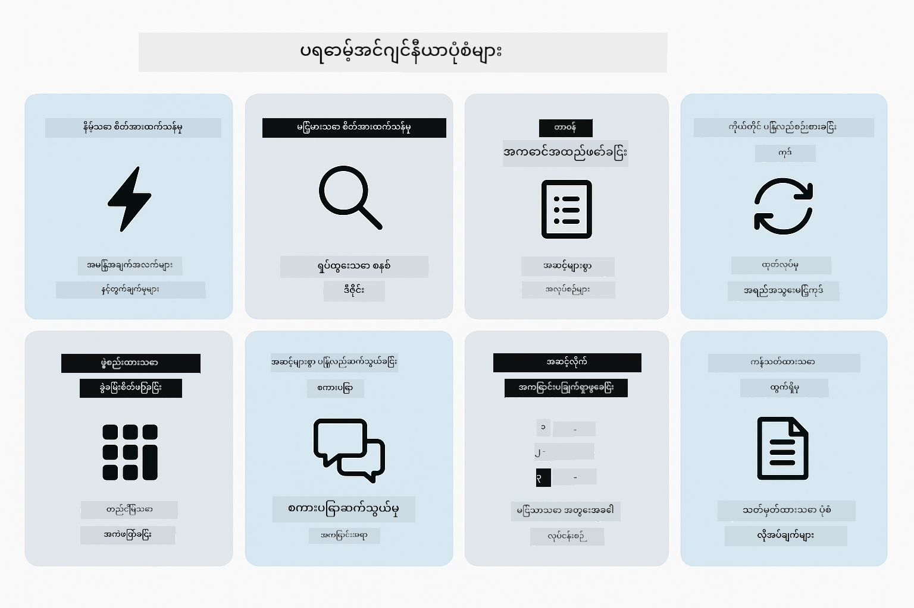

*prompt engineering ပုံစံ ၈ မျိုးနှင့် ၎င်းတို့၏ အသုံးပြုမှုအခြေအနေများ အနှစ်ချုပ်*


*နည်းသော စိတ်အားထက်သန်မှု (အမြန်၊ တိုတောင်း) နှင့် မြင့်မားသော စိတ်အားထက်သန်မှု (နက်ရှိုင်း၊ စူးစမ်း) reasoning နည်းလမ်းများ*

**နည်းသော စိတ်အားထက်သန်မှု (အမြန်နှင့် အာရုံစိုက်)** - အလွယ်တကူ မေးခွန်းများအတွက် အမြန်နှင့် တိုတောင်းသော ဖြေကြားချက်လိုအပ်သောအခါ။ မော်ဒယ်သည် reasoning အနည်းငယ်သာ ပြုလုပ်သည် - အများဆုံး ၂ အဆင့်။ တွက်ချက်မှု၊ ရှာဖွေမှု သို့မဟုတ် ရိုးရှင်းသော မေးခွန်းများအတွက် အသုံးပြုပါ။

```java
String prompt = """
    <reasoning_effort>low</reasoning_effort>
    <instruction>maximum 2 reasoning steps</instruction>
    
    What is 15% of 200?
    """;

String response = chatModel.chat(prompt);
```

> 💡 **GitHub Copilot ဖြင့် စူးစမ်းပါ:** [`Gpt5PromptService.java`](../../../02-prompt-engineering/src/main/java/com/example/langchain4j/prompts/service/Gpt5PromptService.java) ကို ဖွင့်ပြီး မေးပါ -
> - "နည်းသော စိတ်အားထက်သန်မှု နှင့် မြင့်မားသော စိတ်အားထက်သန်မှု prompting ပုံစံများ ကြားကွာခြားချက်က ဘာလဲ?"
> - "prompt များရှိ XML tag များသည် AI ၏ တုံ့ပြန်ချက် ဖွဲ့စည်းပုံကို မည်သို့ ကူညီသလဲ?"
> - "ကိုယ်တိုင် ပြန်လည်စဉ်းစားမှု ပုံစံများနှင့် တိုက်ရိုက် ညွှန်ကြားချက်များကို ဘယ်အချိန်တွင် အသုံးပြုသင့်သလဲ?"

**မြင့်မားသော စိတ်အားထက်သန်မှု (နက်ရှိုင်းနှင့် စူးစမ်း)** - ရှုပ်ထွေးသော ပြဿနာများအတွက် ကျယ်ပြန့်သော ခွဲခြမ်းစိတ်ဖြာမှုလိုအပ်သောအခါ။ မော်ဒယ်သည် နက်ရှိုင်းစွာ စူးစမ်းပြီး အသေးစိတ် reasoning ကို ပြသသည်။ စနစ်ဒီဇိုင်း၊ အင်ဂျင်နီယာ ဆုံးဖြတ်ချက်များ သို့မဟုတ် ရှုပ်ထွေးသော သုတေသနများအတွက် အသုံးပြုပါ။

```java
String prompt = """
    <reasoning_effort>high</reasoning_effort>
    <instruction>explore thoroughly, show detailed reasoning</instruction>
    
    Design a caching strategy for a high-traffic REST API.
    """;

String response = chatModel.chat(prompt);
```

**အလုပ်ဆောင်ရွက်ခြင်း (အဆင့်ဆင့် တိုးတက်မှု)** - အဆင့်များစွာ ပါဝင်သော လုပ်ငန်းစဉ်များအတွက်။ မော်ဒယ်သည် အစီအစဉ်တစ်ခုကို အရင်ပေးပြီး အဆင့်တိုင်းကို ဖော်ပြကာ နောက်ဆုံးတွင် အနှစ်ချုပ်ပေးသည်။ မိုက်ဂရိတ်၊ အကောင်အထည်ဖော်ခြင်း သို့မဟုတ် အဆင့်များစွာ ပါဝင်သော လုပ်ငန်းစဉ်များအတွက် အသုံးပြုပါ။

```java
String prompt = """
    <task>Create a REST endpoint for user registration</task>
    <preamble>Provide an upfront plan</preamble>
    <narration>Narrate each step as you work</narration>
    <summary>Summarize what was accomplished</summary>
    """;

String response = chatModel.chat(prompt);
```

Chain-of-Thought prompting သည် မော်ဒယ်အား ၎င်း၏ reasoning လုပ်ငန်းစဉ်ကို ပြသရန် တိုက်တွန်းခြင်းဖြစ်ပြီး ရှုပ်ထွေးသော အလုပ်များအတွက် တိကျမှုကို တိုးတက်စေသည်။ အဆင့်ဆင့် ခွဲခြမ်းမှုသည် လူနှင့် AI နှစ်ဦးစလုံးအတွက် အတွေးအခေါ်ကို နားလည်ရန် ကူညီသည်။

> **🤖 [GitHub Copilot](https://github.com/features/copilot) Chat ဖြင့် စမ်းသပ်ပါ:** ဤပုံစံအကြောင်း မေးပါ -
> - "ရှည်လျားစွာ ဆောင်ရွက်ရမည့် လုပ်ငန်းများအတွက် အလုပ်ဆောင်ရွက်ခြင်း ပုံစံကို မည်သို့ ပြင်ဆင်မလဲ?"
> - "ထုတ်လုပ်မှု အပလီကေးရှင်းများတွင် ကိရိယာ မိတ်ဆက်စာများကို ဖွဲ့စည်းရာတွင် အကောင်းဆုံး လေ့လာမှုများက ဘာတွေလဲ?"
> - "UI တွင် အလယ်အလတ် တိုးတက်မှု အချက်အလက်များကို မည်သို့ ဖမ်းယူ ပြသနိုင်မလဲ?"


*အစီအစဉ် → ဆောင်ရွက် → အနှစ်ချုပ် လုပ်ငန်းစဉ် အဆင့်များစွာအတွက်*

**ကိုယ်တိုင် ပြန်လည်စဉ်းစားသော ကုဒ်** - ထုတ်လုပ်မှုအရည်အသွေးမြင့် ကုဒ် ဖန်တီးရန်။ မော်ဒယ်သည် ကုဒ်ကို ဖန်တီးပြီး အရည်အသွေး စံချိန်များနှင့် နှိုင်းယှဉ်စစ်ဆေးကာ တိုးတက်အောင် ပြုပြင်သည်။ အသစ် feature များ သို့မဟုတ် service များ တည်ဆောက်ရာတွင် အသုံးပြုပါ။

```java
String prompt = """
    <task>Create an email validation service</task>
    <quality_criteria>
    - Correct logic and error handling
    - Best practices (clean code, proper naming)
    - Performance optimization
    - Security considerations
    </quality_criteria>
    <instruction>Generate code, evaluate against criteria, improve iteratively</instruction>
    """;

String response = chatModel.chat(prompt);
```


*အဆက်မပြတ် တိုးတက်မှု လည်ပတ်မှု - ဖန်တီး၊ အကဲဖြတ်၊ ပြဿနာ ရှာဖွေ၊ တိုးတက်စေ၊ ထပ်မံလုပ်ဆောင်*

**ဖွဲ့စည်းထားသော ခွဲခြမ်းစိတ်ဖြာမှု** - တည်ငြိမ်သော အကဲဖြတ်မှုအတွက်။ မော်ဒယ်သည် ကုဒ်ကို တိကျသော ဖွဲ့စည်းမှု (မှန်ကန်မှု၊ လေ့လာမှုများ၊ စွမ်းဆောင်ရည်၊ လုံခြုံရေး) ဖြင့် ပြန်လည်သုံးသပ်သည်။ ကုဒ်ပြန်လည်သုံးသပ်ခြင်း သို့မဟုတ် အရည်အသွေး သုံးသပ်မှုများအတွက် အသုံးပြုပါ။

```java
String prompt = """
    <code>
    public List getUsers() {
        return database.query("SELECT * FROM users");
    }
    </code>
    
    <framework>
    Evaluate using these categories:
    1. Correctness - Logic and functionality
    2. Best Practices - Code quality
    3. Performance - Efficiency concerns
    4. Security - Vulnerabilities
    </framework>
    """;

String response = chatModel.chat(prompt);
```

> **🤖 [GitHub Copilot](https://github.com/features/copilot) Chat ဖြင့် စမ်းသပ်ပါ:** ဖွဲ့စည်းထားသော ခွဲခြမ်းစိတ်ဖြာမှုအကြောင်း မေးပါ -
> - "ကွဲပြားသော ကုဒ်ပြန်လည်သုံးသပ်မှုအမျိုးအစားများအတွက် ခွဲခြမ်းစိတ်ဖြာမှု ဖွဲ့စည်းမှုကို မည်သို့ စိတ်ကြိုက်ပြင်ဆင်နိုင်မလဲ?"
> - "ဖွဲ့စည်းထားသော ထွက်ရှိမှုကို ပရိုဂရမ်ဖြင့် မည်သို့ ဖော်ထုတ်ပြီး လုပ်ဆောင်နိုင်မလဲ?"
> - "ကွဲပြားသော ပြန်လည်သုံးသပ်မှု အစည်းအဝေးများတွင် တင်းကြပ်မှု အဆင့်များကို မည်သို့ တည်ငြိမ်စေမလဲ?"

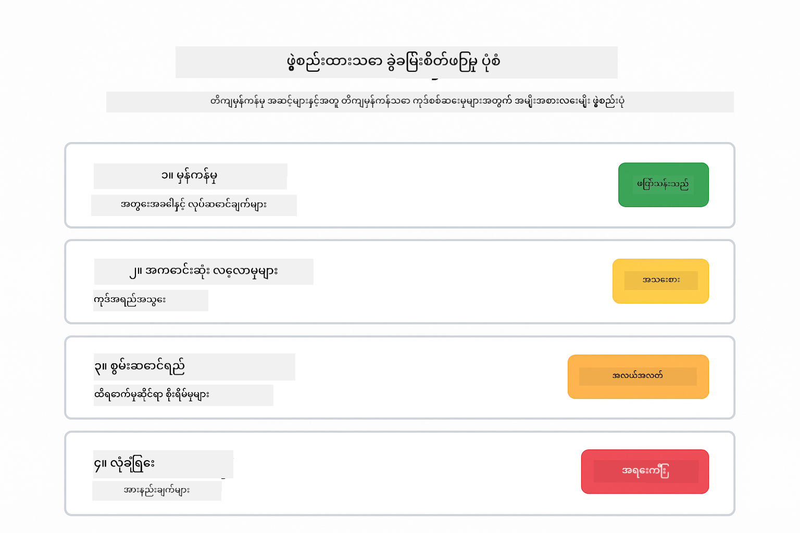

*severity အဆင့်များနှင့်အတူ တည်ငြိမ်သော ကုဒ်ပြန်လည်သုံးသပ်မှုအတွက် အမျိုးအစား ၄ မျိုး ဖွဲ့စည်းမှု*

**အဆက်မပြတ် စကားပြောခြင်း** - context လိုအပ်သော စကားပြောများအတွက်။ မော်ဒယ်သည် ယခင်စာတိုက်များကို မှတ်မိကာ ဆက်လက်တည်ဆောက်သည်။ အပြန်အလှန် အကူအညီအစည်းအဝေးများ သို့မဟုတ် ရှုပ်ထွေးသော Q&A များအတွက် အသုံးပြုပါ။

```java
ChatMemory memory = MessageWindowChatMemory.withMaxMessages(10);

memory.add(UserMessage.from("What is Spring Boot?"));
AiMessage aiMessage1 = chatModel.chat(memory.messages()).aiMessage();
memory.add(aiMessage1);

memory.add(UserMessage.from("Show me an example"));
AiMessage aiMessage2 = chatModel.chat(memory.messages()).aiMessage();
memory.add(aiMessage2);
```


*စကားပြော context သည် token ကန့်သတ်ချက်ထိ အဆက်မပြတ် စုဆောင်းသည်*

**အဆင့်ဆင့် အကြောင်းပြချက်ပြခြင်း** - မြင်သာသော အတွေးအခေါ်လိုအပ်သော ပြဿနာများအတွက်။ မော်ဒယ်သည် အဆင့်တိုင်းအတွက် တိကျသော reasoning ကို ပြသသည်။ သင်္ချာပြဿနာများ၊ logic ပဟေဠိများ သို့မဟုတ် စဉ်းစားမှု လုပ်ငန်းစဉ်ကို နားလည်ရန်လိုအပ်သောအခါ အသုံးပြုပါ။

```java
String prompt = """
    <instruction>Show your reasoning step-by-step</instruction>
    
    If a train travels 120 km in 2 hours, then stops for 30 minutes,
    then travels another 90 km in 1.5 hours, what is the average speed
    for the entire journey including the stop?
    """;

String response = chatModel.chat(prompt);
```

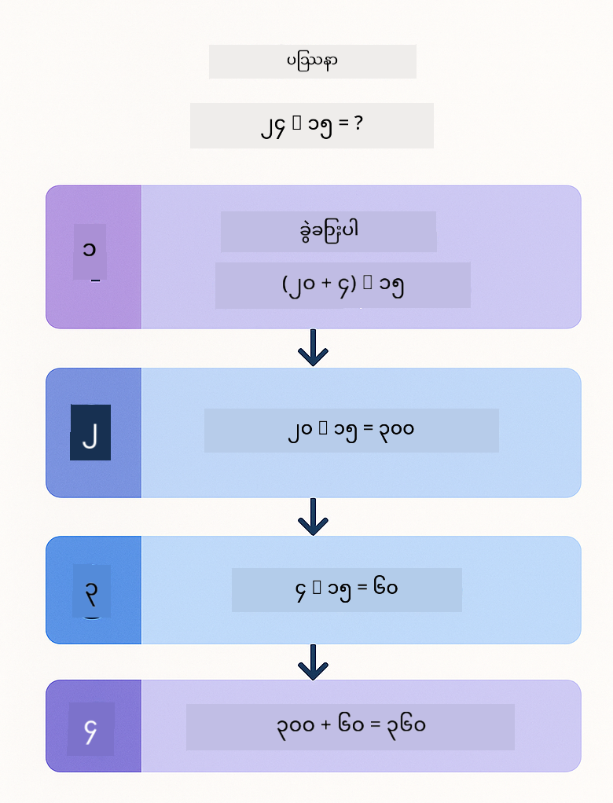

*ပြဿနာများကို တိကျသော အဆင့်ဆင့် အတွေးအခေါ်များသို့ ခွဲခြမ်းခြင်း*

**ကန့်သတ်ထားသော ထွက်ရှိမှု** - သတ်မှတ်ထားသော ဖော်မတ်လိုအပ်ချက်များနှင့် တုံ့ပြန်ချက်များအတွက်။ မော်ဒယ်သည် ဖော်မတ်နှင့် အရှည်စည်းမျဉ်းများကို တိကျစွာ လိုက်နာသည်။ အနှစ်ချုပ်များ သို့မဟုတ် တိကျသော ထွက်ရှိမှု ဖွဲ့စည်းမှုလိုအပ်သောအခါ အသုံးပြုပါ။

```java
String prompt = """
    <constraints>
    - Exactly 100 words
    - Bullet point format
    - Technical terms only
    </constraints>
    
    Summarize the key concepts of machine learning.
    """;

String response = chatModel.chat(prompt);
```

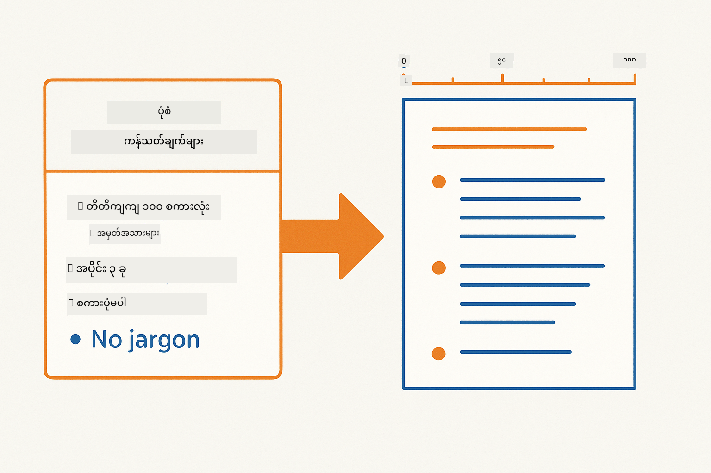

*သတ်မှတ်ထားသော ဖော်မတ်၊ အရှည်နှင့် ဖွဲ့စည်းမှု စည်းမျဉ်းများကို အကောင်အထည်ဖော်ခြင်း*

## ရှိပြီးသား Azure အရင်းအမြစ်များ အသုံးပြုခြင်း

**တပ်ဆင်မှုကို အတည်ပြုပါ:**

Root directory တွင် Azure အတည်ပြုချက်ပါ `.env` ဖိုင် ရှိကြောင်း သေချာစေပါ (Module 01 တွင် ဖန်တီးထားသည်)။
```bash
cat ../.env  # AZURE_OPENAI_ENDPOINT, API_KEY, DEPLOYMENT ကိုပြသသင့်သည်။
```

**အပလီကေးရှင်း စတင်ပါ:**

> **မှတ်ချက်:** Module 01 မှ `./start-all.sh` ဖြင့် အပလီကေးရှင်းအားလုံး စတင်ထားပြီးဖြစ်ပါက ဤ module သည် 8083 port တွင် ရပ်တည်နေပါပြီ။ အောက်ပါ စတင်ရန် အမိန့်များကို ကျော်လွှားပြီး http://localhost:8083 သို့ တိုက်ရိုက် သွားနိုင်ပါသည်။

**ရွေးချယ်မှု ၁: Spring Boot Dashboard အသုံးပြုခြင်း (VS Code အသုံးပြုသူများအတွက် အကြံပြုသည်)**

Dev container တွင် Spring Boot Dashboard extension ပါဝင်ပြီး Spring Boot အပလီကေးရှင်းအားလုံးကို ကြည့်ရှု စီမံခန့်ခွဲရန် ဗီဇွယ် အင်တာဖေ့စ် ပေးသည်။ VS Code ၏ ဘယ်ဘက် Activity Bar တွင် Spring Boot အိုင်ကွန်ကို ရှာနိုင်သည်။

Spring Boot Dashboard မှာ -
- အလုပ်လုပ်နေသော Spring Boot အပလီကေးရှင်းအားလုံးကို ကြည့်ရှုနိုင်သည်
- တစ်ချက်နှိပ်၍ အပလီကေးရှင်းများ စတင်/ရပ်တန့်နိုင်သည်
- အပလီကေးရှင်း log များကို အချိန်နှင့်တပြေးညီ ကြည့်ရှုနိုင်သည်
- အပလီကေးရှင်း အခြေအနေကို စောင့်ကြည့်နိုင်သည်

"prompt-engineering" အနားရှိ play ခလုတ်ကို နှိပ်၍ ဤ module ကို စတင်ပါ၊ သို့မဟုတ် module အားလုံးကို တပြိုင်နက် စတင်နိုင်သည်။

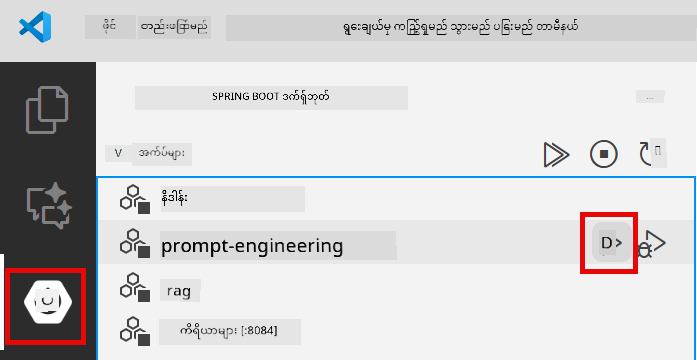

**ရွေးချယ်မှု ၂: shell script များ အသုံးပြုခြင်း**

Web application အားလုံး (module 01-04) စတင်ရန် -

**Bash:**
```bash
cd ..  # မူလဖိုင်လမ်းကြောင်းမှ
./start-all.sh
```

**PowerShell:**
```powershell
cd ..  # မူလဖိုင်လမ်းကြောင်းမှ
.\start-all.ps1
```

သို့မဟုတ် ဤ module သာ စတင်ရန် -

**Bash:**
```bash
cd 02-prompt-engineering
./start.sh
```

**PowerShell:**
```powershell
cd 02-prompt-engineering
.\start.ps1
```

script နှစ်ခုလုံးသည် root `.env` ဖိုင်မှ environment variables များကို အလိုအလျောက် load လုပ်ပြီး JAR မရှိပါက တည်ဆောက်ပေးမည်။

> **မှတ်ချက်:** စတင်ရန်မတိုင်မီ module အားလုံးကို လက်ဖြင့် တည်ဆောက်လိုပါက -
>
> **Bash:**
> ```bash
> cd ..  # Go to root directory
> mvn clean package -DskipTests
> ```
>
> **PowerShell:**
> ```powershell
> cd ..  # Go to root directory
> mvn clean package -DskipTests
> ```

http://localhost:8083 ကို browser တွင် ဖွင့်ပါ။

**ရပ်တန့်ရန်:**

**Bash:**
```bash
./stop.sh  # ဒီမော်ဂျူးသာ
# ဒါမှမဟုတ်
cd .. && ./stop-all.sh  # မော်ဂျူးအားလုံး
```

**PowerShell:**
```powershell
.\stop.ps1  # ဒီမော်ဂျူးသာ
# ဒါမှမဟုတ်
cd ..; .\stop-all.ps1  # မော်ဂျူးအားလုံး
```

## အပလီကေးရှင်း Screenshot များ

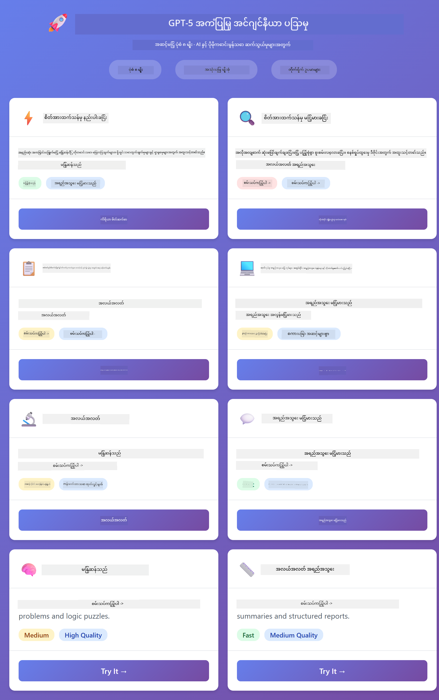

*prompt engineering ပုံစံ ၈ မျိုးအားလုံးနှင့် ၎င်းတို့၏ လက္ခဏာများ၊ အသုံးပြုမှုအခြေအနေများကို ပြသသည့် မူလ dashboard*

## ပုံစံများကို စူးစမ်းလေ့လာခြင်း

ဝက်ဘ်အင်တာဖေ့စ်သည် မတူညီသော prompting နည်းလမ်းများကို စမ်းသပ်ရန် ခွင့်ပြုသည်။ ပုံစံတိုင်းသည် မတူညီသော ပြဿနာများကို ဖြေရှင်းသည် - မည်သည့်နည်းလမ်းသည် ဘယ်အချိန်တွင် ထူးခြားမှု ပြသသည်ကို ကြည့်ရှုပါ။

### နည်းသော စိတ်အားထက်သန်မှု နှင့် မြင့်မားသော စိတ်အားထက်သန်မှု

"200 ၏ 15%" ဆိုသော ရိုးရှင်းသော မေးခွန်းကို နည်းသော စိတ်အားထက်သန်မှုဖြင့် မေးပါ။ ချက်ချင်း တိုတောင်းသော ဖြေကြားချက် ရရှိမည်။ ယခု "high-traffic API အတွက် caching strategy ကို ဒီဇိုင်းဆွဲပါ" ဆိုသော ရှုပ်ထွေးသော မေးခွန်းကို မြင့်မားသော စိတ်အားထက်သန်မှုဖြင့် မေးပါ။ မော်ဒယ်သည် နှေးကွေးလာပြီး အသေးစိတ် reasoning ကို ပေးမည်ကို ကြည့်ရှုပါ။ မော်ဒယ်တူ၊ မေးခွန်းဖွဲ့စည်းပုံတူ - သို့သော် prompt သည် စဉ်းစားမှု အဆင့်ကို သတ်မှတ်ပေးသည်။

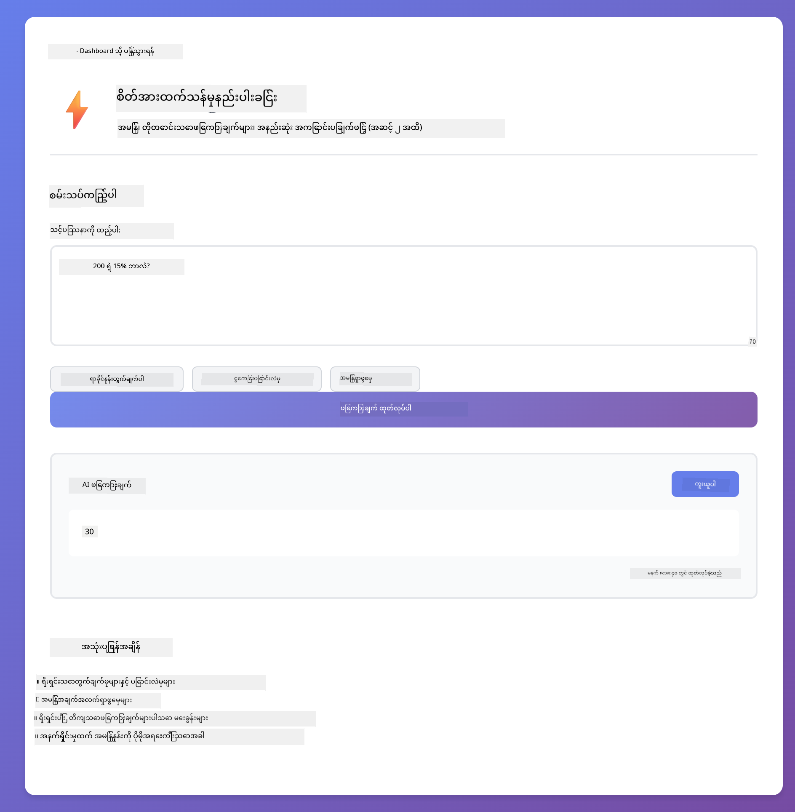
*အနည်းဆုံး အကြောင်းပြချက်ဖြင့် အမြန်တွက်ချက်ခြင်း*


*ကျယ်ပြန့်သော caching မဟာဗျူဟာ (2.8MB)*

### အလုပ်တာဝန် ဆောင်ရွက်ခြင်း (ကိရိယာ မိတ်ဆက်များ)

အဆင့်များစွာပါဝင်သော workflow များသည် အစပိုင်း စီမံကိန်းရေးဆွဲခြင်းနှင့် တိုးတက်မှု ဖော်ပြခြင်းတို့မှ အကျိုးရှိသည်။ မော်ဒယ်သည် မည်သည်ကိုလုပ်မည်ကို ရှင်းပြပြီး၊ အဆင့်တိုင်းကို ဖော်ပြကာ နောက်ဆုံးတွင် ရလဒ်များကို အကျဉ်းချုပ်ပြသည်။


*အဆင့်ဆင့် ဖော်ပြချက်ဖြင့် REST endpoint တည်ဆောက်ခြင်း (3.9MB)*

### ကိုယ်တိုင် ပြန်လည်သုံးသပ်သော ကုဒ်

"အီးမေးလ် စစ်ဆေးမှု ဝန်ဆောင်မှု တည်ဆောက်ပါ" ဟု ကြိုးစားကြည့်ပါ။ ကုဒ်ကို ဖန်တီးပြီး ရပ်တန့်ခြင်းမပြုဘဲ၊ မော်ဒယ်သည် ဖန်တီး၊ အရည်အသွေး စံချိန်များနှင့် နှိုင်းယှဉ်၊ အားနည်းချက်များကို ရှာဖွေကာ တိုးတက်အောင် ပြုလုပ်သည်။ သင်သည် ကုဒ်သည် ထုတ်လုပ်မှု စံချိန်များနှင့် ကိုက်ညီသည်အထိ ထပ်မံလုပ်ဆောင်သည့် အခြေအနေကို မြင်ရမည်။

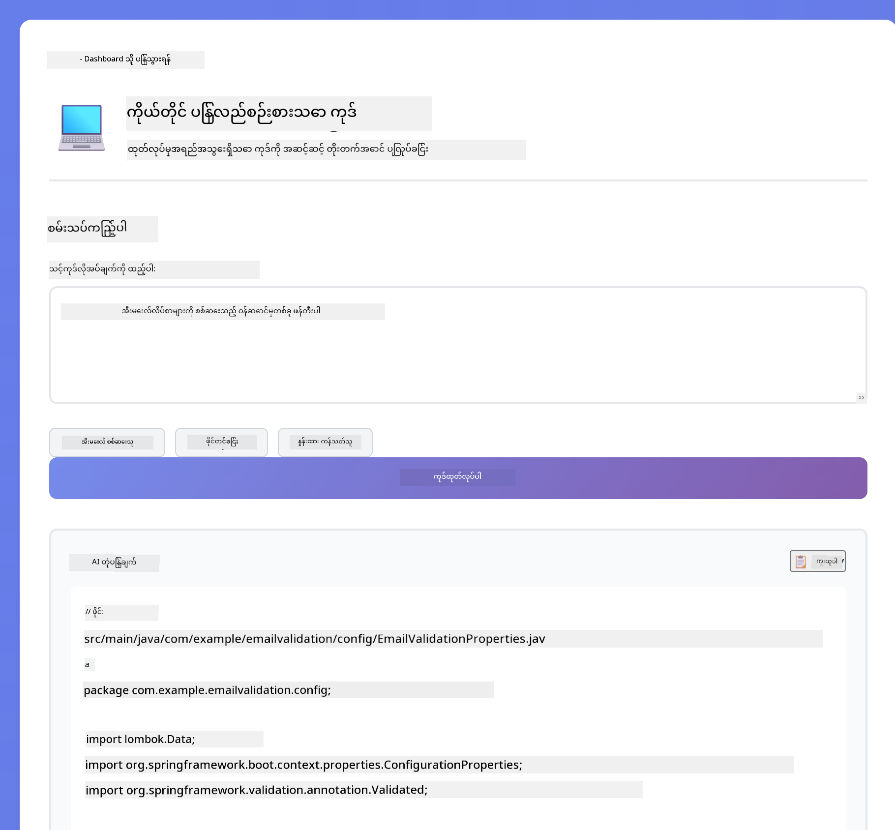

*အီးမေးလ် စစ်ဆေးမှု ဝန်ဆောင်မှု ပြည့်စုံစွာ (5.2MB)*

### ဖွဲ့စည်းထားသော ခွဲခြမ်းစိတ်ဖြာခြင်း

ကုဒ် ပြန်လည်သုံးသပ်မှုများတွင် တိကျသော အကဲဖြတ်မှု စနစ်များ လိုအပ်သည်။ မော်ဒယ်သည် ကုဒ်ကို တိကျမှု၊ လေ့လာမှု၊ စွမ်းဆောင်ရည်၊ လုံခြုံမှု စသည့် အမျိုးအစားများဖြင့် အဆင့်အတန်းများနှင့်အတူ ခွဲခြမ်းစိတ်ဖြာသည်။

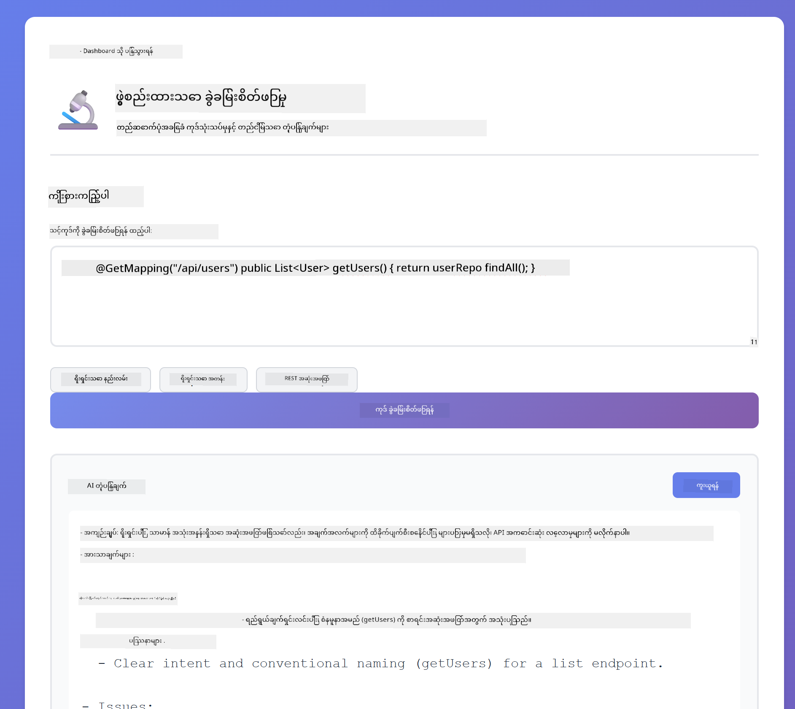

*ဖွဲ့စည်းထားသော ကုဒ် ပြန်လည်သုံးသပ်မှု*

### အဆက်မပြတ် စကားပြောဆိုခြင်း

"Spring Boot ဆိုတာဘာလဲ?" ဟု မေးပြီးနောက် "ဥပမာပြပါ" ဟု ချက်ချင်း ဆက်မေးပါ။ မော်ဒယ်သည် သင်၏ ပထမမေးခွန်းကို မှတ်မိပြီး Spring Boot ဥပမာကို အထူးပြု၍ ပေးသည်။ မှတ်ဉာဏ်မရှိပါက ဒုတိယမေးခွန်းသည် မရှင်းလင်းသော မေးခွန်းဖြစ်မည်။

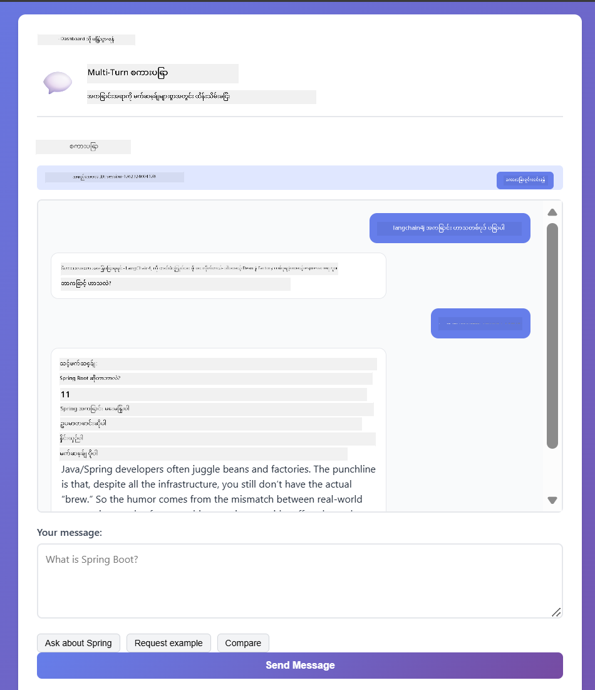

*မေးခွန်းများအတွင်း အကြောင်းအရာ ထိန်းသိမ်းခြင်း*

### အဆင့်ဆင့် အကြောင်းပြချက်

သင် သင်္ချာပြဿနာတစ်ခုကို ရွေးပြီး Step-by-Step Reasoning နှင့် Low Eagerness နှစ်မျိုးဖြင့် ကြိုးစားကြည့်ပါ။ Low eagerness သည် ဖြေချက်ကိုသာ မြန်ဆန်စွာ ပေးသည် - အမြန်သော်လည်း မရှင်းလင်းပါ။ Step-by-step သည် တစ်ဆင့်ချင်းစီ တွက်ချက်မှုနှင့် ဆုံးဖြတ်ချက်များကို ပြသသည်။


*အဆင့်များ ဖော်ပြထားသော သင်္ချာပြဿနာ*

### ကန့်သတ်ထားသော ထုတ်လွှင့်မှု

သင်သည် သတ်မှတ်ထားသော ပုံစံများ သို့မဟုတ် စကားလုံးရေများ လိုအပ်ပါက ဤပုံစံသည် တိကျစွာ လိုက်နာမှုကို အတင်းအကျပ် သတ်မှတ်ပေးသည်။ တိတိကျကျ ၁၀၀ စကားလုံးပါသော အကျဉ်းချုပ်ကို bullet point ပုံစံဖြင့် ဖန်တီးကြည့်ပါ။

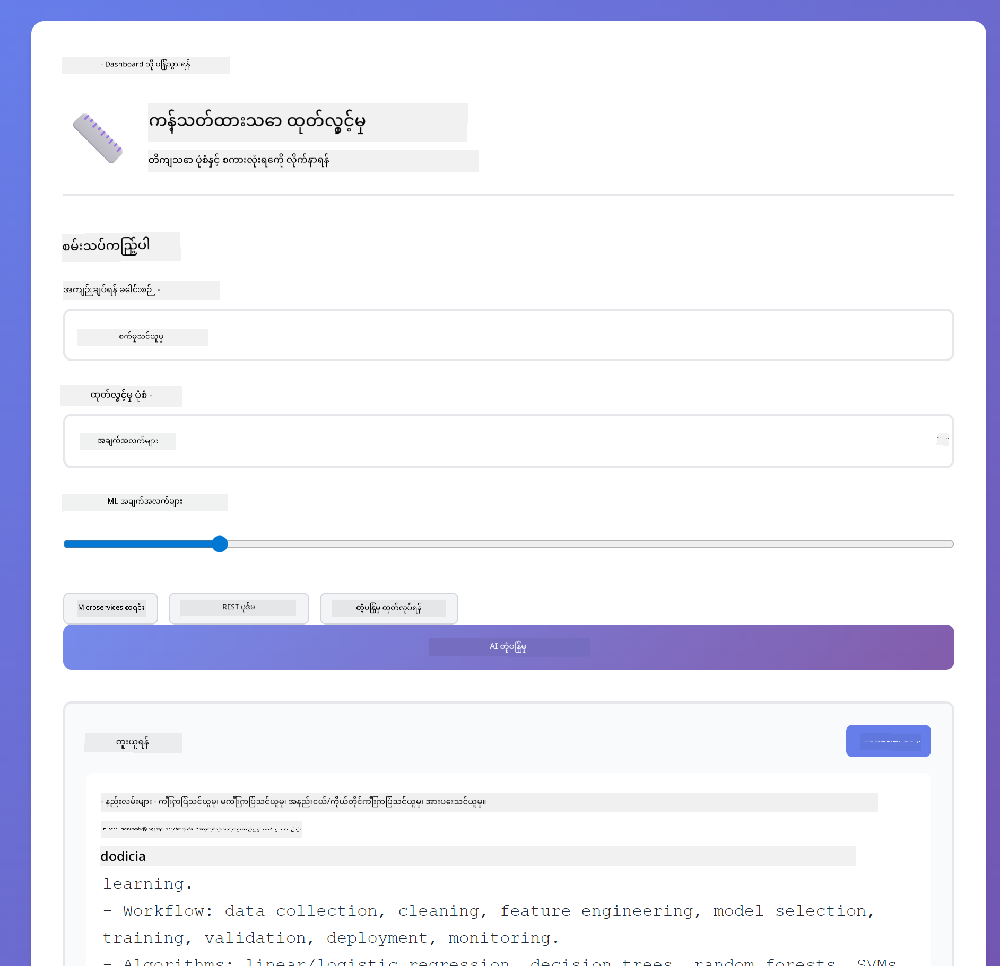

*ပုံစံထိန်းချုပ်မှုဖြင့် စက်သင်ယူမှု အကျဉ်းချုပ်*

## သင် လေ့လာနေသည်မှာ

**အကြောင်းပြချက် ကြိုးစားမှုသည် အရာအားလုံးကို ပြောင်းလဲစေသည်**

GPT-5 သည် သင်၏ prompt များမှတဆင့် တွက်ချက်မှု ကြိုးစားမှုကို ထိန်းချုပ်ခွင့်ပြုသည်။ ကြိုးစားမှုနည်းသည် အမြန်ဖြေကြားမှုများနှင့် အနည်းဆုံး ရှာဖွေမှုများကို ဆိုလိုသည်။ ကြိုးစားမှုများသည် မော်ဒယ်ကို အတွေးအခေါ် နက်ရှိုင်းစွာ ပြုလုပ်ရန် အချိန်ယူစေသည်။ သင်သည် အလုပ်၏ ရှုပ်ထွေးမှုနှင့် ကိုက်ညီသော ကြိုးစားမှုကို သင်ယူနေသည် - ရိုးရှင်းသော မေးခွန်းများတွင် အချိန်မကုန်သုံးပါနှင့်၊ ရှုပ်ထွေးသော ဆုံးဖြတ်ချက်များတွင်လည်း အလျင်မပြုပါနှင့်။

**ဖွဲ့စည်းမှုသည် အပြုအမူကို ဦးတည်ပေးသည်**

prompt များရှိ XML tag များကို သတိပြုပါ။ ၎င်းတို့သည် အလှဆင်မှု မဟုတ်ပါ။ မော်ဒယ်များသည် ဖွဲ့စည်းထားသော ညွှန်ကြားချက်များကို အခိုင်အမာ လိုက်နာသည်။ အဆင့်များစွာပါသော လုပ်ငန်းစဉ်များ သို့မဟုတ် ရှုပ်ထွေးသော အတွေးအခေါ်များ လိုအပ်သောအခါ ဖွဲ့စည်းမှုသည် မော်ဒယ်အား ၎င်း၏ တည်နေရာနှင့် နောက်တစ်ဆင့်ကို လိုက်လံစောင့်ကြည့်ရန် ကူညီပေးသည်။

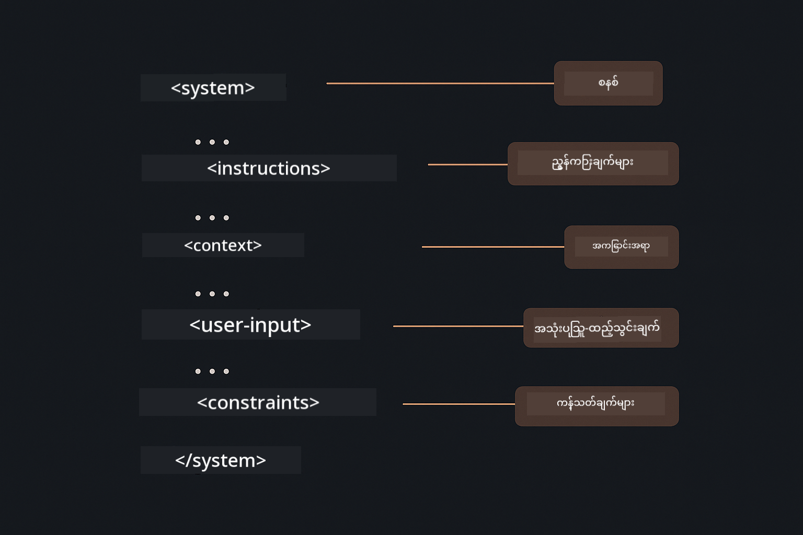

*ရှင်းလင်းသော အပိုင်းများနှင့် XML ပုံစံ စီမံခန့်ခွဲမှုဖြင့် ကောင်းမွန်စွာ ဖွဲ့စည်းထားသော prompt ၏ ဖွဲ့စည်းပုံ*

**အရည်အသွေးသည် ကိုယ်တိုင် သုံးသပ်မှုမှ ဖြစ်ပေါ်သည်**

ကိုယ်တိုင် ပြန်လည်သုံးသပ်မှု ပုံစံများသည် အရည်အသွေး စံချိန်များကို ထင်ဟပ်စေသည်။ မော်ဒယ်သည် "မှန်ကန်စွာ လုပ်ဆောင်မည်" ဟု မမျှော်လင့်ဘဲ "မှန်ကန်သည်" ဆိုသည်မှာ မည်သည်ကို ဆိုလိုသည်ကို တိတိကျကျ ပြောပြသည် - မှန်ကန်သော အတွေးအခေါ်၊ အမှားကိုင်တွယ်မှု၊ စွမ်းဆောင်ရည်၊ လုံခြုံမှု။ မော်ဒယ်သည် ၎င်း၏ ထုတ်လွှင့်မှုကို ကိုယ်တိုင် အကဲဖြတ်ကာ တိုးတက်စေသည်။ ၎င်းသည် ကုဒ် ဖန်တီးမှုကို ကံစမ်းမဲမှ လုပ်ငန်းစဉ်တစ်ခုသို့ ပြောင်းလဲစေသည်။

**အကြောင်းအရာသည် ကန့်သတ်ထားသည်**

အဆက်မပြတ် စကားပြောဆိုမှုများသည် မက်ဆေ့ခ်ျ သမိုင်းကို တောင်းဆိုမှုတိုင်းတွင် ထည့်သွင်းခြင်းဖြင့် လုပ်ဆောင်သည်။ သို့သော် ကန့်သတ်ချက်ရှိသည် - မော်ဒယ်တိုင်းတွင် အများဆုံး token အရေအတွက်ရှိသည်။ စကားပြောဆိုမှုများ တိုးလာသည်နှင့်အမျှ သင့်အား သက်ဆိုင်ရာ အကြောင်းအရာကို ထိန်းသိမ်းရန် မဟုတ်မဖြစ် လိုအပ်သော မဟာဗျူဟာများ လိုအပ်မည်ဖြစ်သည်။ ဤ module သည် မှတ်ဉာဏ် လုပ်ဆောင်ပုံကို ပြသသည်။ နောက်ပိုင်းတွင် သင်သည် ဘယ်အချိန်တွင် အကျဉ်းချုပ်ရမည်၊ ဘယ်အချိန်တွင် မေ့ရမည်၊ ဘယ်အချိန်တွင် ပြန်ယူရမည်ကို သင်ယူမည်။

## နောက်တစ်ဆင့်များ

**နောက်တစ်ခုသော Module:** [03-rag - RAG (Retrieval-Augmented Generation)](../03-rag/README.md)

---

**လမ်းညွှန်:** [← ယခင်: Module 01 - နိဒါန်း](../01-introduction/README.md) | [ပင်မသို့ ပြန်သွားရန်](../README.md) | [နောက်တစ်ခု: Module 03 - RAG →](../03-rag/README.md)

---

<!-- CO-OP TRANSLATOR DISCLAIMER START -->
**အကြောင်းကြားချက်**  
ဤစာတမ်းကို AI ဘာသာပြန်ဝန်ဆောင်မှု [Co-op Translator](https://github.com/Azure/co-op-translator) ဖြင့် ဘာသာပြန်ထားပါသည်။ ကျွန်ုပ်တို့သည် တိကျမှန်ကန်မှုအတွက် ကြိုးစားသော်လည်း အလိုအလျောက် ဘာသာပြန်ချက်များတွင် အမှားများ သို့မဟုတ် မှားယွင်းချက်များ ပါဝင်နိုင်ကြောင်း သတိပြုပါရန် မေတ္တာရပ်ခံအပ်ပါသည်။ မူရင်းစာတမ်းကို မိမိဘာသာစကားဖြင့်သာ တရားဝင်အရင်းအမြစ်အဖြစ် ယူဆသင့်ပါသည်။ အရေးကြီးသော အချက်အလက်များအတွက် လူ့ပညာရှင်များ၏ ပရော်ဖက်ရှင်နယ် ဘာသာပြန်ခြင်းကို အကြံပြုပါသည်။ ဤဘာသာပြန်ချက်ကို အသုံးပြုမှုကြောင့် ဖြစ်ပေါ်လာနိုင်သည့် နားလည်မှုမှားယွင်းမှုများ သို့မဟုတ် မှားဖတ်မှုများအတွက် ကျွန်ုပ်တို့သည် တာဝန်မယူပါ။
<!-- CO-OP TRANSLATOR DISCLAIMER END -->