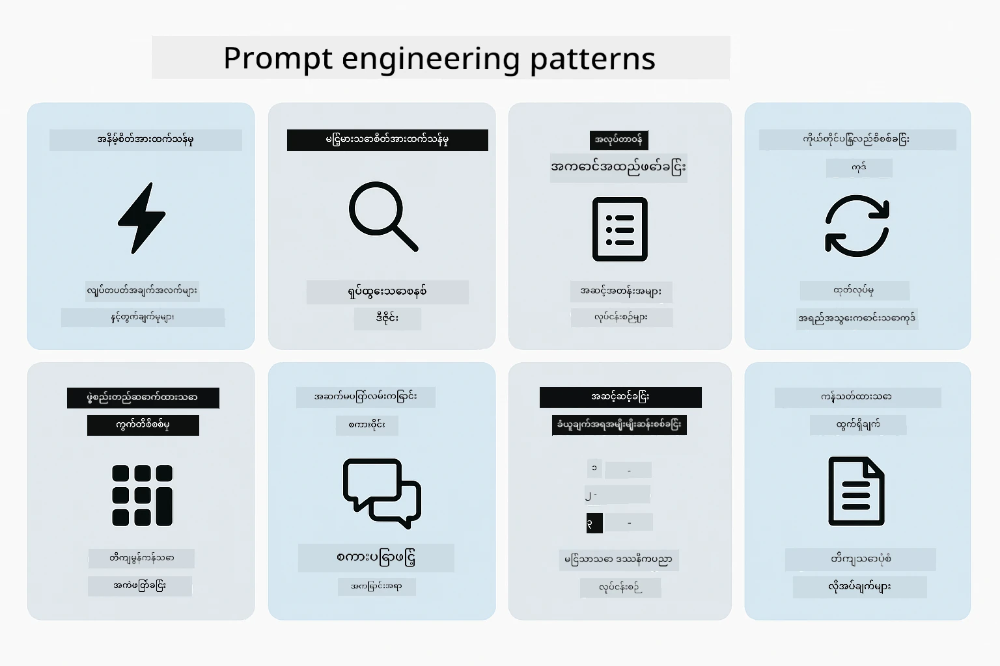
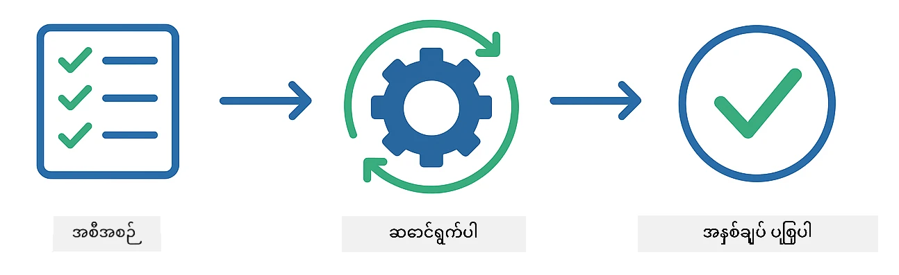
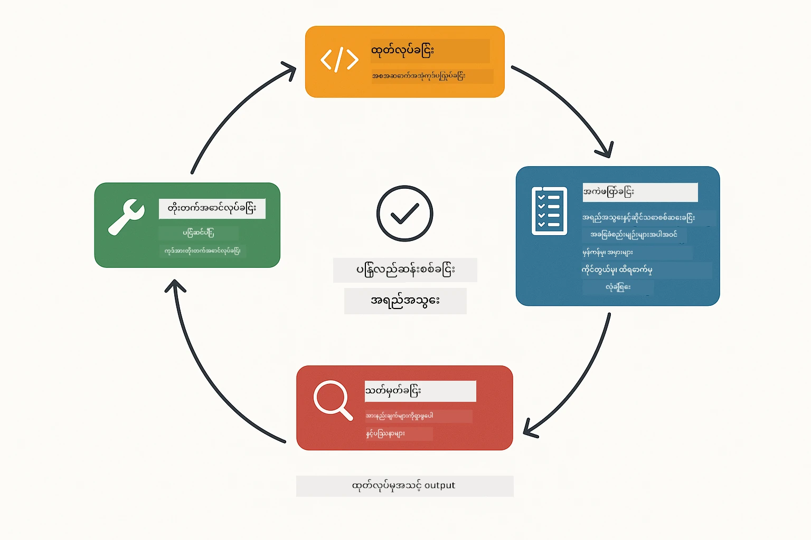
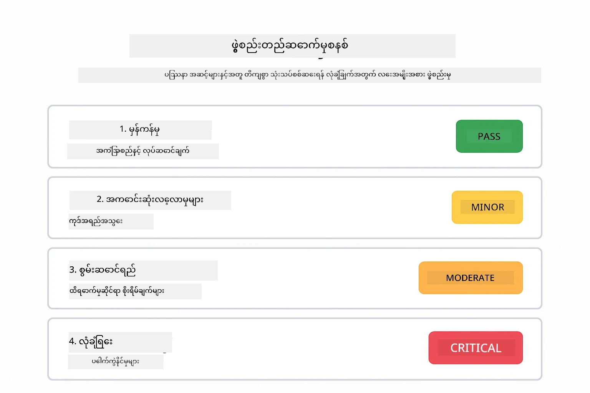
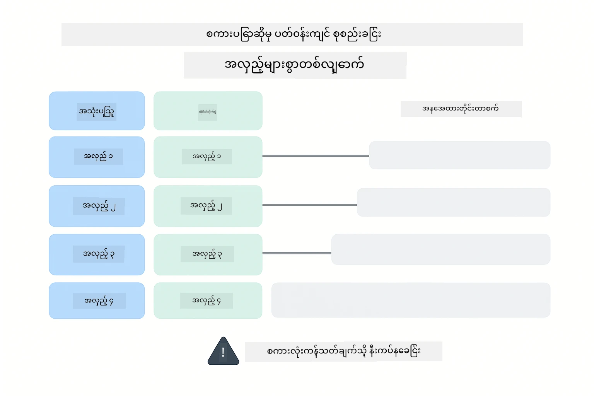
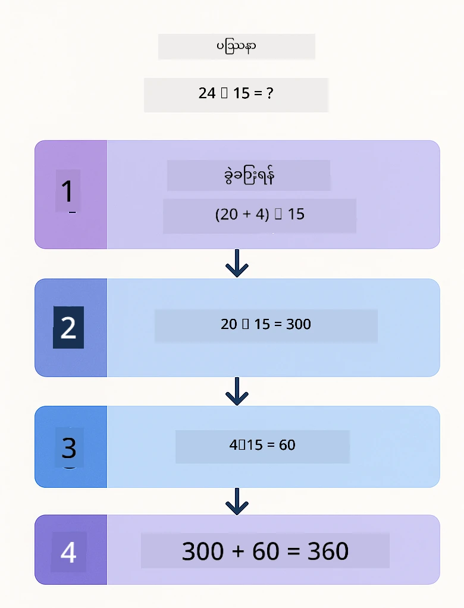
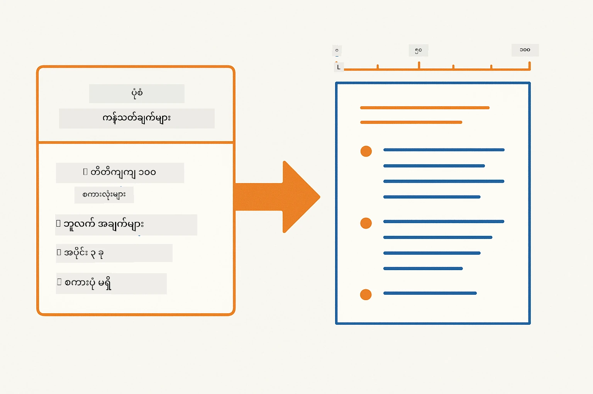
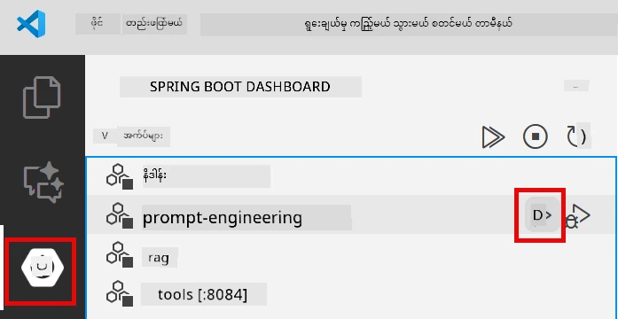
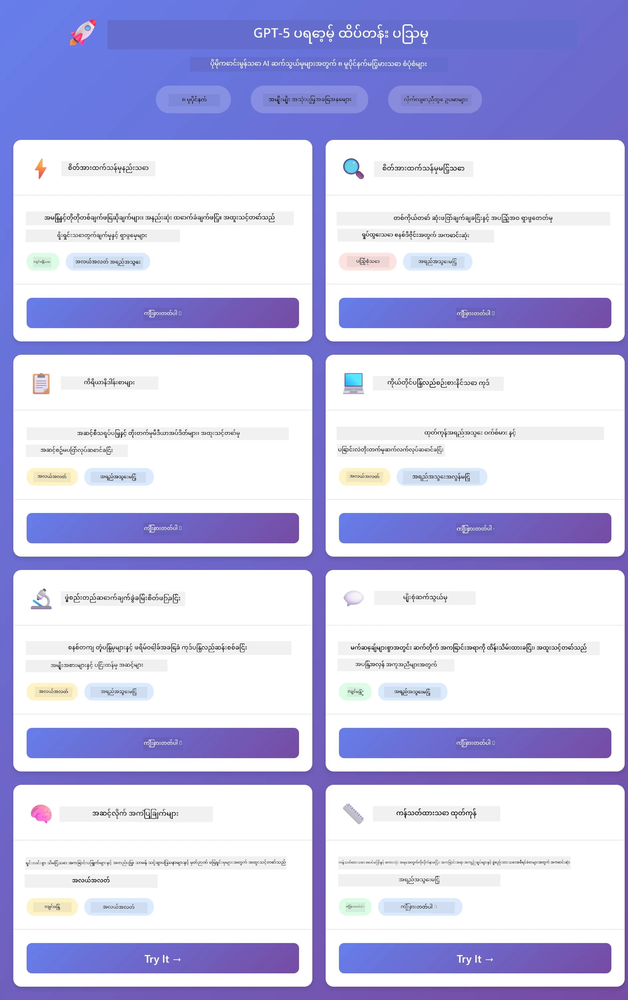
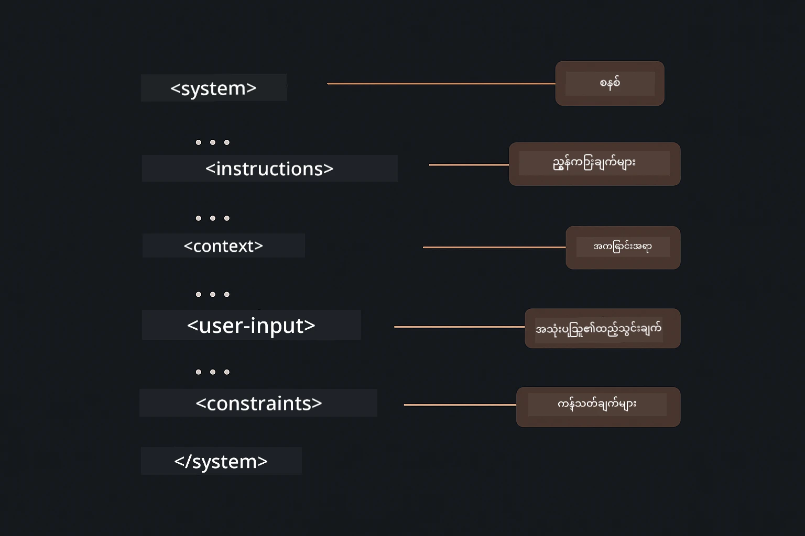

# Module 02: GPT-5.2 နှင့် Prompt Engineering

## မဂ္ဂဇင်း

- [ဗီဒီယို လမ်းညွှန်ချက်](#ဗီဒီယို-လမ်းညွှန်ချက်)
- [သင်လေ့လာမည့်အရာများ](#သင်လေ့လာမည့်အရာများ)
- [လိုအပ်ချက်များ](#လိုအပ်ချက်များ)
- [Prompt Engineering ကိုနားလည်ခြင်း](#prompt-engineering-ကို-နားလည်ခြင်း)
- [Prompt Engineering အခြေခံများ](#prompt-engineering-အခြေခံများ)
  - [Zero-Shot Prompting](#zero-shot-prompting)
  - [Few-Shot Prompting](#few-shot-prompting)
  - [Chain of Thought](#chain-of-thought)
  - [Role-Based Prompting](#role-based-prompting)
  - [Prompt Templates](#prompt-templates)
- [အဆင့်မြင့် ပုံစံများ](#အဆင့်မြင့်-ပုံစံများ)
- [အပ်ပလီကေးရှင်း ပြေးရန်](#အပလီကေးရှင်းကို-လည်ပတ်ပါ)
- [အပ်ပလီကေးရှင်း အကြေကွင်းများ](#အပလီကေးရှင်း-screenshot-များ)
- [ပုံစံများကို စူးစမ်းရှင်းလင်းခြင်း](#ပုံစံများကို-စူးစမ်းလေ့လာခြင်း)
  - [နိမ့်သော စိတ်အားထက်သန်မှုနှင့် မြင့်မားသော စိတ်အားထက်သန်မှု](#low-eagerness-နှင့်-high-eagerness)
  - [Task Execution (ကိရိယာ အစောင့်အရှောက်များ)](#ရည်မှန်းချက်ဖြင့်-လုပ်ငန်းဆောင်ရွက်ခြင်း-tool-preambles)
  - [ကိုယ်တိုင် သုံးသပ်ခြင်း ကုဒ်](#ကိုယ်တိုင်-သုံးသပ်သော-ကုဒ်)
  - [ဖွဲ့စည်းထားသော သုံးသပ်ချက်](#ဖွဲ့စည်းမှုတကျ-သုံးသပ်ခြင်း)
  - [အကြိမ်ကြိမ် စကားပြောခြင်း](#မလှုပ်မရှား-စကားပြောဆိုမှု)
  - [ခြေလှမ်းခြေလှမ်း နည်းလမ်းဖြင့် မှတ်ချက်ပြုခြင်း](#အဆင့်လိုက်-အတွေးအမြင်)
  - [ကန့်သတ်ထားသော ထုတ်လွှင့်ချက်](#အကန့်အသတ်ထားသည့်-အထွက်အဖြေ)
- [သင်တကယ် သင်ယူနေသည့်အရာ](#သင်ဘာတွေ-စစ်မှန်ပြီး-လေ့လာနေပါသလဲ)
- [နောက်တိုးမှုများ](#နောက်တစ်ဆင့်များ)

## ဗီဒီယို လမ်းညွှန်ချက်

ဒီ module ကို စတင်အသုံးပြုနည်းကို ရှင်းပြထားသော တိုက်ရိုက်အစည်းအဝေးကို ကြည့်ရှုနိုင်ပါသည်။

<a href="https://www.youtube.com/live/PJ6aBaE6bog?si=LDshyBrTRodP-wke"></a>

## သင်လေ့လာမည့်အရာများ

အောက်ပါ ပုံကြမ်းသည် ဒီ module မှာ သင်တိုးတက်လာမည့် အဓိက အခန်းကဏ္ဍများနှင့် ကျွမ်းကျင်မှုများကို ရှုမြင်နိုင်စေသည် — prompt refine နည်းပညာများမှ စ၍၊ သွားဆောင်ရမည့် ခြေလှမ်း-ခြေလှမ်း လုပ်ငန်းစဉ်အထိ။


ယခင် module တွင် Azure OpenAI ဖြင့် စကားပြော AI အကြောင်းကို မေ့မွတ်မှုဖြင့် ချိတ်ဆက်နည်းကို ကြည့်ရှုခဲ့ပြီးဖြစ်သည်။ ယခုမှာတော့၊ Azure OpenAI ၏ GPT-5.2 ကို အသုံးပြု၍ မေးခွန်းများကို မည်သို့ မေးမည် (prompts) ဖြစ်သည်ကို ဦးစားပေးထားသည်။ သင်တို့၏ prompt ဖွဲ့စည်းပုံသည် တုံ့ပြန်မှုအရည်အသွေးကို အလွန် သက်ရောက်သည့် အချက်ဖြစ်သည်။ အရင်းခံ prompting နည်းပညာများကို ပြန်လည်သုံးသပ်ပြီးနောက် GPT-5.2 ၏ စွမ်းရည်ကို အပြည့်အဝ အသုံးပြုနိုင်သည့် အဆင့်မြင့် ပုံစံ ၈ မျိုးကို တက်ကြွစွာ လေ့လာသွားမည်။

GPT-5.2 ကို အသုံးပြုခြင်းမှာ သင်၏ စဉ်းစားရာကို ထိန်းချုပ်နိုင်သည့် reasoning control ကို စတင်တင်ဆက်ထားခြင်းကြောင့် ဖြစ်သည် - မေးခွန်းဖြေရှင်းမှုမတိုင်မီ မော်ဒယ်ကို ဘယ်လောက် စဉ်းစားစေမလဲ သတ်မှတ်နိုင်သည်။ ၎င်းကြောင့် prompt မျိုးစုံ၏ထူးခြားမှုများ ပိုမို ထင်ထွက်လာပြီး မည်သည့်ပုံစံကို ဘယ်အချိန်တွင် သုံးသင့်သည်ကို နားလည်ရန် အထောက်အကူ ဖြစ်စေသည်။

## လိုအပ်ချက်များ

- Module 01 ကို ပြီးစီးထားရန် (Azure OpenAI အရင်းအမြစ်များ တပ်ဆင်ထားသည်)
- Root directory တွင် `.env` ဖိုင်ရှိရမည် (Module 01 တွင် `azd up` ဖြင့် ဖန်တီးထားသည်)

> **မှတ်ချက်:** Module 01 မပြီးသောသူများသည် ကျင်းပချက်များကို ကြိုတင် လိုက်နာပြီး စတင်ပါ။

## Prompt Engineering ကို နားလည်ခြင်း

prompt engineering ၏ အဓိကမှာ မရိုးရိုးဖြစ်သော ညွှန်ကြားချက်နှင့် တိကျမှန်ကန်သော ညွှန်ကြားချက်နှင့် ကြားက ကွာခြားချက်ကို ဖော်ပြသည်။


prompt engineering သည် သင့် လိုအပ်ချက်နှင့် ညီညွတ်သော ရလဒ်များကို မျှော်လင့်၍ အရေးပါသော input စာသားကို ဒီဇိုင်းဆွဲခြင်းဖြစ်သည်။ မေးခွန်းများ မေးခြင်း အထက်အပေါ်သာမက မော်ဒယ်မှ သင်လိုရာကို ချိန်ညှိပေးနိုင်ရန် structure ဖန်တီးပေးခြင်း ဖြစ်သည်။

အလုပ်ဖော်အား ညွှန်ကြားချက်ပေးသည့်အတိုင်း ယူဆပါ။ “Bug ပြင်ပါ” ဆိုသည်မှာ မဖော်ပြချက်မပြည့်စုံပါ။ “UserService.java ရဲ့ line 45 မှာ null pointer exception ကို null check ဖြင့် ပြင်ပေးပါ” ဆိုသည်မှာ တိကျသည်။ ဘာသာစကား မော်ဒယ်များသည် ထိုကဲ့သို့ အတိအကျပုံစံနှင့် ဖွဲ့စည်းမှုကို အလေးထားသည်။

အောက်ပါ ပုံမှာ LangChain4j ကို ဒီကိစ္စတွင် ဘယ်လို လုပ်ဆောင်ခဲ့သည်ကို ရှင်းပြသည် — prompt ပုံစံများကို SystemMessage နှင့် UserMessage များဖြင့် မော်ဒယ်သို့ ချိတ်ဆက်ပေးသည်။


LangChain4j သည် တည်ဆောက်ပုံ၊ မေမရီနှင့် မက်ဆေ့ချ်အမျိုးအစားများကို ပံ့ပိုးပေးသည့် အဆောက်အအုံဖြစ်ပြီး၊ prompt ပုံစံများမှာ ၎င်းဖွဲ့စည်းမှုကို အသုံးပြု၍ သင့်ရဲ့ စိတ်ကူးအတိုင်း ဖော်ပြသော စာသားများဖြစ်သည်။ အဓိက အဆောက်အအုံဖြစ်သော `SystemMessage` သည် AI ၏ အပြုအမူ နှင့် အခန်းကဏ္ဍကို သတ်မှတ်ပြီး၊ `UserMessage` သည် သင့် တောင်းဆိုချက်ကို ပါဝင်သည်။

## Prompt Engineering အခြေခံများ

အောက်ပါ ငါး မူလနည်းလမ်းများမှာ ထိရောက်သော prompt engineering ၏ အခြေခံဖြစ်သည်။ တစ်ခုချင်းစီသည် ဘာသာစကား မော်ဒယ်များနှင့် ဆက်သွယ်ရာတွင် ကွဲပြားသော ဦးတည်ချက်များကို ဖြေရှင်းပေးသည်။


ဒီ module ၏ အဆင့်မြင့် ပုံစံများသို့ ဝင်ရောက်မီ၊ အခြေခံ prompting နည်းလမ်း ၅ မျိုးကို ပြန်လည်သုံးသပ်ကြမည်။ ၎င်းတို့သည် prompt engineer တစ်ဦးအတွက် မဖြစ်မနေ သိထားသင့်သည့် အခြေခံကားများ ဖြစ်သည်။

### Zero-Shot Prompting

အလွယ်ဆုံး နည်းလမ်း - မော်ဒယ်ကို ဥပမာအားမပေးဘဲ တိုက်ရိုက်ညွှန့်ကြားချက်ပေးသည်။ မော်ဒယ်သည် သင်္ချာ၏ အသိပညာအားသာ အားဖြင့် လုပ်ငန်းကို နားလည် ဆောင်ရွက်သည်။ များသောအားဖြင့် ရိုးရှင်းသော တောင်းဆိုချက်များတွင် အဆင်ပြေသည်။


*ဥပမာမပါဘဲ တိုတိုတို instruction ပေးခြင်း — မော်ဒယ်သည် instruction ကနေ လိုအပ်ချက်ကို ဆင်ခြင်*

```java
String prompt = "Classify this sentiment: 'I absolutely loved the movie!'";
String response = model.chat(prompt);
// တုံ့ပြန်ချက်: "ပေါ်တီဗ်"
```

**သင့်လျော်သည့် အခါ:** ရိုးရှင်းသော အမျိုးအစား သတ်မှတ်ခြင်းများ၊ တိုက်ရိုက် မေးခွန်းများ၊ ဘာသာပြန်လုပ်ခြင်းများ၊ သို့မဟုတ် မော်ဒယ်က အခြား ညွှန်ကြားချက် မလိုအပ်ပဲ ကိုင်တွယ်နိုင်သော လုပ်ငန်းများ။

### Few-Shot Prompting

မော်ဒယ်သည် လိုအပ်သော ပုံစံကို လေ့လာရန် ဥပမာများကို ပံ့ပိုးပေးခြင်းဖြစ်သည်။ မော်ဒယ်သည် သင်ပေးထားသော ဥပမာများမှ input-output ပုံစံကို ရယူပြီး အသစ်တိုးလာသော အရေးအသားများတွင် အသုံးပြုသည်။ မည်သို့ဖွဲ့စည်းရမည် နှင့် အပြုအမူ အဆက်မပြတ်ရှိရန် အထူးအကျိုးရှိသည်။


*ဥပမာများမှ စာရင်းသွင်းခြင်း — မော်ဒယ်သည် ပုံစံကို သိပြီး အသစ်အကြောင်းများမှာ အသုံးပြုသည်*

```java
String prompt = """
    Classify the sentiment as positive, negative, or neutral.
    
    Examples:
    Text: "This product exceeded my expectations!" → Positive
    Text: "It's okay, nothing special." → Neutral
    Text: "Waste of money, very disappointed." → Negative
    
    Now classify this:
    Text: "Best purchase I've made all year!"
    """;
String response = model.chat(prompt);
```

**သင့်လျော်သည့် အခါ:** ပုံစံထားသော အမျိုးအစားသတ်မှတ်ခြင်းများ၊ တည်ငြိမ်သော ဖော်မက်များ၊ အထူးသတ်မှတ် domain များ၊ သို့မဟုတ် zero-shot မှ အစဉ်အဆက် မတည်ငြိမ်သော ရလဒ်များ။

### Chain of Thought

မော်ဒယ်ကို ခြေလှမ်းခြေလှမ်း အတိအကျ စဉ်းစားမှုပြသရန် တောင်းဆိုခြင်းဖြစ်သည်။ တုံ့ပြန်ချက်ကို တိုက်ရိုက် မပေးဘဲ ပြဿနာကို ခွဲခြမ်းစိတ်ဖြာပြီး လုပ်ဆောင်ချက် တစ်ခုချင်းဆီ အတိအကျရှင်းပြသည်။ သင်္ချာ၊ သင်္ချာရေး မတိကျမှုများနှင့် အဆင့်မြင့်စဉ်းစားမှုများတွင် တိကျမှန်ကန်မှု မြင့်စေသည်။


*ခြေလှမ်းခြေလှမ်း စဉ်းစားမှု — ရှုပ်ထွေးသည့် ပြဿနာများကို တိကျသော အဆင့်ဖြင့် ခွဲခြမ်း*

```java
String prompt = """
    Problem: A store has 15 apples. They sell 8 apples and then 
    receive a shipment of 12 more apples. How many apples do they have now?
    
    Let's solve this step-by-step:
    """;
String response = model.chat(prompt);
// မော်ဒယ်ကပြပါတယ် - ၁၅ မှ ၈ လျော့လိုက်ရင် ၇ ဖြစ်ပြီး၊ အဲဒီ ၇ ကို ၁၂ နဲ့ ပေါင်းလိုက်ရင် ၁၉ ပန်းသီးရပါတယ်။
```

**သင့်လျော်သည့် အခါ:** သင်္ချာမေးခွန်းများ၊ မှန်ကန်မှုစစ်ဆေးခြင်း၊ ပြဿနာရှာဖွေခြင်း၊ သို့မဟုတ် စဉ်းစားမှုအစဉ်အလာပြသခြင်းဖြင့် တိကျမှန်ကန်မှု တိုးတက်စေလိုသော လုပ်ငန်းများ။

### Role-Based Prompting

မေးခွန်းမေးရန် မတိုင်မီ AI အတွက် ကိုယ်စားလှယ် သို့မဟုတ် အခန်းကဏ္ဍ တစ်ခုသတ်မှတ်ပေးခြင်းဖြစ်သည်။ ၎င်းသည် တုံ့ပြန်မှု၏ အသံ၊ နက်ရှိုင်းမှုနှင့် အာရုံစူးစိုက်မှုကို ပုံသေသည်။ "ဆော့ဖ်ဝဲ အင်ဂျင်နီယာ" နှင့် "Junior Developer" သို့မဟုတ် "လုံခြုံရေး စစ်ဆေးသူ" တို့၏ အကြံပြုချက် မတူကြပုံကို ဖြစ်စေသည်။


*Context နှင့် ကိုယ်စားလှယ် အခန်းကဏ္ဍ သတ်မှတ်ခြင်း — တူညီသော မေးခွန်းတစ်ခုအတွက် တုံ့ပြန်မှုကွဲပြားမှုရှိသည်*

```java
String prompt = """
    You are an experienced software architect reviewing code.
    Provide a brief code review for this function:
    
    def calculate_total(items):
        total = 0
        for item in items:
            total = total + item['price']
        return total
    """;
String response = model.chat(prompt);
```

**သင့်လျော်သည့် အခါ:** ကုဒ်သုံးသပ်ခြင်းများ၊ သင်ကြားရေး၊ domain-specific ခေတ်သစ်အတွေ့အကြုံများ၊ သို့မဟုတ် သတ်မှတ်ထားသော ကျွမ်းကျင်မှု အဆင့် သို့မဟုတ် ရှုထောင့်ဖြင့် ပြန်ကြားမှုလိုအပ်သော အခါ။

### Prompt Templates

ပြောင်းလဲနိုင်သော placeholder များပါရှိသော ပုံစံ prompt များ ပြုလုပ်ခြင်းဖြစ်သည်။ မကြာခဏ prompt အသစ်ရေးရန်မလိုဘဲ template တစ်ခုအတိုင်း သတ်မှတ်ပြီး မတူညီသောတန်ဖိုးများဖြည့်စွက်အသုံးပြုသည်။ LangChain4j ၏ `PromptTemplate` class သည် `{{variable}}` syntax ဖြင့် လွယ်ကူစေသည်။


*အကြိမ်ကြိမ် အသုံးပြုနိုင်သော prompt များ — တစ်ခုတည်းသော template နှင့် အသုံးစွဲ အမျိုးမျိုး*

```java
PromptTemplate template = PromptTemplate.from(
    "What's the best time to visit {{destination}} for {{activity}}?"
);

Prompt prompt = template.apply(Map.of(
    "destination", "Paris",
    "activity", "sightseeing"
));

String response = model.chat(prompt.text());
```

**သင့်လျော်သည့် အခါ:** input မတူသည့် တောင်းဆိုချက်များ၊ စုစုပေါင်းလုပ်ငန်းများ၊ ပြန်လည်အသုံးပြုနိုင်သော AI workflow များ ဖန်တီးရာ၊ prompt အဖွဲ့အစည်းတူနေပါက ဒေတာပြောင်းလဲရာတွင်။

---

ဤငါးခုအခြေခံကိရိယာများသည် များသော prompting လုပ်ငန်းများအတွက် သေချာသော ကိရိယာများ ဖြစ်သည်။ ကွင်းဆက် အမှုထမ်း ၈ ခုအဆင့်မြင့်ပုံစံများအား GPT-5.2 ၏ reasoning control၊ ကိုယ်တိုင် သုံးသပ်ခြင်းနှင့် ဖွဲ့စည်းထားသော ထွက်ရှိမှုများနှင့် တွဲဖက်အသုံးပြုမည်။

## အဆင့်မြင့် ပုံစံများ

အခြေခံနည်းလမ်းများကို ဆောင်ရွက်ပြီးနောက်ဒီ module သ၏ ထူးခြားချက် ဖြစ်သော အဆင့်မြင့် pattern ၈ မျိုးသို့ ဝင်ရောက်မည်။ ပြဿနာများအားလုံးသည် တစ်ခုတည်းသော နည်းလမ်း မလိုအပ်ပါ။ မေးခွန်းတချို့နှင့် လွယ်ကူမြန်ဆန်သော ဖြေရှင်းချက်လိုအပ်သည်၊ အချို့အတွက် နက်ရှိုင်း၍ အတွေးအခေါ်များလိုအပ်သည်။ reasoning control ကို GPT-5.2 ဖြင့် သင်နှင့်ကိုက်ညီမှု ရရှိစေရန် အောက်ပါ pattern တစ်ခုချင်းစီသည် သင့်တော်မှုကို ထိန်းသိမ်းထားသည်။



*prompt engineering pattern အသုံးပြုမှုနှင့် အသုံးချမှု ကဏ္ဍများ အနှစ်ချုပ် ရှင်းလင်းချက်*

GPT-5.2 သည် အောက်တွင် ဖော်ပြထားသည့် *reasoning control* ကို ပေးသည်။ မော်ဒယ်၏ စဉ်းစားမှုအား ကိုသင် တိုက်ရိုက် ပြင်ဆင်နိုင်ပြီး၊ မြန်ဆန်ပြီး တိုတိုဖြေကြားခြင်းမှ နက်ရှိုင်း၍ ကြိုးစားစူးစမ်းခြင်းအထိ ရွေးချယ်နိုင်သည်။


*GPT-5.2 ၏ reasoning control သည် မော်ဒယ်ကို ဘယ်လောက် စဉ်းစားစေမည်ကို သတ်မှတ်နိုင်ခြင်း - မြန်ဆန်သော ဖြေကြားချက်မှ နက်ရှိုင်း ဗဟုသုတ ရှာဖွေရာအထိ*

**နိမ့်သော စိတ်အားထက်သန်မှု (မြန်ဆန်ပြီး အာရုံစူးစိုက်)** - ရိုးရှင်းပြီး မြန်ဆန်သည့် တုံ့ပြန်ချက်လိုအပ်သော မေးခွန်းများအတွက် ဖြစ်သည်။ မော်ဒယ်သည် reasoning အနည်းဆုံး ပြုလုပ်ပြီး အရှိန်အဟုန် ၂ ချက် ထက်မပိုရန် သတ်မှတ်ထားသည်။ ဂဏန်းတွက်ချက်၊ ရှာဖွေမှု သို့မဟုတ် ရိုးရွင်းသော မေးခွန်းများတွင် အသုံးပြုရန် သင့်တော်သည်။

```java
String prompt = """
    <context_gathering>
    - Search depth: very low
    - Bias strongly towards providing a correct answer as quickly as possible
    - Usually, this means an absolute maximum of 2 reasoning steps
    - If you think you need more time, state what you know and what's uncertain
    </context_gathering>
    
    Problem: What is 15% of 200?
    
    Provide your answer:
    """;

String response = chatModel.chat(prompt);
```

> 💡 **GitHub Copilot နဲ့ စူးစမ်းကြည့်ပါ:** [`Gpt5PromptService.java`](../../../02-prompt-engineering/src/main/java/com/example/langchain4j/prompts/service/Gpt5PromptService.java) ဖိုင်ကိုဖွင့်၍ မေးပါ -
> - "နိမ့်စိတ်အားထက်သန်မှုနှင့် မြင့်စိတ်အားထက်သန်မှု prompting pattern များတွင် မတူကွဲပြားချက်များသည် ဘာတွေလဲ?"
> - "prompt များထဲရှိ XML tags များက AI ၏ ဖြေကြားချက် ဖွဲ့စည်းပုံကို မည်သို့ကူညီသနည်း?"
> - "ကိုယ်တိုင် သုံးသပ်မှု pattern များနှင့် တိုက်ရိုက် instruction များကို ဘယ်အချိန်တွင် အသုံးပြုသင့်သနည်း?"

**မြင့်သော စိတ်အားထက်သန်မှု (နက်ရှိုင်း၍ ကြိုးစားစွာ)** - အတိအကျ ခွဲခြမ်းစိတ်ဖြာလိုသော ပြဿနာများအတွက်ဖြစ်သည်။ မော်ဒယ်သည် နက်ရှိုင်းစွာ စူးစမ်းပြီး အသေးစိတ် reasoning များ ပြသသည်။ စနစ်ဒီဇိုင်း၊ ဖွဲ့စည်းမှု ဆုံးဖြတ်ချက်များသို့မဟုတ် ရှုပ်ထွေးသော သုတေသနများတွင် သင့်တော်သည်။

```java
String prompt = """
    Analyze this problem thoroughly and provide a comprehensive solution.
    Consider multiple approaches, trade-offs, and important details.
    Show your analysis and reasoning in your response.
    
    Problem: Design a caching strategy for a high-traffic REST API.
    """;

String response = chatModel.chat(prompt);
```

**Task Execution (ခြေလှမ်းခြေလှမ်း တိုးတက်မှု)** - အဆင့်ပိုင်းလုပ်ငန်းစဉ်များအတွက်ဖြစ်သည်။ မော်ဒယ်သည် ကြိုတင်အစီအစဉ် တင်ပြပြီး လုပ်ဆောင်ချိန် တစ်ခြေလှမ်းစီ ရှင်းပြသည်၊ နောက်တစ်တွဲ အကျဉ်းချုပ် ပါဝင်သည်။ ကူးပြောင်းမှု၊ အကောင်အထည်ဖော်မှုများ နှင့် အဆင့်ပိုင်းလုပ်ငန်းများတွင် သုံးရန်။

```java
String prompt = """
    <task_execution>
    1. First, briefly restate the user's goal in a friendly way
    
    2. Create a step-by-step plan:
       - List all steps needed
       - Identify potential challenges
       - Outline success criteria
    
    3. Execute each step:
       - Narrate what you're doing
       - Show progress clearly
       - Handle any issues that arise
    
    4. Summarize:
       - What was completed
       - Any important notes
       - Next steps if applicable
    </task_execution>
    
    <tool_preambles>
    - Always begin by rephrasing the user's goal clearly
    - Outline your plan before executing
    - Narrate each step as you go
    - Finish with a distinct summary
    </tool_preambles>
    
    Task: Create a REST endpoint for user registration
    
    Begin execution:
    """;

String response = chatModel.chat(prompt);
```

Chain-of-Thought prompting သည် မော်ဒယ်အား စဉ်းစားမှုကို ပြသရန် တိုက်ရိုက်တောင်းဆိုခြင်းဖြစ်ပြီး ရှုပ်ထွေးသော လုပ်ငန်းများတွင် တိကျမှန်ကန်မှုကို မြှင့်တင်ပေးသည်။ ခြေလှမ်းခြေလှမ်း ခွဲခြမ်းပြခြင်းသည် လူနှင့် AI နှစ်ဦးစလုံးအတွက် အတွေးအခေါ်ကို နားလည်နိုင်စေသည်။

> **🤖 GitHub Copilot chat ဖြင့် စမ်းသပ်ရန်:** ဒီ pattern အကြောင်း မေးပါ -
> - "Task execution pattern ကို ကြာရှည်စေရန် လုပ်ငန်းများအတွက် မည်သို့ လိုက်လျောညီထွေ ပြုလုပ်မလဲ?"
> - "ထုတ်လုပ်မှု အပ်ပလီကေးရှင်းများတွင် tool preamble များ ဖွဲ့စည်းမှုအတွက် အေကာင္းဆုံး လေ့ကျင့်မှုများက ဘာတွေလဲ?"
> - "UI အတွက် အလယ်အလတ် တိုးတက်မှု အစီရင်ခံချက်များ ကို မည်သို့ ဖော်ပြ မရယူမလဲ?"

အောက်ပါ ပုံသည် Plan → Execute → Summarize အစီအစဉ်ကို ဖော်ပြသည်။



*ခြေလှမ်းပိုင်းဆိုင်ရာ လုပ်ငန်းများအတွက် Plan → Execute → Summarize စဉ်ဆက်*

**ကိုယ်တိုင် သုံးသပ်သည့် ကုဒ်** - ထုတ်လုပ်မှုအဆင့် အရည်အသွေးမြင့် ကုဒ်ဖန်တီးရန် မော်ဒယ်သည် ထုတ်လုပ်မှုစံထားများနှင့် ကိုက်ညီသော error handling ပါဝင်သည်။ ဖန်တီးတိုးတက်မှုများ သို့မဟုတ် ဝန်ဆောင်မှုအသစ်များတွင် အသုံးပြုရန်။

```java
String prompt = """
    Generate Java code with production-quality standards: Create an email validation service
    Keep it simple and include basic error handling.
    """;

String response = chatModel.chat(prompt);
```

အောက်ပါ ပုံသည် ဒီ ရှုပ်ကွေးမှု ပြန်လည်တိုးတက်မှု စက်ဝိုင်းကို ပြသသည် — ဖန်တီး၊ သုံးသပ်၊ အားနည်းချက်တွေရှာဖွေ၊ ပြုပြင်၍ ကုဒ်သည် ထုတ်လုပ်မှု စံချိန်နှုန်းကို ထိန်းသိမ်းသည်။



*မျှတစွာ တိုးတက်မှု ဘက်စုံ - ဖန်တီး၊ သုံးသပ်၊ ပြဿနာတွေ ရှာဖွေ၊ တိုးတက်စေမှု၊ ထပ်တလဲလဲ*

**ဖွဲ့စည်းထားသော သုံးသပ်ချက်** - တိကျစွာ အကဲဖြတ်ရန် ဖြစ်သည်။ မော်ဒယ်သည် fixed framework (မှန်ကန်မှု၊ လေ့လာမှုစနစ်များ၊ လုပ်ဆောင်မှု၊ လုံခြုံရေး၊ ပြုပြင်န်းထိန်းသိမ်းမှု) အတိုင်း ကုဒ်ကို သုံးသပ်သည်။ ကုဒ်သုံးသပ်မှု သို့မဟုတ် အရည်အသွေး သတ်မှတ်မှုများတွင် သုံးရန်။

```java
String prompt = """
    <analysis_framework>
    You are an expert code reviewer. Analyze the code for:
    
    1. Correctness
       - Does it work as intended?
       - Are there logical errors?
    
    2. Best Practices
       - Follows language conventions?
       - Appropriate design patterns?
    
    3. Performance
       - Any inefficiencies?
       - Scalability concerns?
    
    4. Security
       - Potential vulnerabilities?
       - Input validation?
    
    5. Maintainability
       - Code clarity?
       - Documentation?
    
    <output_format>
    Provide your analysis in this structure:
    - Summary: One-sentence overall assessment
    - Strengths: 2-3 positive points
    - Issues: List any problems found with severity (High/Medium/Low)
    - Recommendations: Specific improvements
    </output_format>
    </analysis_framework>
    
    Code to analyze:
    ```
    public List getUsers() {
        return database.query("SELECT * FROM users");
    }
    ```
    Provide your structured analysis:
    """;

String response = chatModel.chat(prompt);
```

> **🤖 GitHub Copilot chat ဖြင့် စမ်းသပ်ရန်:** ဖွဲ့စည်းထားသော သုံးသပ်ချက်အကြောင်း မေးပါ -
> - "အမျိုးအစားကွဲပြားသော ကုဒ်သုံးသပ်မှုများအတွက် သုံးသပ်မှု framework ကို မည်သို့ စိတ်တိုင်းကျ ပြောင်းလဲနိုင်မလဲ?"
> - "ဖွဲ့စည်းထားသော ထွက်ရှိမှုကို ပရိုဂရမ်အဆင့် မည်သို့ pars လုပ်ပြီး လုပ်ဆောင်မလဲ?"
> - "ကွဲပြားနေသော သုံးသပ်မှု အစည်းအဝေးများတွင် တင်းကြပ်ချိန်များကို မည်သို့ တည်ငွိမ်ထားမလဲ?"

အောက်ပါ ပုံသည် ဒီ framework သည် severity အဆင့်များနှင့်အတူ တင်းကြပ်သော ကုဒ်သုံးသပ်မှုကို ဘယ်လို စီမံမှုလုပ်ငန်းခွဲ သနည်းကို ပြသသည်။



*severity အဆင့်များဖြင့် တင်းကြပ်သော ကုဒ်သုံးသပ်မှု framework*

**အကြိမ်ကြိမ် စကားပြောခြင်း** -  Context လိုအပ်သော စကားပြောမှုများအတွက် ဖြစ်သည်။ မော်ဒယ်သည် ယခင် မက်ဆေ့ချ်များကို နှစ်သက်၍ မှတ်ယူပြီး ဆက်လက်တိုးတက်လာစေသည်။ အကူအညီ အစည်းအဝေးများ သို့မဟုတ် ရှုပ်ထွေးသော Q&A များတွင် အသုံးပြုရန်။

```java
ChatMemory memory = MessageWindowChatMemory.withMaxMessages(10);

memory.add(UserMessage.from("What is Spring Boot?"));
AiMessage aiMessage1 = chatModel.chat(memory.messages()).aiMessage();
memory.add(aiMessage1);

memory.add(UserMessage.from("Show me an example"));
AiMessage aiMessage2 = chatModel.chat(memory.messages()).aiMessage();
memory.add(aiMessage2);
```

အောက်ပါ ပုံသည် စကားပြော context များ မည်သို့ အဆက်မပြတ် စုဆောင်းပြီး မော်ဒယ်၏ token ကန့်သတ်မှုနှင့် သက်ဆိုင်မှုရှိသော အတိုင်း ပြသသည်။



*စကားပြော context သည် ချိန်တိုးချိန်လျှင် token ကန့်သတ်မှုထိ မည်သို့ စုဆောင်းမလဲ*

**ခြေလှမ်းခြေလှမ်း မှတ်ချက်ပြုခြင်း** - မြင်သာသော အတွေးအခေါ်လိုသော ပြဿနာများအတွက်ဖြစ်သည်။ မော်ဒယ်သည် တစ်ခြေလှမ်းချင်းစီအတွက် တိကျသော reasoning ပြသသည်။ သင်္ချာမေးခွန်းများ၊ မှန်ကန်မှု၊ သို့မဟုတ် စဉ်းစားခြင်းစဉ်ကို နားလည်ရန်လိုသော အခါအသုံးပြုရန်။

```java
String prompt = """
    <instruction>Show your reasoning step-by-step</instruction>
    
    If a train travels 120 km in 2 hours, then stops for 30 minutes,
    then travels another 90 km in 1.5 hours, what is the average speed
    for the entire journey including the stop?
    """;

String response = chatModel.chat(prompt);
```

အောက်ပါပုံသည် မော်ဒယ်သည် ပြဿနာများကို တိကျသောနံပါတ်စဉ် logical ခြေလှမ်းများအားဖြင့် ခွဲခြမ်းသည်ကို ပြသထားသည်။


*ပြဿနာများကို သတိပေးရှင်းလင်းသော သဒ္ဒါဆိုင်ရာ ဘက်စုံအဆင့်များသို့ ခွဲခြမ်းစိတ်ဖြာခြင်း*

**အကန့်အသတ်ထားသည့် အထွက်အဖြေ** - အထူးအမျိုးအစားမူပိုင်ခွင့်ရှိသည့် ဖော်မတ်လိုအပ်ချက်များနှင့်အတူ တုံ့ပြန်ချက်များအတွက်။ မော်ဒယ်သည် ဖော်မတ်နှင့် အရှည်အညွှန်းစည်းကမ်းများကို တင်းကြပ်စွာလိုက်နာသည်။ အကျဉ်းချုပ်များသို့မဟုတ် တိကျသည့် ထုတ်လွှင့်ဖွဲ့စည်းပုံလိုအပ်သောအခါ၌ ယင်းကိုအသုံးပြုပါ။

```java
String prompt = """
    <constraints>
    - Exactly 100 words
    - Bullet point format
    - Technical terms only
    </constraints>
    
    Summarize the key concepts of machine learning.
    """;

String response = chatModel.chat(prompt);
```

အောက်ပါ ပုံစံကတော့ မော်ဒယ်ကို သင်၏ ဖော်မတ်နှင့် အရှည်လိုအပ်ချက်များကို တင်းကြပ်စွာလိုက်နာပြီး ထုတ်လွှင့်ရန် ဘယ်လို အကန့်အသတ်များသည် လမ်းညွန်သလဲ ဆိုတာကိုပြထားသည်။



*အထူးဖော်မတ်၊ အရှည်နှင့် ဖွဲ့စည်းမှုလိုအပ်ချက်များကို တင်းကြပ်စွာ ဖော်ဆောင်ခြင်း*

## အပလီကေးရှင်းကို လည်ပတ်ပါ

**ဖြန့်ချိမှုကို စစ်ဆေးပါ။**

Module 01 တွင် ဖန်တီးထားသည့် Azure အတည်ပြုချက်များပါသည့် `.env` ဖိုင်ကို ရှေ့ဆုံးဌာနတွင် ရှိနေကြောင်း သေချာစေပါ။ ဒီဇိုင်နာ မော်ဒူလာဒိုင်းရိုက်ထရီမှ (`02-prompt-engineering/`) အောက်ဖော်ပြပါအတိုင်း လည်ပတ်ပါ။

**Bash:**
```bash
cat ../.env  # AZURE_OPENAI_ENDPOINT, API_KEY, DEPLOYMENT ကို ပြသသင့်သည်
```

**PowerShell:**
```powershell
Get-Content ..\.env  # AZURE_OPENAI_ENDPOINT, API_KEY, DEPLOYMENT ကိုပြရန်လိုသည်။
```

**အပလီကေးရှင်းကို စတင်ပါ။**

> **မှတ်ချက်။** ပြည့်စုံအားဖြင့် root directory ကနေ `./start-all.sh` ဖြင့် application အားလုံးကို စတင်ထားပြီးသားဖြစ်ပါက (Module 01 တွင်ဖော်ပြထားသည့်အတိုင်း), ဤမော်ဒူးသည် 8083 port တွင် လည်ပတ်နေပါပြီ။ အောက်ဖော်ပြပါ စတင်ရေးနှိပ်ကလစ်များကို ဖယ်ရှားပြီး http://localhost:8083 သို့ တိုက်ရိုက်သွားနိုင်သည်။

**ရွေးချယ်စရာ ၁: Spring Boot Dashboard အသုံးပြုခြင်း (VS Code အသုံးပြုသူများအတွက် အကြံပြု)**

Dev container တွင် Spring Boot Dashboard extension ပါဝင်သည်။ ၎င်းသည် Spring Boot အပလီကေးရှင်းများအား စီမံခန့်ခွဲရန် မြင်သာသော အင်တာဖေ့စ်ကို ပေးသည်။ VS Code ဘာသာရပ်၏ ဘယ်ဘက်ဘက် Activity Bar တွင် Spring Boot icon ကို ကြည့်ရှုနိုင်သည်။

Spring Boot Dashboard မှ သင်အောက်ပါအရာများကို ဆောင်ရွက်နိုင်သည်-
-လုပ်ငန်းနယ်ပယ်ရှိ Spring Boot အပလီကေးရှင်း အားလုံးကို ကြည့်ရူရန်
-တစ်ချက်နှိပ်ပြီး application များကို စတင်/ရပ်ဆိုင်းရန်
-အပလီကေးရှင်း၏  log များကို တိုက်ရိုက်ကြည့်ရှုရန်
-application အခြေအနေကို စောင့်ကြည့်ရန်

"prompt-engineering" အနီးတွင် အားကစားခလုတ်ကို နှိပ်ခြင်းဖြင့် လက်ရှိမော်ဒူကို စတင်နိုင်သည်၊ ဟုတ်တော့ မော်ဒူးအားလုံးကိုတစ်ပြိုင်နက်စတင်ခြင်းလည်း ဆောင်ရွက်နိုင်သည်။



*VS Code တွင် Spring Boot Dashboard — မော်ဒူးအားလုံးအား တစ်နေရာမှ စတင်၊ ရပ်တန့်၊ စောင့်ကြည့်ရန်*

**ရွေးချယ်စရာ ၂: Shell စာသားများအသုံးပြုခြင်း**

Web application များအားလုံး (မော်ဒူး 01-04) ကို စတင်ခြင်း။

**Bash:**
```bash
cd ..  # အမြစ်ဖိုင်ဒိုရီမှ
./start-all.sh
```

**PowerShell:**
```powershell
cd ..  # မူရင်းဖိုင်လ် ဒိုင်ရေးတရီမှ
.\start-all.ps1
```

သို့မဟုတ် ဒီမော်ဒူးကိုသာ စတင်ပါ။

**Bash:**
```bash
cd 02-prompt-engineering
./start.sh
```

**PowerShell:**
```powershell
cd 02-prompt-engineering
.\start.ps1
```

Shell စာသားနှစ်ခုစလုံးသည် root `.env` ဖိုင်မှ environment variable များကို အလိုအလျောက်သွင်းပြီး၊ JAR မရှိပါက တည်ဆောက်ပေးမည်။

> **မှတ်ချက်။** မော်ဒူးအားလုံးကို လက်ဖြင့်တည်ဆောက်ပြီးမှ စတင်လိုပါက -
>
> **Bash:**
> ```bash
> cd ..  # Go to root directory
> mvn clean package -DskipTests
> ```

> **PowerShell:**
> ```powershell
> cd ..  # Go to root directory
> mvn clean package -DskipTests
> ```

သင့် browser တွင် http://localhost:8083 ကိုဖွင့်ပါ။

**ရပ်တန့်ရန်:**

**Bash:**
```bash
./stop.sh  # ဤမော်ဒျူးသာ
# ဒါမှမဟုတ်
cd .. && ./stop-all.sh  # မော်ဒျူးအားလုံး
```

**PowerShell:**
```powershell
.\stop.ps1  # ဒီမော်ဒูลကိုသာ
# ဒါမှမဟုတ်
cd ..; .\stop-all.ps1  # မော်ဒူးအားလုံး
```

## အပလီကေးရှင်း Screenshot များ

ဒါက prompt engineering မော်ဒူး၏ အဓိက user interface ဖြစ်ပြီး ပုံစံ ၈ မျိုးအား လက်တူတက်စွာ စမ်းသပ်နိုင်သည်။



*prompt engineering ပုံစံ ၈ မျိုး အားလုံး၏ အင်္ဂါရပ်များနှင့် အသုံးပြုမှုဖြစ်ရပ်များကို ပြသသည့် အဓိက dashboard*

## ပုံစံများကို စူးစမ်းလေ့လာခြင်း

ဝက်ဘ်အင်တာဖေ့စ်သည် prompting မဟာဗျူဟာပေါင်းစုံကို စမ်းသပ်ရန် ခွင့်ပြုသည်။ အမှားအယွင်းများစွာကို အမျိုးအစားအလိုက် ဖြေရှင်းပေးသည့် ပုံစံတစ်ခုချင်းစီကို စမ်းပါ။

> **မှတ်ချက်: Streaming နှင့် Non-Streaming** — ပုံစံမူပိုင်ခွင့်တည်းနေရာတွင် နှစ်မျိုးသော ခလုတ်များရှိသည်။ **🔴 Stream Response (Live)** နှင့် **Non-streaming** ရွေးချယ်စရာပါရှိသည်။ Streaming သည် Server-Sent Events (SSE) ကိုအသုံးပြုကာ မော်ဒယ်က token များဖန်တီးသည့်အတိုင်း ချက်ချင်းပြသသည်။ Non-streaming သည် အဖြေတစ်ခုလုံးရရန် မစောင့်သည်။ အလွန်စိတ်ရှုပ်ထဲသွင်းသော prompt များ (ဥပမာ - High Eagerness, Self-Reflecting Code) အတွက် non-streaming ကို များစွာစောင့်ရသည်၊ မိနစ်များကြာနိုင်ပြီး ပြသခြင်းမရှိတော့ပါ။ **ရှုပ်ထွေးသော prompt များကို စမ်းသပ်ရာ၌ streaming ကို အသုံးပြုပါ**၊ မော်ဒယ်လည်ပတ်နေသည်ကို မြင်ရပြီး အချိန်ကုန်တာ တွေ့ခံရမှုမှ ကာကွယ်သည်။
>
> **မှတ်ချက်: Browser လိုအပ်ချက်** — streaming လုပ်ဆောင်မှုသည် Fetch Streams API (`response.body.getReader()`) ကိုအသုံးပြုသည်၊ မူလ browser များ (Chrome, Edge, Firefox, Safari) နှင့်သာ လက်ခံသည်။ VS Code ၏ ဖွင့်ထားသော Simple Browser မီးပျက်ထဲတွင် မအလုပ်လုပ်ပါ၊ Simple Browser ၏ webview သည် ReadableStream API ကို မထောက်ပံ့ပါ။ Simple Browser အသုံးပြုပြီးလျှင် non-streaming ခလုတ်များ ရိုးရိုးအတိုင်း အလုပ်လုပ်လိမ့်မည် — streaming ခလုတ်များသာ ထိခိုက်မှုရှိသည်။ ပုံမှန်အသုံးပြုရန် `http://localhost:8083` ကို အပြင် browser တစ်ခုတွင် ဖွင့်ပါ။

### Low Eagerness နှင့် High Eagerness

"200 ရဲ့ 15% ဘာလဲ?" ဟု Low Eagerness ဖြင့် မေးပါ။ ချက်ချင်း တိုက်ရိုက်ဖြေကြားပါလိမ့်မည်။ "High-Traffic API အတွက် caching မူဝါဒဖန်တီးပါ" ဟု High Eagerness ဖြင့် မေးပါ။ **🔴 Stream Response (Live)** ကို နှိပ်၍ မော်ဒယ်၏ အသေးစိတ် အတွေးအမြင်များကို token အလိုက် ကြည့်ရှုနိုင်ပါသည်။ မော်ဒယ်တူ၊ မေးခွန်းပုံစံတူ - သို့သော် prompt က သူမလုပ်ပုံကို မည်မျှ အတွေးကြိုးစားရန် ပြောပြသည်။

### ရည်မှန်းချက်ဖြင့် လုပ်ငန်းဆောင်ရွက်ခြင်း (Tool Preambles)

အဆင့်ဆင့် လုပ်ငန်းစဉ်များသည် အစပျိုးစီမံချက်နှင့် တိုးတက်မှုကို ဖော်ပြခြင်းကို အကျိုးရှိစွာတိုးတက်စေသည်။ မော်ဒယ်သည် လုပ်ဆောင်မည့်အရာကို တင်ပြပြီး အဆင့်တစ်ဆင့်စီ ဖော်ပြသည်။ ထို့နောက် ရလဒ်ကို အကျဉ်းချုပ်ပြန်လည် ဆန်းစစ်သည်။

### ကိုယ်တိုင် သုံးသပ်သော ကုဒ်

"Email ဂဏန်းစစ်ဆေးရေး ဝန်ဆောင်မှု ဖန်တီးပါ" ဟု စမ်းသပ်ပါ။ ကုဒ်တစ်ခု တည်း မဟုတ်ပဲ ထုတ်လုပ်ပြီးရပ်နားမှုမရှိဘဲ မော်ဒယ်သည် သတ်မှတ်ချက်အရ မှန်ကန်မှု၊ အားနည်းချက်ရှာဖွေမှုနှင့် တိုးတက်မှုအား အဆင့်ဆင့် ပြုလုပ်ပြီး ဂုဏ်သတ်မှတ်ချက်ကျူးလွန်သည်အထိ ပြန်လည်ပြင်ဆင်ပေးသည်။

### ဖွဲ့စည်းမှုတကျ သုံးသပ်ခြင်း

ကုဒ်စစ်ဆေးမှုများအတွက် ထိထိရောက်ရောက် သုံးသပ်မှု မဟာဗျူဟာရှိရမည်။ မော်ဒယ်သည် တိတိကျကျ အမျိုးအစားများဖြင့် (မှန်ကန်မှု၊ လုပ်ထုံးလုပ်နည်းများ၊ ဆောင်ရွက်မှု၊ လုံခြုံမှု) နိုင်ငံတကာအဆင့်နှင့်အတူ သုံးသပ်ပေးသည်။

### မလှုပ်မရှား စကားပြောဆိုမှု

"Spring Boot ဆိုတာဘာလဲ?" ဟု မေးပြီးနောက် "ဥပမာတစ်ခု ပြပါ" ဟု ညနေပိုင်း၌ ဆက်လက်မေးမြန်းသည်။ မော်ဒယ်သည် သင့်ပထမ မေးခွန်းကို မှတ်မိပြီး အထူး Spring Boot ဥပမာကို ပေးသည်။ စွဲမိမှုမရှိပါက ဒုတိယ မေးခွန်းသည် ပုံမှန် မရှင်းလင်းမရှိပါ။

### အဆင့်လိုက် အတွေးအမြင်

သင် သင်ကြိုက်သော သင်္ချာပြဿနာတစ်ခုကို Step-by-Step Reasoning နှင့် Low Eagerness တို့နှစ်မျိုးဖြင့် စမ်းသပ်ပါ။ Low eagerness သည် ဖြေချက်ကို မြန်ဆန်စွာပေးသည် - သို့သော် မတိကျပါ။ Step-by-step သည် အနည်းငယ်တွက်ချက်ခြင်းနှင့် ဆုံးဖြတ်ချက်များအားလုံးကို ပြသသည်။

### အကန့်အသတ်ထားသည့် အထွက်အဖြေ

ဖော်မတ် သို့မဟုတ် စာလုံးအရေအတွက် အတိအကျလိုအပ်သောအခါ ဤပုံစံသည် တင်းကြပ်စွာလိုက်နာမှုကို အာမခံပေးသည်။ ဘူးလက်မှတ်ပုံစံဖြင့် တိတိကျကျ 100 စာလုံးပါအကျဉ်းချုပ်တစ်ခု ဖန်တီးဖို့ စမ်းသပ်ပါ။

## သင်ဘာတွေ စစ်မှန်ပြီး လေ့လာနေပါသလဲ

**အတွေးအမြင် ကြိုးစားမှု ပြောင်းလဲမှု အားလုံးကို ထိန်းချုပ်တယ်**

GPT-5.2 သည် prompt များဖြင့် တွက်ချက်ခွန်အားကို ထိန်းချုပ်ခွင့်ပြုသည်။ ကြိုးစားမှုနည်းနည်းဟာ မြန်မြန် ပြန်လည်တုံ့ပြန်မှုဖြစ်ပြီး ကြိုးစားမှုအနည်းငယ်ဖြင့်ဖြစ်သည်။ ကြိုးစားမှုများစွာဟာ မော်ဒယ်ကို နက်နက်ရှိုင်းရှိုင်း စဉ်းစားခိုင်းတယ်။ သင့်ဆန့်အချက်နှင့် ဘာသာရပ်အခက်အခဲကို ရောထွေးပြီး သင် စိတ်ရှင်းစေတယ် - ရိုးရှင်းသောမေးခွန်းပေါ်မှာ မအလွန်ကြိုးစားပါနှင့်၊ ပြဿနာရှုပ်ထွေးတွေမှာလည်း အလျင်အမြန် သွားလုပ်ရန် မလိုပါ။

**ဖွဲ့စည်းခြင်းသည် အပြုအမူလမ်းညွန်ပေးသည်**

prompt များတွင် XML tag များကို မှတ်ထားပါက စိတ်ဝင်စားစရာကောင်းသည်။ ၎င်းတို့သည် အလှဆင်ခြင်းမဟုတ်ပါဘူး။ မော်ဒယ်များသည် အဖွဲ့အစည်းတကျ ညွှန်ကြားချက်များကို လိုက်နာမှု မြင့်မားသည်။ အဆင့်လိုက်လုပ်ငန်းစဉ် သို့မဟုတ် နက်ရှိုင်းသော တရားတော်များ လိုသည့်အခါ ဖွဲ့စည်းခြင်းက မော်ဒယ်အနေဖြင့် ဒီဇိုင်နာဘယ်မှာရှိတယ်၊ နောက်တစ်ဆင့် ဘာလုပ်မလဲ ဆိုတာကို ကောင်းစွာဆီလျော်စေသည်။ အောက်ပါ ပုံကတော့ ဖြေဆိုရာ prompt ရဲ့ ဖွဲ့စည်းမှုက xml tag များဖြင့် `<system>`, `<instructions>`, `<context>`, `<user-input>`, နှင့် `<constraints>` တို့အား ပိုင်းခြားထားကာ ညွှန်ကြားချက်ကို ရိုးရှင်း၍ မေးမြန်းထားသည်ကို ပြသသည်။



*အဆင့်များနှင့် XML ပုံစံ ဖွဲ့စည်းထားသော prompt တစ်ခု၏ အသွင်အပြင်*

**ကိုယ်တိုင် သုံးသပ်ခြင်းမှတဆင့် အရည်အသွေး**

ကိုယ်တိုင် သုံးသပ်မှု ပုံစံများသည် အရည်အသွေး သတ်မှတ်ချက်များကို ထင်ဟပ်စေသည်။ မော်ဒယ်ကို "မှန်ကန်ကြောင်း မျှော်လင့်" နေထိုင်ခြင်းမဟုတ်ပဲ "မှန်ကန်သည်" ဆိုသည်မှာ ဘာလဲ ဆိုတာကို တိတိကျကျ ပြောပြပေးသည်။ မှန်ကန်မှု၊ အမှားစစ်ဆေးမှု၊ စွမ်းဆောင်ရည်နှင့် လုံခြုံမှုများကို တိတိကျကျသတ်မှတ်ပြီး မော်ဒယ်မှာ သူ့ရဲ့ ထုတ်လွှင့်ချက်ကို ကိုယ်တိုင် သုံးသပ်နိုင်ပြီး တိုးတက်မှု ခံယူနိုင်တယ်။ ၎င်းက ကုဒ်ထုတ်လုပ်ခြင်းကို ကံလောင်းကစားမှုမှ လုပ်ငန်းစဉ်တစ်ခုဖြစ်စေသည်။

**သြဇာကန့်သတ်မှု ရှိတယ်**

မလှုပ်မရှား စကားပြောဆိုမှုသည် မက်ဆေ့ခ်ျသမိုင်းကို ထည့်သွင်းညွှန်းတမ်း ပြုလုပ်ခြင်းဖြင့် လည်ပတ်သည်။ သို့သော် ကန့်သတ်ချက် ရှိသည် - မော်ဒယ်အားလုံးမှာ token အများဆုံးပါဝင်နိုင်သည်။ စကားဝိုင်း မြင့်လာသည့်အခါ သင် ပတ်သက်မှုရှိသော သြဇာကို ကုသရန် မဟာဗျူဟာများ လိုအပ်သည်။ ဤမော်ဒူးသည် သင်ကို မှတ်ဉာဏ် (memory) မည်သို့ လည်ပတ်သည်ကို ပြသပြီး နောက်ပိုင်းတွင် စုစည်းမှု၊ မေ့ရန်နှင့် ထုတ်ယူရန်အချိန်များကို သင်ယူမည်။

## နောက်တစ်ဆင့်များ

**နောက်ထပ် မော်ဒူး:** [03-rag - RAG (Retrieval-Augmented Generation)](../03-rag/README.md)

---

**နည်းလမ်းဆွဲချက်:** [← ယခင်တစ်ခု: မော်ဒူး 01 - မိတ်ဆက်](../01-introduction/README.md) | [အဓိကပင်မသို့ ပြန်သွားရန်](../README.md) | [နောက်တစ်ခု: မော်ဒူး 03 - RAG →](../03-rag/README.md)

---

<!-- CO-OP TRANSLATOR DISCLAIMER START -->
**ပြောကြားချက်**
ဤစာတမ်းကို AI ဘာသာပြန်ဝန်ဆောင်မှု [Co-op Translator](https://github.com/Azure/co-op-translator) အသုံးပြု၍ ဘာသာပြန်ထားပါသည်။ ကျွန်ုပ်တို့သည် တိကျမှန်ကန်မှုအတွက် ကြိုးပမ်းနေသော်လည်း၊ စက်ကိရိယာဘာသာပြန်ခြင်းများတွင် အမှားများ သို့မဟုတ် မှားယွင်းချက်များ ပါဝင်နိုင်ကြောင်း သတိပြုပါရန် လိုအပ်ပါသည်။ မူလစာတမ်းကို မူရင်းဘာသာဖြင့်သာ ယုံကြည်စိတ်ချရသော အချက်အလက်အဖြစ် သတ်မှတ်သင့်သည်။ အရေးကြီးသည့် သတင်းအချက်အလက်များအတွက် ပရော်ဖက်ရှင်နယ် လူသားဘာသာပြန်သူဝန်ဆောင်မှုကို အကြံပြုပါသည်။ ဤဘာသာပြန်ချက်ကို အသုံးပြုခြင်းမှ ဖြစ်ပေါ်လာသော နားလည်မှုကွာခြားမှုများ သို့မဟုတ် မမှန်ကန်သော အသုံးပြုမှုများအတွက် ကျွန်ုပ်တို့ တာဝန်မခံပါ။
<!-- CO-OP TRANSLATOR DISCLAIMER END -->