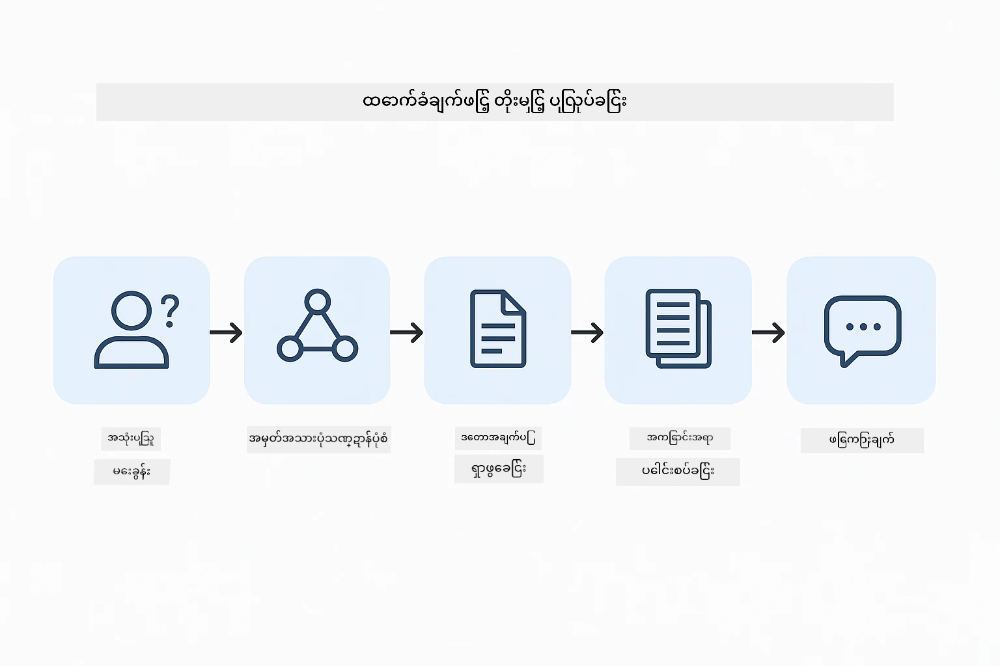
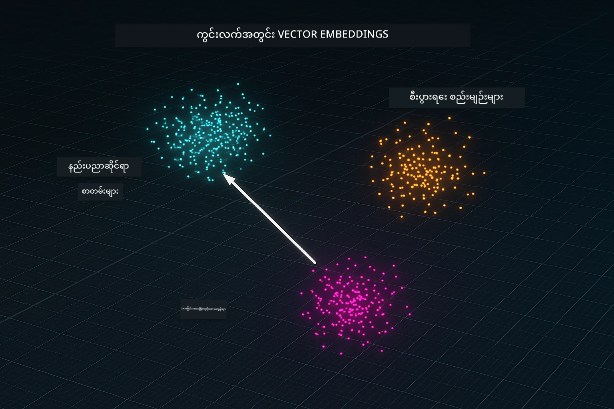
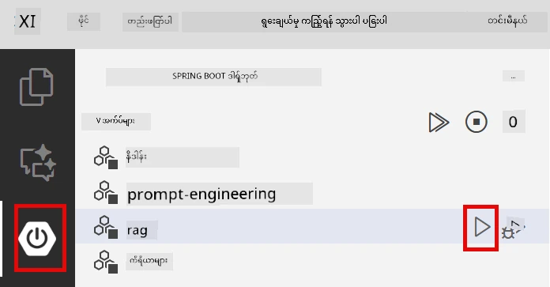
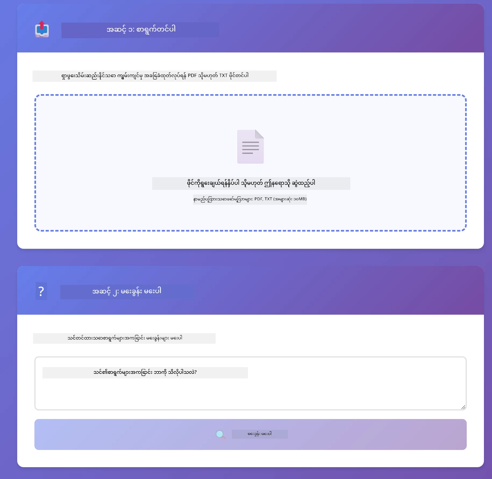
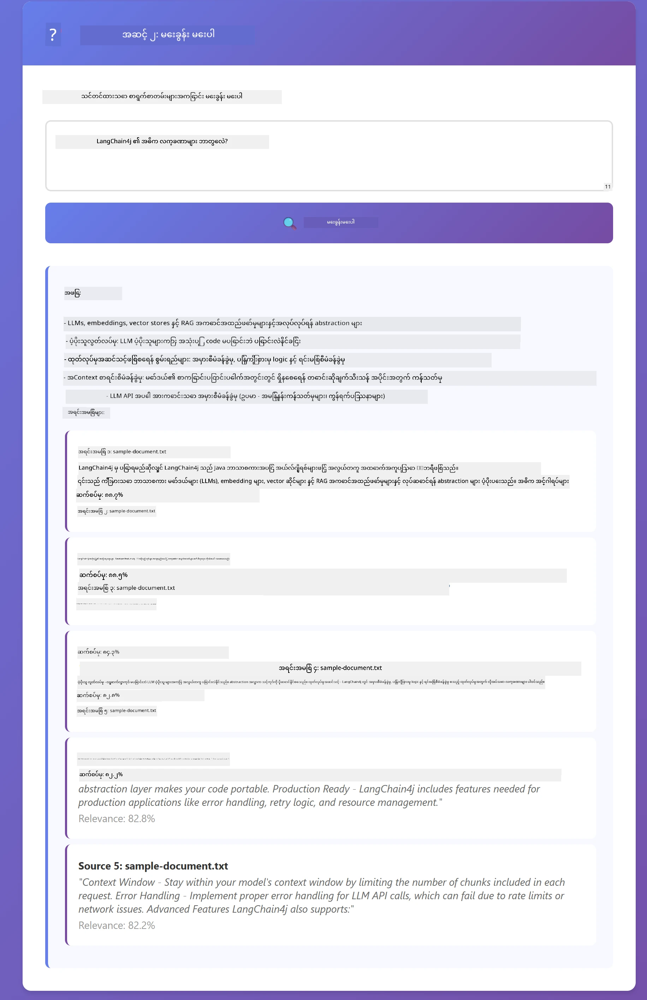

# Module 03: RAG (အချက်အလက် ရှာဖွေထောက်ပံ့မှုနှင့် ထုတ်ပေးမှု)

## အညွှန်းစာရင်း

- [ဗီဒီယို လမ်းညွှန်](#ဗီဒီယို-လမ်းညွှန်)
- [သင်တတ်မယ့်အရာများ](#သင်တတ်မယ့်အရာများ)
- [လိုအပ်ချက်များ](#လိုအပ်ချက်များ)
- [RAG ကို နားလည်ခြင်း](#rag-ကို-နားလည်ခြင်း)
  - [ဒီ သင်ခန်းစာမှာ ဘယ် RAG နည်းလမ်းကို အသုံးပြုသလဲ?](#ဒီ-သင်ခန်းစာမှာ-ဘယ်-rag-နည်းလမ်းကို-အသုံးပြုသလဲ)
- [မည်သို့ လုပ်ဆောင်သနည်း](#မည်သို့-လုပ်ဆောင်သနည်း)
  - [စာရွက်စာတမ်း ပြုလုပ်ခြင်း](#စာရွက်စာတမ်း-ပြုလုပ်ခြင်း)
  - [Embedding များ ဖန်တီးခြင်း](#embedding-များ-ဖန်တီးခြင်း)
  - [Semantic ရှာဖွေမှု](#semantic-ရှာဖွေမှု)
  - [အဖြေ ဖန်တီးခြင်း](#ဖြေဆိုမှု-ထုတ်လုပ်ခြင်း)
- [အပလီကေးရှင်း လည်ပတ်စေတယ်](#application-ကို-chạy-လုပ်ခြင်း)
- [အပလီကေးရှင်းကို အသုံးပြုခြင်း](#application-အသုံးပြုမှု)
  - [စာရွက်စာတမ်း တင်ခြင်း](#စာရွက်စာတမ်း-တင်ခြင်း)
  - [မေးခွန်း မေးခြင်း](#မေးခွန်း-မေးခြင်း)
  - [အရင်းအမြစ် ရည်ညွှန်းချက်များ စစ်ဆေးခြင်း](#အရင်းအမြစ်ကို-စစ်ဆေးခြင်း)
  - [မေးခွန်းများဖြင့် စမ်းသပ်ခြင်း](#မေးခွန်း-အမျိုးမျိုးဖြင့်-စမ်းသပ်ရန်)
- [အဓိက သိကောင်းစရာများ](#အဓိက-အတွေးအခေါ်များ)
  - [Chunking မဟာဗျူဟာ](#chunking-strategy)
  - [ဆင်တူမှု အဆင့်များ](#similarity-scores)
  - [အမှတ်ဉာဏ် သိုလှောင်မှု](#in-memory-storage)
  - [Context Window စီမံခန့်ခွဲမှု](#context-window-management)
- [RAG လိုအပ်တဲ့အချိန်](#rag-ကို-ဘယ်ကို-အသုံးပြုသင့်သလဲ)
- [နောက်တစ်ဆင့်များ](#နောက်တစ်ဆင့်များ)

## ဗီဒီယို လမ်းညွှန်

ဒီ module နှင့် စတင်မည့်နည်းလမ်းကို ရှင်းပြသည့် အသက်သွင်းတိုက်ရိုက်ပွဲကို ကြည့်ရှုပါ။

<a href="https://www.youtube.com/watch?v=_olq75ZH_eY"></a>

## သင်တတ်မယ့်အရာများ

ယခင်ပုံစံ modules များတွင် AI နှင့် စကားဝိုင်းပြုလုပ်နိုင်ခြင်းနှင့် prompt များကို အကျိုးသက်ရောက်စွာ ဖွဲ့စည်းပုံကို သင်ယူခဲ့ပါသည်။ သို့သော် ရှိသော အခြေခံကန့်သတ်ချက်တစ်ခုမှာဘာဆိုသော်၊ ဘာသာစကား မော်ဒယ်များသည် မိမိများ သင်ကြားခဲ့သော ဒေတာတွင်သာ သိရှိပြီးဖြစ်သဖြင့်၊ လူမှုကုမ္ပဏီလိုင်စင် မူဝါဒများ၊ စီမံကိန်း စာရွက်စာတမ်းများ သို့မဟုတ် မသင်ကြားခဲ့သည့် အချက်အလက်များအပေါ်မေးခွန်းများကို ဖြေဆိုနိုင်ခြင်းမရှိပါ။

RAG (Retrieval-Augmented Generation) သည် ဒီ ပြဿနာကို ဖြေရှင်းပေးသည်။ မော်ဒယ်ကို သင်ယူစေမည်မဟုတ်ဘဲ (ဈေးကြီးပြီး လက်တွေ့မဖြစ်နိုင်), မော်ဒယ်တွင် စာရွက်စာတမ်းများကို ရှာဖွေစစ်ဆေးနိုင်စေရန် စွမ်းရည် ပေးသည်။ မေးခွန်းတစ်ခု မေးလျှင် စနစ်သည် သက်ဆိုင်ရာ အချက်အလက်ကို ရှာဖွေပြီး prompt တွင် ထည့်သွင်းပေးသည်။ ထိုနောက် မော်ဒယ်သည် ထိုရရှိလာသော context အပေါ်မူတည်ကာ အဖြေထုတ်ပေးသည်။

RAG ကို မော်ဒယ်တစ်ခုအတွက် အညွန်းစာကြောင်းစာကြည့်တိုက်ပေးခြင်းဟု ယူဆပါ။ မေးခွန်းမေးသောအားဖြင့် စနစ်သည်-

1. **အသုံးပြုသူ မေးခွန်း** - မေးခွန်း မေးသည်
2. **Embedding** - မေးခွန်းကို vector အဖြစ် ပြောင်းလဲသည်
3. **Vector ရှာဖွေမှု** - ဆင်တူသော စာရွက်စာတမ်း parçသာအပိုင်းများ ရှာသည်
4. **Context စုစည်းခြင်း** - သက်ဆိုင်ရာ paragraph များကို prompt ထဲထည့်သည်
5. **အဖြေ** - LLM သည် context ကို အခြေခံကာ အဖြေထုတ်ပေးသည်

ဤကဲ့သို့ မော်ဒယ်အဖြေများကို သင်၏ အချက်အလက်နှင့် အတည်ပြုခြင်းဖြင့် အတူတကွ ဆောင်ရွက်သည်။

## လိုအပ်ချက်များ

- [Module 01 - နိဒါန်း](../01-introduction/README.md) (Azure OpenAI အရင်းအမြစ်များ တပ်ဆင်ပြီး၊ `text-embedding-3-small` embedding မော်ဒယ်ပါဝင်သည်) ပြီးစီးထားခြင်း
- မူလ ဒါအို(ဒိုင်ရက်ထရီ)တွင် `.env` ဖိုင်ရှိပြီး Azure အတည်ပြုချက်များပါရှိခြင်း (`azd up` ကိရိယာဖြင့် Module 01 မှ တည်ဆောက်)

> **မှတ်ချက်:** Module 01 မပြီးစီးသေးလျှင် ပထမဆုံးမှာ ထို၃ယ်ပါလုပ်ဆောင်မှုများကို လိုက်နာပါ။ `azd up` ကိရိယာသည် GPT စကားဝိုင်းမော်ဒယ်နှင့် embedding မော်ဒယ် နှစ်ခုလုံးကို တပ်ဆင်ပေးသည်။

## RAG ကို နားလည်ခြင်း

အောက်ဖော်ပြထားသည့် ပုံသည် အဓိကအယူအဆကို ပြသည်။ မော်ဒယ်၏ သင်ကြားမှုဒေတာအပေါ် အခြေခံခြင်းမဟုတ်ဘဲ၊ RAG သည် သင်၏ စာရွက်စာတမ်းများ အညွန်းစာကြောင်းစာကြည့်တိုက်အဖြစ် ထည့်သွင်းပေးကာ မေးခွန်းများကို ဖြေဆိုရာ မတိုင်မီ စာရွက်စာတမ်းများနှင့် ဆက်သွယ်စေလိမ့်မည်။


*ဒီပုံတွင် ပုံမှန် LLM (သင်ကြားမှုဒေတာမှ အတုယူသည့်) နှင့် RAG ပါဝင်သော LLM (စာရွက်စာတမ်းများကို အရင်ကြည့်ရှုသည့်) မတူညီခြင်းကို ပြသသည်။*

user မေးခွန်းသည် ရှင်းလင်းမှုပြုခြင်း၊ vector search, context စုစည်းခြင်း နှင့် အဖြေဖန်တီးခြင်း ဆိုသည့် လေးဆင့်ဖြတ်သည့် ရွေ့လျားမှုဖြစ်သည်-



*ဤပုံတွင် RAG pipeline လုံးလုံးကို ပြသသည် - user မေးထားသော query သည် embedding, vector search, context စုစည်းခြင်း နှင့် အဖြေဖန်တီးခြင်း ဖြတ်သန်းသည်။*

ဤ module မှာ တစ်ဆင့်ချင်းစီကို အောက်တွင် ရေးသားထားသော ကုဒ်နှင့် အကြောင်းအရာအတတ်နိုင်စွမ်းရှိသည်။

### ဒီ သင်ခန်းစာမှာ ဘယ် RAG နည်းလမ်းကို အသုံးပြုသလဲ?

LangChain4j သည် RAG ကို သုံးမျိုးဖြင့် ကျင်းပနိုင်သည်၊ abstraction အခြေအနည်းအနှစ်တစ်ခုစီရှိသည်။ အောက်တွင် ဝှေ့ထားသော ပုံများသည် တစ်ချောင်းချောင်း အချိုးစပ်ထားသည်-


*ဤပုံတွင် LangChain4j ၏ RAG နည်းလမ်း သုံးမျိုး Easy, Native, Advanced တို့ကို တူညီဘက်တွင် နှိုင်းယှဉ် ပြထားသည်။*

| နည်းလမ်း | အလုပ်လုပ်ပုံ | အကောက်ချမှု |
|---|---|---|
| **Easy RAG** | `AiServices` နှင့် `ContentRetriever` မှ တစ်ဆင့် အလိုအလျောက် လုပ်ဆောင်သည်။ သင် facet ကို အကြောင်းအရာကောင်းစွာ တပ်ဆင်ပြီး LangChain4j မှ embedding, ရှာဖွေရေး နှင့် prompt စုစည်းမှုကို စီမံပေးသည်။ | ကုဒ်အနည်းငယ်, သို့သော် တစ်ဆင့်ချင်း ဘာဖြစ်နေသည်ကို မမြင်ရ။ |
| **Native RAG** | မေးခွန်းEmbedding ကို ခေါ်၊ data store ကို ရှာဖွေ၍ prompt ကို တည်ဆောက်ပြီး အဖြေထုတ်။ တစ်ဆင့်ချင်း တိကျစွာ စီမံနိုင်သည်။ | ပိုမိုကုဒ် သို့သော် အဆင့်တိုင်း ကို မျှော်မှန်းခြင်းနှင့် ပြင်ဆင်နိုင်မှုရှိသည်။ |
| **Advanced RAG** | `RetrievalAugmentor` framework ကို အသုံးပြု၍ query transformer, router, re-ranker, injectors များ ထည့်သွင်းရန် အသုံးပြု၍ ပစ္စည်းထုတ်လုပ်မှုအဆင့် pipeline များထောက်ပံ့သည်။ | အများဆုံး လွတ်လပ်မှု, သို့သော် အဆင့်မြင့် နှင့် ကုန်ကျစရိတ်ကြီး။ |

**ဤ သင်ခန်းစာတွင် Native နည်းလမ်းကို အသုံးပြုသည်။** RAG pipeline ၏ တစ်ဆင့်ချင်း - query hine embedding, vector store ရှာဖွေမှု, context စုစည်းခြင်း၊ နှင့် အဖြေဖန်တီးမှု ကို [`RagService.java`](../../../03-rag/src/main/java/com/example/langchain4j/rag/service/RagService.java) မှာ တိကျထုတ်ဖော်ထားသည်။ သင်ယူမှုအရ အဆင့်တိုင်းကို သိရှိနားလည်ရန် အရည်အသွေးထိန်းကြီးမှုအတွက် ဆိုးရွားမှုရှိသော ကုဒ် များကို မျှော်မျှော် တင်ပြထားခြင်း ဖြစ်သည်။ မိတ်ဆွေဆikwတတ်လာပါက Easy RAG သို့မဟုတ် Advanced RAG သို့ တိုးတက်ပြောင်းလဲစေရန် အဆင့်ရောက်မြောက်နိုင်ပါသည်။

> **💡 Easy RAG စိတ်ဝင်စားပါသလား?** LangChain4j သည် `AiServices` နှင့် `ContentRetriever` ဖြင့် embedding, ရှာဖွေမှု၊ prompt စုစည်းမှုအား အလိုအလျောက် စီမံပေးသည့် *Easy RAG* ကိုလည်း ပံ့ပိုးပေးသည်။ ဤ module တွင် ပိုမိုတိကျဖော်ပြပြီး user အနေဖြင့် တစ်ဆင့်ချင်းကို ထိန်းချုပ်နိုင်ရန် အတွက် မျက်နှာဖုံး ဖွင့်ထားသည်။

အောက်တွင် Easy RAG pipeline ကို ပြထားသည်။ `AiServices` နှင့် `EmbeddingStoreContentRetriever` が ကိစ္စရပ်အားလုံးကို ဖုံးကွယ်ထားပြီး၊ စာရွက်စာတမ်း တင်ပြီး retriever နဲ့ ချိတ်ဆက်ပြီး အဖြေများ ရပါတယ်။ ဒီ module မှ Native ကုဒ်သည် လျှို့ဝှက်ထားသော အဆင့်များအားလုံး ဖြုတ်ထားသည်။


*ဒီပုံသည် Easy RAG pipeline ကို ပြသည်။ Native နည်းလမ်းနှင့် နှိုင်းယှဉ်ပါ။ Easy RAG သည် `AiServices` နှင့် `ContentRetriever` က အမှတ်တံဆိပ်အတိုင်း embedding, ရှာဖွေရေး နှင့် prompt စုစည်းမှုအနောက်ခံလုပ်ငန်းစဉ်များကို ဖုံးကွယ်ထားသည်။ Native နည်းလမ်းသည် တစ်ဆင့်ချင်း - embedding, ရှာဖွေမှု, context စုစည်းမှုနှင့် generator ခေါ်ဆိုမှုများအား user ကိုယ်တိုင် ထိန်းချုပ်၍ မြင်သာရန် လမ်းဖြင့် ဖော်ပြထားသည်။*

## မည်သို့ လုပ်ဆောင်သနည်း

ဒီ module ၏ RAG pipeline သည် user မေးခွန်းတိုင်း ဖြည့်ဆည်းရာ အဆင့်လေးဆင့်စီစဉ်ကာ လည်ပတ်သည်။ ပထမဦးဆုံးမှာ တင်ထားသော စာရွက်စာတမ်းကို **ဖော်ထုတ်နှင့် ခွဲခြမ်း** လုပ်သည်။ ထို့နောက် chunk များကို **vector embedding** ပြုလုပ်၍ သိပ္ပံဖြင့် နှိုင်းယှဥ်နိုင်သော အနေအထားတွင် သိုလှောင်သည်။ မေးခွန်းရောက်လာသည့်အခါ သက်ဆိုင်ရာ chunks ကို ရှာဖွေရေးလုပ်၍ LLM သို့ context အဖြစ် ပေးပို့ကာ **အဖြေဖန်တီးမှု** ပြုလုပ်သည်။ အောက်တွင် အဆင့်တိုင်းအား ကုဒ်နမူနာနှင့်ပုံများဖြင့် လမ်းပြထားသည်။ ပထမအဆင့်ကို ကြည့်ကြရအောင်။

### စာရွက်စာတမ်း ပြုလုပ်ခြင်း

[DocumentService.java](../../../03-rag/src/main/java/com/example/langchain4j/rag/service/DocumentService.java)

စာရွက်စာတမ်းတင်လျှင် စနစ်သည် အဆိုပါစာရွက်စာတမ်း (PDF သို့မဟုတ် ပုံမှန်စာသား) ကို ဖော်ထုတ်ပြီး ဖိုင်နာမည်ကဲ့သို့ မီတာဒေတာတွေနဲ့ချိတ်ဆက်သည်။ ထို့နောက် ရိုးရှင်းသည့် chunks အဖြစ် ခွဲထုတ်သည် - မော်ဒယ်၏ context window ထဲသို့ ကောင်းမွန်စွာ ထည့်သွင်းနိုင်ရန် အတိုအပိုင်းများဖြစ်သည်။ ဤ chunks များသည် နယ်နိမိတ်များတွင် context ပျောက်ဆုံးခြင်း မရှိစေရေးအတွက် အနည်းငယ်ထပ်တိုးခြင်းရှိသည်။

```java
// တင်သွင်းထားသောဖိုင်ကိုပေါင်းထည့်ပြီး LangChain4j Document ထဲတွင်ထုပ်ပိုးပါ
Document document = Document.from(content, metadata);

// ၃၀ တိုးကင် Token ဖြင့် 겹치는 ၃၀၀ Token အပိုင်းများသို့ခွဲခြားပါ
DocumentSplitter splitter = DocumentSplitters
    .recursive(300, 30);

List<TextSegment> segments = splitter.split(document);
```

အောက်ဖော်ပြပါ diagram သည် အကြောင်းအရာကို ထင်ဟပ်ဖော်ပြသည်။ chunks တစ်ခုချင်းစီတွင် သူ၏ အနီးအနား chunks များနှင့် 30 token လောက် တစ်ချိန်တည်းဖြစ်နေသည်၊ ၎င်းဖြင့် မညီညာသော context အပိုင်းများမှ လုံးလုံးလျက်နေခြင်း မရှိပါ။


*ဒီပုံသည် စာရွက်စာတမ်းကို 300-token chunk များသို့ ခွဲခြမ်းပြီး 30-token overlap ရှိ၍ chunk နယ်နိမိတ်တွင် context ပျောက်ဆုံးမှု မဖြစ်စေရန် ပြထားသည်။*

> **🤖 GitHub Copilot Chat ဖြင့် စမ်းကြည့်ပါ:** [`DocumentService.java`](../../../03-rag/src/main/java/com/example/langchain4j/rag/service/DocumentService.java) ဖိုင်ကို ဖွင့်ပြီး မေးပါ။
> - "LangChain4j သည် စာရွက်စာတမ်းများကို ဘာကြောင့် နှင့် မည်သို့ ခွဲထုတ်သနည်း?"
> - "စာရွက်စာတမ်း အမျိုးအစား များအတွက် အကောင်းဆုံး chunk အရွယ်အစား ဘာဖြစ်သနည်း?"
> - "ဘာသာစကားစုံ သို့မဟုတ် အထူး formatting ပါသော စာရွက်များကို မည်သို့ ကိုင်တွယ်မလဲ?"

### Embedding များ ဖန်တီးခြင်း

[LangChainRagConfig.java](../../../03-rag/src/main/java/com/example/langchain4j/rag/config/LangChainRagConfig.java)

chunk တစ်ခုချင်းစီကို embedding ဆို၍ နံပါတ်ပြောင်းစနစ်အဖြစ် ပြောင်းလဲသည် - အဓိပ္ပါယ်နေရာမှ နံပါတ်ရပ်တည်ရာနေရာသို့ ကိုယ်စားပြုသည်။ embedding မော်ဒယ်သည် chat မော်ဒယ်ကဲ့သို့ ပညာရည်မဟုတ်ပေမယ့်၊ စကားလုံးများကို နီးစပ်မိသော နံပါတ် vector များအဖြစ် လွှဲပြောင်းသည်။ ဥပမာ -"ကား" ဟုဆိုလျှင် "ကားမောင်းယာဉ်" နီးကျယ်ရာနေရာတွင်၊ "ပြန်အမ်းမူဝါဒ" ဟုဆိုလျှင် "ငွေပြန်ပေးသွင်းပါ" နှင့် နီးစပ်သောနေရာတွင် ထားရှိသည်။ Chat model သည် လူတစ်ယောက်နှင့် စကားပြောသည့်သူဖြစ်ပြီး embedding မော်ဒယ်သည် အကြောင်းပြန်တင်ခြင်းစနစ်တစ်ခုတည်းဖြစ်သည်။

အောက်ဖော်ပြပါပုံသည် ဤအယူအဆကို ပြသည် - စာသားဝင်ပြီးနောက် နံပါတ် vector များထွက်သည်၊ ဆင်တူသော အဓိပ္ပါယ်မှတ်ဉာဏ်များသည် vector လယ်ဒေသတွင် နီးကပ်စွာ တည်ရှိသည်။


*ပုံသည် embedding မော်ဒယ်သည် စာသားကို နံပါတ် vector များသို့ ပြောင်းလဲပေးကာ ဆင်တူသော အဓိပ္ပါယ်များမှ နီးစပ်သော vector များကို တည်ဆောက်ပေးသည်။*

```java
@Bean
public EmbeddingModel embeddingModel() {
    return OpenAiOfficialEmbeddingModel.builder()
        .baseUrl(azureOpenAiEndpoint)
        .apiKey(azureOpenAiKey)
        .modelName(azureEmbeddingDeploymentName)
        .build();
}

EmbeddingStore<TextSegment> embeddingStore = 
    new InMemoryEmbeddingStore<>();
```

အောက်တွင် RAG pipeline နှစ်ခုဖြတ်သန်းမှုနှင့် LangChain4j class များကို ပြထားသည်။ ingestion flow မှာ စာရွက်စာတမ်းကို ခွဲထုတ်ပြီး chunk များကို embedded နှစ်ပြောင်းကာ `.addAll()` ဖြင့် သိမ်းဆည်း ထားသည်။ query flow မှာ မေးခွန်းကို embedded ပြုလုပ်ကာ `.search()` ဖြင့် ရှာဖွေပြီး ရလဒ်ကို chat model သို့ ပေးပို့သည်။ နှစ် flow ၏ အချက်မှာ ကိုယ်ပိုင် `EmbeddingStore<TextSegment>` အင်တာဖေ့စ်ကို သုံးသည်။


*ဤပုံသည် RAG pipeline ၏ ingestion နှင့် query flow များကို ပြ၍ အတူတူ သုံးသော EmbeddingStore ဖြင့် ဆက်သွယ်ကြောင်း ဖြတ်ပြသည်။*

embedding များ သိမ်းထားပြီးနောက် ဆင်တူသော အကြောင်းအရာများသည် vector နီးစပ်သော နေရာများတွင် cluster ဖြစ်တည်လာသည်။ အောက်ဖော်ပြထားသည့် ပုံက စာရွက်စာတမ်းများသည် ဆက်နွယ်မှုရှိသော ခေါင်းစဉ်ကဏ္ဍများဖြင့် နီးစပ်သော နေရာများတွင် အစုတစ်စုအဖြစ် သတ်မှတ်ကြောင်း ပြသည်။ ၎င်းသည် semantic ရှာဖွေမှုလုပ်ဆောင်နိုင်စေသည်။



*ပုံတွင် ဆက်စပ်နယ်ပယ်များရှိ စာရွက်စာတမ်းများသည် 3D vector နေရာတွင် အစုတစ်စုအဖြစ် တည်ရှိကြောင်း ပြသည်။ ဥပမာ- နည်းပညာစာရွက်များ၊ စီးပွားရေးစည်းမျဉ်းများနှင့် မေးခွန်းများအဖြေများစသည်ဖြင့် ကွဲပြားခြားနားသည်။*

user မေးခွန်း ရောက်ရှိသည်နှင့် စနစ်သည် အောက်ပါ လေးဆင့် နည်းလမ်းဖြင့် လမ်းလျှောက်သည် - စာရွက်စာတမ်းများကို တစ်ကြိမ် embedding လုပ်၊ မေးခွန်းကို ရှာဖွေရာ embedded လုပ်ခြင်း၊ cosine similarity ဖြင့် မေးခွန်း vector ကို သိမ်းဆည်း vector များနှင့် နှိုင်းယှဥ်၊ အကောင်းဆုံး chunks များကို ပြန်လည်ထုတ်ပေးခြင်း။ အောက်ပါ ပုံသည် အဆင့်တိုင်းနှင့် လုပ်ဆောင်ချက်များကို ဖော်ပြထားသည်။


*ဤပုံသည် embedding ရှာဖွေမှု လုပ်ငန်းစဉ် လေးဆင့် ဖော်ပြထားသည် - စာရွက်စာတမ်း embedding, မေးခွန်း embedding, vectors ကို cosine similarity နဲ့ နှိုင်းယှဥ်ခြင်း၊ ထိပ်ဆုံး ရလဒ်များ ထုတ်ပေးခြင်း။*

### Semantic ရှာဖွေမှု

[RagService.java](../../../03-rag/src/main/java/com/example/langchain4j/rag/service/RagService.java)

မေးခွန်းမေးလျှင် မေးခွန်းကို embedding ပြုလုပ်သည်။ စနစ်သည် မေးခွန်း embedding ကို စာရွက်စာတမ်း chunks embedding များနှင့် နှိုင်းယှဥ်သည်။ keyword ကိုသာ မဟုတ်၊ အဓိပ္ပါယ် ဆိုင်ရာ ဆင်တူမှုအပေါ် အခြေခံပြီး အလွန်နီးကပ်သော chunks များ ရှာဖွေသည်။

```java
Embedding queryEmbedding = embeddingModel.embed(question).content();

EmbeddingSearchRequest searchRequest = EmbeddingSearchRequest.builder()
    .queryEmbedding(queryEmbedding)
    .maxResults(5)
    .minScore(0.5)
    .build();

EmbeddingSearchResult<TextSegment> searchResult = embeddingStore.search(searchRequest);
List<EmbeddingMatch<TextSegment>> matches = searchResult.matches();

for (EmbeddingMatch<TextSegment> match : matches) {
    String relevantText = match.embedded().text();
    double score = match.score();
}
```

အောက်ဖော်ပြပါ ပုံသည် semantic ရှာဖွေမှုနှင့် ရိုးရာ keyword ရှာဖွေမှုများကို နှိုင်းယှဥ်ထားသည်။ "vehicle" ဆို keyword ရှာဖွေမှုပုံစံသည် "cars and trucks" ပါသော chunk ကို မတိုက်ဆိုင်နိုင်သော်လည်း semantic search အနေနဲ့ ၎င်း၏ အဓိပ္ပါယ်ကို နားလည်၍ ထို chunk ကို အမြင့်ဆုံး အဆင့် တင်ပေးသည်။


*ဤပုံက keyword ရှာဖွေမှုနှင့် semantic ရှာဖွေမှုကို နှိုင်းယှဉ်ပြထားသည်။ semantic ရှာဖွေမှုက အဓိပ္ပါယ်အလိုက် ဆင်တူသော အကြောင်းအရာများကို မှီငြမ်းပြီး keyword မတူခဲ့လည်း ရလဒ်ပေးသည်။*

နောက်ကြောင်းအဖြစ် similarity ကို cosine similarity ဖြင့် တိုင်းတာသည်။ ၎င်းမှာ "ဤ နှစ်ခု မြှားများသည် အတူတည်နေရာ ဆန့်ကျင်ဘက်သို့ မညီနေပါက?" ဟူသော မေးခွန်းမေးခြင်းအတှင်းဖြစ်ပြီး တစ်ခုချင်းစီ ထုံးစံအသုံးအနှုန်း မတူ၍ပါက vector များသည် တူညီသော ဦးတည်ချက်အား ထောက်လှမ်း၍ 1.0 အနီးဆုံး အဆင့်တန်ဖိုး ရရှိသည်။


*ဒီပုံပြင်ကတော့ cosine similarity ကို embedding vectors တွေရဲ့ ငယ်မှု အနားအနီးအဖြစ် ဖော်ပြထားပါတယ် — ပိုတူညီတဲ့ vectors တွေဟာ 1.0 နီးပါးရောက်ပြီး semantic similarity မြင့်မားကြောင်း ပြသပါတယ်။*

> **🤖 [GitHub Copilot](https://github.com/features/copilot) Chat နဲ့ စမ်းသပ်ကြည့်ပါ:** [`RagService.java`](../../../03-rag/src/main/java/com/example/langchain4j/rag/service/RagService.java) ဖိုင်ကိုဖွင့်ပြီးမေးမြန်းပါ -
> - "embedding တွေနဲ့ similarity search ဘယ်လိုအလုပ်လုပ်ပြီး score ကို ဘာတွေဆုံးဖြတ်သလဲ?"
> - "Similarity threshold ဘယ်လိုသတ်မှတ်ရမလဲ၊ ရလဒ်တွေကို ဘယ်လိုသက်ရောက်သလဲ?"
> - "သက်ဆိုင်ရာစာရွက်စာတမ်းတွေမတွေ့ရင် ဘာလုပ်ဆောင်ရမလဲ?"

### ဖြေဆိုမှု ထုတ်လုပ်ခြင်း

[RagService.java](../../../03-rag/src/main/java/com/example/langchain4j/rag/service/RagService.java)

အဆင့်မြင့်ဆုံး သက်ဆိုင်ရာchunks များကို explicit အညွှန်းများ၊ ရယူထားသော context နှင့် အသုံးပြုသူ၏မေးခွန်းတို့ ပါဝင်သော စနစ်တကျ prompt တစ်ခုအဖြစ်စုစည်းသည်။ မော်ဒယ်သည် အဆိုပါ chunks များကိုဖတ်ပြီး အချက်အလက်အပေါ်အခြေခံ၍ဖြေဆိုသည် — မော်ဒယ်သည် မျက်နှာချင်းဆိုင်ရှိသည့် အချက်အလက်များကိုသာအသုံးပြုနိုင်ခြင်းကြောင့် မဟုတ်မှားခြင်းကို တားဆီးပေးသည်။

```java
String context = matches.stream()
    .map(match -> match.embedded().text())
    .collect(Collectors.joining("\n\n"));

String prompt = String.format("""
    Answer the question based on the following context.
    If the answer cannot be found in the context, say so.

    Context:
    %s

    Question: %s

    Answer:""", context, request.question());

String answer = chatModel.chat(prompt);
```

အောက်ပါပုံကတော့ဤစုစည်းမှုကို ပြသထားပြီး — ရှာဖွေမှုအဆင့်မှ အကောင်းဆုံး score ရရှိသော chunks များကို prompt အစီအစဉ်ထဲ ထည့်သွင်းပြီး `OpenAiOfficialChatModel` က အခြေခံထားသောဖြေဆိုချက်တစ်ခု ထုတ်ပေးသည်။


*ဒီပုံရိပ်ကတော့ အကောင်းဆုံး score ရရှိသော chunks များကို စနစ်တကျ prompt မှာ စုစည်းပေးခြင်းအားဖြင့် မော်ဒယ်မှ သင့်ဒေတာမှ အခြေခံသောဖြေဆိုချက် ထုတ်ပေးပုံကို ပြထားသည်။*

## Application ကို chạy လုပ်ခြင်း

**စတင်အသုံးပြုနိုင်မှု စစ်ဆေးမှု:**

Module 01 မှာပြုလုပ်ထားတဲ့ Azure ခံစားခွင့်အချက်အလက်ဖြင့် `.env` ဖိုင် ရှိ/မရှိ စစ်ဆေးပါ။ ဒီ module directory (`03-rag/`) မှာ အောက်ပါအတိုင်း chạy လုပ်ပါ။

**Bash:**
```bash
cat ../.env  # AZURE_OPENAI_ENDPOINT, API_KEY, DEPLOYMENT ကိုပြသသင့်သည်
```

**PowerShell:**
```powershell
Get-Content ..\.env  # AZURE_OPENAI_ENDPOINT, API_KEY, DEPLOYMENT ဖေါ်ပြသင့်သည်။
```

**Application စတင်ခြင်း:**

> **မှတ်ချက်:** အကယ်၍ root directory မှ `./start-all.sh` ကို အသုံးပြုပြီး application များအားလုံးအား စတင်ခဲ့ပြီးဖြစ်ပါက (Module 01 မှ ဖေါ်ပြထားသည့်အတိုင်း) ဒီ module ဟာ အခု port 8081 မှာ ရပ်တည်ပြီးဖြစ်ပါတယ်။ အောက်ပါ စတင်ရေးမေးခွန်းများကို ချန်ထားနိုင်ပြီး တိုက်ရိုက် http://localhost:8081 ကို သွားနိုင်ပါသည်။

**နည်းလမ်း 1: Spring Boot Dashboard ကို အသုံးပြုခြင်း (VS Code အသုံးပြုသူများအတွက် အကြံပြုချက်)**

Dev container တွင် Spring Boot Dashboard extension ပါဝင်ပြီး၊ အဲဒီနေရာမှ Spring Boot applications များကို ရှုမြင်၊ စီမံခန့်ခွဲနိုင်ပါသည်။ VS Code ၏ ဘယ်ဘက် Activity Bar ထဲမှာ Spring Boot အိုင်ကွန်ကို တွေ့ရပါမည်။

Spring Boot Dashboard မှာ လုပ်နိုင်တာများ -
- Workspace ထဲရှိ Spring Boot applications အားလုံးကို ကြည့်ရှုနိုင်ခြင်း
- Application များကို တစ်ချက်နှိပ်ပြီး စတင်/ရပ်နားနိုင်ခြင်း
- Application အမှတ်တရများကို Real-time တွင် ကြည့်ရှုနိုင်ခြင်း
- Application အခြေအနေ ကို မျက်မြင် စောင့်ကြည့်နိုင်ခြင်း

"rag" အနားရှိ play button ကို နှိပ်၍ ဒီ module ကို စတင်ပါ၊ ဒါမှမဟုတ် module အားလုံးကို တပြိုင်နက် စတင်နိုင်သည်။



*ဒီ screenshot က VS Code မှာ Spring Boot Dashboard ကို ပြထားပြီး application များကို စတင်၊ ရပ်နား နှင့် စောင့်ကြည့်ရန် လွယ်ကူအောင် ပံ့ပိုးနေသည်။*

**နည်းလမ်း ၂: shell script များ အသုံးပြုခြင်း**

ဝက်ဘ် applications အားလုံး (modules 01-04) ကို စတင်ရန်:

**Bash:**
```bash
cd ..  # စနစ်ရဲ့အမြစ်ဖိုင်တွဲမှ
./start-all.sh
```

**PowerShell:**
```powershell
cd ..  # မူရင်းဖိုင်လမ်းကြောင်းမှ
.\start-all.ps1
```

သို့မဟုတ် ဒီ module ကိုသာ စတင်ရန် -

**Bash:**
```bash
cd 03-rag
./start.sh
```

**PowerShell:**
```powershell
cd 03-rag
.\start.ps1
```

အဆိုပါ script ၂ မျိုးစလုံးဟာ root ဖိုင်ထဲ `.env` ဖိုင်မှ ပတ်ဝန်းကျင်မူလအပြောင်းအလဲများကို အလိုအလျောက် ဖတ်ယူပြီး JAR ဖိုင်များ မရှိပါက တည်ဆောက်ပေးပါသည်။

> **မှတ်ချက်:** စတင်မလုပ်မီ module များအားလုံးကို လက်ဖြင့် တည်ဆောက်ချင်လျှင် -
>
> **Bash:**
> ```bash
> cd ..  # Go to root directory
> mvn clean package -DskipTests
> ```

> **PowerShell:**
> ```powershell
> cd ..  # Go to root directory
> mvn clean package -DskipTests
> ```

http://localhost:8081 ကို သင့် browser တွင်ဖွင့်ပါ။

**ရပ်တန့်ရန်:**

**Bash:**
```bash
./stop.sh  # ဤမော်ဂျူးသည်သာ
# သို့မဟုတ်
cd .. && ./stop-all.sh  # မော်ဂျူးအားလုံး
```

**PowerShell:**
```powershell
.\stop.ps1  # ဒီမော်ဂျူးတစ်ခုတည်း
# သို့မဟုတ်
cd ..; .\stop-all.ps1  # မော်ဂျူးအားလုံး
```

## Application အသုံးပြုမှု

Application ကစာရွက်စာတမ်းတင်ခြင်းနဲ့ မေးခွန်းမေးခွင့်ကို ဝက်ဘ် အင်တာဖေ့စ်ပေးသည်။

<a href="images/rag-homepage.png"></a>

*ဒီ screenshot က RAG application အင်တာဖေ့စ်အားပြထားပြီး ကိုယ့်စာရွက်စာတမ်းတင်ပြီး မေးခွန်းမေးနိုင်မှုပေးသည်။*

### စာရွက်စာတမ်း တင်ခြင်း

အစပြုသောအခါ စာရွက်စာတမ်းတင်ပါ - စမ်းသပ်ရန် TXT ဖိုင်များက အသင့်တော်ဆုံး ဖြစ်ပါသည်။ ဒီ directory ထဲမှာ `sample-document.txt` တစ်ခု ပေးထားပြီး LangChain4j ပါဝင်မှု, RAG အကောင်အထည်ဖော်ခြင်းနှင့် အကောင်းဆုံးလေ့လာမှုများ ပါဝင်သည် - စနစ်ကို စမ်းသပ်ရန် သင့်တော်မည်။

စနစ်က သင့်စာရွက်စာတမ်းကို ပြုလုပ်၊ ဖတ်တိုက်တိုက် ခွဲခြားပြီး chunks များဖန်တီး၊ ဖိုင်တစ်ခုစီအတွက် embedding များ ဖန်တီးပေးသည်။ အကြောင်းအရာ upload ဖြစ်ချင်း ကိုယ်တိုင်ဖြစ်ပေါ်သည်။

### မေးခွန်း မေးခြင်း

ယခု စာရွက်စာတမ်းအကြောင်းအရာကို သတ်မှတ်ထားသော မေးခွန်းများ မေးပါ။ စာရွက်စာတမ်းထဲမှာ သက်သေပြထားသော အချက်အလက်တစ်ခုခုကို စမ်းသပ် ကြည့်ပါ။ စနစ်က သက်ဆိုင်ရာ chunks များကို ရှာဖွေပြီး prompt ထဲ ထည့်သွင်း၊ ဖြေဆိုချက်ထုတ်ပေးသည်။

### အရင်းအမြစ်ကို စစ်ဆေးခြင်း

တိုက်ရိုက်ဖြေဆိုချက်တိုင်းမှာ similarity score နဲ့ source references ပါဝင်သည်။ score များ(0 မှ 1 အထိ)ဟာ မေးခွန်းနဲ့ သက်ဆိုင်မှု အတိအကျကို ပြသသည်။ score မြင့်သည်မှာ ပို၍ မေးခွန်းနဲ့ ညီညွတ်သည်ဟု ဆိုလိုသည်။ ဒါက သင့်ရဲ့ ဖြေဆိုချက်ကို အရင်းအမြစ်နှင့် တင်ပြရန် အကူအညီပေးပါသည်။

<a href="images/rag-query-results.png"></a>

*ဒီ screenshot က query ရလဒ်များကို ပြထားပြီး စဖြေပေါ်ပြီးတဲ့ ဖြေချက်၊ source reference နှင့် အချင်းချင်း ညီမှု score များ ပါဝင်သည်။*

### မေးခွန်း အမျိုးမျိုးဖြင့် စမ်းသပ်ရန်

မေးခွန်း အမျိုးအစားများကို ကြိုးစားစမ်းပါ -
- သတ်မှတ်ချက် အချက်အလက်: "အဓိက ခေါင်းစဉ် ဘာလဲ?"
- နှိုင်းယှဉ်ချက်များ: "X နဲ့ Y ရဲ့ ကွာခြားချက်က ဘာလဲ?"
- အကျဉ်းအနှုတ်: "Z အကြောင်း အဓိကအချက်များ အကျဉ်းချုပ်ပါ"

မေးခွန်းနဲ့စာသားအကြောင်းအရာညီညာမှုပေါ်မူတည်ပြီး score များ ဘယ်လို ပြောင်းလဲသလဲ ကြည့်ပါ။

## အဓိက အတွေးအခေါ်များ

### Chunking Strategy

စာရွက်စာတမ်းများကို 300-token အသီးသီးဖြင့် ခွဲထုတ်ပြီး 30 tokens overlap ပါရှိသည်။ ဒီပမာဏဟာ chunks တစ်ခုလျှင် အဓိကအချက်များ ပါဝင်ရန်နှင့် prompt တစ်ခုထဲမှာ chunks များစွာ ထည့်သွင်းနိုင်ရန် ကြားလမ်းတစ်ခုဖြစ်ပါသည်။

### Similarity Scores

ရယူထားသော chunks တစ်ခုချင်းစီမှာ 0 နဲ့ 1 အကြား similarity score ပါဝင်ပြီး မေးခွန်းနဲ့ အနီးကပ်ပမာဏကို ဖော်ပြသည်။ အောက်ပါပုံက score ရှုထောင့်များနှင့် စနစ်၏ ရလဒ်ချင်းစစ်ထုတ်မှုကို ပြပြထားသည်။


*ဒီပုံက score 0 မှ 1 အထိရှိခြင်းကို ပြပြီး အနိမ့်ဆုံး threshold 0.5 က သက်ဆိုင်မဲ့ chunks မဟုတ်တာတွေကို ဖြုတ်ချခြင်းထင်ရှားစေသည်။*

Score များသည် -
- 0.7-1.0: အရမ်းသက်ဆိုင်ပြီး အတိအကျကြောင်း မြင်သာသည်
- 0.5-0.7: သက်ဆိုင်ပြီး ကောင်းမွန်သော context ရှိသည်
- 0.5 အောက်: ဖြုတ်ထုတ်သည်၊ မတူညီခြင်းများ

စနစ်သည် အနိမ့်ဆုံး threshold များကို ကျော်လွန်သော chunks များကို တင်ပြသည့်အတွက် အရည်အသွေးရှိစေသည်။

Embeddings များသည် အဓိပ္ပာယ်တူ cluster များရှိလျှင် ကောင်းစွာ လုပ်ဆောင်ရာမှ ခွဲခြားနိုင်ခြင်းများ ရှိသော်လည်း blind spots လည်းရှိသည်။ အောက်ပါပုံကတော့ ပျက်ကွက်မှုများ လူသုံးများ ပြထားပြီး — chunks များသောကြာ ကြီးလွန်းလျှင် vectors သွင်းမှု မရှင်းလင်း၊ chunks သေးလွန်းရင် context မရှိ၊ မရှင်းလင်းသော ဖြစ်စဉ်များက cluster များသို့ မြှောင်းပြောခြင်း ၊ တိတိကျကျ ပြန်လည်ရှာဖွေခြင်း (ID, part numbers) တွေဟာ embedding နဲ့ မလုပ်နိုင်ကြောင်း ပြသသည်။


*ဒီပုံက embedding ပျက်ကွက်မှုများဖြစ်ပုံများကို ပြထားပြီး — chunks ကြီးတယ်၊ chunks သေးတယ်၊ မရှင်းလင်းသော စကားလုံးများက cluster များသို့ ရည်ညွှန်းသည်၊ ID လိုအတိအကျရှာဖွေမှုမျိုးတွေ မလုပ်ဆောင်နိုင်ကြောင်း ဖော်ပြထားသည်။*

### In-Memory Storage

ဒီ module က အလွယ်တကူ အသုံးပြုနိုင်ရန် in-memory storage ကိုအသုံးပြုသည်။ Application ကို ပြန်စတင်သည်နှင့်တစ်ပြေးညီ၊ upload လုပ်ထားသော စာရွက်စာတမ်းများ သွားဆုံးပါသည်။ ထုတ်လုပ်မှုစနစ်များမှာ Qdrant သို့မဟုတ် Azure AI Search ကဲ့သို့ အမြဲတမ်း vector database များ အသုံးပြုကြသည်။

### Context Window Management

Model တစ်ခုချင်းစီမှာ context window အများဆုံးပမာဏ ရှိသည်။ ကျယ်ပြန့်သော စာရွက်စာတမ်းမှ chunks အားလုံးမထည့်နိုင်ပါ။ စနစ်က သက်ဆိုင်ရာ chunks အများဆုံသာ (default ၅) ကို ရွေးပြီး မိမိအတွက် လိုအပ်သည့် context ကို အတိအကျပေးနိုင်စေရန် စီမံသည်။

## RAG ကို ဘယ်ကို အသုံးပြုသင့်သလဲ

RAG ဟာ အမြဲတမ်း အကောင်းဆုံး နည်းလမ်းမဟုတ်ပါဘူး။ အောက်ပါဆုံးဖြတ်မှု လမ်းညွှန်က RAG က သင့်တော်ခြင်းသို့မဟုတ် ပိုရိုးရှင်းသောနည်းလမ်းများ(ပြောရင် prompt ထဲ content ထည့်ခြင်း များ သို့မဟုတ် မော်ဒယ်၏ထည့်သွင်းထားသော အသိပညာ အားသာချက်များအား အားထားခြင်း) မှန်ကန်မှုအတွက် ကူညီပြုလုပ်ပေးသည်။


*ဒီပုံက RAG သုံးသင့်သောအချိန်နှင့် ရိုးရှင်းသောနည်းလမ်း အသုံးပြုသင့်သောအချိန်ကို ဖော်ပြထားသည်။*

## နောက်တစ်ဆင့်များ

**နောက် Module:** [04-tools - AI Agents with Tools](../04-tools/README.md)

---

**အကွက်ရှေ့သို့ရှေ့ပြေးလှည့်ခြင်း:** [← ယခင်: Module 02 - Prompt Engineering](../02-prompt-engineering/README.md) | [နောက်သို့ပြန်သွားရန်](../README.md) | [ရှေ့တိုးရန်: Module 04 - Tools →](../04-tools/README.md)

---

<!-- CO-OP TRANSLATOR DISCLAIMER START -->
**ပြောကြားချက်**
ဤစာတမ်းကို AI ဘာသာပြန်ဝန်ဆောင်မှု [Co-op Translator](https://github.com/Azure/co-op-translator) အသုံးပြု၍ ဘာသာပြန်ထားပါသည်။ ကျွန်ုပ်တို့သည် တိကျမှန်ကန်မှုအတွက် ကြိုးပမ်းနေသော်လည်း၊ စက်ကိရိယာဘာသာပြန်ခြင်းများတွင် အမှားများ သို့မဟုတ် မှားယွင်းချက်များ ပါဝင်နိုင်ကြောင်း သတိပြုပါရန် လိုအပ်ပါသည်။ မူလစာတမ်းကို မူရင်းဘာသာဖြင့်သာ ယုံကြည်စိတ်ချရသော အချက်အလက်အဖြစ် သတ်မှတ်သင့်သည်။ အရေးကြီးသည့် သတင်းအချက်အလက်များအတွက် ပရော်ဖက်ရှင်နယ် လူသားဘာသာပြန်သူဝန်ဆောင်မှုကို အကြံပြုပါသည်။ ဤဘာသာပြန်ချက်ကို အသုံးပြုခြင်းမှ ဖြစ်ပေါ်လာသော နားလည်မှုကွာခြားမှုများ သို့မဟုတ် မမှန်ကန်သော အသုံးပြုမှုများအတွက် ကျွန်ုပ်တို့ တာဝန်မခံပါ။
<!-- CO-OP TRANSLATOR DISCLAIMER END -->