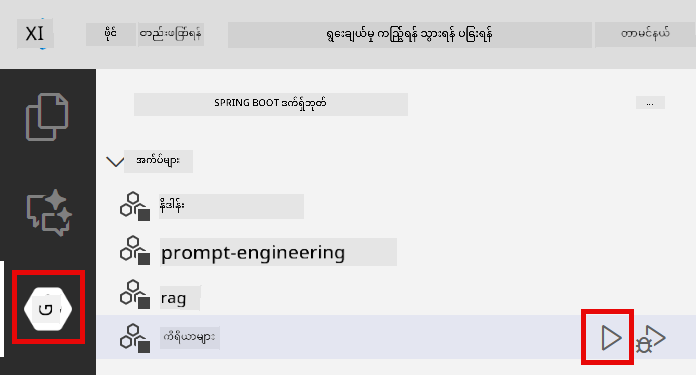
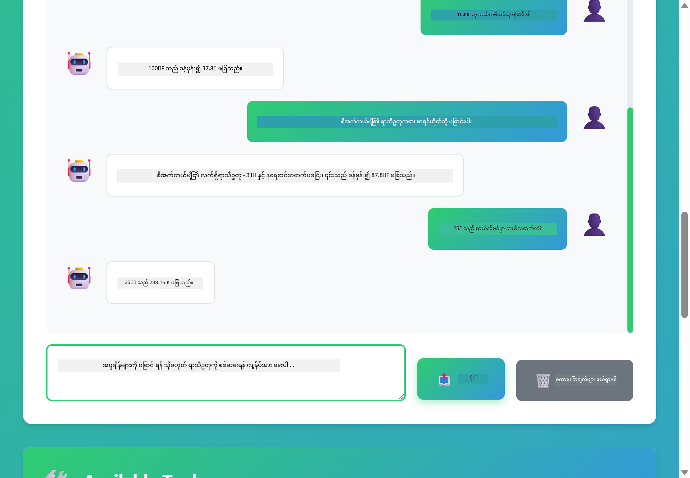

<!--
CO_OP_TRANSLATOR_METADATA:
{
  "original_hash": "aa23f106e7f53270924c9dd39c629004",
  "translation_date": "2025-12-13T19:33:59+00:00",
  "source_file": "04-tools/README.md",
  "language_code": "my"
}
-->
# Module 04: ကိရိယာများပါသော AI ကိုယ်စားလှယ်များ

## အကြောင်းအရာ စာရင်း

- [သင်ယူမည့်အရာများ](../../../04-tools)
- [လိုအပ်ချက်များ](../../../04-tools)
- [ကိရိယာများပါသော AI ကိုယ်စားလှယ်များကို နားလည်ခြင်း](../../../04-tools)
- [ကိရိယာခေါ်ဆိုမှု ဘယ်လို လုပ်ဆောင်သလဲ](../../../04-tools)
  - [ကိရိယာ သတ်မှတ်ချက်များ](../../../04-tools)
  - [ဆုံးဖြတ်ချက် ချခြင်း](../../../04-tools)
  - [အကောင်အထည်ဖော်ခြင်း](../../../04-tools)
  - [တုံ့ပြန်ချက် ဖန်တီးခြင်း](../../../04-tools)
- [ကိရိယာ ချိတ်ဆက်ခြင်း](../../../04-tools)
- [အပလီကေးရှင်းကို စတင် လည်ပတ်ခြင်း](../../../04-tools)
- [အပလီကေးရှင်း အသုံးပြုခြင်း](../../../04-tools)
  - [ရိုးရှင်းသော ကိရိယာ အသုံးပြုမှု စမ်းသပ်ခြင်း](../../../04-tools)
  - [ကိရိယာ ချိတ်ဆက်မှု စမ်းသပ်ခြင်း](../../../04-tools)
  - [စကားပြော ဆက်သွယ်မှု လည်ပတ်မှု ကြည့်ရှုခြင်း](../../../04-tools)
  - [အကြောင်းပြချက် ကြည့်ရှုခြင်း](../../../04-tools)
  - [မတူညီသော တောင်းဆိုမှုများ စမ်းသပ်ခြင်း](../../../04-tools)
- [အဓိက အယူအဆများ](../../../04-tools)
  - [ReAct ပုံစံ (အကြောင်းပြချက်နှင့် လုပ်ဆောင်ခြင်း)](../../../04-tools)
  - [ကိရိယာ ဖော်ပြချက်များ အရေးကြီးသည်](../../../04-tools)
  - [အစည်းအဝေး စီမံခန့်ခွဲမှု](../../../04-tools)
  - [အမှား ကိုင်တွယ်မှု](../../../04-tools)
- [ရရှိနိုင်သော ကိရိယာများ](../../../04-tools)
- [ကိရိယာအခြေပြု ကိုယ်စားလှယ်များကို ဘယ်အချိန် အသုံးပြုမလဲ](../../../04-tools)
- [နောက်တစ်ဆင့်များ](../../../04-tools)

## သင်ယူမည့်အရာများ

ယခုအထိ သင်သည် AI နှင့် စကားပြောနည်း၊ prompt များကို ထိရောက်စွာ ဖွဲ့စည်းနည်းနှင့် သင်၏စာရွက်စာတမ်းများအပေါ် အခြေခံ၍ တုံ့ပြန်ချက်များ ထုတ်ပေးနည်းကို သင်ယူပြီးဖြစ်သည်။ သို့သော် အခြေခံ ကန့်သတ်ချက်တစ်ခု ရှိနေဆဲဖြစ်သည်။ ဘာလို့ဆိုသော် ဘာသာစကား မော်ဒယ်များသည် စာသားသာ ထုတ်ပေးနိုင်ပြီး မိုးလေဝသ စစ်ဆေးခြင်း၊ တွက်ချက်ခြင်း၊ ဒေတာဘေ့စ် မေးမြန်းခြင်း သို့မဟုတ် ပြင်ပ စနစ်များနှင့် ဆက်သွယ်နိုင်ခြင်း မရှိပါ။

ကိရိယာများက ဒီအခြေအနေကို ပြောင်းလဲပေးသည်။ မော်ဒယ်ကို ခေါ်နိုင်သော function များကို အသုံးပြုခွင့် ပေးခြင်းဖြင့်၊ စာသား ထုတ်ပေးသူမှ လုပ်ဆောင်နိုင်သော ကိုယ်စားလှယ်တစ်ဦးအဖြစ် ပြောင်းလဲပေးသည်။ မော်ဒယ်သည် ဘယ်အချိန်ကိရိယာလိုအပ်သည်၊ ဘယ်ကိရိယာကို အသုံးပြုမည်၊ ဘယ် parameter များ ပေးပို့မည်ဆိုတာ ဆုံးဖြတ်သည်။ သင်၏ကုဒ်သည် function ကို အကောင်အထည်ဖော်ပြီး ရလဒ်ကို ပြန်ပေးသည်။ မော်ဒယ်သည် ထိုရလဒ်ကို တုံ့ပြန်ချက်ထဲ ထည့်သွင်းသည်။

## လိုအပ်ချက်များ

- Module 01 ပြီးစီးထားပြီး (Azure OpenAI အရင်းအမြစ်များ တပ်ဆင်ပြီး)
- root directory တွင် `.env` ဖိုင်ရှိပြီး Azure အတည်ပြုချက်များ ပါရှိသည် (Module 01 တွင် `azd up` ဖြင့် ဖန်တီးထားသည်)

> **မှတ်ချက်:** Module 01 မပြီးစီးသေးပါက အရင်ဆုံး အဲဒီမှာ ဖော်ပြထားသော တပ်ဆင်မှု လမ်းညွှန်ချက်များကို လိုက်နာပါ။

## ကိရိယာများပါသော AI ကိုယ်စားလှယ်များကို နားလည်ခြင်း

ကိရိယာပါသော AI ကိုယ်စားလှယ်သည် အကြောင်းပြချက်နှင့် လုပ်ဆောင်ခြင်း ပုံစံ (ReAct) ကို လိုက်နာသည်-

1. အသုံးပြုသူ မေးခွန်းတစ်ခု မေးသည်
2. ကိုယ်စားလှယ်သည် သိရန်လိုအပ်သည့်အရာကို အကြောင်းပြချက် ချသည်
3. ကိုယ်စားလှယ်သည် ဖြေဆိုရန် ကိရိယာလိုအပ်မလို ဆုံးဖြတ်သည်
4. လိုအပ်ပါက သင့်တော်သော ကိရိယာကို မှန်ကန်သော parameter များဖြင့် ခေါ်ဆိုသည်
5. ကိရိယာသည် အကောင်အထည်ဖော်ပြီး ဒေတာ ပြန်ပေးသည်
6. ကိုယ်စားလှယ်သည် ရလဒ်ကို ထည့်သွင်းပြီး နောက်ဆုံးဖြေကြားချက် ပေးသည်


*ReAct ပုံစံ - AI ကိုယ်စားလှယ်များသည် ပြဿနာများကို ဖြေရှင်းရန် အကြောင်းပြချက်နှင့် လုပ်ဆောင်ခြင်းကို အလဲအလှယ် လုပ်ဆောင်သည်*

ဤကိစ္စသည် အလိုအလျောက် ဖြစ်ပေါ်သည်။ သင်သည် ကိရိယာများနှင့် ၎င်းတို့၏ ဖော်ပြချက်များကို သတ်မှတ်သည်။ မော်ဒယ်သည် ဘယ်အချိန်၊ ဘယ်လို အသုံးပြုမည်ဆိုသည်ကို ဆုံးဖြတ်ခြင်းကို ကိုင်တွယ်သည်။

## ကိရိယာခေါ်ဆိုမှု ဘယ်လို လုပ်ဆောင်သလဲ

**ကိရိယာ သတ်မှတ်ချက်များ** - [WeatherTool.java](../../../04-tools/src/main/java/com/example/langchain4j/agents/tools/WeatherTool.java) | [TemperatureTool.java](../../../04-tools/src/main/java/com/example/langchain4j/agents/tools/TemperatureTool.java)

သင်သည် ဖော်ပြချက်ရှင်းလင်းပြီး parameter သတ်မှတ်ချက်များပါသော function များကို သတ်မှတ်သည်။ မော်ဒယ်သည် ၎င်းတို့၏ ဖော်ပြချက်များကို system prompt တွင် မြင်ပြီး ကိရိယာတစ်ခုချင်းစီ ဘာလုပ်ဆောင်သည်ကို နားလည်သည်။

```java
@Component
public class WeatherTool {
    
    @Tool("Get the current weather for a location")
    public String getCurrentWeather(@P("Location name") String location) {
        // သင့်ရာသီဥတုရှာဖွေရေးအချက်အလက်
        return "Weather in " + location + ": 22°C, cloudy";
    }
}

@AiService
public interface Assistant {
    String chat(@MemoryId String sessionId, @UserMessage String message);
}

// အကူအညီပေးသူကို Spring Boot မှ အလိုအလျောက်ချိတ်ဆက်ထားသည်။
// - ChatModel bean
// - @Component အတန်းများမှ @Tool နည်းလမ်းများအားလုံး
// - အစည်းအဝေးစီမံခန့်ခွဲမှုအတွက် ChatMemoryProvider
```

> **🤖 [GitHub Copilot](https://github.com/features/copilot) Chat ဖြင့် စမ်းသပ်ပါ:** [`WeatherTool.java`](../../../04-tools/src/main/java/com/example/langchain4j/agents/tools/WeatherTool.java) ဖိုင်ကို ဖွင့်ပြီး မေးပါ-
> - "Mock data အစား OpenWeatherMap ကဲ့သို့သော အမှန်တကယ် မိုးလေဝသ API ကို ဘယ်လို ပေါင်းစည်းမလဲ?"
> - "AI ကို ကိရိယာကို မှန်ကန်စွာ အသုံးပြုရန် ကူညီပေးသော ကိရိယာ ဖော်ပြချက်ကောင်းတစ်ခု ဘာလဲ?"
> - "ကိရိယာ အကောင်အထည်ဖော်မှုများတွင် API အမှားများနှင့် rate limit များကို ဘယ်လို ကိုင်တွယ်မလဲ?"

**ဆုံးဖြတ်ချက် ချခြင်း**

အသုံးပြုသူက "Seattle ရဲ့ မိုးလေဝသ ဘယ်လိုလဲ?" ဟု မေးသောအခါ မော်ဒယ်သည် မိုးလေဝသ ကိရိယာလိုအပ်ကြောင်း သိရှိသည်။ location parameter ကို "Seattle" ဟု သတ်မှတ်၍ function call တစ်ခု ဖန်တီးသည်။

**အကောင်အထည်ဖော်ခြင်း** - [AgentService.java](../../../04-tools/src/main/java/com/example/langchain4j/agents/service/AgentService.java)

Spring Boot သည် `@AiService` interface များကို အလိုအလျောက် tools များနှင့် ဆက်သွယ်ပေးပြီး LangChain4j သည် ကိရိယာခေါ်ဆိုမှုများကို အလိုအလျောက် လုပ်ဆောင်ပေးသည်။

> **🤖 [GitHub Copilot](https://github.com/features/copilot) Chat ဖြင့် စမ်းသပ်ပါ:** [`AgentService.java`](../../../04-tools/src/main/java/com/example/langchain4j/agents/service/AgentService.java) ဖိုင်ကို ဖွင့်ပြီး မေးပါ-
> - "ReAct ပုံစံ ဘယ်လို လုပ်ဆောင်ပြီး AI ကိုယ်စားလှယ်များအတွက် ဘာကြောင့် ထိရောက်သလဲ?"
> - "ကိုယ်စားလှယ်သည် ဘယ်ကိရိယာကို ဘယ်အဆင့်တွင် အသုံးပြုမည်ဆိုတာ ဘယ်လို ဆုံးဖြတ်သလဲ?"
> - "ကိရိယာ အကောင်အထည်ဖော်မှု မအောင်မြင်ပါက ဘာဖြစ်မလဲ - အမှားများကို ဘယ်လို ခိုင်မာစွာ ကိုင်တွယ်သင့်သလဲ?"

**တုံ့ပြန်ချက် ဖန်တီးခြင်း**

မော်ဒယ်သည် မိုးလေဝသ ဒေတာကို လက်ခံပြီး အသုံးပြုသူအတွက် သဘာဝဘာသာစကားဖြင့် တုံ့ပြန်ချက် ဖန်တီးပေးသည်။

### ဘာကြောင့် Declarative AI Services ကို အသုံးပြုသနည်း?

ဤ module သည် LangChain4j ၏ Spring Boot ပေါင်းစည်းမှုဖြင့် declarative `@AiService` interface များကို အသုံးပြုသည်-

- **Spring Boot auto-wiring** - ChatModel နှင့် ကိရိယာများကို အလိုအလျောက် ထည့်သွင်းပေးသည်
- **@MemoryId ပုံစံ** - အလိုအလျောက် session-based memory စီမံခန့်ခွဲမှု
- **တစ်ခုတည်းသော instance** - Assistant ကို တစ်ကြိမ် ဖန်တီးပြီး ထပ်မံအသုံးပြုခြင်းဖြင့် ထိရောက်မှု မြှင့်တင်သည်
- **Type-safe execution** - Java method များကို တိုက်ရိုက် type conversion ဖြင့် ခေါ်ဆိုသည်
- **Multi-turn orchestration** - ကိရိယာ ချိတ်ဆက်မှုကို အလိုအလျောက် ကိုင်တွယ်ပေးသည်
- **Zero boilerplate** - လက်ဖြင့် AiServices.builder() ခေါ်ဆိုမှု သို့မဟုတ် memory HashMap မလိုအပ်ပါ

အခြားနည်းလမ်းများ (လက်ဖြင့် `AiServices.builder()`) သည် ကုဒ်ပိုများပြီး Spring Boot ပေါင်းစည်းမှု အကျိုးကျေးဇူးများ မရရှိနိုင်ပါ။

## ကိရိယာ ချိတ်ဆက်ခြင်း

**ကိရိယာ ချိတ်ဆက်ခြင်း** - AI သည် ကိရိယာများစွာကို အဆက်မပြတ် ခေါ်ဆိုနိုင်သည်။ "Seattle ရဲ့ မိုးလေဝသ ဘယ်လိုလဲ၊ ထီးယူသင့်မလား?" ဟု မေးပြီး `getCurrentWeather` ကို ခေါ်ဆိုကာ မိုးရွာမှုအတွက် အကြောင်းပြချက် ချသည်ကို ကြည့်ရှုပါ။

<a href="images/tool-chaining.png"></a>

*အဆက်မပြတ် ကိရိယာခေါ်ဆိုမှု - တစ်ခု၏ ထွက်ရှိမှုသည် နောက်တစ်ခု၏ ဆုံးဖြတ်ချက်အတွက် အချက်အလက်ဖြစ်သည်*

**Graceful Failures** - Mock data တွင် မပါသော မြို့တစ်မြို့၏ မိုးလေဝသကို မေးပါ။ ကိရိယာသည် အမှားစာသား ပြန်ပေးပြီး AI သည် ကူညီ၍ မရနိုင်ကြောင်း ရှင်းပြသည်။ ကိရိယာများသည် လုံခြုံစွာ မအောင်မြင်နိုင်ပါ။

ဤကိစ္စသည် တစ်ခုတည်းသော စကားပြော အကြိမ်အတွင်း ဖြစ်ပေါ်သည်။ ကိုယ်စားလှယ်သည် ကိရိယာခေါ်ဆိုမှုများစွာကို ကိုယ်တိုင် စီမံခန့်ခွဲသည်။

## အပလီကေးရှင်းကို စတင် လည်ပတ်ခြင်း

**တပ်ဆင်မှုကို အတည်ပြုပါ:**

Module 01 တွင် ဖန်တီးထားသော Azure အတည်ပြုချက်များပါရှိသည့် `.env` ဖိုင်သည် root directory တွင် ရှိကြောင်း သေချာစေပါ-
```bash
cat ../.env  # AZURE_OPENAI_ENDPOINT, API_KEY, DEPLOYMENT ကိုပြသသင့်သည်။
```

**အပလီကေးရှင်း စတင်ပါ:**

> **မှတ်ချက်:** Module 01 မှ `./start-all.sh` ဖြင့် အားလုံးကို စတင်ထားပြီးဖြစ်ပါက ဤ module သည် port 8084 တွင် လည်ပတ်နေပြီး ဖြစ်သည်။ အောက်ပါ စတင်မှု အမိန့်များကို ကျော်လွှား၍ http://localhost:8084 သို့ တိုက်ရိုက် သွားနိုင်ပါသည်။

**ရွေးချယ်မှု ၁: Spring Boot Dashboard အသုံးပြုခြင်း (VS Code အသုံးပြုသူများအတွက် အကြံပြုသည်)**

Dev container တွင် Spring Boot Dashboard extension ပါဝင်ပြီး၊ ၎င်းသည် Spring Boot အပလီကေးရှင်းများအား စီမံခန့်ခွဲရန် မြင်သာသော အင်တာဖေ့စ် ပေးသည်။ VS Code ၏ ဘယ်ဘက် Activity Bar တွင် Spring Boot အိုင်ကွန်ကို ရှာနိုင်သည်။

Spring Boot Dashboard မှ-
- အလုပ်လုပ်နေသော Spring Boot အပလီကေးရှင်းများအားလုံးကို ကြည့်ရှုနိုင်သည်
- တစ်ချက်နှိပ်၍ အပလီကေးရှင်းများ စတင်/ရပ်တန့်နိုင်သည်
- အပလီကေးရှင်းမှတ်တမ်းများကို အချိန်နှင့်တပြေးညီ ကြည့်ရှုနိုင်သည်
- အပလီကေးရှင်း အခြေအနေကို စောင့်ကြည့်နိုင်သည်

"tools" အနီးရှိ play ခလုတ်ကို နှိပ်၍ ဤ module ကို စတင်ပါ၊ သို့မဟုတ် အားလုံးကို တပြိုင်နက် စတင်နိုင်သည်။



**ရွေးချယ်မှု ၂: shell script များ အသုံးပြုခြင်း**

Web application အားလုံး (module 01-04) ကို စတင်ရန်-

**Bash:**
```bash
cd ..  # မူလဖိုင်လမ်းကြောင်းမှ
./start-all.sh
```

**PowerShell:**
```powershell
cd ..  # မူလဖိုင်လမ်းကြောင်းမှ
.\start-all.ps1
```

သို့မဟုတ် ဤ module သာ စတင်ရန်-

**Bash:**
```bash
cd 04-tools
./start.sh
```

**PowerShell:**
```powershell
cd 04-tools
.\start.ps1
```

နှစ်ခုလုံးသည် root `.env` ဖိုင်မှ ပတ်ဝန်းကျင် အပြောင်းအလဲများကို အလိုအလျောက် load လုပ်ပြီး JAR မရှိပါက တည်ဆောက်ပေးသည်။

> **မှတ်ချက်:** စတင်မပြုမီ module အားလုံးကို လက်ဖြင့် တည်ဆောက်လိုပါက-
>
> **Bash:**
> ```bash
> cd ..  # Go to root directory
> mvn clean package -DskipTests
> ```
>
> **PowerShell:**
> ```powershell
> cd ..  # Go to root directory
> mvn clean package -DskipTests
> ```

http://localhost:8084 ကို browser တွင် ဖွင့်ပါ။

**ရပ်ရန်:**

**Bash:**
```bash
./stop.sh  # ဒီမော်ဂျူးသာ
# ဒါမှမဟုတ်
cd .. && ./stop-all.sh  # မော်ဂျူးအားလုံး
```

**PowerShell:**
```powershell
.\stop.ps1  # ဒီမော်ဂျူးသာ
# ဒါမှမဟုတ်
cd ..; .\stop-all.ps1  # မော်ဂျူးအားလုံး
```

## အပလီကေးရှင်း အသုံးပြုခြင်း

အပလီကေးရှင်းသည် မိုးလေဝသနှင့် အပူချိန် ပြောင်းလဲမှု ကိရိယာများကို အသုံးပြုနိုင်သော AI ကိုယ်စားလှယ်နှင့် ဆက်သွယ်နိုင်သော ဝက်ဘ် အင်တာဖေ့စ် ပေးသည်။

<a href="images/tools-homepage.png"></a>

*AI ကိုယ်စားလှယ် ကိရိယာများ အင်တာဖေ့စ် - ကိရိယာများနှင့် ဆက်သွယ်ရန် အမြန် ဥပမာများနှင့် စကားပြော အင်တာဖေ့စ်*

**ရိုးရှင်းသော ကိရိယာ အသုံးပြုမှု စမ်းသပ်ခြင်း**

ရိုးရှင်းသော တောင်းဆိုမှုဖြင့် စတင်ပါ- "100 ဒီဂရီ Fahrenheit ကို Celsius သို့ ပြောင်းပါ"။ ကိုယ်စားလှယ်သည် အပူချိန် ပြောင်းလဲမှု ကိရိယာလိုအပ်ကြောင်း သိရှိပြီး မှန်ကန်သော parameter များဖြင့် ခေါ်ဆိုကာ ရလဒ် ပြန်ပေးသည်။ သင်သည် ဘယ်ကိရိယာကို အသုံးပြုမည်၊ ဘယ်လို ခေါ်မည်ဆိုတာ မသတ်မှတ်ပေမယ့် သဘာဝကျသော ခံစားမှု ရရှိသည်ကို သတိပြုပါ။

**ကိရိယာ ချိတ်ဆက်မှု စမ်းသပ်ခြင်း**

ယခု ပိုမိုရှုပ်ထွေးသော တောင်းဆိုမှု- "Seattle ရဲ့ မိုးလေဝသ ဘယ်လိုလဲ၊ Fahrenheit သို့ ပြောင်းပါ" ဟု မေးပါ။ ကိုယ်စားလှယ်သည် အဆင့်လိုက် လုပ်ဆောင်သည်ကို ကြည့်ပါ။ ပထမဆုံး မိုးလေဝသ (Celsius ဖြင့် ပြန်ပေးသည်) ရယူပြီး Fahrenheit သို့ ပြောင်းရန် လိုအပ်ကြောင်း သိရှိကာ ပြောင်းလဲမှု ကိရိယာကို ခေါ်ဆိုပြီး နှစ်ခုလုံးရလဒ်ကို တစ်ခုတည်းသော တုံ့ပြန်ချက်အဖြစ် ပေါင်းစပ်ပေးသည်။

**စကားပြော ဆက်သွယ်မှု လည်ပတ်မှု ကြည့်ရှုခြင်း**

စကားပြော အင်တာဖေ့စ်သည် စကားပြော သမိုင်းကို ထိန်းသိမ်းထားပြီး မျိုးစုံသော အကြိမ်ကြိမ် ဆက်သွယ်မှုများ ပြုလုပ်နိုင်သည်။ ယခင် မေးခွန်းများနှင့် တုံ့ပြန်ချက်များအားလုံးကို ကြည့်ရှုနိုင်ပြီး စကားပြောကို လိုက်လံ ထိန်းသိမ်းခြင်းနှင့် ကိုယ်စားလှယ်သည် မျိုးစုံသော အပြန်အလှန်များမှ ဘယ်လို context ဖန်တီးသည်ကို နားလည်ရန် အဆင်ပြေသည်။

<a href="images/tools-conversation-demo.png"></a>

*ရိုးရှင်းသော ပြောင်းလဲမှုများ၊ မိုးလေဝသ ရှာဖွေမှုများနှင့် ကိရိယာ ချိတ်ဆက်မှုများ ပါသော မျိုးစုံ စကားပြော*

**မတူညီသော တောင်းဆိုမှုများ စမ်းသပ်ခြင်း**

မျိုးစုံ ပေါင်းစပ်မှုများကို စမ်းသပ်ပါ-
- မိုးလေဝသ ရှာဖွေမှုများ: "Tokyo ရဲ့ မိုးလေဝသ ဘယ်လိုလဲ?"
- အပူချိန် ပြောင်းလဲမှုများ: "25°C ကို Kelvin အဖြစ် ဘယ်လိုလဲ?"
- ပေါင်းစပ် မေးခွန်းများ: "Paris ရဲ့ မိုးလေဝသ စစ်ဆေးပြီး 20°C ထက် အပူပိုမိုမလား ပြောပါ"

ကိုယ်စားလှယ်သည် သဘာဝဘာသာစကားကို ဘယ်လို အဓိပ္ပာယ်ဖွင့်ဆိုပြီး သင့်တော်သော ကိရိယာခေါ်ဆိုမှုများသို့ မျက်နှာပြင်ပြောင်းလဲသည်ကို သတိပြုပါ။

## အဓိက အယူအဆများ

**ReAct ပုံစံ (အကြောင်းပြချက်နှင့် လုပ်ဆောင်ခြင်း)**

ကိုယ်စားလှယ်သည် အကြောင်းပြချက် (ဘာလုပ်မည်ဆိုသည်ကို ဆုံးဖြတ်ခြင်း) နှင့် လုပ်ဆောင်ခြင်း (ကိရိယာများ အသုံးပြုခြင်း) အကြား အလဲအလှယ် လုပ်ဆောင်သည်။ ဤပုံစံသည် ညွှန်ကြားချက်များကိုသာ တုံ့ပြန်ခြင်းမဟုတ်ဘဲ ကိုယ်တိုင် ပြဿနာဖြေရှင်းနိုင်စေသည်။

**ကိရိယာ ဖော်ပြချက်များ အရေးကြီးသည်**

သင့်ကိရိယာ ဖော်ပြချက်များ၏ အရည်အသွေးသည် ကိုယ်စားလှယ်၏ အသုံးပြုမှုကို တိုက်ရိုက် သက်ရောက်သည်။ ဖော်ပြချက်ရှင်းလင်းပြီး သေချာမှုရှိသည်မှာ မော်ဒယ်အား ဘယ်အချိန်၊ ဘယ်လို ကိရိယာကို ခေါ်မည်ဆိုသည်ကို နားလည်ရန် ကူညီသည်။

**အစည်းအဝေး စီမံခန့်ခွဲမှု**

`@MemoryId` annotation သည် အလိုအလျောက် session-based memory စီမံခန့်ခွဲမှုကို ခွင့်ပြုသည်။ session ID တစ်ခုစီသည် `ChatMemory` instance ကို `ChatMemoryProvider` bean မှ စီမံခန့်ခွဲပြီး လက်ဖြင့် memory ကို ထိန်းသိမ်းရန် မလိုအပ်တော့ပါ။

**အမှား ကိုင်တွယ်မှု**

ကိရိယာများသည် မအောင်မြင်နိုင်သည်- API များ timeout ဖြစ်နိုင်သည်၊ parameter မမှန်ကန်နိုင်သည်၊ ပြင်ပ ဝန်ဆောင်မှုများ ပျက်ကွက်နိုင်သည်။ ထုတ်လုပ်မှု ကိုယ်စားလှယ်များသည် အမှားကိုင်တွယ်မှု လိုအပ်ပြီး မော်ဒယ်အား ပြဿနာများကို ရှင်းပြရန် သို့မဟုတ် အခြားနည်းလမ်းများ စမ်းသပ်ရန် ခွင့်ပြုရမည်။

## ရရှိနိုင်သော ကိရိယာများ

**မိုးလေဝသ ကိရိယာများ** (ပြသရန် mock data အသုံးပြုသည်)-
- တည်နေရာအလိုက် လက်ရှိ မိုးလေဝသ ရယူခြင်း
- မိုးလေဝသ မျှော်မှန်းချက် များ ရယူခြင်း

**အပူချိန် ပြောင်းလဲမှု ကိရိယာများ**-
- Celsius မှ Fahrenheit
- Fahrenheit မှ Celsius
- Celsius မှ Kelvin
- Kelvin မှ Celsius
- Fahrenheit မှ Kelvin
- Kelvin မှ Fahrenheit

ဤကိရိယာများသည် ရိုးရှင်းသော ဥပမာများဖြစ်သော်လည်း ပုံစံသည် function များအားလုံးတွင် ကျယ်ပြန့်စွာ အသုံးပြုနိုင်သည်- ဒေတာဘေ့စ် မေးမြန်းမှုများ၊ API ခေါ်ဆိုမှုများ၊ တွက်ချက်မှုများ၊ ဖိုင် လုပ်ဆောင်မှုများ သို့မဟုတ် စနစ် အမိန့်များ။

## ကိရိယာအခြေပြု ကိုယ်စားလှယ်များကို ဘယ်အချိန် အသုံးပြုမလဲ

**ကိရိယာများကို အသုံးပြုသင့်သောအခါ-**
- အချိန်နှင့်တပြေးညီ ဒေတာလိုအပ်သောအခါ (မိုးလေဝသ၊ စတော့ရှယ်ယာ စျေးနှုန်းများ၊ စတော့ရှယ်ယာ စာရင်း)
- ရိုးရှင်းသော သင်္ချာဆိုင်ရာ တွက်ချက်မှုများ ကျော်လွန်၍ တွက်ချက်ရန်လိုအပ်သောအခါ
- ဒေတာဘေ့စ် သို့မဟုတ် API များကို ဝင်ရောက် အသုံးပြုရန်လိုအပ်သောအခါ
- လုပ်ဆောင်ချက်များ (အီးမေးလ် ပို့ခြင်း၊ တစ်ကတ် ဖန်တီးခြင်း၊ မှတ်တမ်းများ ပြင်ဆင်ခြင်း) ပြုလုပ်ရန်လိုအပ်သောအခါ
- ဒေတာ အရင်းအမြစ် များစွာ ပေါင်းစပ်ရန်လိုအပ်သောအခါ

**ကိရိယာများကို မသုံးသင့်သောအခါ-**
- မေးခွန်းများကို အထွေထွေ သိမြင်မှုမှ ဖြေဆိုနိုင်သောအခါ
- တုံ့ပြန်ချက်သည် စကားပြောသာဖြစ်သောအခါ
- ကိရိယာ latency ကြောင့် အသုံးပြုသူ အတွေ့အကြုံ နှေးကွေးသွားနိုင်သောအခါ

## နောက်တစ်ဆင့်များ

**နောက် Module:** [05-mcp - Model Context Protocol (MCP)](../05-mcp/README.md)

---

**လမ်းညွှန်:** [← ယခင်: Module 03 - RAG](../03-rag/README.md) | [ပင်မသို့ ပြန်သွားရန်](../README.md) | [နောက်တစ်ခု: Module 05 - MCP →](../05-mcp/README.md)

---

<!-- CO-OP TRANSLATOR DISCLAIMER START -->
**အကြောင်းကြားချက်**  
ဤစာတမ်းကို AI ဘာသာပြန်ဝန်ဆောင်မှု [Co-op Translator](https://github.com/Azure/co-op-translator) ဖြင့် ဘာသာပြန်ထားပါသည်။ ကျွန်ုပ်တို့သည် တိကျမှန်ကန်မှုအတွက် ကြိုးစားနေသော်လည်း၊ အလိုအလျောက် ဘာသာပြန်ခြင်းများတွင် အမှားများ သို့မဟုတ် မှားယွင်းချက်များ ပါဝင်နိုင်ကြောင်း သတိပြုပါရန် မေတ္တာရပ်ခံအပ်ပါသည်။ မူရင်းစာတမ်းကို မိမိဘာသာစကားဖြင့်သာ တရားဝင်အချက်အလက်အဖြစ် သတ်မှတ်သင့်ပါသည်။ အရေးကြီးသော အချက်အလက်များအတွက် လူ့ဘာသာပြန်ပညာရှင်မှ ဘာသာပြန်ခြင်းကို အကြံပြုပါသည်။ ဤဘာသာပြန်ချက်ကို အသုံးပြုရာမှ ဖြစ်ပေါ်လာနိုင်သည့် နားလည်မှုမှားယွင်းမှုများအတွက် ကျွန်ုပ်တို့သည် တာဝန်မယူပါ။
<!-- CO-OP TRANSLATOR DISCLAIMER END -->