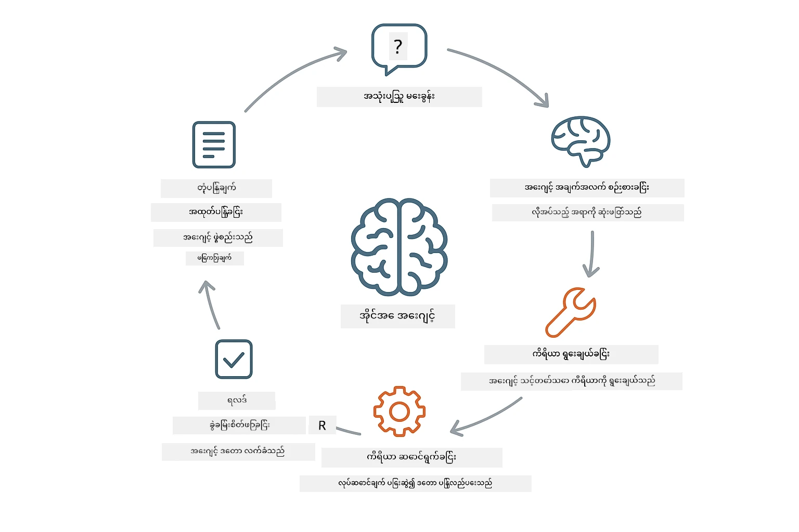
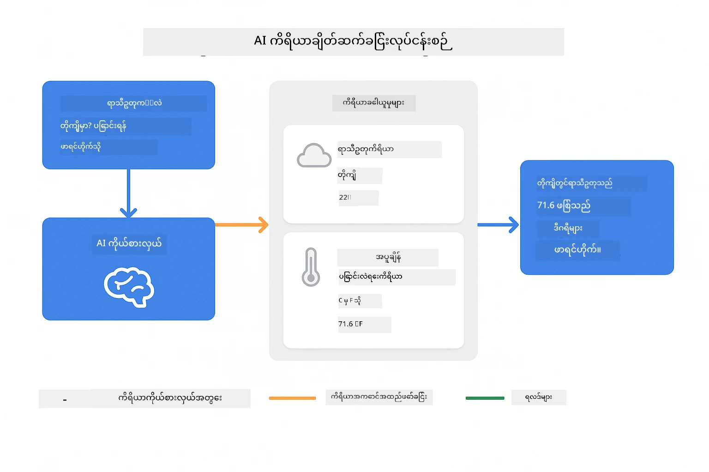
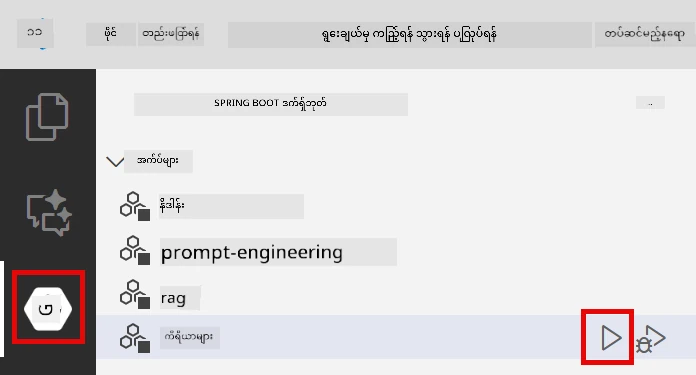

# Module 04: ကိရိယာများနှင့် AI အေဂျင့်များ

## အကြောင်းအရာ အတွဲ

- [သင်သည် အောက်ပါအရာများကို သင်ယူမည်ဖြစ်သည်](../../../04-tools)
- [လိုအပ်ချက်များ](../../../04-tools)
- [ကိရိယာများနှင့် AI အေဂျင့်များအား နားလည်ခြင်း](../../../04-tools)
- [ကိရိယာခေါ်ဆိုမှု ဘယ်လောက်အောင်လုပ်သလဲ](../../../04-tools)
  - [ကိရိယာသတ်မှတ်ချက်များ](../../../04-tools)
  - [ဆုံးဖြတ်ချက်ချခြင်း](../../../04-tools)
  - [အမိန့်အား အကောင်အထည်ဖော်ခြင်း](../../../04-tools)
  - [တုံ့ပြန်ချက် ဖန်တီးခြင်း](../../../04-tools)
- [ကိရိယာချိတ်ဆက်ခြင်း](../../../04-tools)
- [အပလီကေးရှင်း ပြေးဆွဲခြင်း](../../../04-tools)
- [အပလီကေးရှင်း သုံးစွဲခြင်း](../../../04-tools)
  - [ရိုးရှင်းသော ကိရိယာ အသုံးပြုမှု စမ်းသပ်ခြင်း](../../../04-tools)
  - [ကိရိယာချိတ်ဆက်မှု စမ်းသပ်ခြင်း](../../../04-tools)
  - [စကားပြောခြင်း လည်ပတ်ပုံ ကြည့်ရှုခြင်း](../../../04-tools)
  - [မတူညီသော တောင်းဆိုချက်များ ဖြင့် စမ်းသပ်ခြင်း](../../../04-tools)
- [အဓိက အယူအဆများ](../../../04-tools)
  - [ReAct ပုံစံ (စဉ်းစားခြင်းနှင့် လုပ်ဆောင်ခြင်း)](../../../04-tools)
  - [ကိရိယာ ဖော်ပြချက်များ အရေးကြီးသည်](../../../04-tools)
  - [ဆက်စပ်မှု စီမံခန့်ခွဲခြင်း](../../../04-tools)
  - [အမှား ကိုင်တွယ်မှု](../../../04-tools)
- [အသုံးပြုနိုင်သော ကိရိယာများ](../../../04-tools)
- [ကိရိယာအခြေပြု အေဂျင့်များကို ဘယ်အချိန်သုံးမလဲ](../../../04-tools)
- [နောက်တစ်ဆင့်များ](../../../04-tools)

## သင်သည် အောက်ပါအရာများကို သင်ယူမည်ဖြစ်သည်

ယခုအထိ သင်သည် AI နှင့် စကားပြောခြင်း၊ ပရောမ့်များကို ထိရောက်စွာ 架構 သတ်မှတ်ခြင်း၊ နှင့် မိမိစာရွက်များအပေါ် တုံ့ပြန်ချက်များ အခြေပြုခြင်းကို သင်ယူခဲ့သည်။ သို့သော် အခြေခံကန့်သတ်ချက်တစ်ခု မရှိမဖြစ်ရှိနေသည်- ဘာသာစကား မော်ဒယ်များသည် စာသားအဖြစ်သာ ထုတ်လုပ်နိုင်သည်။ ၎င်းတို့သည် ရာသီဥတု စစ်ဆေးခြင်း၊ သင်္ချာ တွက်ချက်ခြင်း၊ ဒေတာဘေ့စ်များကို စုံစမ်းခြင်း သို့မဟုတ် ပြင်ပစနစ်များနှင့် အပြန်အလှန် လုပ်ဆောင်ခြင်း မလုပ်နိုင်ပါ။

ကိရိယာများက ဒီကို ပြောင်းလဲပေးသည်။ မော်ဒယ်ကို ခေါ်ဆောင်နိုင်သော function များကို ပေးခြင်းဖြင့်၊ သင်သည် စာသားထုတ်ဖန်တီးသူမှ လုပ်ဆောင်နိုင်သော အေဂျင့်တစ်ခု အဖြစ် ပြောင်းလဲပေးသည်။ မော်ဒယ်သည် ဘယ်အချိန်ကိရိယာတစ်ခု လိုအပ်သည်၊ ဘယ်ကိရိယာကို သုံးမည်၊ ဘယ် parameter များကို ဖြတ်ပိုမည်ဆိုသည်ကို ဆုံးဖြတ်သည်။ သင်၏ ကုဒ်သည် function ကို အကောင်အထည်ဖော်ပြီး ရလဒ်ကို ပြန်လည်ပေးပို့သည်။ မော်ဒယ်သည် ထိုရလဒ်ကို ၎င်း၏ တုံ့ပြန်ချက်ထဲတွင် ထည့်သွင်းသည်။

## လိုအပ်ချက်များ

- Module 01 ပြီးစီးထားခြင်း (Azure OpenAI အရင်းအမြစ်များ ပြင်ဆင်ထားသည်)
- မူလဒိုင်ရေးထဲတွင် Azure လက်မှတ်များပါသော `.env` ဖိုင်ရှိ (Module 01 တွင် `azd up` ဖြင့် ဖန်တီးထားသည်)

> **မှတ်ချက်:** Module 01 မပြီးဆုံးဖြစ်ရသေးလျှင် ထိုနေရာ အရပ်ဖော်ပြချက်များကို ပထမဦးစွာလိုက်နာပါ။

## ကိရိယာများနှင့် AI အေဂျင့်များအား နားလည်ခြင်း

> **📝 မှတ်ချက်:** ဒီ module တွင် "agents" ဆိုသည်မှာ ကိရိယာခေါ်ဆိုမှု စွမ်းဆောင်ရည် မြှင့်တင်ထားသော AI အကူအညီများအား ဆိုလိုသည်။ ၎င်းသည် [Module 05: MCP](../05-mcp/README.md) တွင် ဖော်ပြမည့် **Agentic AI** ပုံစံများ (အစီအစဉ်ချခြင်း၊ မှတ်ဉာဏ် နှင့် များစွာသော ချက်ချင်း စဉ်းစားမှုပါရှိသော အလိုအလျောက် စီမံခန့်ခွဲနိုင်သော အေဂျင့်များ) နှင့် မတူပါ။

ကိရိယာပါ AI အေဂျင့်သည် စဉ်းစားခြင်းနှင့် လုပ်ဆောင်ခြင်း ပုံစံ (ReAct) ကို လိုက်နာသည် -

1. အသုံးပြုသူ မှ အမေးတစ်ခု မေးသည်
2. အေဂျင့်သည် သတင်းအချက်အလက် အတွက် စဉ်းစားသည်
3. အေဂျင့်သည် ဖြေကြားရန်အတွက် ကိရိယာတစ်ခု လိုအပ်မလား ဆုံးဖြတ်သည်
4. ဟုတ်ပါက၊ သိပ်တန် ကိရိယာကို မှန်ကန်သည့် parameter များဖြင့် ခေါ်ဆိုသည်
5. ကိရိယာ အကောင်အထည်ဖော်ပြီး ဒေတာ ပြန်ပေးသည်
6. အေဂျင့်သည် ရလဒ်ကိုထည့်သွင်းပြီး နောက်ဆုံးဖြေရှင်းချက် ပေးသည်



*ReAct ပုံစံ - AI အေဂျင့်များသည် ပြဿနာများဖြေရှင်းရန် စဉ်းစားခြင်းနှင့် လုပ်ဆောင်ခြင်းကို မကြာခဏ ပြန်လည်ပြောင်းလဲပုံစံ*

ဒါဟာ အလိုအလျောက်ဖြစ်ပေါ်သည်။ သင်သည် ကိရိယာများနှင့် ၎င်းတို့၏ ဖော်ပြချက်များကို သတ်မှတ်သည်။ မော်ဒယ်သည် ဘယ်အချိန်နှင့် ဘယ်လိုသုံးရမည်ဆိုသည်ကို ဆုံးဖြတ်ပေးသည်။

## ကိရိယာခေါ်ဆိုမှု ဘယ်လောက်အောင်လုပ်သလဲ

### ကိရိယာ သတ်မှတ်ချက်များ

[WeatherTool.java](../../../04-tools/src/main/java/com/example/langchain4j/agents/tools/WeatherTool.java) | [TemperatureTool.java](../../../04-tools/src/main/java/com/example/langchain4j/agents/tools/TemperatureTool.java)

သင်သည် ဖော်ပြချက်ရှင်းလင်းပြီး parameter သတ်မှတ်ချက်များပါရှိသော function များ ချမှတ်သည်။ မော်ဒယ်သည် မိမိ၏ စနစ် prompt တွင် ဤဖော်ပြချက်များကို မြင်ကာ ကိရိယာတစ်ခုချင်းစီ အလုပ်လုပ်ပုံကို နားလည်သည်။

```java
@Component
public class WeatherTool {
    
    @Tool("Get the current weather for a location")
    public String getCurrentWeather(@P("Location name") String location) {
        // သင့်၏ ရာသီဥတု ရှာဖွေရေး လုပ်ဆောင်ချက်
        return "Weather in " + location + ": 22°C, cloudy";
    }
}

@AiService
public interface Assistant {
    String chat(@MemoryId String sessionId, @UserMessage String message);
}

// အကူအညီပေးသူကို Spring Boot မှ အလိုအလျောက် ဆက်သွယ်ပေးထားသည် -
// - ChatModel bean
// - @Component အတန်းများမှ အားလုံးသော @Tool နည်းလမ်းများ
// - အစည်းအဝေး စီမံခန့်ခွဲမှုအတွက် ChatMemoryProvider
```

> **🤖 [GitHub Copilot](https://github.com/features/copilot) Chat ဖြင့် စမ်းကြည့်ပါ:** [`WeatherTool.java`](../../../04-tools/src/main/java/com/example/langchain4j/agents/tools/WeatherTool.java) ဖိုင်ကိုဖွင့်ပြီး မေးပါ -
> - "မည်းညစ်အချက်အလက်မဟုတ်ဘဲ OpenWeatherMap ကဲ့သို့ အမှန်တကယ် ရာသီဥတု API ကို ဘယ်လို ပေါင်းစပ်ရမလဲ?"
> - "AI မှ ကိရိယာကို မှန်ကန်စွာ သုံးစွဲပေးရန် ကောင်းမွန်သော ကိရိယာ ဖော်ပြချက်ဆိုတာ ဘယ်လိုဖြစ်သင့်မလဲ?"
> - "ကိရိယာတည်ဆောက်မှုတွင် API အမှားများနှင့် rate limit များကို ဘယ်လို ကိုင်တွယ်ရမလဲ?"

### ဆုံးဖြတ်ချက်ချခြင်း

အသုံးပြုသူ "စိယာတယ်မြို့ ရာသီဥတု ဘာလဲ?" ဟုမေးသောအခါ၊ မော်ဒယ်သည် ရာသီဥတု ကိရိယာ လိုအပ်ကြောင်း အသိအမှတ်ပြုသည်။ location parameter ကို "Seattle" ဟု သတ်မှတ်ပြီး function call ကို ဖန်တီးသည်။

### အမိန့်အား အကောင်အထည်ဖော်ခြင်း

[AgentService.java](../../../04-tools/src/main/java/com/example/langchain4j/agents/service/AgentService.java)

Spring Boot သည် `@AiService` interface တွင် မှတ်ပုံတင်ထားသည့် ကိရိယာအားလုံးကို အလိုအလျောက် ဆက်သွယ်ပေးပြီး LangChain4j သည် ကိရိယာခေါ်ဆိုမှုများကို အလိုအလျောက် အကောင်အထည်ဖော်သည်။

> **🤖 [GitHub Copilot](https://github.com/features/copilot) Chat ဖြင့် စမ်းကြည့်ပါ:** [`AgentService.java`](../../../04-tools/src/main/java/com/example/langchain4j/agents/service/AgentService.java) ဖိုင်ကို ဖွင့်ပြီး မေးပါ -
> - "ReAct ပုံစံ ဘယ်လို အလုပ်လုပ်ပြီး AI အေဂျင့်အတွက် ဘာကြောင့် ထိရောက်မှုရှိသလဲ?"
> - "အေဂျင့်သည် ဘယ်ကိရိယာကို ဘယ်ထိ လိုက်နာသုံးရမလဲဆိုတာ ကိုယ်တိုင် ဘယ်လိုဆုံးဖြတ်တယ်?"
> - "ကိရိယာ အကောင်အထည်မအောင်မြင်နိုင်ပါက ဘာဖြစ်မလဲ - အမှားတွေကို ဘယ်လို တာဝန်ရှိစွာ ကိုင်တွယ်ရမလဲ?"

### တုံ့ပြန်ချက် ဖန်တီးခြင်း

မော်ဒယ်သည် ရာသီဥတု ဒေတာကို လက်ခံပြီး အသုံးပြုသူအား သဘာဝဘာသာစကားဖြင့် တုံ့ပြန်ချက် ဖန်တီးပေးသည်။

### ဘာကြောင့် Declarative AI Services သုံးသနည်း?

ဒီ module သည် LangChain4j ရဲ့ Spring Boot ပေါင်းသင်းမှုနှင့် Declarative `@AiService` interface များကို အသုံးပြုသည်-

- **Spring Boot auto-wiring** - ChatModel နှင့် ကိရိယာများအား အလိုအလျောက် ထည့်သွင်းပေးသည်
- **@MemoryId ပုံစံ** - အလိုအလျောက် ဆက်စပ်မှုအခြေပြု မှတ်ဉာဏ် စီမံခန့်ခွဲမှု
- **တစ်ခုတည်းသော အတိုင်းအတာ** - အကူအညီကို တစ်ကြိမ်ဖန်တီးပြီး ထပ်မံ အသုံးပြုခြင်း
- **အမျိုးအစား-လုံခြုံပြီး အကောင်အထည်ဖော်မှု** - Java method များကို တိုက်ရိုက် အမျိုးအစားပြောင်းလဲပြီး ခေါ်ဆိုသည်
- **စဉ်ဆက်မပြတ် စီမံခန့်ခွဲမှု** - ကိရိယာချိတ်ဆက်ခြင်းကို အလိုအလျောက် ကိုင်တွယ်သည်
- **ဘယ်လိုကျွန်းပျောက်ချက်မှမရှိ** - AiServices.builder() ခေါ်ဆိုမှုများ သို့မဟုတ် memory HashMap မလိုတော့

လက်တွေ့တွင် အခြား နည်းများ (manual `AiServices.builder()`) သည် ကုဒ်ပိုများပြီး Spring Boot ပေါင်းသင်းမှု အကျိုးပြုချက် မရရှိပါ။

## ကိရိယာချိတ်ဆက်ခြင်း

**ကိရိယာချိတ်ဆက်ခြင်း** - AI သည် ကိရိယာအများအပြားကို ဆက်တိုက် ခေါ်သုံးနိုင်သည်။ "စိယာတယ်မြို့ ရာသီဥတုဘယ်လိုလဲ၊ ထီးပါမပြီး ယူသင့်မလား" ဟုမေးပြီး `getCurrentWeather` ကို ခေါ်၍ မိုးရွာမှုအရေးကြီးမှု အကြောင်းစဉ်းစားပါ။

<a href="images/tool-chaining.png"></a>

*ဆက်တိုက် ကိရိယာခေါ်ဆိုမှု - ကိရိယာတစ်ခု၏ ထုတ်လွှင့်ချက်သည် နောက်ထပ်ဆုံးဖြတ်ချက်သို့ ပို့ဆောင်သည်*

**အညစ်အကြေး Graceful Failures** - မော်ဒယ်ထဲတွင် မပါသော မြို့၏ ရာသီဥတုကို အမေးပေးပါ။ ကိရိယာသည် အမှားစာ/message ကို ပြန်ပေးပြီး AI က မကူနိုင်ကြောင်း ရှင်းပြသည်။ ကိရိယာများသည် ဘေးကင်းစွာ ပျက်မှု ဖြစ်မြောက်နိုင်သည်။

ဒါဟာ တစ်ချက်ပြောဆိုမှုအတွင်း တစ်ချက်ပဲ ဖြစ်ပေါ်သည်။ အေဂျင့်သည် အလိုအလျောက် ကိရိယာများဆက်တိုက် ခေါ်သုံးသည်။

## အပလီကေးရှင်း ပြေးဆွဲခြင်း

**တပ်ဆင်မှု ကိုအတည်ပြုပါ:**

Module 01 မှ တွက်ချက်ပြီး `.env` ဖိုင် တည်ရှိသည်ဆိုတာ အတည်ပြုပါ -
```bash
cat ../.env  # AZURE_OPENAI_ENDPOINT, API_KEY, DEPLOYMENT ကို ပြရန်ဖြစ်သည်။
```

**အပလီကေးရှင်း စတင်ပါ:**

> **မှတ်ချက်:** Module 01 တွင် `./start-all.sh` ဖြင့် အားလုံး စတင်ထားပြီး ဖြစ်ပါက ဒီ module သည် ဖေါ်ပြချက် 8084 ပေါ့  မှာ ပြေးနေပြီး သင်သည် အောက်တွင် ပြင်ဆင်စရာ မလိုပါ။ တိုက်ရိုက် http://localhost:8084 သို့ ဝင်ရောက်နိုင်ပါသည်။

**ရွေးချယ်မှု ၁ - Spring Boot Dashboard အသုံးပြုခြင်း (VS Code အသုံးပြုသူများအတွက် အကြံပြု)**

Dev container တွင် Spring Boot Dashboard extension ပါဝင်ပြီး၊ ၎င်းသည် Spring Boot အပလီကေးရှင်းအားလုံး အား ကြည့်ရှု စီမံခန့်ခွဲရန် မျက်နှာပြင်ပေးသည်။ VS Code ၏ ဘယ်ဘက် Activity Bar မှာ Spring Boot အိုင်ကွန်ကို ရှာပြီး သွားကြည့်နိုင်ပါသည်။

Spring Boot Dashboard မှ:
- ရှိသော Spring Boot အပလီကေးရှင်းအားလုံး ကြည့်ရှုနိုင်သည်
- တစ်ချက်နှိပ်ခြင်းနှင့် စတင်/ပိတ်နိုင်သည်
- အပလီကေးရှင်း အကောင်အထည် ဖော်မှုမှတ်တမ်း အချိန်နဲ့တစ်ပြေးညီ ကြည့်ရှုနိုင်သည်
- အပလီကေးရှင်း အခြေအနေကို စောင့်ကြည့်နိုင်သည်

"tools" နှင့် ဆက်စပ်သည့် play button ကို နှိပ်၍ ဒီ module ကို စတင်ပါ၊ ဒါမှမဟုတ် အားလုံးစတင်နိုင်သည်။



**ရွေးချယ်မှု ၂ - shell script များ ဖြင့်**

လုံး၀ web applications (module 01-04) စတင်ရန်-

**Bash:**
```bash
cd ..  # အရင်းမြစ်ဖိုဒါမှ
./start-all.sh
```

**PowerShell:**
```powershell
cd ..  # မူလဖိုင်မှတ်တမ်းအညွှန်းမှ
.\start-all.ps1
```

သို့မဟုတ် ဒီ module တစ်ခုတည်းကို စတင်ရန် -

**Bash:**
```bash
cd 04-tools
./start.sh
```

**PowerShell:**
```powershell
cd 04-tools
.\start.ps1
```

နှစ်ခုလုံးမှာ လက်ရှိ `.env` ဖိုင်မှ ပတ်ဝန်းကျင်ပြောင်းလဲမှုများအား အလိုအလျောက် ထည့်သွင်း ပြီး JAR ဖိုင် မရှိပါက တည်ဆောက်လိမ့်မည်။

> **မှတ်ချက်:** စတင်ရန်မတိုင်မီ Modules အားလုံးကို လက်မခံဘဲ တည်ဆောက်လိုပါက -
>
> **Bash:**
> ```bash
> cd ..  # Go to root directory
> mvn clean package -DskipTests
> ```
>
> **PowerShell:**
> ```powershell
> cd ..  # Go to root directory
> mvn clean package -DskipTests
> ```

http://localhost:8084 ကို ဘရောက်ဇာတွင် ဦးတည် ဝင်ရောက်ကြည့်ရှုပါ။

**ရပ်တန့်ရန်:**

**Bash:**
```bash
./stop.sh  # ဒီမော်ဂျူးသာ
# သို့မဟုတ်
cd .. && ./stop-all.sh  # မော်ဂျူးအားလုံး
```

**PowerShell:**
```powershell
.\stop.ps1  # ဤမော်ဂျူးအားသာ
# သို့မဟုတ်
cd ..; .\stop-all.ps1  # မော်ဂျူးအားလုံး
```

## အပလီကေးရှင်း သုံးစွဲခြင်း

အပလီကေးရှင်းသည် ရာသီဥတုနှင့် အပူချိန်ပြောင်းလဲမှု ကိရိယာများကို အသုံးပြုနိုင်သော AI အေဂျင့်နှင့် ဆက်သွယ်နိုင်သော web မျက်နှာပြင် ပေးသည်။

<a href="images/tools-homepage.png"></a>

*AI အေဂျင့် ကိရိယာ မျက်နှာပြင် - အချက်အလက်အမြန် နမူနာများနှင့် စကားပြော ပိုင်းဆက်သွယ်မှု*

### ရိုးရှင်းသော ကိရိယာ အသုံးပြုမှု စမ်းသပ်ခြင်း

အလွယ်တကူ တောင်းဆိုချက်ဖြင့် စတင်ပါ - "100 ဒီဂရီ Fahrenheit ကို Celsius သို့ ပြောင်းပါ"။ အေဂျင့်သည် အပူချိန်ပြောင်းလဲကိရိယာ လိုအပ်ကြောင်း သိရှိကာ parameter မှန်ကန်စွာ ဖြင့် ခေါ်ဆိုပြီး ရလဒ် ပြန်ပေးသည်။ သင် သုံးစွဲရန် ကိရိယာကို ဖော်ပြခြင်း မရှိပေမယ့် သဘာဝကဲ့သို့ခံစားရသည်။

### ကိရိယာချိတ်ဆက်မှု စမ်းသပ်ခြင်း

ယခု ပိုမိုခက်ခဲသော စမ်းသပ်မှု- "စိယာတယ်မြို့ ရာသီဥတု ဘာလဲ၊ အဲဒါကို Fahrenheit သို့ ပြောင်းပါ"။ အေဂျင့်သည် အဆင့်လိုက် လုပ်ဆောင်သည်။ မူလက ရာသီဥတု (Celsius ပြန်ပေး) မေးမြန်း၍ ရလဒ်ယူခဲ့ပြီး Fahrenheit သို့ ပြောင်းရန် လိုအပ်သည်ကို သိရှိ၊ ပြောင်းလဲကိရိယာကိုခေါ်၍ နှစ်ခုရလဒ် တစ်ခုတည်း ဖြေရှင်းချက် အဖြစ် ပေါင်းစည်းပေးသည်။

### စကားပြောခြင်း လည်ပတ်ပုံ ကြည့်ရှုခြင်း

စကားပြော အင်တာဖေ့စ်သည် စကားပြော နှစ်ထပ်ထပ်မှတ်တမ်းကို ထိန်းသိမ်းသည့်အတွက် အမျိုးမျိုးသော အချိန်ပြန် ပြောဆိုမှုများ လုပ်နိုင်သည်။ ယခင် ပေါ်လာမှုများနှင့် တုံ့ပြန်ချက်များအားလုံးကို ကြည့်ရှုနိုင်ပြီး၊ အေဂျင့်သည် များစွာသော လွှဲပြောင်းမှုများတွင် ဦးစားပေး နေရာ ဖော်ဆောင်ပုံကို နားလည်နိုင်စေသည်။

<a href="images/tools-conversation-demo.png"></a>

*အများအပြားကိရိယာခေါ်ဆိုမှုများဖြင့် အဆင့်လိုက်ပြောင်းလဲမှု၊ ရာသီဥတု စစ်ဆေးမှုများနှင့် ကိရိယာချိတ်ဆက်မှု ပြသချက်*

### မတူညီသော တောင်းဆိုချက်များ ဖြင့် စမ်းသပ်ခြင်း

အမျိုးမျိုး ကိုစမ်းပါ -
- ရာသီဥတု စစ်ဆေးမှုများ: "တိုးကျိုမြို့ ရာသီဥတု ဘာလဲ?"
- အပူချိန် ပြောင်းလဲမှုများ: "25°C ကို Kelvin သို့ ပြောင်းပါ"
- ပေါင်းစပ် တောင်းဆိုချက်များ: "ပါရီ မြို့ ရာသီဥတု စစ်ဆေးပြီး 20°C ထက် အေးသောကြောင်း ပြပါ"

အေဂျင့်သည် သဘာဝဘာသာစကား ကို ဘယ်လို နားလည်ပြီး လိုအပ်သော ကိရိယာ ခေါ်ဆိုမှုများ ချိန်ညှိသလဲ သတိထားကြည့်ပါ။

## အဓိက အယူအဆများ

### ReAct ပုံစံ (စဉ်းစားခြင်းနှင့် လုပ်ဆောင်ခြင်း)

အေဂျင့်သည် စဉ်းစားခြင်း (ဘာလုပ်ရမည်ဆိုတာ ဆုံးဖြတ်ခြင်း) နှင့် လုပ်ဆောင်ခြင်း (ကိရိယာများအသုံးပြုခြင်း) တို့ကို အလွဲအချော် ပြောင်းလဲအသုံးပြုသည်။ ဒီပုံစံက အလုပ်ကို အလိုအလျော့ ဖြေရှင်းရန် စွမ်းဆောင်မှု ပေးသည်၊ အမိန့်များကိုသာ တုံ့ပြန်ပေးခြင်း မဟုတ်ပါ။

### ကိရိယာ ဖော်ပြချက်များ အရေးကြီးသည်

သင့်ကိရိယာဖော်ပြချက်များအရည်အသွေးမှာ အေဂျင့်၏ အသုံးပြုမှုအကျိုးသက်ရောက်မှုကို တိုက်ရိုက် သက်ရောက်စေသည်။ ဖော်ပြချက်ရှင်းလင်းပြီး အထူးသဖြင့် ကိရိယာကို ဘယ်အချိန် ဘယ်လို ခေါ်ရမည်ကို မော်ဒယ် နားလည်ရန် ကူညီသည်။

### ဆက်စပ်မှု စီမံခန့်ခွဲခြင်း

`@MemoryId` annotation တစ်ခုကို အသုံးပြု၍ အလိုအလျောက် session အခြေပြု မှတ်ဉာဏ် စီမံခန့်ခွဲမှု ဖြစ်ပေါ်စေသည်။ session ID တစ်ခုစီသည် `ChatMemory` instance ကိုရရှိပြီး `ChatMemoryProvider` bean က စီမံခန့်ခွဲသည်၊ လက်ဖြင့် မှတ်ဉာဏ် စီမံခန့်ခွဲမှု လိုအပ်ခြင်း မရှိတော့ပါ။

### အမှား ကိုင်တွယ်မှု

ကိရိယာများသည် မအောင်မြင်နိုင်ပေ။ API များ သက်တမ်းကုန်၊ parameter မမှန်ကန်၊ ပြင်ပ ဝန်ဆောင်မှုများ ပျက်ကွက်နိုင်သည်။ ထုတ်လုပ်မှုအတွက် အေဂျင့်များတွင် အမှား ကိုင်တွယ်မှု လိုအပ်ပြီး မော်ဒယ်က ပြဿနာများ ရှင်းပြရန် သို့မဟုတ် အစားထိုးနည်းလမ်းများ လုပ်ဆောင်ရန် လိုအပ်ပါသည်။

## အသုံးပြုနိုင်သော ကိရိယာများ

**ရာသီဥတု ကိရိယာများ** (ပြသရန် mock data အတွက်) -
- တည်နေရာအရ လက်ရှိ ရာသီဥတု ရယူခြင်း
- မျှော်မှန်းချက် အချိန်များ စုစည်းခြင်း

**အပူချိန် ပြောင်းလဲ ကိရိယာများ** -
- Celsius မှ Fahrenheit
- Fahrenheit မှ Celsius
- Celsius မှ Kelvin
- Kelvin မှ Celsius
- Fahrenheit မှ Kelvin
- Kelvin မှ Fahrenheit

ဤနမူနာများသည် ရိုးရှင်းသော်လည်း ဒီပုံစံသည် အခြား function များတွင် မြှောက်ချ ူနိုင်သည် - ဒေတာစုံစမ်းခြင်း၊ API ခေါ်ဆိုမှုများ၊ တွက်ချက်မှုများ၊ ဖိုင် လုပ်ဆောင်မှုများ သို့မဟုတ် စနစ် command များ။

## ကိရိယာအခြေပြု အေဂျင့်များကို ဘယ်အချိန်သုံးမလဲ

**အောက်ပါအခြေအနေများတွင် ကိရိယာများ သုံးပါ -**
- အချိန်လတ်တလော ဒေတာ (ရာသီဥတု၊ စတော့ရှယ်ယာ, ဂိုဒေါင် စာရင်း) လိုအပ်သော မေးခွန်းများဖြေဆိုရန်
- ရိုးရှင်းသည့် သင်္ချာထက် ပိုမိုရှုပ်ထွေးသော တွက်ချက်မှုများ လုပ်ရန်
- ဒေတာဘေ့စ်များ သို့မဟုတ် API များကို ဝင်ရောက်အသုံးပြုရန်
- တုံ့ပြန်မှုများ (အီးမေးလ်ပို့ခြင်း၊ လက်မှတ်ဖန်တီးခြင်း၊ စာရင်းပြင်ဆင်ခြင်း) လုပ်ရန်
- ဒေတာအရင်းအမြစ် များစွာ ပေါင်းစပ်ရန်

**ကိရိယာများ မသုံးသင့်သောအချိန် -**
- မေးခွန်းများကို ယေဘုယ် အသိပညာမှ ဖြေရှင်းနိုင်သောအချိန်
- တုံ့ပြန်ချက်များသည် စကားပြောပုံစံသာ ဖြစ်သောအချိန်
- ကိရိယာ ဆက်သွယ်မှုနှောင့်နှေးမှုကြောင့် အတွေ့အကြုံ ကြီးမားစွာ နှေးကှေးသောအခါ

## နောက်တစ်ဆင့်များ

**နောက် Module:** [05-mcp - Model Context Protocol (MCP)](../05-mcp/README.md)

---

**လမ်းညွှန်:** [← ယခင်: Module 03 - RAG](../03-rag/README.md) | [မူရင်းသို့ပြန်သွားရန်](../README.md) | [နောက်တစ်ခု: Module 05 - MCP →](../05-mcp/README.md)

---

<!-- CO-OP TRANSLATOR DISCLAIMER START -->
**်ပယ်ချောမှု**  
ဤစာတမ်းကို AI ဘာသာပြန်ဝန်ဆောင်မှု [Co-op Translator](https://github.com/Azure/co-op-translator) အသုံးပြု၍ ဘာသာပြန်ထားပါသည်။ ကျွန်ုပ်တို့သည် တိကျမှန်ကန်မှုအတွက် ကြိုးစားပေမယ့် စက်ဘက်ဘာသာပြန်ချက်များတွင် အမှားအယွင်းများပါရှိနိုင်ကြောင်း သတိပြုပါရန် မေတ္တာရပ်ခံအပ်ပါသည်။ မူရင်းစာတမ်းကို ကိုယ်ပိုင်ဘာသာဖြင့်သာ တရားဝင်အရင်းအမြစ်အဖြစ် သတ်မှတ်စဉ်းစားသင့်ပါသည်။ အရေးကြီးသော သတင်းအချက်အလက်များအတွက် အကျွမ်းတဝင် လူ့ဘာသာပြန်ကျွမ်းကျင်သူများ၏ ဘာသာပြန်ချက်ကို ဦးစားပေး အကြံပြုပါသည်။ ဤဘာသာပြန်ချက် အသုံးပြုမှုကြောင့် ဖြစ်ပေါ်လာသော နားလွဲမှုများ သို့မဟုတ် မမှန်ကန်မှုများအတွက် ကျွန်ုပ်တို့မှာ တာဝန်မကျေ့ပါကြောင်း သိရှိပါစေ။
<!-- CO-OP TRANSLATOR DISCLAIMER END -->