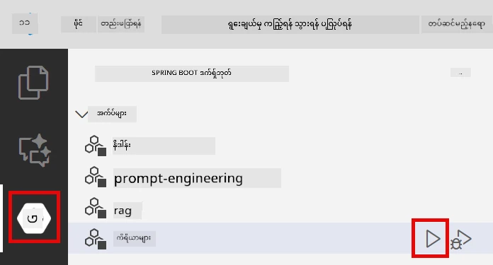
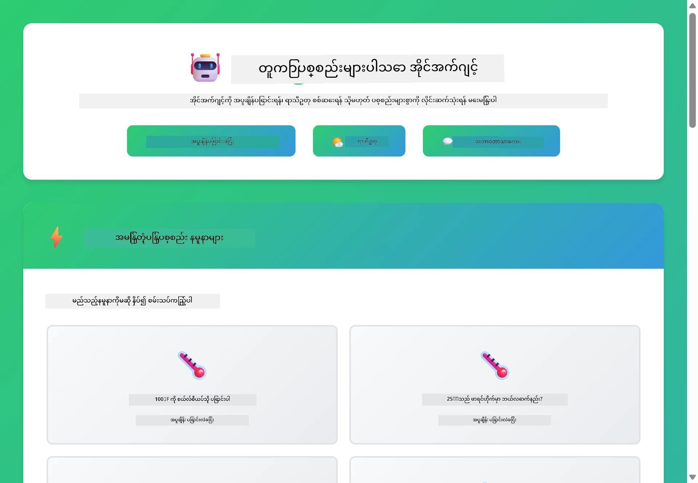
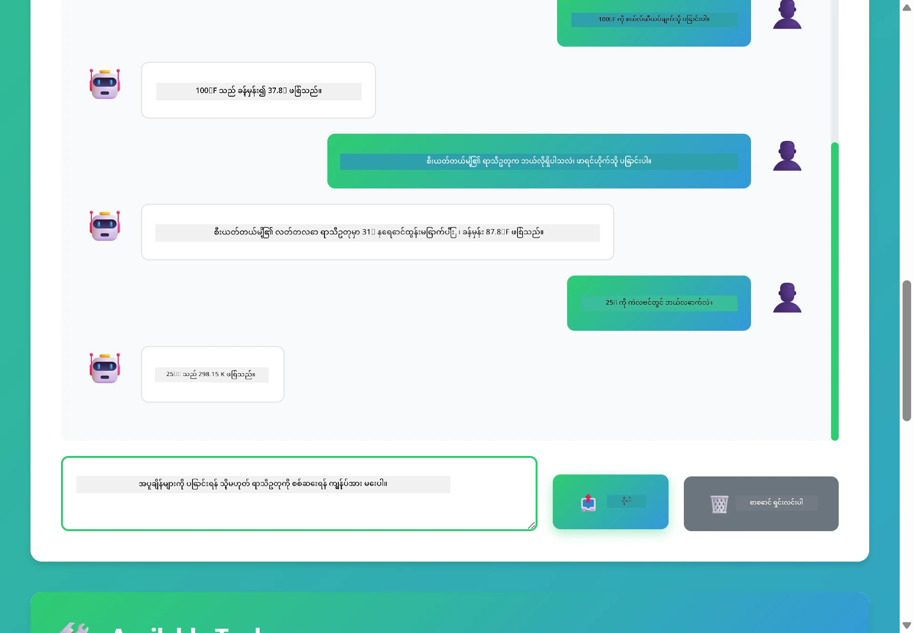

# Module 04: AI Agents with Tools

## Table of Contents

- [Video Walkthrough](#video-walkthrough)
- [What You'll Learn](#what-youll-learn)
- [Prerequisites](#prerequisites)
- [Understanding AI Agents with Tools](#understanding-ai-agents-with-tools)
- [How Tool Calling Works](#how-tool-calling-works)
  - [Tool Definitions](#tool-definitions)
  - [Decision Making](#decision-making)
  - [Execution](#execution)
  - [Response Generation](#response-generation)
  - [Architecture: Spring Boot Auto-Wiring](#architecture-spring-boot-auto-wiring)
- [Tool Chaining](#tool-chaining)
- [Run the Application](#run-the-application)
- [Using the Application](#အက်ပလီကေးရှင်း-အသုံးပြုခြင်း)
  - [Try Simple Tool Usage](#ပထမဆုံး-ကိရိယာ-အသုံးပြုကြည့်ရန်)
  - [Test Tool Chaining](#ကိရိယာ-ချဲ့ထွင်ခြင်း-စမ်းသပ်ရန်)
  - [See Conversation Flow](#စကားပြော-ရှေ့ပြေးကို-ကြည့်ရန်)
  - [Experiment with Different Requests](#မတူညီသော-တောင်းဆိုချက်များကို-စမ်းသပ်ရန်)
- [Key Concepts](#အဓိကအယူအဆများ)
  - [ReAct Pattern (Reasoning and Acting)](#react-ပုံစံ-စဉ်းစားခြင်းနှင့်-လုပ်ဆောင်ခြင်း)
  - [Tool Descriptions Matter](#ကိရိယာဖော်ပြချက်များ-အရေးကြီးသည်)
  - [Session Management](#ဆက်သွယ်မှုစီမံခန့်ခွဲမှု)
  - [Error Handling](#အမှားကိုင်တွယ်ခြင်း)
- [Available Tools](#အသုံးပြုနိုင်သော-ကိရိယာများ)
- [When to Use Tool-Based Agents](#ဘယ်အချိန်မှာ-tool-based-agents-ကို-အသုံးပြုမလဲ)
- [Tools vs RAG](#tools-နှင့်-rag-ကြား-ကွာခြားချက်)
- [Next Steps](#နောက်တစ်ဆင့်များ)

## Video Walkthrough

ဒီ module နဲ့ စတင်ရောက်ရှိဖို့ဘယ်လိုလုပ်ရမယ်ဆိုတာ ရှင်းပြထားတဲ့ live အစီအစဉ်ကို ကြည့်ရှုနိုင်ပါသည်။

<a href="https://www.youtube.com/watch?v=O_J30kZc0rw"></a>

## What You'll Learn

ယနေ့အထိ သင်တို့သည် AI နဲ့ စကားပြောဆိုနည်း၊ prompt များကို ထိထိရောက်ရောက် အစီအစဉ်တကျ ဖွဲ့စည်းနည်း၊ နှင့် မိမိစာရွက်စာတမ်းများအခြေခံ၍ တုံ့ပြန်ချက်များကို ချထားနည်းတို့ကို သင်ယူပြီးသားဖြစ်သည်။ သို့သော် အခြေခံကန့်သတ်ချက်တစ်ခုရှိသည်မှာ - language model များသည် စာသားသာဖန်တီးနိုင်ပြီး ရာသီဥတုစစ်ဆေးခြင်း၊ တွက်ချက်မှုများပြုလုပ်ခြင်း၊ ဒေတာဘေ့စ်များကို စစ်မယ်၊ အပြင်မှစနစ်များနှင့် လုပ်ဆောင်ခြင်း မပြုနိုင်ပါ။

Tools များက ဒီအတားအဆီးကို ပြောင်းလဲပေးသည်။ model ကို function များခေါ်သုံးနိုင်ရန်ခွင့်ပြုခြင်းဖြင့် text ဖန်တီးသူမှ ဝါရင့် agent ဖြစ်လာစေသည်။ model သည် tool လိုအပ်သည့်အချိန်၊ ဘယ် tool ကိုသုံးရမည်၊ ဘယ် parameter များ ပေးပို့ရမည်ဆိုတာ ဆုံးဖြတ်သည်။ သင်၏ ကုတ်တွင် function ကို အကောင်အထည်ဖော်ပြီး ရလဒ်ကို ပြန်ပေးသည်။ model သည် ထိုရလဒ်ကို သူ၏ တုံ့ပြန်ချက်တွင် ထည့်သွင်းစီစဉ်ပေးသည်။

## Prerequisites

- [Module 01 - Introduction](../01-introduction/README.md) ကိုပြီးစွာ ဖြေရှင်းထားဖို့ (Azure OpenAI resource များ deploy ပြီးသားဖြစ်ရန်)
- ယခင် module များကို အကြံပြုအတိုင်း ပြီးစီးထားရန် (ဒီ module မှာ Tools vs RAG နှိုင်းယှဉ်မှုအတွက် [Module 03](../03-rag/README.md) ရဲ့ RAG အတွေးအခေါ်များကို ရည်ညွှန်းထားသည်)
- ရှေ့စာမျက်နှာမြောက် `.env` ဖိုင်တွင် Azure သုံး ဝင်ခွင့် အချက်အလက်များပါရှိရန် (Module 01 တွင် `azd up` ဖြင့် ဖန်တီးထားသည်)

> **Note:** Module 01 မပြီးသေးပါက အဲဒီမှာပထမဦးဆုံး deployment လမ်းညွှန်ချက်များကို လိုက်နာပါ။

## Understanding AI Agents with Tools

> **📝 Note:** ဒီ module မှာ "agents" ဆိုသောစကားလုံးသည် tool calling စွမ်းရည်မြှင့်တင်ထားသော AI အကူအညီသူများကို ဆိုလိုဖြစ်သည်။ ၎င်းသည် [Module 05: MCP](../05-mcp/README.md) မှ ကျွန်ုပ်တို့ အကောင်အထည်ဖော်မည့် **Agentic AI** ပုံစံများ (အစီအစဉ်ရေးဆွဲခြင်း၊ မှတ်ဉာဏ်နှင့် အဆင့်မြင့် စဉ်းစားမှုပါဝင်သော autonomous agent များ) ထက် ကွဲပြားသည်။

tools မရှိပါက language model သည် ၎င်း၏_training_ဒေတာအပေါ်မှ စာသား များကို တုန့်ပြန်ပေးနိုင်သည်။ ရာသီဥတုပြောပါက မှန်မှန်ကန်ကန် မပြောနိုင်ဘဲ ခန့်မှန်းရမည်။ tools များပေးပါက weather API ခေါ်နိုင်၊ တွက်ချက်ချက်နိုင်၊ ဒေတာဘေ့စ်ကိုရှာဖွေစစ်ဆေးနိုင်တော့သည်၊ ထိုစစ်မှန်သော ရလဒ်များကို ၎င်း၏ တုံ့ပြန်ချက်ထဲတွင် ပေါင်းထည့်တင်ပြနိုင်သည်။


*tools မပါက model သည် ခန့်မှန်းမှသာ ပြုလုပ်ရ; tools မပါမဖြစ် API များခေါ်အသုံးပြု၍ တွက်ချက်၍ အချိန်နှင့်တပြေးညီ ဒေတာ ပြန်လည်ပေးနိုင်သည်။*

AI agent with tools သည် **Reasoning and Acting (ReAct)** ပုံစံကို လိုက်နာသည်။ model သည် တုံ့ပြန်ခြင်းသာ မလုပ်ပဲ — မည်သည့်အရာလိုအပ်သည်ကို စဉ်းစားခြင်း၊ tool တစ်ခုခေါ်ခြင်း၊ ရလဒ်ကို သတိထားကြည့်ခြင်းနှင့် ထပ်မံ လုပ်ဆောင်မည် မလားသို့မဟုတ် နောက်ဆုံးဖြေချက် ပေးမည်ကို ဆုံးဖြတ်သည်။

1. **Reason** — အသုံးပြုသူမေးခွန်းကို ဖြေရှင်း၍ မည်သည့်သတင်းအချက်အလက် လိုအပ်သည်ကို သတ်မှတ်ခြင်း
2. **Act** — မှန်ကန်သော tool ကို ရွေးချယ်ပြီး parameter များထုတ်ဖော်၍ ခေါ်ဆိုခြင်း
3. **Observe** — tool အထွက်ရလဒ်ကို လက်ခံ၍ အကဲဖြတ်ခြင်း
4. **Repeat or Respond** — သတင်းအချက်အလက် ထပ်မံလိုအပ်ပါက ထပ်ခေါ်လုပ်ဆောင်ခြင်းမဟုတ်လျှင် သဘာဝဘာသာဖြင့် ဖြေကြားခြင်း


*ReAct လည်ပတ်မှု — agent သည် စဉ်းစား၍ tool ခေါ်ကာ ရလဒ်ကို သတိထားကြည့်ပြီး နောက်ဆုံးဖြေချက်ပေးသည်အထိ ဆက်လက်လုပ်ဆောင်သည်။*

ဒီလုပ်ငန်းစဥ်သည် အလိုအလျောက်ဖြစ်ပွားပါသည်။ သင်သည် tools များနှင့် ၎င်းတို့ ဖော်ပြချက်များကို သတ်မှတ်ပေးသည်။ model မှ tool များကို ဘယ်အချိန်၊ မည်သို့သုံးရမည်ကို ဆုံးဖြတ်ဖြစ်စေသည်။

## How Tool Calling Works

### Tool Definitions

[WeatherTool.java](../../../04-tools/src/main/java/com/example/langchain4j/agents/tools/WeatherTool.java) | [TemperatureTool.java](../../../04-tools/src/main/java/com/example/langchain4j/agents/tools/TemperatureTool.java)

သင်သည် ဖန်တီးလိုသော function များကို ရှင်းလင်းတဲ့ ဖော်ပြချက်များနှင့် parameter ကို သတ်မှတ်ပေးပါသည်။ model သည် သင့် system prompt တွင် ဖော်ပြချက်များကို ကြည့်ပြီး ကင်းစင် tool တစ်ခုချင်းဆီ၏ ကိုယ်ရည်ကိုယ်သွေးကို နားလည်နိင်သည်။

```java
@Component
public class WeatherTool {
    
    @Tool("Get the current weather for a location")
    public String getCurrentWeather(@P("Location name") String location) {
        // သင့်၏ရာသီဥတုပြန်ကြားချက်လောဂျစ်
        return "Weather in " + location + ": 22°C, cloudy";
    }
}

@AiService
public interface Assistant {
    String chat(@MemoryId String sessionId, @UserMessage String message);
}

// အကူအညီပေးသူကို Spring Boot မှ အလိုအလျောက်ချိတ်ဆက်ပေးသည်။
// - ChatModel bean
// - @Component ကလပ်များမှ @Tool နည်းလမ်းများအားလုံး
// - အစည်းအဝေး စီမံခန့်ခွဲမှုအတွက် ChatMemoryProvider
```

အောက်ဖော်ပြပါ ပုံသည် annotation တစ်ခုချင်းစီ၏ ရည်ရွယ်ချက်များကို ဖော်ပြပြီး AI အတွက် tool ခေါ်သုံးရမည့် အချိန်နှင့် ပေးပို့ရန် argument များကို နားလည်စေရန်ဘာကြောင့်အရေးကြီးကြောင်းရှင်းပြသည်။


*tool definition ရဲ့ anatomy — @Tool သည် AI ကို ဘယ်အချိန်သုံးရမည် ဆိုတာပြောပြ၊ @P သည် parameter တစ်ခုချင်း ရှင်းပြ၊ @AiService သည် စတင်ချိန်တွင် အားလုံးကို ဆက်သွယ်ပေးသည်။*

> **🤖 GitHub Copilot Chat ဖြင့် စမ်းကြည့်ပါ:** [`WeatherTool.java`](../../../04-tools/src/main/java/com/example/langchain4j/agents/tools/WeatherTool.java) ကိုဖွင့်ပြီး ဤမေးခွန်းများမေးပါ။
> - "mock data အစား အမှန်တကယ် weather API ဖြစ်တဲ့ OpenWeatherMap ကိုဘယ်လိုပေါင်းစည်းမလဲ?"
> - "AI များ tool ကိုမှန်ကန်စွာသုံးရန် နောက်ကွယ်က နားလည်မှုရရှိစေရန် ကောင်းမွန်သော tool ဖော်ပြချက် များက ဘာများပါသင့်သလဲ?"
> - "tool implementation များတွင် API error သို့ rate limit များကို ဘယ်လိုကောင်းစွာ ချုပ်ချယ်မလဲ?"

### Decision Making

အသုံးပြုသူက "Seattle ရဲ့ ရာသီဥတု ဘာလဲ?" ဟု မေးလာခဲ့ပါက model သည် ယိုယွင်းစွာ tool တစ်ခုရွေးမထားဘဲ user ရဲ့ ရည်ရွယ်ချက်အား နောက်ဆုံး tool သာမက အားလုံး tool ဖော်ပြချက်များနှင့် နှိုင်းယှဉ်ပြီး အနီးကပ်ဆုံး ကိုယ်စားပြု tool ကို ရွေးချယ်သည်။ ထိုနောက် `location` ကို `"Seattle"` ဟူ၍ သတ်မှတ်ပြီး စနစ်တကျ function call ဖန်တီးသည်။

အသုံးပြုသူ အမိန့်နှင့် ကိုက်ညီသော tool မရှိပါက model သည် ကျွန်ုပ်၏အသိပညာထဲမှ တုံ့ပြန် မှာဖြေသည်။ ဟုတ်သော tools များအများအပြားရှိပါက နောက်ထပ် သီးသန့် tool ကို ရွေးချယ်သည်။


*model သည် အသုံးပြုသူ ရည်ရွယ်ချက်အား အားလုံး tool များနှိုင်းယှဉ် ရှေးရှုပြီး အကောင်းဆုံးကို ရွေးချယ်သည် — ဒီမှာ ရှင်းလင်းပြီး အထူးသဖြင့် ဖော်ပြချက်ရေးသားခြင်းဇယားများ အရေးကြီးသည်။*

### Execution

[AgentService.java](../../../04-tools/src/main/java/com/example/langchain4j/agents/service/AgentService.java)

Spring Boot သည် `@AiService` interface အသုံးပြု၍ register လုပ်ထားသည့် tools များကို auto-wire ပြီး LangChain4j သည် tool call များကို အလိုအလျောက် ကျင်းပပေးသည်။ နောက်ခံ၌ tool call တစ်ခုလုံးကို အဆင့်ခြားခြား ခွဲ၍ user ၏ သဘာဝဘာသာမေးခွန်းမှ သဘာဝဘာသာ အဖြေထုတ်သဘောသို့ တစ်လျှောက်လွှားစဥ်ဖြစ်သည်။


*စာလုံးတပ်စဥ်၊ user မေးခွန်းဖြေ၊ model သတ်မှတ် tool, LangChain4j က tool တက်ဖို့ အကောင်အထည်ဖော်, model သည် ရလဒ်ကို သဘာဝဘာသာဖြင့် ပြန်လည်ပေးသည်။*

နောက်ခံတွင် `AiServices` သည် tool calling loop ကို အားလုံး tool များ အတွက် လုပ်ဆောင်သည် — ဤမှာ အလွယ်ကူဆုံး `Calculator` ဖြင့် ဖော်ပြထားသည်။ အောက်ပါ sequence diagram သည် နောက်ကွယ်တွင် ဖြစ်တတ်သည်များကို တိတိကျကျ ပြသသည်။


*tool calling loop — `AiServices` သည် သင့် message နှင့် tool schema များကို LLM သို့ ပို့သည်၊ LLM သည် `add(42, 58)` ကဲ့သို့ function call ဖြင့် ပြန်ကြား၊ LangChain4j က `Calculator` method ကို ဒေသတွင်းမှာ အကောင်အထည်ဖော်ပြီး ရလဒ်ကို နောက်ဆုံး ဖြေ ပြန်ရန် ထည့်ပေးသည်။*

> **🤖 GitHub Copilot Chat ဖြင့် စမ်းကြည့်ပါ:** [`AgentService.java`](../../../04-tools/src/main/java/com/example/langchain4j/agents/service/AgentService.java) ဖိုင်ကိုဖွင့်ကာ မေးပါ။
> - "ReAct pattern ဟာ ဘယ်လိုအလုပ်လုပ်ပြီး AI agents များအတွက် ဘာကြောင့် ထိရောက်သနည်း?"
> - "Agent သည် tool ကို မည်သို့ နှင့် ဘယ်အဆင့်များတွင် သုံးရမည်ကို ဘယ်လိုဆုံးဖြတ်သနည်း?"
> - "tool execution ဖျက်ယွင်းသွားပါက ဘာဖြစ်မလဲ - error များကို ခိုင်ခံ့စွာ မည်သို့ ကိုင်တွယ်မလဲ?"

### Response Generation

model သည် weather data ကို လက်ခံကာ သဘာဝဘာသာဖြင့် အသုံးပြုသူအား ပြန်တုံ့ပြန်သည်။

### Architecture: Spring Boot Auto-Wiring

ဒီ module မှာ LangChain4j ၏ Spring Boot integration ကို declarative `@AiService` interface များဖြင့် အသုံးပြုသည်။ စတင်လုပ်ဆောင်ချိန်တွင် Spring Boot သည် `@Tool` method များပါဝင်သော `@Component` အားလုံး၊ သင့် `ChatModel` bean နှင့် `ChatMemoryProvider` ကို ရှာဖွေပြီး လူနှစ်ဆယ့်ဖို့အတွက် `Assistant` interface အဖြစ် တိုက်ရိုက် သွယ်ဆက်ပေးသည်။


*`@AiService` interface သည် ChatModel၊ tool component များနှင့် memory provider များကို တစ်နှင့်တည်း ဆက်သွယ်ပေးပြီး Spring Boot နည်းလမ်းအားလုံးကို အလိုအလျောက် ကိုင်တွယ်ပေးသည်။*

Request lifecycle အပြည့်အစုံကို sequence diagram အဖြစ် ဖော်ပြထားသည် — HTTP request မှ controller, service, auto-wired proxy စတင်, tool execution ပြီး ပြန်ရာအထိ။


*Spring Boot request lifecycle ပြည့်စုံသော လမ်းကြောင်း — HTTP request သည် controller နှင့် service ကို ဖြတ်ကူး၍ auto-wired Assistant proxy ထိ ရောက်ပြီး LLM နှင့် tool ခေါ်မှုများကို အလိုအလျောက် စီမံပေးသည်။*

ဒီနည်းလမ်း၏ အဓိကအားသာချက်များ -

- **Spring Boot auto-wiring** — ChatModel နှင့် tool များကို အလိုအလျောက် ထည့်သွင်းခြင်း
- **@MemoryId pattern** — အလိုအလျောက် session အခြေခံ memory စီမံခန့်ခွဲမှု
- **Single instance** — Assistant ကို တစ်ချက်ဖန်တီးပြီး ဂရုတစိုက် အသုံးပြုခြင်း
- **Type-safe execution** — Java method များကို အမျိုးအစားမှန်ကန်စွာ တိုက်ရိုက်ခေါ်နိုင်ခြင်း
- **Multi-turn orchestration** — tool chaining ကို အလိုအလျောက် ကိုင်တွယ်ခြင်း
- **Zero boilerplate** — ကိုယ့်လက်ဖြင့် `AiServices.builder()` သို့မဟုတ် memory HashMap ကို မရေးသားရ

အခြားနည်းလမ်းများမှာ (manual `AiServices.builder()`) ကုတ်ပိုများပြီး Spring Boot integration ၏ အားသာချက်များကို လျော့နည်းစေသည်။

## Tool Chaining

**Tool Chaining** — မေးခွန်းတစ်ခုအတွက် tool များစွာ လိုအပ်ပါက tool-based agents ၏ တကယ့်အားသာချက် ဖော်ပြသည်။ "Seattle ရဲ့ ရာသီဥတုကို ဖာရင်ဟိုက် (Fahrenheit) ဖြင့် ဖော်ပြပါ။" ဟု မေးပါက agent သည် နှစ်ခု tool ကို ဆက်တိုက် ခေါ်ရမည်ဖြစ်ပြီး - ပထမဆုံး `getCurrentWeather` ကို ကယ်လ်ဆီးယပ်ဖြင့် အအေးချိန်ယူကာ ထိုအချက်ကို `celsiusToFahrenheit` သို့ လွှဲပြောင်းကာ နောက်ဆုံးမှာ တစ်ဆက်တည်း အဖြေ တင်ပြပေးသည်။


*Tool chaining လက်တွေ့ - agent သည် getCurrentWeather အရင်ခေါ်ပြီးနောက် ကယ်လ်ဆီးယပ် အရေအတွက်ကို celsiusToFahrenheit ဆီပို့၍ ပြောင်းလဲကာ အဖြေ ပေးသည်။*

**Graceful Failures** — mock data တွင်မပါသော မြို့တစ်မြို့၏ ရာသီဥတုကို မေးပါက tool သည် error message ပြန်ပေးပြီး AI သည် နားလည်ချက်ပြုပြီး ကူညီ၍မရကြောင်းရှင်းပြသည်။ tools များသည် ဘေးကင်းသေချာစွာ မအောင်မြင်မှု များကို ကိုင်တွယ်ပေးသည်။ အောက်ပုံသည် error handling မပါသောနည်းနှင့် error handling ပြည့်စုံသော နည်းကို နှိုင်းယှဉ်ပြထားသည်။ ကောင်းမွန်သော error handling ပါပါက agent သည် exception ကို ဖမ်းပြီး အကူအညီဖြေကြားပေးသော်လည်း မပါက app တစ်ခုလုံး ကျရှုံးခြင်း ဖြစ်ပေါ်ကြသည်။


*tool များ failure ဖြစ်လျှင် agent သည် error ကို ဖမ်း ၿပီး ကူညီ၀န္ေဆာင္မႈ ေပးျပီး app crash မျဖစ္ေစပါ။*

ဒီလုပ်ငန်းစဉ်မှာ တစ်ကြိမ်သာတုံ့ပြန်ရန် လုပ်ဆောင်သည်။ agent သည် tool calls များစွာကို အလိုအလျောက် စီမံပေးသည်။

## Run the Application

**Deployment အတည်ပြုရန်:**

Module 01 တွင် `.env` ဖိုင် တည်ရှိပြီး Azure credential များပါရှိသည်ကို သေချာစေပါ။ Module directory (`04-tools/`) မှ run ပါ။

**Bash:**
```bash
cat ../.env  # AZURE_OPENAI_ENDPOINT, API_KEY, DEPLOYMENT ကို ဖေါ်ပြသင့်သည်
```

**PowerShell:**
```powershell
Get-Content ..\.env  # AZURE_OPENAI_ENDPOINT, API_KEY, DEPLOYMENT ကိုပြသသင့်သည်။
```

**Application စတင်ရန်:**

> **မှတ်ချက်:** root directory မှ `./start-all.sh` ဖြင့် အားလုံး app များ စတင်ပြီးသားဆိုပါက ဒီ module သည် ပေါ့(Port) 8084 တွင် ရပ်တည်နေပါသည်။ အောက်ပါ စတင် command များဖြတ်သိပါက http://localhost:8084 သို့ တိုက်ရိုက် ဝင်ရောက်နိုင်သည်။

**ရွေးချယ်စရာ ၁: Spring Boot Dashboard အသုံးပြုခြင်း (VS Code အသုံးပြုသူများအတွက် အကြံပြုချက်)**

Development container မှာ Spring Boot Dashboard extension ပါပြီး Spring Boot application များအားလုံးကို ရှာဖွေ စီမံနိုင်သော အမြင် interface ကို ပေးဆောင်ပေးသည်။ VS Code ၏ ဘယ်ဘက် Activity Bar တွင် Spring Boot အိုင်ကွန်ကို ရှာနိုင်သည်။

Spring Boot Dashboard မှ တဆင့်
- workspace တွင် ရရှိနိုင်သော Spring Boot app များအားလုံး ကြည့်ရှုနိုင်သည်။
- Single click ဖြင့် app များ စတင်/ရပ်ဆိုင်းနိုင်သည်။
- application log များကို တိုက်ရိုက် ကြည့်ရှုနိုင်သည်။
- application အခြေအနေ စောင့်ကြည့်နိုင်သည်။

"tools" module ကို စတင်ရန် play button ကို နှိပ်ပြီး စတင်နိုင်သလို module အားလုံးကို 一ခါတည်းစတင်လည်း ရသည်။

VS Code တွင် Spring Boot Dashboard ပြသပုံ -


*VS Code မှာ Spring Boot Dashboard — အားလုံးသော module များကို တစ်နေရာက စတင်၊ ရပ်နား၊ နှင့် စောင့်ကြည့်နိုင်သည်*

**နည်းလမ်း ၂: Shell script များ အသုံးပြုခြင်း**

ဝဘ်အက်ပလီကေးရှင်းများအားလုံးကို စတင်ပါ (modules 01-04):

**Bash:**
```bash
cd ..  # အကြောင်းအရာ မူလ ဒါရိုက်တာရီမှ
./start-all.sh
```

**PowerShell:**
```powershell
cd ..  # မူလအညွှန်းတိုက်မှ
.\start-all.ps1
```

ဒါမှမဟုတ် ဒီတစ်ခုတည်း module ကို စတင်ပါ:

**Bash:**
```bash
cd 04-tools
./start.sh
```

**PowerShell:**
```powershell
cd 04-tools
.\start.ps1
```

နှစ်ခုလုံး script များသည် root `.env` ဖိုင်မှ environment variable များကို အလိုအလျောက် load လုပ်ပြီး JAR မတွေ့ရင် တည်ဆောက်ပါလိမ့်မယ်။

> **မှတ်ချက်:** စတင်ခါနီးမှာ module များအားလုံးကို ကိုယ်တိုင်တည်ဆောက်ချင်ရင်:
>
> **Bash:**
> ```bash
> cd ..  # Go to root directory
> mvn clean package -DskipTests
> ```
>
> **PowerShell:**
> ```powershell
> cd ..  # Go to root directory
> mvn clean package -DskipTests
> ```

http://localhost:8084 ကို ဘရောက်ဇာမှာဖွင့်လိုက်ပါ။

**ရပ်ရန်:**

**Bash:**
```bash
./stop.sh  # ဤမော်ဂျူးလ်ထဲမှသာ
# သို့မဟုတ်
cd .. && ./stop-all.sh  # မော်ဂျူးလ်အားလုံး
```

**PowerShell:**
```powershell
.\stop.ps1  # ဒီမော်ဂျူးသာ
# မဟုတ်ရင်
cd ..; .\stop-all.ps1  # မော်ဂျူးအားလုံး
```

## အက်ပလီကေးရှင်း အသုံးပြုခြင်း

အက်ပလီကေးရှင်းမှာ AI အေဂျင့်နှင့် တွုံ့ဆုံနိုင်သော ဝဘ်အင်တာဖေ့စ် ရှိပြီး ရာသီဥတုနှင့် အပူချိန်ပြောင်းလဲသည့် ကိရိယာများကို အသုံးပြုနိုင်သည်။ အောက်တွင် အင်တာဖေ့စ်ပုံစံပြထားပြီး၊ မြန်ဆန်စတင်အသုံးပြုရန် ဥပမာများနှင့် စကားပြော panel ပါဝင်သည်။

<a href="images/tools-homepage.png"></a>

*AI Agent Tools အင်တာဖေ့စ် - မြန်ဆန်စတင် ဥပမာများနှင့် ကိရိယာများနှင့် ဆက်သွယ်ဖို့ စကားပြောအင်တာဖေ့စ်*

### ပထမဆုံး ကိရိယာ အသုံးပြုကြည့်ရန်

ရိုးရိုးရှင်းရှင်း တောင်းဆိုချက်နဲ့ စတင်ပါ — "100 ဒီဂရီ Fahrenheit ကို Celsius သို့ ပြောင်းပါ"။ agent သည် အပူချိန်ပြောင်းလဲကိရိယာ လိုအပ်ကြောင်း တွေ့ရှိပြီး ကျရောက်ချက်နဲ့တူလို့ ထိုကိရိယာကို ခေါ်ယူကာ ရလဒ်ပြန်ပေးပါမည်။ သဘာဝဘာသာစကားနဲ့ မည်သည့်ကိရိယာကို အသုံးပြုမည်ဆိုတာ မသတ်မှတ်ဘဲ မည်သို့ ခေါ်ယူမှုပြုမည်ကို သုံးသပ်နိုင်ခြင်းကို တွေ့ရပါမည်။

### ကိရိယာ ချဲ့ထွင်ခြင်း စမ်းသပ်ရန်

ပိုခက်ခဲသော တောင်းဆိုချက် — "Seattle ရဲ့ ရာသီဥတု ဘာလဲ၊ ဒီအပူချိန်ကို Fahrenheit အဖြစ် ပြောင်းပါ" ကို စမ်းကြည့်ပါ။ agent သည် အဆင့်ဆင့်လုပ်ဆောင်ရာတွင် ပထမဆုံး ရာသီဥတုကို ရယူသော (Celsius နှင့် ပြန်ပေး)၊ ပြီးမှ Fahrenheit သို့ ပြောင်းရန် ကိုသိပြီး ပြောင်းလဲသည့် ကိရိယာ ကို ခေါ်ယူကာ နှစ်ခု၏ ရလဒ်ကို ပေါင်းပြီး တစ်ခုတည်းဖြင့် ဖြေရှင်းပါသည်။

### စကားပြော ရှေ့ပြေးကို ကြည့်ရန်

စကားပြော အင်တာဖေ့စ်သည် စကားပြော သမိုင်းကို သိမ်းဆည်းထားကာ မကြာခဏ ပြန်ကြားမှုများ ပြုလုပ်နိုင်သည်။ များစွာသော စကားပြောများအတွက် ကိစ္စအချက်အလက်များကို တွေ့မြင်နိုင်ပြီး AI အေဂျင့်သည် ဘယ်လို context ဖွဲ့တည်သည်ဆိုတာ လွယ်ကူစေပါသည်။

<a href="images/tools-conversation-demo.png"></a>

*တစ်ခါတလေ ပြန်ကြားမှုများနှင့် ရိုးရှင်းဆုံးပြောင်းလဲမှုများ၊ ရာသီဥတု၊ ကိရိယာ ချိတ်ဆက်မှု တို့ ပါ၀င်သည့် စကားပြော*

### မတူညီသော တောင်းဆိုချက်များကို စမ်းသပ်ရန်

အမျိုးမျိုးသော ပေါင်းစပ်ချက်များ စမ်းကြည့်ပါ -
- ရာသီဥတု ရှာဖွေခြင်း: "Tokyo ရဲ့ ရာသီဥတု ဘာလဲ?"
- အပူချိန်ပြောင်းလဲခြင်း: "25°C က Kelvin ဘယ်လောက်လဲ?"
- ပေါင်းစပ်မေးခွန်းများ: "Paris ရဲ့ ရာသီဥတု စစ်ဆေးပြီး 20°C အထက်နေရင် ပြောပါ"

agent သည် သဘာဝဘာသာစကားကို ဖော်ထုတ်ပြီး သင့်တော်သော ကိရိယာ ခေါ်ဆိုမှုများနှင့် ကိုက်ညီမှု ရှိသည်ကို သတိပြုပါ။

## အဓိကအယူအဆများ

### ReAct ပုံစံ (စဉ်းစားခြင်းနှင့် လုပ်ဆောင်ခြင်း)

agent သည် စဉ်းစား၍ ဆုံးဖြတ်ခြင်း (ဘာလုပ်မလဲ) နှင့် လုပ်ဆောင်ခြင်း (ကိရိယာများကို အသုံးပြုခြင်း) တို့အကြား အလွှဲပြောင်း လိုက်နာသည်။ ဤပုံစံသည် ညွှန်ကြားချက် များကိုသာ အဖြေမပေးဘဲ ကိုယ်ပိုင်ဖြေရှင်းနိုင်စွမ်း တိုးတက်စေသည်။

### ကိရိယာဖော်ပြချက်များ အရေးကြီးသည်

ကိရိယာ ဖော်ပြချက်များ၏ အရည်အသွေးသည် agent ကျွမ်းကျင်စွာ အသုံးပြုနိုင်မှုကို သက်ရောက်စေသည်။ သေချာပြီး တိကျသော ဖော်ပြချက်များသည် မော်ဒယ်အား မည်သည့်အချိန် နှင့် မည်သို့ ကိရိယာကို ခေါ်ဆိုရမည်ကို နားလည်စေရန် ကူညီသည်။

### ဆက်သွယ်မှုစီမံခန့်ခွဲမှု

`@MemoryId` အမည်ပေးချက်သည် ဆက်သွယ်မှုအလိုက် အလိုအလျောက် မှတ်ဉာဏ်စီမံမှုကို အထောက်အကူပြုသည်။ ဆက်သွယ်မှုများအလိုက် `ChatMemory` instance ကို `ChatMemoryProvider` bean မှ စီမံသည်၊ ဒါကြောင့် အသုံးပြုသူများစွာသည် တစ်ပြိုင်နက်တည်း agent နှင့် စကားပြောနေစဉ်တွေ့ဆုံမှုများ မရောနှောနိုင်ပါ။ အောက်တွင် အသုံးပြုသူများစွာမှ session ID အလိုက် မတူညီသော မှတ်ဉာဏ်ဆိုင်ရာ တည်နေရာများသို့ လမ်းညွှန်ခြင်းကို ဖော်ပြထားသည်။


*ဆက်သွယ်မှု ID တစ်ခုချင်းစီသည် မူကားသီးခြားသော စကားပြောသမိုင်းသို့ များစွာသော အသုံးပြုသူများ၏ စကားပြောများကို တစ်ဦးသီးသန့် မမြင်ရဟု သေချာစေသည်။*

### အမှားကိုင်တွယ်ခြင်း

ကိရိယာများသည် လုပ်ဆောင်ရာတွင် အမှားများ ပြန်လာနိုင်သည် — API များ timeout တတ်ခြင်း၊ parameter မမှန်ကန်ခြင်း၊ services ပြတ်တောက်ခြင်း စသည်ဖြင့်။ မွန်မြတ်သော agent များသည် အမှားကိစ္စများကို မှတ်ယူပြီး၊ ကိရိယာမှ သွားရောက် ကူညီပြုလုပ်ခြင်းကြောင့် အက်ပလီကေးရှင်းလုံးဝ ပျက်စီးခြင်း မဖြစ်စေရန် လုပ်ဆောင်ရမည်။ ကိရိယာမှ အမှားဖြစ်လျှင် LangChain4j မှ ယင်းအမှားစကားကို ကိုယ်စားပြု မော်ဒယ်ထံ ပြန်လည်ပေးပို့ကာ သဘာဝဘာသာနဲ့ အပြစ်တင်ပါသည်။

## အသုံးပြုနိုင်သော ကိရိယာများ

အောက်တွင် သင်တည်ဆောက်နိုင်သော ကိရိယာအမျိုးအစား ကြီးမားသော ပုံမှန်ဖော်ပြချက်ရှိသည်။ ဒီ module တွင် ရာသီဥတုနှင့် အပူချိန်ကိရိယာများကို ပြသထားသော်လည်း `@Tool` ပုံစံကို Java method များအတွက် အသုံးပြုနိုင်သည် — ဒေတာဘေ့စ် မေးခွန်းများမှ စပြီး ငွေပေးချေမှုလုပ်ငန်းစဉ်များအထိ။


*Java method များအားလုံးကို `@Tool` သတ်မှတ်ချက်ဖြင့် AI အတွက် အသုံးပြုနိုင်သည် — ပုံစံသည် ဒေတာဘေ့စ်များ၊ API များ၊ အီးမေးလ်၊ ဖိုင်လုပ်ငန်းစဉ်များ နှင့် အခြားများအတွင်း ချဲ့ထွင်နိုင်သည်။*

## ဘယ်အချိန်မှာ Tool-Based Agents ကို အသုံးပြုမလဲ

တောင်းဆိုချက်အားလုံးအတွက် ကိရိယာများ မလိုအပ်ပါ။ ဆုံးဖြတ်ချက်မှာ AI သည် ပြင်ပစနစ်များနှင့် ဆက်သွယ်ရမည်လား၊ မဖြစ်နိုင်သော သူ၏ ဒေတာမှ ဖြေဆိုနိုင်မည်လား ဖြစ်သည်။ အောက်တွင် ကိရိယာများ အသုံးဝင်စေသော အချိန်နှင့် မလိုအပ်သော အချိန်ကို စုစည်းဖော်ပြထားသည်။


*အမြန်ဆုံး ဆုံးဖြတ်ရန် လမ်းညွှန်ချက် — ကိရိယာများသည် အချိန်နဲ့တပြေးညီ ဒေတာ၊ တွက်ချက်မှုနှင့် လုပ်ငန်းများအတွက်ဖြစ်သည်။ ပုံမှန်အသိပညာ နှင့် ဖန်တီးမှုလုပ်ငန်းများအတွက် မလိုအပ်ပါ။*

## Tools နှင့် RAG ကြား ကွာခြားချက်

Modules 03 နှင့် 04 နှစ်ခုလုံးသည် AI ၏ စွမ်းဆောင်ရည်ကိုတိုးတက်စေသော် ဗဟိုကျပြီး မတူကွဲပြားသော နည်းလမ်းများဖြစ်သည်။ RAG သည် မော်ဒယ်အား **အသိပညာ** ရရှိစေခြင်းဖြင့် စာရွက်စာတမ်းများရှာဖွေသည်။ Tools သည် မော်ဒယ်အား **လုပ်ဆောင်မှုများ** ဆောင်ရွက်စေနိုင်ရန် function များခေါ်ယူသည်။ အောက်ပါပုံသည် ဤနည်းလမ်းနှစ်ခု၏ လုပ်ငန်းစဉ်နှင့် အားနည်းချက်များကို နှိုင်းယှဉ်ပြထားသည်။


*RAG က စာရွက်အချက်အလက်များမှ ထောက်ခံချက် ရယူကာ Tools က လုပ်ဆောင်ချက်များလုပ်ကာ မြန်ဆန်ပြောင်းလဲမှု ရယူသည်။ စက်မှုလုပ်ငန်းများစွာမှာ နှစ်ခုကို ပေါင်းစပ်အသုံးပြုကြသည်။*

လက်တွေ့လုပ်ငန်းများတွင် RAG ကို သင်၏စာရွက်စာတမ်းများအတွက် အဖြေ မှီခိုရန် အသုံးပြုသည်။ Tools ကို နို်ငးတယ် ဒေတာ ရယူခြင်း သို့မဟုတ် လုပ်ငန်းများ ဆောင်ရွက်ရာတွင် အသုံးပြုသည်။

## နောက်တစ်ဆင့်များ

**နောက် Module:** [05-mcp - Model Context Protocol (MCP)](../05-mcp/README.md)

---

**လမ်းညွှန်:** [← ယခင်: Module 03 - RAG](../03-rag/README.md) | [ပင်မသို့ ပြန်သွားရန်](../README.md) | [နောက်: Module 05 - MCP →](../05-mcp/README.md)

---

<!-- CO-OP TRANSLATOR DISCLAIMER START -->
**ပြောကြားချက်**
ဤစာတမ်းကို AI ဘာသာပြန်ဝန်ဆောင်မှု [Co-op Translator](https://github.com/Azure/co-op-translator) အသုံးပြု၍ ဘာသာပြန်ထားပါသည်။ ကျွန်ုပ်တို့သည် တိကျမှန်ကန်မှုအတွက် ကြိုးပမ်းနေသော်လည်း၊ စက်ကိရိယာဘာသာပြန်ခြင်းများတွင် အမှားများ သို့မဟုတ် မှားယွင်းချက်များ ပါဝင်နိုင်ကြောင်း သတိပြုပါရန် လိုအပ်ပါသည်။ မူလစာတမ်းကို မူရင်းဘာသာဖြင့်သာ ယုံကြည်စိတ်ချရသော အချက်အလက်အဖြစ် သတ်မှတ်သင့်သည်။ အရေးကြီးသည့် သတင်းအချက်အလက်များအတွက် ပရော်ဖက်ရှင်နယ် လူသားဘာသာပြန်သူဝန်ဆောင်မှုကို အကြံပြုပါသည်။ ဤဘာသာပြန်ချက်ကို အသုံးပြုခြင်းမှ ဖြစ်ပေါ်လာသော နားလည်မှုကွာခြားမှုများ သို့မဟုတ် မမှန်ကန်သော အသုံးပြုမှုများအတွက် ကျွန်ုပ်တို့ တာဝန်မခံပါ။
<!-- CO-OP TRANSLATOR DISCLAIMER END -->