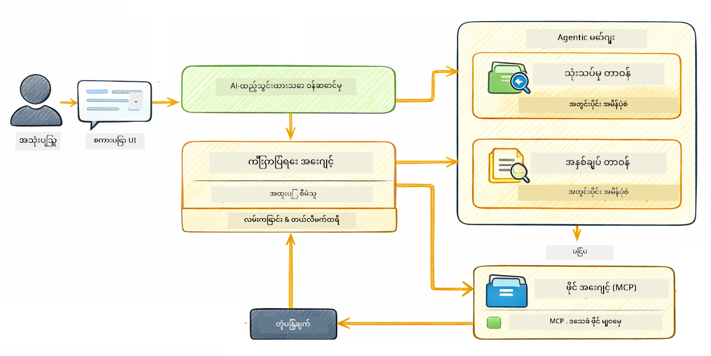

<!--
CO_OP_TRANSLATOR_METADATA:
{
  "original_hash": "f89f4c106d110e4943c055dd1a2f1dff",
  "translation_date": "2025-12-31T06:04:50+00:00",
  "source_file": "05-mcp/README.md",
  "language_code": "my"
}
-->
# Module 05: Model Context Protocol (MCP)

## အကြောင်းအရာ

- [သင် သင်ယူမယ့် အရာများ](../../../05-mcp)
- [MCP ဆိုတာဘာလဲ?](../../../05-mcp)
- [MCP ဘယ်လို အလုပ်လုပ်လဲ](../../../05-mcp)
- [Agentic မော်ဂျူး](../../../05-mcp)
- [နမူနာများ လည်ပတ်ခြင်း](../../../05-mcp)
  - [လိုအပ်ချက်များ](../../../05-mcp)
- [လျင်မြန်စတင်ခြင်း](../../../05-mcp)
  - [ဖိုင် လုပ်ငန်းများ (Stdio)](../../../05-mcp)
  - [Supervisor Agent](../../../05-mcp)
    - [ထွက်ပေါက်ကို နားလည်ခြင်း](../../../05-mcp)
    - [Agentic မော်ဂျူး လက္ခဏာများ ရှင်းပြချက်](../../../05-mcp)
- [အဓိက အယူအဆများ](../../../05-mcp)
- [ဂုဏ်ယူပါတယ်!](../../../05-mcp)
  - [နောက်တွင် ဘာ ရှိသနည်း?](../../../05-mcp)

## သင် သင်ယူမယ့် အရာများ

သင် conversational AI ကို တည်ဆောက်ဖူးပြီး၊ prompt များကို ကျွမ်းကျင်ပြီး၊ စာရွက်စာတမ်းများထဲကနေ ဖြေကြားချက်များကို အခြေခံစေဖို့ RAG တွဲဖက်ပြီး၊ tool တွေနဲ့ agents များကို ဖန်တီးဖူးပါပြီ။ ဒါပေမယ့် အဲဒီ tool အများအားလုံးကို သင့် application အတွက် အထူးပြုလုပ်ထားတာပဲ ဖြစ်တယ်။ AI ကို လူတိုင်း ဖန်တီးဝေစုနိုင်တဲ့ စံသတ်မှတ်ထားတဲ့ tool ပတ်ဝန်းကျင်တစ်ခုကို အသုံးပြုခွင့် ပေးနိုင်ရင် ဘယ်လိုလဲ? ဤmodule မှာ Model Context Protocol (MCP) နဲ့ LangChain4j ရဲ့ agentic မော်ဂျူးကို အသုံးပြုပြီး ထိုအရာကို ဘယ်လိုလုပ်ရမလဲ ဆွေးနွေးဖော်ပြပါမည်။ ပထမဦးဆုံး MCP ဖိုင်ဖတ်ကိရိယာ ပုံစံတစ်ခုကို ပြသပြီး ထို့နောက် Supervisor Agent စနစ်ကို အသုံးပြုပြီး advanced agentic workflow များထဲသို့ ဘယ်လို လွယ်ကူစွာ ပေါင်းစည်းမလဲ ဆိုတာကို ပြသပါမည်။

## MCP ဆိုတာဘာလဲ?

Model Context Protocol (MCP) က အကြောင်းအရာဖြစ်တဲ့ အရာကိုပဲထောက်ပံ့ပေးတယ် — AI application တွေ အတွက် အပြင်က tool တွေကို ရှာဖွေသုံးစွဲဖို့ စံနစ်တကျ နည်းလမ်းတစ်ခု ဖြစ်ပါတယ်။ တစ်ခုချင်းစီရဲ့ data source သို့မဟုတ် service အတွက် အထူးပြု code မရေးပဲ MCP server တွေကို ချိတ်ဆက်နိုင်ပြီး၊ ထို server များက ကိုယ်ပိုင်စွမ်းရည်များကို တူညီတဲ့ ပုံစံနဲ့ ထုတ်ပေးလိမ့်မယ်။ သင့် AI agent က အဆိုပါ tool များကို အလိုအလျောက် ရှာဖွေပြီး အသုံးပြုနိုင်ပါသည်။


*မကြာခင် MCP မတည်ရှိခင်: အချက်ချင်း-အချက်ချင်း အမိန့်ပို့ဆက်သွယ်မှုများ။ MCP တက်လာချိန်: တစ်ခုသော ပရိုတိုကောလ်၊ မနားဆောင့် အခွင့်အလမ်းများ။*

MCP က AI ဖွံ့ဖြိုးရေးမှာ သက်ရောက်ချက်ကြီးတဲ့ ပြဿနာတစ်ခုကို ဖြေရှင်းပေးသလို ဖြစ်ပါတယ် — ပိုင်းချင်းချိတ်ဆက်မှုတိုင်းကို အထူးပြုလုပ်ရတတ်ပါတယ်။ GitHub ကို ဝင်ရောက်ချင်လား? အထူး code ရေးရမယ်။ ဖိုင်တွေဖတ်ချင်လား? အထူး code ရေးရမယ်။ ဒေတာဘေ့စ်ကို မေးချင်လား? အထူး code ရေးရမယ်။ ဒါ့အပြင် ဒီ integration များဟာ အခြား AI application တွေနဲ့ မဟာမိတ်လမ်းမပေါက်ပါဘူး။

MCP က ဒီအားလုံးကို စံပြတက်စေပါတယ်။ MCP server တစ်ခုက tool များကို ရှင်းလင်းသော ဖော်ပြချက်များနဲ့ schema များဖြင့် ထုတ်ပေးသည်။ မည်သည့် MCP client မဆို ချိတ်ဆက်ပြီး ရရှိနိုင်သော tool များကို ရှာဖွေနိုင်ပြီး အသုံးပြုနိုင်သည်။ တစ်ခါတည်း တည်ဆောက်ပြီး ဘယ်နေရာမှာမဆို အသုံးပြုပါ။


*Model Context Protocol တည်ဆောက်ပုံ - စံသတ်မှတ်ထားသော tool ရှာဖွေရေးနှင့် အကောင်အထည်ဖော်ခြင်း*

## MCP ဘယ်လို အလုပ်လုပ်လဲ

**Server-Client ဖွဲ့စည်းပုံ**

MCP က client-server မော်ဒယ်ကို အသုံးပြုသည်။ ဆာဗာများက ဖိုင်ဖတ်ခြင်း၊ ဒေတာဘေ့စ် မေးခွန်းတွေ၊ API ခေါ်ဆိုခြင်းစတဲ့ tool တွေကို ပံ့ပိုးပေးတယ်။ Client များ (သင့် AI application) က ဆာဗာများကို ချိတ်ဆက်ပြီး ထို tool များကို အသုံးပြုသည်။

To use MCP with LangChain4j, add this Maven dependency:

```xml
<dependency>
    <groupId>dev.langchain4j</groupId>
    <artifactId>langchain4j-mcp</artifactId>
    <version>${langchain4j.version}</version>
</dependency>
```

**Tool Discovery**

သင့် client က MCP server တစ်ခုကို ချိတ်ဆက်သည့်အခါ "သင်ယခုဘယ်လို tool တွေရှိလဲ?" ဟု မေးလာမည်။ ဆာဗာက ရရှိနိုင်သော tool များကို စာရင်းပေးပြီး tool တစ်ခုချင်းစီအတွက် ဖော်ပြချက်များနှင့် parameter schema များကို ထည့်ပေးပါသည်။ မည်သည့် AI agent မှ ဆိုရင်လည်း အသုံးပြုသူ၏ တောင်းဆိုချက်အပေါ် မူတည်၍ ဘယ် tool ကို အသုံးပြုမည်ဆိုတာ ဆုံးဖြတ်နိုင်မည်။

**သယ်ယူပို့ဆောင်ရေး မက်ကန်နစ်များ**

MCP သည် မတူညီသော သယ်ယူပို့ဆောင်ရေး မက်ကန်နစ်များကို ထောက်ပံ့သည်။ ဤ module သည် local process များအတွက် Stdio transport ကို မိတ်ဆက်ပြသပါသည်။


*MCP ပို့ဆောင်ရေး မော်ဒယ်များ: ရှားရှားလင်းလင်း ဆာဗာတွေအတွက် HTTP, local process များအတွက် Stdio*

**Stdio** - [StdioTransportDemo.java](../../../05-mcp/src/main/java/com/example/langchain4j/mcp/StdioTransportDemo.java)

local process များအတွက် ဖြစ်သည်။ သင့် application က ဆာဗာကို subprocess အနေနဲ့ spawn လုပ်ကာ standard input/output မှတဆင့် ဆက်သွယ်သည်။ ဖိုင်စနစ် πρόσβαση သို့မဟုတ် command-line tool များကို အသုံးပြုရာတွင် အသုံးဝင်သည်။

```java
McpTransport stdioTransport = new StdioMcpTransport.Builder()
    .command(List.of(
        npmCmd, "exec",
        "@modelcontextprotocol/server-filesystem@2025.12.18",
        resourcesDir
    ))
    .logEvents(false)
    .build();
```

> **🤖 Try with [GitHub Copilot](https://github.com/features/copilot) Chat:** Open [`StdioTransportDemo.java`](../../../05-mcp/src/main/java/com/example/langchain4j/mcp/StdioTransportDemo.java) and ask:
> - "Stdio transport က ဘယ်လို အလုပ်လုပ်သလဲ၊ HTTP နဲ့ ယှဉ်လိုက်ရင် ဘယ်အချိန်တွင် သုံးသင့်သလဲ?"
> - "LangChain4j က spawned MCP server processes တွေရဲ့ lifecycle ကို ဘယ်လို စီမံထိန်းချုပ်သလဲ?"
> - "AI ကို ဖိုင်စနစ်သို့ လက်လှမ်းပေးခြင်းရဲ့ security implication များ ဘယ်လိုများ ရှိနိုင်သလဲ?"

## Agentic မော်ဂျူး

MCP က standardized tool များကို ပံ့ပိုးပေးသော်လည်း၊ LangChain4j ရဲ့ **agentic မော်ဂျူး** က ထို tool များကို အစီအစဉ်တကျ စီမံကိန်းချခြင်းအတွက် ကြေညာချက်အပေါ် မူတည်၍ agent များကို ဖန်တီးနိုင်သော နည်းလမ်းကို ပေးသည်။ `@Agent` annotation နဲ့ `AgenticServices` က သင့်ကို interface များမှတဆင့် agent အပြုအမူကို ဖော်ပြနိုင်စေပြီး imperative code မရေးငြင်းပေးသည်။

ဤ module တွင် သင်တက်ရောက်မယ့်အရာမှာ **Supervisor Agent** ပုံစံဖြစ်ပြီး — အသုံးပြုသူ၏ တောင်းဆိုချက်အပေါ် မူတည်၍ ဘယ် sub-agent ကို ဖျော်ဖြေခေါ်ယူမည်ကို dynamic အဖြစ် ဆုံးဖြတ်ပေးနိုင်သည့် advanced agentic AI နည်းလမ်းတစ်ခု ဖြစ်သည်။ ဤနှင့် MCP ကို ပေါင်းစည်းပြီး sub-agent တစ်ခုကို MCP ဖြင့် လုံးလုံး ဖိုင်ရေးဖတ်ခွင့် ပေးထားသည်ကို ပြသပါမည်။

To use the agentic module, add this Maven dependency:

```xml
<dependency>
    <groupId>dev.langchain4j</groupId>
    <artifactId>langchain4j-agentic</artifactId>
    <version>${langchain4j.mcp.version}</version>
</dependency>
```

> **⚠️ Experimental:** `langchain4j-agentic` module သည် **စမ်းသပ်ရေးအဆင့်** ဖြစ်ပြီး ပြောင်းလဲနိုင်သည်။ AI assistant များ ပိုမို တည်ငြိမ်စေရန် အကြောင်းအရာများကို ထည့်ရန် `langchain4j-core` နဲ့ custom tools တွေကို အသုံးပြုနေစဉ်ဖြစ်သည် (Module 04)။

## နမူနာများ လည်ပတ်ခြင်း

### လိုအပ်ချက်များ

- Java 21+, Maven 3.9+
- Node.js 16+ နှင့် npm (MCP server များအတွက်)
- `.env` ဖိုင်ထဲမှာ environment variables များ ပြင်ဆင်ထားရန် (root directory မှ):
  - **For StdioTransportDemo:** `GITHUB_TOKEN` (GitHub Personal Access Token)
  - **For SupervisorAgentDemo:** `AZURE_OPENAI_ENDPOINT`, `AZURE_OPENAI_API_KEY`, `AZURE_OPENAI_DEPLOYMENT` (Module 01-04 တွေကို ညီတူ)

> **မှတ်ချက်:** သင့် environment variables များ မပြင်ဆင်ထားသေးပါက [Module 00 - Quick Start](../00-quick-start/README.md) တွင် သတ်မှတ်ထားသော လမ်းညွန်များကို ကြည့်ပါ၊ သို့မဟုတ် root အတွင်း `.env.example` ကို `.env` အဖြစ် မိတ္တူ၍ သင့်တန်ဖိုးများဖြင့် ဖြည့်ပါ။

## လျင်မြန်စတင်ခြင်း

**VS Code အသုံးပြုခြင်း:** Explorer မှ demo ဖိုင်တစ်ဖိုင်ပေါ်ကို right-click လုပ်ပြီး **"Run Java"** ကိုရွေးချယ်ခြင်းဖြင့် သွားနိုင်ပါသည်၊ သို့မဟုတ် Run and Debug panel မှ launch configurations များကို အသုံးပြုနိုင်သည် (မလုပ်ခင် `.env` ဖိုင်ထဲသို့ သင့် token ထည့်ထားပါကို သေချာစေပါ)။

**Maven အသုံးပြုခြင်း:** အစားလည်း command line မှ တပ်ဆင်၍ နမူနာများကို အောက်ပါအတိုင်း run လိုက်နိုင်သည်။

### ဖိုင် လုပ်ငန်းများ (Stdio)

ဤနမူနာသည် local subprocess-based tool များကို ပြသသည်။

**✅ အထူးလိုအပ်ချက် မလိုအပ်ပါ** - MCP server ကို အလိုအလျောက် spawn လုပ်ပေးပါမည်။

**VS Code အသုံးပြုခြင်း:** `StdioTransportDemo.java` ကို right-click လုပ်ပြီး **"Run Java"** ကိုရွေးချယ်ပါ။

**Maven အသုံးပြုခြင်း:**

**Bash:**
```bash
export GITHUB_TOKEN=your_token_here
cd 05-mcp
mvn compile exec:java -Dexec.mainClass=com.example.langchain4j.mcp.StdioTransportDemo
```

**PowerShell:**
```powershell
$env:GITHUB_TOKEN=your_token_here
cd 05-mcp
mvn --% compile exec:java -Dexec.mainClass=com.example.langchain4j.mcp.StdioTransportDemo
```

Application က filesystem MCP server ကို အလိုအလျောက် spawn လုပ်ပြီး local ဖိုင်တစ်ခုကို ဖတ်သည်။ subprocess management ကို သင့်အတွက် မည်သို့ ကိုင်တွယ်ထားသည်ကို သတိထားရမည်။

**မျှော်မှန်းရလဒ်:**
```
Assistant response: The file provides an overview of LangChain4j, an open-source Java library
for integrating Large Language Models (LLMs) into Java applications...
```

### Supervisor Agent




**Supervisor Agent ပုံစံ** သည် agentic AI ၏ **ချွတ်ယွင်းနိုင်စွမ်းမြင့်** ဖက်ဘာဖြစ်သည်။ ထိပ်တန်းထားသော deterministic workflow များ (ဇယားလိုက်၊ loop, parallel) နှင့် ကွဲပြား၍ Supervisor သည် LLM ကိုသုံးပြီး အသုံးပြုသူ တောင်းဆိုချက်အပေါ် မူတည်၍ မည်သည့် agent များကို ခေါ်ယူမည်ကို ကိုယ်တိုင် ဆုံးဖြတ်သည်။

**Supervisor နဲ့ MCP ကို ပေါင်းစပ်ခြင်း:** ဤဥပမာတွင် `FileAgent` ကို MCP ဖိုင်စနစ် tool များသို့ `toolProvider(mcpToolProvider)` မှတဆင့် access ပေးထားသည်။ အသုံးပြုသူက "ဖိုင်ကို ဖတ်ပြီး စိစစ်ပါ" ဟူသော တောင်းဆိုချက်တစ်ခု ပေးသော်လည်း Supervisor က တောင်းဆိုချက်ကို အကဲဖြတ်ပြီး တာဝန်နှင့် agent များ အစီအစဉ်တစ်ခု ထုတ်ပြန်သည်။ ထို့နောက် ဆက်လက်ပြီး `FileAgent` သို့ routed လုပ်ကာ MCP ရဲ့ `read_file` tool ကို အသုံးပြု၍ ဖိုင်အကြောင်းအရာကို ယူဆောင်လာသည်။ Supervisor က ထိုအကြောင်းအရာကို `AnalysisAgent` ထံ ပို့ပြီး အဓိပ္ပာယ်ဖော်ပြချက်ကို လုပ်ဆောင်စေသည်၊ လိုအပ်လျှင် `SummaryAgent` ကို အကျဉ်းချုပ်ပေးရန် ခေါ်ယူနိုင်သည်။

ဤကိစ္စက MCP tool များသည် agentic workflow များထဲသို့ ပြဿနာမရှိပဲ ပေါင်းစည်းနိုင်ကြောင်း ပြသသည် — Supervisor သည် ဖိုင်များ ဘယ်လိုဖတ်သည်ကို မသိလိုလဲ၊ ရှိသေးသလို `FileAgent` က အဲဒီတာဝန်ကို လုပ်နိုင်တယ်ဆိုတာသာ သိနေပြီး အလုပ်ကို စီမံပေးနိုင်သည်။ Supervisor သည် တောင်းဆိုချက်အမျိုးအစား မျိုးစုံအပေါ် မူတည်၍ dynamic အဖြစ် အသစ်ပြောင်းလဲဖို့ စွမ်းရည်ရှိပြီး နောက်ဆုံးတွင် သတ်မှတ် agent ၏ response သို့မဟုတ် အလုပ်လုံးလုံး၏ အနှစ်ချုပ်ကို ပြန်ပေးနိုင်သည်။

**Start Scripts အသုံးပြုရန် (အကြံပြု):**

start scripts များသည် root `.env` ဖိုင်ထဲက environment variables များကို အလိုအလျောက် load ပြုလုပ်ပေးသည်။

**Bash:**
```bash
cd 05-mcp
chmod +x start.sh
./start.sh
```

**PowerShell:**
```powershell
cd 05-mcp
.\start.ps1
```

**VS Code အသုံးပြုခြင်း:** `SupervisorAgentDemo.java` ကို right-click လုပ်ပြီး **"Run Java"** ကိုရွေးချယ်ပါ (သင်၏ `.env` ဖိုင် သတ်မှတ်ထားသည်ကို အရင်စစ်ပါ)။

**Supervisor က ဘယ်လို လည်ပတ်သလဲ:**

```java
// သတ်မှတ်ထားသော စွမ်းရည်များရှိသော အေးဂျင့်များ အများအပြားကို သတ်မှတ်ပါ
FileAgent fileAgent = AgenticServices.agentBuilder(FileAgent.class)
        .chatModel(model)
        .toolProvider(mcpToolProvider)  // ဖိုင် လုပ်ဆောင်ချက်များအတွက် MCP ကိရိယာများပါရှိသည်
        .build();

AnalysisAgent analysisAgent = AgenticServices.agentBuilder(AnalysisAgent.class)
        .chatModel(model)
        .build();

SummaryAgent summaryAgent = AgenticServices.agentBuilder(SummaryAgent.class)
        .chatModel(model)
        .build();

// ဤအေးဂျင့်များကို ညှိနှိုင်းပေးသည့် Supervisor ကို ဖန်တီးပါ
SupervisorAgent supervisor = AgenticServices.supervisorBuilder()
        .chatModel(model)  // "planner" မော်ဒယ်
        .subAgents(fileAgent, analysisAgent, summaryAgent)
        .responseStrategy(SupervisorResponseStrategy.SUMMARY)
        .build();

// Supervisor သည် ကိုယ်တိုင် မည်သည့် အေးဂျင့်များကို ခေါ်သုံးမည်ကို ဆုံးဖြတ်သည်
// သဘာဝဘာသာဖြင့် တောင်းဆိုချက်တစ်ခုသာ ပေးပါ - LLM သည် အကောင်အထည်ဖော်ရန် အစီအစဉ်ရေးဆွဲပေးသည်
String response = supervisor.invoke("Read the file at /path/file.txt and analyze it");
```

ပြည့်စုံ implementation အတွက် [SupervisorAgentDemo.java](../../../05-mcp/src/main/java/com/example/langchain4j/mcp/SupervisorAgentDemo.java) ကို ကြည့်ပါ။

> **🤖 Try with [GitHub Copilot](https://github.com/features/copilot) Chat:** Open [`SupervisorAgentDemo.java`](../../../05-mcp/src/main/java/com/example/langchain4j/mcp/SupervisorAgentDemo.java) and ask:
> - "Supervisor က ဘယ်လို agents တွေကို ခေါ်ယူရမလဲဆိုတာ ဆုံးဖြတ်သနည်း?"
> - "Supervisor နဲ့ Sequential workflow pattern တို့ အကြား ကွာခြားချက် ဘာလဲ?"
> - "Supervisor ၏ planning conduct ကို ဘယ်လို custom ပြုလုပ်နိုင်သလဲ?"

#### ထွက်ပေါက်ကို နားလည်ခြင်း

Demo ကို run လိုက်လျှင် Supervisor က မည်သို့ agent အများကို စီမံခန့်ခွဲသလဲဆိုသော ဖော်ပြချက်အဆင့်ဆင့်ကို ကြည့်ရှုနိုင်မည်။ ဤနေရာတိုင်းရဲ့ အဓိက အဓိပ္ပါယ်如下:

```
======================================================================
  SUPERVISOR AGENT DEMO
======================================================================

This demo shows how a Supervisor Agent orchestrates multiple specialized agents.
The Supervisor uses an LLM to decide which agent to call based on the task.
```

**ခေါင်းစဉ်** မှာ demo ကို ရင်းနှီးစွာ မိတ်ဆက်ပြီး core concept ကို ရှင်းပြသည် — Supervisor သည် hardcoded စည်းမျဉ်းမဟုတ်သော LLM ကို အသုံးပြုပြီး agent များကို ခေါ်ယူသည်။

```
--- AVAILABLE AGENTS -------------------------------------------------
  [FILE]     FileAgent     - Reads files using MCP filesystem tools
  [ANALYZE]  AnalysisAgent - Analyzes content for structure, tone, and themes
  [SUMMARY]  SummaryAgent  - Creates concise summaries of content
```

**ရရှိနိုင်သော Agents** သည် Supervisor က ရွေးချယ်နိုင်သော အထူးပြု agent သုံးခုကို ပြပါသည်။ Agent တစ်ခုချင်းစီတွင် ထူးခြားသော အင်အားရှိသည်:
- **FileAgent** သည် MCP tool များကို အသုံးပြု၍ ဖိုင်များကို ဖတ်နိုင်သည် (external capability)
- **AnalysisAgent** သည် အကြောင်းအရာကို ခွဲခြမ်းစိတ်ဖြာသည် (pure LLM capability)
- **SummaryAgent** သည် အကျဉ်းချုပ်များ ဖန်တီးပေးသည် (pure LLM capability)

```
--- USER REQUEST -----------------------------------------------------
  "Read the file at .../file.txt and analyze what it's about"
```

**User Request** သည် အသုံးပြုသူက မေးထားသော အရာကို ဖော်ပြသည်။ Supervisor သည် ဤကို ပို့ချပြီး ဘယ် agent များကို ခေါ်ယူရမည်ဆိုတာ ခွဲခြမ်းစစ်ဆေးရမည်။

```
--- SUPERVISOR ORCHESTRATION -----------------------------------------
  The Supervisor will now decide which agents to invoke and in what order...

  +-- STEP 1: Supervisor chose -> FileAgent (reading file via MCP)
  |
  |   Input: .../file.txt
  |
  |   Result: LangChain4j is an open-source Java library designed to simplify...
  +-- [OK] FileAgent (reading file via MCP) completed

  +-- STEP 2: Supervisor chose -> AnalysisAgent (analyzing content)
  |
  |   Input: LangChain4j is an open-source Java library...
  |
  |   Result: Structure: The content is organized into clear paragraphs that int...
  +-- [OK] AnalysisAgent (analyzing content) completed
```

**Supervisor အစီအစဉ်ချမှု** မှာ မှန်ကန်မှုဖြစ်စေသော အကျိုးမျိုးတွေ ဖြစ်ပေါ်သည်။ ကောင်းမွန်စွာ သတိထားကြည့်ပါ:
1. Supervisor က **ပထမဆုံး FileAgent ကို ရွေးချယ်ခဲ့သည်** — စကားတွင် "ဖိုင်ဖတ်ပါ" ဟု ဖေါ်ပြထားသဖြင့်
2. FileAgent က MCP ၏ `read_file` tool ကို အသုံးပြုကာ ဖိုင်အကြောင်းအရာကို ယူလာသည်
3. ထို့နောက် Supervisor က **AnalysisAgent ကို ရွေးချယ်** ပြီး ဖိုင်အကြောင်းအရာကို ပို့သည်
4. AnalysisAgent က ဖွဲ့စည်းပုံ၊ အသံနှင့် အဓိပ္ပါယ်များကို ခွဲခြမ်းစိစစ်သည်

Supervisor က ဤဆုံးဖြတ်ချက်များကို အသုံးပြုသူ၏ တောင်းဆိုချက်အပေါ် မူတည်၍ **ကိုယ်ပိုင်အလိုအလျောက်** ဆောင်ရွက်ခဲ့ကြောင်း သတိထားပါ — hardcoded workflow မရှိပါ။

**နောက်ဆုံး ဖြေကြားချက်** သည် Supervisor က ခေါ်ယူခဲ့သည့် agent အားလုံး၏ ထုတ်လွှင့်ချက်များကို ပေါင်းစပ်ပြီး ထုတ်ပေးသည်။ ဥပမာ demo က agentic scope ကို dump လုပ်ကာ သတ်မှတ်ထားသော agent များ၏ summary နှင့် analysis ရလဒ်များကို ပြပါသည်။

```
--- FINAL RESPONSE ---------------------------------------------------
I read the contents of the file and analyzed its structure, tone, and key themes.
The file introduces LangChain4j as an open-source Java library for integrating
large language models...

--- AGENTIC SCOPE (Shared Memory) ------------------------------------
  Agents store their results in a shared scope for other agents to use:
  * summary: LangChain4j is an open-source Java library...
  * analysis: Structure: The content is organized into clear paragraphs that in...
```

### Agentic မော်ဂျူး လက္ခဏာများ ရှင်းပြချက်

ဥပမာသည် agentic မော်ဂျူး၏ အဆင့်မြင့် လက္ခဏာများ အချို့ကို ပြသသည်။ Agentic Scope နှင့် Agent Listeners အကြောင်း နည်းနည်း ဆက်ရှင်းကြည့်မည်။

**Agentic Scope** သည် agent များကို `@Agent(outputKey="...")` ဖြင့် ထုတ်လွှင့်ထားသော ရလဒ်များကို သိမ်းဆည်းထားသည့် shared memory ဖြစ်သည်။ ၎င်းက:
- နောက်ထပ် agent များသည် အစပိုင်း agent များ၏ output များကို access ရရှိစေသည်
- Supervisor သည် နောက်ဆုံး ပြန်ပေးမည့် response ကို synthesis ဖန်တီးနိုင်သည်
- သင်သည် အားလုံး၏ ထုတ်ကုန်များကို စစ်ဆေးနိုင်သည်

```java
ResultWithAgenticScope<String> result = supervisor.invokeWithAgenticScope(request);
AgenticScope scope = result.agenticScope();
String story = scope.readState("story");
List<AgentInvocation> history = scope.agentInvocations("analysisAgent");
```

**Agent Listener** များက agent အကောင်အထည်ဖော်မှုကို ကြီးကြပ်စစ်ဆေးရာတွင် အထောက်အကူပြုသည်။ demo မှာ တွေ့ရသော အဆင့်ဆင့် output များသည် AgentListener တစ်ခုက agent ခေါ်ယူမှုတိုင်းမှာ hook လုပ်ထားရာမှ ထွက်ပေါ်လာသည်။
- **beforeAgentInvocation** - Supervisor က agent တစ်ခုရွေးချယ်သည့်အခါ ခေါ်မည်၊ ဘယ် agent ရွေးချယ်သလဲ၊ ရွေးချယ်မှုအကြောင်းရင်းကို ကြည့်ရန်
- **afterAgentInvocation** - agent တစ်ခု ပြီးဆုံးသည့်အခါ ခေါ်မည်၊ ၎င်း၏ ရလဒ်ကို ဖော်ပြရန်
- **inheritedBySubagents** - true ဖြစ်လျှင် listener သည် အစုလိုက်အပြုံလိုက် hierarchy ထဲရှိ agent တစ်ခုချင်းစီကို ကြီးကြပ်သည်

```java
AgentListener monitor = new AgentListener() {
    private int step = 0;
    
    @Override
    public void beforeAgentInvocation(AgentRequest request) {
        step++;
        System.out.println("  +-- STEP " + step + ": " + request.agentName());
    }
    
    @Override
    public void afterAgentInvocation(AgentResponse response) {
        System.out.println("  +-- [OK] " + response.agentName() + " completed");
    }
    
    @Override
    public boolean inheritedBySubagents() {
        return true; // အားလုံးသော အောက်ခံ အေးဂျင့်များသို့ ဖြန့်ချိပါ
    }
};
```

Supervisor ပုံစံအပြင် `langchain4j-agentic` module သည် အောက်ပါ workflow pattern များနှင့် အင်အားပြင်း features များကို ပံ့ပိုးပေးသည်။

| Pattern | Description | Use Case |
|---------|-------------|----------|
| **Sequential** | Agent များကို အစဉ်လိုက် အလုပ်လုပ်စေပါသည်၊ output သည် နောက်တစ်ခုသို့ ဆက်သွယ်ပေးသည် | Pipeline များ: သုတေသန → ခွဲခြမ်းစိစစ် → အစီရင်ခံစာ |
| **Parallel** | Agent များကို တပြိုင်နက် run လုပ်သည် | မူလစီမံထားသော task များ: ရာသီဥတု + သတင်း + စတော့ရှယ်ယာ |
| **Loop** | သတ်မှတ်ထားသည့် အခြေအနေ မ ဖြည့်မီ ထပ်ခေါ်ဆက်ရုံ | အရည်အသွေး အကဲဖြတ်ခြင်း: rating ≥ 0.8 မရသေးသည့်အထိ ပြန်လည်တိုးတက်မှု |
| **Conditional** | အခြေအနေပေါ် မူတည်၍ routing ပြုလုပ်သည် | အုပ်စုခွဲခြင်း → အထူးကျွမ်းကျင်သူ agent သို့ လမ်းမောင်းခြင်း |
| **Human-in-the-Loop** | လူသား checkpoint များ ထည့်သွင်းသည် | အတည်ပြု လုပ်ငန်းစဉ်များ၊ အကြောင်းအရာစစ်ဆေးခြင်း |

## အဓိက အယူအဆများ

**MCP** သည် ရှိပြီးသား tool ပတ်ဝန်းကျင်များကို အသုံးချချင်သည်၊ အတူတကွအသုံးပြုနိုင်သော tool များကို ဖန်တီးလိုသည်၊ third-party service များကို စံသတ်မှတ်ထားသော protocol များဖြင့် ပေါင်းစည်းလိုသည်၊ သို့မဟုတ် code မပြောင်းဘဲ tool implementation များကို လဲလှယ်ချင်သည့်အခါ အထူးသင့်လျော်သည်။

**Agentic မော်ဂျူး** သည် `@Agent` annotation များဖြင့် ကြေညာချက်အပေါ် မူတည်၍ agent များကို သတ်မှတ်ချင်သည်၊ workflow orchestration (sequential, loop, parallel) လိုအပ်သည်၊ interface-based agent design ကို အလေးထား၍ imperative code ထက် preferr လုပ်ချင်သည်၊ သို့မဟုတ် `outputKey` ဖြင့် အချက်အလက်မျှဝေသော agent များစုပေါင်းလိုသောအခါ အကောင်းဆုံး ဖြစ်သည်။

**Supervisor Agent ပုံစံ** သည် အလုပ်စဉ်ကို ကြိုတန်း မသိနိုင်သည့်အခါ LLM ကို အသုံးပြု၍ ဆုံးဖြတ်ခွင့်ပေးချင်သည်၊ အထူးပြု agent များစွာကို dynamic ကြီးကြပ်ရန်လိုသည်၊ တစ်ချို့ capability များသို့ စကားဝိုင်းတစ်ခုအတွင်း routing လုပ်မည့် conversational system များ တည်ဆောက်ချင်သည်၊ သို့မဟုတ် အလွန်ကို မျိုးရိုးမဲ့၊ တက်လှမ်းနိုင်သော agent အပြုအမူ များလိုချင်သည့်အခါ ထူးခြားစွာ အသုံးဝင်သည်။

## ဂုဏ်ယူပါတယ်!

LangChain4j for Beginners course ကို သင်ပြီးစီးလိုက်ပါပြီ။ သင်အောက်ပါ အရာများကို ပိုင်ဆိုင်ပြီဖြစ်သည် -

- Memory ပါဝင်သော conversational AI တည်ဆောက်နည်း (Module 01)
- မတူညီသော တာဝန်များအတွက် prompt engineering နည်းလမ်းများ (Module 02)
- Document များအပေါ် အခြေခံ၍ ဖြေကြားချက်များကို အမြဲတမ်း အခြေခံပေးမှု (RAG) (Module 03)
- custom tools များနဲ့ အခြေခံ AI agents (assistants) ဖန်တီးခြင်း (Module 04)
- LangChain4j MCP နှင့် Agentic modules များအတွက် စံနှုန်းတကျ ကိရိယာများကို ပေါင်းစည်းခြင်း (Module 05)

### နောက်တစ်ဆင့်?

မော်ဂျူးများကို ပြီးမြောက်ပြီးနောက်၊ LangChain4j စမ်းသပ်ခြင်း အယူအဆများကို လက်တွေ့ အလုပ်လုပ်ပုံတွင် ကြည့်ရန် [စမ်းသပ်ခြင်းလမ်းညွှန်](../docs/TESTING.md) ကို ရှာဖွေပါ။

  
**တရားဝင် အရင်းအမြစ်များ:**
- [LangChain4j Documentation](https://docs.langchain4j.dev/) - ပြည့်စုံသော လမ်းညွှန်များနှင့် API ကိုးကားချက်များ
- [LangChain4j GitHub](https://github.com/langchain4j/langchain4j) - မူရင်း ကုဒ်များနှင့် ဥပမာများ
- [LangChain4j Tutorials](https://docs.langchain4j.dev/tutorials/) - အမျိုးမျိုးသော အသုံးအနှုန်းများအတွက် အဆင့်လိုက် သင်ခန်းစာများ

သင်တန်းကို ပြီးမြောက်ခဲ့တာအတွက် ကျေးဇူးတင်ပါတယ်!

---

**လမ်းကြောင်း:** [← ယခင်: Module 04 - ကိရိယာများ](../04-tools/README.md) | [ပင်မသို့ ပြန်သွားရန်](../README.md)

---

<!-- CO-OP TRANSLATOR DISCLAIMER START -->
တာဝန်ငြင်းဆိုချက်:
ဤစာတမ်းကို AI ဘာသာပြန်ဝန်ဆောင်မှုဖြစ်သည့် [Co-op Translator](https://github.com/Azure/co-op-translator) ကို အသုံးပြု၍ ဘာသာပြန်ထားပါသည်။ ကျွန်ုပ်တို့သည် တိကျမှုအတွက် ကြိုးစားပါသော်လည်း အလိုအလျှောက် ဘာသာပြန်ချက်များတွင် အမှားများ သို့မဟုတ် မမှန်ကန်မှုများ ဖြစ်ပေါ်နိုင်ကြောင်း သတိထားရန် လိုအပ်ပါသည်။ မူလဘာသာဖြင့် ရှိသော မူရင်းစာတမ်းကို တရားဝင် အချက်အလက် အရင်းအမြစ်အဖြစ် ဦးစားပေးစဉ်းစားသင့်ပါသည်။ အရေးကြီးသည့် အချက်အလက်များအတွက်မှာတော့ ပရော်ဖက်ရှင်နယ် လူသားဘက်မှ ဘာသာပြန်ခြင်းကို အကြံပြုပါသည်။ ဤဘာသာပြန်ချက်ကို အသုံးပြုမှုကြောင့် ဖြစ်ပေါ်နိုင်သည့် နားလည်မှုမှားခြင်းများ သို့မဟုတ် မှားဖတ်ချက်များအတွက် ကျွန်ုပ်တို့အား တာဝန်မယူပါ။
<!-- CO-OP TRANSLATOR DISCLAIMER END -->