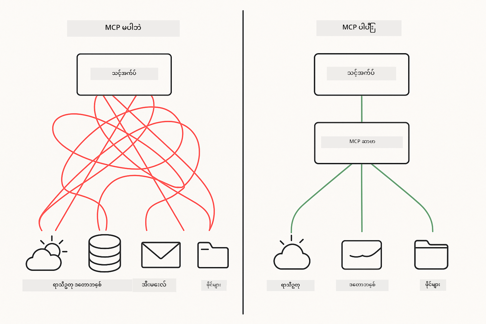
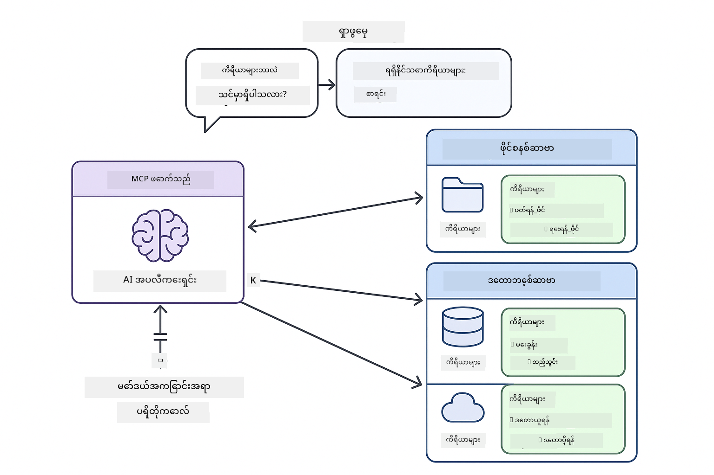

<!--
CO_OP_TRANSLATOR_METADATA:
{
  "original_hash": "c25ec1f10ef156c53e190cdf8b0711ab",
  "translation_date": "2025-12-13T18:09:10+00:00",
  "source_file": "05-mcp/README.md",
  "language_code": "my"
}
-->
# Module 05: Model Context Protocol (MCP)

## Table of Contents

- [What You'll Learn](../../../05-mcp)
- [Understanding MCP](../../../05-mcp)
- [How MCP Works](../../../05-mcp)
  - [Server-Client Architecture](../../../05-mcp)
  - [Tool Discovery](../../../05-mcp)
  - [Transport Mechanisms](../../../05-mcp)
- [Prerequisites](../../../05-mcp)
- [What This Module Covers](../../../05-mcp)
- [Quick Start](../../../05-mcp)
  - [Example 1: Remote Calculator (Streamable HTTP)](../../../05-mcp)
  - [Example 2: File Operations (Stdio)](../../../05-mcp)
  - [Example 3: Git Analysis (Docker)](../../../05-mcp)
- [Key Concepts](../../../05-mcp)
  - [Transport Selection](../../../05-mcp)
  - [Tool Discovery](../../../05-mcp)
  - [Session Management](../../../05-mcp)
  - [Cross-Platform Considerations](../../../05-mcp)
- [When to Use MCP](../../../05-mcp)
- [MCP Ecosystem](../../../05-mcp)
- [Congratulations!](../../../05-mcp)
  - [What's Next?](../../../05-mcp)
- [Troubleshooting](../../../05-mcp)

## What You'll Learn

သင်သည် စကားပြော AI ကို တည်ဆောက်ပြီး၊ prompt များကို ကျွမ်းကျင်စွာ အသုံးပြုနိုင်ပြီး၊ စာရွက်စာတမ်းများအပေါ် အခြေခံ၍ တုံ့ပြန်ချက်များ ပေးနိုင်ပြီး၊ ကိရိယာများပါသော agent များကို ဖန်တီးနိုင်ခဲ့ပါသည်။ သို့သော် အဲဒီကိရိယာများအားလုံးကို သင့်ရဲ့ အထူးသီးသန့် application အတွက်သာ ဖန်တီးထားသည်။ သင်၏ AI ကို မည်သူမဆို ဖန်တီး၍ မျှဝေနိုင်သော စံပြ ကိရိယာများ စနစ်တကျ အသုံးပြုခွင့် ပေးနိုင်ခဲ့ရင် ဘယ်လို ဖြစ်မလဲ?

Model Context Protocol (MCP) သည် အဲဒီလိုပဲ ဖြစ်စေသည် - AI application များအတွက် ပြင်ပကိရိယာများကို ရှာဖွေပြီး အသုံးပြုနိုင်ရန် စံနမူနာတစ်ခုကို ပေးသည်။ ဒေတာရင်းမြစ် သို့မဟုတ် ဝန်ဆောင်မှု တစ်ခုချင်းစီအတွက် စိတ်ကြိုက် ပေါင်းစည်းမှု မရေးဘဲ MCP server များနှင့် ချိတ်ဆက်ပြီး ၎င်းတို့၏ စွမ်းဆောင်ရည်များကို တူညီသော ပုံစံဖြင့် ဖော်ပြထားသည်။ သင့် AI agent သည် အဲဒီကိရိယာများကို အလိုအလျောက် ရှာဖွေပြီး အသုံးပြုနိုင်သည်။



*MCP မတိုင်မီ - အဆင်မပြေသော point-to-point ပေါင်းစည်းမှုများ။ MCP ပြီးနောက် - protocol တစ်ခု၊ အလွန်အမင်း အခွင့်အလမ်းများ။*

## Understanding MCP

MCP သည် AI ဖွံ့ဖြိုးတိုးတက်မှုတွင် အခြေခံပြဿနာတစ်ခုကို ဖြေရှင်းသည် - ပေါင်းစည်းမှုတိုင်းသည် စိတ်ကြိုက်ဖြစ်သည်။ GitHub ကို အသုံးပြုချင်ပါသလား? စိတ်ကြိုက်ကုဒ်ရေးပါ။ ဖိုင်များ ဖတ်ချင်ပါသလား? စိတ်ကြိုက်ကုဒ်ရေးပါ။ ဒေတာဘေ့စ်ကို မေးမြန်းချင်ပါသလား? စိတ်ကြိုက်ကုဒ်ရေးပါ။ အဲဒီပေါင်းစည်းမှုများသည် အခြား AI application များနှင့် မအလုပ်လုပ်ပါ။

MCP သည် အဲဒီကို စံပြအဖြစ် သတ်မှတ်ပေးသည်။ MCP server တစ်ခုသည် ကိရိယာများကို ရှင်းလင်းသော ဖော်ပြချက်များနှင့် schema များဖြင့် ဖော်ပြသည်။ MCP client များသည် ချိတ်ဆက်၍ ရနိုင်သော ကိရိယာများကို ရှာဖွေပြီး အသုံးပြုနိုင်သည်။ တစ်ကြိမ်တည်ဆောက်ပြီး နေရာတိုင်းတွင် အသုံးပြုပါ။



*Model Context Protocol အင်ဂျင်နီယာ - စံပြ ကိရိယာ ရှာဖွေရေးနှင့် အကောင်အထည်ဖော်ခြင်း*

## How MCP Works

**Server-Client Architecture**

MCP သည် client-server မော်ဒယ်ကို အသုံးပြုသည်။ Server များသည် ဖိုင်ဖတ်ခြင်း၊ ဒေတာဘေ့စ် မေးမြန်းခြင်း၊ API ခေါ်ဆိုခြင်း ကိရိယာများကို ပေးသည်။ Client များ (သင့် AI application) သည် server များနှင့် ချိတ်ဆက်ပြီး ၎င်းတို့၏ ကိရိယာများကို အသုံးပြုသည်။

**Tool Discovery**

သင့် client သည် MCP server နှင့် ချိတ်ဆက်သောအခါ "သင်မှာ ဘယ်ကိရိယာတွေရှိလဲ?" ဟု မေးသည်။ Server သည် ရနိုင်သော ကိရိယာများစာရင်းကို ဖော်ပြပြီး၊ တစ်ခုချင်းစီတွင် ဖော်ပြချက်များနှင့် parameter schema များ ပါရှိသည်။ သင့် AI agent သည် အသုံးပြုသူ တောင်းဆိုချက်အပေါ် မူတည်၍ ဘယ်ကိရိယာများ အသုံးပြုမည်ကို ဆုံးဖြတ်နိုင်သည်။

**Transport Mechanisms**

MCP သည် သယ်ယူပို့ဆောင်မှု မော်ဒယ် နှစ်မျိုး သတ်မှတ်ထားသည် - အဝေးမှ server များအတွက် HTTP၊ ဒေသခံ process များအတွက် Stdio (Docker container များပါဝင်သည်) -


*MCP သယ်ယူပို့ဆောင်မှု မော်ဒယ်များ - အဝေးမှ server များအတွက် HTTP၊ ဒေသခံ process များအတွက် Stdio (Docker container များပါဝင်သည်)*

**Streamable HTTP** - [StreamableHttpDemo.java](../../../05-mcp/src/main/java/com/example/langchain4j/mcp/StreamableHttpDemo.java)

အဝေးမှ server များအတွက်။ သင့် application သည် ကွန်ရက်ပေါ်ရှိ server တစ်ခုသို့ HTTP request များ ပေးပို့သည်။ Server-Sent Events ကို အသုံးပြု၍ အချိန်နှင့်တပြေးညီ ဆက်သွယ်မှု ပြုလုပ်သည်။

```java
McpTransport httpTransport = new StreamableHttpMcpTransport.Builder()
    .url("http://localhost:3001/mcp")
    .timeout(Duration.ofSeconds(60))
    .logRequests(true)
    .logResponses(true)
    .build();
```

> **🤖 [GitHub Copilot](https://github.com/features/copilot) Chat ဖြင့် စမ်းသပ်ပါ:** [`StreamableHttpDemo.java`](../../../05-mcp/src/main/java/com/example/langchain4j/mcp/StreamableHttpDemo.java) ဖိုင်ကို ဖွင့်ပြီး မေးမြန်းပါ -
> - "Module 04 ကဲ့သို့ တိုက်ရိုက် ကိရိယာ ပေါင်းစည်းမှုနှင့် MCP ကွာခြားချက်များ ဘာတွေလဲ?"
> - "MCP ကို ကိရိယာ မျှဝေမှုအတွက် အသုံးပြုခြင်း၏ အကျိုးကျေးဇူးများ ဘာတွေလဲ?"
> - "MCP server များသို့ ချိတ်ဆက်မှု မအောင်မြင်ခြင်း သို့မဟုတ် အချိန်ကုန်ဆုံးခြင်းကို မည်သို့ ကိုင်တွယ်မလဲ?"

**Stdio** - [StdioTransportDemo.java](../../../05-mcp/src/main/java/com/example/langchain4j/mcp/StdioTransportDemo.java)

ဒေသခံ process များအတွက်။ သင့် application သည် server ကို subprocess အဖြစ် ဖန်တီးပြီး standard input/output ဖြင့် ဆက်သွယ်သည်။ ဖိုင်စနစ် အသုံးပြုခြင်း သို့မဟုတ် command-line ကိရိယာများအတွက် အသုံးဝင်သည်။

```java
McpTransport stdioTransport = new StdioMcpTransport.Builder()
    .command(List.of(
        npmCmd, "exec",
        "@modelcontextprotocol/server-filesystem@0.6.2",
        resourcesDir
    ))
    .logEvents(false)
    .build();
```

> **🤖 [GitHub Copilot](https://github.com/features/copilot) Chat ဖြင့် စမ်းသပ်ပါ:** [`StdioTransportDemo.java`](../../../05-mcp/src/main/java/com/example/langchain4j/mcp/StdioTransportDemo.java) ဖိုင်ကို ဖွင့်ပြီး မေးမြန်းပါ -
> - "Stdio သယ်ယူပို့ဆောင်မှု ဘယ်လို အလုပ်လုပ်ပြီး HTTP နှင့် ဘယ်အချိန်တွင် သုံးသင့်သလဲ?"
> - "LangChain4j သည် MCP server process များ၏ အသက်တာစဉ်ကို မည်သို့ စီမံခန့်ခွဲသလဲ?"
> - "AI ကို ဖိုင်စနစ် အသုံးပြုခွင့် ပေးခြင်း၏ လုံခြုံရေး အကျိုးသက်ရောက်မှုများ ဘာတွေလဲ?"

**Docker (uses Stdio)** - [GitRepositoryAnalyzer.java](../../../05-mcp/src/main/java/com/example/langchain4j/mcp/GitRepositoryAnalyzer.java)

containerized ဝန်ဆောင်မှုများအတွက်။ `docker run` ဖြင့် Docker container နှင့် stdio သယ်ယူပို့ဆောင်မှုကို အသုံးပြု၍ ဆက်သွယ်သည်။ ရှုပ်ထွေးသော အခြေခံပစ္စည်းများ သို့မဟုတ် သီးခြား ပတ်ဝန်းကျင်များအတွက် သင့်တော်သည်။

```java
McpTransport dockerTransport = new StdioMcpTransport.Builder()
    .command(List.of(
        "docker", "run",
        "-e", "GITHUB_PERSONAL_ACCESS_TOKEN=" + System.getenv("GITHUB_TOKEN"),
        "-v", volumeMapping,
        "-i", "mcp/git"
    ))
    .logEvents(true)
    .build();
```

> **🤖 [GitHub Copilot](https://github.com/features/copilot) Chat ဖြင့် စမ်းသပ်ပါ:** [`GitRepositoryAnalyzer.java`](../../../05-mcp/src/main/java/com/example/langchain4j/mcp/GitRepositoryAnalyzer.java) ဖိုင်ကို ဖွင့်ပြီး မေးမြန်းပါ -
> - "Docker သယ်ယူပို့ဆောင်မှုသည် MCP server များကို မည်သို့ သီးခြားထားပြီး အကျိုးကျေးဇူးများ ဘာတွေလဲ?"
> - "host နှင့် MCP container များအကြား ဒေတာမျှဝေရန် volume mount များကို မည်သို့ ပြင်ဆင်မလဲ?"
> - "ထုတ်လုပ်မှုတွင် Docker-based MCP server lifecycle များကို စီမံခန့်ခွဲရာတွင် အကောင်းဆုံး လေ့လာမှုများ ဘာတွေလဲ?"

## Running the Examples

### Prerequisites

- Java 21+, Maven 3.9+
- Node.js 16+ နှင့် npm (MCP server များအတွက်)
- **Docker Desktop** - Example 3 အတွက် **RUNNING** ဖြစ်ရမည် (install လုပ်ထားခြင်းသာ မဟုတ်)
- GitHub Personal Access Token ကို `.env` ဖိုင်တွင် ပြင်ဆင်ထားရမည် (Module 00 မှ)

> **မှတ်ချက်:** သင့် GitHub token ကို မသတ်မှတ်ထားသေးပါက [Module 00 - Quick Start](../00-quick-start/README.md) ကို ကြည့်ပါ။

> **⚠️ Docker အသုံးပြုသူများ:** Example 3 ကို စတင်မပြုမီ `docker ps` ဖြင့် Docker Desktop သည် RUNNING ဖြစ်ကြောင်း အတည်ပြုပါ။ ချိတ်ဆက်မှု အမှားများ တွေ့ပါက Docker Desktop ကို စတင်ပြီး ~၃၀ စက္ကန့် ခန့် စောင့်ပါ။

## Quick Start

**VS Code အသုံးပြုခြင်း:** Explorer တွင် မည်သည့် demo ဖိုင်ကိုမဆို right-click ပြုလုပ်ပြီး **"Run Java"** ကို ရွေးချယ်ပါ၊ သို့မဟုတ် Run and Debug panel မှ launch configuration များကို အသုံးပြုပါ (token ကို `.env` ဖိုင်တွင် ထည့်သွင်းထားပြီးဖြစ်ရမည်)။

**Maven အသုံးပြုခြင်း:** အခြားနည်းလမ်းအဖြစ် command line မှ အောက်ပါ ဥပမာများဖြင့် ပြေးနိုင်သည်။

**⚠️ အရေးကြီး:** ဥပမာတချို့တွင် MCP server စတင်ခြင်း သို့မဟုတ် Docker image များ တည်ဆောက်ခြင်း ကဲ့သို့သော အခြေခံလိုအပ်ချက်များ ရှိသည်။ ဥပမာတိုင်း၏ လိုအပ်ချက်များကို စစ်ဆေးပြီး ပြေးပါ။

### Example 1: Remote Calculator (Streamable HTTP)

ကွန်ရက်ပေါ်တွင် အခြေခံ ကိရိယာ ပေါင်းစည်းမှုကို ပြသသည်။

**⚠️ လိုအပ်ချက်:** MCP server ကို ပထမဦးစွာ စတင်ရမည် (အောက်ပါ Terminal 1 ကို ကြည့်ပါ)။

**Terminal 1 - MCP server စတင်ရန်:**

**Bash:**
```bash
git clone https://github.com/modelcontextprotocol/servers.git
cd servers/src/everything
npm install
node dist/streamableHttp.js
```

**PowerShell:**
```powershell
git clone https://github.com/modelcontextprotocol/servers.git
cd servers/src/everything
npm install
node dist/streamableHttp.js
```

**Terminal 2 - ဥပမာကို ပြေးရန်:**

**VS Code အသုံးပြုခြင်း:** `StreamableHttpDemo.java` ကို right-click ပြုလုပ်ပြီး **"Run Java"** ကို ရွေးချယ်ပါ။

**Maven အသုံးပြုခြင်း:**

**Bash:**
```bash
export GITHUB_TOKEN=your_token_here
cd 05-mcp
mvn compile exec:java -Dexec.mainClass=com.example.langchain4j.mcp.StreamableHttpDemo
```

**PowerShell:**
```powershell
$env:GITHUB_TOKEN=your_token_here
cd 05-mcp
mvn --% compile exec:java -Dexec.mainClass=com.example.langchain4j.mcp.StreamableHttpDemo
```

AI agent သည် ရနိုင်သော ကိရိယာများကို ရှာဖွေပြီး ကိန်းဂဏန်းတွက်ချက်မှုကို အသုံးပြု၍ ပေါင်းခြင်း လုပ်ဆောင်သည်။

### Example 2: File Operations (Stdio)

ဒေသခံ subprocess အခြေခံ ကိရိယာများကို ပြသသည်။

**✅ လိုအပ်ချက် မရှိပါ** - MCP server ကို အလိုအလျောက် ဖန်တီးပေးသည်။

**VS Code အသုံးပြုခြင်း:** `StdioTransportDemo.java` ကို right-click ပြုလုပ်ပြီး **"Run Java"** ကို ရွေးချယ်ပါ။

**Maven အသုံးပြုခြင်း:**

**Bash:**
```bash
export GITHUB_TOKEN=your_token_here
cd 05-mcp
mvn compile exec:java -Dexec.mainClass=com.example.langchain4j.mcp.StdioTransportDemo
```

**PowerShell:**
```powershell
$env:GITHUB_TOKEN=your_token_here
cd 05-mcp
mvn --% compile exec:java -Dexec.mainClass=com.example.langchain4j.mcp.StdioTransportDemo
```

Application သည် ဖိုင်စနစ် MCP server ကို အလိုအလျောက် ဖန်တီးပြီး ဒေသခံ ဖိုင်တစ်ခုကို ဖတ်သည်။ Subprocess စီမံခန့်ခွဲမှုကို သင်အတွက် မည်သို့ စီမံထားသည်ကို သတိပြုပါ။

**မျှော်မှန်းထားသော output:**
```
Assistant response: The content of the file is "Kaboom!".
```

### Example 3: Git Analysis (Docker)

containerized tool server များကို ပြသသည်။

**⚠️ လိုအပ်ချက်များ:** 
1. **Docker Desktop သည် RUNNING ဖြစ်ရမည်** (install လုပ်ထားခြင်းသာ မဟုတ်)
2. **Windows အသုံးပြုသူများ:** WSL 2 mode ကို အကြံပြုသည် (Docker Desktop Settings → General → "Use the WSL 2 based engine")။ Hyper-V mode သည် လက်ဖြင့် ဖိုင်မျှဝေရေး ပြင်ဆင်ရမည်။
3. Docker image ကို ပထမဦးစွာ တည်ဆောက်ရမည် (အောက်ပါ Terminal 1 ကို ကြည့်ပါ)

**Docker သည် RUNNING ဖြစ်ကြောင်း အတည်ပြုရန်:**

**Bash:**
```bash
docker ps  # အမှားမဟုတ်ဘဲ ကွန်တိန်နာစာရင်းကို ပြသသင့်သည်။
```

**PowerShell:**
```powershell
docker ps  # အမှားမဖြစ်ပဲ ကွန်တိန်နာစာရင်းကို ပြသသင့်သည်
```

"Cannot connect to Docker daemon" သို့မဟုတ် "The system cannot find the file specified" ကဲ့သို့ အမှားတွေ့ပါက Docker Desktop ကို စတင်ပြီး ~၃၀ စက္ကန့် ခန့် စောင့်ပါ။

**ပြဿနာဖြေရှင်းခြင်း:**
- AI သည် အလွတ် repository သို့မဟုတ် ဖိုင် မရှိကြောင်း ပြောပါက volume mount (`-v`) မအလုပ်လုပ်ပါ။
- **Windows Hyper-V အသုံးပြုသူများ:** Project directory ကို Docker Desktop Settings → Resources → File sharing တွင် ထည့်ပြီး Docker Desktop ကို ပြန်စတင်ပါ။
- **အကြံပြုဖြေရှင်းချက်:** WSL 2 mode သို့ ပြောင်း၍ ဖိုင်မျှဝေရေးကို အလိုအလျောက် ပြုလုပ်ပါ (Settings → General → "Use the WSL 2 based engine" ကို ဖွင့်ပါ)။

**Terminal 1 - Docker image တည်ဆောက်ရန်:**

**Bash:**
```bash
cd servers/src/git
docker build -t mcp/git .
```

**PowerShell:**
```powershell
cd servers/src/git
docker build -t mcp/git .
```

**Terminal 2 - Analyzer ကို ပြေးရန်:**

**VS Code အသုံးပြုခြင်း:** `GitRepositoryAnalyzer.java` ကို right-click ပြုလုပ်ပြီး **"Run Java"** ကို ရွေးချယ်ပါ။

**Maven အသုံးပြုခြင်း:**

**Bash:**
```bash
export GITHUB_TOKEN=your_token_here
cd 05-mcp
mvn compile exec:java -Dexec.mainClass=com.example.langchain4j.mcp.GitRepositoryAnalyzer
```

**PowerShell:**
```powershell
$env:GITHUB_TOKEN=your_token_here
cd 05-mcp
mvn --% compile exec:java -Dexec.mainClass=com.example.langchain4j.mcp.GitRepositoryAnalyzer
```

Application သည် Docker container ကို စတင်ပြီး သင့် repository ကို mount လုပ်ကာ AI agent ဖြင့် repository ၏ ဖွဲ့စည်းပုံနှင့် အကြောင်းအရာများကို စိစစ်သည်။

## Key Concepts

**Transport Selection**

သင့်ကိရိယာများ ဘယ်မှာရှိသလဲဆိုတာအပေါ် မူတည်၍ ရွေးချယ်ပါ -
- အဝေးမှ ဝန်ဆောင်မှုများ → Streamable HTTP
- ဒေသခံ ဖိုင်စနစ် → Stdio
- ရှုပ်ထွေးသော အခြေခံပစ္စည်းများ → Docker

**Tool Discovery**

MCP client များသည် ချိတ်ဆက်သောအခါ ရနိုင်သော ကိရိယာများကို အလိုအလျောက် ရှာဖွေသည်။ သင့် AI agent သည် ကိရိယာ ဖော်ပြချက်များကို မြင်ပြီး အသုံးပြုသူ တောင်းဆိုချက်အပေါ် မူတည်၍ ဘယ်ကိရိယာများ အသုံးပြုမည်ကို ဆုံးဖြတ်သည်။

**Session Management**

Streamable HTTP သယ်ယူပို့ဆောင်မှုသည် session များကို ထိန်းသိမ်းပြီး အဝေးမှ server များနှင့် အခြေအနေရှိ ဆက်သွယ်မှုများ ပြုလုပ်နိုင်သည်။ Stdio နှင့် Docker သယ်ယူပို့ဆောင်မှုများသည် ပုံမှန်အားဖြင့် stateless ဖြစ်သည်။

**Cross-Platform Considerations**

ဥပမာများသည် platform ကွာခြားချက်များ (Windows နှင့် Unix command ကွာခြားချက်များ၊ Docker အတွက် path ပြောင်းလဲမှုများ) ကို အလိုအလျောက် ကိုင်တွယ်ပေးသည်။ ၎င်းသည် ထုတ်လုပ်မှု ပတ်ဝန်းကျင်များအတွက် အရေးကြီးသည်။

## When to Use MCP

**MCP ကို အသုံးပြုသင့်သောအခါ:**
- ရှိပြီးသား ကိရိယာ ecosystem များကို အသုံးချလိုသောအခါ
- အမျိုးမျိုးသော application များမှ အသုံးပြုမည့် ကိရိယာများ တည်ဆောက်နေသောအခါ
- တတိယပါတီ ဝန်ဆောင်မှုများကို စံ protocol များဖြင့် ပေါင်းစည်းလိုသောအခါ
- ကုဒ်ပြောင်းလဲမှု မလိုအပ်ဘဲ ကိရိယာ အကောင်အထည်ဖော်မှုများကို အလွယ်တကူ ပြောင်းလဲလိုသောအခါ

**စိတ်ကြိုက် ကိရိယာများ (Module 04) ကို အသုံးပြုသင့်သောအခါ:**
- အထူးသီးသန့် application လုပ်ဆောင်ချက်များ တည်ဆောက်နေသောအခါ
- စွမ်းဆောင်ရည် အရေးကြီးသောအခါ (MCP သည် overhead ရှိသည်)
- သင့်ကိရိယာများသည် ရိုးရှင်းပြီး ထပ်မံအသုံးမပြုမည့်အခါ
- အကောင်အထည်ဖော်မှုကို လုံးဝ ထိန်းချုပ်လိုသောအခါ

## MCP Ecosystem

Model Context Protocol သည် ဖွင့်လှစ်ထားသော စံနမူနာတစ်ခုဖြစ်ပြီး ecosystem တိုးတက်လာနေသည် -

- အများပြည်သူ အသုံးပြုသော MCP server များ (ဖိုင်စနစ်၊ Git၊ ဒေတာဘေ့စ်)
- အသိုင်းအဝိုင်းမှ ပံ့ပိုးသော server များ
- စံပြ ကိရိယာ ဖော်ပြချက်များနှင့် schema များ
- framework များအနှံ့ လိုက်ဖက်မှုရှိခြင်း (မည်သည့် MCP client နှင့်မဆို အလုပ်လုပ်နိုင်သည်)

ဤစံနမူနာသည် တစ် AI application အတွက် တည်ဆောက်ထားသော ကိရိယာများသည် အခြား application များနှင့်လည်း အလုပ်လုပ်နိုင်ပြီး စွမ်းဆောင်ရည်များကို မျှဝေသော ecosystem တစ်ခု ဖန်တီးပေးသည်။

## Congratulations!

သင်သည် LangChain4j for Beginners သင်တန်းကို ပြီးမြောက်ခဲ့ပါပြီ။ သင်သည် -

- မှတ်ဉာဏ်ပါသော စကားပြော AI တည်ဆောက်နည်း (Module 01)
- အလုပ်အမျိုးမျိုးအတွက် prompt အင်ဂျင်နီယာနည်းပညာများ (Module 02)
- စာရွက်စာတမ်းများအပေါ် အခြေခံ၍ တုံ့ပြန်ချက်များ ပေးခြင်း (Module 03)
- စိတ်ကြိုက် ကိရိယာများပါသော AI agent များ ဖန်တီးခြင်း (Module 04)
- MCP ဖြင့် စံပြ ကိရိယာများ ပေါင်းစည်းခြင်း (Module 05)

သင်တွင် ထုတ်လုပ်မှု AI application များ တည်ဆောက်ရန် အခြေခံ အတည်ပြုချက် ရရှိပြီးဖြစ်သည်။ သင်လေ့လာခဲ့သော အယူအဆများသည် သီးသန့် framework သို့မဟုတ် model များမဟုတ်ပဲ AI အင်ဂျင်နီယာနည်းပညာ၏ အခြေခံ ပုံစံများ ဖြစ်သည်။

### What's Next?

Module များ ပြီးမြောက်ပြီးနောက် [Testing Guide](../docs/TESTING.md) ကို လေ့လာပြီး LangChain4j ၏ စမ်းသပ်မှု အယူအဆများကို လက်တွေ့ကြည့်ရှုပါ။

**တရားဝင် အရင်းအမြစ်များ:**
- [LangChain4j Documentation](https://docs.langchain4j.dev/) - လမ်းညွှန်များနှင့် API ကိုးကားချက်များ
- [LangChain4j GitHub](https://github.com/langchain4j/langchain4j) - မူရင်းကုဒ်နှင့် ဥပမာများ
- [LangChain4j Tutorials](https://docs.langchain4j.dev/tutorials/) - အသုံးပြုမှုအမျိုးမျိုးအတွက် လမ်းညွှန်များ

ဤသင်တန်းကို ပြီးမြောက်ပေးသည့်အတွက် ကျေးဇူးတင်ပါသည်။

---

**Navigation:** [← Previous: Module 04 - Tools](../04-tools/README.md) | [Back to Main](../README.md)

---

## Troubleshooting

### PowerShell Maven Command Syntax
**ပြဿနာ**: Maven command များသည် `Unknown lifecycle phase ".mainClass=..."` အမှားဖြင့် မအောင်မြင်ပါ

**အကြောင်းရင်း**: PowerShell သည် `=` ကို variable assignment operator အဖြစ် သတ်မှတ်ပြီး Maven property syntax ကို ချိုးဖောက်သည်

**ဖြေရှင်းနည်း**: Maven command မတိုင်မီ stop-parsing operator `--%` ကို အသုံးပြုပါ။

**PowerShell:**
```powershell
mvn --% compile exec:java -Dexec.mainClass=com.example.langchain4j.mcp.StreamableHttpDemo
```

**Bash:**
```bash
mvn compile exec:java -Dexec.mainClass=com.example.langchain4j.mcp.StreamableHttpDemo
```

`--%` operator သည် PowerShell ကို အနောက်ဆုံး argument များအားလုံးကို အဓိပ္ပါယ်မပြောင်းဘဲ Maven သို့ တိုက်ရိုက် ပေးပို့ရန် ပြောသည်။

### Docker ချိတ်ဆက်မှု ပြဿနာများ

**ပြဿနာ**: Docker command များသည် "Cannot connect to Docker daemon" သို့မဟုတ် "The system cannot find the file specified" အမှားဖြင့် မအောင်မြင်ပါ

**အကြောင်းရင်း**: Docker Desktop မစတင်ထားခြင်း သို့မဟုတ် အပြည့်အဝ initialize မလုပ်ရသေးခြင်း

**ဖြေရှင်းနည်း**: 
1. Docker Desktop ကို စတင်ပါ
2. အပြည့်အဝ initialize ဖြစ်ရန် ~30 စက္ကန့် စောင့်ပါ
3. `docker ps` ဖြင့် စစ်ဆေးပါ (container စာရင်း ပြသရမည်၊ အမှား မဖြစ်သင့်)
4. ထို့နောက် သင့်ဥပမာကို ပြေးပါ

### Windows Docker Volume Mounting

**ပြဿနာ**: Git repository analyzer သည် repository အလွတ် သို့မဟုတ် ဖိုင် မရှိကြောင်း ပြသည်

**အကြောင်းရင်း**: Volume mount (`-v`) သည် file sharing configuration မရှိခြင်းကြောင့် မအောင်မြင်ပါ

**ဖြေရှင်းနည်း**:
- **အကြံပြုချက်:** WSL 2 mode သို့ ပြောင်းပါ (Docker Desktop Settings → General → "Use the WSL 2 based engine")
- **အခြားနည်း (Hyper-V):** Project directory ကို Docker Desktop Settings → Resources → File sharing တွင် ထည့်ပြီး Docker Desktop ကို ပြန်စတင်ပါ

---

<!-- CO-OP TRANSLATOR DISCLAIMER START -->
**အကြောင်းကြားချက်**  
ဤစာတမ်းကို AI ဘာသာပြန်ဝန်ဆောင်မှု [Co-op Translator](https://github.com/Azure/co-op-translator) ဖြင့် ဘာသာပြန်ထားပါသည်။ ကျွန်ုပ်တို့သည် တိကျမှန်ကန်မှုအတွက် ကြိုးစားသော်လည်း အလိုအလျောက် ဘာသာပြန်ချက်များတွင် အမှားများ သို့မဟုတ် မှားယွင်းချက်များ ပါဝင်နိုင်ကြောင်း သတိပြုပါရန် မေတ္တာရပ်ခံအပ်ပါသည်။ မူရင်းစာတမ်းကို မိမိဘာသာစကားဖြင့်သာ တရားဝင်အချက်အလက်အဖြစ် သတ်မှတ်သင့်ပါသည်။ အရေးကြီးသော အချက်အလက်များအတွက် လူ့ဘာသာပြန်ပညာရှင်မှ ဘာသာပြန်ခြင်းကို အကြံပြုပါသည်။ ဤဘာသာပြန်ချက်ကို အသုံးပြုရာမှ ဖြစ်ပေါ်လာနိုင်သည့် နားလည်မှုမှားယွင်းမှုများအတွက် ကျွန်ုပ်တို့သည် တာဝန်မယူပါ။
<!-- CO-OP TRANSLATOR DISCLAIMER END -->