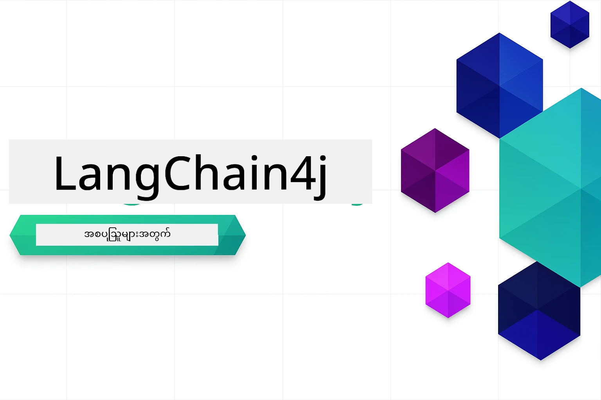

### 🌐 ဘာသာစကားများစွာကို ထောက်ခံမှု

#### GitHub Action မှတဆင့် ထောက်ခံထားသည် (အလိုအလျောက်ဖြစ်ပြီး အမြဲမှန်ကန်သည့် အတည်ပြုချက်)

<!-- CO-OP TRANSLATOR LANGUAGES TABLE START -->
[Arabic](../ar/README.md) | [Bengali](../bn/README.md) | [Bulgarian](../bg/README.md) | [Burmese (Myanmar)](./README.md) | [Chinese (Simplified)](../zh-CN/README.md) | [Chinese (Traditional, Hong Kong)](../zh-HK/README.md) | [Chinese (Traditional, Macau)](../zh-MO/README.md) | [Chinese (Traditional, Taiwan)](../zh-TW/README.md) | [Croatian](../hr/README.md) | [Czech](../cs/README.md) | [Danish](../da/README.md) | [Dutch](../nl/README.md) | [Estonian](../et/README.md) | [Finnish](../fi/README.md) | [French](../fr/README.md) | [German](../de/README.md) | [Greek](../el/README.md) | [Hebrew](../he/README.md) | [Hindi](../hi/README.md) | [Hungarian](../hu/README.md) | [Indonesian](../id/README.md) | [Italian](../it/README.md) | [Japanese](../ja/README.md) | [Kannada](../kn/README.md) | [Korean](../ko/README.md) | [Lithuanian](../lt/README.md) | [Malay](../ms/README.md) | [Malayalam](../ml/README.md) | [Marathi](../mr/README.md) | [Nepali](../ne/README.md) | [Nigerian Pidgin](../pcm/README.md) | [Norwegian](../no/README.md) | [Persian (Farsi)](../fa/README.md) | [Polish](../pl/README.md) | [Portuguese (Brazil)](../pt-BR/README.md) | [Portuguese (Portugal)](../pt-PT/README.md) | [Punjabi (Gurmukhi)](../pa/README.md) | [Romanian](../ro/README.md) | [Russian](../ru/README.md) | [Serbian (Cyrillic)](../sr/README.md) | [Slovak](../sk/README.md) | [Slovenian](../sl/README.md) | [Spanish](../es/README.md) | [Swahili](../sw/README.md) | [Swedish](../sv/README.md) | [Tagalog (Filipino)](../tl/README.md) | [Tamil](../ta/README.md) | [Telugu](../te/README.md) | [Thai](../th/README.md) | [Turkish](../tr/README.md) | [Ukrainian](../uk/README.md) | [Urdu](../ur/README.md) | [Vietnamese](../vi/README.md)

> **နဂိုဆင်း၍ ကွန်ပျူတာတွင် သိမ်းဆည်းသုံးချင်ပါသလား?**

> ဤ repository တွင် လုံးဝဖတ်ရှုနိုင်သော ဘာသာစကား ၅၀ ကျော် တင်ထားသောကြောင့် ဒေါင်းလုပ်အရွယ်အစား သွားတိုးတက်စေသည်။ ဘာသာပြန်များမပါဘဲ ကူးယူလိုပါက sparse checkout ကို အသုံးပြုပါ။
> ```bash
> git clone --filter=blob:none --sparse https://github.com/microsoft/LangChain4j-for-Beginners.git
> cd LangChain4j-for-Beginners
> git sparse-checkout set --no-cone '/*' '!translations' '!translated_images'
> ```
> ၎င်းက သင်အတန်းအတွက် လိုအပ်သည့် အရာအားလုံးကို အရမ်းလျင်မြန်စွာ ဒေါင်းလုပ်ရယူနိုင်ပါသည်။
<!-- CO-OP TRANSLATOR LANGUAGES TABLE END -->

# LangChain4j အတွက် စတင်သင်ယူသူများအတွက်

LangChain4j နှင့် Azure OpenAI GPT-5 ကို အသုံးပြုပြီး အခြေခံစကားပြောခြင်းမှ AI ကိုယ်စားလှယ်များ ဖန်တီးခြင်းအထိ AI application များဆောက်လုပ်ခြင်း သင်တန်း။

**LangChain4j အသစ်လား?** အဓိကအတိုင်းအတာများနှင့် အဓိပ္ပါယ်ရှင်းလင်းချက်များအတွက် [Glossary](docs/GLOSSARY.md) ကို ကြည့်ပါ။

## အကြောင်းအရာဇယား

1. [အလျင်အမြန် စတင်ခြင်း](00-quick-start/README.md) - LangChain4j ဖြင့် စတင်ပါ
2. [နိဒါန်း](01-introduction/README.md) - LangChain4j အခြေခံ များကို လေ့လာပါ
3. [Prompt အင်ဂျင်နီယာ링](02-prompt-engineering/README.md) - ထိရောက်သော prompt ဒီဇိုင်း ကျွမ်းကျင်ပါ
4. [RAG (အသိပညာ ကောက်နှုတ် ထုတ်လုပ်ခြင်း)](03-rag/README.md) - စမတ် သတင်းအချက်အလက် အခြေခံ စနစ်များ ဖန်တီးပါ
5. [ကိရိယာများ](04-tools/README.md) - ပြင်ပ ကိရိယာများနှင့် လွယ်ကူသော အကူအညီပေးသူများ ထည့်သွင်းပါ
6. [MCP (မော်ဒယ် အကြောင်းအရာ ပရိုတိုကေါင်း)](05-mcp/README.md) - Model Context Protocol (MCP) နှင့် Agentic modules နှင့်အတူ အလုပ်လုပ်ပါ
---

## သင်ကြားမှတ်တမ်းအစီအစဉ်

> **အလျင်အမြန် စတင်ခြင်း**

1. ဤ repository ကို သင့် GitHub အကောင့်သို့ Fork ပြုလုပ်ပါ
2. **Code** → **Codespaces** အတန်း → **...** → **New with options...** ကို နှိပ်ပါ
3. မူလတန်းရွေးချယ်မှုများ အသုံးပြုပါ – သင်တန်းအတွက် ဖန်တီးထားသော Development container ကို ရွေးချယ်မည်
4. **Create codespace** ကိုနှိပ်ပါ
5. ပတ်ဝန်းကျင် ပြင်ဆင်ပြီးပြီဆိုရန် ၅-၁၀ မိနစ် စောင့်ဆိုင်းပါ
6. စတင်ရန် [အလျင်အမြန် စတင်ခြင်း](./00-quick-start/README.md) သို့ တိုက်ရိုက် ဝင်ရောက်ပါ!

မော်ဂျူးများ စုံပြီးပါက LangChain4j ကို စမ်းသပ်မှုအတွင်းတွင် ကြည့်ရှုနိုင်ရန် [Testing Guide](docs/TESTING.md) ကို လေ့လာပါ။

> **မှတ်ချက်။** ဤလေ့ကျင့်မှုတွင် GitHub Models နှင့် Azure OpenAI နှစ်ခုလုံး အသုံးပြုသည်။ [အလျင်အမြန် စတင်ခြင်း](00-quick-start/README.md) မော်ဂျူးတွင် GitHub Models ကို ဖော်ပြထားသည် (Azure subscription မလိုအပ်ပါ)၊ မော်ဂျူး ၁-၅ တွင် Azure OpenAI ကို အသုံးပြုသည်။

## GitHub Copilot တို့နှင့်အတူ သင်ယူခြင်း

အမြန်တစ်ချက်ကို ကုဒ်ရေးရန် GitHub Codespace သို့မဟုတ် သင့် ဒေသရုံး IDE တွင် devcontainer ဖြင့် ဤပရောဂျက်ကို ဖွင့်ပါ။ ဤသင်တန်းတွင် သတင်းအချက်အလက်ပေး GitHub Copilot ကို မူရင်းမျိုးဖြစ်သော devcontainer ပါဝင်သည်။

ကုဒ်နမူနာတစ်ခုစီတွင် GitHub Copilot ကို မေးမြန်းနိုင်သည့် မေးခွန်းများ ပါရှိသည်၊ သင့်နားလည်မှု တိုးတက်စေရန် ၎င်းကို အသုံးပြုပါ။ 💡/🤖 ရှိသော မေးခွန်းများကို ဖော်ပြထားသည်မှာ -

- **Java ဖိုင်ခေါင်းစီး** - နမူနာများအတွက် ထူးခြားသော မေးခွန်းများ
- **Module README များ** - ကုဒ်နမူနာပြီးနောက် လေ့လာစူးစမ်းရန် မေးခွန်းများ

**အသုံးပြုပုံ** – မည်သည့်ကုဒ်ဖိုင်ကို မဆို ဖွင့်ပြီး Copilot ကို အဆိုပါ မေးခွန်းများ မေးပါ။ Copilot သည် ကုဒ်အစု အပြည့်အစုံကို သိရှိကာ ရှင်းလင်းပြောဆို၊ တိုးချဲ့ပြစေ၊ အခြားနည်းလမ်းများ အကြံပေးနိုင်ပါသည်။

ပိုပြီးသိရှိလိုပါသလား? [Copilot for AI Paired Programming](https://aka.ms/GitHubCopilotAI) ကိုကြည့်ရှုပါ။

## အပိုဆောင်း အရင်းအမြစ်များ

<!-- CO-OP TRANSLATOR OTHER COURSES START -->
### LangChain
[](https://aka.ms/langchain4j-for-beginners)
[](https://aka.ms/langchainjs-for-beginners?WT.mc_id=m365-94501-dwahlin)

---

### Azure / Edge / MCP / Agents
[](https://github.com/microsoft/AZD-for-beginners?WT.mc_id=academic-105485-koreyst)
[](https://github.com/microsoft/edgeai-for-beginners?WT.mc_id=academic-105485-koreyst)
[](https://github.com/microsoft/mcp-for-beginners?WT.mc_id=academic-105485-koreyst)
[](https://github.com/microsoft/ai-agents-for-beginners?WT.mc_id=academic-105485-koreyst)

---
 
### Generative AI Series
[](https://github.com/microsoft/generative-ai-for-beginners?WT.mc_id=academic-105485-koreyst)
[-9333EA?style=for-the-badge&labelColor=E5E7EB&color=9333EA)](https://github.com/microsoft/Generative-AI-for-beginners-dotnet?WT.mc_id=academic-105485-koreyst)
[-C084FC?style=for-the-badge&labelColor=E5E7EB&color=C084FC)](https://github.com/microsoft/generative-ai-for-beginners-java?WT.mc_id=academic-105485-koreyst)
[-E879F9?style=for-the-badge&labelColor=E5E7EB&color=E879F9)](https://github.com/microsoft/generative-ai-with-javascript?WT.mc_id=academic-105485-koreyst)

---
 
### Core Learning
[](https://aka.ms/ml-beginners?WT.mc_id=academic-105485-koreyst)
[](https://aka.ms/datascience-beginners?WT.mc_id=academic-105485-koreyst)
[](https://aka.ms/ai-beginners?WT.mc_id=academic-105485-koreyst)
[](https://github.com/microsoft/Security-101?WT.mc_id=academic-96948-sayoung)
[](https://aka.ms/webdev-beginners?WT.mc_id=academic-105485-koreyst)
[](https://aka.ms/iot-beginners?WT.mc_id=academic-105485-koreyst)
[](https://github.com/microsoft/xr-development-for-beginners?WT.mc_id=academic-105485-koreyst)

---
 
### Copilot Series

[](https://aka.ms/GitHubCopilotAI?WT.mc_id=academic-105485-koreyst)
[](https://github.com/microsoft/mastering-github-copilot-for-dotnet-csharp-developers?WT.mc_id=academic-105485-koreyst)
[](https://github.com/microsoft/CopilotAdventures?WT.mc_id=academic-105485-koreyst)
<!-- CO-OP TRANSLATOR OTHER COURSES END -->

## စဟဗေါ်မှုရယူခြင်း

AI apps တည်ဆောက်ရာတွင် အခက်အခဲဖြစ်ပါက သို့မဟုတ် မေးခွန်းများရှိပါက ပါဝင်ဆွေးနွေးရန်:

[](https://aka.ms/foundry/discord)

ထုတ်ကုန်တုံ့ပြန်ချက်များ သို့မဟုတ် တည်ဆောက်နေစဉ်အမှားများ ရှိပါက လာရောက်ကြည့်ရှုရန်:

[](https://aka.ms/foundry/forum)

## မောင်ချာ

MIT မောင်ချာ - အသေးစိတ်ကို [LICENSE](../../LICENSE) ဖိုင်တွင် ကြည့်ရှုပါ။

---

<!-- CO-OP TRANSLATOR DISCLAIMER START -->
**စောင့်ရှောက်ချက်**  
ဤစာတမ်းကို AI ဘာသာပြန်မှု ဝန်ဆောင်မှုဖြစ်သည့် [Co-op Translator](https://github.com/Azure/co-op-translator) မှအလိုအလျောက်ဘာသာပြန်ထားပါသည်။ တိကျမှန်ကန်မှုအတွက်ကြိုးပမ်းခဲ့သော်လည်း အလိုအလျောက်ဘာသာပြန်မှုများတွင် အမှားများ သို့မဟုတ် မှန်ကန်မှုလွန်ကဲမှုများ ဖြစ်ပေါ်နိုင်ကြောင်း သတိပေးအပ်ပါသည်။ မူရင်းစာတမ်းကို ကိုယ်ပိုင်ဘာသာစကားဖြင့်သာ အတည်ပြုနိုင်သော အရင်းအမြစ်အဖြစ် တန်ဖိုးထားသင့်ပါသည်။ အရေးကြီးသော အချက်အလက်များအတွက် မူတည်စရာရပြီး ဝန်ကြီးမှူးအဆင့် လူမှုဘာသာပြန်အကူအညီ ရယူရန် အကြံပြုအပ်ပါသည်။ ဤဘာသာပြန်ချက်ကို အသုံးပြုရာမှ ဖြစ်ပေါ်လာသည့် မေ့လျော့နားမလည်မှုများ သို့မဟုတ် မမှန်ကန်သော ရှင်းလင်းချက်များအတွက် ကျွန်ုပ်တို့သည် တာဝန်မခံပါ။
<!-- CO-OP TRANSLATOR DISCLAIMER END -->