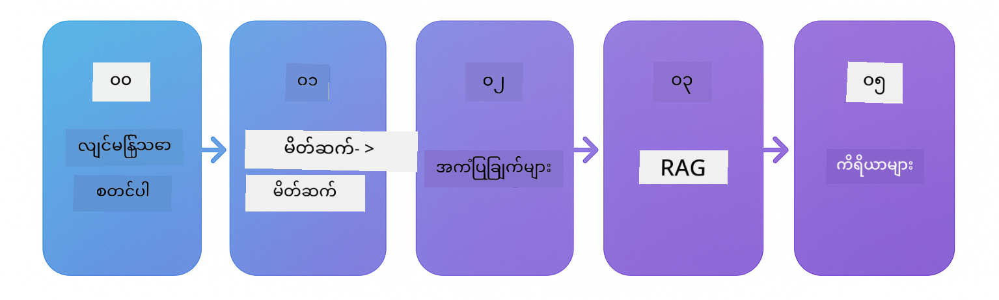

<!--
CO_OP_TRANSLATOR_METADATA:
{
  "original_hash": "69c7e2616c66df6cc296492fbfcad9ec",
  "translation_date": "2025-12-13T12:49:54+00:00",
  "source_file": "README.md",
  "language_code": "my"
}
-->

# LangChain4j အတွက် စတင်သင်ယူသူများ

LangChain4j နှင့် Azure OpenAI GPT-5 ကို အသုံးပြု၍ အခြေခံ စကားပြောမှ စ၍ AI ကိုယ်စားလှယ်များထိ AI အပလီကေးရှင်းများ တည်ဆောက်ခြင်းအတွက် သင်တန်း။

**LangChain4j အသစ်လား?** အဓိပ္ပါယ်များနှင့် အယူအဆများအတွက် [Glossary](docs/GLOSSARY.md) ကို ကြည့်ပါ။

## အကြောင်းအရာ စာရင်း

1. [အမြန်စတင်ခြင်း](00-quick-start/README.md) - LangChain4j ဖြင့် စတင်ပါ
2. [နိဒါန်း](01-introduction/README.md) - LangChain4j ၏ အခြေခံအချက်များကို သင်ယူပါ
3. [Prompt Engineering](02-prompt-engineering/README.md) - ထိရောက်သော prompt ဒီဇိုင်း ကျွမ်းကျင်ပါ
4. [RAG (Retrieval-Augmented Generation)](03-rag/README.md) - ဉာဏ်ရည်မြင့် သိပ္ပံပညာအခြေခံ စနစ်များ တည်ဆောက်ပါ
5. [ကိရိယာများ](04-tools/README.md) - AI ကိုယ်စားလှယ်များနှင့် ပြင်ပကိရိယာများနှင့် API များ ပေါင်းစပ်ပါ
6. [MCP (Model Context Protocol)](05-mcp/README.md) - Model Context Protocol နှင့် အလုပ်လုပ်ပါ
---

## သင်ယူမှု လမ်းကြောင်း

[အမြန်စတင်ခြင်း](00-quick-start/README.md) မော်ဂျူးဖြင့် စတင်ပြီး တစ်ခုချင်းစီ မော်ဂျူးများကို အဆင့်လိုက် တိုးတက်စွာ သင်ယူပါ။ အခြေခံ ဥပမာများကို ကြိုးစားပြီး အခြေခံအချက်များကို နားလည်ပါက [နိဒါန်း](01-introduction/README.md) မော်ဂျူးသို့ ရောက်ရှိပြီး GPT-5 နှင့် ပိုမိုနက်ရှိုင်းစွာ လေ့လာနိုင်ပါသည်။

မော်ဂျူးများ ပြီးဆုံးပြီးနောက် [စမ်းသပ်ခြင်း လမ်းညွှန်](docs/TESTING.md) ကို လေ့လာပြီး LangChain4j စမ်းသပ်မှု အယူအဆများကို လက်တွေ့ကြည့်ရှုပါ။

> **မှတ်ချက်။** ဤသင်တန်းတွင် GitHub Models နှင့် Azure OpenAI နှစ်ခုလုံးကို အသုံးပြုသည်။ [အမြန်စတင်ခြင်း](00-quick-start/README.md) နှင့် [MCP](05-mcp/README.md) မော်ဂျူးများတွင် GitHub Models ကို အသုံးပြုသည် (Azure subscription မလိုအပ်ပါ)၊ မော်ဂျူး ၁ မှ ၄ အထိတွင် Azure OpenAI GPT-5 ကို အသုံးပြုသည်။

## GitHub Copilot ဖြင့် သင်ယူခြင်း

အမြန်ဆုံး ကုဒ်ရေးရန် GitHub Codespace သို့မဟုတ် သင့်ဒေသခံ IDE တွင် ဒီပရောဂျက်ကို ဖွင့်ပါ။ ဤသင်တန်းတွင် အသုံးပြုသော devcontainer တွင် AI အတွက် GitHub Copilot ကို ကြိုတင်ပြင်ဆင်ထားသည်။

ကုဒ်ဥပမာတိုင်းတွင် GitHub Copilot ကို မေးမြန်းနိုင်သော မေးခွန်းများ ပါဝင်သည်။ 💡/🤖 အမှတ်အသားများကို အောက်ပါနေရာများတွင် ရှာဖွေပါ-

- **Java ဖိုင်ခေါင်းစီးများ** - ဥပမာတစ်ခုချင်းစီအတွက် မေးခွန်းများ
- **မော်ဂျူး README များ** - ကုဒ်ဥပမာများပြီးနောက် စူးစမ်းမေးမြန်းရန်

**အသုံးပြုနည်း။** မည်သည့်ကုဒ်ဖိုင်မဆို ဖွင့်ပြီး Copilot ကို အဆိုပါမေးခွန်းများ မေးပါ။ Copilot သည် ကုဒ်အခြေခံကို အပြည့်အဝ နားလည်ပြီး ရှင်းပြ၊ တိုးချဲ့၊ နှင့် အခြားရွေးချယ်စရာများကို အကြံပြုနိုင်သည်။

ပိုမိုသိရှိလိုပါသလား? [AI အတွက် Copilot အတူတကွ ပရိုဂရမ်ရေးခြင်း](https://aka.ms/GitHubCopilotAI) ကို ကြည့်ပါ။

## အပိုဆောင်း အရင်းအမြစ်များ

### LangChain

---

### Azure / Edge / MCP / Agents

---

### Generative AI Series

[-9333EA?style=for-the-badge&labelColor=E5E7EB&color=9333EA)](https://github.com/microsoft/Generative-AI-for-beginners-dotnet?WT.mc_id=academic-105485-koreyst)
[-C084FC?style=for-the-badge&labelColor=E5E7EB&color=C084FC)](https://github.com/microsoft/generative-ai-for-beginners-java?WT.mc_id=academic-105485-koreyst)
[-E879F9?style=for-the-badge&labelColor=E5E7EB&color=E879F9)](https://github.com/microsoft/generative-ai-with-javascript?WT.mc_id=academic-105485-koreyst)

---

### အခြေခံ သင်ယူမှု

---

### Copilot စီးရီး

## အကူအညီရယူခြင်း

AI အပလီကေးရှင်းများ တည်ဆောက်ရာတွင် အခက်အခဲရှိပါက သို့မဟုတ် မေးခွန်းများရှိပါက:

ထုတ်ကုန်တုံ့ပြန်ချက် သို့မဟုတ် အမှားများရှိပါက:

## လိုင်စင်

MIT လိုင်စင် - အသေးစိတ်အတွက် [LICENSE](../../LICENSE) ဖိုင်ကို ကြည့်ပါ။

---

<!-- CO-OP TRANSLATOR DISCLAIMER START -->
**အကြောင်းကြားချက်**  
ဤစာတမ်းကို AI ဘာသာပြန်ဝန်ဆောင်မှု [Co-op Translator](https://github.com/Azure/co-op-translator) ဖြင့် ဘာသာပြန်ထားပါသည်။ ကျွန်ုပ်တို့သည် တိကျမှန်ကန်မှုအတွက် ကြိုးစားသော်လည်း အလိုအလျောက် ဘာသာပြန်မှုများတွင် အမှားများ သို့မဟုတ် မှားယွင်းချက်များ ပါဝင်နိုင်ကြောင်း သတိပြုပါရန် မေတ္တာရပ်ခံအပ်ပါသည်။ မူရင်းစာတမ်းကို မိမိဘာသာစကားဖြင့်သာ တရားဝင်အရင်းအမြစ်အဖြစ် သတ်မှတ်စဉ်းစားသင့်ပါသည်။ အရေးကြီးသော အချက်အလက်များအတွက် လူ့ပညာရှင်များ၏ ပရော်ဖက်ရှင်နယ် ဘာသာပြန်မှုကို အကြံပြုပါသည်။ ဤဘာသာပြန်မှုကို အသုံးပြုရာမှ ဖြစ်ပေါ်လာနိုင်သည့် နားလည်မှုမှားယွင်းမှုများ သို့မဟုတ် မှားဖတ်မှုများအတွက် ကျွန်ုပ်တို့သည် တာဝန်မယူပါ။
<!-- CO-OP TRANSLATOR DISCLAIMER END -->