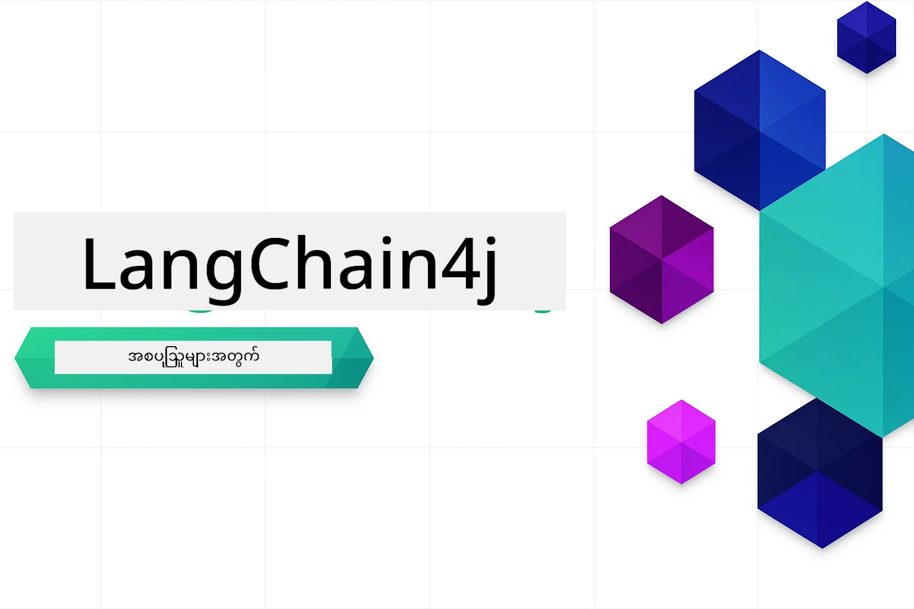

# LangChain4j ကို စတင်လေ့လာသူများအတွက်

LangChain4j နှင့် Azure OpenAI GPT-5.2 ကို အသုံးပြု၍ AI application များ ဖန်တီးခြင်း၏ သင်တန်း၊ မိန့်ခွန်းမူအဆင့်မှ AI အေးဂျင့်များထိ။

### 🌐 ဘာသာစကားစုံ ပံ့ပိုးမှု

#### GitHub Action မှတစ်ဆင့် ပံ့ပိုးထားခြင်း (အလိုအလျောက်နှင့် အမြဲတမ်းလန်းဆန်းသည်)

<!-- CO-OP TRANSLATOR LANGUAGES TABLE START -->
[Arabic](../ar/README.md) | [Bengali](../bn/README.md) | [Bulgarian](../bg/README.md) | [Burmese (Myanmar)](./README.md) | [Chinese (Simplified)](../zh-CN/README.md) | [Chinese (Traditional, Hong Kong)](../zh-HK/README.md) | [Chinese (Traditional, Macau)](../zh-MO/README.md) | [Chinese (Traditional, Taiwan)](../zh-TW/README.md) | [Croatian](../hr/README.md) | [Czech](../cs/README.md) | [Danish](../da/README.md) | [Dutch](../nl/README.md) | [Estonian](../et/README.md) | [Finnish](../fi/README.md) | [French](../fr/README.md) | [German](../de/README.md) | [Greek](../el/README.md) | [Hebrew](../he/README.md) | [Hindi](../hi/README.md) | [Hungarian](../hu/README.md) | [Indonesian](../id/README.md) | [Italian](../it/README.md) | [Japanese](../ja/README.md) | [Kannada](../kn/README.md) | [Khmer](../km/README.md) | [Korean](../ko/README.md) | [Lithuanian](../lt/README.md) | [Malay](../ms/README.md) | [Malayalam](../ml/README.md) | [Marathi](../mr/README.md) | [Nepali](../ne/README.md) | [Nigerian Pidgin](../pcm/README.md) | [Norwegian](../no/README.md) | [Persian (Farsi)](../fa/README.md) | [Polish](../pl/README.md) | [Portuguese (Brazil)](../pt-BR/README.md) | [Portuguese (Portugal)](../pt-PT/README.md) | [Punjabi (Gurmukhi)](../pa/README.md) | [Romanian](../ro/README.md) | [Russian](../ru/README.md) | [Serbian (Cyrillic)](../sr/README.md) | [Slovak](../sk/README.md) | [Slovenian](../sl/README.md) | [Spanish](../es/README.md) | [Swahili](../sw/README.md) | [Swedish](../sv/README.md) | [Tagalog (Filipino)](../tl/README.md) | [Tamil](../ta/README.md) | [Telugu](../te/README.md) | [Thai](../th/README.md) | [Turkish](../tr/README.md) | [Ukrainian](../uk/README.md) | [Urdu](../ur/README.md) | [Vietnamese](../vi/README.md)

> **ဒေသတွင်းမိတ္တူယူလိုပါသလား?**
>
> ဤ repository တွင် ဘာသာစကား ၅၀ ကျော် ရှိသော ဘာသာပြန်ပုံစံများပါဝင်သည်၊ ၎င်းသည် ဒေါင်းလုပ်အရွယ်အစားကိုမြှင့်တင်သည်။ ဘာသာပြန်များမပါဝင်ပဲ မိတ္တူယူရန် sparse checkout ကို သုံးပါ။
>
> **Bash / macOS / Linux:**
> ```bash
> git clone --filter=blob:none --sparse https://github.com/microsoft/LangChain4j-for-Beginners.git
> cd LangChain4j-for-Beginners
> git sparse-checkout set --no-cone '/*' '!translations' '!translated_images'
> ```
>
> **CMD (Windows):**
> ```cmd
> git clone --filter=blob:none --sparse https://github.com/microsoft/LangChain4j-for-Beginners.git
> cd LangChain4j-for-Beginners
> git sparse-checkout set --no-cone "/*" "!translations" "!translated_images"
> ```
>
> ၎င်းက သင်တန်းပြီးမြောက်ရန် လိုအပ်သော အရာအားလုံးကို အလျင်အမြန် ဒေါင်းလုပ်လုပ်နိုင်စေရန် ဖြစ်ပါသည်။
<!-- CO-OP TRANSLATOR LANGUAGES TABLE END -->

## အကြောင်းအရာ စာရင်း

1. [မိတ်ဆက်](01-introduction/README.md) - LangChain4j ၏ အခြေခံများ လေ့လာရန်
2. [Prompt အင်ဂျင်နီယာ링](02-prompt-engineering/README.md) - ထိရောက်သော prompt ဒီဇိုင်း သင်ယူရန်
3. [RAG (Retrieval-Augmented Generation)](03-rag/README.md) - သိပ္ပံပညာအခြေခံ စနစ်များ ဖန်တီးရန်
4. [ကိရိယာများ](04-tools/README.md) - ပြင်ပကိရိယာများနှင့် ရိုးရှင်းသော အကူအညီပေးများ ထည့်သွင်းရန်
5. [MCP (Model Context Protocol)](05-mcp/README.md) - Model Context Protocol (MCP) နှင့် Agentic မော်ဂျူးများ ဖြင့် လုပ်ဆောင်ရန်

### ဗီဒီယို လမ်းညွှန်များ

တိုင်းမော်ဂျူးလ်နှင့်အတူ အကြောင်းအရာများနှင့် ကုဒ်အဆင့်ဆင့်လမ်းညွှန်မှု Live session ပါရှိသည်။

| မော်ဂျူး | ဗီဒီယို |
|--------|-------|
| 01 - မိတ်ဆက် | [LangChain4j ဖြင့် စတင်ခြင်း](https://www.youtube.com/live/nl_troDm8rQ) |
| 02 - Prompt အင်ဂျင်နီယာ링 | [LangChain4j ဖြင့် Prompt အင်ဂျင်နီယာ링](https://www.youtube.com/live/PJ6aBaE6bog) |
| 03 - RAG | [LangChain4j ဖြင့် RAG](https://www.youtube.com/watch?v=_olq75ZH_eY) |
| 04 - ကိရိယာများ & 05 - MCP | [ကိရိယာများနှင့် MCP နှင့် AI အေးဂျင့်များ](https://www.youtube.com/watch?v=O_J30kZc0rw) |

---

## သင်ကြားရေး လမ်းကြောင်း

**LangChain4j အသစ်ဖြစ်ပါသလား?** အဓိကသတ်မှတ်ချက်များနှင့် အကြောင်းအရာများကို [Glossary](docs/GLOSSARY.md) တွင် ကြည့်ရှုပါ။

> **လျင်မြန်စတင်ရန်**

1. ဤ repository ကို သင်၏ GitHub အကောင့်သို့ Fork လုပ်ပါ။
2. **Code** → **Codespaces** tab → **...** → **New with options...** ကို Click နှိပ်ပါ။
3. ကန့်သတ်မှုအတိုင်း အသုံးပြုပါ – ဤသင်တန်းအတွက် ဖန်တီးထားသော Development container ကို ရွေးချယ်မည်။
4. **Create codespace** ကို နှိပ်ပါ။
5. ပတ်ဝန်းကျင် ပြင်ဆင်ပြီး ဖေါ်ဆောင်ရန် ၅-၁၀ မိနစ် ခဏ ရွေ့ပါ။
6. စတင်ရန် [မိတ်ဆက်](./01-introduction/README.md) သို့ တိုက်ရိုက်ဝင်ပါ။

မော်ဂျူးများပြီးဆုံးပါက LangChain4j စမ်းသပ်ခြင်းဆိုင်ရာ အကြောင်းအရာများကို လေ့လာရန် [Testing Guide](docs/TESTING.md) ကို ကြည့်ရှုပါ။

> **မှတ်ချက်။** ဤလေ့လာမှုတွင် Azure OpenAI ကို အသုံးပြုသည်။ အကောင့် မရှိသေးပါက [အခမဲ့ Azure အကောင့်](https://aka.ms/azure-free-account) ဖြင့် စတင်ပါ။

## GitHub Copilot ဖြင့် သင်ယူခြင်း

အမြန် အကောင်အထည်ဖော်ရန်အတွက်၊ GitHub Codespace သို့မဟုတ် သင့်ဒေသခံ IDE တွင် provided devcontainer ဖြင့် ဤ project ကို ဖွင့်ပါ။ ဤသင်တန်းတွင် အသုံးပြုသော devcontainer တွင် AI ပေါင်းစပ်ရေးသားမှုအတွက် GitHub Copilot ရရှိထားသည်။

အထူးကုသည့် မေးခွန်းများသည် GitHub Copilot ကို ကူညီစွာ မေးမြန်းနိုင်ပါသည်။ 💡/🤖 prompts များကို အောက်ပါနေရာများတွင် ရှာရန် -

- **Java ဖိုင်ခေါင်းစဉ်များ** - ကွဲပြားသော ဥပမာများအတွက် မေးခွန်းများ
- **မော်ဂျူး README များ** - ကုဒ်နောက်တွင် လေ့လာစူးစမ်းရန် ပြည့်စုံသော မေးခွန်းများ

**အသုံးပြုနည်း** - ဖိုင်မဆို ဖွင့်၍ Copilot ကို အဆိုပြုထားသည့် မေးခွန်းများ မေးပါ။ ၎င်းသည် ကုဒ်အခြေခံအချက်အလက်များအားလုံးကို သိရှိပြီး ရှင်းလင်းနိုင်ခြင်း၊ တိုးချဲ့စရာနှင့် အခြားအကြံပေးမှုများ ပါရှိသည်။

ပိုမိုသိရှိလိုပါက [AI ပေါင်းစပ်ရေးသားခြင်းအတွက် Copilot](https://aka.ms/GitHubCopilotAI) ကို ကြည့်ရှုပါ။

## ပိုမိုအတတ်ပညာရရှိရေး အရင်းအမြစ်များ

<!-- CO-OP TRANSLATOR OTHER COURSES START -->
### LangChain
[](https://aka.ms/langchain4j-for-beginners)
[](https://aka.ms/langchainjs-for-beginners?WT.mc_id=m365-94501-dwahlin)
[](https://github.com/microsoft/langchain-for-beginners?WT.mc_id=m365-94501-dwahlin)
---

### Azure / Edge / MCP / Agents
[](https://github.com/microsoft/AZD-for-beginners?WT.mc_id=academic-105485-koreyst)
[](https://github.com/microsoft/edgeai-for-beginners?WT.mc_id=academic-105485-koreyst)
[](https://github.com/microsoft/mcp-for-beginners?WT.mc_id=academic-105485-koreyst)
[](https://github.com/microsoft/ai-agents-for-beginners?WT.mc_id=academic-105485-koreyst)

---
 
### Generative AI Series
[](https://github.com/microsoft/generative-ai-for-beginners?WT.mc_id=academic-105485-koreyst)
[-9333EA?style=for-the-badge&labelColor=E5E7EB&color=9333EA)](https://github.com/microsoft/Generative-AI-for-beginners-dotnet?WT.mc_id=academic-105485-koreyst)
[-C084FC?style=for-the-badge&labelColor=E5E7EB&color=C084FC)](https://github.com/microsoft/generative-ai-for-beginners-java?WT.mc_id=academic-105485-koreyst)
[-E879F9?style=for-the-badge&labelColor=E5E7EB&color=E879F9)](https://github.com/microsoft/generative-ai-with-javascript?WT.mc_id=academic-105485-koreyst)

---
 
### အခြေခံ သင်ယူမှု
[](https://aka.ms/ml-beginners?WT.mc_id=academic-105485-koreyst)
[](https://aka.ms/datascience-beginners?WT.mc_id=academic-105485-koreyst)
[](https://aka.ms/ai-beginners?WT.mc_id=academic-105485-koreyst)
[](https://github.com/microsoft/Security-101?WT.mc_id=academic-96948-sayoung)

[](https://aka.ms/webdev-beginners?WT.mc_id=academic-105485-koreyst)
[](https://aka.ms/iot-beginners?WT.mc_id=academic-105485-koreyst)
[](https://github.com/microsoft/xr-development-for-beginners?WT.mc_id=academic-105485-koreyst)

---
 
### Copilot စီးရီး
[](https://aka.ms/GitHubCopilotAI?WT.mc_id=academic-105485-koreyst)
[](https://github.com/microsoft/mastering-github-copilot-for-dotnet-csharp-developers?WT.mc_id=academic-105485-koreyst)
[](https://github.com/microsoft/CopilotAdventures?WT.mc_id=academic-105485-koreyst)
<!-- CO-OP TRANSLATOR OTHER COURSES END -->

## ကူညီရန်

AI အက်ပ်များ တည်ဆောက်ရာတွင် ထိပ်တန်းမရောက်ခဲ့ပါက သို့မဟုတ် မေးခွန်းများရှိပါက:

[](https://aka.ms/foundry/discord)

ကုန်ပစ္စည်းအကြံပြုချက်များ သို့မဟုတ် အမှားများ ရှိပါက သင်တည်ဆောက်နေစဉ် အောက်ပါလင့်ခ်သို့ ဝင်ကြည့်ပါ။

[](https://aka.ms/foundry/forum)

## လိုင်စင်

MIT လိုင်စင် - အသေးစိတ်အချက်အလက်များအတွက် [LICENSE](../../LICENSE) ဖိုင်ကို ကြည့်ပါ။

---

<!-- CO-OP TRANSLATOR DISCLAIMER START -->
**ပြောကြားချက်**
ဤစာတမ်းကို AI ဘာသာပြန်ဝန်ဆောင်မှု [Co-op Translator](https://github.com/Azure/co-op-translator) အသုံးပြု၍ ဘာသာပြန်ထားပါသည်။ ကျွန်ုပ်တို့သည် တိကျမှန်ကန်မှုအတွက် ကြိုးပမ်းနေသော်လည်း၊ စက်ကိရိယာဘာသာပြန်ခြင်းများတွင် အမှားများ သို့မဟုတ် မှားယွင်းချက်များ ပါဝင်နိုင်ကြောင်း သတိပြုပါရန် လိုအပ်ပါသည်။ မူလစာတမ်းကို မူရင်းဘာသာဖြင့်သာ ယုံကြည်စိတ်ချရသော အချက်အလက်အဖြစ် သတ်မှတ်သင့်သည်။ အရေးကြီးသည့် သတင်းအချက်အလက်များအတွက် ပရော်ဖက်ရှင်နယ် လူသားဘာသာပြန်သူဝန်ဆောင်မှုကို အကြံပြုပါသည်။ ဤဘာသာပြန်ချက်ကို အသုံးပြုခြင်းမှ ဖြစ်ပေါ်လာသော နားလည်မှုကွာခြားမှုများ သို့မဟုတ် မမှန်ကန်သော အသုံးပြုမှုများအတွက် ကျွန်ုပ်တို့ တာဝန်မခံပါ။
<!-- CO-OP TRANSLATOR DISCLAIMER END -->