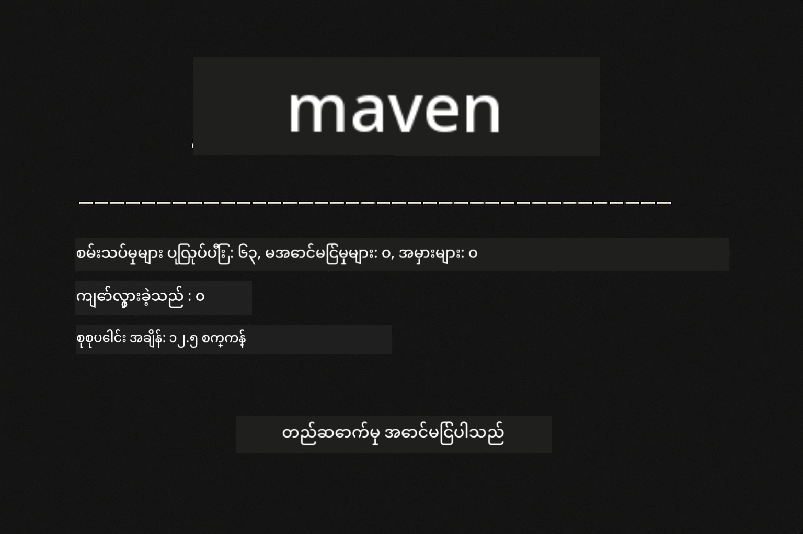
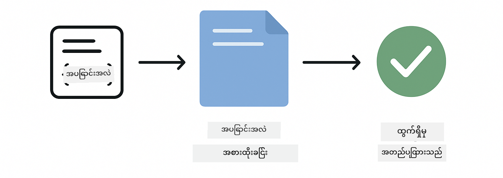
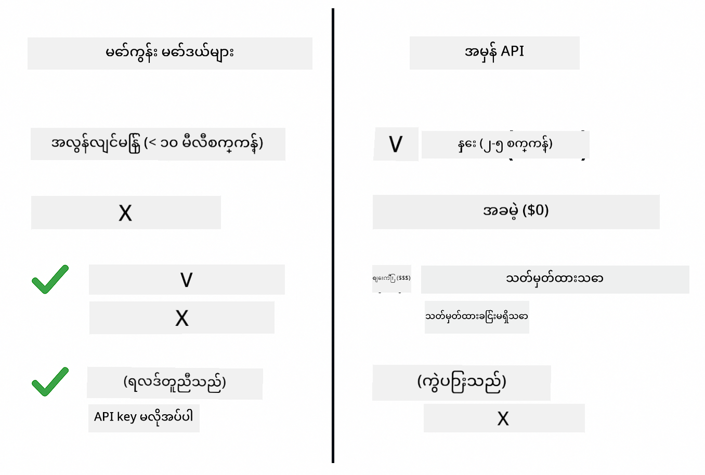
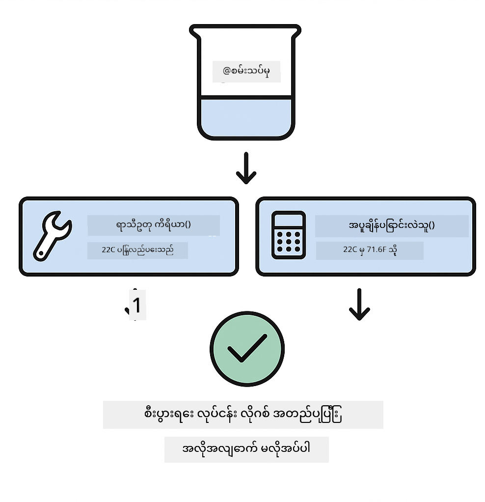

<!--
CO_OP_TRANSLATOR_METADATA:
{
  "original_hash": "ed93b3c14d58734ac10162967da958c1",
  "translation_date": "2025-12-31T06:15:08+00:00",
  "source_file": "docs/TESTING.md",
  "language_code": "my"
}
-->
# LangChain4j အက်ပ်လီကေးရှင်းများ စမ်းသပ်ခြင်း

## အကြောင်းအရာ အညွှန်း

- [အမြန်စတင်](../../../docs)
- [စမ်းသပ်ချက်များ ဖုံးလွှမ်းသည့် အရာများ](../../../docs)
- [စမ်းသပ်မှုများ ပြေးဆောင်ရန်](../../../docs)
- [VS Code မှာ စမ်းသပ်မှုများ လည်ပတ်ခြင်း](../../../docs)
- [စမ်းသပ်ပုံစံများ](../../../docs)
- [စမ်းသပ်ခြင်း အယူအဆ](../../../docs)
- [နောက်တစ်ဆင့်များ](../../../docs)

ဤလမ်းညွှန်သည် API key များ သို့မဟုတ် အပြင်ဘက် ဝန်ဆောင်မှုပြဿနာများမလိုအပ်ဘဲ AI အက်ပ်လီကေးရှင်းများကို မည်ကဲ့သို့ စမ်းသပ်ရမည်ကို ပြသသည့် စမ်းသပ်ချက်များကို သင်အား လမ်းဆောင်ပေးပါသည်။

## Quick Start

တစ်ခါတည်း အမိန့်တစ်ကြောင်းဖြင့် စမ်းသပ်မှုအားလုံးကို ပြေးဆောင်ပါ။

**Bash:**
```bash
mvn test
```

**PowerShell:**
```powershell
mvn --% test
```



*စမ်းသပ်မှုအားလုံး အောင်မြင်ပြီး ကျန်နည်းချက်များ မရှိပဲ ပြီးစီးနေကြောင်း ပြသခြင်း*

## What the Tests Cover

ဤသင်တန်းသည် ဒေသတွင်းတွင် ပြေးနေသော **ယူနစ် စမ်းသပ်မှုများ** (unit tests) အပေါ် အထူးအာရုံစိုက်ထားသည်။ တစ်ခုချင်းစီသော စမ်းသပ်ချက်သည် LangChain4j ၏ သီးခြား အယူအဆတစ်ခုကို သီးခြားပြသသည်။


*ယူနစ် စမ်းသပ်မှုများ (လျင်မြန်၊ သီးခြားထား), ပေါင်းစည်းစမ်းသပ်မှုများ (အစိတ်အပိုင်းများ အသုံးပြုသည်), နှင့် end-to-end စမ်းသပ်မှုများအကြား မဟာဗျူဟာ ညီမျှမှုကို ပြသသော စမ်းသပ်မှု ပီရမစ်။ ဤသင်တန်းသည် ယူနစ် စမ်းသပ်မှုကို ဖုံးလွှမ်းသည်။*

| Module | Tests | Focus | Key Files |
|--------|-------|-------|-----------|
| **00 - Quick Start** | 6 | Prompt templates and variable substitution | `SimpleQuickStartTest.java` |
| **01 - Introduction** | 8 | Conversation memory and stateful chat | `SimpleConversationTest.java` |
| **02 - Prompt Engineering** | 12 | GPT-5 patterns, eagerness levels, structured output | `SimpleGpt5PromptTest.java` |
| **03 - RAG** | 10 | Document ingestion, embeddings, similarity search | `DocumentServiceTest.java` |
| **04 - Tools** | 12 | Function calling and tool chaining | `SimpleToolsTest.java` |
| **05 - MCP** | 8 | Model Context Protocol with Stdio transport | `SimpleMcpTest.java` |

## Running the Tests

**root မှ စမ်းသပ်မှုအားလုံးကို ပြေးရန်:**

**Bash:**
```bash
mvn test
```

**PowerShell:**
```powershell
mvn --% test
```

**မော်ဂျူးတစ်ခု သီးသန့်အတွက် စမ်းသပ်ရန်:**

**Bash:**
```bash
cd 01-introduction && mvn test
# သို့မဟုတ် root ကနေ
mvn test -pl 01-introduction
```

**PowerShell:**
```powershell
cd 01-introduction; mvn --% test
# သို့မဟုတ် root ကနေ
mvn --% test -pl 01-introduction
```

**တစ်ခုတည်းသော စမ်းသပ် အတန်း (test class) ကို ပြေးရန်:**

**Bash:**
```bash
mvn test -Dtest=SimpleConversationTest
```

**PowerShell:**
```powershell
mvn --% test -Dtest=SimpleConversationTest
```

**သတ်မှတ်ထားသော စမ်းသပ် မက်သော့ဒ်တစ်ခုကို ပြေးရန်:**

**Bash:**
```bash
mvn test -Dtest=SimpleConversationTest#ပြောဆိုမှုမှတ်တမ်းကို ထိန်းသိမ်းသင့်ပါသလား
```

**PowerShell:**
```powershell
mvn --% test -Dtest=SimpleConversationTest#စကားဝိုင်းမှတ်တမ်းကို ထိန်းသိမ်းသင့်သည်
```

## Running Tests in VS Code

သင် Visual Studio Code ကို အသုံးပြုလျှင် Test Explorer သည် စမ်းသပ်ချက်များကို ပြေးကာ အမှားရှာ ဖျော်ဖြေရာတွင် ဂရပ်ဖစ် အင်တာဖေ့စ်ကို ပေးစွမ်းပါသည်။


*VS Code Test Explorer သည် Java စမ်းသပ် အတန်းများနှင့် တစ်ခုချင်းစီသော စမ်းသပ် မက်သော့ဒ်များပါဝင်သည့် စမ်းသပ် သစ်ပင်ကို ပြသထားသည်*

**VS Code တွင် စမ်းသပ်မှုများ ပြေးရန်:**

1. Activity Bar တွင် beaker icon ကို နောက်တက်နှိပ်၍ Test Explorer ကို ဖွင့်ပါ
2. မော်ဂျူးများနှင့် စမ်းသပ် အတန်းများအား ကြည့်ရန် စမ်းသပ် သစ်ပင်ကို ဖွင့်ချဲ့ပါ
3. စမ်းသပ်ချက် တစ်ခုချင်းစီကို သီးခြား ပြေးဆောင်ရန် သေးငယ်သည့် play ခလုတ်ကို နှိပ်ပါ
4. "Run All Tests" ကို နှိပ်၍ စမ်းသပ် အစုလိုက်အားလုံးကို လည်ပတ်စေပါ
5. စမ်းသပ်ချက်တစ်ခုအား right-click ပြုလုပ်၍ "Debug Test" ကို ရွေးချယ်ကာ breakpoint များ တင်ပြီး ကုဒ်တစ်ကြောင်းချင်းစီအလိုက် ဖျော်ဖြေရှုနိုင်ပါသည်

Test Explorer သည် ဖြတ်တောက်ပြီးသော စမ်းသပ်ချက်များအတွက် အစိမ်းရောင် တံဆိပ်များကို ပြသပြီး စမ်းသပ်ချက် များ မကျေရာတွင် အသေးစိတ် အမှားပိုင်းမက်ဆေ့ခ်ျများကို ပေးစွမ်းပါသည်။

## Testing Patterns

### Pattern 1: Testing Prompt Templates

အရေးရှင်းဆုံး ပုံစံမှာ AI မော်ဒယ်အား တိုက်ရိုက် မခေါ်ဘဲ prompt template များကို စမ်းသပ်ခြင်း ဖြစ်သည်။ သင်သည် အမွန်းအပြား အစားထိုးမှု (variable substitution) က မှန်ကန်စွာ လုပ်ဆောင်သလား၊ prompt များသည် မျှော်လင့်သလို ဖော်မြူလာ အတိုင်း ရှိသလား စစ်ဆေးရပါမည်။



*placeholder များပါရှိသည့် template → တန်ဖိုးများ ကို အစားထိုး → ဖော်မတ် ပြုလုပ်ထားသော output ကို စစ်ဆေးခြင်း ဆိုသည့် variable substitution အဆင့်ကို ပြသသော prompt template စမ်းသပ်ခြင်း*

```java
@Test
@DisplayName("Should format prompt template with variables")
void testPromptTemplateFormatting() {
    PromptTemplate template = PromptTemplate.from(
        "Best time to visit {{destination}} for {{activity}}?"
    );
    
    Prompt prompt = template.apply(Map.of(
        "destination", "Paris",
        "activity", "sightseeing"
    ));
    
    assertThat(prompt.text()).isEqualTo("Best time to visit Paris for sightseeing?");
}
```

ဤစမ်းသပ်ချက်မှာ `00-quick-start/src/test/java/com/example/langchain4j/quickstart/SimpleQuickStartTest.java` တွင် တည်ရှိသည်။

**Run it:**

**Bash:**
```bash
cd 00-quick-start && mvn test -Dtest=SimpleQuickStartTest#prompt နမူနာပုံစံ စမ်းသပ်ခြင်း
```

**PowerShell:**
```powershell
cd 00-quick-start; mvn --% test -Dtest=SimpleQuickStartTest#Prompt နမူနာ ဖော်မက်တင်း စမ်းသပ်ခြင်း
```

### Pattern 2: Mocking Language Models

conversation အလျောက် ယာယီ ပြောဆိုမှုများကို စမ်းသပ်သောအခါ Mockito ကို အသုံးပြု၍ ကြိုတင်သတ်မှတ်ထားသော ပြန်လည်ဖြေဆိုချက်များ ပေးသည့် မှန်ကန်သောမဟုတ်သည့် (fake) မော်ဒယ်များကို ဖန်တီးပါ။ ၎င်းက စမ်းသပ်ချက်များကို လျင်မြန်စေပြီး အခကြေးငွေမလို၊ မပြောင်းလဲနိုင်သော ရလဒ်များကို ပေးစွမ်းစေပါသည်။



*မော့ခ်များ preferred ဖြစ်ရသော အကြောင်းပြချက်များကို ပြသချက် — လျင်မြန်၊ အခမဲ့၊ တိတိကျကျဖြစ်ပြီး API key မလိုအပ်ခြင်း*

```java
@ExtendWith(MockitoExtension.class)
class SimpleConversationTest {
    
    private ConversationService conversationService;
    
    @Mock
    private OpenAiOfficialChatModel mockChatModel;
    
    @BeforeEach
    void setUp() {
        ChatResponse mockResponse = ChatResponse.builder()
            .aiMessage(AiMessage.from("This is a test response"))
            .build();
        when(mockChatModel.chat(anyList())).thenReturn(mockResponse);
        
        conversationService = new ConversationService(mockChatModel);
    }
    
    @Test
    void shouldMaintainConversationHistory() {
        String conversationId = conversationService.startConversation();
        
        ChatResponse mockResponse1 = ChatResponse.builder()
            .aiMessage(AiMessage.from("Response 1"))
            .build();
        ChatResponse mockResponse2 = ChatResponse.builder()
            .aiMessage(AiMessage.from("Response 2"))
            .build();
        ChatResponse mockResponse3 = ChatResponse.builder()
            .aiMessage(AiMessage.from("Response 3"))
            .build();
        
        when(mockChatModel.chat(anyList()))
            .thenReturn(mockResponse1)
            .thenReturn(mockResponse2)
            .thenReturn(mockResponse3);

        conversationService.chat(conversationId, "First message");
        conversationService.chat(conversationId, "Second message");
        conversationService.chat(conversationId, "Third message");

        List<ChatMessage> history = conversationService.getHistory(conversationId);
        assertThat(history).hasSize(6); // အသုံးပြုသူ မက်ဆေ့ဂျ် 3 ခု + AI မက်ဆေ့ဂျ် 3 ခု
    }
}
```

ဤပုံစံသည် `01-introduction/src/test/java/com/example/langchain4j/service/SimpleConversationTest.java` တွင် တွေ့ရသည်။ မော့ခ်က သဘောတရားတကျ အပြုအမူကို သေချာအောင် ထိန်းထားပေး၍ memory ကို စီမံခန့်ခွဲမှုမှန်ကန်ကြောင်း စစ်ဆေးနိုင်စေသည်။

### Pattern 3: Testing Conversation Isolation

Conversation memory သည် မကြာခဏ ပုပ်နှံနေသော အသုံးပြုသူများအတွက် သီးခြားထားရမည်ဖြစ်သည်။ ဤစမ်းသပ်ချက်က စကားဝိုင်းများ၏ context များ မရောထွေးကြောင်းကို သက်သေပြသည်။


*အသုံးပြုသူများအလိုက် memory store များကို သီးခြားထားခြင်းဖြင့် context မရောစပ်စေရန် ပြသထားသော conversation isolation စမ်းသပ်ခြင်း*

```java
@Test
void shouldIsolateConversationsByid() {
    String conv1 = conversationService.startConversation();
    String conv2 = conversationService.startConversation();
    
    ChatResponse mockResponse = ChatResponse.builder()
        .aiMessage(AiMessage.from("Response"))
        .build();
    when(mockChatModel.chat(anyList())).thenReturn(mockResponse);

    conversationService.chat(conv1, "Message for conversation 1");
    conversationService.chat(conv2, "Message for conversation 2");

    List<ChatMessage> history1 = conversationService.getHistory(conv1);
    List<ChatMessage> history2 = conversationService.getHistory(conv2);
    
    assertThat(history1).hasSize(2);
    assertThat(history2).hasSize(2);
}
```

တစ်ခုချင်းစီသော conversation သည် ကိုယ့်ရဲ့ ကိုယ့်သီးသန့်သမိုင်းကို ထိန်းသိမ်းထားသည်။ ထုတ်လုပ်မှုစနစ်များတွင် ဤသီးခြားခြင်းသည် စုစည်းအသုံးပြုသူများအတွက် အလွန်အရေးကြီးသည်။

### Pattern 4: Testing Tools Independently

Tools များဆိုသည်မှာ AI သည် ခေါ်ယူနိုင်သည့် function များဖြစ်သည်။ AI ဆုံးဖြတ်ချက်များပေါ်မူတည်ဘဲ သူတို့ကို တိုက်ရိုက် စမ်းသပ်၍ ထို logic များ မှန်ကန်ကြောင်း သေချာစေပါ။



*AI ခေါ်ယူမှုမရှိဘဲ mock tool အား အသုံးပြုပြီး စီးပွားရေး logic ကို စစ်ဆေးရန် tools များကို သီးခြား စမ်းသပ်ခြင်း*

```java
@Test
void shouldConvertCelsiusToFahrenheit() {
    TemperatureTool tempTool = new TemperatureTool();
    String result = tempTool.celsiusToFahrenheit(25.0);
    assertThat(result).containsPattern("77[.,]0°F");
}

@Test
void shouldDemonstrateToolChaining() {
    WeatherTool weatherTool = new WeatherTool();
    TemperatureTool tempTool = new TemperatureTool();

    String weatherResult = weatherTool.getCurrentWeather("Seattle");
    assertThat(weatherResult).containsPattern("\\d+°C");

    String conversionResult = tempTool.celsiusToFahrenheit(22.0);
    assertThat(conversionResult).containsPattern("71[.,]6°F");
}
```

ဤစမ်းသပ်မှုများသည် `04-tools/src/test/java/com/example/langchain4j/agents/tools/SimpleToolsTest.java` မှာ ရှိပြီး AI ပါဝင်မှုမရှိဘဲ tool logic များကို တည်ကြပ်စစ်ဆေးသည်။ chaining ဥပမာက တစ်ခုချင်း tool ၏ output က နောက်တစ်ခု၏ input အဖြစ် အလုပ်လုပ်ပုံကို ပြသသည်။

### Pattern 5: In-Memory RAG Testing

RAG စနစ်များသည် အများအားဖြင့် vector database များနှင့် embedding ဝန်ဆောင်မှုများကို လိုအပ်သည်။ in-memory ပုံစံက အပြင်ဘက် အခြေခံပစ္စည်းများမလိုပဲ စဉ်ဆက်မပြတ် pipeline အား စမ်းသပ်နိုင်စေသည်။


*ဒေါက်မြင့် များ၏ parsing, embedding သိမ်းဆည်းခြင်းနှင့် similarity ရှာဖွေရေးကို ဒေတာဘေ့စ်မလိုဘဲ in-memory ဖြင့် ပြုလုပ်သည့် RAG စမ်းသပ်စနစ်*

```java
@Test
void testProcessTextDocument() {
    String content = "This is a test document.\nIt has multiple lines.";
    InputStream inputStream = new ByteArrayInputStream(content.getBytes(StandardCharsets.UTF_8));
    
    DocumentService.ProcessedDocument result = 
        documentService.processDocument(inputStream, "test.txt");

    assertNotNull(result);
    assertTrue(result.segments().size() > 0);
    assertEquals("test.txt", result.segments().get(0).metadata().getString("filename"));
}
```

ဤစမ်းသပ်ချက်သည် `03-rag/src/test/java/com/example/langchain4j/rag/service/DocumentServiceTest.java` မှာရှိပြီး memory တွင် ဒေါက်မြင့်တစ်စောင်ကို ဖန်တီးကာ chunking နှင့် metadata ကို စစ်ဆေးသည်။

### Pattern 6: MCP Integration Testing

MCP မော်ဂျူးသည် stdio transport ကို အသုံးပြု၍ Model Context Protocol အင်တိတ်ဂရေးရှင်းကို စမ်းသပ်သည်။ ဤစမ်းသပ်ချက်များက သင့် အက်ပ်လီကေးရှင်းမှ MCP ဆာဗာများကို subprocess အဖြစ် spawn ပြီး ဆက်သွယ်နိုင်မည့်အရည်အချင်းကို အတည်ပြုသည်။

ဤစမ်းသပ်မှုများမှာ `05-mcp/src/test/java/com/example/langchain4j/mcp/SimpleMcpTest.java` တွင် MCP client အပြုအမူကို စမ်းသပ်သေချာစေသည်။

**Run them:**

**Bash:**
```bash
cd 05-mcp && mvn test
```

**PowerShell:**
```powershell
cd 05-mcp; mvn --% test
```

## Testing Philosophy

သင်၏ ကုဒ်ကို စမ်းသပ်ပါ၊ AI ကို မဟုတ်။ သင့်စမ်းသပ်မှုများသည် သင်ရေးထားသော ကုဒ်ကို အတည်ပြုသင့်ပြီး prompt များကို မည်သို့ တည်ဆောက်ထားသည်၊ memory ကို မည်သို့ စီမံထားသည်နှင့် tools များ မည်သို့ အလုပ်လုပ်သည်ကို စစ်ဆေးသင့်သည်။ AI ၏ ပြန်လည်တုံ့ပြန်မှုများသည် မတည်ငြိမ်နိုင်သဖြင့် စမ်းသပ်ချက်များ၏ အတည်ပြုချက်များတွင် အပါဝင်သင့်မဟုတ်သည်။ သင့် prompt template သည် variable များကို မှန်ကန်စွာ အစားထိုးနိုင်သလား ဆိုတာကို မေးပါ၊ AI သည် မှန်ကန်သော ဖြေကြားချက် ပေးမလား မေးမနေပါနှင့်။

ဘာသာစကား မော်ဒယ်များအတွက် မော့ခ်များကို အသုံးပြုပါ။ ၎င်းတို့သည် ပြင်ပ အာရုံစိုက်မည့် ကူညီရေးကိရိယာများဖြစ်၍ ငန်, ကြေးကြီး, နှင့် မတည်ငြိမ်ကြ၍ စမ်းသပ်မှုများကို နှေးကွေးစေပါသည်။ မော့ခ် ပြုလုပ်ခြင်းက စမ်းသပ်မှုများကို စက္ကန့်များနည်းနည်းသာ ကြာသဖြင့် လျင်မြန်စေပြီး အခကြေးငွေမရှိစေသည်နှင့် တိတိကျကျ ရလဒ်တူညီစေပါသည်။

စမ်းသပ်ချက်များကို သီးခြားထားပါ။ စမ်းသပ်ချက်တိုင်းသည် ကိုယ်၏ဒေတာကို ပြင်ဆင်ထည့်သွင်းသင့်ပြီး အခြား စမ်းသပ်ချက်များပေါ် မူတည်၍ မဟုတ်ရပါ။ စမ်းသပ်ချက်များသည် အဆင့်လိုက် လုပ်ဆောင်မှု အခြေအနေမှ မဟုတ်ဘဲ အမှန်တကယ် အလွာင်သက်သက်လျှောက်ပတ်နိုင်စေရန် လွှမ်းမိုးမှုများကို ရှောင်ရှားပါ။

ပျော်ရွှင်စရာ လမ်းကြောင်းမှ ကျော်လွန်၍ အချို့အမှုအရာများကို စမ်းသပ်ပါ။ ထည့်မည့် input များ မရှိခြင်း၊ အလွန်ကြီးမားသော input များ၊ အထူးအက္ခရာများ၊ မှားယွင်းသော parameter များနှင့် နောက်ဆုံးနယ်နိမိတ် အခြေအနေများကို စမ်းသပ်ပါ။ ၎င်းတို့သည် ပုံမှန်အသုံးပြုမှုများတွင် မမြင်ရသည့် ဂျပ်ပေါက်များကို ဖော်ထုတ်ပေးနိုင်သည်။

ဖော်ပြချက်ပြည့်စုံသော အမည်များကို သုံးပါ။ `shouldMaintainConversationHistoryAcrossMultipleMessages()` ကို `test1()` နှင့် နှိုင်းယှဉ်ပါ။ ပထမဆုံး အမည်က ဘာကို စမ်းသပ်နေသည်ကို တိကျစွာ ပြောပြပေးသဖြင့် မဖွင့်ဖူးသော အမှားများကို အလွယ်တကူ တွေ့ရှာနိုင်စေသည်။

## Next Steps

စမ်းသပ်ပုံစံများကို နားလည်သည့်အတွက် ယခု မော်ဂျူး တစ်ခုချင်းစီကို နက်ရှိုင်းစွာ လေ့လာပါ။

- **[00 - အမြန်စတင်](../00-quick-start/README.md)** - prompt template အခြေခံများနှင့် စတင်ပါ
- **[01 - မိတ်ဆက်](../01-introduction/README.md)** - conversation memory စီမံခန့်ခွဲမှုကို လေ့လာပါ
- **[02 - Prompt Engineering](../02-prompt-engineering/README.md)** - GPT-5 prompting ပုံစံများကို ကျွမ်းကျင်ပါ
- **[03 - RAG](../03-rag/README.md)** - retrieval-augmented generation စနစ်များကို တည်ဆောက်ပါ
- **[04 - Tools](../04-tools/README.md)** - function calling နှင့် tool chain များကို အကောင်အထည်ဖော်ပါ
- **[05 - MCP](../05-mcp/README.md)** - Model Context Protocol ကို ပေါင်းစည်းထည့်သွင်းပါ

မော်ဂျူးတိုင်း၏ README တွင် ဤနေရာတွင် စမ်းသပ်ထားသည့် အယူအဆများအကြောင်း အသေးစိတ် ရှင်းလင်းချက်များ ပါရှိသည်။

---

**Navigation:** [← မူလစာမျက်နှာသို့ ပြန်သွားရန်](../README.md)

---

<!-- CO-OP TRANSLATOR DISCLAIMER START -->
အသိပေးချက်:
ဒီစာတမ်းကို AI ဘာသာပြန်ဝန်ဆောင်မှု [Co-op Translator](https://github.com/Azure/co-op-translator) ဖြင့် ဘာသာပြန်ထားပါသည်။ ကျွန်ုပ်တို့သည် မှန်ကန်မှုအတွက် ကြိုးစားထမ်းဆောင်သော်လည်း အလိုအလျောက် ဘာသာပြန်ခြင်းများတွင် အမှားများ သို့မဟုတ် တိကျမှုမရှိမှုများ ပါဝင်နိုင်ကြောင်း သတိပြုပါ။ မူလစာတမ်းကို မူလဘာသာဖြင့်သာ အာဏာရှိသော အရင်းအမြစ်အနေနှင့် သတ်မှတ်စဉ်းစားရန် အကြံပြုပါသည်။ အရေးကြီးသော အချက်အလက်များအတွက် ပရော်ဖက်ရှင်နယ် လူသားဘာသာပြန်ကို အသုံးပြုရန် အကြံပြုပါသည်။ ဤဘာသာပြန်ကို အသုံးပြုခြင်းကြောင့် ဖြစ်ပေါ်နိုင်သည့် နားလည်မှုမှားယွင်းခြင်းများ သို့မဟုတ် မှားယွင်းသော အဓိပ္ပာယ်ဖော်ပြချက်များအတွက် ကျွန်ုပ်တို့ တာဝန်မရှိပါ။
<!-- CO-OP TRANSLATOR DISCLAIMER END -->