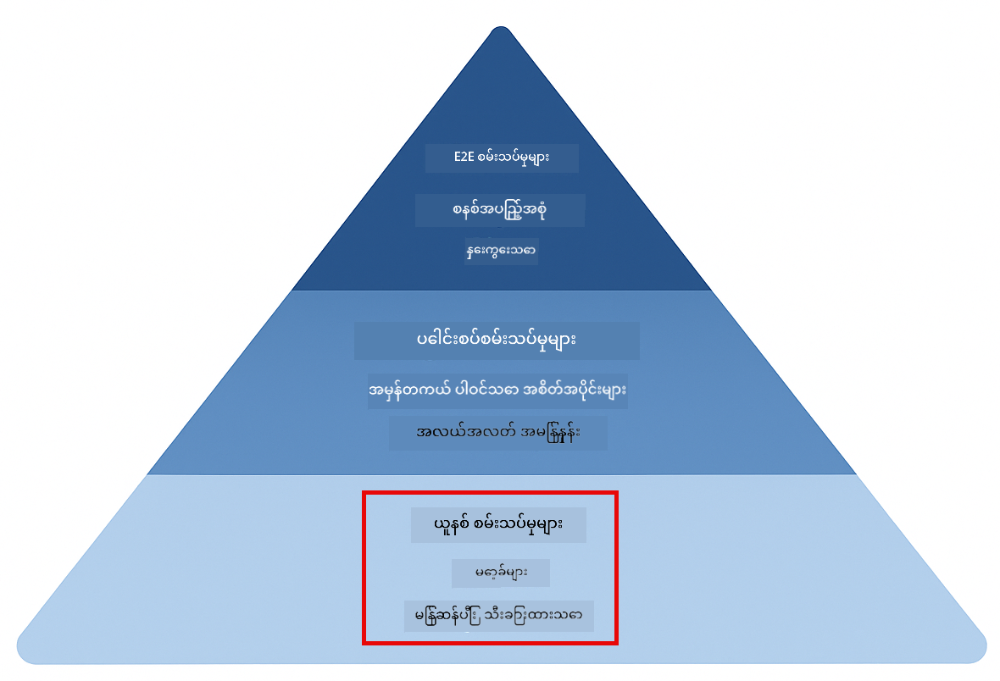
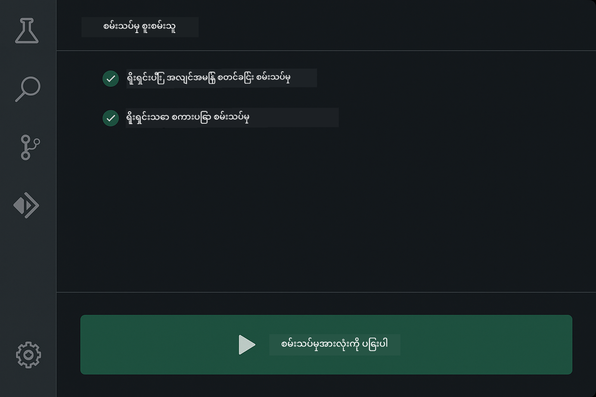
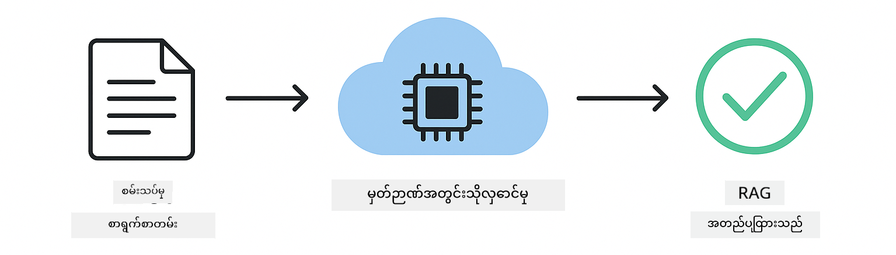

<!--
CO_OP_TRANSLATOR_METADATA:
{
  "original_hash": "b975537560c404d5f254331832811e78",
  "translation_date": "2025-12-13T21:29:22+00:00",
  "source_file": "docs/TESTING.md",
  "language_code": "my"
}
-->
# LangChain4j အပလီကေးရှင်းများ စမ်းသပ်ခြင်း

## အကြောင်းအရာ စာရင်း

- [အမြန်စတင်ခြင်း](../../../docs)
- [စမ်းသပ်မှုများက ဘာတွေကို ဖုံးကွယ်ထားသလဲ](../../../docs)
- [စမ်းသပ်မှုများကို ပြေးဆွဲခြင်း](../../../docs)
- [VS Code မှာ စမ်းသပ်မှုများ ပြေးဆွဲခြင်း](../../../docs)
- [စမ်းသပ်မှု ပုံစံများ](../../../docs)
- [စမ်းသပ်မှု အယူအဆ](../../../docs)
- [နောက်တစ်ဆင့်များ](../../../docs)

ဤလမ်းညွှန်သည် API key မလိုအပ်ဘဲ သို့မဟုတ် ပြင်ပဝန်ဆောင်မှုများမလိုအပ်ဘဲ AI အပလီကေးရှင်းများကို စမ်းသပ်နည်းကို ပြသသည့် စမ်းသပ်မှုများအား လမ်းညွှန်ပေးပါသည်။

## အမြန်စတင်ခြင်း

တစ်ချက်တည်းကနေ စမ်းသပ်မှုအားလုံးကို ပြေးဆွဲပါ။

**Bash:**
```bash
mvn test
```

**PowerShell:**
```powershell
mvn --% test
```


*အောင်မြင်စွာ စမ်းသပ်မှုများ ပြေးဆွဲပြီး စမ်းသပ်မှုအားလုံး အောင်မြင်မှု ရရှိနေသည်ကို ပြသခြင်း*

## စမ်းသပ်မှုများက ဘာတွေကို ဖုံးကွယ်ထားသလဲ

ဤသင်ခန်းစာသည် ဒေသတွင်းတွင် ပြေးဆွဲသော **ယူနစ်စမ်းသပ်မှုများ** အပေါ် အာရုံစိုက်သည်။ စမ်းသပ်မှုတိုင်းသည် LangChain4j ၏ သီးခြားအယူအဆတစ်ခုကို သီးခြားပြသသည်။



*ယူနစ်စမ်းသပ်မှုများ (လျင်မြန်ပြီး သီးခြား), ပေါင်းစပ်စမ်းသပ်မှုများ (အစိတ်အပိုင်းများဖြင့်), နှင့် အဆုံး-to-အဆုံး စမ်းသပ်မှုများ (Docker ဖြင့် စနစ်အပြည့်အစုံ) တို့၏ ညီမျှမှုကို ပြသသည့် စမ်းသပ်မှု ပီရမစ်။ ဤသင်တန်းသည် ယူနစ်စမ်းသပ်မှုကို ဖုံးကွယ်သည်။*

| မော်ဂျူး | စမ်းသပ်မှုများ | အာရုံစိုက်ချက် | အဓိကဖိုင်များ |
|--------|-------|-------|-----------|
| **00 - အမြန်စတင်ခြင်း** | 6 | Prompt template များနှင့် အပြောင်းအလဲများ | `SimpleQuickStartTest.java` |
| **01 - နိဒါန်း** | 8 | စကားပြောမှတ်ဉာဏ်နှင့် အခြေအနေရှိသော စကားပြော | `SimpleConversationTest.java` |
| **02 - Prompt အင်ဂျင်နီယာ** | 12 | GPT-5 ပုံစံများ၊ စိတ်အားထက်သန်မှုအဆင့်များ၊ ဖွဲ့စည်းထားသော ထွက်ရှိမှု | `SimpleGpt5PromptTest.java` |
| **03 - RAG** | 10 | စာရွက်စာတမ်း စုဆောင်းခြင်း၊ embedding များ၊ ဆင်တူမှု ရှာဖွေခြင်း | `DocumentServiceTest.java` |
| **04 - ကိရိယာများ** | 12 | Function ခေါ်ဆိုခြင်းနှင့် ကိရိယာချိတ်ဆက်ခြင်း | `SimpleToolsTest.java` |
| **05 - MCP** | 15 | Docker ဖြင့် Model Context Protocol | `SimpleMcpTest.java`, `McpDockerTransportTest.java` |

## စမ်းသပ်မှုများကို ပြေးဆွဲခြင်း

**Root မှ စမ်းသပ်မှုအားလုံးကို ပြေးဆွဲရန်:**

**Bash:**
```bash
mvn test
```

**PowerShell:**
```powershell
mvn --% test
```

**အထူးမော်ဂျူးတစ်ခုအတွက် စမ်းသပ်မှုများ ပြေးဆွဲရန်:**

**Bash:**
```bash
cd 01-introduction && mvn test
# ဒါမှမဟုတ် root မှစ၍
mvn test -pl 01-introduction
```

**PowerShell:**
```powershell
cd 01-introduction; mvn --% test
# ဒါမှမဟုတ် root မှစ၍
mvn --% test -pl 01-introduction
```

**တစ်ခုတည်းသော စမ်းသပ်မှု class ကို ပြေးဆွဲရန်:**

**Bash:**
```bash
mvn test -Dtest=SimpleConversationTest
```

**PowerShell:**
```powershell
mvn --% test -Dtest=SimpleConversationTest
```

**အထူးစမ်းသပ်မှု method တစ်ခုကို ပြေးဆွဲရန်:**

**Bash:**
```bash
mvn test -Dtest=SimpleConversationTest#စကားပြောဆိုမှုမှတ်တမ်းကို ထိန်းသိမ်းထားသင့်သည်
```

**PowerShell:**
```powershell
mvn --% test -Dtest=SimpleConversationTest#စကားပြောဆိုမှုမှတ်တမ်းကို ထိန်းသိမ်းထားသင့်သည်
```

## VS Code မှာ စမ်းသပ်မှုများ ပြေးဆွဲခြင်း

Visual Studio Code ကို အသုံးပြုပါက Test Explorer သည် စမ်းသပ်မှုများကို ပြေးဆွဲခြင်းနှင့် ဒါဘတ်ဂ်လုပ်ခြင်းအတွက် ဂရပ်ဖစ်အင်တာဖေ့စ်ကို ပေးသည်။



*VS Code Test Explorer သည် Java စမ်းသပ်မှု class များနှင့် တစ်ခုချင်းစီ စမ်းသပ်မှု method များပါသော စမ်းသပ်မှု သစ်ပင်ကို ပြသသည်*

**VS Code တွင် စမ်းသပ်မှုများ ပြေးဆွဲရန်:**

1. Activity Bar တွင် beaker အိုင်ကွန်ကို နှိပ်၍ Test Explorer ကို ဖွင့်ပါ
2. စမ်းသပ်မှု သစ်ပင်ကို ဖွင့်၍ မော်ဂျူးများနှင့် စမ်းသပ်မှု class များအားလုံးကို ကြည့်ပါ
3. စမ်းသပ်မှုတစ်ခုချင်းစီကို တစ်ခုချင်းစီ ပြေးဆွဲရန် play ခလုတ်ကို နှိပ်ပါ
4. "Run All Tests" ကို နှိပ်၍ စမ်းသပ်မှု စုစုပေါင်းကို ပြေးဆွဲပါ
5. စမ်းသပ်မှုတစ်ခုကို ညာနှိပ်ပြီး "Debug Test" ကို ရွေး၍ breakpoints များထားပြီး ကုဒ်ကို တစ်ဆင့်ချင်း စစ်ဆေးပါ

Test Explorer သည် အောင်မြင်သော စမ်းသပ်မှုများအတွက် အစိမ်းရောင် စစ်မှတ်များကို ပြသပြီး စမ်းသပ်မှု မအောင်မြင်ပါက အသေးစိတ် အမှားစာတမ်းများကို ပေးသည်။

## စမ်းသပ်မှု ပုံစံများ


*LangChain4j အပလီကေးရှင်းများအတွက် စမ်းသပ်မှု ပုံစံ ခြောက်မျိုး: prompt template များ, မော်ကင်း မော်ဒယ်များ, စကားပြော သီးခြားခြင်း, ကိရိယာ စမ်းသပ်မှု, in-memory RAG, နှင့် Docker ပေါင်းစပ်မှု*

### ပုံစံ ၁: Prompt Template များ စမ်းသပ်ခြင်း

အလွယ်ဆုံး ပုံစံမှာ AI မော်ဒယ်ကို ခေါ်မထားဘဲ prompt template များကို စမ်းသပ်သည်။ အပြောင်းအလဲများမှန်ကန်စွာ အစားထိုးထားပြီး prompt များသည် မျှော်မှန်းသည့် ပုံစံအတိုင်း ဖြစ်နေကြောင်း သေချာစေသည်။


*Prompt template များ စမ်းသပ်မှုတွင် အပြောင်းအလဲများ အစားထိုးခြင်း လည်ပတ်မှု: placeholder များပါသော template → တန်ဖိုးများ ထည့်သွင်းခြင်း → ဖော်မတ်ထုတ်လွှင့်မှု စစ်ဆေးခြင်း*

```java
@Test
@DisplayName("Should format prompt template with variables")
void testPromptTemplateFormatting() {
    PromptTemplate template = PromptTemplate.from(
        "Best time to visit {{destination}} for {{activity}}?"
    );
    
    Prompt prompt = template.apply(Map.of(
        "destination", "Paris",
        "activity", "sightseeing"
    ));
    
    assertThat(prompt.text()).isEqualTo("Best time to visit Paris for sightseeing?");
}
```

ဤစမ်းသပ်မှုသည် `00-quick-start/src/test/java/com/example/langchain4j/quickstart/SimpleQuickStartTest.java` တွင် တည်ရှိသည်။

**ပြေးဆွဲရန်:**

**Bash:**
```bash
cd 00-quick-start && mvn test -Dtest=SimpleQuickStartTest#စမ်းသပ်မှုPromptTemplateဖော်မတ်ရေးဆွဲခြင်း
```

**PowerShell:**
```powershell
cd 00-quick-start; mvn --% test -Dtest=SimpleQuickStartTest#စမ်းသပ်မှုPromptTemplateဖော်မတ်ရေးဆွဲခြင်း
```

### ပုံစံ ၂: ဘာသာစကား မော်ဒယ်များ မော်ကင်းလုပ်ခြင်း

စကားပြော အတွေးအခေါ်ကို စမ်းသပ်ရာတွင် Mockito ကို အသုံးပြု၍ ကြိုတင်သတ်မှတ်ထားသော တုံ့ပြန်ချက်များ ပြန်ပေးသော မော်ကင်း မော်ဒယ်များ ဖန်တီးပါ။ ၎င်းသည် စမ်းသပ်မှုများကို လျင်မြန်၊ အခမဲ့၊ နှင့် သေချာစေသည်။


*စမ်းသပ်မှုအတွက် မော်ကင်းများကို ဦးစားပေးသင့်သော အကြောင်းပြချက်များကို ပြသခြင်း: လျင်မြန်၊ အခမဲ့၊ သေချာပြီး API key မလိုအပ်ခြင်း*

```java
@ExtendWith(MockitoExtension.class)
class SimpleConversationTest {
    
    private ConversationService conversationService;
    
    @Mock
    private OpenAiOfficialChatModel mockChatModel;
    
    @BeforeEach
    void setUp() {
        ChatResponse mockResponse = ChatResponse.builder()
            .aiMessage(AiMessage.from("This is a test response"))
            .build();
        when(mockChatModel.chat(anyList())).thenReturn(mockResponse);
        
        conversationService = new ConversationService(mockChatModel);
    }
    
    @Test
    void shouldMaintainConversationHistory() {
        String conversationId = conversationService.startConversation();
        
        ChatResponse mockResponse1 = ChatResponse.builder()
            .aiMessage(AiMessage.from("Response 1"))
            .build();
        ChatResponse mockResponse2 = ChatResponse.builder()
            .aiMessage(AiMessage.from("Response 2"))
            .build();
        ChatResponse mockResponse3 = ChatResponse.builder()
            .aiMessage(AiMessage.from("Response 3"))
            .build();
        
        when(mockChatModel.chat(anyList()))
            .thenReturn(mockResponse1)
            .thenReturn(mockResponse2)
            .thenReturn(mockResponse3);

        conversationService.chat(conversationId, "First message");
        conversationService.chat(conversationId, "Second message");
        conversationService.chat(conversationId, "Third message");

        List<ChatMessage> history = conversationService.getHistory(conversationId);
        assertThat(history).hasSize(6); // အသုံးပြုသူ ၃ ဦး + AI မက်ဆေ့ခ်ျ ၃ ခု
    }
}
```

ဤပုံစံသည် `01-introduction/src/test/java/com/example/langchain4j/service/SimpleConversationTest.java` တွင် တွေ့ရသည်။ မော်ကင်းသည် မှတ်ဉာဏ် စီမံခန့်ခွဲမှုမှန်ကန်စွာ လုပ်ဆောင်နေကြောင်း သေချာစေသည်။

### ပုံစံ ၃: စကားပြော သီးခြားခြင်း စမ်းသပ်ခြင်း

စကားပြော မှတ်ဉာဏ်သည် အသုံးပြုသူများစွာကို သီးခြားထားရမည်။ ဤစမ်းသပ်မှုသည် စကားပြောများသည် အခြေအနေများ မရောမလွှမ်း ဖြစ်ခြင်း မရှိကြောင်း သေချာစေသည်။


*စကားပြော သီးခြားခြင်း စမ်းသပ်မှုသည် အသုံးပြုသူများအလိုက် သီးခြားသော မှတ်ဉာဏ် စတိုးဆိုင်ရာများကို ပြသသည်*

```java
@Test
void shouldIsolateConversationsByid() {
    String conv1 = conversationService.startConversation();
    String conv2 = conversationService.startConversation();
    
    ChatResponse mockResponse = ChatResponse.builder()
        .aiMessage(AiMessage.from("Response"))
        .build();
    when(mockChatModel.chat(anyList())).thenReturn(mockResponse);

    conversationService.chat(conv1, "Message for conversation 1");
    conversationService.chat(conv2, "Message for conversation 2");

    List<ChatMessage> history1 = conversationService.getHistory(conv1);
    List<ChatMessage> history2 = conversationService.getHistory(conv2);
    
    assertThat(history1).hasSize(2);
    assertThat(history2).hasSize(2);
}
```

စကားပြောတိုင်းသည် ကိုယ်ပိုင် သမိုင်းကြောင်းကို ထိန်းသိမ်းထားသည်။ ထုတ်လုပ်မှု စနစ်များတွင် ဤသီးခြားမှုသည် များပြားသော အသုံးပြုသူ အပလီကေးရှင်းများအတွက် အရေးကြီးသည်။

### ပုံစံ ၄: ကိရိယာများကို သီးခြားစမ်းသပ်ခြင်း

ကိရိယာများသည် AI က ခေါ်ဆိုနိုင်သော function များဖြစ်သည်။ AI ဆုံးဖြတ်ချက် မရှိပဲ တိုက်ရိုက် စမ်းသပ်၍ မှန်ကန်စွာ လုပ်ဆောင်နေကြောင်း သေချာစေပါ။


*AI ခေါ်ဆိုမှု မပါဘဲ မော်ကင်း ကိရိယာများကို စမ်းသပ်ခြင်းဖြင့် စီးပွားရေး လုပ်ငန်းအတွေးအခေါ်ကို စစ်ဆေးခြင်း*

```java
@Test
void shouldConvertCelsiusToFahrenheit() {
    TemperatureTool tempTool = new TemperatureTool();
    String result = tempTool.celsiusToFahrenheit(25.0);
    assertThat(result).containsPattern("77[.,]0°F");
}

@Test
void shouldDemonstrateToolChaining() {
    WeatherTool weatherTool = new WeatherTool();
    TemperatureTool tempTool = new TemperatureTool();

    String weatherResult = weatherTool.getCurrentWeather("Seattle");
    assertThat(weatherResult).containsPattern("\\d+°C");

    String conversionResult = tempTool.celsiusToFahrenheit(22.0);
    assertThat(conversionResult).containsPattern("71[.,]6°F");
}
```

ဤစမ်းသပ်မှုများသည် `04-tools/src/test/java/com/example/langchain4j/agents/tools/SimpleToolsTest.java` မှ ဖြစ်ပြီး AI ပါဝင်မှု မရှိဘဲ ကိရိယာ လုပ်ဆောင်မှုကို အတည်ပြုသည်။ ချိတ်ဆက်မှု ဥပမာသည် တစ်ခု၏ ထွက်ရှိမှုသည် နောက်တစ်ခု၏ ထည့်သွင်းမှု ဖြစ်ကြောင်း ပြသသည်။

### ပုံစံ ၅: In-Memory RAG စမ်းသပ်ခြင်း

RAG စနစ်များသည် ပုံမှန်အားဖြင့် vector database များနှင့် embedding ဝန်ဆောင်မှုများ လိုအပ်သည်။ In-memory ပုံစံသည် ပြင်ပ အားကိုးမှု မလိုဘဲ စမ်းသပ်မှု လုပ်နိုင်စေသည်။



*In-memory RAG စမ်းသပ်မှု လည်ပတ်မှုတွင် စာရွက်စာတမ်း ခွဲခြမ်းစိတ်ဖြာခြင်း၊ embedding သိမ်းဆည်းခြင်းနှင့် ဆင်တူမှု ရှာဖွေခြင်းကို database မလိုအပ်ဘဲ ပြသသည်*

```java
@Test
void testProcessTextDocument() {
    String content = "This is a test document.\nIt has multiple lines.";
    InputStream inputStream = new ByteArrayInputStream(content.getBytes(StandardCharsets.UTF_8));
    
    DocumentService.ProcessedDocument result = 
        documentService.processDocument(inputStream, "test.txt");

    assertNotNull(result);
    assertTrue(result.segments().size() > 0);
    assertEquals("test.txt", result.segments().get(0).metadata().getString("filename"));
}
```

ဤစမ်းသပ်မှုသည် `03-rag/src/test/java/com/example/langchain4j/rag/service/DocumentServiceTest.java` မှ ဖြစ်ပြီး စာရွက်စာတမ်းကို မှတ်ဉာဏ်တွင် ဖန်တီးကာ ခွဲခြမ်းမှုနှင့် metadata ကို စစ်ဆေးသည်။

### ပုံစံ ၆: Docker ဖြင့် ပေါင်းစပ် စမ်းသပ်ခြင်း

အချို့ အင်္ဂါရပ်များသည် အမှန်တကယ် အခြေခံအဆောက်အအုံ လိုအပ်သည်။ MCP မော်ဂျူးသည် Testcontainers ကို အသုံးပြု၍ Docker container များကို စတင်၊ စမ်းသပ်၊ ရပ်တန့်၊ နှင့် သန့်ရှင်းခြင်းလုပ်ငန်းစဉ်များကို အလိုအလျောက် ပြုလုပ်သည်။ ၎င်းသည် သင်၏ကုဒ်သည် အမှန်တကယ် ဝန်ဆောင်မှုများနှင့် လုပ်ဆောင်နိုင်ကြောင်း အတည်ပြုသည်။


*MCP ပေါင်းစပ် စမ်းသပ်မှုတွင် Testcontainers ဖြင့် container lifecycle ကို အလိုအလျောက် စတင်၊ စမ်းသပ်၊ ရပ်တန့်၊ နှင့် သန့်ရှင်းခြင်း ပြသခြင်း*

`05-mcp/src/test/java/com/example/langchain4j/mcp/McpDockerTransportTest.java` တွင်ရှိသော စမ်းသပ်မှုများသည် Docker ကို ပြေးဆွဲထားရန် လိုအပ်သည်။

**ပြေးဆွဲရန်:**

**Bash:**
```bash
cd 05-mcp && mvn test
```

**PowerShell:**
```powershell
cd 05-mcp; mvn --% test
```

## စမ်းသပ်မှု အယူအဆ

AI ကို မစမ်းသပ်ပါနဲ့၊ သင်ရေးသားသော ကုဒ်ကို စမ်းသပ်ပါ။ သင်၏ စမ်းသပ်မှုများသည် prompt များကို ဘယ်လို ဖန်တီးထားသည်၊ မှတ်ဉာဏ်ကို ဘယ်လို စီမံထားသည်၊ ကိရိယာများကို ဘယ်လို လုပ်ဆောင်သည်ကို စစ်ဆေးခြင်းဖြင့် သင်ရေးသားသော ကုဒ်ကို အတည်ပြုသင့်သည်။ AI ၏ တုံ့ပြန်ချက်များသည် မတည်ငြိမ်ကြောင်းနှင့် စမ်းသပ်မှု အတည်ပြုချက်များတွင် ပါဝင်သင့်ခြင်း မဟုတ်ပါ။ သင်၏ prompt template သည် အပြောင်းအလဲများကို မှန်ကန်စွာ အစားထိုးထားသည်ဟုတ်မဟုတ်ကို မေးမြန်းပါ၊ AI သည် မှန်ကန်သော ဖြေကြားချက် ပေးသည်ဟုတ်မဟုတ် မမေးပါနှင့်။

ဘာသာစကား မော်ဒယ်များအတွက် မော်ကင်းများကို အသုံးပြုပါ။ ၎င်းတို့သည် အပြင်အဆင် အားကိုးမှုများဖြစ်ပြီး နှေးကွေး၊ စျေးကြီး၊ နှင့် မတည်ငြိမ်သော အခြေအနေများ ဖြစ်သည်။ မော်ကင်းလုပ်ခြင်းသည် စမ်းသပ်မှုများကို စက္ကန့်များမဟုတ်ပဲ မီလီစက္ကန့်များဖြင့် လျင်မြန်စေပြီး အခမဲ့ဖြစ်စေပြီး တစ်ကြိမ်တည်း ရလဒ်တူညီစေသည်။

စမ်းသပ်မှုများကို သီးခြားထားပါ။ စမ်းသပ်မှုတိုင်းသည် ကိုယ်ပိုင် ဒေတာကို ပြင်ဆင်ထားရမည်၊ အခြား စမ်းသပ်မှုများကို မူတည်မထားရ၊ နှင့် ကိုယ်တိုင် သန့်ရှင်းမှု ပြုလုပ်ရမည်။ စမ်းသပ်မှုများသည် ပြေးဆွဲမှု အစီအစဉ် မရွေး အောင်မြင်ရမည်။

ပျော်ရွှင်စရာလမ်းကြောင်း ကျော်လွန်၍ အနားကပ်အခြေအနေများကို စမ်းသပ်ပါ။ အလွတ် input များ၊ အလွန်ကြီးမားသော input များ၊ အထူးအက္ခရာများ၊ မမှန်ကန်သော ပါရာမီတာများနှင့် နယ်နိမိတ် အခြေအနေများကို စမ်းသပ်ပါ။ ၎င်းတို့သည် ပုံမှန် အသုံးပြုမှု မဖော်ထုတ်နိုင်သော အမှားများကို တွေ့ရှိစေသည်။

ဖော်ပြချက် အမည်များကို အသုံးပြုပါ။ `shouldMaintainConversationHistoryAcrossMultipleMessages()` နှင့် `test1()` ကို နှိုင်းယှဉ်ပါ။ ပထမတစ်ခုသည် စမ်းသပ်မှု အကြောင်းအရာကို တိတိကျကျ ပြောပြသည့်အတွက် အမှားများကို ရှာဖွေရန် လွယ်ကူစေသည်။

## နောက်တစ်ဆင့်များ

ယခု သင်သည် စမ်းသပ်မှု ပုံစံများကို နားလည်သွားပြီဖြစ်သောကြောင့် မော်ဂျူးတိုင်းကို နက်ရှိုင်းစွာ လေ့လာပါ။

- **[00 - အမြန်စတင်ခြင်း](../00-quick-start/README.md)** - prompt template အခြေခံများဖြင့် စတင်ပါ
- **[01 - နိဒါန်း](../01-introduction/README.md)** - စကားပြော မှတ်ဉာဏ် စီမံခန့်ခွဲမှု သင်ယူပါ
- **[02 - Prompt အင်ဂျင်နီယာ](../02-prompt-engineering/README.md)** - GPT-5 prompting ပုံစံများ ကျွမ်းကျင်ပါ
- **[03 - RAG](../03-rag/README.md)** - retrieval-augmented generation စနစ်များ တည်ဆောက်ပါ
- **[04 - ကိရိယာများ](../04-tools/README.md)** - function ခေါ်ဆိုခြင်းနှင့် ကိရိယာချိတ်ဆက်မှုများ အကောင်အထည်ဖော်ပါ
- **[05 - MCP](../05-mcp/README.md)** - Docker ဖြင့် Model Context Protocol ပေါင်းစပ်ပါ

မော်ဂျူးတိုင်း၏ README တွင် ဤနေရာတွင် စမ်းသပ်ထားသော အယူအဆများကို အသေးစိတ် ရှင်းလင်းထားသည်။

---

**လမ်းညွှန်:** [← နောက်သို့ ပြန်သွားရန်](../README.md)

---

<!-- CO-OP TRANSLATOR DISCLAIMER START -->
**အကြောင်းကြားချက်**  
ဤစာတမ်းကို AI ဘာသာပြန်ဝန်ဆောင်မှု [Co-op Translator](https://github.com/Azure/co-op-translator) ဖြင့် ဘာသာပြန်ထားပါသည်။ ကျွန်ုပ်တို့သည် တိကျမှန်ကန်မှုအတွက် ကြိုးစားပေမယ့် အလိုအလျောက် ဘာသာပြန်ချက်များတွင် အမှားများ သို့မဟုတ် မှားယွင်းချက်များ ပါဝင်နိုင်ကြောင်း သတိပြုပါရန် မေတ္တာရပ်ခံအပ်ပါသည်။ မူရင်းစာတမ်းကို မိမိဘာသာစကားဖြင့်သာ တရားဝင်အရင်းအမြစ်အဖြစ် သတ်မှတ်သင့်ပါသည်။ အရေးကြီးသော အချက်အလက်များအတွက် လူ့ဘာသာပြန်ပညာရှင်မှ ဘာသာပြန်ခြင်းကို အကြံပြုပါသည်။ ဤဘာသာပြန်ချက်ကို အသုံးပြုရာမှ ဖြစ်ပေါ်လာနိုင်သည့် နားလည်မှုမှားယွင်းမှုများအတွက် ကျွန်ုပ်တို့သည် တာဝန်မယူပါ။
<!-- CO-OP TRANSLATOR DISCLAIMER END -->