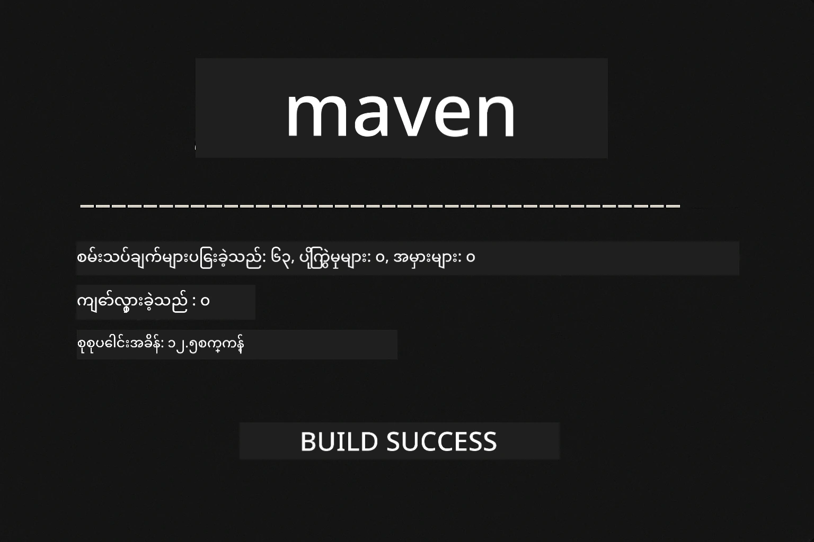
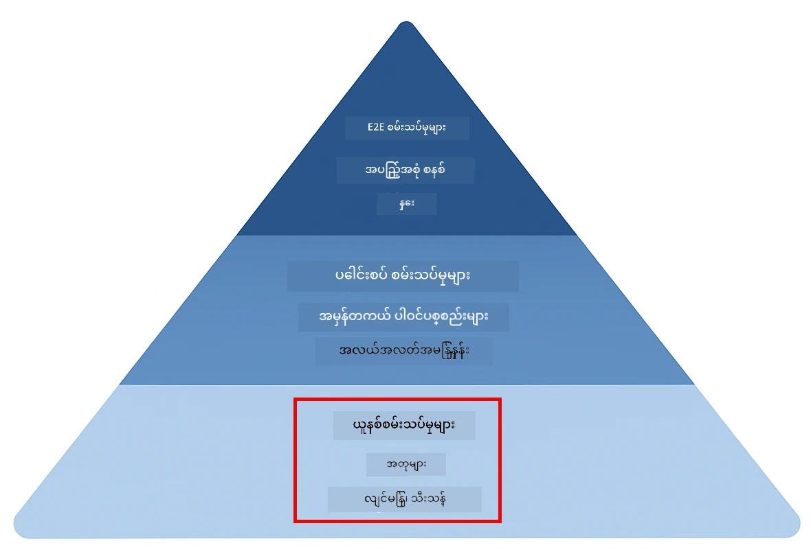
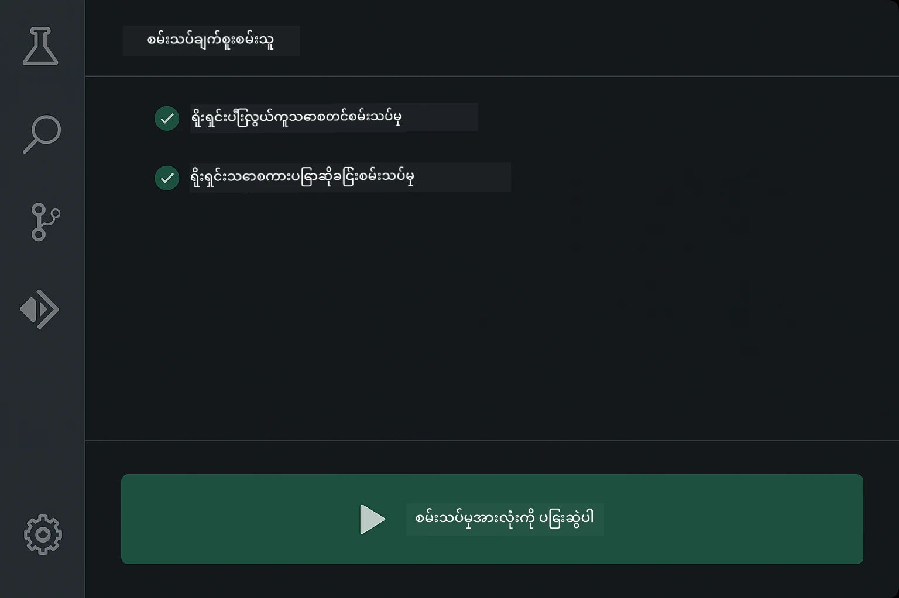
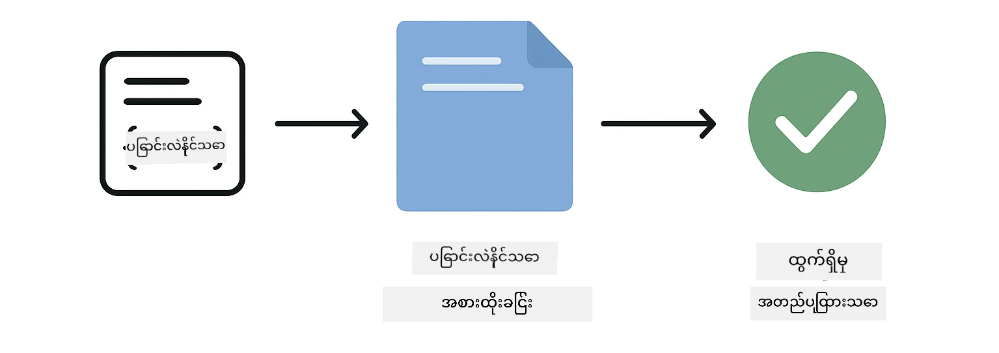
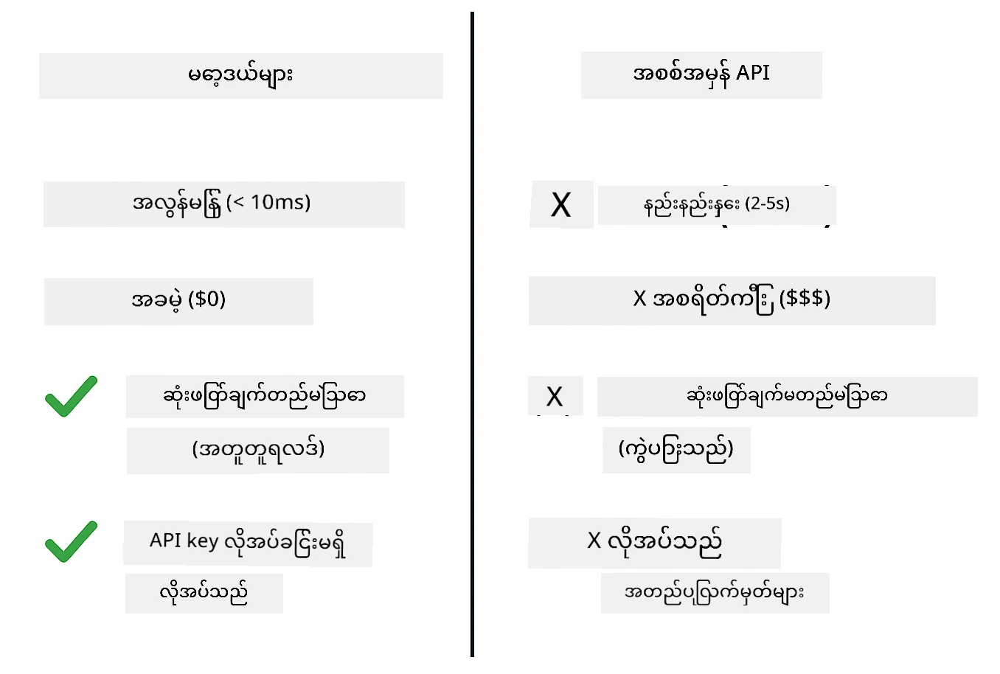
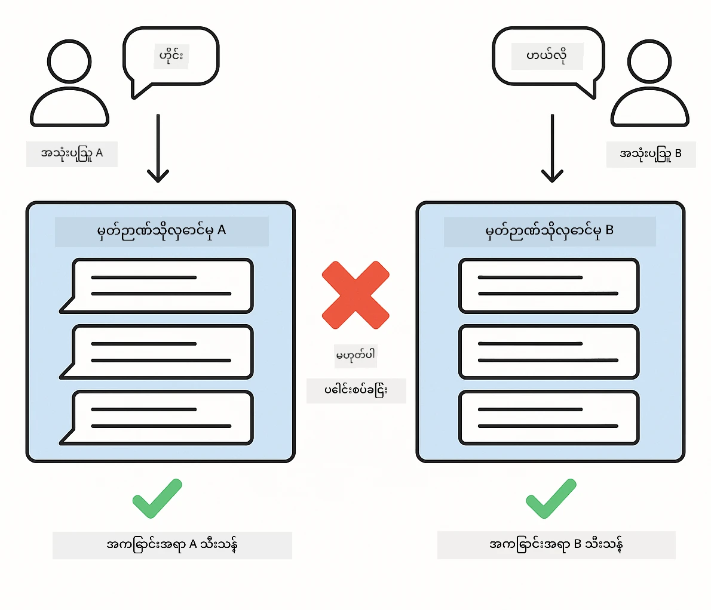
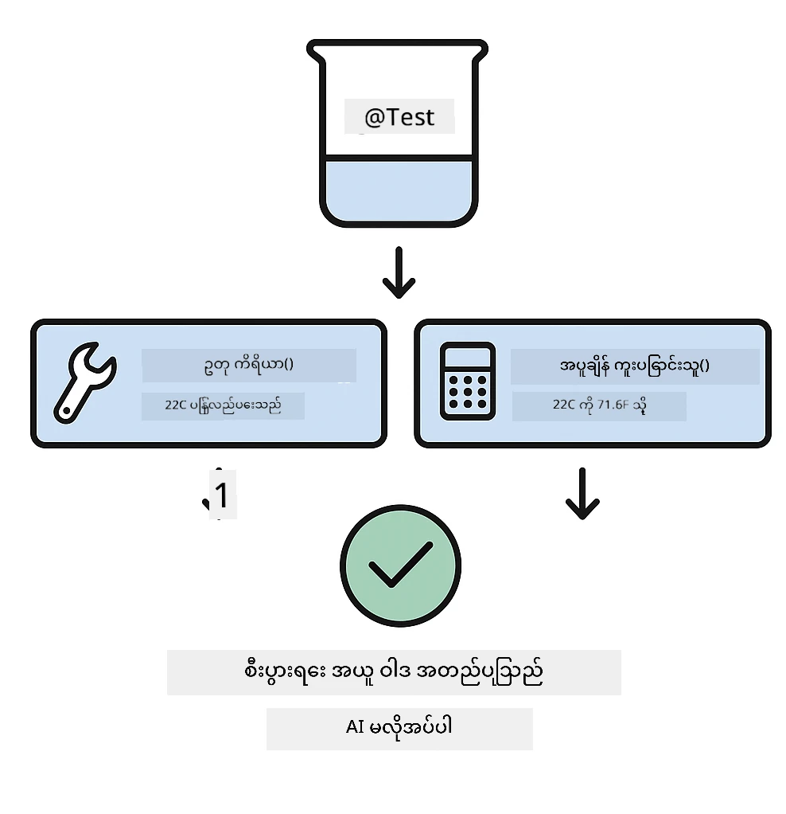
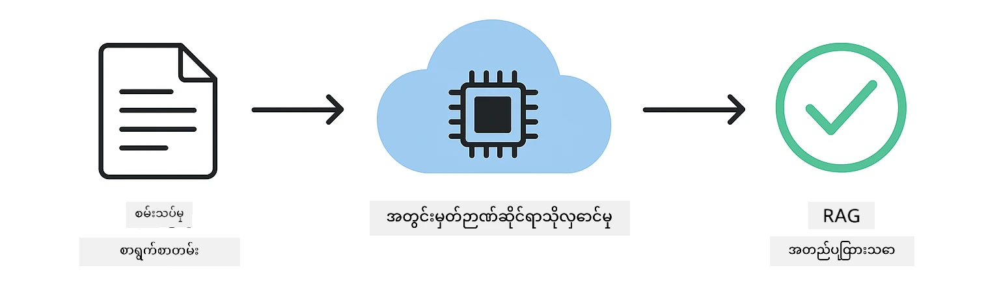

# LangChain4j အပလီကေးရှင်းများ စမ်းသပ်ခြင်း

## အကြောင်းအရာ စာရင်း

- [လျင်မြန်စွာ စတင်မှု](#လျင်မြန်စွာ-စတင်မှု)
- [စမ်းသပ်မှုတွင် ဖုံးအုပ်ထားသည့် အကြောင်းအရာများ](#စမ်းသပ်မှုတွင်-ဖုံးအုပ်ထားသည့်-အကြောင်းအရာများ)
- [စမ်းသပ်မှုများ ပြုလုပ်ခြင်း](#စမ်းသပ်မှုများ-ပြုလုပ်ခြင်း)
- [VS Code တွင် စမ်းသပ်မှုများ ပြုလုပ်ခြင်း](#vs-code-တွင်-စမ်းသပ်မှု-ပြုလုပ်ခြင်း)
- [စမ်းသပ်မှု ပုံစံများ](#စမ်းသပ်မှု-ပုံစံများ)
- [စမ်းသပ်မှု နည်းဗျူဟာ](#စမ်းသပ်မှု-နည်းဗျူဟာ)
- [နောက်ဆုံး လှုပ်ရှားမှုများ](#နောက်ဆုံး-လှုပ်ရှားမှုများ)

ဤလမ်းညွှန်သည် API key မလိုအပ်ဘဲ သို့မဟုတ် အပြင်ဘက်ဝန်ဆောင်မှုများ မလိုအပ်ဘဲ AI အပလီကေးရှင်းများကို ဘယ်လို စမ်းသပ်ရမည်ကို ပြသသည့် စမ်းသပ်မှုများနှင့် သင်ကို လမ်းညွှန်ပေးပါသည်။

## လျင်မြန်စွာ စတင်မှု

တစ်ချက်ချင်းသာဖြင့် စမ်းသပ်မှုအားလုံးကို လုပ်ဆောင်ပါ။

**Bash:**
```bash
mvn test
```

**PowerShell:**
```powershell
mvn --% test
```

စမ်းသပ်မှုအားလုံး အောင်မြင်ပါက အောက်ပါ screenshot များကဲ့သို့ အထွက်များကို မြင်ရမည် — စမ်းသပ်မှုများ ၀ မှတ်ချက်ဖြင့် ပြေးလျက်ရှိသည်။



*အောင်မြင်သော စမ်းသပ်မှု ညွှန်ပြချက် - စမ်းသပ်မှုအားလုံး အောင်မြင်စွာ ပြေးနေခြင်း*

## စမ်းသပ်မှုတွင် ဖုံးအုပ်ထားသည့် အကြောင်းအရာများ

ဤသင်တန်းမှာ ဒေသတွင်းတွင် ပြေးနေသော **ယူနစ်စမ်းသပ်မှုများ** ကို အလေးထားပါသည်။ တစ်ခုချင်းစမ်းသပ်မှုသည် LangChain4j အယူအဆ တစ်ရပ်ကို သီးခြားပြသပေးသည်။ အောက်ပါ စမ်းသပ်မှု ပန်နစ်ရမ်သည် ယူနစ်စမ်းသပ်မှုများ၏ တည်နေရာကို ပြသထားပြီး — ၎င်းသည် သင်၏ စမ်းသပ်မှု နည်းဗျူဟာကျစ်လစ်ပြီး ယုံကြည်စိတ်ချရသော အခြေခံအဖြစ် ဆောက်လုပ်ပေးသည်။



*ယူနစ်စမ်းသပ်မှုများ (မြန်ဆန်ပြီး သီးခြားထားသည်), ပေါင်းစပ်စမ်းသပ်မှုများ (အမည်မှန် တွဲဖက်ပစ္စည်းများ), နှင့် အဆုံး-to-အဆုံးစမ်းသပ်မှုများအကြား သင့်တန်းညှိမှုရှိမှုကို ပြသသော စမ်းသပ်မှု ပန်နစ်ရမ်။ ဤသင်တန်းသည် ယူနစ်စမ်းသပ်မှုကို ဖုံးအုပ်သည်။*

| Module | စမ်းသပ်မှုများ | အာရုံစိုက်ချက် | အဓိက ဖိုင်များ |
|--------|---------------|----------------|------------------|
| **01 - နိဒါန်း** | ၈ | စကားပြောမှတ်ဉာဏ်နှင့် အခြေအနေပြောင်းလဲမှု | `SimpleConversationTest.java` |
| **02 - Prompt Engineering** | ၁၂ | GPT-5.2 ပုံစံများ၊ စိတ်အားထက်သန်မှုအဆင့်များ၊ ဖွဲ့စည်းထားသော ထွက်ရှိမှု | `SimpleGpt5PromptTest.java` |
| **03 - RAG** | ၁၀ | စာရွက်စာတမ်း စိမ့်နှင့် ထည့်သွင်းခြင်း၊ embedding များ၊ သက်ဆိုင်ရာ ရှာဖွေမှု | `DocumentServiceTest.java`` |
| **04 - Tools** | ၁၂ | ဖန်တီးမှုခေါ်ဆိုခြင်းနှင့် ကိရိယာ ဆက်သွယ်ခြင်း | `SimpleToolsTest.java` |
| **05 - MCP** | ၈ | Model Context Protocol နှင့် Stdio ပို့ဆောင်မှု | `SimpleMcpTest.java` |

## စမ်းသပ်မှုများ ပြုလုပ်ခြင်း

**Root မှ စမ်းသပ်မှုအားလုံး ဖျော်ဖြေပါ:**

**Bash:**
```bash
mvn test
```

**PowerShell:**
```powershell
mvn --% test
```

**Module ဂဏန်းအလိုက် စမ်းသပ်မှုများ ဖျော်ဖြေချင်ပါက:**

**Bash:**
```bash
cd 01-introduction && mvn test
# သို့မဟုတ် ရုတ်မှ
mvn test -pl 01-introduction
```

**PowerShell:**
```powershell
cd 01-introduction; mvn --% test
# ဒါမှမဟုတ် root မှစပြီး
mvn --% test -pl 01-introduction
```

**Test class တစ်ခုကို ဖျော်ဖြေချင်သောအခါ:**

**Bash:**
```bash
mvn test -Dtest=SimpleConversationTest
```

**PowerShell:**
```powershell
mvn --% test -Dtest=SimpleConversationTest
```

**Test method တစ်ခုစီကို ဖျော်ဖြေချင်သောအခါ:**

**Bash:**
```bash
mvn test -Dtest=SimpleConversationTest#စကားပြောလမ်းကြောင်းမှတ်တမ်းကို ထောက်ထားသင့်သည်
```

**PowerShell:**
```powershell
mvn --% test -Dtest=SimpleConversationTest#စကားပြောဆိုမှုမှတ်တမ်းကို ထိန်းသိမ်းဆောင်ရမည်
```

## VS Code တွင် စမ်းသပ်မှု ပြုလုပ်ခြင်း

Visual Studio Code ကိုသုံးနေပါက Test Explorer သည် စမ်းသပ်မှုများ ဖျော်ဖြေခြင်းနှင့် debug လုပ်ခြင်းများအတွက် ဂရပ်ဖစ် အင်တာဖေ့စ်ကို ပေးသည်။



*VS Code Test Explorer မှာ Java test class အကုန်လုံးနှင့် တစ်ခုချင်းစီ test method များကို ပြသထားခြင်း*

**VS Code မှာ စမ်းသပ်မှုများ ဖျော်ဖြေရန်:**

1. Activity Bar မှ beaker icon ကို ကလစ်ပြီး Test Explorer ကို ဖွင့်ပါ
2. စမ်းသပ်မှု ပင်လယ်တော်ပင်ကို ဖြံ့ဖြိုး၍ module အားလုံးနှင့် test class များကို ကြည့်ပါ
3. တစုံတရာ စမ်းသပ်မှုကို တစ်ခုချင်းစီ ဖျော်ဖြေရန် play ခလုတ်ကို နှိပ်ပါ
4. "Run All Tests" ကို နှိပ်၍ စမ်းသပ်မှုအားလုံးကို ဖျော်ဖြေပါ
5. စမ်းသပ်မှုတစ်ခုခုကို right-click ပြီး "Debug Test" ရွေးပြီး breakpoints သတ်မှတ်ပြီး စမ်းသပ်မှုကို စီမံပါ

Test Explorer မှ အောင်မြင်သော စမ်းသပ်မှုများအတွက် အစိမ်းရောင် မှတ်ချက်များကို ပြသပြီး၊ မအောင်မြင်သော စမ်းသပ်မှုများအတွက် အသေးစိတ် ဖော်ပြချက်များ ပေးသည်။

## စမ်းသပ်မှု ပုံစံများ

### ပုံစံ ၁: Prompt Template စမ်းသပ်ခြင်း

နည်းလမ်းလွယ်ဆုံးမှာ AI မော်ဒယ်ကို မခေါ်ဘဲ prompt template များကို စမ်းသပ်ခြင်းဖြစ်သည်။ မူလကွန်ဗားရှင်းများအထိ ပြောင်းလဲမှုများမှန်ကန်မှုနှင့် prompt များ ဖော်စပ်မှု့မှန်ကန်မှုကို အတည်ပြုသည်။



*Prompt template စမ်းသပ်မှု တွင် ပုံစံအသစ်များ → တန်ဖိုးများ ထည့်သွင်းခြင်း → ဖော်စပ်မှု အတည်ပြုပြီးဖြစ်လာသည်။*

```java
@Test
@DisplayName("Should format prompt template with variables")
void testPromptTemplateFormatting() {
    PromptTemplate template = PromptTemplate.from(
        "Best time to visit {{destination}} for {{activity}}?"
    );
    
    Prompt prompt = template.apply(Map.of(
        "destination", "Paris",
        "activity", "sightseeing"
    ));
    
    assertThat(prompt.text()).isEqualTo("Best time to visit Paris for sightseeing?");
}
```

ဤပုံစံတွင် variable substitution မှန်ကန်စွာ လုပ်ဆောင်ပြီး prompt များ ပြန်တွေ့ရသည်မှာ အတည်ပြုသည် - API key သို့မဟုတ် မော်ဒယ်ခေါ်ဆိုမှု လိုအပ်မှု မရှိပါ။

### ပုံစံ ၂: Language Model များ Mock လုပ်ခြင်း

စကားပြောပုံစံ စမ်းသပ်သောအခါ Mockito ကို အသုံးပြုကာ ကြိုတင်သတ်မှတ်ထားသော ဖြေကြားချက်များ ကို ပြန်လည်ထုတ်ပေးသော မော်ဒယ်များ ဖန်တီးပါ။ ၎င်းသည် စမ်းသပ်မှုကို မြန်ဆန်ပြီး အခမဲ့၊ သတ်မှတ်ထားနိုင်သည့် ပုံစံဖြစ်စေသည်။



*စမ်းသပ်မှုအတွက် mock မော်ဒယ်များ၏ အားသာချက်များ – အမြန်၊ အခမဲ့၊ သတ်မှတ်နိုင်၍ API Key မလိုအပ်သည်။

```java
@ExtendWith(MockitoExtension.class)
class SimpleConversationTest {
    
    private ConversationService conversationService;
    
    @Mock
    private OpenAiOfficialChatModel mockChatModel;
    
    @BeforeEach
    void setUp() {
        ChatResponse mockResponse = ChatResponse.builder()
            .aiMessage(AiMessage.from("This is a test response"))
            .build();
        when(mockChatModel.chat(anyList())).thenReturn(mockResponse);
        
        conversationService = new ConversationService(mockChatModel);
    }
    
    @Test
    void shouldMaintainConversationHistory() {
        String conversationId = conversationService.startConversation();
        
        ChatResponse mockResponse1 = ChatResponse.builder()
            .aiMessage(AiMessage.from("Response 1"))
            .build();
        ChatResponse mockResponse2 = ChatResponse.builder()
            .aiMessage(AiMessage.from("Response 2"))
            .build();
        ChatResponse mockResponse3 = ChatResponse.builder()
            .aiMessage(AiMessage.from("Response 3"))
            .build();
        
        when(mockChatModel.chat(anyList()))
            .thenReturn(mockResponse1)
            .thenReturn(mockResponse2)
            .thenReturn(mockResponse3);

        conversationService.chat(conversationId, "First message");
        conversationService.chat(conversationId, "Second message");
        conversationService.chat(conversationId, "Third message");

        List<ChatMessage> history = conversationService.getHistory(conversationId);
        assertThat(history).hasSize(6); // 3 ယူဇာ + 3 AI စာတိုများ
    }
}
```

ဤ ပုံစံသည် `01-introduction/src/test/java/com/example/langchain4j/service/SimpleConversationTest.java` တွင် တွေ့နိုင်သည်။ mock မော်ဒယ်သည် သတိမှတ်ဉာဏ်စီမံခန့်ခွဲမှု လုပ်ဆောင်မှုအား တည်ငြိမ်စေရန် သေချာစေသည်။

### ပုံစံ ၃: စကားပြောခွဲခြားမှု စမ်းသပ်ခြင်း

စကားပြောမှတ်ဉာဏ်သည် အသုံးပြုသူများစွာ အကွာအဝေးထားရပါမည်။ ဤစမ်းသပ်မှုသည် စကားပြောများ သီးခြားထားသည်ကို အတည်ပြုသည်။



*တစ်ဦးချင်း အသုံးပြုသူများအတွက် သီးခြားသော မှတ်ဉာဏ် စုစည်းမှုများရှိခြင်းကို ပြသ၍ context မပေါင်းစပ်ဘဲ ဖြစ်စေရန် စမ်းသပ်ခြင်း*

```java
@Test
void shouldIsolateConversationsByid() {
    String conv1 = conversationService.startConversation();
    String conv2 = conversationService.startConversation();
    
    ChatResponse mockResponse = ChatResponse.builder()
        .aiMessage(AiMessage.from("Response"))
        .build();
    when(mockChatModel.chat(anyList())).thenReturn(mockResponse);

    conversationService.chat(conv1, "Message for conversation 1");
    conversationService.chat(conv2, "Message for conversation 2");

    List<ChatMessage> history1 = conversationService.getHistory(conv1);
    List<ChatMessage> history2 = conversationService.getHistory(conv2);
    
    assertThat(history1).hasSize(2);
    assertThat(history2).hasSize(2);
}
```

တစ်စကားပြောတိုင်းသည် သီးခြား လွတ်လပ်သည့် သမိုင်းစာမျက်နှာကို ထိန်းသိမ်းထားသည်။ ထုတ်လုပ်မှုစနစ်များတွင် ၎င်းသည် ပိုမိုအရေးကြီးသည်။

### ပုံစံ ၄: Tools များကို သီးခြားစမ်းသပ်ခြင်း

Tools ဆိုသည်မှာ AI သုံးနိုင်သော function များဖြစ်သည်။ AI ဆုံးဖြတ်ချက်မလိုပဲ မျက်နှာတိုက်စမ်းသပ်မှုများပြုလုပ်ပါ။



*AI ခေါ်ဆိုမှုမရှိပဲ လုပ်ငန်းသဘောတရားများကို အတည်ပြုရန် mock tool များဖြင့် tools စမ်းသပ်ခြင်း*

```java
@Test
void shouldConvertCelsiusToFahrenheit() {
    TemperatureTool tempTool = new TemperatureTool();
    String result = tempTool.celsiusToFahrenheit(25.0);
    assertThat(result).containsPattern("77[.,]0°F");
}

@Test
void shouldDemonstrateToolChaining() {
    WeatherTool weatherTool = new WeatherTool();
    TemperatureTool tempTool = new TemperatureTool();

    String weatherResult = weatherTool.getCurrentWeather("Seattle");
    assertThat(weatherResult).containsPattern("\\d+°C");

    String conversionResult = tempTool.celsiusToFahrenheit(22.0);
    assertThat(conversionResult).containsPattern("71[.,]6°F");
}
```

ဤ စမ်းသပ်မှုများသည် `04-tools/src/test/java/com/example/langchain4j/agents/tools/SimpleToolsTest.java` မှဖြစ်ပြီး AI ပါဝင်မှုမရှိဘဲ tool logic များကို စစ်ဆေးသည်။ chaining ပုံစံမှာ tool တစ်ခုထွက်ရှိသော ထွက်ရှိမှုကို နောက်တစ်ခုထဲ ထည့်သွင်းသည်ကို ပြသသည်။

### ပုံစံ ၅: In-Memory RAG စမ်းသပ်ခြင်း

RAG စနစ်များသည် ရောနှောသိမ်းဆည်းမှု ဒေတာဘေ့စ်များနှင့် embedding ဝန်ဆောင်မှုများလိုအပ်သည်။ In-memory ပုံစံဖြင့် အပြင်ဘက် မလိုအပ်ဘဲ pipeline အားလုံးကို စမ်းသပ်နိုင်သည်။



*ဒေတာဘေ့စ် မလိုအပ်ပဲ စာရွက်စာတမ်း ဖတ်ထုတ်ခြင်း၊ embedding သိမ်းဆည်းခြင်းနှင့် သက်ဆိုင်ရာ ရှာဖွေမှုများ ပြုလုပ်နည်း စမ်းသပ်ခြင်း*

```java
@Test
void testProcessTextDocument() {
    String content = "This is a test document.\nIt has multiple lines.";
    InputStream inputStream = new ByteArrayInputStream(content.getBytes(StandardCharsets.UTF_8));
    
    DocumentService.ProcessedDocument result = 
        documentService.processDocument(inputStream, "test.txt");

    assertNotNull(result);
    assertTrue(result.segments().size() > 0);
    assertEquals("test.txt", result.segments().get(0).metadata().getString("filename"));
}
```

ဤစမ်းသပ်မှုကို `03-rag/src/test/java/com/example/langchain4j/rag/service/DocumentServiceTest.java` တွင် တွေ့နိုင်ပြီး စာရွက်စာတမ်းတစ်စောင်ကို မှတ်ဉာဏ်ထဲတွင် ဖန်တီးကာ ချန်ကွတ်မှု နှင့် ပြည့်စုံမှုနှင့် metadata ကို အတည်ပြုသည်။

### ပုံစံ ၆: MCP ပေါင်းစည်းစမ်းသပ်ခြင်း

MCP module သည် Model Context Protocol ပေါင်းစည်းမှုကို stdio ပို့ဆောင်မှုဖြင့် စမ်းသပ်သည်။ ဤစမ်းသပ်မှုများသည် သင့်အပလီကေးရှင်းသည် MCP server များကို subprocess အဖြစ် spawn ပြီး ဆက်သွယ်နိုင်မှုကို အတည်ပြုသည်။

`05-mcp/src/test/java/com/example/langchain4j/mcp/SimpleMcpTest.java` တွင် စမ်းသပ်မှုများရှိသည်။

**ရိုက်ထည့်ရန်:**

**Bash:**
```bash
cd 05-mcp && mvn test
```

**PowerShell:**
```powershell
cd 05-mcp; mvn --% test
```

## စမ်းသပ်မှု နည်းဗျူဟာ

AI ကိုမစမ်းသပ်ပါနဲ့၊ သင်ရေးသားထားသော code ကို စမ်းသပ်ပါ။ သင့်စမ်းသပ်မှုများသည် prompt များ ဘယ်လို ဖွဲ့စည်းထားသည်၊ မှတ်ဉာဏ်ကို မည်သို့ စီမံထားသည်၊ ကိရိယာများက ဘယ်လို လုပ်ဆောင်သည်ကို စစ်ဆေးခြင်းဖြင့် သင်ရေးသော code ကို တိုက်ရိုက်အတည်ပြုသင့်သည်။ AI ဖြေကြားမှုများက မတည်ငြိမ်ပြီး စမ်းသပ်မှု သတ်မှတ်ချက်၏ အပိုင်းမဖြစ်သင့်ပါ။ ၎င်း၏ prompt template သည် variable များကို မှန်ကန်စွာ ဖြည့်တင်းနိုင်မှုကိုသာ စစ်ဆေးပါ၊ AI မှ မှန်ကန်သောဖြေကြားချက်ရသည်ဟု မေးလိုက်ပါနှင့်။

Language model များအတွက် mock များကို သုံးပါ။ ၎င်းတို့မှာ အပြင်ဘက်ရင်းမြစ်များဖြစ်ပြီး နှေးကာ၊ စျေးကြီးကာ၊ သတ်မှတ်နိုင်မှု မရှိပါ။ Mocking သည် စမ်းသပ်မှုများသို့မဟုတ် စက္ကန့်အစား မီလီစက္ကန့်အတွင်း မြန်ဆန်စေပြီး၊ အခမဲ့ဖြစ်ကာ၊ တစ်ကြိမ်တိုင်း အတူတူရလဒ် ပေးနိုင်စေသည်။

စမ်းသပ်မှုများကို သီးခြားထားပါ။ တစ်ခုချင်းစမ်းသပ်မှုသည် ကိုယ်ပိုင် data ကို ပြင်ဆင်ပြီး၊ အခြားစမ်းသပ်မှုများ မပေါ်တွင် အခြေခံခြင်းမရှိဘဲ၊ ကိုယ်တိုင် ပြင်ဆင်ပြီး ပြီးနောက် ရှင်းလင်းသင့်သည်။ စမ်းသပ်မှုများသည် လုပ်ဆောင်မှု အ ဆင့်လျော်ခြင်းမရှိပဲ အောင်မြင်သင့်သည်။

စမ်းသပ်မှုများကို "happy path" ကျော်လွန် ပိုမို အပိုင်းခွဲစမ်းသပ်ပါ။ ဝင်ရိုးအချင်းအဆက် မရှိ၊ အလွန်ကြီးမားသော input များ၊ အထူးလက္ခဏာများ၊ မှားနေတာ parameter များနှင့် နယ်နိမိတ် အခြေအနေများကို စမ်းသပ်ပါ။ အများအားဖြင့် ၎င်းတို့သည် ပုံမှန်အသုံးပြုမှုတွင် မတွေ့ရသည့် အမှားများကို ဖော်ထုတ်ပေးပါသည်။

ဖော်ပြချက်အမည်များကို အသုံးပြုပါ။ `shouldMaintainConversationHistoryAcrossMultipleMessages()` နှင့် `test1()` ကို နှိုင်းယှဥ်ကြည့်ပါ။ ပထမဆုံးမှာ အသေးစိတ် စမ်းသပ်မှုအကြောင်းကို ပြောပြသည့်အတွက် မျှတစွာ အမှားပြေရှင်းရလွယ်ကူသည်။

## နောက်ဆုံး လှုပ်ရှားမှုများ

စမ်းသပ်မှု ပုံစံများကို နားလည်သွားပါက၊ အောက်ပါ module တစ်ခုချင်းစီကို ပိုမို ကျယ်ကျယ်ပြန့်ပြန့် လေ့လာပါ။

- **[01 -  နိဒါန်း](../01-introduction/README.md)** - စကားပြောမှတ်ဉာဏ် စီမံခန့်ခွဲမှု သင်ယူပါ
- **[02 - Prompt Engineering](../02-prompt-engineering/README.md)** - GPT-5.2 prompt ပုံစံများ ကျွမ်းကျင်ပါ
- **[03 - RAG](../03-rag/README.md)** - retrieval-augmented generation စနစ်များ တည်ဆောက်ပါ
- **[04 - Tools](../04-tools/README.md)** - function calling နှင့် tool chaining ကို အကောင်အထည် ဖော်ပါ
- **[05 - MCP](../05-mcp/README.md)** - Model Context Protocol ပေါင်းစည်းမှု

တစ်ခုချင်း စာမျက်နှာများတွင် ယင်းတို့တွင် စမ်းသပ်မှု ပညာရပ်များကို အသေးစိတ် ရှင်းလင်းထားပါသည်။

---

**လမ်းညွှန်မှု:** [← နောက်သို့ သွားရန်](../README.md)

---

<!-- CO-OP TRANSLATOR DISCLAIMER START -->
**ပြောကြားချက်**
ဤစာတမ်းကို AI ဘာသာပြန်ဝန်ဆောင်မှု [Co-op Translator](https://github.com/Azure/co-op-translator) အသုံးပြု၍ ဘာသာပြန်ထားပါသည်။ ကျွန်ုပ်တို့သည် တိကျမှန်ကန်မှုအတွက် ကြိုးပမ်းနေသော်လည်း၊ စက်ကိရိယာဘာသာပြန်ခြင်းများတွင် အမှားများ သို့မဟုတ် မှားယွင်းချက်များ ပါဝင်နိုင်ကြောင်း သတိပြုပါရန် လိုအပ်ပါသည်။ မူလစာတမ်းကို မူရင်းဘာသာဖြင့်သာ ယုံကြည်စိတ်ချရသော အချက်အလက်အဖြစ် သတ်မှတ်သင့်သည်။ အရေးကြီးသည့် သတင်းအချက်အလက်များအတွက် ပရော်ဖက်ရှင်နယ် လူသားဘာသာပြန်သူဝန်ဆောင်မှုကို အကြံပြုပါသည်။ ဤဘာသာပြန်ချက်ကို အသုံးပြုခြင်းမှ ဖြစ်ပေါ်လာသော နားလည်မှုကွာခြားမှုများ သို့မဟုတ် မမှန်ကန်သော အသုံးပြုမှုများအတွက် ကျွန်ုပ်တို့ တာဝန်မခံပါ။
<!-- CO-OP TRANSLATOR DISCLAIMER END -->