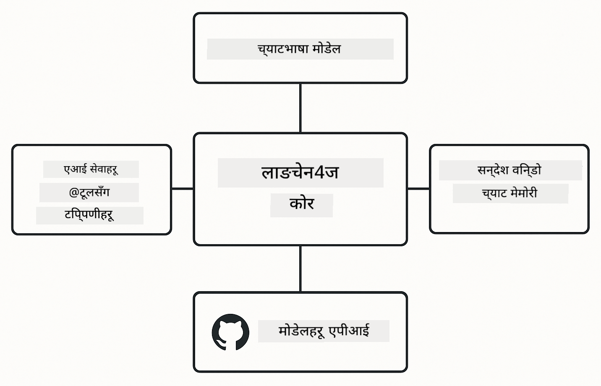

<!--
CO_OP_TRANSLATOR_METADATA:
{
  "original_hash": "377b3e3e6f8d02965bf0fbbc9ccb45c5",
  "translation_date": "2025-12-13T14:47:34+00:00",
  "source_file": "00-quick-start/README.md",
  "language_code": "ne"
}
-->
# Module 00: छिटो सुरु

## सामग्री तालिका

- [परिचय](../../../00-quick-start)
- [LangChain4j के हो?](../../../00-quick-start)
- [LangChain4j निर्भरता](../../../00-quick-start)
- [पूर्व आवश्यकताहरू](../../../00-quick-start)
- [सेटअप](../../../00-quick-start)
  - [1. आफ्नो GitHub टोकन प्राप्त गर्नुहोस्](../../../00-quick-start)
  - [2. आफ्नो टोकन सेट गर्नुहोस्](../../../00-quick-start)
- [उदाहरणहरू चलाउनुहोस्](../../../00-quick-start)
  - [1. आधारभूत च्याट](../../../00-quick-start)
  - [2. प्रॉम्प्ट ढाँचा](../../../00-quick-start)
  - [3. फंक्शन कलिङ](../../../00-quick-start)
  - [4. कागजात प्रश्नोत्तर (RAG)](../../../00-quick-start)
- [हरेक उदाहरणले के देखाउँछ](../../../00-quick-start)
- [अर्को कदमहरू](../../../00-quick-start)
- [समस्या समाधान](../../../00-quick-start)

## परिचय

यो छिटो सुरु तपाईंलाई LangChain4j सँग सकेसम्म छिटो काम गर्न सुरु गर्नका लागि बनाइएको हो। यसले LangChain4j र GitHub मोडेलहरूसँग AI अनुप्रयोगहरू निर्माण गर्ने आधारभूत कुराहरू समेट्छ। आगामी मोड्युलहरूमा तपाईं Azure OpenAI सँग LangChain4j प्रयोग गरेर थप उन्नत अनुप्रयोगहरू निर्माण गर्नुहुनेछ।

## LangChain4j के हो?

LangChain4j एक Java पुस्तकालय हो जसले AI-सञ्चालित अनुप्रयोगहरू निर्माण गर्न सजिलो बनाउँछ। HTTP क्लाइन्ट र JSON पार्सिङसँग जुध्नुभन्दा, तपाईं सफा Java API हरूसँग काम गर्नुहुन्छ।

LangChain मा "चेन" भन्नाले धेरै कम्पोनेन्टहरूलाई सँगै जोड्नु हो - तपाईंले प्रॉम्प्टलाई मोडेलमा, त्यसपछि पार्सरमा जोड्न सक्नुहुन्छ, वा धेरै AI कलहरूलाई सँगै जोड्न सक्नुहुन्छ जहाँ एउटा आउटपुट अर्को इनपुटमा जान्छ। यो छिटो सुरु आधारभूत कुराहरूमा केन्द्रित छ, जटिल चेनहरू अन्वेषण गर्नु अघि।


*LangChain4j मा कम्पोनेन्टहरूलाई जोड्ने - शक्तिशाली AI कार्यप्रवाहहरू निर्माण गर्ने ब्लकहरू*

हामी तीन मुख्य कम्पोनेन्टहरू प्रयोग गर्नेछौं:

**ChatLanguageModel** - AI मोडेल अन्तरक्रियाको इन्टरफेस। `model.chat("prompt")` कल गर्नुहोस् र प्रतिक्रिया स्ट्रिङ प्राप्त गर्नुहोस्। हामी `OpenAiOfficialChatModel` प्रयोग गर्छौं जुन OpenAI-संग मिल्ने अन्त्यबिन्दुहरू जस्तै GitHub मोडेलहरूसँग काम गर्छ।

**AiServices** - प्रकार-सुरक्षित AI सेवा इन्टरफेसहरू सिर्जना गर्छ। विधिहरू परिभाषित गर्नुहोस्, तिनीहरूलाई `@Tool` ले एनोटेट गर्नुहोस्, र LangChain4j ले समन्वय गर्छ। AI ले आवश्यक पर्दा तपाईंका Java विधिहरूलाई स्वचालित रूपमा कल गर्छ।

**MessageWindowChatMemory** - संवाद इतिहास कायम राख्छ। यसबिना, प्रत्येक अनुरोध स्वतन्त्र हुन्छ। यससँग, AI ले अघिल्ला सन्देशहरू सम्झन्छ र धेरै चरणहरूमा सन्दर्भ कायम राख्छ।



*LangChain4j वास्तुकला - मुख्य कम्पोनेन्टहरू सँगै काम गर्दै तपाईंका AI अनुप्रयोगहरूलाई शक्ति दिन्छ*

## LangChain4j निर्भरता

यो छिटो सुरु [`pom.xml`](../../../00-quick-start/pom.xml) मा दुई Maven निर्भरता प्रयोग गर्छ:

```xml
<!-- Core LangChain4j library -->
<dependency>
    <groupId>dev.langchain4j</groupId>
    <artifactId>langchain4j</artifactId> <!-- Inherited from BOM in root pom.xml -->
</dependency>

<!-- OpenAI integration (works with GitHub Models) -->
<dependency>
    <groupId>dev.langchain4j</groupId>
    <artifactId>langchain4j-open-ai-official</artifactId> <!-- Inherited from BOM in root pom.xml -->
</dependency>
```

`langchain4j-open-ai-official` मोड्युलले `OpenAiOfficialChatModel` कक्षा प्रदान गर्छ जुन OpenAI-संग मिल्ने API हरूसँग जडान गर्छ। GitHub मोडेलहरूले उही API ढाँचा प्रयोग गर्छन्, त्यसैले कुनै विशेष एडाप्टर आवश्यक छैन - केवल आधार URL लाई `https://models.github.ai/inference` मा सेट गर्नुहोस्।

## पूर्व आवश्यकताहरू

**Dev Container प्रयोग गर्दै हुनुहुन्छ?** Java र Maven पहिले नै इन्स्टल छन्। तपाईंलाई केवल GitHub व्यक्तिगत पहुँच टोकन चाहिन्छ।

**स्थानीय विकास:**
- Java 21+, Maven 3.9+
- GitHub व्यक्तिगत पहुँच टोकन (तल निर्देशनहरू)

> **नोट:** यो मोड्युलले GitHub मोडेलहरूबाट `gpt-4.1-nano` प्रयोग गर्छ। कोडमा मोडेल नाम परिवर्तन नगर्नुहोस् - यो GitHub का उपलब्ध मोडेलहरूसँग काम गर्न कन्फिगर गरिएको छ।

## सेटअप

### 1. आफ्नो GitHub टोकन प्राप्त गर्नुहोस्

1. [GitHub सेटिङ्स → व्यक्तिगत पहुँच टोकनहरू](https://github.com/settings/personal-access-tokens) मा जानुहोस्
2. "Generate new token" क्लिक गर्नुहोस्
3. वर्णनात्मक नाम सेट गर्नुहोस् (जस्तै, "LangChain4j Demo")
4. समाप्ति समय सेट गर्नुहोस् (7 दिन सिफारिस)
5. "Account permissions" अन्तर्गत "Models" लाई "Read-only" मा सेट गर्नुहोस्
6. "Generate token" क्लिक गर्नुहोस्
7. आफ्नो टोकन कपी गरी सुरक्षित राख्नुहोस् - यो फेरि देखिने छैन

### 2. आफ्नो टोकन सेट गर्नुहोस्

**विकल्प 1: VS Code प्रयोग गर्दै (सिफारिस गरिएको)**

यदि तपाईं VS Code प्रयोग गर्दै हुनुहुन्छ भने, आफ्नो टोकन प्रोजेक्ट रुटमा `.env` फाइलमा थप्नुहोस्:

यदि `.env` फाइल छैन भने, `.env.example` लाई `.env` मा कपी गर्नुहोस् वा नयाँ `.env` फाइल सिर्जना गर्नुहोस्।

**उदाहरण `.env` फाइल:**
```bash
# /workspaces/LangChain4j-for-Beginners/.env मा
GITHUB_TOKEN=your_token_here
```

त्यसपछि तपाईं सजिलै कुनै पनि डेमो फाइल (जस्तै, `BasicChatDemo.java`) मा राइट-क्लिक गरेर **"Run Java"** चयन गर्न सक्नुहुन्छ वा Run and Debug प्यानलबाट लन्च कन्फिगरेसनहरू प्रयोग गर्न सक्नुहुन्छ।

**विकल्प 2: टर्मिनल प्रयोग गर्दै**

टोकनलाई वातावरण चरको रूपमा सेट गर्नुहोस्:

**Bash:**
```bash
export GITHUB_TOKEN=your_token_here
```

**PowerShell:**
```powershell
$env:GITHUB_TOKEN=your_token_here
```

## उदाहरणहरू चलाउनुहोस्

**VS Code प्रयोग गर्दै:** कुनै पनि डेमो फाइलमा राइट-क्लिक गरेर **"Run Java"** चयन गर्नुहोस्, वा Run and Debug प्यानलबाट लन्च कन्फिगरेसनहरू प्रयोग गर्नुहोस् (पहिले `.env` फाइलमा टोकन थप्न नबिर्सनुहोस्)।

**Maven प्रयोग गर्दै:** वैकल्पिक रूपमा, कमाण्ड लाइनबाट चलाउन सक्नुहुन्छ:

### 1. आधारभूत च्याट

**Bash:**
```bash
mvn compile exec:java -Dexec.mainClass=com.example.langchain4j.quickstart.BasicChatDemo
```

**PowerShell:**
```powershell
mvn --% compile exec:java -Dexec.mainClass=com.example.langchain4j.quickstart.BasicChatDemo
```

### 2. प्रॉम्प्ट ढाँचा

**Bash:**
```bash
mvn compile exec:java -Dexec.mainClass=com.example.langchain4j.quickstart.PromptEngineeringDemo
```

**PowerShell:**
```powershell
mvn --% compile exec:java -Dexec.mainClass=com.example.langchain4j.quickstart.PromptEngineeringDemo
```

शून्य-शट, थोरै-शट, चेन-ऑफ-थट, र भूमिका-आधारित प्रॉम्प्टिङ देखाउँछ।

### 3. फंक्शन कलिङ

**Bash:**
```bash
mvn compile exec:java -Dexec.mainClass=com.example.langchain4j.quickstart.ToolIntegrationDemo
```

**PowerShell:**
```powershell
mvn --% compile exec:java -Dexec.mainClass=com.example.langchain4j.quickstart.ToolIntegrationDemo
```

AI ले आवश्यक पर्दा तपाईंका Java विधिहरूलाई स्वचालित रूपमा कल गर्छ।

### 4. कागजात प्रश्नोत्तर (RAG)

**Bash:**
```bash
mvn compile exec:java -Dexec.mainClass=com.example.langchain4j.quickstart.SimpleReaderDemo
```

**PowerShell:**
```powershell
mvn --% compile exec:java -Dexec.mainClass=com.example.langchain4j.quickstart.SimpleReaderDemo
```

`document.txt` मा रहेको सामग्रीबारे प्रश्न सोध्नुहोस्।

## हरेक उदाहरणले के देखाउँछ

**आधारभूत च्याट** - [BasicChatDemo.java](../../../00-quick-start/src/main/java/com/example/langchain4j/quickstart/BasicChatDemo.java)

यहाँबाट सुरु गर्नुहोस् र LangChain4j लाई यसको सबैभन्दा सरल अवस्थामा हेर्नुहोस्। तपाईं `OpenAiOfficialChatModel` सिर्जना गर्नुहुनेछ, `.chat()` सँग प्रॉम्प्ट पठाउनुहुनेछ, र प्रतिक्रिया प्राप्त गर्नुहुनेछ। यसले आधारभूत कुरा देखाउँछ: कसरी कस्टम अन्त्यबिन्दु र API कुञ्जीहरूसँग मोडेलहरू आरम्भ गर्ने। यो ढाँचा बुझिसकेपछि, बाँकी सबै यसमा आधारित हुन्छ।

```java
ChatLanguageModel model = OpenAiOfficialChatModel.builder()
    .baseUrl("https://models.github.ai/inference")
    .apiKey(System.getenv("GITHUB_TOKEN"))
    .modelName("gpt-4.1-nano")
    .build();

String response = model.chat("What is LangChain4j?");
System.out.println(response);
```

> **🤖 [GitHub Copilot](https://github.com/features/copilot) च्याटसँग प्रयास गर्नुहोस्:** [`BasicChatDemo.java`](../../../00-quick-start/src/main/java/com/example/langchain4j/quickstart/BasicChatDemo.java) खोल्नुहोस् र सोध्नुहोस्:
> - "यस कोडमा GitHub मोडेलहरूबाट Azure OpenAI मा कसरी स्विच गर्ने?"
> - "OpenAiOfficialChatModel.builder() मा अरु कुन-कुन प्यारामिटरहरू कन्फिगर गर्न सकिन्छ?"
> - "पूर्ण प्रतिक्रिया पर्खनुको सट्टा स्ट्रिमिङ प्रतिक्रिया कसरी थप्ने?"

**प्रॉम्प्ट इन्जिनियरिङ** - [PromptEngineeringDemo.java](../../../00-quick-start/src/main/java/com/example/langchain4j/quickstart/PromptEngineeringDemo.java)

अब तपाईं मोडेलसँग कसरी कुरा गर्ने जान्नुभयो, अब हेर्नुहोस् के भन्नुहुन्छ। यो डेमोले उही मोडेल सेटअप प्रयोग गर्छ तर चार फरक प्रॉम्प्टिङ ढाँचाहरू देखाउँछ। सिधा निर्देशनका लागि शून्य-शट प्रॉम्प्टहरू, उदाहरणबाट सिक्ने थोरै-शट प्रॉम्प्टहरू, तर्कका चरणहरू देखाउने चेन-ऑफ-थट प्रॉम्प्टहरू, र सन्दर्भ सेट गर्ने भूमिका-आधारित प्रॉम्प्टहरू प्रयास गर्नुहोस्। तपाईं देख्नुहुनेछ कि एउटै मोडेलले तपाईंको अनुरोध कसरी फरक तरिकाले प्रतिक्रिया दिन्छ।

```java
PromptTemplate template = PromptTemplate.from(
    "What's the best time to visit {{destination}} for {{activity}}?"
);

Prompt prompt = template.apply(Map.of(
    "destination", "Paris",
    "activity", "sightseeing"
));

String response = model.chat(prompt.text());
```

> **🤖 [GitHub Copilot](https://github.com/features/copilot) च्याटसँग प्रयास गर्नुहोस्:** [`PromptEngineeringDemo.java`](../../../00-quick-start/src/main/java/com/example/langchain4j/quickstart/PromptEngineeringDemo.java) खोल्नुहोस् र सोध्नुहोस्:
> - "शून्य-शट र थोरै-शट प्रॉम्प्टिङमा के फरक छ, र कहिले कुन प्रयोग गर्ने?"
> - "तापक्रम प्यारामिटरले मोडेलको प्रतिक्रियामा कसरी प्रभाव पार्छ?"
> - "उत्पादनमा प्रॉम्प्ट इन्जेक्सन आक्रमण रोक्न के के तरिका छन्?"
> - "सामान्य ढाँचाहरूका लागि पुन: प्रयोग गर्न मिल्ने PromptTemplate वस्तुहरू कसरी बनाउने?"

**टूल एकीकरण** - [ToolIntegrationDemo.java](../../../00-quick-start/src/main/java/com/example/langchain4j/quickstart/ToolIntegrationDemo.java)

यहाँ LangChain4j शक्तिशाली हुन्छ। तपाईं `AiServices` प्रयोग गरेर AI सहायक बनाउनुहुनेछ जसले तपाईंका Java विधिहरूलाई कल गर्न सक्छ। केवल विधिहरूलाई `@Tool("description")` ले एनोटेट गर्नुहोस् र LangChain4j बाँकी सम्हाल्छ - AI ले प्रयोगकर्ताले सोधेको आधारमा कुन टूल प्रयोग गर्ने निर्णय गर्छ। यसले फंक्शन कलिङ देखाउँछ, जुन AI लाई केवल प्रश्नको उत्तर दिन नभई कार्यहरू गर्न सक्षम बनाउने प्रमुख प्रविधि हो।

```java
@Tool("Performs addition of two numeric values")
public double add(double a, double b) {
    return a + b;
}

MathAssistant assistant = AiServices.create(MathAssistant.class, model);
String response = assistant.chat("What is 25 plus 17?");
```

> **🤖 [GitHub Copilot](https://github.com/features/copilot) च्याटसँग प्रयास गर्नुहोस्:** [`ToolIntegrationDemo.java`](../../../00-quick-start/src/main/java/com/example/langchain4j/quickstart/ToolIntegrationDemo.java) खोल्नुहोस् र सोध्नुहोस्:
> - "@Tool एनोटेशन कसरी काम गर्छ र LangChain4j यसलाई पछाडि कसरी सम्हाल्छ?"
> - "के AI ले जटिल समस्याहरू समाधान गर्न एकपछि अर्को धेरै टूलहरू कल गर्न सक्छ?"
> - "यदि टूलले अपवाद फ्याँक्यो भने के हुन्छ - म कसरी त्रुटिहरू सम्हाल्ने?"
> - "यो क्याल्कुलेटर उदाहरणको सट्टा वास्तविक API कसरी एकीकृत गर्ने?"

**कागजात प्रश्नोत्तर (RAG)** - [SimpleReaderDemo.java](../../../00-quick-start/src/main/java/com/example/langchain4j/quickstart/SimpleReaderDemo.java)

यहाँ तपाईं RAG (retrieval-augmented generation) को आधार देख्नुहुनेछ। मोडेलको प्रशिक्षण डाटामा भरपर्दा होइन, तपाईं [`document.txt`](../../../00-quick-start/document.txt) बाट सामग्री लोड गर्नुहुन्छ र प्रॉम्प्टमा समावेश गर्नुहुन्छ। AI तपाईंको कागजातको आधारमा जवाफ दिन्छ, यसको सामान्य ज्ञानमा होइन। यो तपाईंको आफ्नै डाटासँग काम गर्ने प्रणालीहरू निर्माण गर्ने पहिलो कदम हो।

```java
Document document = FileSystemDocumentLoader.loadDocument("document.txt");
String content = document.text();

String prompt = "Based on this document: " + content + 
                "\nQuestion: What is the main topic?";
String response = model.chat(prompt);
```

> **नोट:** यो सरल तरिका सम्पूर्ण कागजात प्रॉम्प्टमा लोड गर्छ। ठूलो फाइलहरू (>10KB) को लागि, तपाईं सन्दर्भ सीमा पार गर्नुहुनेछ। मोड्युल 03 ले उत्पादन RAG प्रणालीहरूको लागि चंकिङ र भेक्टर खोज समेट्छ।

> **🤖 [GitHub Copilot](https://github.com/features/copilot) च्याटसँग प्रयास गर्नुहोस्:** [`SimpleReaderDemo.java`](../../../00-quick-start/src/main/java/com/example/langchain4j/quickstart/SimpleReaderDemo.java) खोल्नुहोस् र सोध्नुहोस्:
> - "RAG ले मोडेलको प्रशिक्षण डाटाको सट्टा AI भ्रम कसरी रोक्छ?"
> - "यो सरल तरिका र भेक्टर एम्बेडिङ प्रयोग गरेर पुन: प्राप्तिको के फरक छ?"
> - "म कसरी यसलाई धेरै कागजातहरू वा ठूलो ज्ञान आधारहरूका लागि विस्तार गर्ने?"
> - "AI ले मात्र प्रदान गरिएको सन्दर्भ प्रयोग गर्ने सुनिश्चित गर्न प्रॉम्प्ट संरचना गर्ने उत्तम अभ्यासहरू के हुन्?"

## डिबगिङ

उदाहरणहरूमा `.logRequests(true)` र `.logResponses(true)` समावेश छन् जसले कन्सोलमा API कलहरू देखाउँछ। यसले प्रमाणीकरण त्रुटि, दर सीमा, वा अप्रत्याशित प्रतिक्रियाहरू समाधान गर्न मद्दत गर्छ। उत्पादनमा यी झण्डाहरू हटाउनुहोस् ताकि लग आवाज कम होस्।

## अर्को कदमहरू

**अर्को मोड्युल:** [01-परिचय - LangChain4j र gpt-5 सँग Azure मा सुरु गर्दै](../01-introduction/README.md)

---

**नेभिगेसन:** [← मुख्यमा फर्कनुहोस्](../README.md) | [अर्को: Module 01 - परिचय →](../01-introduction/README.md)

---

## समस्या समाधान

### पहिलो पटक Maven बिल्ड

**समस्या:** प्रारम्भिक `mvn clean compile` वा `mvn package` लामो समय (10-15 मिनेट) लाग्छ

**कारण:** Maven ले पहिलो बिल्डमा सबै परियोजना निर्भरता (Spring Boot, LangChain4j पुस्तकालयहरू, Azure SDK हरू आदि) डाउनलोड गर्नुपर्छ।

**समाधान:** यो सामान्य व्यवहार हो। पछि बिल्डहरू धेरै छिटो हुन्छन् किनकि निर्भरता स्थानीय रूपमा क्यास हुन्छ। डाउनलोड समय तपाईंको नेटवर्क गति अनुसार फरक पर्छ।

### PowerShell Maven कमाण्ड सिन्ट्याक्स

**समस्या:** Maven कमाण्डहरू `Unknown lifecycle phase ".mainClass=..."` त्रुटिसँग असफल हुन्छन्

**कारण:** PowerShell ले `=` लाई भेरिएबल असाइनमेन्ट अपरेटरको रूपमा व्याख्या गर्छ, जसले Maven प्रोपर्टी सिन्ट्याक्स तोड्छ

**समाधान:** Maven कमाण्ड अघि `--%` स्टप-पार्सिङ अपरेटर प्रयोग गर्नुहोस्:

**PowerShell:**
```powershell
mvn --% compile exec:java -Dexec.mainClass=com.example.langchain4j.quickstart.BasicChatDemo
```

**Bash:**
```bash
mvn compile exec:java -Dexec.mainClass=com.example.langchain4j.quickstart.BasicChatDemo
```

`--%` अपरेटरले PowerShell लाई बाँकी सबै आर्गुमेन्टहरू Maven लाई व्याख्या नगरी सिधै पठाउन भन्छ।

### Windows PowerShell इमोजी प्रदर्शन

**समस्या:** PowerShell मा AI प्रतिक्रियाहरूमा इमोजीको सट्टा फोहोर अक्षरहरू (जस्तै, `????` वा `â??`) देखिन्छ

**कारण:** PowerShell को पूर्वनिर्धारित इन्कोडिङ UTF-8 इमोजी समर्थन गर्दैन

**समाधान:** Java अनुप्रयोगहरू चलाउनु अघि यो कमाण्ड चलाउनुहोस्:
```cmd
chcp 65001
```

यसले टर्मिनलमा UTF-8 इन्कोडिङ अनिवार्य बनाउँछ। वैकल्पिक रूपमा, Windows Terminal प्रयोग गर्नुहोस् जसले राम्रो युनिकोड समर्थन गर्छ।

---

<!-- CO-OP TRANSLATOR DISCLAIMER START -->
**अस्वीकरण**:
यो दस्तावेज AI अनुवाद सेवा [Co-op Translator](https://github.com/Azure/co-op-translator) प्रयोग गरी अनुवाद गरिएको हो। हामी शुद्धताका लागि प्रयासरत छौं, तर कृपया ध्यान दिनुहोस् कि स्वचालित अनुवादमा त्रुटि वा अशुद्धता हुन सक्छ। मूल दस्तावेज यसको मूल भाषामा आधिकारिक स्रोत मानिनु पर्छ। महत्वपूर्ण जानकारीका लागि व्यावसायिक मानव अनुवाद सिफारिस गरिन्छ। यस अनुवादको प्रयोगबाट उत्पन्न कुनै पनि गलतफहमी वा गलत व्याख्याका लागि हामी जिम्मेवार छैनौं।
<!-- CO-OP TRANSLATOR DISCLAIMER END -->