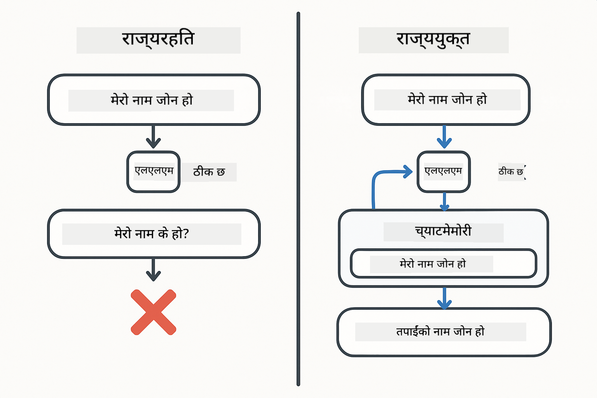
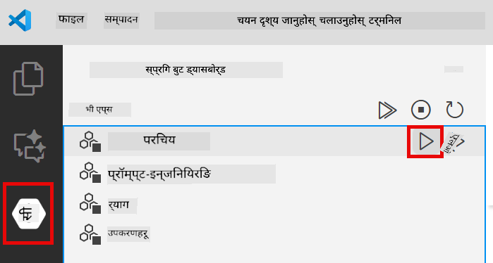
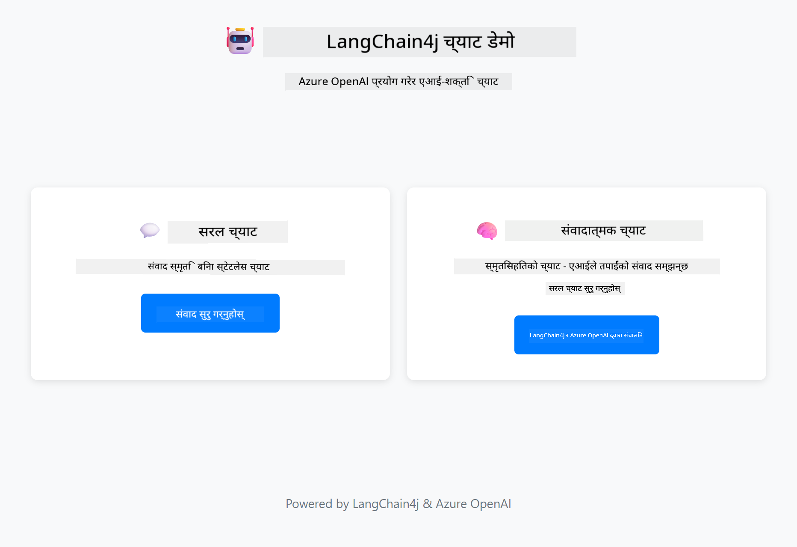
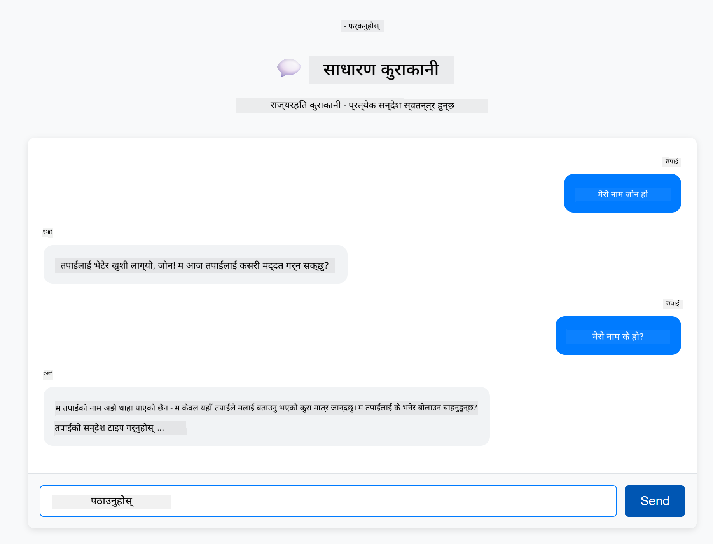
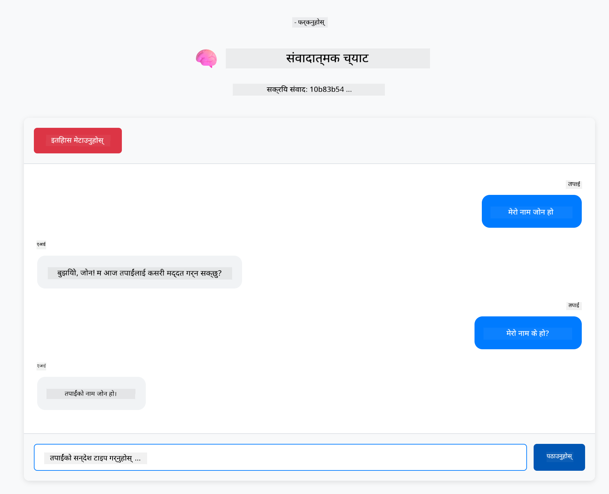

<!--
CO_OP_TRANSLATOR_METADATA:
{
  "original_hash": "c3e07ca58d0b8a3f47d3bf5728541e0a",
  "translation_date": "2025-12-13T13:25:17+00:00",
  "source_file": "01-introduction/README.md",
  "language_code": "ne"
}
-->
# Module 01: LangChain4j सँग सुरु गर्दै

## Table of Contents

- [तपाईंले के सिक्नुहुनेछ](../../../01-introduction)
- [पूर्वआवश्यकताहरू](../../../01-introduction)
- [मूल समस्याको बुझाइ](../../../01-introduction)
- [टोकनहरूको बुझाइ](../../../01-introduction)
- [स्मृति कसरी काम गर्छ](../../../01-introduction)
- [यसले LangChain4j कसरी प्रयोग गर्छ](../../../01-introduction)
- [Azure OpenAI पूर्वाधार तैनाथ गर्नुहोस्](../../../01-introduction)
- [एप्लिकेशन स्थानीय रूपमा चलाउनुहोस्](../../../01-introduction)
- [एप्लिकेशन प्रयोग गर्दै](../../../01-introduction)
  - [Stateless Chat (बायाँ प्यानल)](../../../01-introduction)
  - [Stateful Chat (दायाँ प्यानल)](../../../01-introduction)
- [अर्को कदमहरू](../../../01-introduction)

## तपाईंले के सिक्नुहुनेछ

यदि तपाईंले छिटो सुरु पूरा गर्नुभयो भने, तपाईंले कसरी प्रॉम्प्टहरू पठाउने र प्रतिक्रिया प्राप्त गर्ने देख्नुभयो। त्यो आधार हो, तर वास्तविक एप्लिकेशनहरूलाई थप आवश्यक छ। यस मोड्युलले तपाईंलाई संवादात्मक AI कसरी बनाउने सिकाउँछ जुन सन्दर्भ सम्झन्छ र अवस्था कायम राख्छ - जुन एक पटकको डेमो र उत्पादन-तयार एप्लिकेशन बीचको फरक हो।

हामी यस मार्गदर्शनमा Azure OpenAI को GPT-5 प्रयोग गर्नेछौं किनभने यसको उन्नत तर्क क्षमताहरूले विभिन्न ढाँचाहरूको व्यवहारलाई स्पष्ट बनाउँछ। जब तपाईं स्मृति थप्नुहुन्छ, तपाईंले स्पष्ट रूपमा फरक देख्नुहुनेछ। यसले तपाईंको एप्लिकेशनमा प्रत्येक कम्पोनेन्टले के ल्याउँछ बुझ्न सजिलो बनाउँछ।

तपाईंले एउटा एप्लिकेशन बनाउनुहुनेछ जसले दुवै ढाँचाहरू प्रदर्शन गर्छ:

**Stateless Chat** - प्रत्येक अनुरोध स्वतन्त्र हुन्छ। मोडेलले अघिल्लो सन्देशहरूको स्मृति राख्दैन। यो तपाईंले छिटो सुरुमा प्रयोग गरेको ढाँचा हो।

**Stateful Conversation** - प्रत्येक अनुरोधमा संवाद इतिहास समावेश हुन्छ। मोडेलले धेरै चरणहरूमा सन्दर्भ कायम राख्छ। यो उत्पादन एप्लिकेशनहरूले आवश्यक पर्ने कुरा हो।

## पूर्वआवश्यकताहरू

- Azure सदस्यता जसमा Azure OpenAI पहुँच छ
- Java 21, Maven 3.9+
- Azure CLI (https://learn.microsoft.com/en-us/cli/azure/install-azure-cli)
- Azure Developer CLI (azd) (https://learn.microsoft.com/en-us/azure/developer/azure-developer-cli/install-azd)

> **Note:** Java, Maven, Azure CLI र Azure Developer CLI (azd) प्रदान गरिएको devcontainer मा पूर्व-इन्स्टल गरिएको छ।

> **Note:** यो मोड्युल Azure OpenAI मा GPT-5 प्रयोग गर्छ। तैनाथीकरण `azd up` मार्फत स्वचालित रूपमा कन्फिगर गरिएको छ - कोडमा मोडेल नाम परिवर्तन नगर्नुहोस्।

## मूल समस्याको बुझाइ

भाषा मोडेलहरू stateless हुन्छन्। प्रत्येक API कल स्वतन्त्र हुन्छ। यदि तपाईंले "मेरो नाम जोन हो" पठाउनु भयो र त्यसपछि "मेरो नाम के हो?" सोध्नु भयो भने, मोडेललाई थाहा हुँदैन कि तपाईंले आफूलाई परिचय गराउनुभयो। यसले प्रत्येक अनुरोधलाई पहिलो संवाद जस्तै व्यवहार गर्छ।

यो सरल प्रश्नोत्तरका लागि ठीक छ तर वास्तविक एप्लिकेशनहरूका लागि बेकार छ। ग्राहक सेवा बोटहरूले तपाईंले के भने सम्झनु पर्छ। व्यक्तिगत सहायकहरूले सन्दर्भ चाहिन्छ। कुनै पनि बहु-चरण संवादले स्मृति आवश्यक पर्छ।



*Stateless (स्वतन्त्र कलहरू) र Stateful (सन्दर्भ-सचेत) संवादहरू बीचको फरक*

## टोकनहरूको बुझाइ

संवादहरूमा डुब्नु अघि, टोकनहरू बुझ्नु महत्त्वपूर्ण छ - भाषा मोडेलहरूले प्रक्रिया गर्ने पाठका आधारभूत एकाइहरू:


*पाठ कसरी टोकनहरूमा विभाजित हुन्छ - "I love AI!" चार अलग प्रक्रिया एकाइहरूमा परिणत हुन्छ*

टोकनहरू AI मोडेलहरूले पाठ मापन र प्रक्रिया गर्ने तरिका हुन्। शब्दहरू, विराम चिह्नहरू, र यहाँसम्म कि खाली ठाउँहरू पनि टोकन हुन सक्छन्। तपाईंको मोडेलसँग एक पटकमा कति टोकन प्रक्रिया गर्न सक्छ भन्ने सीमा छ (GPT-5 का लागि ४००,०००, जसमा २७२,००० इनपुट टोकन र १२८,००० आउटपुट टोकन सम्म)। टोकनहरू बुझ्नाले तपाईंलाई संवादको लम्बाइ र लागत व्यवस्थापन गर्न मद्दत गर्छ।

## स्मृति कसरी काम गर्छ

च्याट स्मृतिले stateless समस्यालाई संवाद इतिहास कायम गरेर समाधान गर्छ। मोडेललाई अनुरोध पठाउनु अघि, फ्रेमवर्कले सम्बन्धित अघिल्लो सन्देशहरू थप्छ। जब तपाईं "मेरो नाम के हो?" सोध्नुहुन्छ, प्रणालीले सम्पूर्ण संवाद इतिहास पठाउँछ, जसले मोडेललाई थाहा हुन्छ कि तपाईंले पहिले "मेरो नाम जोन हो" भन्नुभयो।

LangChain4j ले स्मृति कार्यान्वयनहरू प्रदान गर्छ जुन यो स्वचालित रूपमा ह्यान्डल गर्छ। तपाईंले कति सन्देशहरू राख्ने छनौट गर्नुहुन्छ र फ्रेमवर्कले सन्दर्भ विन्डो व्यवस्थापन गर्छ।


*MessageWindowChatMemory ले हालका सन्देशहरूको स्लाइडिङ विन्डो कायम गर्छ, पुराना सन्देशहरू स्वचालित रूपमा हटाउँछ*

## यसले LangChain4j कसरी प्रयोग गर्छ

यो मोड्युलले छिटो सुरु विस्तार गर्दै Spring Boot एकीकृत गर्छ र संवाद स्मृति थप्छ। यहाँ कम्पोनेन्टहरू कसरी मिल्छन्:

**Dependencies** - दुई LangChain4j पुस्तकालयहरू थप्नुहोस्:

```xml
<dependency>
    <groupId>dev.langchain4j</groupId>
    <artifactId>langchain4j</artifactId> <!-- Inherited from BOM in root pom.xml -->
</dependency>
<dependency>
    <groupId>dev.langchain4j</groupId>
    <artifactId>langchain4j-open-ai-official</artifactId> <!-- Inherited from BOM in root pom.xml -->
</dependency>
```

**Chat Model** - Azure OpenAI लाई Spring bean को रूपमा कन्फिगर गर्नुहोस् ([LangChainConfig.java](../../../01-introduction/src/main/java/com/example/langchain4j/config/LangChainConfig.java)):

```java
@Bean
public OpenAiOfficialChatModel openAiOfficialChatModel() {
    return OpenAiOfficialChatModel.builder()
            .baseUrl(azureEndpoint)
            .apiKey(azureApiKey)
            .modelName(deploymentName)
            .timeout(Duration.ofMinutes(5))
            .maxRetries(3)
            .build();
}
```

बिल्डरले `azd up` द्वारा सेट गरिएको वातावरण चरहरूबाट प्रमाणपत्र पढ्छ। `baseUrl` तपाईंको Azure endpoint मा सेट गर्दा OpenAI क्लाइन्ट Azure OpenAI सँग काम गर्छ।

**Conversation Memory** - MessageWindowChatMemory सँग च्याट इतिहास ट्र्याक गर्नुहोस् ([ConversationService.java](../../../01-introduction/src/main/java/com/example/langchain4j/service/ConversationService.java)):

```java
ChatMemory memory = MessageWindowChatMemory.withMaxMessages(10);

memory.add(UserMessage.from("My name is John"));
memory.add(AiMessage.from("Nice to meet you, John!"));

memory.add(UserMessage.from("What's my name?"));
AiMessage aiMessage = chatModel.chat(memory.messages()).aiMessage();
memory.add(aiMessage);
```

`withMaxMessages(10)` प्रयोग गरेर स्मृतिमा अन्तिम १० सन्देशहरू राख्नुहोस्। प्रयोगकर्ता र AI सन्देशहरू `UserMessage.from(text)` र `AiMessage.from(text)` टाइप गरिएको र्यापरहरूसँग थप्नुहोस्। इतिहास `memory.messages()` बाट प्राप्त गरी मोडेललाई पठाउनुहोस्। सेवा प्रत्येक संवाद ID का लागि अलग स्मृति उदाहरणहरू भण्डारण गर्छ, जसले धेरै प्रयोगकर्ताहरूलाई एकै समयमा च्याट गर्न अनुमति दिन्छ।

> **🤖 GitHub Copilot Chat सँग प्रयास गर्नुहोस्:** [`ConversationService.java`](../../../01-introduction/src/main/java/com/example/langchain4j/service/ConversationService.java) खोल्नुहोस् र सोध्नुहोस्:
> - "MessageWindowChatMemory ले विन्डो भरिएपछि कुन सन्देशहरू हटाउने निर्णय कसरी गर्छ?"
> - "के म इन-मेमोरीको सट्टा डेटाबेस प्रयोग गरेर कस्टम स्मृति भण्डारण कार्यान्वयन गर्न सक्छु?"
> - "पुरानो संवाद इतिहास संक्षेप गर्न म कसरी सारांश थप्न सक्छु?"

Stateless च्याट endpoint ले स्मृति पूर्ण रूपमा छोड्छ - केवल `chatModel.chat(prompt)` जस्तै छिटो सुरुमा। Stateful endpoint ले सन्देशहरू स्मृतिमा थप्छ, इतिहास प्राप्त गर्छ, र प्रत्येक अनुरोधसँग त्यो सन्दर्भ समावेश गर्छ। मोडेल कन्फिगरेसन उस्तै, तर फरक ढाँचाहरू।

## Azure OpenAI पूर्वाधार तैनाथ गर्नुहोस्

**Bash:**
```bash
cd 01-introduction
azd up  # सदस्यता र स्थान चयन गर्नुहोस् (eastus2 सिफारिस गरिएको)
```

**PowerShell:**
```powershell
cd 01-introduction
azd up  # सदस्यता र स्थान चयन गर्नुहोस् (eastus2 सिफारिस गरिएको)
```

> **Note:** यदि तपाईंले timeout त्रुटि (`RequestConflict: Cannot modify resource ... provisioning state is not terminal`) पाउनुभयो भने, केवल `azd up` फेरि चलाउनुहोस्। Azure स्रोतहरू पृष्ठभूमिमा अझै तैनाथ हुँदै हुन सक्छन्, र पुन: प्रयासले स्रोतहरू टर्मिनल अवस्थामा पुगेपछि तैनाथीकरण पूरा गर्न अनुमति दिन्छ।

यसले:
1. GPT-5 र text-embedding-3-small मोडेलहरूसँग Azure OpenAI स्रोत तैनाथ गर्नेछ
2. प्रमाणपत्रहरूसहित `.env` फाइल स्वचालित रूपमा परियोजना मूलमा सिर्जना गर्नेछ
3. सबै आवश्यक वातावरण चरहरू सेट गर्नेछ

**तैनाथीकरण समस्याहरू छन्?** विस्तृत समस्या समाधानका लागि [Infrastructure README](infra/README.md) हेर्नुहोस् जसमा सबडोमेन नाम द्वन्द्व, म्यानुअल Azure Portal तैनाथीकरण चरणहरू, र मोडेल कन्फिगरेसन निर्देशनहरू समावेश छन्।

**तैनाथीकरण सफल भयो भनी पुष्टि गर्नुहोस्:**

**Bash:**
```bash
cat ../.env  # AZURE_OPENAI_ENDPOINT, API_KEY, आदि देखाउनु पर्छ।
```

**PowerShell:**
```powershell
Get-Content ..\.env  # AZURE_OPENAI_ENDPOINT, API_KEY, आदि देखाउनु पर्छ।
```

> **Note:** `azd up` आदेशले स्वचालित रूपमा `.env` फाइल सिर्जना गर्छ। यदि पछि अपडेट गर्न आवश्यक छ भने, तपाईंले `.env` फाइल म्यानुअली सम्पादन गर्न सक्नुहुन्छ वा यसलाई पुनः सिर्जना गर्न सक्नुहुन्छ:
>
> **Bash:**
> ```bash
> cd ..
> bash .azd-env.sh
> ```
>
> **PowerShell:**
> ```powershell
> cd ..
> .\.azd-env.ps1
> ```

## एप्लिकेशन स्थानीय रूपमा चलाउनुहोस्

**तैनाथीकरण पुष्टि गर्नुहोस्:**

Azure प्रमाणपत्रहरूसहित `.env` फाइल मूल निर्देशिकामा छ भनी सुनिश्चित गर्नुहोस्:

**Bash:**
```bash
cat ../.env  # AZURE_OPENAI_ENDPOINT, API_KEY, DEPLOYMENT देखाउनु पर्छ
```

**PowerShell:**
```powershell
Get-Content ..\.env  # AZURE_OPENAI_ENDPOINT, API_KEY, DEPLOYMENT देखाउनु पर्छ
```

**एप्लिकेशनहरू सुरु गर्नुहोस्:**

**विकल्प १: Spring Boot Dashboard प्रयोग गर्दै (VS Code प्रयोगकर्ताहरूका लागि सिफारिस गरिएको)**

dev container मा Spring Boot Dashboard एक्सटेन्सन समावेश छ, जसले सबै Spring Boot एप्लिकेशनहरू व्यवस्थापन गर्न दृश्यात्मक इन्टरफेस प्रदान गर्छ। तपाईं यसलाई VS Code को बाँया पट्टि Activity Bar मा Spring Boot आइकन हेरेर फेला पार्न सक्नुहुन्छ।

Spring Boot Dashboard बाट तपाईंले:
- कार्यक्षेत्रमा उपलब्ध सबै Spring Boot एप्लिकेशनहरू देख्न सक्नुहुन्छ
- एक क्लिकमा एप्लिकेशनहरू सुरु/रोक्न सक्नुहुन्छ
- एप्लिकेशन लगहरू वास्तविक समयमा हेर्न सक्नुहुन्छ
- एप्लिकेशन स्थिति अनुगमन गर्न सक्नुहुन्छ

"introduction" को छेउमा प्ले बटन क्लिक गरेर यो मोड्युल सुरु गर्नुहोस्, वा सबै मोड्युलहरू एकै पटक सुरु गर्नुहोस्।



**विकल्प २: shell स्क्रिप्टहरू प्रयोग गर्दै**

सबै वेब एप्लिकेशनहरू (मोड्युल ०१-०४) सुरु गर्नुहोस्:

**Bash:**
```bash
cd ..  # मूल निर्देशिका बाट
./start-all.sh
```

**PowerShell:**
```powershell
cd ..  # मूल निर्देशिका बाट
.\start-all.ps1
```

वा केवल यो मोड्युल सुरु गर्नुहोस्:

**Bash:**
```bash
cd 01-introduction
./start.sh
```

**PowerShell:**
```powershell
cd 01-introduction
.\start.ps1
```

दुवै स्क्रिप्टहरूले मूल `.env` फाइलबाट वातावरण चरहरू स्वचालित रूपमा लोड गर्छन् र यदि JAR फाइलहरू छैनन् भने निर्माण गर्नेछन्।

> **Note:** यदि तपाईं सबै मोड्युलहरू म्यानुअली निर्माण गर्न चाहनुहुन्छ भने सुरु गर्नु अघि:
>
> **Bash:**
> ```bash
> cd ..  # Go to root directory
> mvn clean package -DskipTests
> ```
>
> **PowerShell:**
> ```powershell
> cd ..  # Go to root directory
> mvn clean package -DskipTests
> ```

http://localhost:8080 तपाईंको ब्राउजरमा खोल्नुहोस्।

**रोक्न:**

**Bash:**
```bash
./stop.sh  # यो मोड्युल मात्र
# वा
cd .. && ./stop-all.sh  # सबै मोड्युलहरू
```

**PowerShell:**
```powershell
.\stop.ps1  # यो मोड्युल मात्र
# वा
cd ..; .\stop-all.ps1  # सबै मोड्युलहरू
```

## एप्लिकेशन प्रयोग गर्दै

एप्लिकेशनले दुई च्याट कार्यान्वयनहरू साइड-बाइ-साइड वेब इन्टरफेसमा प्रदान गर्छ।



*ड्यासबोर्डले Simple Chat (stateless) र Conversational Chat (stateful) विकल्पहरू देखाउँछ*

### Stateless Chat (बायाँ प्यानल)

पहिले यो प्रयास गर्नुहोस्। "मेरो नाम जोन हो" सोध्नुहोस् र तुरुन्तै "मेरो नाम के हो?" सोध्नुहोस्। मोडेलले सम्झँदैन किनभने प्रत्येक सन्देश स्वतन्त्र हुन्छ। यसले आधारभूत भाषा मोडेल एकीकरणको मुख्य समस्या देखाउँछ - कुनै संवाद सन्दर्भ छैन।



*AI ले अघिल्लो सन्देशबाट तपाईंको नाम सम्झँदैन*

### Stateful Chat (दायाँ प्यानल)

अब त्यही अनुक्रम यहाँ प्रयास गर्नुहोस्। "मेरो नाम जोन हो" र त्यसपछि "मेरो नाम के हो?" सोध्नुहोस्। यस पटक यो सम्झन्छ। फरक MessageWindowChatMemory हो - यसले संवाद इतिहास कायम गर्छ र प्रत्येक अनुरोधसँग समावेश गर्छ। यसरी उत्पादन संवादात्मक AI काम गर्छ।



*AI ले संवादको पहिलेको भागबाट तपाईंको नाम सम्झन्छ*

दुवै प्यानलहरूले उस्तै GPT-5 मोडेल प्रयोग गर्छन्। फरक मात्र स्मृति हो। यसले स्पष्ट पार्छ कि स्मृतिले तपाईंको एप्लिकेशनमा के ल्याउँछ र किन यो वास्तविक प्रयोगका लागि आवश्यक छ।

## अर्को कदमहरू

**अर्को मोड्युल:** [02-prompt-engineering - GPT-5 सँग प्रॉम्प्ट इन्जिनियरिङ](../02-prompt-engineering/README.md)

---

**नेभिगेसन:** [← अघिल्लो: Module 00 - छिटो सुरु](../00-quick-start/README.md) | [मुख्यमा फर्कनुहोस्](../README.md) | [अर्को: Module 02 - प्रॉम्प्ट इन्जिनियरिङ →](../02-prompt-engineering/README.md)

---

<!-- CO-OP TRANSLATOR DISCLAIMER START -->
**अस्वीकरण**:
यो दस्तावेज AI अनुवाद सेवा [Co-op Translator](https://github.com/Azure/co-op-translator) प्रयोग गरी अनुवाद गरिएको हो। हामी शुद्धताका लागि प्रयासरत छौं, तर कृपया ध्यान दिनुहोस् कि स्वचालित अनुवादमा त्रुटि वा अशुद्धता हुन सक्छ। मूल दस्तावेज यसको मूल भाषामा आधिकारिक स्रोत मानिनु पर्छ। महत्वपूर्ण जानकारीका लागि व्यावसायिक मानव अनुवाद सिफारिस गरिन्छ। यस अनुवादको प्रयोगबाट उत्पन्न कुनै पनि गलतफहमी वा गलत व्याख्याका लागि हामी जिम्मेवार छैनौं।
<!-- CO-OP TRANSLATOR DISCLAIMER END -->