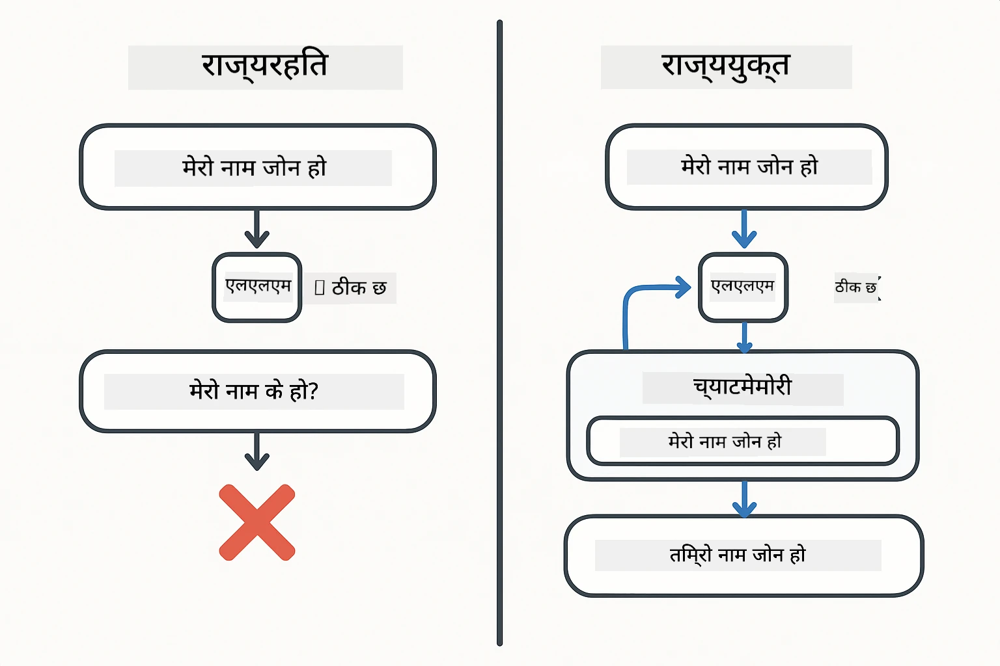
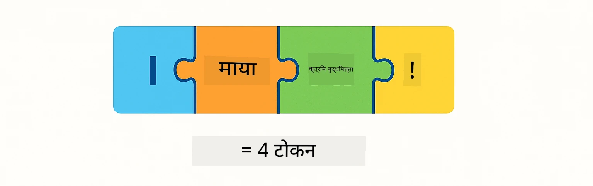
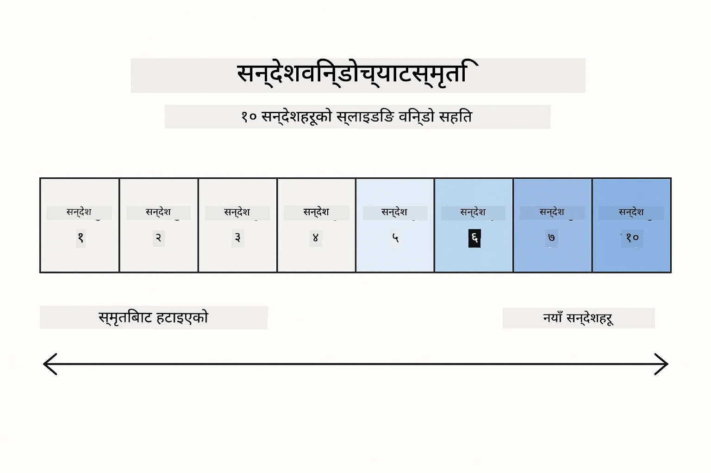
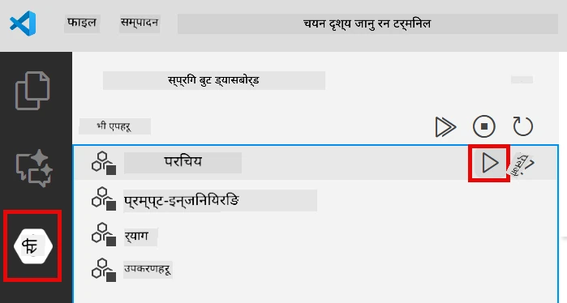
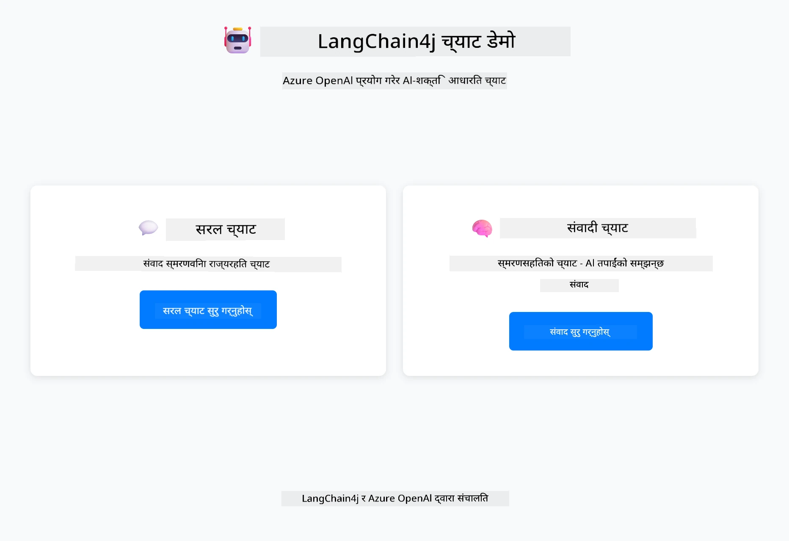
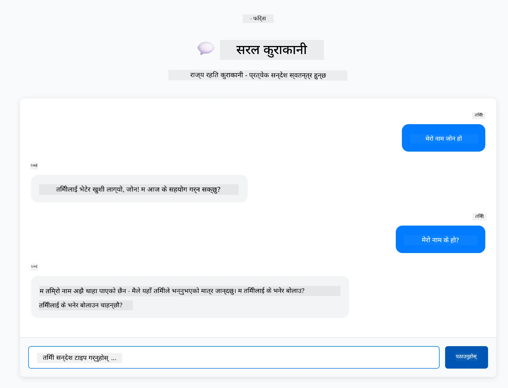
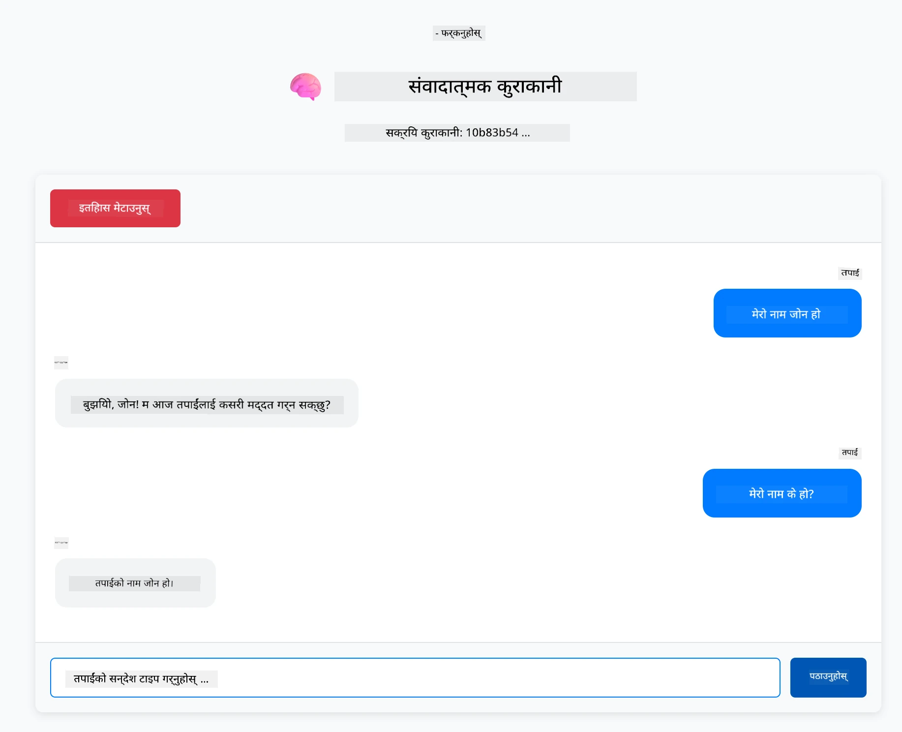

# मोड्युल ०१: LangChain4j सँग सुरु गर्दै

## सामग्री तालिका

- [भिडियो वाकथ्रु](#भिडियो-वाकथ्रु)
- [तपाईंले के सिक्नुहुनेछ](#तपाईंले-के-सिक्नुहुनेछ)
- [अग्रिम आवश्यकताहरू](#अग्रिम-आवश्यकताहरू)
- [मुख्य समस्यालाई बुझ्दै](#मुख्य-समस्यालाई-बुझ्दै)
- [टोकनहरू बुझ्दै](#टोकनहरू-बुझ्दै)
- [मेमोरी कसरी काम गर्छ](#मेमोरी-कसरी-काम-गर्छ)
- [यसले LangChain4j कसरी प्रयोग गर्छ](#यसले-langchain4j-कसरी-प्रयोग-गर्छ)
- [Azure OpenAI पूर्वाधार डिप्लोय गर्नुहोस्](#azure-openai-पूर्वाधार-डिप्लोय-गर्नुहोस्)
- [एप्लिकेशन स्थानीय रूपमा चलाउनुहोस्](#एप्लिकेशन-स्थानीय-रूपमा-चलाउनुहोस्)
- [एप्लिकेशन प्रयोग गर्दै](#एप्लिकेशन-प्रयोग-गर्दै)
  - [स्टेटलेस च्याट (बायाँ प्यानल)](#स्टेटलेस-च्याट-बायाँ-प्यानल)
  - [स्टेटफुल च्याट (दायाँ प्यानल)](#स्टेटफुल-च्याट-दायाँ-प्यानल)
- [अगला कदमहरू](#अगला-कदमहरू)

## भिडियो वाकथ्रु

यो जीवन्त सत्र हेर्नुहोस् जसले यस मोड्युलसँग कसरी सुरु गर्ने बताउँछ:

<a href="https://www.youtube.com/live/nl_troDm8rQ?si=6b85S8xGjWnT2fX9"></a>

## तपाईंले के सिक्नुहुनेछ

यो LangChain4j र Azure OpenAI सँग तपाईंको सुरुवाती बिन्दु हो। हामी आधारभूत कुराहरूबाट सुरु गर्छौं र उत्पादन-शैलीका अनुप्रयोगहरू निर्माण गर्न थाल्छौं। यो मोड्युल सन्दर्भ सम्झने र स्थिति कायम राख्ने संवादात्मक AI मा केन्द्रित छ — प्रत्येक पछि आएका मोड्युलले उभिएको आधारभूत अवधारणा।

हामी यस मार्गदर्शनमा Azure OpenAI को GPT-5.2 प्रयोग गर्नेछौं किनकि यसको उन्नत तर्क क्षमताहरूले विभिन्न ढाँचाहरूको व्यवहार स्पष्ट बनाउँछन्। जब तपाईंले मेमोरी थप्नुहुन्छ, तपाईंलाई फरक स्पष्ट देखिनेछ। यसले तपाईंको अनुप्रयोगमा प्रत्येक कम्पोनेन्ट के ल्याउँछ बुझ्न सजिलो बनाउँछ।

तपाईंले एउटा अनुप्रयोग निर्माण गर्नु हुनेछ जुन दुवै ढाँचाहरू देखाउँछ:

**स्टेटलेस च्याट** - प्रत्येक अनुरोध स्वतन्त्र हुन्छ। मोडेललाई अघि भएका सन्देशहरूको कुनै सम्झना हुँदैन। यो सबैभन्दा सरल सुरुवात हो।

**स्टेटफुल संवाद** - प्रत्येक अनुरोधले संवाद इतिहास समावेश गर्दछ। मोडेल धेरै पालोमा सन्दर्भ कायम राख्छ। यो उत्पादन अनुप्रयोगहरूले चाहिने कुरा हो।

## अग्रिम आवश्यकताहरू

- Azure सदस्यता Azure OpenAI पहुँच सहित
- Java 21, Maven 3.9+
- Azure CLI (https://learn.microsoft.com/en-us/cli/azure/install-azure-cli)
- Azure Developer CLI (azd) (https://learn.microsoft.com/en-us/azure/developer/azure-developer-cli/install-azd)

> **सूचना:** प्रदान गरिएको devcontainer मा Java, Maven, Azure CLI र Azure Developer CLI (azd) पूर्व-स्थापित छन्।

> **सूचना:** यो मोड्युलले Azure OpenAI मा GPT-5.2 प्रयोग गर्छ। `azd up` मार्फत स्वचालित रूपमा डिप्लोय गरिएको छ - कोडमा मोडेल नाम परिवर्तन नगर्नुहोस्।

## मुख्य समस्यालाई बुझ्दै

भाषा मोडेलहरू स्टेटलेस हुन्छन्। प्रत्येक API कल स्वतन्त्र हुन्छ। तपाईंले "मेरो नाम जोन हो" पठाउनुभएको र त्यसपछि सोध्नु भयो "मेरो नाम के हो?", मोडेललाई थाहा हुँदैन तपाईंले परिचय गराउनुभयो। यसले प्रत्येक अनुरोधलाई पहिलो संवादजस्तो व्यवहार गर्छ।

यो सरल प्रश्नोत्तरको लागि ठीक छ तर वास्तविक अनुप्रयोगहरूको लागि बेकार हो। ग्राहक सेवा बोटहरूले तपाईंले उनलाई के भन्नुभयो सम्झनु पर्छ। व्यक्तिगत सहायकहरूले सन्दर्भ चाहिन्छ। कुनै पनि बहुपालो संवादले मेमोरी चाहिन्छ।

तलको चित्रले दुईवटा दृष्टिकोणहरूको तुलना गर्छ — बायाँमा, नाम बिर्सने स्टेटलेस कल; दायाँमा, ChatMemory द्वारा समर्थन गरिएको स्टेटफुल कल जसले याद राख्छ।



*स्टेटलेस (स्वतन्त्र कलहरू) र स्टेटफुल (सन्दर्भ-अनुभवी) संवादहरू बीचको फरक*

## टोकनहरू बुझ्दै

संवादहरूमा डुब्नुअघि, टोकनहरू बुझ्न जरुरी छ — भाषा मोडेलहरूले प्रशोधन गर्ने मूल पाठ इकाइहरू:



*टेक्स्टलाई कसरी टोकनहरूमा विभाजित गरिन्छ उदाहरण - "म AI लाई माया गर्छु!" चार छुट्टाछुट्टै प्रशोधन इकाइहरूमा परिणत हुन्छ*

टोकनहरू AI मोडेलहरूले पाठ मापन र प्रशोधन गर्ने तरिका हुन्। शब्दहरू, विरामचिह्नहरू र खाली ठाउँहरू पनि टोकन हुन सक्छन्। तपाईंको मोडेलसँग एक पटकमा प्रशोधन गर्न सकिने टोकनहरूको सीमा हुन्छ (GPT-5.2 को लागि ४००,०००, जसमा २७२,००० इनपुट टोकन र १२८,००० आउटपुट टोकनसम्म)। टोकन बुझ्नाले तपाईंलाई संवादको लम्बाई र लागत व्यवस्थापन गर्न सहयोग गर्छ।

## मेमोरी कसरी काम गर्छ

च्याट मेमोरी स्टेटलेस समस्यालाई समाधान गर्छ संवाद इतिहास कायम गरेर। तपाईँको अनुरोध मोडेलमा पठाउनु अघि, फ्रेमवर्कले सान्दर्भिक अघिल्ला सन्देशहरू थप्छ। जब तपाईं "मेरो नाम के हो?" भन्छौ, प्रणालीले वास्तवमा सम्पूर्ण संवाद इतिहास पठाउँछ, जसले मोडेललाई देखाउँछ कि तपाईंले पहिले "मेरो नाम जोन हो" भन्नुभएको थियो।

LangChain4j ले मेमोरी कार्यान्वयनहरू प्रदान गर्छ जुन यसलाई स्वचालित रूपमा व्यवस्थापन गर्छ। तपाईं कति सन्देशहरू राख्ने निर्णय गर्नुहुन्छ र फ्रेमवर्क सन्दर्भ विन्डो व्यवस्थित गर्छ। तलको चित्रले देखाउँछ कसरी MessageWindowChatMemory ले भर्खरका सन्देशहरूको स्लाइडिङ विन्डो कायम गर्छ।



*MessageWindowChatMemory ले भर्खरका सन्देशहरूको स्लाइडिङ विन्डो राख्छ, पुराना सन्देशहरू स्वचालित रूपमा हटाउँदै*

## यसले LangChain4j कसरी प्रयोग गर्छ

यो मोड्युलले Spring Boot एकीकृत गर्दछ र संवाद मेमोरी थप्छ। यहाँ कम्पोनेन्टहरूले कसरि मिल्छन्:

**निर्भरता** - दुई LangChain4j लाइब्रेरीहरू थप्नुहोस्:

```xml
<dependency>
    <groupId>dev.langchain4j</groupId>
    <artifactId>langchain4j</artifactId> <!-- Inherited from BOM in root pom.xml -->
</dependency>
<dependency>
    <groupId>dev.langchain4j</groupId>
    <artifactId>langchain4j-open-ai-official</artifactId> <!-- Inherited from BOM in root pom.xml -->
</dependency>
```

**च्याट मोडेल** - Azure OpenAI लाई Spring bean रूपमा कन्फिगर गर्नुहोस् ([LangChainConfig.java](../../../01-introduction/src/main/java/com/example/langchain4j/config/LangChainConfig.java)):

```java
@Bean
public OpenAiOfficialChatModel openAiOfficialChatModel() {
    return OpenAiOfficialChatModel.builder()
            .baseUrl(azureEndpoint)
            .apiKey(azureApiKey)
            .modelName(deploymentName)
            .timeout(Duration.ofMinutes(5))
            .maxRetries(3)
            .build();
}
```

बिल्डरले `azd up` द्वारा सेट गरिएको वातावरण परिवर्तनीयहरूबाट प्रमाणपत्र पढ़्छ। `baseUrl` तपाईंको Azure अन्तबिन्दुमा सेट गर्दा OpenAI क्लाएन्ट Azure OpenAI सँग काम गर्दछ।

**संवाद मेमोरी** - MessageWindowChatMemory सँग च्याट इतिहास ट्र्याक गर्नुहोस् ([ConversationService.java](../../../01-introduction/src/main/java/com/example/langchain4j/service/ConversationService.java)):

```java
ChatMemory memory = MessageWindowChatMemory.withMaxMessages(10);

memory.add(UserMessage.from("My name is John"));
memory.add(AiMessage.from("Nice to meet you, John!"));

memory.add(UserMessage.from("What's my name?"));
AiMessage aiMessage = chatModel.chat(memory.messages()).aiMessage();
memory.add(aiMessage);
```

`withMaxMessages(10)` प्रयोग गरेर मेमोरी सिर्जना गर्नुहोस् जसले अन्तिम १० सन्देशहरू राख्छ। प्रयोगकर्ता र AI सन्देशहरू `UserMessage.from(text)` र `AiMessage.from(text)` टाइप गरिएको र्‍यापरहरूसँग थप्नुहोस्। इतिहास `memory.messages()` बाट प्राप्त गरेर मोडेलमा पठाउनुहोस्। सेवा प्रत्येक संवाद ID का लागि अलग मेमोरी उदाहरणहरू भण्डारण गर्छ, जसले धेरै प्रयोगकर्ताहरूलाई एउटै समयमा च्याट गर्न अनुमति दिन्छ।

> **🤖 [GitHub Copilot](https://github.com/features/copilot) च्याट संग प्रयास गर्नुहोस्:** [`ConversationService.java`](../../../01-introduction/src/main/java/com/example/langchain4j/service/ConversationService.java) खोल्नुहोस् र सोध्नुहोस्:
> - "MessageWindowChatMemory कुन सन्देशहरू ड्रप गर्ने निर्णय कसरी गर्छ जब विन्डो पूर्ण हुन्छ?"
> - "मेमोरी स्टोर गर्न कस्टम डेटाबेस प्रयोग गरेर कसरी कार्यान्वयन गर्न सक्छु?"
> - "पुरानो संवाद इतिहास संक्षेप गर्न कसरी समरी जोड्न सकिन्छ?"

स्टेटलेस च्याट अन्तबिन्दु मेमोरी सम्पूर्ण रूपमा छोड्छ - छिटो सुरु गर्न जस्तै `chatModel.chat(prompt)` मात्र हुन्छ। स्टेटफुल अन्तबिन्दुले सन्देशहरू मेमोरीमा थप्छ, इतिहास प्राप्त गर्छ र प्रत्येक अनुरोधसँग त्यो सन्दर्भ समावेश गर्दछ। एउटै मोडेल कन्फिगरेसन, फरक ढाँचाहरू।

## Azure OpenAI पूर्वाधार डिप्लोय गर्नुहोस्

**Bash:**
```bash
cd 01-introduction
azd up  # सदस्यता र स्थान छनौट गर्नुहोस् (eastus2 सिफारिस गरिएको)
```

**PowerShell:**
```powershell
cd 01-introduction
azd up  # सदस्यता र स्थान चयन गर्नुहोस् (eastus2 सिफारिस गरिएको)
```

> **सूचना:** यदि तपाईलाई टाइमआउट त्रुटि (`RequestConflict: Cannot modify resource ... provisioning state is not terminal`) आउँछ भने, `azd up` पुनः चलाउनुहोस्। Azure स्रोतहरू पृष्ठभूमिमा अझै प्राविधिक अवस्थामा हुन सक्छन्, र पुनः प्रयासले डिप्लोयमेन्ट पूरा हुन मद्दत गर्छ जब स्रोतहरू अन्तिम अवस्थामा पुग्छन्।

यसले:
1. GPT-5.2 र text-embedding-3-small मोडेलहरूसँग Azure OpenAI स्रोत डिप्लोय गर्छ
2. परियोजना रूटमा स्वचालित रूपमा `.env` फाइल बनाउँछ प्रमाणपत्रहरू सहित
3. सबै आवश्यक वातावरण चरहरू सेटअप गर्छ

**डिप्लोयमेन्टमा समस्याहरू छ?** विस्तृत समस्या समाधानका लागि [पूर्वाधार README](infra/README.md) हेर्नुहोस् जसमा उपडोमेन नाम द्वन्द्व, Azure पोर्टलमा म्यानुअल डिप्लोयमेन्ट चरणहरू, र मोडेल कन्फिगरेसन मार्गनिर्देशन छ।

**डिप्लोयमेन्ट सफल भयो भनी जाँच गर्नुहोस्:**

**Bash:**
```bash
cat ../.env  # AZURE_OPENAI_ENDPOINT, API_KEY, आदि देखाउनु पर्छ।
```

**PowerShell:**
```powershell
Get-Content ..\.env  # AZURE_OPENAI_ENDPOINT, API_KEY, आदि देखाउनु पर्छ।
```

> **सूचना:** `azd up` आदेशले स्वचालित रूपमा `.env` फाइल सिर्जना गर्छ। यदि पछि यसलाई अपडेट गर्न आवश्यक भए:
>
> **Bash:**
> ```bash
> cd ..
> bash .azd-env.sh
> ```
>
> **PowerShell:**
> ```powershell
> cd ..
> .\.azd-env.ps1
> ```

## एप्लिकेशन स्थानीय रूपमा चलाउनुहोस्

**डिप्लोयमेन्ट जाँच गर्नुहोस्:**

मूल निर्देशिकामा `.env` फाइल Azure प्रमाणपत्रहरूसहित अवस्थित छ सुनिश्चित गर्नुहोस्। यसलाई मोड्युल निर्देशिका (`01-introduction/`) बाट चलाउनुहोस्:

**Bash:**
```bash
cat ../.env  # AZURE_OPENAI_ENDPOINT, API_KEY, DEPLOYMENT देखाउनु पर्नेछ
```

**PowerShell:**
```powershell
Get-Content ..\.env  # AZURE_OPENAI_ENDPOINT, API_KEY, DEPLOYMENT देखाउनु पर्छ
```

**एप्लिकेशनहरू शुरू गर्नुहोस्:**

**विकल्प १: Spring Boot ड्यासबोर्ड प्रयोग गर्दै (VS Code प्रयोगकर्ताहरूका लागि सिफारिस गरिएको)**

डिभ कन्टेनरमा Spring Boot ड्यासबोर्ड एक्सटेन्सन समावेश छ, जसले सबै Spring Boot एप्लिकेशनहरू प्रबन्ध गर्न दृश्य इन्टरफेस दिन्छ। VS Code को बायाँपट्टि एक्टिभिटी बारमा (Spring Boot आइकन हेर्नुहोस्) पाउन सकिन्छ।

Spring Boot ड्यासबोर्डबाट तपाईं:
- सबै उपलब्ध Spring Boot एपहरू कार्यक्षेत्रमा देख्न सक्नुहुन्छ
- एक क्लिकमा एपहरू सुरु/रोक्न सक्नुहुन्छ
- एप्लिकेशन लगहरू वास्तविक समयमा हेर्न सक्नुहुन्छ
- एप्लिकेशन स्थिति अनुगमन गर्न सक्नुहुन्छ

"introduction" को छेउमा प्ले बटन क्लिक गरी यो मोड्युल सुरु गर्नुहोस्, वा सबै मोड्युलहरू एकै पटक सुरु गर्नुहोस्।



*VS Code मा Spring Boot ड्यासबोर्ड — सबै मोड्युलहरू एकै ठाउँबाट शुरू, बन्द र अनुगमन गर्न*

**विकल्प २: shell स्क्रिप्ट प्रयोग गर्दै**

सबै वेब एपहरू सुरु गर्नुहोस् (मोड्युल ०१-०४):

**Bash:**
```bash
cd ..  # मूल निर्देशिका बाट
./start-all.sh
```

**PowerShell:**
```powershell
cd ..  # रुट निर्देशिकाबाट
.\start-all.ps1
```

वा यो मोड्युल मात्र सुरु गर्नुहोस्:

**Bash:**
```bash
cd 01-introduction
./start.sh
```

**PowerShell:**
```powershell
cd 01-introduction
.\start.ps1
```

दुवै स्क्रिप्टहरूले मूल `.env` फाइलबाट वातावरण चरहरू स्वचालित रूपमा लोड गर्छन् र यदि JAR फाइलहरू अवस्थित छैनन् भने निर्माण पनि गर्छन्।

> **सूचना:** यदि सुरु गर्नु अघि सबै मोड्युलहरू म्यानुअली बनाउने चाहनुहुन्छ भने:
>
> **Bash:**
> ```bash
> cd ..  # Go to root directory
> mvn clean package -DskipTests
> ```
>
> **PowerShell:**
> ```powershell
> cd ..  # Go to root directory
> mvn clean package -DskipTests
> ```

http://localhost:8080 तपाईंको ब्राउजरमा खोल्नुहोस्।

**रोक्न:**

**Bash:**
```bash
./stop.sh  # यो मोड्युल मात्र
# वा
cd .. && ./stop-all.sh  # सबै मोड्युलहरू
```

**PowerShell:**
```powershell
.\stop.ps1  # केवल यो मोड्युल
# वा
cd ..; .\stop-all.ps1  # सबै मोड्युलहरू
```

## एप्लिकेशन प्रयोग गर्दै

एपले दुईवटा च्याट कार्यान्वयनहरू प्रदर्शित गर्ने वेब इन्टरफेस प्रदान गर्छ साइड-बाट-साइडमा।



*ड्यासबोर्डले Simple Chat (स्टेटलेस) र Conversational Chat (स्टेटफुल) विकल्पहरू देखाउँछ*

### स्टेटलेस च्याट (बायाँ प्यानल)

यसलाई पहिले प्रयास गर्नुहोस्। "मेरो नाम जोन हो" भनिरहेका बेला तुरुन्तै "मेरो नाम के हो?" सोध्नुहोस्। मोडेलले सम्झने छैन किनभने प्रत्येक सन्देश स्वतन्त्र हुन्छ। यो भाषा मोडेल एकीकरणमा प्रमुख समस्या देखाउँछ - संवाद सन्दर्भ छैन।



*AI ले अघिल्लो सन्देशबाट तपाईंको नाम सम्झँदैन*

### स्टेटफुल च्याट (दायाँ प्यानल)

अहिले त्यही अनुक्रम यहाँ प्रयास गर्नुहोस्। "मेरो नाम जोन हो" र पछि "मेरो नाम के हो?" यस पटक यो सम्झन्छ। फरक MessageWindowChatMemory हो - यसले संवाद इतिहास राख्छ र प्रत्येक अनुरोधमा समावेश गर्दछ। यही उत्पादन संवादात्मक AI को काम गर्ने तरिका हो।



*AIले पहिलेको संवादबाट तपाईंको नाम सम्झन्छ*

दुवै प्यानलले एउटै GPT-5.2 मोडेल प्रयोग गर्छन्। मात्र फरक मेमोरी हो। यसले के मेमोरीले तपाईंको अनुप्रयोगमा ल्याउँछ र किन यो वास्तविक प्रयोगका लागि अपरिहार्य छ बुझ्न सजिलो बनाउँछ।

## अगला कदमहरू

**अर्को मोड्युल:** [०२-प्रम्प्ट-इन्जिनियरिङ - GPT-5.2 सँग प्रम्प्ट इन्जिनियरिङ](../02-prompt-engineering/README.md)

---

**नेभिगेसन:** [← मुख्यमा फर्कनुहोस्](../README.md) | [अर्को: मोड्युल ०२ - प्रम्प्ट इन्जिनियरिङ →](../02-prompt-engineering/README.md)

---

<!-- CO-OP TRANSLATOR DISCLAIMER START -->
**अस्वीकरण**:
यो दस्तावेज़ AI अनुवाद सेवा [Co-op Translator](https://github.com/Azure/co-op-translator) प्रयोग गरेर अनुवाद गरिएको हो। हामी सही हुन प्रयास गर्छौं, तर कृपया जानकार हुनुस् कि स्वचालित अनुवादमा त्रुटिहरू वा अशुद्धताहरू हुन सक्छन्। मूल दस्तावेज़ यसको मूल भाषामा आधिकारिक स्रोत मानिनुपर्छ। महत्वपूर्ण जानकारीका लागि व्यावसायिक मानव अनुवाद सिफारिस गरिन्छ। यस अनुवादको प्रयोगबाट उत्पन्न कुनै पनि गलत बुझाइ वा त्रुटिको लागि हामी जिम्मेवार छैनौं।
<!-- CO-OP TRANSLATOR DISCLAIMER END -->