# Module 02: GPT-5 सँग प्रॉम्प्ट इन्जिनियरिङ

## Table of Contents

- [तपाईंले के सिक्नुहुनेछ](../../../02-prompt-engineering)
- [पूर्वआवश्यकताहरू](../../../02-prompt-engineering)
- [प्रॉम्प्ट इन्जिनियरिङ बुझ्न](../../../02-prompt-engineering)
- [यसले LangChain4j कसरी प्रयोग गर्छ](../../../02-prompt-engineering)
- [मुख्य ढाँचाहरू](../../../02-prompt-engineering)
- [अस्तित्वमा रहेका Azure स्रोतहरू प्रयोग गर्दै](../../../02-prompt-engineering)
- [एप्लिकेसनका स्क्रिनसटहरू](../../../02-prompt-engineering)
- [ढाँचाहरू अन्वेषण गर्दै](../../../02-prompt-engineering)
  - [कम बनाम उच्च उत्साह](../../../02-prompt-engineering)
  - [कार्य कार्यान्वयन (टूल प्रीएम्बलहरू)](../../../02-prompt-engineering)
  - [आत्म-प्रतिबिम्बित कोड](../../../02-prompt-engineering)
  - [संरचित विश्लेषण](../../../02-prompt-engineering)
  - [बहु-टर्न च्याट](../../../02-prompt-engineering)
  - [चरण-द्वारा-चरण तर्क](../../../02-prompt-engineering)
  - [सीमित आउटपुट](../../../02-prompt-engineering)
- [तपाईं साँच्चिकै के सिक्दै हुनुहुन्छ](../../../02-prompt-engineering)
- [अर्को कदमहरू](../../../02-prompt-engineering)

## तपाईंले के सिक्नुहुनेछ

अघिल्लो मोड्युलमा, तपाईंले कसरी मेमोरीले संवादात्मक AI सक्षम बनाउँछ भनेर देख्नुभयो र GitHub मोडेलहरू प्रयोग गरेर आधारभूत अन्तरक्रियाहरू गर्नुभयो। अब हामीले कसरी प्रश्न सोध्ने - प्रॉम्प्टहरू आफैं - Azure OpenAI को GPT-5 प्रयोग गरेर केन्द्रित गर्नेछौं। तपाईंले प्रॉम्प्टहरू कसरी संरचना गर्नुहुन्छ भन्ने कुराले प्राप्त प्रतिक्रियाको गुणस्तरमा ठूलो प्रभाव पार्छ।

हामी GPT-5 प्रयोग गर्नेछौं किनभने यसले तर्क नियन्त्रण परिचय गराउँछ - तपाईं मोडेललाई जवाफ दिनुअघि कति सोच्नुपर्ने हो भन्न सक्नुहुन्छ। यसले विभिन्न प्रॉम्प्टिङ रणनीतिहरूलाई स्पष्ट बनाउँछ र तपाईंलाई कुन विधि कहिले प्रयोग गर्ने बुझ्न मद्दत गर्छ। हामी Azure को GPT-5 का लागि GitHub मोडेलहरू भन्दा कम दर सीमाहरूबाट पनि लाभ उठाउनेछौं।

## पूर्वआवश्यकताहरू

- मोड्युल 01 पूरा गरिएको (Azure OpenAI स्रोतहरू तैनाथ गरिएको)
- रुट डाइरेक्टरीमा `.env` फाइल Azure प्रमाणपत्रहरूसहित (मोड्युल 01 मा `azd up` द्वारा सिर्जना गरिएको)

> **नोट:** यदि तपाईंले मोड्युल 01 पूरा गर्नुभएको छैन भने, पहिले त्यहाँका तैनाथी निर्देशनहरू पालना गर्नुहोस्।

## प्रॉम्प्ट इन्जिनियरिङ बुझ्न

प्रॉम्प्ट इन्जिनियरिङ भनेको यस्तो इनपुट टेक्स्ट डिजाइन गर्ने कुरा हो जसले तपाईंलाई आवश्यक परिणामहरू निरन्तर प्राप्त गराउँछ। यो केवल प्रश्न सोध्ने कुरा होइन - यो अनुरोधहरूलाई यसरी संरचना गर्ने कुरा हो कि मोडेलले तपाईं के चाहनुहुन्छ र कसरी प्रदान गर्ने बुझ्न सकोस्।

यसलाई सहकर्मीलाई निर्देशन दिने जस्तो सोच्नुहोस्। "बग ठीक गर" अस्पष्ट छ। "UserService.java को लाइन 45 मा नल पोइन्टर अपवाद ठीक गर्न नल जाँच थप" विशिष्ट छ। भाषा मोडेलहरू पनि त्यस्तै काम गर्छन् - विशिष्टता र संरचनाले महत्व राख्छ।

## यसले LangChain4j कसरी प्रयोग गर्छ

यो मोड्युलले अघिल्लो मोड्युलहरूबाटै LangChain4j को आधार प्रयोग गरी उन्नत प्रॉम्प्टिङ ढाँचाहरू देखाउँछ, प्रॉम्प्ट संरचना र तर्क नियन्त्रणमा केन्द्रित।

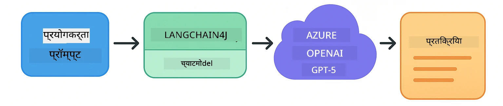

*LangChain4j कसरी तपाईंका प्रॉम्प्टहरूलाई Azure OpenAI GPT-5 सँग जोड्छ*

**निर्भरता** - मोड्युल 02 ले `pom.xml` मा परिभाषित निम्न langchain4j निर्भरता प्रयोग गर्छ:
```xml
<dependency>
    <groupId>dev.langchain4j</groupId>
    <artifactId>langchain4j</artifactId> <!-- Inherited from BOM in root pom.xml -->
</dependency>
<dependency>
    <groupId>dev.langchain4j</groupId>
    <artifactId>langchain4j-open-ai-official</artifactId> <!-- Inherited from BOM in root pom.xml -->
</dependency>
```

**OpenAiOfficialChatModel कन्फिगरेसन** - [LangChainConfig.java](../../../02-prompt-engineering/src/main/java/com/example/langchain4j/prompts/config/LangChainConfig.java)

च्याट मोडेललाई OpenAI Official क्लाइन्ट प्रयोग गरी स्प्रिंग बीनको रूपमा म्यानुअली कन्फिगर गरिएको छ, जसले Azure OpenAI अन्तबिन्दुहरूलाई समर्थन गर्छ। मोड्युल 01 बाट मुख्य भिन्नता प्रॉम्प्टहरू `chatModel.chat()` मा कसरी पठाइन्छ भन्ने संरचनामा हो, मोडेल सेटअपमा होइन।

**सिस्टम र प्रयोगकर्ता सन्देशहरू** - [Gpt5PromptService.java](../../../02-prompt-engineering/src/main/java/com/example/langchain4j/prompts/service/Gpt5PromptService.java)

LangChain4j ले स्पष्टताको लागि सन्देश प्रकारहरू अलग गर्छ। `SystemMessage` ले AI को व्यवहार र सन्दर्भ सेट गर्छ (जस्तै "तपाईं कोड समीक्षक हुनुहुन्छ"), जबकि `UserMessage` मा वास्तविक अनुरोध हुन्छ। यसले विभिन्न प्रयोगकर्ता प्रश्नहरूमा AI को व्यवहारलाई निरन्तर राख्न मद्दत गर्छ।

```java
SystemMessage systemMsg = SystemMessage.from(
    "You are a helpful Java programming expert."
);

UserMessage userMsg = UserMessage.from(
    "Explain what a List is in Java"
);

String response = chatModel.chat(systemMsg, userMsg);
```

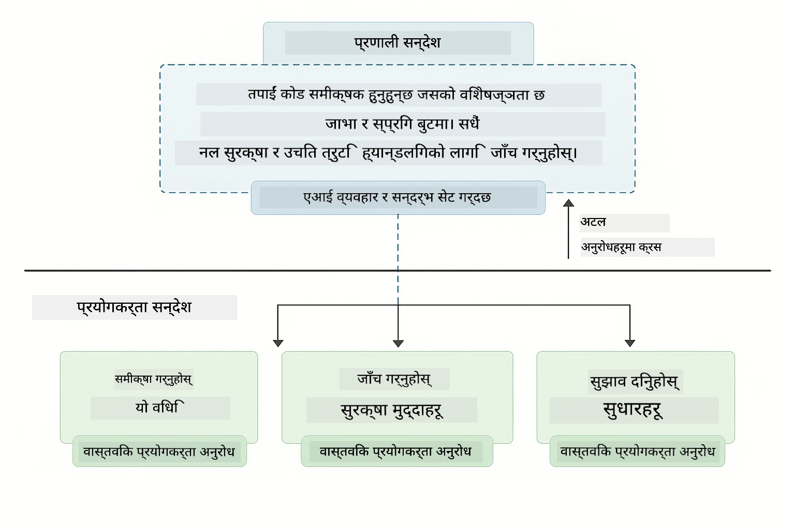

*SystemMessage ले स्थायी सन्दर्भ प्रदान गर्छ भने UserMessages मा व्यक्तिगत अनुरोधहरू हुन्छन्*

**Multi-Turn का लागि MessageWindowChatMemory** - बहु-टर्न संवाद ढाँचाका लागि, हामी मोड्युल 01 बाट `MessageWindowChatMemory` पुन: प्रयोग गर्छौं। प्रत्येक सत्रलाई आफ्नै मेमोरी इन्स्ट्यान्स `Map<String, ChatMemory>` मा राखिन्छ, जसले धेरै समवर्ती संवादहरूलाई सन्दर्भ नमिलाई अनुमति दिन्छ।

**प्रॉम्प्ट टेम्प्लेटहरू** - यहाँको वास्तविक केन्द्र प्रॉम्प्ट इन्जिनियरिङ हो, नयाँ LangChain4j API होइन। प्रत्येक ढाँचाले (कम उत्साह, उच्च उत्साह, कार्य कार्यान्वयन आदि) एउटै `chatModel.chat(prompt)` विधि प्रयोग गर्छ तर सावधानीपूर्वक संरचित प्रॉम्प्ट स्ट्रिङहरूका साथ। XML ट्यागहरू, निर्देशनहरू, र फर्म्याटिङ सबै प्रॉम्प्ट टेक्स्टको हिस्सा हुन्, LangChain4j सुविधाहरू होइनन्।

**तर्क नियन्त्रण** - GPT-5 को तर्क प्रयास प्रॉम्प्ट निर्देशनहरू जस्तै "अधिकतम २ तर्क चरणहरू" वा "थोरै खोजी गर्नुहोस्" मार्फत नियन्त्रण गरिन्छ। यी प्रॉम्प्ट इन्जिनियरिङ प्रविधिहरू हुन्, LangChain4j कन्फिगरेसनहरू होइनन्। लाइब्रेरीले तपाईंका प्रॉम्प्टहरू मोडेलमा मात्र पुर्‍याउँछ।

मुख्य कुरा: LangChain4j ले पूर्वाधार प्रदान गर्छ (मोडेल कनेक्शन [LangChainConfig.java](../../../02-prompt-engineering/src/main/java/com/example/langchain4j/prompts/config/LangChainConfig.java) मार्फत, मेमोरी, सन्देश ह्यान्डलिङ [Gpt5PromptService.java](../../../02-prompt-engineering/src/main/java/com/example/langchain4j/prompts/service/Gpt5PromptService.java) मार्फत), जबकि यो मोड्युलले तपाईंलाई त्यो पूर्वाधार भित्र प्रभावकारी प्रॉम्प्टहरू कसरी तयार गर्ने सिकाउँछ।

## मुख्य ढाँचाहरू

सबै समस्याहरूलाई एउटै तरिकाले समाधान गर्न सकिँदैन। केही प्रश्नहरूलाई छिटो उत्तर चाहिन्छ, केहीलाई गहिरो सोच। केहीलाई देखिने तर्क चाहिन्छ, केहीलाई मात्र परिणाम। यो मोड्युलले आठ प्रॉम्प्टिङ ढाँचाहरू समेट्छ - प्रत्येक फरक परिदृश्यका लागि अनुकूलित। तपाईं सबैसँग प्रयोग गरेर कुन विधि कहिले राम्रो काम गर्छ बुझ्नुहुनेछ।

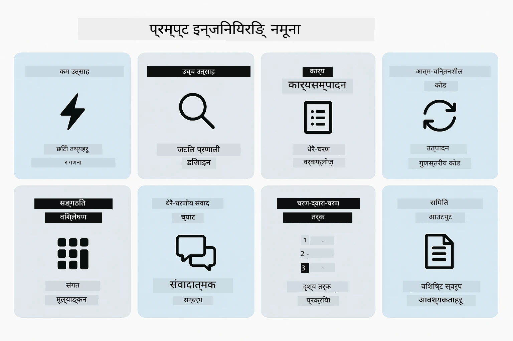

*आठ प्रॉम्प्ट इन्जिनियरिङ ढाँचाहरू र तिनीहरूको प्रयोग केसहरूको अवलोकन*

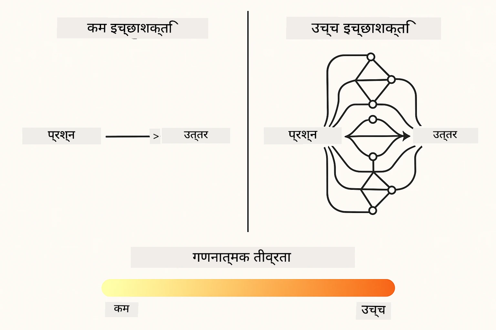

*कम उत्साह (छिटो, सिधा) बनाम उच्च उत्साह (गहिरो, खोजीपूर्ण) तर्क विधिहरू*

**कम उत्साह (छिटो र केन्द्रित)** - सरल प्रश्नहरूका लागि जहाँ तपाईं छिटो, सिधा उत्तर चाहनुहुन्छ। मोडेलले न्यूनतम तर्क गर्छ - अधिकतम २ चरण। गणना, खोज, वा सिधा प्रश्नहरूका लागि प्रयोग गर्नुहोस्।

```java
String prompt = """
    <reasoning_effort>low</reasoning_effort>
    <instruction>maximum 2 reasoning steps</instruction>
    
    What is 15% of 200?
    """;

String response = chatModel.chat(prompt);
```

> 💡 **GitHub Copilot सँग अन्वेषण गर्नुहोस्:** [`Gpt5PromptService.java`](../../../02-prompt-engineering/src/main/java/com/example/langchain4j/prompts/service/Gpt5PromptService.java) खोल्नुहोस् र सोध्नुहोस्:
> - "कम उत्साह र उच्च उत्साह प्रॉम्प्टिङ ढाँचाहरूमा के फरक छ?"
> - "प्रॉम्प्टहरूमा XML ट्यागहरूले AI को प्रतिक्रिया कसरी संरचना गर्न मद्दत गर्छ?"
> - "म कहिले आत्म-प्रतिबिम्बित ढाँचाहरू र कहिले सिधा निर्देशन प्रयोग गर्ने?"

**उच्च उत्साह (गहिरो र खोजीपूर्ण)** - जटिल समस्याहरूका लागि जहाँ तपाईं व्यापक विश्लेषण चाहनुहुन्छ। मोडेलले गहिरो खोजी गर्छ र विस्तृत तर्क देखाउँछ। प्रणाली डिजाइन, वास्तुकला निर्णय, वा जटिल अनुसन्धानका लागि प्रयोग गर्नुहोस्।

```java
String prompt = """
    <reasoning_effort>high</reasoning_effort>
    <instruction>explore thoroughly, show detailed reasoning</instruction>
    
    Design a caching strategy for a high-traffic REST API.
    """;

String response = chatModel.chat(prompt);
```

**कार्य कार्यान्वयन (चरण-द्वारा-चरण प्रगति)** - बहु-चरण कार्यप्रवाहका लागि। मोडेलले प्रारम्भिक योजना दिन्छ, प्रत्येक चरणमा काम गर्दै कथन गर्छ, र अन्तमा सारांश दिन्छ। माइग्रेशन, कार्यान्वयन, वा कुनै बहु-चरण प्रक्रियाका लागि प्रयोग गर्नुहोस्।

```java
String prompt = """
    <task>Create a REST endpoint for user registration</task>
    <preamble>Provide an upfront plan</preamble>
    <narration>Narrate each step as you work</narration>
    <summary>Summarize what was accomplished</summary>
    """;

String response = chatModel.chat(prompt);
```

चेन-ऑफ-थट प्रॉम्प्टिङले मोडेललाई यसको तर्क प्रक्रिया देखाउन स्पष्ट रूपमा भन्छ, जसले जटिल कार्यहरूको लागि शुद्धता सुधार्छ। चरण-द्वारा-चरण विश्लेषणले मानिस र AI दुवैलाई तर्क बुझ्न मद्दत गर्छ।

> **🤖 [GitHub Copilot](https://github.com/features/copilot) च्याटसँग प्रयास गर्नुहोस्:** यस ढाँचाबारे सोध्नुहोस्:
> - "लामो समय चल्ने अपरेसनहरूका लागि कार्य कार्यान्वयन ढाँचालाई कसरी अनुकूल बनाउने?"
> - "उत्पादन एप्लिकेसनहरूमा टूल प्रीएम्बलहरू संरचना गर्ने उत्तम अभ्यासहरू के हुन्?"
> - "UI मा मध्यवर्ती प्रगति अपडेटहरू कसरी समात्ने र देखाउने?"

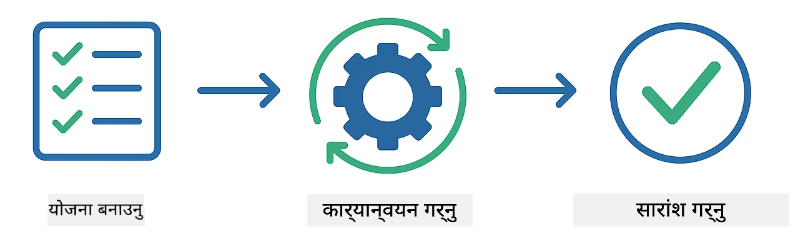

*बहु-चरण कार्यहरूको लागि योजना → कार्यान्वयन → सारांश कार्यप्रवाह*

**आत्म-प्रतिबिम्बित कोड** - उत्पादन-गुणस्तर कोड निर्माणका लागि। मोडेलले कोड उत्पादन गर्छ, गुणस्तर मापदण्डसँग जाँच गर्छ, र पुनरावृत्तिमै सुधार गर्छ। नयाँ सुविधाहरू वा सेवाहरू बनाउँदा प्रयोग गर्नुहोस्।

```java
String prompt = """
    <task>Create an email validation service</task>
    <quality_criteria>
    - Correct logic and error handling
    - Best practices (clean code, proper naming)
    - Performance optimization
    - Security considerations
    </quality_criteria>
    <instruction>Generate code, evaluate against criteria, improve iteratively</instruction>
    """;

String response = chatModel.chat(prompt);
```

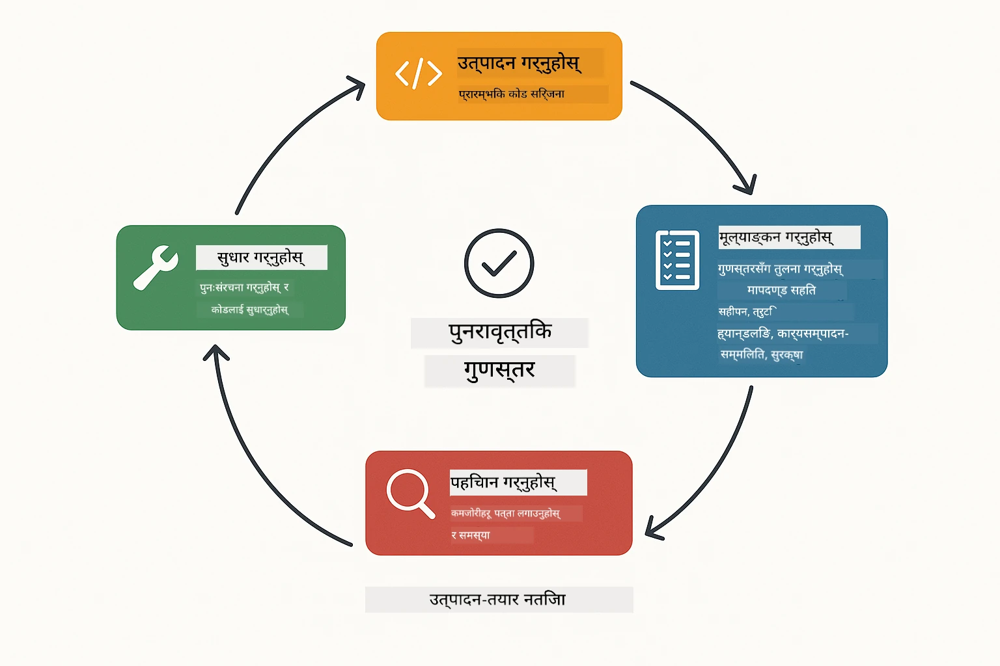

*पुनरावृत्तिमै सुधार चक्र - उत्पादन, मूल्याङ्कन, समस्या पहिचान, सुधार, दोहोर्याउनुहोस्*

**संरचित विश्लेषण** - निरन्तर मूल्याङ्कनका लागि। मोडेलले निश्चित फ्रेमवर्क (सहीपन, अभ्यासहरू, प्रदर्शन, सुरक्षा) प्रयोग गरी कोड समीक्षा गर्छ। कोड समीक्षा वा गुणस्तर मूल्याङ्कनका लागि प्रयोग गर्नुहोस्।

```java
String prompt = """
    <code>
    public List getUsers() {
        return database.query("SELECT * FROM users");
    }
    </code>
    
    <framework>
    Evaluate using these categories:
    1. Correctness - Logic and functionality
    2. Best Practices - Code quality
    3. Performance - Efficiency concerns
    4. Security - Vulnerabilities
    </framework>
    """;

String response = chatModel.chat(prompt);
```

> **🤖 [GitHub Copilot](https://github.com/features/copilot) च्याटसँग प्रयास गर्नुहोस्:** संरचित विश्लेषणबारे सोध्नुहोस्:
> - "विभिन्न प्रकारका कोड समीक्षाहरूका लागि विश्लेषण फ्रेमवर्क कसरी अनुकूल बनाउने?"
> - "संरचित आउटपुटलाई प्रोग्रामिङ तरिकाले पार्स र कार्यान्वयन गर्ने उत्तम तरिका के हो?"
> - "विभिन्न समीक्षा सत्रहरूमा निरन्तर गम्भीरता स्तर कसरी सुनिश्चित गर्ने?"

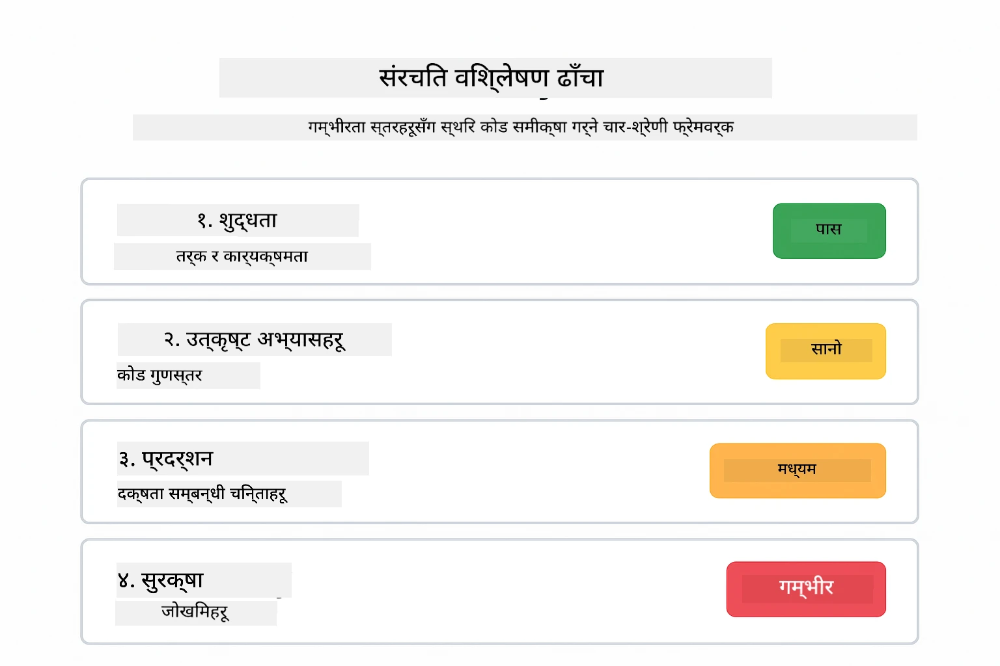

*गम्भीरता स्तरहरूसहित निरन्तर कोड समीक्षा गर्न चार-श्रेणी फ्रेमवर्क*

**बहु-टर्न च्याट** - सन्दर्भ आवश्यक संवादहरूको लागि। मोडेलले अघिल्ला सन्देशहरू सम्झन्छ र तिनीहरूमा आधारित हुन्छ। अन्तरक्रियात्मक सहायता सत्र वा जटिल प्रश्नोत्तरका लागि प्रयोग गर्नुहोस्।

```java
ChatMemory memory = MessageWindowChatMemory.withMaxMessages(10);

memory.add(UserMessage.from("What is Spring Boot?"));
AiMessage aiMessage1 = chatModel.chat(memory.messages()).aiMessage();
memory.add(aiMessage1);

memory.add(UserMessage.from("Show me an example"));
AiMessage aiMessage2 = chatModel.chat(memory.messages()).aiMessage();
memory.add(aiMessage2);
```

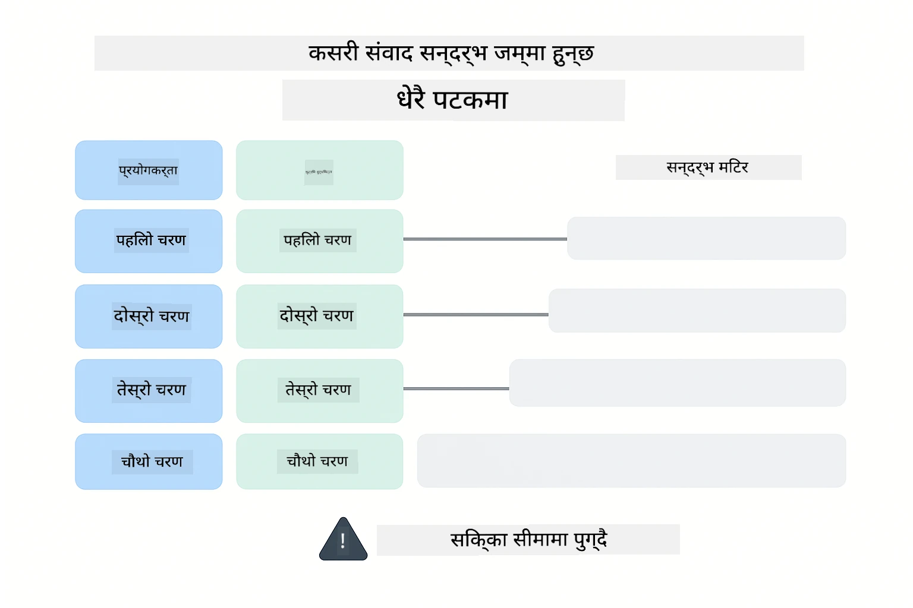

*संवाद सन्दर्भ कसरी धेरै टर्नहरूमा जम्मा हुन्छ जबसम्म टोकन सीमा पुग्दैन*

**चरण-द्वारा-चरण तर्क** - देखिने तर्क आवश्यक समस्याहरूका लागि। मोडेलले प्रत्येक चरणको स्पष्ट तर्क देखाउँछ। गणितका समस्या, तर्क पहेली, वा सोच प्रक्रिया बुझ्न आवश्यक पर्दा प्रयोग गर्नुहोस्।

```java
String prompt = """
    <instruction>Show your reasoning step-by-step</instruction>
    
    If a train travels 120 km in 2 hours, then stops for 30 minutes,
    then travels another 90 km in 1.5 hours, what is the average speed
    for the entire journey including the stop?
    """;

String response = chatModel.chat(prompt);
```

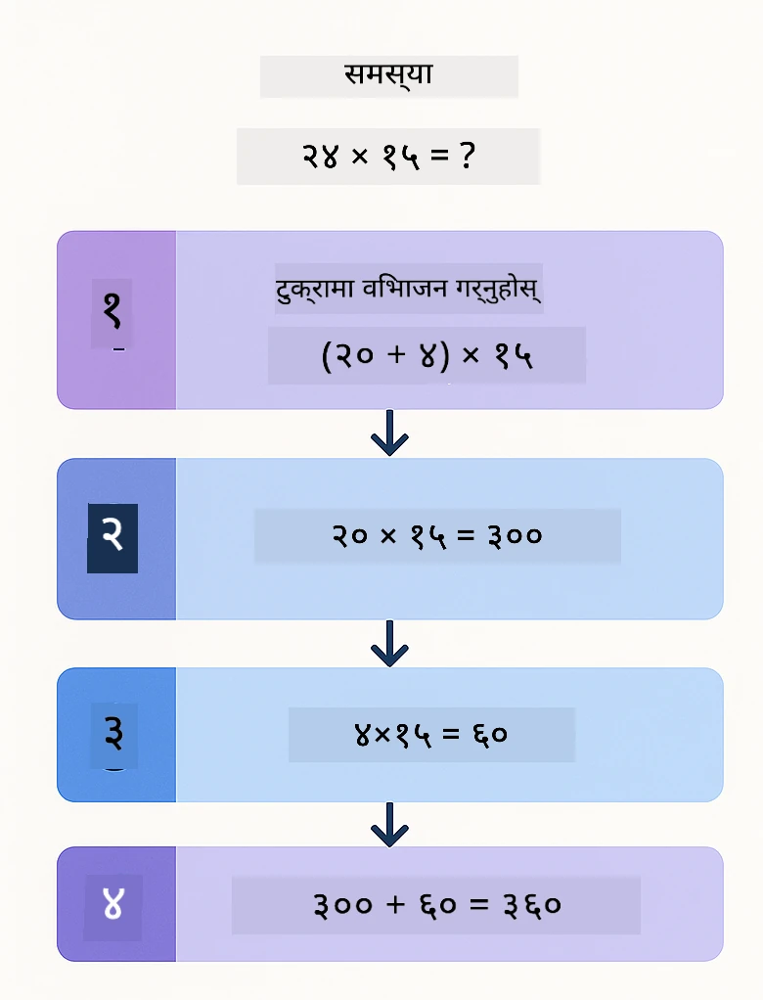

*समस्याहरूलाई स्पष्ट तार्किक चरणहरूमा विभाजन*

**सीमित आउटपुट** - विशिष्ट फर्म्याट आवश्यकताहरू भएका प्रतिक्रियाहरूका लागि। मोडेलले कडाइका साथ फर्म्याट र लम्बाइ नियमहरू पालना गर्छ। सारांशहरू वा ठ्याक्कै आउटपुट संरचना आवश्यक पर्दा प्रयोग गर्नुहोस्।

```java
String prompt = """
    <constraints>
    - Exactly 100 words
    - Bullet point format
    - Technical terms only
    </constraints>
    
    Summarize the key concepts of machine learning.
    """;

String response = chatModel.chat(prompt);
```

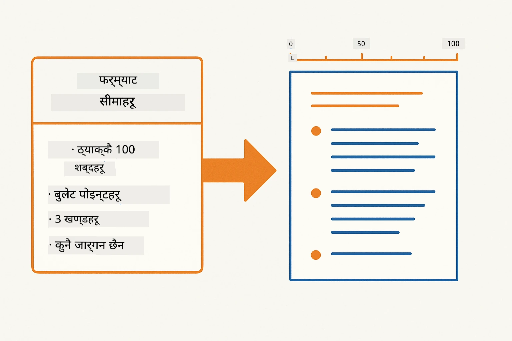

*विशिष्ट फर्म्याट, लम्बाइ, र संरचना आवश्यकताहरू लागू गर्दै*

## अस्तित्वमा रहेका Azure स्रोतहरू प्रयोग गर्दै

**तैनाथी जाँच गर्नुहोस्:**

रुट डाइरेक्टरीमा `.env` फाइल Azure प्रमाणपत्रहरूसहित छ कि छैन सुनिश्चित गर्नुहोस् (मोड्युल 01 मा सिर्जना गरिएको):
```bash
cat ../.env  # AZURE_OPENAI_ENDPOINT, API_KEY, DEPLOYMENT देखाउनु पर्छ
```

**एप्लिकेसन सुरु गर्नुहोस्:**

> **नोट:** यदि तपाईंले मोड्युल 01 बाट `./start-all.sh` प्रयोग गरी सबै एप्लिकेसनहरू पहिले नै सुरु गर्नुभएको छ भने, यो मोड्युल पोर्ट 8083 मा पहिले नै चलिरहेको छ। तलका सुरु आदेशहरू छोडेर सिधै http://localhost:8083 मा जान सक्नुहुन्छ।

**विकल्प 1: Spring Boot Dashboard प्रयोग गर्दै (VS Code प्रयोगकर्ताहरूका लागि सिफारिस गरिएको)**

डेभ कन्टेनरमा Spring Boot Dashboard एक्सटेन्सन समावेश छ, जसले सबै Spring Boot एप्लिकेसनहरूलाई दृश्यात्मक रूपमा व्यवस्थापन गर्न मद्दत गर्छ। VS Code को Activity Bar को बाँया पट्टि Spring Boot आइकन खोज्नुहोस्।

Spring Boot Dashboard बाट तपाईंले:
- कार्यक्षेत्रमा उपलब्ध सबै Spring Boot एप्लिकेसनहरू देख्न सक्नुहुन्छ
- एक क्लिकमा एप्लिकेसनहरू सुरु/रोक्न सक्नुहुन्छ
- एप्लिकेसन लगहरू वास्तविक समयमा हेर्न सक्नुहुन्छ
- एप्लिकेसन स्थिति अनुगमन गर्न सक्नुहुन्छ

"prompt-engineering" को छेउमा प्ले बटन क्लिक गरेर यो मोड्युल सुरु गर्नुहोस्, वा सबै मोड्युलहरू एकैपटक सुरु गर्नुहोस्।

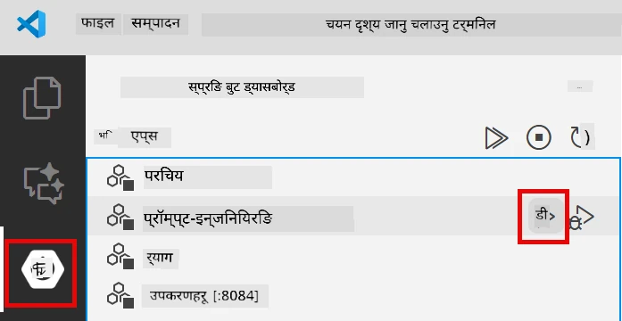

**विकल्प 2: shell स्क्रिप्टहरू प्रयोग गर्दै**

सबै वेब एप्लिकेसनहरू (मोड्युल 01-04) सुरु गर्नुहोस्:

**Bash:**
```bash
cd ..  # मूल निर्देशिका बाट
./start-all.sh
```

**PowerShell:**
```powershell
cd ..  # मूल निर्देशिका बाट
.\start-all.ps1
```

वा केवल यो मोड्युल सुरु गर्नुहोस्:

**Bash:**
```bash
cd 02-prompt-engineering
./start.sh
```

**PowerShell:**
```powershell
cd 02-prompt-engineering
.\start.ps1
```

दुवै स्क्रिप्टहरूले स्वतः रुट `.env` फाइलबाट वातावरण चरहरू लोड गर्छन् र JAR फाइलहरू नभएमा निर्माण गर्छन्।

> **नोट:** यदि तपाईंले सुरु गर्नु अघि सबै मोड्युलहरू म्यानुअली निर्माण गर्न चाहनुहुन्छ भने:
>
> **Bash:**
> ```bash
> cd ..  # Go to root directory
> mvn clean package -DskipTests
> ```
>
> **PowerShell:**
> ```powershell
> cd ..  # Go to root directory
> mvn clean package -DskipTests
> ```

तपाईंको ब्राउजरमा http://localhost:8083 खोल्नुहोस्।

**रोक्न:**

**Bash:**
```bash
./stop.sh  # यो मोड्युल मात्र
# वा
cd .. && ./stop-all.sh  # सबै मोड्युलहरू
```

**PowerShell:**
```powershell
.\stop.ps1  # यो मोड्युल मात्र
# वा
cd ..; .\stop-all.ps1  # सबै मोड्युलहरू
```

## एप्लिकेसनका स्क्रिनसटहरू

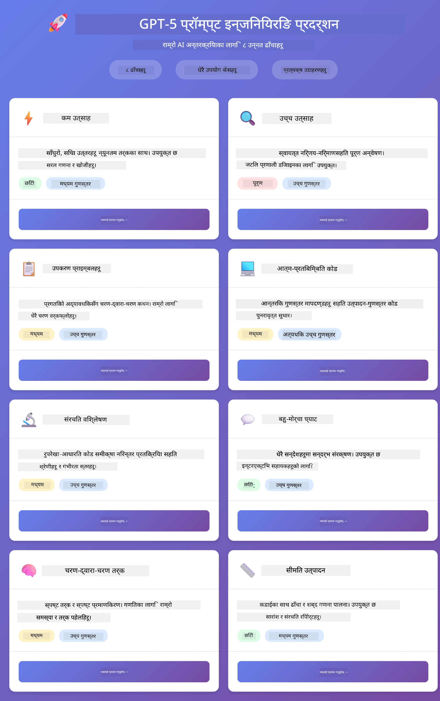

*मुख्य ड्यासबोर्ड जसले सबै ८ प्रॉम्प्ट इन्जिनियरिङ ढाँचाहरू तिनीहरूको विशेषताहरू र प्रयोग केसहरूसहित देखाउँछ*

## ढाँचाहरू अन्वेषण गर्दै

वेब इन्टरफेसले तपाईंलाई विभिन्न प्रॉम्प्टिङ रणनीतिहरूमा प्रयोग गर्न दिन्छ। प्रत्येक ढाँचाले फरक समस्याहरू समाधान गर्छ - कुन विधि कहिले राम्रो काम गर्छ हेर्न प्रयास गर्नुहोस्।

### कम बनाम उच्च उत्साह

"200 को 15% कति हो?" जस्तो सरल प्रश्न कम उत्साह प्रयोग गरेर सोध्नुहोस्। तपाईंलाई तुरुन्त, सिधा उत्तर प्राप्त हुनेछ। अब "उच्च ट्राफिक API का लागि क्यासिङ रणनीति डिजाइन गर्नुहोस्" जस्तो जटिल प्रश्न उच्च उत्साह प्रयोग गरेर सोध्नुहोस्। मोडेल कसरी ढिलो हुन्छ र विस्तृत तर्क दिन्छ हेर्नुहोस्। एउटै मोडेल, एउटै प्रश्न संरचना - तर प्रॉम्प्टले कति सोच्ने हो भन्छ।

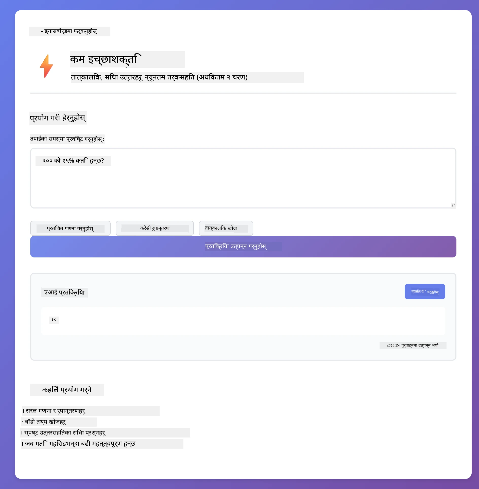
*सामान्य तर्क बिना छिटो गणना*

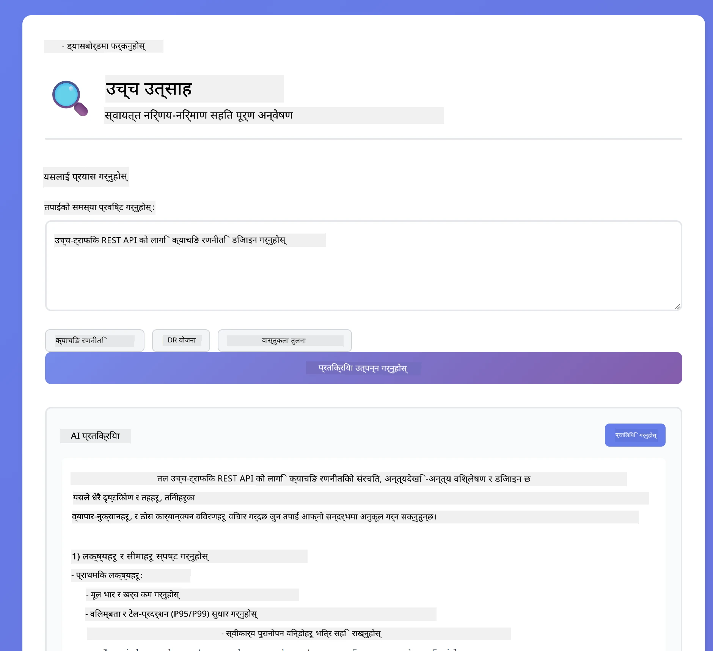

*व्यापक क्यासिङ रणनीति (2.8MB)*

### कार्य कार्यान्वयन (टूल प्रीएम्बलहरू)

बहु-चरण कार्यप्रवाहहरू अग्रिम योजना र प्रगति वर्णनबाट लाभान्वित हुन्छन्। मोडेलले के गर्नेछ भनेर रूपरेखा बनाउँछ, प्रत्येक चरण वर्णन गर्छ, र त्यसपछि परिणामहरू सारांशित गर्छ।

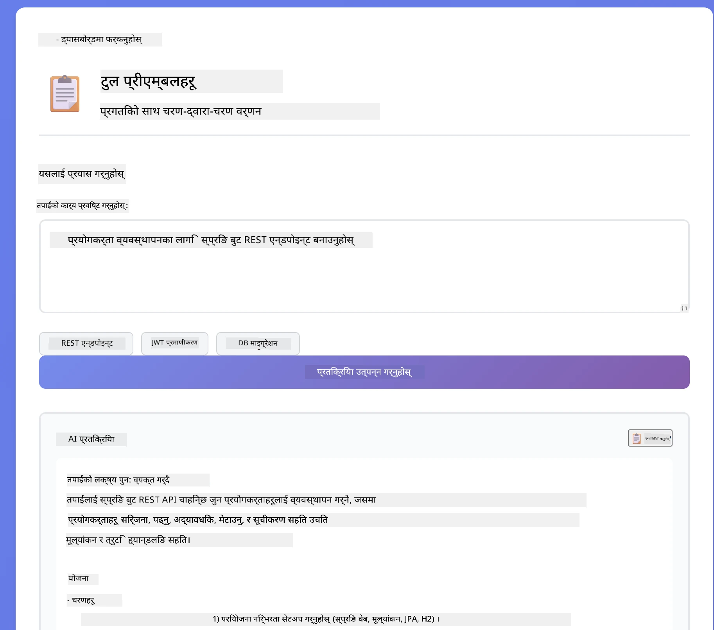

*चरण-दर-चरण वर्णनसहित REST अन्तबिन्दु सिर्जना गर्दै (3.9MB)*

### आत्म-प्रतिबिम्बित कोड

"इमेल प्रमाणीकरण सेवा सिर्जना गर्नुहोस्" प्रयास गर्नुहोस्। केवल कोड सिर्जना गरेर रोक्ने सट्टा, मोडेलले कोड सिर्जना गर्छ, गुणस्तर मापदण्डहरू विरुद्ध मूल्याङ्कन गर्छ, कमजोरीहरू पहिचान गर्छ, र सुधार गर्छ। तपाईंले देख्नुहुनेछ कि यो कोड उत्पादन मापदण्डहरू पूरा नभएसम्म पुनरावृत्ति गर्छ।

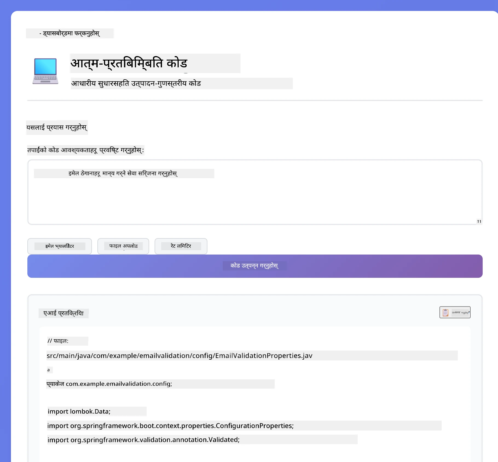

*पूर्ण इमेल प्रमाणीकरण सेवा (5.2MB)*

### संरचित विश्लेषण

कोड समीक्षा लागि सुसंगत मूल्याङ्कन ढाँचाहरू आवश्यक हुन्छन्। मोडेलले निश्चित वर्गीकरणहरू (सहीपन, अभ्यासहरू, प्रदर्शन, सुरक्षा) र गम्भीरता स्तरहरू प्रयोग गरेर कोड विश्लेषण गर्छ।

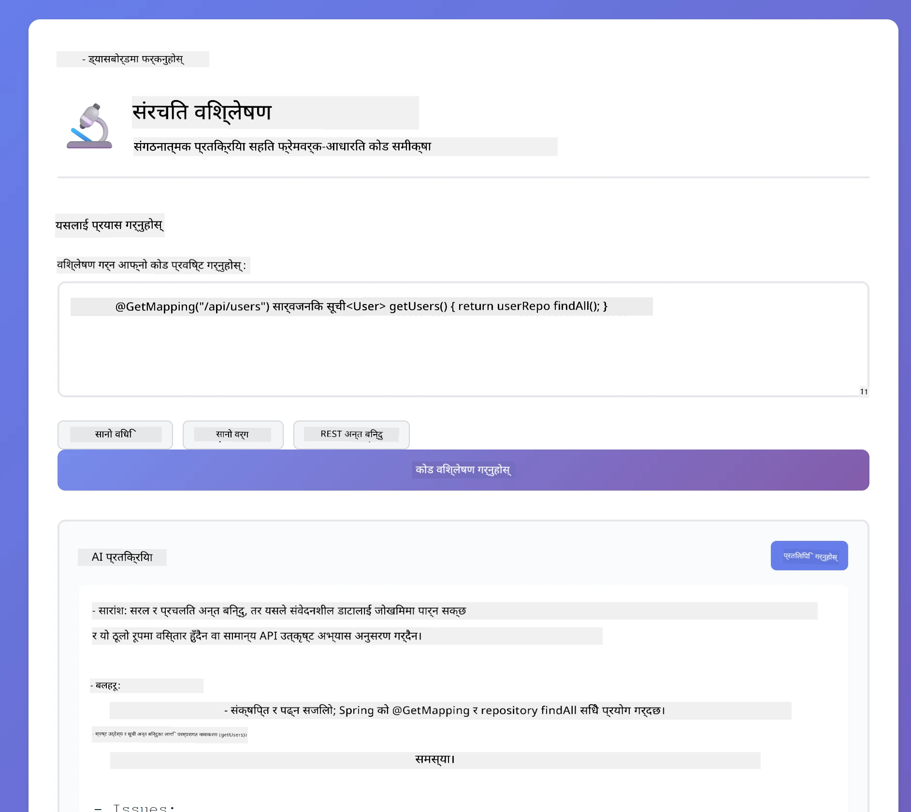

*ढाँचामा आधारित कोड समीक्षा*

### बहु-चरण संवाद

"स्प्रिंग बुट के हो?" सोध्नुहोस् र तुरुन्तै "मलाई एउटा उदाहरण देखाउनुहोस्" भन्नुहोस्। मोडेलले तपाईंको पहिलो प्रश्न सम्झन्छ र तपाईंलाई विशेष रूपमा स्प्रिंग बुटको उदाहरण दिन्छ। सम्झना बिना, दोस्रो प्रश्न धेरै अस्पष्ट हुन्थ्यो।

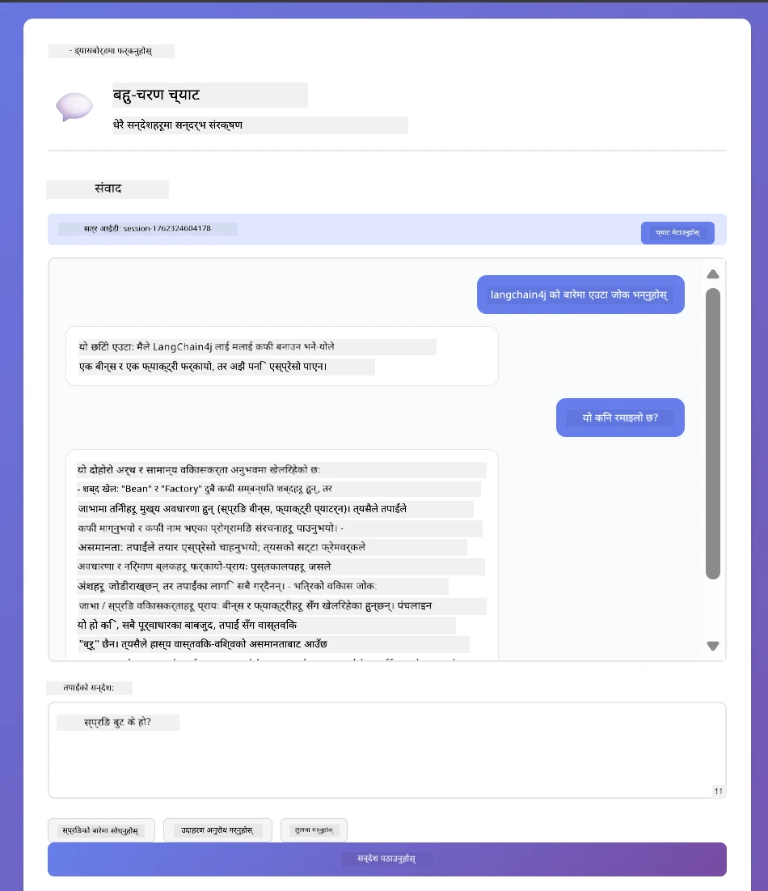

*प्रश्नहरू बीच सन्दर्भ संरक्षण*

### चरण-दर-चरण तर्क

एउटा गणित समस्या छान्नुहोस् र यसलाई चरण-दर-चरण तर्क र कम उत्साह दुवैसँग प्रयास गर्नुहोस्। कम उत्साहले केवल उत्तर दिन्छ - छिटो तर अस्पष्ट। चरण-दर-चरणले तपाईंलाई प्रत्येक गणना र निर्णय देखाउँछ।

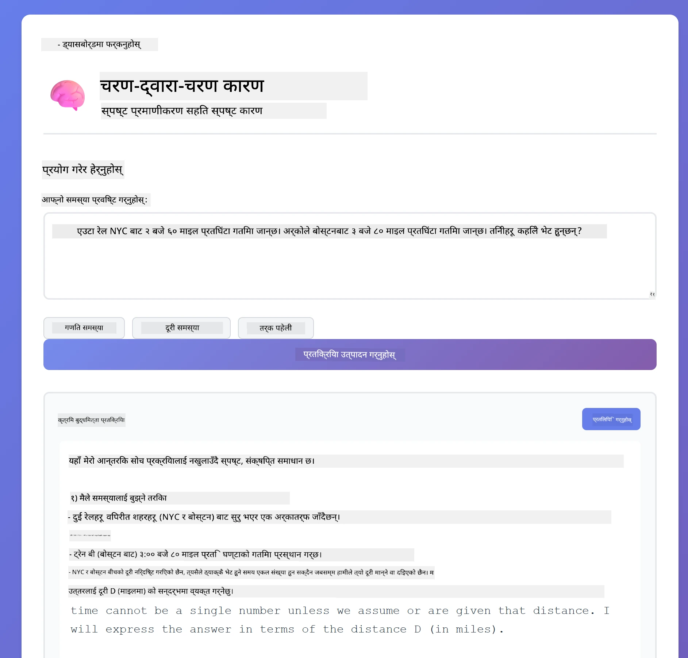

*स्पष्ट चरणहरू सहित गणित समस्या*

### सीमित आउटपुट

जब तपाईंलाई विशेष ढाँचा वा शब्द गणना आवश्यक हुन्छ, यो ढाँचाले कडाइका साथ पालना सुनिश्चित गर्छ। ठीक १०० शब्दहरूमा बुलेट पोइन्ट ढाँचामा सारांश सिर्जना गर्न प्रयास गर्नुहोस्।

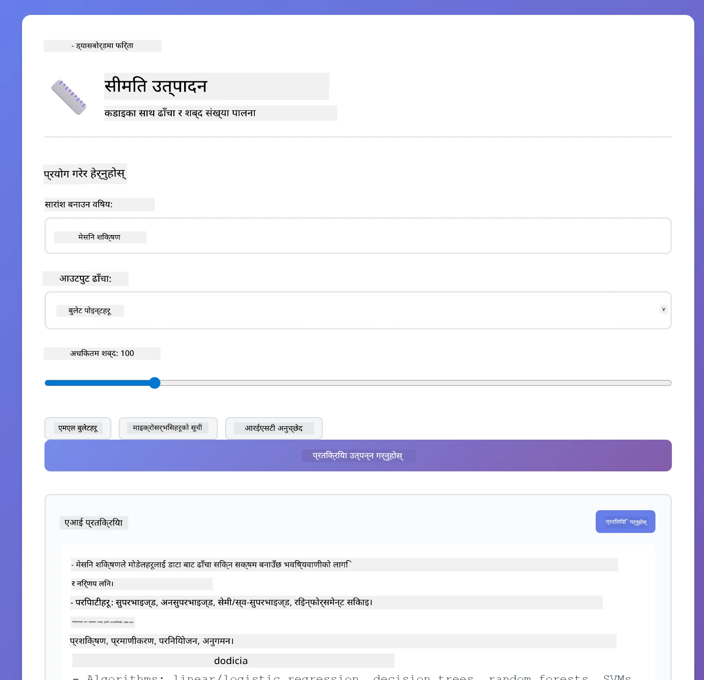

*ढाँचामा नियन्त्रणसहित मेसिन लर्निङ सारांश*

## तपाईं साँच्चिकै के सिक्दै हुनुहुन्छ

**तर्क प्रयासले सबै कुरा परिवर्तन गर्छ**

GPT-5 ले तपाईंलाई प्रॉम्प्टहरू मार्फत कम्प्युटेशनल प्रयास नियन्त्रण गर्न दिन्छ। कम प्रयासले छिटो प्रतिक्रिया दिन्छ र न्यूनतम अन्वेषण गर्छ। उच्च प्रयासले मोडेललाई गहिरो सोच्न समय दिन्छ। तपाईंले कार्य जटिलतासँग प्रयास मिलाउन सिक्दै हुनुहुन्छ - सरल प्रश्नमा समय नबर्बाद गर्नुहोस्, तर जटिल निर्णयहरूमा पनि हतार नगर्नुहोस्।

**संरचनाले व्यवहार मार्गदर्शन गर्छ**

प्रॉम्प्टहरूमा XML ट्यागहरू देख्नुभयो? ती सजावट होइनन्। मोडेलहरूले संरचित निर्देशनहरू स्वतन्त्र पाठभन्दा बढी विश्वसनीय रूपमा पालना गर्छन्। जब तपाईंलाई बहु-चरण प्रक्रिया वा जटिल तर्क चाहिन्छ, संरचनाले मोडेललाई यसको स्थिति र के आउँछ ट्र्याक गर्न मद्दत गर्छ।

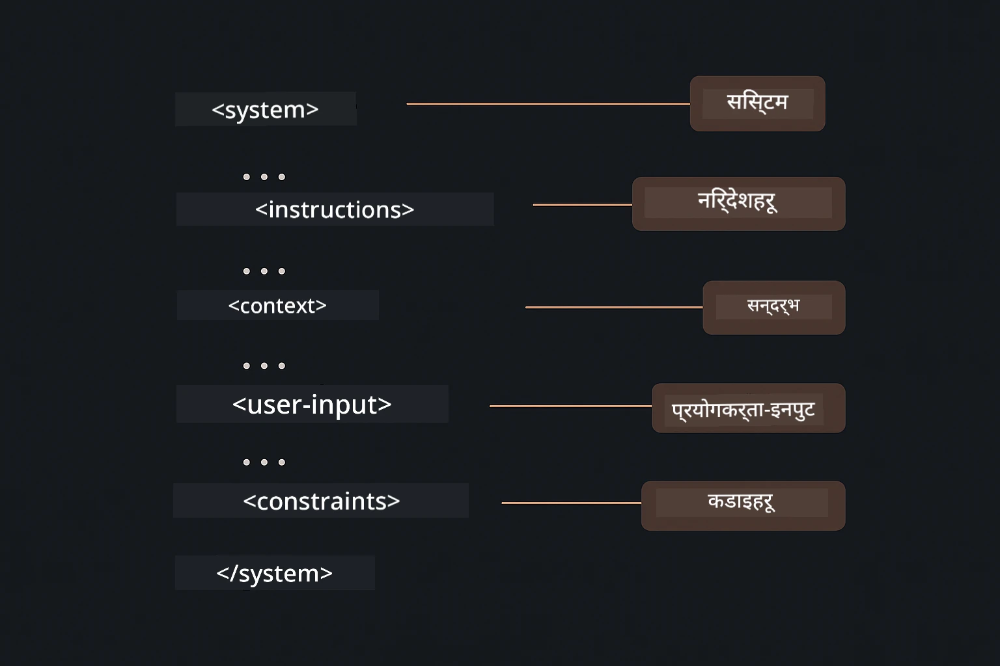

*स्पष्ट खण्डहरू र XML-शैली संगठनसहित राम्रो संरचित प्रॉम्प्टको संरचना*

**आत्म-मूल्याङ्कन मार्फत गुणस्तर**

आत्म-प्रतिबिम्बित ढाँचाहरूले गुणस्तर मापदण्डहरू स्पष्ट पारेर काम गर्छन्। मोडेलले "सही गर्छ" भन्ने आशा गर्ने सट्टा, तपाईंले यसलाई "सही" के हो भनेर स्पष्ट रूपमा बताउनुहुन्छ: सही तर्क, त्रुटि ह्यान्डलिङ, प्रदर्शन, सुरक्षा। त्यसपछि मोडेलले आफ्नै आउटपुट मूल्याङ्कन गरेर सुधार गर्न सक्छ। यसले कोड सिर्जनालाई लटरीबाट प्रक्रिया बनाउँछ।

**सन्दर्भ सीमित छ**

बहु-चरण संवादहरू प्रत्येक अनुरोधसँग सन्देश इतिहास समावेश गरेर काम गर्छन्। तर सीमा छ - प्रत्येक मोडेलको अधिकतम टोकन गणना हुन्छ। संवाद बढ्दै जाँदा, तपाईंले सान्दर्भिक सन्दर्भ राख्न तर त्यो सीमा नछुन रणनीतिहरू आवश्यक पर्छ। यो मोड्युलले तपाईंलाई सम्झना कसरी काम गर्छ देखाउँछ; पछि तपाईंले कहिले सारांश बनाउने, कहिले बिर्सने, र कहिले पुनःप्राप्त गर्ने सिक्नुहुनेछ।

## अर्को चरणहरू

**अर्को मोड्युल:** [03-rag - RAG (Retrieval-Augmented Generation)](../03-rag/README.md)

---

**नेभिगेसन:** [← अघिल्लो: मोड्युल 01 - परिचय](../01-introduction/README.md) | [मुख्यमा फर्कनुहोस्](../README.md) | [अर्को: मोड्युल 03 - RAG →](../03-rag/README.md)

---

<!-- CO-OP TRANSLATOR DISCLAIMER START -->
**अस्वीकरण**:
यो दस्तावेज AI अनुवाद सेवा [Co-op Translator](https://github.com/Azure/co-op-translator) प्रयोग गरी अनुवाद गरिएको हो। हामी शुद्धताका लागि प्रयासरत छौं भने पनि, कृपया ध्यान दिनुहोस् कि स्वचालित अनुवादमा त्रुटि वा अशुद्धता हुन सक्छ। मूल दस्तावेज यसको मूल भाषामा नै अधिकारिक स्रोत मानिनु पर्छ। महत्वपूर्ण जानकारीका लागि व्यावसायिक मानव अनुवाद सिफारिस गरिन्छ। यस अनुवादको प्रयोगबाट उत्पन्न कुनै पनि गलतफहमी वा गलत व्याख्याका लागि हामी जिम्मेवार छैनौं।
<!-- CO-OP TRANSLATOR DISCLAIMER END -->