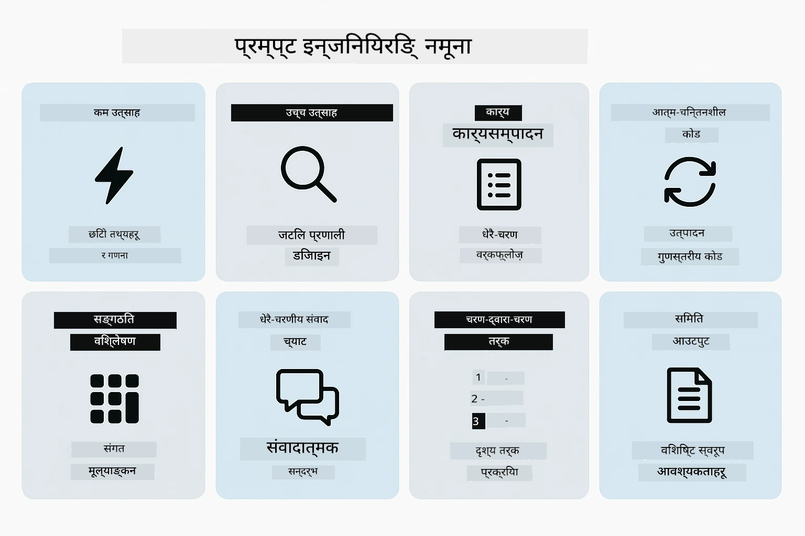
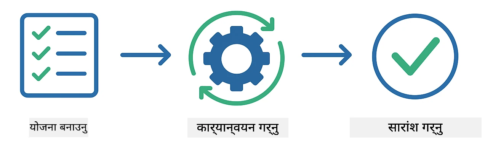
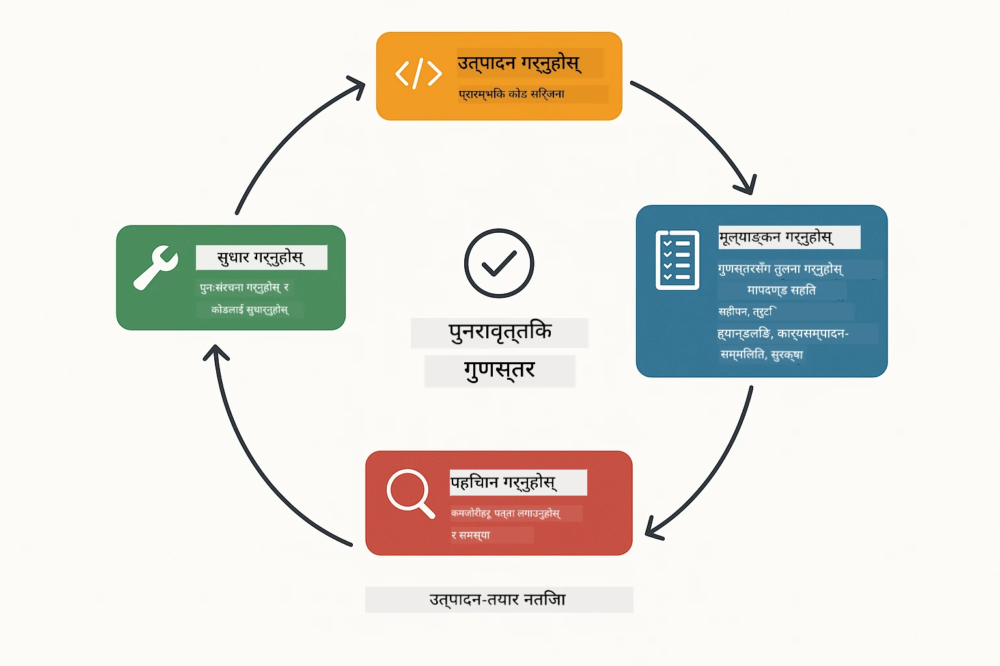
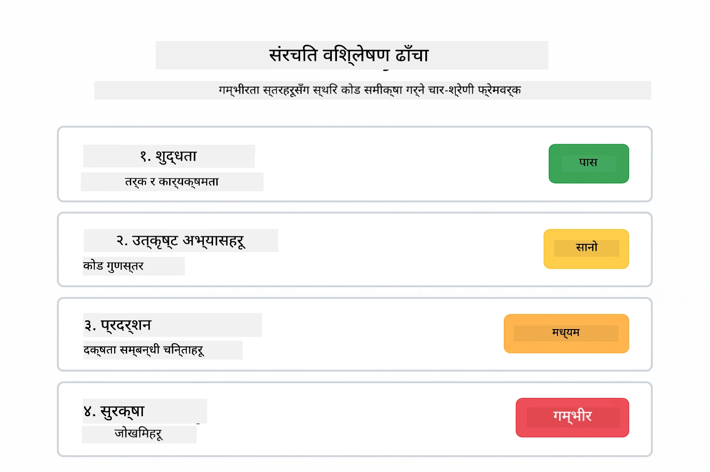
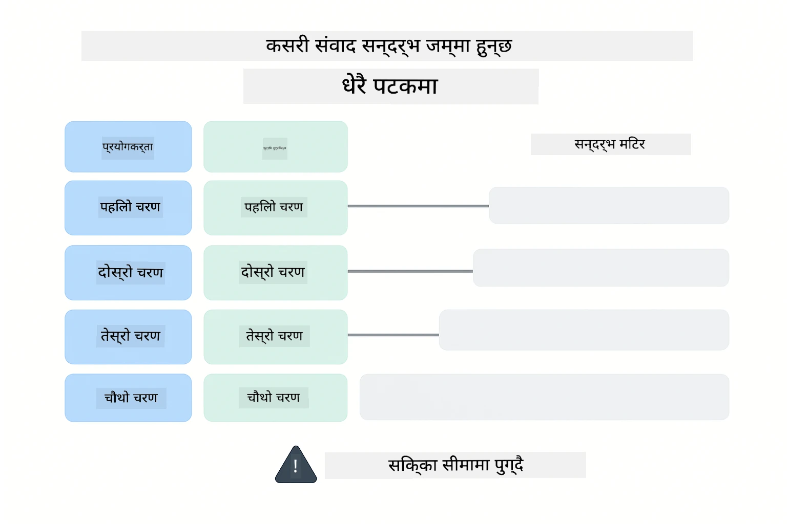
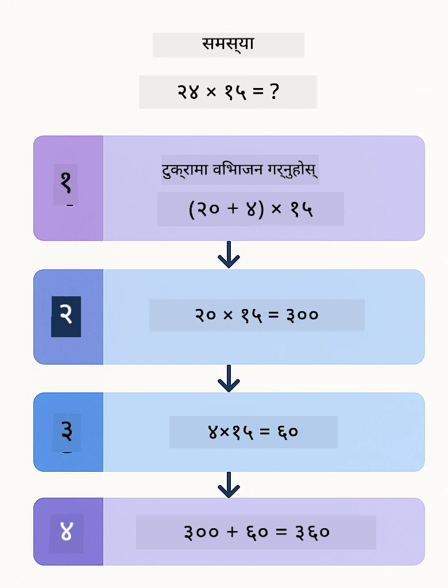
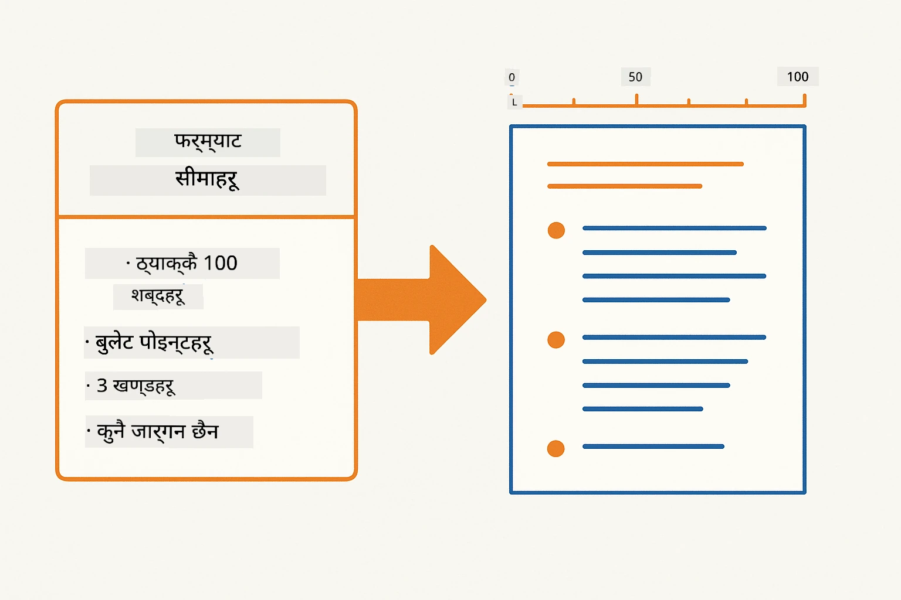
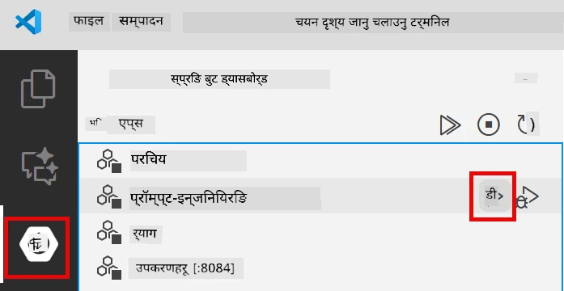
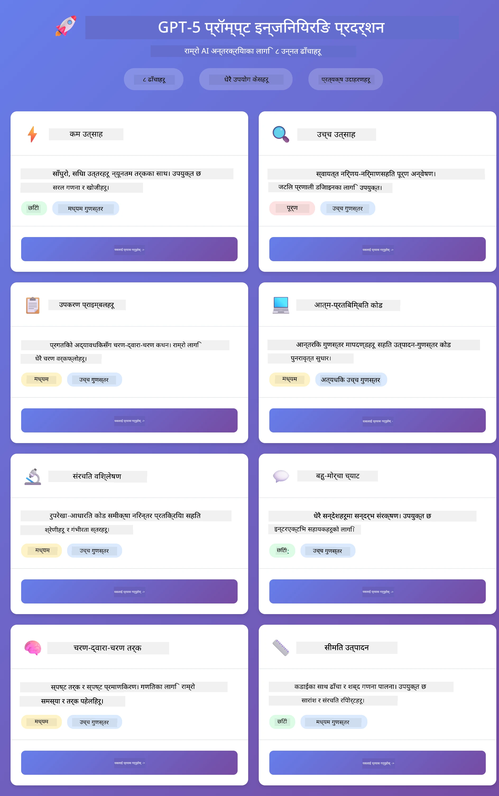
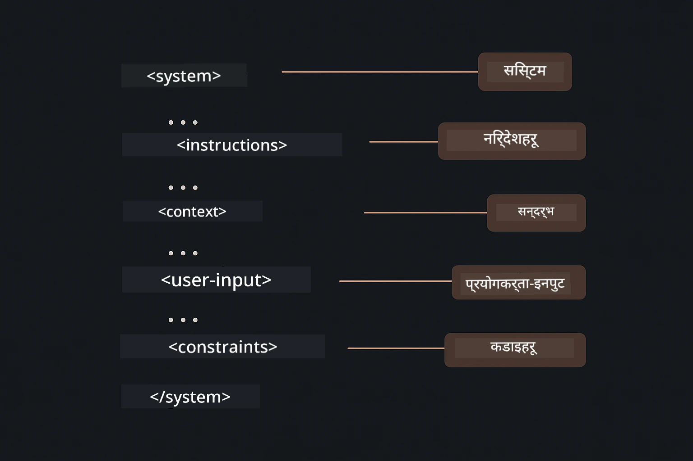

# Module 02: GPT-5.2 सँग प्रॉम्प्ट इन्जिनियरिङ

## टेबल अफ कन्टेन्ट्स

- [भिडियो वाकथ्रू](#भिडियो-वाकथ्रू)
- [तपाईंले के सिक्नुहुनेछ](#तपाईंले-के-सिक्नुहुनेछ)
- [पूर्वशर्तहरू](#पूर्वशर्तहरू)
- [प्रॉम्प्ट इन्जिनियरिङ बुझ्न](#प्रॉम्प्ट-इन्जिनियरिङ-बुझ्न)
- [प्रॉम्प्ट इन्जिनियरिङका आधारभूत तत्वहरू](#प्रॉम्प्ट-इन्जिनियरिङका-आधारभूत-तत्वहरू)
  - [शून्य-शट प्रॉम्प्टिङ](#शून्य-शट-प्रॉम्प्टिङ)
  - [केही-शट प्रॉम्प्टिङ](#केही-शट-प्रॉम्प्टिङ)
  - [चेन अफ थट](#चेन-अफ-थट)
  - [भूमिका-आधारित प्रॉम्प्टिङ](#भूमिका-आधारित-प्रॉम्प्टिङ)
  - [प्रॉम्प्ट टेम्प्लेटहरू](#प्रॉम्प्ट-टेम्प्लेटहरू)
- [उन्नत ढाँचाहरू](#उन्नत-ढाँचाहरू)
- [एप्लिकेसन चलाउनुहोस्](#अनुप्रयोग-चलाउनुहोस्)
- [एप्लिकेसन स्क्रीनशटहरू](#अनुप्रयोग-स्क्रिनशटहरू)
- [ढाँचाहरू अन्वेषण गर्दै](#ढाँचाहरू-अन्वेषण-गर्दै)
  - [कम बनाम उच्च उत्साह](#low-बनाम-high-eagerness)
  - [कार्य निष्पादन (टूल प्रीएम्बलहरू)](#कार्यान्वयन-कार्य-टुल-प्रिप्रेबल्स)
  - [आत्म-प्रतिबिम्बन गर्ने कोड](#self-reflecting-code)
  - [संरचित विश्लेषण](#संरचित-विश्लेषण)
  - [बहु-टर्न च्याट](#बहु-टर्न-संवाद)
  - [क्रमबद्ध तर्क](#चरण-द्वारा-चरण-तर्क)
  - [संयमित आउटपुट](#सीमित-आउटपुट)
- [तपाईं साँच्चिकै के सिक्दै हुनुहुन्छ](#साँच्चिकै-तपाइँ-के-सिक्दै-हुनुहुन्छ)
- [अर्को चरणहरू](#अर्को-कदमहरू)

## भिडियो वाकथ्रू

यो लाइभ सेसन हेरौं जसले यो मोड्युल कसरी सुरु गर्ने भन्ने कुरा व्याख्या गर्छ:

<a href="https://www.youtube.com/live/PJ6aBaE6bog?si=LDshyBrTRodP-wke"></a>

## तपाईंले के सिक्नुहुनेछ

तलको चित्रले यस मोड्युलमा तपाईंले विकास गर्ने मुख्य विषयहरू र सीपहरू — प्रॉम्प्ट सुधार प्रविधिहरू देखि चरण-द्वारा-चरण कार्यप्रवाहसम्म — को अवलोकन प्रदान गर्दछ।


अघिल्लो मोड्युलमा, तपाईंले हेर्नुभयो कसरी मेमोरीले Azure OpenAI सँग संवादात्मक AI सुसज्जित गर्छ। अब हामी केन्द्रित हुनेछौं प्रश्नहरू सोध्ने — प्रॉम्प्टहरू आफैं — Azure OpenAI को GPT-5.2 प्रयोग गरेर। तपाईंले प्रॉम्प्ट संरचना गर्ने तरिका जवाफहरूको गुणस्तरलाई निकै प्रभाव पार्छ। हामी आधारभूत प्रॉम्प्टिङ प्रविधिहरूको समीक्षा गर्दै सुरुवात गर्छौं, त्यसपछि आठ उन्नत ढाँचाहरूमा जान्छौं जसले GPT-5.2 का क्षमताहरूको पूर्ण फाइदा उठाउँछन्।

हामी GPT-5.2 प्रयोग गर्नेछौं किनभने यसले तर्क नियन्त्रण प्रस्तुत गर्छ - तपाईं मोडेललाई उत्तर दिनुअघि कति सोच्ने भनेको निर्देशन दिन सक्नुहुन्छ। यसले विभिन्न प्रॉम्प्टिङ रणनीतिहरू अझ स्पष्ट बनाउँछ र तपाईंलाई कुन तरिका कहिले प्रयोग गर्ने बुझाउन मद्दत गर्छ।

## पूर्वशर्तहरू

- मोड्युल 01 पुरा गरिएको (Azure OpenAI स्रोतहरू तैनाथ गरिएको)
- मुप्रमुख निर्देशिकामा `.env` फाइल Azure प्रमाणपत्रहरूसहित (मोड्युल 01 मा `azd up` द्वारा सिर्जना गरिएको)

> **टिप्पणी:** यदि तपाईंले मोड्युल 01 पूरा गर्नुभएन भने, पहिले त्यहाँको तैनाथीकरण निर्देशनहरू पालना गर्नुहोस्।

## प्रॉम्प्ट इन्जिनियरिङ बुझ्न

मूल रूपमा, प्रॉम्प्ट इन्जिनियरिङ अस्पष्ट निर्देशन र स्पष्ट निर्देशनको फरक हो, जस्तो तलको तुलना देखाउँछ।


प्रॉम्प्ट इन्जिनियरिङ भनेको यस्ता इनपुट पाठ डिजाइन गर्ने प्रक्रिया हो जुन तपाईंले आवश्यक परिणामहरू निरन्तर प्राप्त गर्न सक्नुहुनेछ। यो केवल प्रश्न सोध्ने कुरा मात्रै होइन - यो अनुरोधहरू संरचना गर्ने कुरा हो ताकि मोडेलले तपाईंले के चाहनुहुन्छ र कसरी दिनुहुन्छ भनेर ठीकसँग बुझ्न सकोस्।

योलाई सहकर्मीलाई निर्देशन दिने जस्तो सोच्नुहोस्। "बग ठीक गर" अस्पष्ट छ। "UserService.java लाइन 45 मा नल चेक थपेर नल पोइन्टर एक्सेप्सन ठीक गर" भनेको विशिष्ट छ। भाषा मोडेलहरू पनि त्यही तरिकाले काम गर्छन् - स्पष्टता र संरचनाले महत्व राख्छ।

तलको चित्रले LangChain4j यस सन्दर्भमा कसरी मेल खान्छ भनेर देखाउँछ — तपाईंका प्रॉम्प्ट ढाँचाहरूसँग मोडेललाई SystemMessage र UserMessage निर्माण ब्लकमार्फत जडान गर्दै।


LangChain4j ले पूर्वाधार प्रदान गर्छ — मोडेल जडानहरू, मेमोरी, र सन्देश प्रकारहरू — जबकि प्रॉम्प्ट ढाँचाहरू ती पूर्वाधारमार्फत पठाइने सावधानीपूर्वक संरचित पाठ मात्रै हुन्। प्रमुख निर्माण ब्लकहरू हुन् `SystemMessage` (जसले AI को व्यवहार र भूमिका सेट गर्दछ) र `UserMessage` (जसले तपाईंको वास्तविक अनुरोध बोक्दछ)।

## प्रॉम्प्ट इन्जिनियरिङका आधारभूत तत्वहरू

तल देखाइएका पाँच मुख्य प्रविधिहरू प्रभावकारी प्रॉम्प्ट इन्जिनियरिङको आधार हुन्। प्रत्येकले भाषा मोडेलहरूसँग तपाईं कसरी संवाद गर्नुहुन्छ भन्ने फरक पक्ष सम्बोधन गर्दछ।


यस मोड्युलका उन्नत ढाँचाहरूमा डुब्नु अघि, पाँच आधारभूत प्रॉम्प्टिङ प्रविधिहरूको समीक्षा गरौं। यी सबै प्रॉम्प्ट इन्जिनियरहरूले जान्नुपर्ने निर्माण ब्लकहरू हुन्।

### शून्य-शट प्रॉम्प्टिङ

सबैभन्दा सरल तरिका: मोडेललाई कुनै उदाहरण बिना सिधा निर्देशन दिनुहोस्। मोडेलले काम बुझ्न र कार्यान्वयन गर्न आफ्नै प्रशिक्षणमा पूर्ण रूपमा निर्भर गर्दछ। यो तिनी कार्यहरूका लागि राम्रो हुन्छ जहाँ अपेक्षित व्यवहार स्पष्ट हुन्छ।


*उदाहरण बिना सिधा निर्देशन — मोडेलले निर्देशनबाट मात्र कार्य बुझ्छ*

```java
String prompt = "Classify this sentiment: 'I absolutely loved the movie!'";
String response = model.chat(prompt);
// प्रतिक्रिया: "धनात्मक"
```
  
**कहिले प्रयोग गर्ने:** साधारण वर्गीकरणहरू, सिधा प्रश्नहरू, अनुवादहरू, वा कुनै पनि कार्य जसलाई मोडेलले अतिरिक्त मार्गदर्शन बिना सम्भाल्न सक्छ।

### केही-शट प्रॉम्प्टिङ

मोडेलले अनुसरण गर्ने ढाँचा देखाउने उदाहरणहरू प्रदान गर्नुहोस्। मोडेलले तपाईंका उदाहरणहरूबाट अपेक्षित इनपुट-आउटपुट ढाँचा सिक्छ र नयाँ इनपुटहरूमा लागू गर्छ। यो त्यस्तो कार्यका लागि स्थिरता निकै सुधार गर्छ जहाँ इच्छित स्वरूप वा व्यवहार स्पष्ट हुँदैन।


*उदाहरणबाट सिक्ने — मोडेलले ढाँचालाई पहिचान गरी नयाँ इनपुटमा लागू गर्छ*

```java
String prompt = """
    Classify the sentiment as positive, negative, or neutral.
    
    Examples:
    Text: "This product exceeded my expectations!" → Positive
    Text: "It's okay, nothing special." → Neutral
    Text: "Waste of money, very disappointed." → Negative
    
    Now classify this:
    Text: "Best purchase I've made all year!"
    """;
String response = model.chat(prompt);
```
  
**कहिले प्रयोग गर्ने:** कस्टम वर्गीकरणहरू, सुसँगत फर्म्याटिङ, डोमेन-विशिष्ट कार्यहरू, वा जब शून्य-शट नतिजाहरू अस्थिर हुन्छन्।

### चेन अफ थट

मोडेललाई आफ्नो तर्क चरण-द्वारा-चरण देखाउन भन्नुहोस्। सिधा उत्तरमा पुग्नुको सट्टा, मोडेलले समस्या विखण्डन गरी प्रत्येक भाग स्पष्ट रूपमा सञ्चाल गर्छ। यसले गणित, तर्क, र बहु-चरण तर्क कार्यहरूमा शुद्धता सुधार गर्छ।


*चरण-द्वारा-चरण तर्क — जटिल समस्याहरूलाई स्पष्ट तार्किक चरणहरूमा विभाजन गर्ने*

```java
String prompt = """
    Problem: A store has 15 apples. They sell 8 apples and then 
    receive a shipment of 12 more apples. How many apples do they have now?
    
    Let's solve this step-by-step:
    """;
String response = model.chat(prompt);
// मोडेलले देखाउँछ: १५ - ८ = ७, त्यसपछि ७ + १२ = १९ स्याउहरू
```
  
**कहिले प्रयोग गर्ने:** गणित समस्याहरू, तर्क पहेलीहरू, डिबगिङ, वा जहाँ तर्क प्रक्रिया देखाउनुले शुद्धता र विश्वास बढाउँछ।

### भूमिका-आधारित प्रॉम्प्टिङ

तपाईंको प्रश्न सोध्नुअघि AI को एउटा पात्र वा भूमिका सेट गर्नुहोस्। यसले जवाफको स्वर, गहिराइ, र ध्यानलाई सन्दर्भ दिन्छ। "सफ्टवेयर आर्किटेक्ट" बाट फरक सल्लाह आउँछ "जुनियर डेभलपर" वा "सुरक्षा अडिटर" भन्दा।


*सन्दर्भ र पात्र सेट गर्दै — एउटै प्रश्नलाई भूमिका अनुसार फरक जवाफ प्राप्त*

```java
String prompt = """
    You are an experienced software architect reviewing code.
    Provide a brief code review for this function:
    
    def calculate_total(items):
        total = 0
        for item in items:
            total = total + item['price']
        return total
    """;
String response = model.chat(prompt);
```
  
**कहिले प्रयोग गर्ने:** कोड समीक्षा, ट्युटोरिङ, डोमेन-विशिष्ट विश्लेषण, वा जब तपाईंलाई कुनै विशिष्ट विशेषज्ञता स्तर वा दृष्टिकोणअनुसार जवाफ चाहिन्छ।

### प्रॉम्प्ट टेम्प्लेटहरू

चर प्रतिस्थापनहरूसहित पुनः प्रयोग गर्न मिल्ने प्रॉम्प्टहरू बनाउनुहोस्। प्रत्येक पटक नयाँ प्रॉम्प्ट लेख्ने सट्टा, एउटा टेम्प्लेट परिभाषित गर्नुहोस् र फरक मानहरू भर्नुहोस्। LangChain4j को `PromptTemplate` वर्गले `{{variable}}` सिंट्याक्ससँग यो सजिलो बनाउँछ।


*चर प्रतिस्थापनहरूसहित पुन: प्रयोगयोग्य प्रॉम्प्टहरू — एउटा टेम्प्लेट, धेरै प्रयोगहरू*

```java
PromptTemplate template = PromptTemplate.from(
    "What's the best time to visit {{destination}} for {{activity}}?"
);

Prompt prompt = template.apply(Map.of(
    "destination", "Paris",
    "activity", "sightseeing"
));

String response = model.chat(prompt.text());
```
  
**कहिले प्रयोग गर्ने:** फरक इनपुटहरूसँग बारम्बार सोधिने प्रश्नहरू, ब्याच प्रसोधन, पुनः प्रयोगयोग्य AI कार्यप्रवाहहरू निर्माण गर्दा, वा कुनै पनि यस्तो परिदृश्य जहाँ प्रॉम्प्ट संरचना उस्तै हुन्छ तर डाटा फरक हुन्छ।

---

यी पाँच आधारभूतहरूले तपाईंलाई अधिकांश प्रॉम्प्टिङ कार्यहरूको लागि मजबूत उपकरण पछ्याउने मौका दिन्छ। बाँकी मोड्युल यीमा आधारित भएर **आठ उन्नत ढाँचाहरू** प्रस्तुत गर्छ जुन GPT-5.2 को तर्क नियन्त्रण, आत्म-मूल्याङ्कन, र संरचित आउटपुट क्षमताहरूलाई फाइदा लिन्छ।

## उन्नत ढाँचाहरू

आधारभूत कुराहरू समेटिसकेपछि, अब यी आठ उन्नत ढाँचाहरूमा जान्छौं जुन यो मोड्युललाई विशिष्ट बनाउँछन्। सबै समस्याहरू एउटै शैली माग्दैनन्। केही प्रश्नहरूमा छिटो उत्तर चाहिन्छ, अर्काहरूमा गहिरो सोच। केहीमा देखिने तर्क चाहिन्छ, अरूमा मात्र परिणाम। प्रत्येक तलको ढाँचा फरक परिदृश्यका लागि अनुकूलित छ — र GPT-5.2 को तर्क नियन्त्रणले यी भिन्नताहरू अझै प्रस्ट बनाउँछ।



*आठ प्रॉम्प्ट इन्जिनियरिङ ढाँचाहरू र तिनीहरूको प्रयोग केसहरूको अवलोकन*

GPT-5.2 ले यी ढाँचाहरूमा अर्को आयाम थप्छ: *तर्क नियन्त्रण*। तलको स्लाइडरले देखाउँछ तपाईं मोडेलको सोचाइ प्रयास कसरी समायोजन गर्न सक्नुहुन्छ — छिटो, सिधा उत्तरदेखि गहिरो, विस्तारपूर्ण विश्लेषणसम्म।


*GPT-5.2 को तर्क नियन्त्रणले तपाईंलाई मोडेलको कति सोच्नु पर्ने भनेर निर्दिष्ट गर्न दिन्छ — छिटो सिधा उत्तरदेखि गहिरो अन्वेषणसम्म*

**कम उत्साह (छिटो & केन्द्रित)** - साधारण प्रश्नहरूका लागि जहाँ तपाईं छिटो, सिधा उत्तर चाहनुहुन्छ। मोडेल न्यूनतम तर्क गर्दछ - अधिकतम २ चरणहरू। गणना, खोज, वा सिधा प्रश्नहरूका लागि प्रयोग गर्नुहोस्।

```java
String prompt = """
    <context_gathering>
    - Search depth: very low
    - Bias strongly towards providing a correct answer as quickly as possible
    - Usually, this means an absolute maximum of 2 reasoning steps
    - If you think you need more time, state what you know and what's uncertain
    </context_gathering>
    
    Problem: What is 15% of 200?
    
    Provide your answer:
    """;

String response = chatModel.chat(prompt);
```
  
> 💡 **GitHub Copilot सँग अन्वेषण गर्नुहोस्:** [`Gpt5PromptService.java`](../../../02-prompt-engineering/src/main/java/com/example/langchain4j/prompts/service/Gpt5PromptService.java) खोल्नुहोस् र सोध्नुहोस्:  
> - "कम उत्साह र उच्च उत्साह प्रॉम्प्टिङ ढाँचाहरूमा के भिन्नता छ?"  
> - "प्रॉम्प्टहरूमा XML ट्यागहरूले AI को जवाफलाई कसरी संरचना गर्छ?"  
> - "कुन बेला आत्म-प्रतिबिम्बन ढाँचाहरू र सिधा निर्देशन प्रयोग गर्ने?"

**उच्च उत्साह (गहिरो & विस्तारपूर्ण)** - जटिल समस्याहरूका लागि जहाँ तपाईं समग्र विश्लेषण चाहानुहुन्छ। मोडेलले गहिरो अनुसन्धान गर्छ र विस्तारपूर्वक तर्क देखाउँछ। प्रणाली डिजाइन, वास्तुकला निर्णय, वा जटिल अनुसन्धानका लागि प्रयोग गर्नुहोस्।

```java
String prompt = """
    Analyze this problem thoroughly and provide a comprehensive solution.
    Consider multiple approaches, trade-offs, and important details.
    Show your analysis and reasoning in your response.
    
    Problem: Design a caching strategy for a high-traffic REST API.
    """;

String response = chatModel.chat(prompt);
```
  
**कार्य निष्पादन (चरण-द्वारा-चरण प्रगति)** - बहु-चरण कार्यप्रवाहहरूका लागि। मोडेलले पहिले योजना बनाउँछ, प्रत्येक चरणसँगै वर्णन गर्छ, अनि सारांश दिन्छ। माइग्रेशन, कार्यान्वयन, वा कुनै पनि बहु-चरण प्रक्रियामा प्रयोग गर्नुहोस्।

```java
String prompt = """
    <task_execution>
    1. First, briefly restate the user's goal in a friendly way
    
    2. Create a step-by-step plan:
       - List all steps needed
       - Identify potential challenges
       - Outline success criteria
    
    3. Execute each step:
       - Narrate what you're doing
       - Show progress clearly
       - Handle any issues that arise
    
    4. Summarize:
       - What was completed
       - Any important notes
       - Next steps if applicable
    </task_execution>
    
    <tool_preambles>
    - Always begin by rephrasing the user's goal clearly
    - Outline your plan before executing
    - Narrate each step as you go
    - Finish with a distinct summary
    </tool_preambles>
    
    Task: Create a REST endpoint for user registration
    
    Begin execution:
    """;

String response = chatModel.chat(prompt);
```
  
चेन-अफ-थट प्रॉम्प्टिङले स्पष्ट रूपमा मोडेललाई आफ्नो तर्क प्रक्रिया देखाउन भन्छ, जटिल कार्यहरूको लागि सही नतिजा ल्याउँछ। चरण-द्वारा-चरण विखण्डनले मानव र AI दुवैलाई तर्क बुझ्न मद्दत गर्छ।

> **🤖 [GitHub Copilot](https://github.com/features/copilot) च्याटसँग प्रयास गर्नुहोस्:** यस ढाँचाबारे सोध्नुहोस्:  
> - "दीर्घकालीन अपरेसनहरूको लागि कार्य निष्पादन ढाँचालाई कसरी अनुकूल बनाउने?"  
> - "उत्पादन एपहरूमा टूल प्रीएम्बलहरूको संरचना गर्न सर्वोत्तम अभ्यासहरू के के हुन्?"  
> - "UI मा मध्यवर्ती प्रगति अपडेटहरू कसरी समात्ने र प्रदर्शन गर्ने?"

तलको चित्रले यस योजना → कार्यान्वयन → सारांश कार्यप्रवाहलाई देखाउँछ।



*बहु-चरण कार्यहरूको लागि योजना → कार्यान्वयन → सारांश कार्यप्रवाह*

**आत्म-प्रतिबिम्बन गर्ने कोड** - उत्पादन गुणस्तरीय कोड सिर्जना गर्न। मोडेलले उत्पादन मानकहरू अनुसार कोड जनरेट गर्छ र उचित त्रुटि व्यवस्थापन गर्छ। नयाँ सुविधाहरू वा सेवा निर्माण गर्दा प्रयोग गर्नुहोस्।

```java
String prompt = """
    Generate Java code with production-quality standards: Create an email validation service
    Keep it simple and include basic error handling.
    """;

String response = chatModel.chat(prompt);
```
  
तलको चित्रले यो पुनरावृत्त सुधार चक्र देखाउँछ — निर्माण, मूल्याङ्कन, कमजोरी पहिचान, र सुधार जबसम्म कोड उत्पादन मानक पूरा गर्दैन।



*पुनरावृत्त सुधार चक्र - सिर्जना, मूल्याङ्कन, समस्या पहिचान, सुधार, दोहोर्याउनुहोस्*

**संरचित विश्लेषण** - स्थिर मूल्याङ्कनका लागि। मोडेलले कोडलाई निश्चित फ्रेमवर्क (सहीपन, अभ्यासहरू, प्रदर्शन, सुरक्षा, मर्मतयोग्यता) प्रयोग गरी समीक्षा गर्छ। कोड समीक्षा वा गुणस्तर मूल्याङ्कनमा प्रयोग गर्नुहोस्।

```java
String prompt = """
    <analysis_framework>
    You are an expert code reviewer. Analyze the code for:
    
    1. Correctness
       - Does it work as intended?
       - Are there logical errors?
    
    2. Best Practices
       - Follows language conventions?
       - Appropriate design patterns?
    
    3. Performance
       - Any inefficiencies?
       - Scalability concerns?
    
    4. Security
       - Potential vulnerabilities?
       - Input validation?
    
    5. Maintainability
       - Code clarity?
       - Documentation?
    
    <output_format>
    Provide your analysis in this structure:
    - Summary: One-sentence overall assessment
    - Strengths: 2-3 positive points
    - Issues: List any problems found with severity (High/Medium/Low)
    - Recommendations: Specific improvements
    </output_format>
    </analysis_framework>
    
    Code to analyze:
    ```
    public List getUsers() {
        return database.query("SELECT * FROM users");
    }
    ```
    Provide your structured analysis:
    """;

String response = chatModel.chat(prompt);
```
  
> **🤖 [GitHub Copilot](https://github.com/features/copilot) च्याटसँग प्रयास गर्नुहोस्:** संरचित विश्लेषणबारे सोध्नुहोस्:  
> - "भिन्न प्रकारका कोड समीक्षाहरूका लागि विश्लेषण फ्रेमवर्क कसरी अनुकूल बनाउने?"  
> - "संरचित आउटपुट प्रोग्रामेटिक रूपमा पार्स र कार्यान्वयन गर्ने उत्तम तरिका के हो?"  
> - "विभिन्न समीक्षा सेसनहरूमा स्थिर गंभीरता स्तर कसरी सुनिश्चित गर्ने?"

तलको चित्रले कसरी यो संरचित फ्रेमवर्कले कोड समीक्षा स्थिर वर्गहरूमा र गंभीरता स्तरसहित व्यवस्थित गर्छ देखाउँछ।



*गंभीरता स्तर सहित स्थिर कोड समीक्षा फ्रेमवर्क*

**बहु-टर्न च्याट** - सन्दर्भको आवश्यकता हुने संवादहरूका लागि। मोडेलले पहिलाका सन्देशहरू सम्झन्छ र तिनमा आधारित उत्तर दिन्छ। अन्तरक्रियात्मक सहयोग सत्र वा जटिल प्रश्नोत्तरका लागि प्रयोग गर्नुहोस्।

```java
ChatMemory memory = MessageWindowChatMemory.withMaxMessages(10);

memory.add(UserMessage.from("What is Spring Boot?"));
AiMessage aiMessage1 = chatModel.chat(memory.messages()).aiMessage();
memory.add(aiMessage1);

memory.add(UserMessage.from("Show me an example"));
AiMessage aiMessage2 = chatModel.chat(memory.messages()).aiMessage();
memory.add(aiMessage2);
```
  
तलको चित्रले संवाद सन्दर्भ कसरी अनेकौं टर्नमा जम्मा हुन्छ र मोडेलको टोकन सिमासँग कसरी सम्बन्धित छ देखाउँछ।



*संवाद सन्दर्भ धेरै टर्नमा जम्मा हुँदै टोकन सीमा पुग्ने अवस्था*

**क्रमबद्ध तर्क** - देख्न सकिने तार्किकता आवश्यक पर्ने समस्याहरूका लागि। मोडेलले प्रत्येक चरणको स्पष्ट तर्क देखाउँछ। गणित समस्याहरू, तर्क पहेलीहरू, वा सोच प्रक्रिया बुझ्न आवश्यक पर्दा प्रयोग गर्नुहोस्।

```java
String prompt = """
    <instruction>Show your reasoning step-by-step</instruction>
    
    If a train travels 120 km in 2 hours, then stops for 30 minutes,
    then travels another 90 km in 1.5 hours, what is the average speed
    for the entire journey including the stop?
    """;

String response = chatModel.chat(prompt);
```
  
तलको चित्रले मोडेलले समस्याहरू कसरी स्पष्ट, क्रमाङ्कित तार्किक चरणहरूमा विभाजन गर्छ देखाउँछ।


*समस्या लाई स्पष्ट तार्किक चरणहरूमा तोड्ने*

**सीमित आउटपुट** - विशेष ढाँचा आवश्यकताहरू सहितका प्रतिक्रियाहरूका लागि। मोडेल कडाइका साथ ढाँचा र लम्बाइका नियमहरू पालना गर्छ। यसको प्रयोग सारांशहरूका लागि वा जब तपाईँलाई सटीक आउटपुट संरचना चाहिन्छ तब गर्नुहोस्।

```java
String prompt = """
    <constraints>
    - Exactly 100 words
    - Bullet point format
    - Technical terms only
    </constraints>
    
    Summarize the key concepts of machine learning.
    """;

String response = chatModel.chat(prompt);
```

तलको योजनाले देखाउँछ कसरी प्रतिबन्धहरूले मोडेललाई तपाईँको ढाँचा र लम्बाइ आवश्यकताहरूमा कडाइका साथ पालन गर्ने आउटपुट उत्पादन गर्न मार्गदर्शन गर्छ।



*विशिष्ट ढाँचा, लम्बाइ, र संरचना आवश्यकताहरू लागू गर्दै*

## अनुप्रयोग चलाउनुहोस्

**Deployment पुष्टि गर्नुहोस्:**

`.env` फाइल जडान डिरेक्टरीमा Azure प्रमाणपत्रहरूका साथ अवश्य हुनु पर्छ (Module 01 मा सिर्जना गरिएको)। यसलाई मोड्युल डिरेक्टरीबाट चलाउनुहोस् (`02-prompt-engineering/`):

**Bash:**
```bash
cat ../.env  # AZURE_OPENAI_ENDPOINT, API_KEY, DEPLOYMENT देखाउनु पर्छ
```

**PowerShell:**
```powershell
Get-Content ..\.env  # AZURE_OPENAI_ENDPOINT, API_KEY, DEPLOYMENT देखाउनु पर्छ
```

**अनुप्रयोग सुरु गर्नुहोस्:**

> **टीपा:** यदि तपाईँले पहिले नै सबै अनुप्रयोगहरूलाई `./start-all.sh` मार्फत रुट डिरेक्टरीबाट सुरु गर्नुभएको छ (Module 01 मा वर्णन गरिएको), यो मोड्युल पोर्ट 8083 मा पहिले नै चलिरहेको छ। तलका सुरु गर्ने आदेशहरू छोडेर सिधै http://localhost:8083 मा जान सक्नुहुन्छ।

**विकल्प 1: Spring Boot Dashboard प्रयोग गर्दै (VS Code प्रयोगकर्ताहरुका लागि सिफारिश गरिन्छ)**

डेभ कन्टेनरमा Spring Boot Dashboard विस्तार समावेश छ, जसले सबै Spring Boot अनुप्रयोगहरूलाई व्यवस्थापन गर्न भिजुअल इंटरफेस प्रदान गर्दछ। यसलाई VS Code को Activity Bar को बाँया तर्फ Spring Boot आइकनमा पत्ता लगाउन सकिन्छ।

Spring Boot Dashboard बाट तपाईं:
- कार्यस्थलमा उपलब्ध सबै Spring Boot अनुप्रयोगहरू देख्न सक्नुहुन्छ
- एउटै क्लिकले अनुप्रयोगहरू सुरु/रोक्न सक्नुहुन्छ
- अनुप्रयोग लगहरू वास्तविक समयमा हेर्न सक्नुहुन्छ
- अनुप्रयोग स्थिति अनुगमन गर्न सक्नुहुन्छ

"prompt-engineering" को छेउमा प्ले बटन क्लिक गरेर यो मोड्युल सुरु गर्नुहोस्, वा सबै मोड्युलहरू एकै पटक सुरु गर्नुहोस्।



*VS Code मा Spring Boot Dashboard — सबै मोड्युलहरूलाई एउटै ठाउँबाट सुरु, रोक्न, र अनुगमन गर्नुहोस्*

**विकल्प 2: Shell स्क्रिप्टहरू प्रयोग गर्दै**

सबै वेब अनुप्रयोगहरू (मोड्युल 01-04):

**Bash:**
```bash
cd ..  # रुट निर्देशिकाबाट
./start-all.sh
```

**PowerShell:**
```powershell
cd ..  # मूल निर्देशिका बाट
.\start-all.ps1
```

वा केवल यो मोड्युल सुरु गर्नुहोस्:

**Bash:**
```bash
cd 02-prompt-engineering
./start.sh
```

**PowerShell:**
```powershell
cd 02-prompt-engineering
.\start.ps1
```

दुवै स्क्रिप्टहरू स्वतः रुट `.env` फाइलबाट वातावरण चरहरू लोड गर्छन् र यदि JAR हरू छैनन् भने तिनीहरूलाई निर्माण गर्छन्।

> **टीपा:** यदि तपाइँ सुरु गर्नु अघि सबै मोड्युलहरू म्यानुअली निर्माण गर्न चाहानुहुन्छ भने:
>
> **Bash:**
> ```bash
> cd ..  # Go to root directory
> mvn clean package -DskipTests
> ```
>
> **PowerShell:**
> ```powershell
> cd ..  # Go to root directory
> mvn clean package -DskipTests
> ```

तपाईंको ब्राउजरमा http://localhost:8083 खोल्नुहोस्।

**रोक्न:**

**Bash:**
```bash
./stop.sh  # यो मोड्युल मात्र
# वा
cd .. && ./stop-all.sh  # सबै मोड्युलहरू
```

**PowerShell:**
```powershell
.\stop.ps1  # यो मोड्युल मात्र
# वा
cd ..; .\stop-all.ps1  # सबै मोड्युलहरू
```

## अनुप्रयोग स्क्रिनशटहरू

यहाँ prompt engineering मोड्युलको मुख्य इन्टरफेस छ, जहाँ तपाइँले आठवटा ढाँचा सबै साइडमा राखेर प्रयोग गर्न सक्नुहुन्छ।



*मुख्य ड्यासबोर्ड जसले सबै ८ prompt engineering ढाँचाहरू देखाउँछ तिनका विशेषताहरू र प्रयोग केससँग*

## ढाँचाहरू अन्वेषण गर्दै

वेब इन्टरफेसले तपाइँलाई विभिन्न प्रवचिगर्मी रणनीतिहरूमा प्रयोग गर्ने मौका दिन्छ। प्रत्येक ढाँचाले फरक-फरक समस्याहरू समाधान गर्छ - कुन समयमा कुन विधि चम्किन्छ हेर्न प्रयास गर्नुहोस्।

> **टीपा: Streaming बनाम Non-Streaming** — प्रत्येक ढाँचाको पृष्ठले दुई बटनहरू प्रदान गर्छ: **🔴 Stream Response (Live)** र **Non-streaming** विकल्प। Streaming ले Server-Sent Events (SSE) प्रयोग गरेर टोकनहरू मोडलले सिर्जना गर्दै गरेको बखत वास्तविक समयमा देखाउँछ, जसले गर्दा तपाईँले प्रगति तुरुन्तै देख्नुहुन्छ। Non-streaming विकल्पले सबै प्रतिक्रिया आएपछि मात्र देखाउँछ। गहिरो विचार आवश्यक हुने प्रोत्साहन (जस्तै, High Eagerness, Self-Reflecting Code) को लागि, non-streaming कल निकै लामो समय लिन सक्छ — कहिलेकाहीँ मिनेटसम्म — बिना कुनै देखिने प्रतिक्रिया। **जटिल प्रोत्साहनमा प्रयोग गर्दा streaming प्रयोग गर्नुहोस्** ताकि मोडल काम गरिरहेको देख्न सक्नुहोस् र अनुरोध समय समाप्त भएको भ्रमबाट बच्न सक्नुहोस्।
>
> **टीपा: ब्राउजर आवश्यकताः** Streaming सुविधा Fetch Streams API (`response.body.getReader()`) प्रयोग गर्छ जुन पूर्ण ब्राउजर (Chrome, Edge, Firefox, Safari) मा मात्र काम गर्छ। VS Code को बिल्ट-इन Simple Browser मा काम गर्दैन, किनकि त्यहाँ ReadableStream API समर्थन छैन। यदि Simple Browser प्रयोग गर्नुहुन्छ भने non-streaming बटनहरू सामान्य रूपमा काम गर्नेछन् — केवल streaming बटनहरू प्रभावित हुन्छन्। पूर्ण अनुभवका लागि बाहिरी ब्राउजरमा `http://localhost:8083` खोल्नुहोस्।

### Low बनाम High Eagerness

"२०० को १५% के हो?" जस्तो सरल प्रश्न Low Eagerness प्रयोग गरेर सोध्नुहोस्। तपाईंलाई तुरुन्त, प्रत्यक्ष उत्तर प्राप्त हुनेछ। अब "उच्च Traffic API का लागि caching रणनीति डिजाइन गर्नुहोस्" जस्तो जटिल प्रश्न High Eagerness प्रयोग गरेर सोध्नुहोस्। **🔴 Stream Response (Live)** क्लिक गर्नुहोस् र मोडलका विस्तृत तार्किक विकास टोकन-द्वारा-टोकन हेर्नुहोस्। एउटै मोडल, एउटै प्रश्न संरचना - तर प्रोत्साहनले सोच्ने गहिराइ निर्देशन दिन्छ।

### कार्यान्वयन कार्य (टुल प्रिप्रेबल्स)

बहु-चरण कार्यप्रवाहहरूले आरम्भिक योजना र प्रगति व्याख्या बाट फाइदा पाउँछन्। मोडलले के गर्नेछ भनेर झलक दिन्छ, प्रत्येक चरण भन्छ, अनि नतिजा सारांश गर्छ।

### Self-Reflecting Code

"इमेल भ्यालिडेसन सेवा सिर्जना गर्नुहोस्" प्रयास गर्नुहोस्। कोड मात्र सिर्जना गरेर रोक्नुको सट्टा, मोडलले कोड सिर्जना गर्छ, गुणस्तर मापदण्डहरूसँग मूल्याङ्कन गर्छ, कमजोरीहरू पहिचान गर्छ, र सुधार गर्छ। तपाईंले देख्नुहुनेछ यो दोहोर्याउँदै उत्पादन स्तरसम्म आउँछ।

### संरचित विश्लेषण

कोड समीक्षा लागि स्थिर मूल्यांकन ढाँचाहरू आवश्यक हुन्छ। मोडलले कोडलाई निश्चित वर्गहरू (ठीकता, अभ्यास, प्रदर्शन, सुरक्षा) र गम्भीरता स्तरहरू सहित विश्लेषण गर्छ।

### बहु-टर्न संवाद

"Spring Boot के हो?" सोध्नुहोस् र तुरुन्तै "मलाई एउटा उदाहरण देखाउनुहोस्" सोध्नुहोस्। मोडलले तपाईँको पहिलो प्रश्न सम्झन्छ र विशेष रूपमा Spring Boot को उदाहरण दिन्छ। सम्झना नहुँदा दोस्रो प्रश्न अस्पष्ट हुन्थ्यो।

### चरण-द्वारा-चरण तर्क

कुनै गणितको समस्या छनौट गर्नुहोस् र यसलाई चरण-द्वारा-चरण तर्क र Low Eagerness दुबै प्रयोग गरेर प्रयास गर्नुहोस्। Low eagerness यहाँ जवाफ तुरुन्त दिन्छ - छिटो तर अस्पष्ट। चरण-द्वारा-चरणले प्रत्येक गणना र निर्णय देखाउँछ।

### सीमित आउटपुट

जब तपाईँलाई विशेष ढाँचा वा शब्द गणना चाहिन्छ, यो ढाँचाले कडाइका साथ पालना गर्छ। ठीक १०० शब्दमा बुलेट बिन्दु ढाँचामा सारांश उत्पादन गर्ने प्रयास गर्नुहोस्।

## साँच्चिकै तपाइँ के सिक्दै हुनुहुन्छ

**तर्क प्रयासले सबै कुरा परिवर्तन गर्छ**

GPT-5.2 ले तपाइँलाई कम्प्युटेशनल प्रयासलाई तपाइँका प्रोत्साहनहरू मार्फत नियन्त्रण गर्न दिन्छ। कम प्रयासले छिटो प्रतिक्रिया र न्यूनतम अन्वेषण दिन्छ। उच्च प्रयासले मोडललाई गहिरो सोच्न समय दिन्छ। तपाइँ जटिलता अनुसार प्रयास म्याच गर्न सिक्दै हुनुहुन्छ - साधारण प्रश्नमा समय फाल्न नहोस्, तर जटिल निर्णयहरूमा पनि हतार नगर्नुहोस्।

**संरचनाले व्यवहार मार्गदर्शन गर्छ**

प्रोत्साहनहरूमा XML ट्यागहरू देख्नुभयो? ती सजावट होइनन्। मोडेलहरू संरचित निर्देशनहरूलाई स्वतन्त्र पाठभन्दा बढी विश्वसनीय रूपमा पालन गर्छन्। जब तपाईँलाई बहु-चरण प्रक्रिया वा जटिल तर्क चाहिन्छ, संरचनाले मोडललाई थाहा दिन्छ यो कहाँ छ र के आउनेछ। तलको योजनाले राम्रो संरचित प्रोत्साहन कसरि ट्यागहरू `<system>`, `<instructions>`, `<context>`, `<user-input>`, र `<constraints>` उपयोग गरेर स्पष्ट खण्डमा हरेक निर्देशनहरू विभाजन गर्छ देखाउँछ।



*राम्रो संरचित प्रोत्साहनको शारीरिक संरचना जसमा स्पष्ट खण्डहरू र XML-जस्तो संगठन छ*

**स्व-मूल्याङ्कनबाट गुणस्तर**

स्व-प्रतिबिम्ब ढाँचाहरूले गुणस्तर मापदण्डहरू स्पष्ट पारेर काम गर्छन्। मोडलले "सही गरी गर्दछ" भन्ने आशामा नबसि तपाइँ यसलाई "सही" के हो ठ्याक्कै बताउनुहुन्छ: सही तर्क, त्रुटि व्यवस्थापन, प्रदर्शन, सुरक्षा। त्यसपछि मोडलले आफैंको आउटपुट मूल्याङ्कन गरेर सुधार्न सक्छ। यसले कोड उत्पादनलाई लट्री भन्दा प्रक्रिया बनाउँछ।

**सन्दर्भ सीमित छ**

बहु-टर्न संवाद प्रत्येक अनुरोधसँग सन्देश इतिहास समावेश गरेर काम गर्दछ। तर सीमा छ - प्रत्येक मोडलको अधिकतम टोकन संख्या हुन्छ। संवाद बढ्दै जाँदा, तपाईँले सान्दर्भिक सन्दर्भलाई उक्त सीमा नछुने गरी राख्ने रणनीति आवश्यक पर्छ। यस मोड्युलले तपाईँलाई सम्झना कसरी काम गर्छ देखाउँछ; पछि तपाईँले कहिले सारांश गर्ने, कहिले बिर्सने, र कहिले पुनः प्राप्त गर्ने सिक्नुहुनेछ।

## अर्को कदमहरू

**अर्को मोड्युल:** [03-rag - RAG (Retrieval-Augmented Generation)](../03-rag/README.md)

---

**नेभिगेसन:** [← अघिल्लो: मोड्युल 01 - परिचय](../01-introduction/README.md) | [मुख्यमा फर्कनुहोस्](../README.md) | [अर्को: मोड्युल 03 - RAG →](../03-rag/README.md)

---

<!-- CO-OP TRANSLATOR DISCLAIMER START -->
**अस्वीकरण**:
यो दस्तावेज़ AI अनुवाद सेवा [Co-op Translator](https://github.com/Azure/co-op-translator) प्रयोग गरेर अनुवाद गरिएको हो। हामी सही हुन प्रयास गर्छौं, तर कृपया जानकार हुनुस् कि स्वचालित अनुवादमा त्रुटिहरू वा अशुद्धताहरू हुन सक्छन्। मूल दस्तावेज़ यसको मूल भाषामा आधिकारिक स्रोत मानिनुपर्छ। महत्वपूर्ण जानकारीका लागि व्यावसायिक मानव अनुवाद सिफारिस गरिन्छ। यस अनुवादको प्रयोगबाट उत्पन्न कुनै पनि गलत बुझाइ वा त्रुटिको लागि हामी जिम्मेवार छैनौं।
<!-- CO-OP TRANSLATOR DISCLAIMER END -->