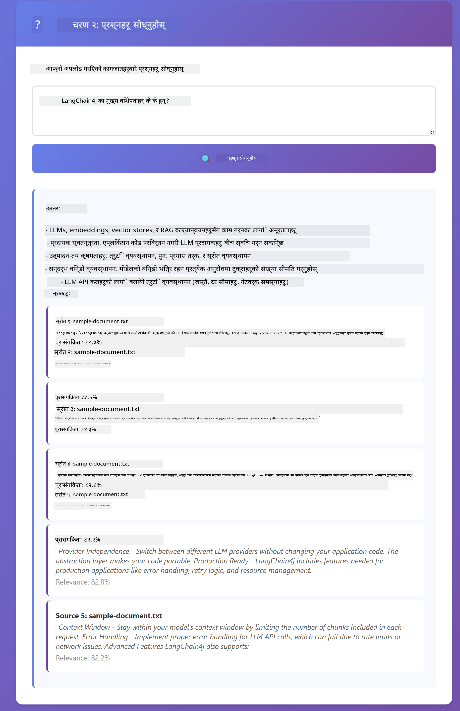

<!--
CO_OP_TRANSLATOR_METADATA:
{
  "original_hash": "81d087662fb3dd7b7124bce1a9c9ec86",
  "translation_date": "2026-01-05T22:46:07+00:00",
  "source_file": "03-rag/README.md",
  "language_code": "ne"
}
-->
# Module 03: RAG (पुन:प्राप्ति-संवर्धित उत्पादन)

## Table of Contents

- [What You'll Learn](../../../03-rag)
- [Prerequisites](../../../03-rag)
- [Understanding RAG](../../../03-rag)
- [How It Works](../../../03-rag)
  - [Document Processing](../../../03-rag)
  - [Creating Embeddings](../../../03-rag)
  - [Semantic Search](../../../03-rag)
  - [Answer Generation](../../../03-rag)
- [Run the Application](../../../03-rag)
- [Using the Application](../../../03-rag)
  - [Upload a Document](../../../03-rag)
  - [Ask Questions](../../../03-rag)
  - [Check Source References](../../../03-rag)
  - [Experiment with Questions](../../../03-rag)
- [Key Concepts](../../../03-rag)
  - [Chunking Strategy](../../../03-rag)
  - [Similarity Scores](../../../03-rag)
  - [In-Memory Storage](../../../03-rag)
  - [Context Window Management](../../../03-rag)
- [When RAG Matters](../../../03-rag)
- [Next Steps](../../../03-rag)

## What You'll Learn

अघिल्लो मोड्युलहरूमा, तपाईंले AI सँग संवाद गर्ने र तपाईंका प्रॉम्प्टहरू प्रभावकारी रूपमा संरचना गर्ने तरिका सिक्नुभयो। तर एउटा आधारभूत सीमितता छ: भाषा मोडेलहरूले केवल तिनीहरूले तालिम लिने क्रममा सिकेका कुराहरू मात्र जान्दछन्। तिनीहरूले तपाईंको कम्पनीको नीतिहरू, तपाईंको परियोजना दस्तावेजहरू, वा तिनीहरूले तालिम नलिएका कुनै जानकारीको प्रश्नहरूको जवाफ दिन सक्दैनन्।

RAG (पुन:प्राप्ति-संवर्धित उत्पादन) यो समस्या समाधान गर्दछ। मोडेललाई तपाईंको जानकारी सिकाउने प्रयास गर्नेको सट्टा (जुन महँगो र व्यवहारिक छैन), तपाईंले यसलाई तपाईंको दस्तावेजहरूबाट खोज गर्ने क्षमता दिनुहुन्छ। कोहीले प्रश्न सोध्दा, प्रणालीले सान्दर्भिक जानकारी फेला पार्छ र प्रॉम्प्टमा समावेश गर्छ। त्यपछि मोडेलले प्राप्त सन्दर्भमा आधारित भएर जवाफ दिन्छ।

RAG लाई मोडेललाई सन्दर्भ पुस्तकालय दिने जस्तै सोच्नुहोस्। जब तपाईं प्रश्न सोध्नुहुन्छ, प्रणाली:

1. **प्रयोगकर्ता क्वेरी** - तपाईं प्रश्न सोध्नुहुन्छ
2. **एम्बेडिङ** - तपाईंको प्रश्नलाई भेक्टरमा परिवर्तन गर्छ
3. **भेक्टर खोज** - समान दस्तावेज टुक्राहरू फेला पार्छ
4. **सन्दर्भ संयोजन** - सान्दर्भिक टुक्राहरू प्रॉम्प्टमा थप्छ
5. **प्रतिक्रिया** - LLM ले सन्दर्भको आधारमा जवाफ उत्पन्न गर्छ

यसले मोडेलको प्रतिक्रियालाई यसको तालिम ज्ञानमा निर्भर नहुँदै तपाईंको वास्तविक डेटा मा आधारित बनाउँछ।


*RAG कार्यप्रवाह - प्रयोगकर्ता क्वेरीबाट सेमेन्टिक खोज र सान्दर्भिक जवाफ उत्पादन सम्म*

## Prerequisites

- Module 01 पूरा भएको (Azure OpenAI स्रोतहरू तैनाथ गरिएको)
- मूल निर्देशिकामा `.env` फाइल Azure प्रमाणपत्रहरूसँग (Module 01 मा `azd up` द्वारा सिर्जना गरिएको)

> **Note:** यदि तपाईंले Module 01 पूरा गर्नुभएन भने, पहिले त्यहाँका तैनाथ गर्ने निर्देशनहरू पालना गर्नुहोस्।

## How It Works

### Document Processing

[DocumentService.java](../../../03-rag/src/main/java/com/example/langchain4j/rag/service/DocumentService.java)

जब तपाईं दस्तावेज अपलोड गर्नुहुन्छ, प्रणालीले त्यसलाई टुक्राहरूमा विभाजन गर्छ - साना भागहरू जुन मोडेलको सन्दर्भ विन्डोमा आरामसँग फिट हुन्छन्। यी टुक्राहरू अलिकति ओभरल्याप हुन्छन् ताकि सीमानाहरूमा सन्दर्भ हराउने जोखिम नहोस्।

```java
Document document = FileSystemDocumentLoader.loadDocument("sample-document.txt");

DocumentSplitter splitter = DocumentSplitters
    .recursive(300, 30, new OpenAiTokenizer());

List<TextSegment> segments = splitter.split(document);
```

> **🤖 Try with [GitHub Copilot](https://github.com/features/copilot) Chat:** Open [`DocumentService.java`](../../../03-rag/src/main/java/com/example/langchain4j/rag/service/DocumentService.java) र सोध्नुहोस्:
> - "LangChain4j ले कसरी दस्तावेजहरू टुक्रामा विभाजित गर्छ र ओभरल्याप किन महत्वपूर्ण छ?"
> - "विभिन्न दस्तावेज प्रकारहरूका लागि उत्तम टुक्रा आकार कति हुन्छ र किन?"
> - "मलाई कसरी बहुभाषिक वा विशेष ढाँचाका दस्तावेजहरू ह्यान्डल गर्ने?"

### Creating Embeddings

[LangChainRagConfig.java](../../../03-rag/src/main/java/com/example/langchain4j/rag/config/LangChainRagConfig.java)

हरेक टुक्रालाई संख्या प्रतिनिधित्वमा रूपान्तरण गरिन्छ जसलाई एम्बेडिङ भनिन्छ - आधारभूत रूपमा एउटा गणितीय फिङ्गरप्रिन्ट जसले पाठको अर्थलाई समेट्छ। समान पाठले समान एम्बेडिङ उत्पादन गर्छ।

```java
@Bean
public EmbeddingModel embeddingModel() {
    return OpenAiOfficialEmbeddingModel.builder()
        .baseUrl(azureOpenAiEndpoint)
        .apiKey(azureOpenAiKey)
        .modelName(azureEmbeddingDeploymentName)
        .build();
}

EmbeddingStore<TextSegment> embeddingStore = 
    new InMemoryEmbeddingStore<>();
```


*दस्तावेजहरू एम्बेडिङ स्पेसमा भेक्टरको रूपमा प्रतिनिधित्व गरिन्छ - समान सामग्री समूहमा जम्मा हुन्छ*

### Semantic Search

[RagService.java](../../../03-rag/src/main/java/com/example/langchain4j/rag/service/RagService.java)

जब तपाईं प्रश्न सोध्नुहुन्छ, तपाईंको प्रश्न पनि एम्बेडिङमा परिणत हुन्छ। प्रणालीले तपाईंको प्रश्नको एम्बेडिङलाई सबै दस्तावेज टुक्राहरूको एम्बेडिङसँग तुलना गर्छ। यसले सबैभन्दा समान अर्थ भएका टुक्राहरू फेला पार्छ - केवल कुञ्जीशब्द मेल मात्रै होइन, वास्तविक सेमेन्टिक समानता।

```java
Embedding queryEmbedding = embeddingModel.embed(question).content();

List<EmbeddingMatch<TextSegment>> matches = 
    embeddingStore.findRelevant(queryEmbedding, 5, 0.7);

for (EmbeddingMatch<TextSegment> match : matches) {
    String relevantText = match.embedded().text();
    double score = match.score();
}
```

> **🤖 Try with [GitHub Copilot](https://github.com/features/copilot) Chat:** Open [`RagService.java`](../../../03-rag/src/main/java/com/example/langchain4j/rag/service/RagService.java) र सोध्नुहोस्:
> - "एम्बेडिङसँग समानता खोज कसरी काम गर्छ र स्कोर कसले निर्धारण गर्छ?"
> - "मैले कुन समानता थ्रेसहोल्ड प्रयोग गर्ने र यसको परिणामहरूमा कस्तो प्रभाव पर्छ?"
> - "जब कुनै सान्दर्भिक दस्तावेजहरू फेला पर्दैन भने के गर्ने?"

### Answer Generation

[RagService.java](../../../03-rag/src/main/java/com/example/langchain4j/rag/service/RagService.java)

सबैभन्दा सान्दर्भिक टुक्राहरू मोडेलको प्रॉम्प्टमा समावेश गरिन्छ। मोडेलले ती विशिष्ट टुक्राहरू पढ्छ र उक्त जानकारीको आधारमा तपाईंको प्रश्नको जवाफ दिन्छ। यसले हल्युसिनेशन रोक्छ - मोडेलले मात्र देखिएको कुराबाट मात्र जवाफ दिन सक्छ।

## Run the Application

**डिप्लोयमेन्ट जाँच गर्नुहोस्:**

मूल निर्देशिकामा `.env` फाइल Azure प्रमाणपत्रहरूसँग छ भनेर सुनिश्चित गर्नुहोस् (Module 01 मा सिर्जना गरिएको):
```bash
cat ../.env  # AZURE_OPENAI_ENDPOINT, API_KEY, DEPLOYMENT देखाउनु पर्छ
```

**एप्लिकेसन सुरु गर्नुहोस्:**

> **Note:** यदि तपाईंले Module 01 बाट सबै एप्लिकेसनहरू `./start-all.sh` प्रयोग गरेर पहिले नै सुरु गर्नुभएको छ भने, यो मोड्युल पोर्ट 8081 मा पहिले नै चलिरहेको छ। तपाईं तलका सुरु कमाण्डहरू छोडेर सिधै http://localhost:8081 मा जान सक्नुहुन्छ।

**विकल्प 1: Spring Boot ड्यासबोर्ड प्रयोग गर्दै (VS Code प्रयोगकर्ताहरूका लागि सिफारिस गरिन्छ)**

डेभ कन्टेनरमा Spring Boot ड्यासबोर्ड एक्सटेन्सन सामेल छ, जसले सबै Spring Boot एप्लिकेसनहरूलाई दृश्यात्मक इन्टरफेसबाट व्यवस्थापन गर्न अनुमति दिन्छ। यसलाई VS Code को बायाँपट्टि रहेको Activity Bar मा फेला पार्न सकिन्छ (Spring Boot आइकन हेर्नुहोस्)।

Spring Boot ड्यासबोर्डबाट, तपाईं:
- कार्यक्षेत्रमा उपलब्ध सबै Spring Boot एप्लिकेसनहरू देख्न सक्नुहुन्छ
- एप्लिकेसनहरू एक पटक क्लिक गरेर सुरु/रोक्न सक्नुहुन्छ
- वास्तविक समयमा एप्लिकेसन लगहरू हेर्न सक्नुहुन्छ
- एप्लिकेसन स्थिति निरीक्षण गर्न सक्नुहुन्छ

"rag" को छेउमा प्ले बटन क्लिक गरेर यो मोड्युल सुरु गर्नुहोस्, वा सबै मोड्युलहरू एकैपटक सुरु गर्नुहोस्।


**विकल्प 2: शेल स्क्रिप्टहरू प्रयोग गर्दै**

सबै वेब एप्लिकेसनहरू सुरु गर्नुहोस् (मोड्युल 01-04):

**बाश:**
```bash
cd ..  # मूल निर्देशिका बाट
./start-all.sh
```

**पावरशेल:**
```powershell
cd ..  # मूल डाइरेक्टरीबाट
.\start-all.ps1
```

वा केवल यो मोड्युल मात्र सुरु गर्नुहोस्:

**बाश:**
```bash
cd 03-rag
./start.sh
```

**पावरशेल:**
```powershell
cd 03-rag
.\start.ps1
```

दुवै स्क्रिप्टले मूल `.env` फाइलबाट वातावरणीय चरहरू स्वचालित रूपमा लोड गर्छन् र JAR फाइलहरू नहुँदा निर्माण पनि गर्छन्।

> **Note:** यदि तपाईंले सबै मोड्युलहरू म्यानुअली निर्माण गर्न रुचाउनुहुन्छ भने सुरु गर्नु अघि:
>
> **बाश:**
> ```bash
> cd ..  # Go to root directory
> mvn clean package -DskipTests
> ```
>
> **पावरशेल:**
> ```powershell
> cd ..  # Go to root directory
> mvn clean package -DskipTests
> ```

तपाईंको ब्राउजरमा http://localhost:8081 खोल्नुहोस्।

**रोक्न:**

**बाश:**
```bash
./stop.sh  # यो मोड्युल मात्र
# वा
cd .. && ./stop-all.sh  # सबै मोड्युलहरू
```

**पावरशेल:**
```powershell
.\stop.ps1  # यो मोड्युल मात्र
# वा
cd ..; .\stop-all.ps1  # सबै मोड्युलहरू
```

## Using the Application

एप्लिकेसनले दस्तावेज अपलोड र प्रश्न सोध्नको लागि वेब इन्टरफेस प्रदान गर्छ।

<a href="images/rag-homepage.png"></a>

*RAG एप्लिकेसन इन्टरफेस - दस्तावेजहरू अपलोड गर्नुहोस् र प्रश्नहरू सोध्नुहोस्*

### Upload a Document

दस्तावेज अपलोड गरेर सुरु गर्नुहोस् - परीक्षणका लागि TXT फाइलहरू उत्तम काम गर्छन्। यस निर्देशिकामा `sample-document.txt` उपलब्ध छ जसमा LangChain4j सुविधाहरू, RAG कार्यान्वयन, र उत्तम अभ्यासहरूको जानकारी छ - प्रणाली परीक्षणका लागि उत्कृष्ट।

प्रणालीले तपाईंको दस्तावेज प्रक्रमण गर्छ, टुक्रा बनाउँछ, र हरेक टुक्राको लागि एम्बेडिङ सिर्जना गर्छ। यो स्वचालित रूपमा अपलोड गर्दा हुन्छ।

### Ask Questions

अब दस्तावेजको सामग्री सम्बन्धी विशिष्ट प्रश्नहरू सोध्नुहोस्। स्पष्ट रूपमा दस्तावेजमा उल्लेखित तथ्यहरू प्रश्न गर्नुहोस्। प्रणाली सान्दर्भिक टुक्राहरू खोज्छ, ती प्रॉम्प्टमा समावेश गर्छ, र जवाफ उत्पन्न गर्छ।

### Check Source References

प्रत्येक जवाफसँग स्रोत सन्दर्भहरू र समानता स्कोरहरू समावेश हुन्छन्। यी स्कोरहरू (0 देखि 1 सम्म) देखाउँछन् कि प्रत्येक टुक्रा तपाईंको प्रश्नसँग कति सान्दर्भिक थियो। उच्च स्कोर राम्रो मेल जनाउँछ। यसले तपाईंलाई जवाफ स्रोतसँग मिलाएर जाँच गर्न अनुमति दिन्छ।

<a href="images/rag-query-results.png"></a>

*प्रश्न परिणाम जसले जवाफसँग स्रोत सन्दर्भ र सान्दर्भिकता स्कोर देखाउँछ*

### Experiment with Questions

विभिन्न प्रकारका प्रश्नहरू प्रयास गर्नुहोस्:
- विशिष्ट तथ्यहरू: "मुख्य विषय के हो?"
- तुलना: "X र Y बीच फरक के हो?"
- सारांश: "Z का मुख्य बुँदाहरू सारांश गर्नुहोस्"

प्रश्नले दस्तावेज सामग्रीसँग कत्तिको मेल खान्छ भन्ने आधारमा सान्दर्भिकता स्कोर कसरी परिवर्तन हुन्छ हेर्नुहोस्।

## Key Concepts

### Chunking Strategy

दस्तावेजहरू ३०० टोकन टुक्रामा विभाजन गरिन्छ र ३० टोकनको ओभरल्याप हुन्छ। यस सन्तुलनले प्रत्येक टुक्रामा पर्याप्त सन्दर्भ राख्न र प्रॉम्प्टमा धेरै टुक्रा समाहित गर्न सानो पार्न मद्दत गर्दछ।

### Similarity Scores

स्कोर 0 देखि 1 सम्म:
- 0.7-1.0: उच्च सान्दर्भिक, ठ्याक्कै मेल
- 0.5-0.7: सान्दर्भिक, राम्रो सन्दर्भ
- 0.5 भन्दा तल: निराकरण गरियो, धेरै फरक

प्रणालीले न्यूनतम थ्रेसहोल्ड भन्दा माथिको टुक्रा मात्र पुन:प्राप्त गर्छ ताकि गुणस्तर सुनिश्चित होस्।

### In-Memory Storage

यस मोड्युलमा सजिलोको लागि इन-मेमोरी भण्डारण प्रयोग गरिन्छ। एप्लिकेसन पुनः सुरु गर्दा अपलोड गरिएको दस्तावेजहरू हराउँछन्। उत्पादन प्रणालीहरूले Qdrant वा Azure AI Search जस्ता दीर्घकालीन भेक्टर डेटाबेस प्रयोग गर्छन्।

### Context Window Management

हरेक मोडेलसँग अधिकतम सन्दर्भ विन्डो हुन्छ। ठूलो दस्तावेजका सबै टुक्रा समावेश गर्न सकिँदैन। प्रणालीले सबैभन्दा सान्दर्भिक शीर्ष N टुक्रा (पूर्वनिर्धारित ५) पुन: प्राप्त गर्छ ताकि सीमा भित्र रहँदै पर्याप्त सन्दर्भ प्रदान गर्न सकियोस।

## When RAG Matters

**RAG प्रयोग गर्नुहोस् जब:**
- स्वामित्वमा रहेका दस्तावेजहरू सम्बन्धी प्रश्नहरूको उत्तर दिनु आवश्यक छ
- सूचना बारम्बार परिवर्तन हुन्छ (नीतिहरू, मूल्यहरू, विनिर्देशहरू)
- शुद्धताका लागि स्रोत उद्धरण चाहिन्छ
- सामग्री एकै प्रॉम्प्टमा राख्न धेरै ठूलो छ
- तपाईंलाई प्रमाणित र आधारभूत प्रतिक्रियाहरू चाहिन्छ

**RAG प्रयोग नगर्नुहोस् जब:**
- प्रश्नहरू सामान्य ज्ञानको लागि हो जुन मोडेलले पहिले देखि थाहा छ
- वास्तविक-समय डेटा आवश्यक छ (RAG अपलोड गरिएको दस्तावेजहरूमाथि मात्र काम गर्छ)
- सामग्री सानो छ र सिधै प्रॉम्प्टमा राख्न सकिन्छ

## Next Steps

**अर्को मोड्युल:** [04-tools - उपकरणमार्फत AI एजेन्टहरू](../04-tools/README.md)

---

**Navigation:** [← पहिले: Module 02 - प्रॉम्प्ट इन्जिनियरिङ](../02-prompt-engineering/README.md) | [फेरि मुख्यमा](../README.md) | [पछि: Module 04 - उपकरणहरू →](../04-tools/README.md)

---

<!-- CO-OP TRANSLATOR DISCLAIMER START -->
**अस्वीकरण**:  
यो दस्तावेज AI अनुवाद सेवा [Co-op Translator](https://github.com/Azure/co-op-translator) प्रयोग गरी अनुवाद गरिएको हो। हामी शुद्धताको लागि प्रयासरत भए तापनि, कृपया ध्यान दिनुहोस् कि स्वचालित अनुवादमा त्रुटि वा अशुद्धता हुन सक्दछ। मूल दस्तावेजलाई यसको मूल भाषामा आधिकारिक स्रोतको रूपमा मानिनु पर्छ। महत्वपूर्ण जानकारीका लागि व्यावसायिक मानवीय अनुवाद सिफारिस गरिन्छ। यस अनुवादको प्रयोगबाट उत्पन्न कुनै पनि गलत बुझाई वा व्याख्याको लागि हामी जिम्मेवार छैनौं।
<!-- CO-OP TRANSLATOR DISCLAIMER END -->