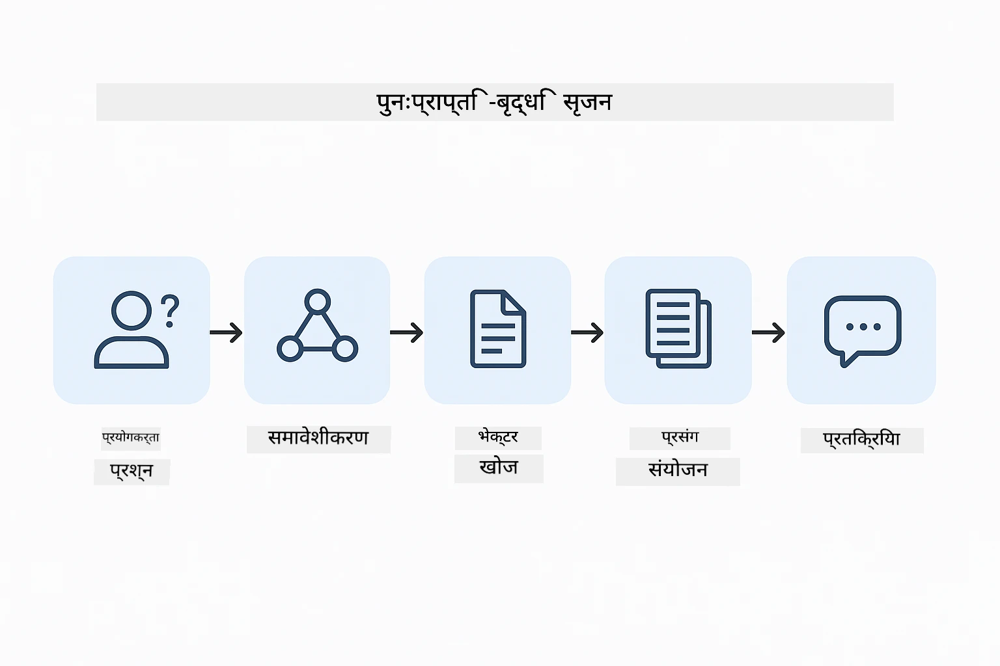
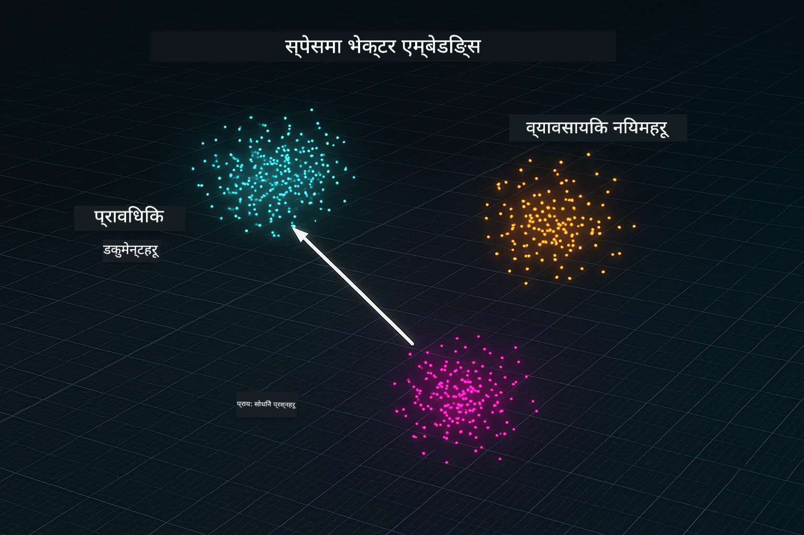
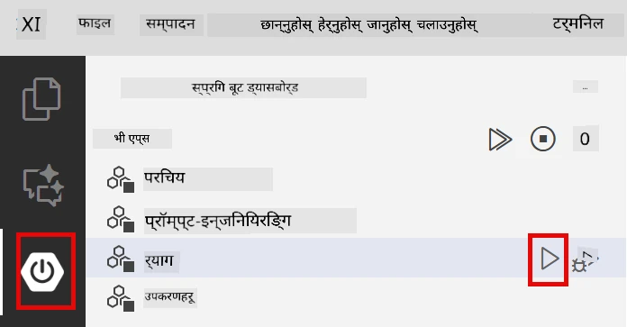
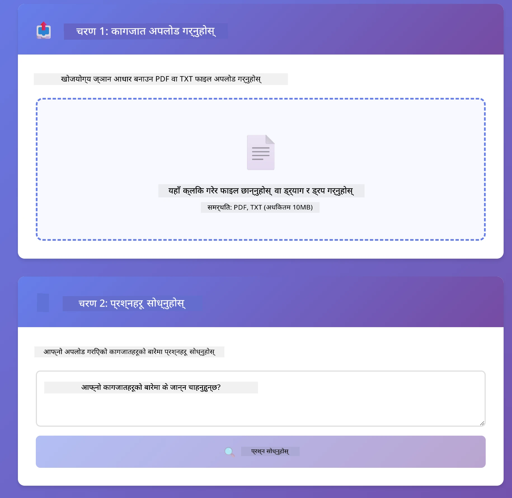
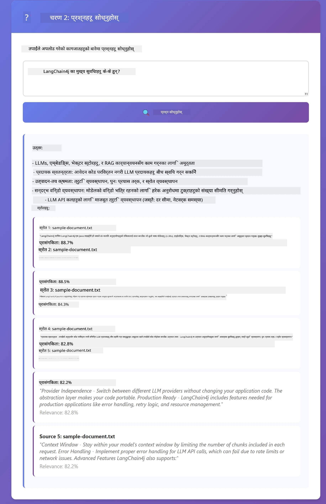

# Module 03: RAG (Retrieval-Augmented Generation)

## Table of Contents

- [Video Walkthrough](#video-walkthrough)
- [What You'll Learn](#what-youll-learn)
- [Prerequisites](#prerequisites)
- [Understanding RAG](#understanding-rag)
  - [Which RAG Approach Does This Tutorial Use?](#which-rag-approach-does-this-tutorial-use)
- [How It Works](#how-it-works)
  - [Document Processing](#document-processing)
  - [Creating Embeddings](#creating-embeddings)
  - [Semantic Search](#semantic-search)
  - [Answer Generation](#उत्तर-सिर्जना)
- [Run the Application](#अनुप्रयोग-चलाउनुहोस्)
- [Using the Application](#अनुप्रयोग-प्रयोग-गर्दै)
  - [Upload a Document](#कागजात-अपलोड-गर्नुहोस्)
  - [Ask Questions](#प्रश्न-सोध्नुहोस्)
  - [Check Source References](#स्रोत-संदर्भहरू-जाँच्नुहोस्)
  - [Experiment with Questions](#प्रश्नहरूसँग-प्रयोग-गरेर-परीक्षण-गर्नुहोस्)
- [Key Concepts](#प्रमुख-अवधारणाहरू)
  - [Chunking Strategy](#खण्ड-विभाजन-रणनीति)
  - [Similarity Scores](#समानता-स्कोरहरू)
  - [In-Memory Storage](#इन-मेमोरी-स्टोरेज)
  - [Context Window Management](#सन्दर्भ-विन्डो-व्यवस्थापन)
- [When RAG Matters](#rag-कहिले-महत्वपूर्ण-हुन्छ)
- [Next Steps](#आगामी-चरणहरू)

## Video Walkthrough

यस मोड्युलसँग कसरी सुरु गर्ने भनेर व्याख्या गर्ने यो प्रत्यक्ष सत्र हेर्नुहोस्:

<a href="https://www.youtube.com/watch?v=_olq75ZH_eY"></a>

## What You'll Learn

अघिल्लो मोड्युलहरूमा, तपाईले AI सँग संवाद कसरी गर्ने र प्रभावकारी रूपमा तपाइँका प्रॉम्प्टहरू संरचना गर्ने तरिका सिक्नुभयो। तर एउटा मौलिक सीमितता छ: भाषा मोडेलहरूले केवल तिनीहरूले प्रशिक्षणका समयमा सिकेका कुराहरू मात्र जान्दछन्। तिनीहरूले तपाइँको कम्पनीको नीतिहरू, तपाइँको परियोजना कागजातहरू, वा कुनै पनि जानकारी जुन तिनीहरूले प्रशिक्षण पाएका थिएनन्, त्यस बारे प्रश्नहरूको उत्तर दिन सक्दैनन्।

RAG (Retrieval-Augmented Generation) ले यो समस्या समाधान गर्छ। मोडेललाई तपाइँको जानकारी सिकाउने प्रयास गर्ने सट्टा (जुन महँगो र अप्रयोज्य छ), तपाईले यसलाई तपाइँका कागजातहरूमा खोजी गर्ने क्षमता दिनुहुन्छ। कसैले प्रश्न सोध्दा, सिस्टमले सान्दर्भिक जानकारी पत्ता लगाउँछ र प्रॉम्प्टमा समावेश गर्छ। त्यसपछि मोडेलले त्यो प्राप्त सन्दर्भको आधारमा उत्तर दिन्छ।

RAG लाई मोडेललाई एउटा सन्दर्भ पुस्तकालय दिने कामको रूपमा सोच्नुहोस्। जब तपाईले प्रश्न सोध्नुहुन्छ, सिस्टमले:

1. **प्रयोगकर्ता सोधपुछ** - तपाईले प्रश्न सोध्नुहुन्छ
2. **एम्बेडिङ** - तपाईको प्रश्नलाई भेक्टरमा परिणत गर्दछ
3. **भेक्टर खोज** - समान कागजात टुक्राहरू पत्ता लगाउँछ
4. **सन्दर्भ विन्यास** - सम्बन्धित टुक्राहरू प्रॉम्प्टमा थप्दछ
5. **प्रतिक्रिया** - LLM ले सन्दर्भमा आधारित उत्तर उत्पन्न गर्दछ

यसले मोडेलको प्रतिक्रियाहरूलाई यसको प्रशिक्षण ज्ञानमा निर्भर नगरी तपाइँको वास्तविक डाटामा आधारित बनाउँछ।

## Prerequisites

- पूरा गरेको [Module 01 - परिचय](../01-introduction/README.md) (Azure OpenAI स्रोतहरू परिनियोजित, जसमा `text-embedding-3-small` एम्बेडिङ मोडेल समावेश छ)
- रूट डाइरेक्टरीमा `.env` फाइल Azure प्रमाणपत्रहरूसहित (Module 01 मा `azd up` द्वारा सिर्जित)

> **सूचना:** यदि तपाइँले Module 01 पूरा गर्नुभएन भने, पहिले त्यहाँको परिनियोजन निर्देशहरू पालना गर्नुहोस्। `azd up` कमाण्डले GPT च्याट मोडेल र यस मोड्युलद्वारा प्रयोग गरिएको एम्बेडिङ मोडेल दुवै परिनियोजित गर्दछ।

## Understanding RAG

तलको चित्रले मूल अवधारणा देखाउँछ: मोडेलको प्रशिक्षण डाटा मात्रमा निर्भर नगरी, RAG ले प्रत्येक उत्तर उत्पन्न गर्ने अघि यसको सल्लाहका लागि तपाईका कागजातहरूको सन्दर्भ पुस्तकालय दिन्छ।


*यो चित्रले मानक LLM (जो प्रशिक्षण डाटाबाट अनुमान लगाउँछ) र RAG-संवर्धित LLM (जो पहिलो पटक तपाईंका कागजातहरू सल्लाह गर्छ) बीचको फरक देखाउँछ।*

यहाँ टुक्राहरू अन्त्यदेखि अन्त्यसम्म कसरी जडान हुन्छन् भन्ने वर्णन छ। प्रयोगकर्ताको प्रश्न चार चरणहरूमा बग्छ — एम्बेडिङ, भेक्टर खोज, सन्दर्भ विन्यास, र उत्तर उत्पन्न — जसले क्रमशः अघिल्लो चरणमा आधारित हुन्छ:



*यो चित्रले अन्त्यदेखि अन्त्य RAG पाइपलाइन देखाउँछ — प्रयोगकर्ता सोधपुछ एम्बेडिङ, भेक्टर खोज, सन्दर्भ विन्यास, र उत्तर उत्पन्न हुँदै जान्छ।*

यस मोड्युलको बाँकी भागले प्रत्येक चरणलाई विस्तृत रूपमा हिड्छ, जसमा तपाइँले चलाउन र परिमार्जन गर्न सक्ने कोडहरू हुन्छन्।

### Which RAG Approach Does This Tutorial Use?

LangChain4j ले RAG लागू गर्न तीन तरिकाहरू प्रस्ताव गर्छ, प्रत्येक फरक स्तरको अमूर्तता संग। तलको चित्रले ती तीनलाई साइड-बाइ-साइड तुलना गर्दछ:


*यो चित्रले तीन LangChain4j RAG पहुँचहरू — Easy, Native, र Advanced — को तुलना गर्छ, तिनीहरूको प्रमुख कम्पोनेन्टहरू र कहिले प्रयोग गर्ने भनेर देखाउँछ।*

| Approach | के गर्छ | व्यापार-आफ |
|---|---|---|
| **Easy RAG** | सबै कुरा स्वतः `AiServices` र `ContentRetriever` मार्फत जडान गर्दछ। तपाईंले एउटा इन्टरफेस एनोटेट गर्नुहुन्छ, रिट्रिभर संलग्न गर्नुहुन्छ, र LangChain4j ले एम्बेडिङ, खोजी, र प्रॉम्प्ट विन्यास पछाडि ह्याण्डल गर्दछ। | न्यूनतम कोड, तर प्रत्येक चरण के भइरहेको छ देखिन्न। |
| **Native RAG** | तपाइँ आफैं एम्बेडिङ मोडेल कल गर्नुहुन्छ, स्टोर खोज्नुहुन्छ, प्रॉम्प्ट बनाउनुहुन्छ, र उत्तर उत्पन्न गर्नुहुन्छ — एउटा स्पष्ट चरणमा एक पटक। | बढी कोड, तर प्रत्येक चरण देखिन सक्ने र परिमार्जनयोग्य। |
| **Advanced RAG** | `RetrievalAugmentor` फ्रेमवर्क प्रयोग गरेर प्लगयोग्य क्वेरी ट्रान्सफर्मरहरू, राउटरहरू, रि-र्याङ्करहरू, र कन्टेन्ट इन्जेक्टरहरू उत्पादन-ग्रेड पाइपलाइनहरूको लागि। | अधिकतम लचकता, तर धेरै जटिलता। |

**यस ट्यूटोरियलले Native 접근 प्रयोग गर्दछ।** RAG पाइपलाइनको प्रत्येक चरण — प्रश्नलाई एम्बेडिङ, भेक्टर स्टोर खोज, सन्दर्भ विन्यास, र उत्तर उत्पन्न — स्पष्ट रूपमा [`RagService.java`](../../../03-rag/src/main/java/com/example/langchain4j/rag/service/RagService.java) मा लेखिएको छ। यो जानाजानी गरिएको छ: सिकाइ स्रोतका रूपमा, प्रत्येक चरण देख्न र बुझ्न महत्वपूर्ण छ, कोडलाई कम गर्ने भन्दा। जब तपाईंलाई टुक्राहरू कसरी मेल खान्छ थाहा हुन्छ, तपाईं छिटो प्रोटोटाइपका लागि Easy RAG वा उत्पादन प्रणालीहरूको लागि Advanced RAG मा जान सक्नुहुन्छ।

> **💡 Easy RAG बारे जिज्ञासु?** LangChain4j ले एउटा *Easy RAG* पहुँच पनि प्रस्ताव गर्छ जहाँ `AiServices` र `ContentRetriever` एम्बेडिङ, खोजी, र प्रॉम्प्ट विन्यास स्वचालित रूपमा ह्याण्डल गर्छन्। यो मोड्युलले बढी स्पष्ट मार्ग लिन्छ — त्यो पाइपलाइन खोल्छ जहाँ तपाईं प्रत्येक चरण आफैं देख्न र नियन्त्रण गर्न सक्नुहुन्छ।

तल दिइएको चित्रले Easy RAG पाइपलाइन देखाउँछ। ध्यान दिनुहोस् कसरी `AiServices` र `EmbeddingStoreContentRetriever` सबै जटिलता लुकाउँछन्—तपाईँ कागजात लोड गर्नुहुन्छ, रिट्रिभर संलग्न गर्नुहुन्छ, र उत्तर प्राप्त गर्नुहुन्छ। यस मोड्युलको Native दृष्टिकोणले ती सबै लुकाएका चरणहरू फोड्छ:


*यो चित्रले Easy RAG पाइपलाइन देखाउँछ। यसलाई यस मोड्युलमा प्रयोग गरिएको Native दृष्टिकोणसँग तुलना गर्नुहोस्: Easy RAG ले एम्बेडिङ, रिट्रिभल, र प्रॉम्प्ट विन्यासलाई `AiServices` र `ContentRetriever` पछाडि लुकाउँछ — तपाईंले कागजात लोड गर्नुहुन्छ, रिट्रिभर संलग्न गर्नुहुन्छ, र उत्तर पाउनुहुन्छ। यस मोड्युलको Native दृष्टिकोणले त्यो पाइपलाइन खोल्छ जहाँ तपाईं आफैं प्रत्येक चरण (एम्बेड, खोज, सन्दर्भ विन्यास, उत्पन्न) कल गर्नुहुन्छ, पूर्ण दृश्यता र नियन्त्रण प्राप्त गरिँदै।*

## How It Works

यस मोड्युलमा RAG पाइपलाइन चार चरणहरूमा विभाजित छ जुन प्रत्येक पटक प्रयोगकर्ताले प्रश्न सोध्दा क्रमिक रूपमा चल्छ। पहिले, अपलोड गरिएको कागजातलाई **पार्स र टुक्रा पारिन्छ** सजिलै व्यवस्थापन गर्न सकिने भागहरूमा। ती टुक्राहरूलाई त्यसपछि **भेक्टर एम्बेडिङहरू** मा परिणत गरी राखिन्छ ताकि गणितीय रूपमा तुलना गर्न सकिन्छ। जब एउटा सोधपुछ आउँछ, सिस्टमले सबैभन्दा सान्दर्भिक टुक्राहरू फेला पार्न **सामान्तरिक खोज** गर्छ, र अन्ततः तीलाई सन्दर्भका रूपमा LLM लाई पठाइन्छ **उत्तर उत्पन्न गर्न**। तलका अनुभागहरूले प्रत्येक चरणलाई वास्तविक कोड र चित्रहरूसँग हिड्छन्। पहिलो चरण हेरौं।

### Document Processing

[DocumentService.java](../../../03-rag/src/main/java/com/example/langchain4j/rag/service/DocumentService.java)

जब तपाईं कागजात अपलोड गर्नुहुन्छ, सिस्टमले यसलाई पार्स गर्छ (PDF वा सामान्य पाठ), फाइलनाम जस्ता मेटाडाटा जोड्छ, र त्यसपछि टुक्रामा तोड्छ — स-साना भागहरू जुन मोडेलको सन्दर्भ विन्डोमा सहजै फिट हुन्छन्। ती टुक्राहरू थोरै ओभरलैप हुन्छन् ताकि सन्दर्भ सीमाहरूमा सन्दर्भ नखोउन।

```java
// अपलोड गरिएको फाइल पार्स गर्नुहोस् र यसलाई LangChain4j डक्युमेन्टमा समेट्नुहोस्
Document document = Document.from(content, metadata);

// ३० टोकन ओभरलैप सहित ३००-टोकन खण्डहरूमा विभाजन गर्नुहोस्
DocumentSplitter splitter = DocumentSplitters
    .recursive(300, 30);

List<TextSegment> segments = splitter.split(document);
```

तलको चित्रले यसलाई दृश्यात्मक रूपमा देखाउँछ। ध्यान दिनुहोस् कसरी प्रत्येक टुक्राले आफ्नो छिमेकीहरूसँग केही टोकन साझा गर्छ — ३० टोकन ओभरलैपले कुनै महत्वपूर्ण सन्दर्भ बीचमा नपरोस् सुनिश्चित गर्छ:


*यो चित्रले कागजातलाई ३००-टोकन टुक्राहरूमा ३०-टोकन ओभरलैपसहित कसरी टुक्रा पारिन्छ भनेर देखाउँछ, टुक्राको सीमामा सन्दर्भ सुरक्षित गर्दै।*

> **🤖 [GitHub Copilot](https://github.com/features/copilot) च्याटसँग प्रयास गर्नुहोस्:** [`DocumentService.java`](../../../03-rag/src/main/java/com/example/langchain4j/rag/service/DocumentService.java) खोल्नुहोस् र सोध्नुहोस्:
> - "LangChain4j कागजातहरूलाई टुक्रामा कसरी विभाजन गर्छ र किन ओभरलैप महत्वपूर्ण छ?"
> - "विभिन्न कागजात प्रकारका लागि उत्तम टुक्रा आकार के हो र किन?"
> - "मैले बहुभाषी कागजातहरू वा विशेष स्वरूपण भएका कागजातहरू कसरी व्यवस्थापन गर्ने?"

### Creating Embeddings

[LangChainRagConfig.java](../../../03-rag/src/main/java/com/example/langchain4j/rag/config/LangChainRagConfig.java)

प्रत्येक टुक्रालाई संख्यात्मक प्रतिनिधित्वमा परिणत गरिन्छ जसलाई एम्बेडिङ भनिन्छ — आधारभूत रूपमा अर्थ-देखि-संख्यामा रूपान्तरणकर्ता। एम्बेडिङ मोडेल "बुद्धिमान" च्याट मोडेल जस्तो होइन; यसले निर्देशन पालन गर्न, तर्क गर्न, वा प्रश्नहरूको उत्तर दिन सक्दैन। यसले केवल पाठलाई एउटा गणितीय स्थानमा नक्शांकन गर्छ जहाँ समान अर्थहरू नजिकै हुन्छन् — "कार" नजिक "अटोमोबाइल," "रिफन्ड नीति" नजिक "पैसा फिर्ता।" च्याट मोडेललाई एक व्यक्तिको रूपमा सोच्नुस् जससँग तपाईं कुरा गर्न सक्नुहुन्छ; एम्बेडिङ मोडेल भने एक अत्यन्त राम्रो फाइलिङ प्रणाली हो।

तलको चित्रले यस अवधारणालाई दृश्यात्मक रूपमा देखाउँछ — पाठ भित्र जान्छ, संख्यात्मक भेक्टरहरू बाहिर आउँछन्, र समानार्थक अर्थहरू नजिकै हुने भेक्टरहरू उत्पादन गर्छ:


*यो चित्रले कसरी एम्बेडिङ मोडेलले पाठलाई संख्यात्मक भेक्टरहरूमा परिणत गर्छ भनेर देखाउँछ, समान अर्थहरू - जस्तै "कार" र "अटोमोबाइल" - लाई भेक्टर स्पेसमा नजिक राख्दै।*

```java
@Bean
public EmbeddingModel embeddingModel() {
    return OpenAiOfficialEmbeddingModel.builder()
        .baseUrl(azureOpenAiEndpoint)
        .apiKey(azureOpenAiKey)
        .modelName(azureEmbeddingDeploymentName)
        .build();
}

EmbeddingStore<TextSegment> embeddingStore = 
    new InMemoryEmbeddingStore<>();
```

तलको कक्षा चित्रले RAG पाइपलाइनका दुई अलग-अलग प्रवाहहरू र तिनीहरूलाई कार्यान्वयन गर्ने LangChain4j कक्षाहरू देखाउँछ। **इंजेसन प्रवाह** (अपलोडको समयमा एक पटक चल्ने) कागजातलाई टुक्रा पार्छ, टुक्राहरूलाई एम्बेड गर्छ, र ती `.addAll()` मार्फत स्टोर गर्छ। **प्रश्न प्रवाह** (प्रत्येक पटक प्रयोगकर्ताले सोध्दा चल्ने) प्रश्नलाई एम्बेड गर्छ, `.search()` मार्फत स्टोर खोज्छ, र मेल खाने सन्दर्भलाई च्याट मोडेलमा पठाउँछ। दुबै प्रवाह साझा `EmbeddingStore<TextSegment>` इन्टरफेसमा भेटिन्छन्:


*यो चित्रले RAG पाइपलाइनका दुई प्रवाहहरू — इंजेसन र प्रश्न — र कसरी तिनीहरू साझा EmbeddingStore मार्फत जडान हुन्छन् देखाउँछ।*

एक पटक एम्बेडिङहरू स्टोर भएपछि, समान सामग्री स्वाभाविक रूपमा भेक्टर स्पेसमा समूहबद्ध हुन्छ। तलको दृश्यले देखाउँछ कसरी सम्बन्धित विषयहरूबारे कागजातहरू नजिकै पोइन्टहरूमा परिणत हुन्छन्, जसले सामान्तरिक खोज सम्भव बनाउँछ:



*यो दृश्यले देखाउँछ कसरी सम्बन्धित कागजातहरू ३D भेक्टर स्पेसमा समूहित हुन्छन्, जस्तै प्राविधिक कागजातहरू, व्यापार नियमहरू, र FAQs अलग-अलग समूहहरू बनाउँदै।*

जब प्रयोगकर्ताले खोजी गर्छ, प्रणालीले चार चरणहरू पालना गर्छ: कागजातहरूलाई एक पटक एम्बेड गर्छ, प्रत्येक खोजमा प्रश्न एम्बेड गर्छ, प्रश्न भेक्टरलाई सबै स्टोर गरिएका भेक्टरहरूसँग कोसाइन समानताले तुलना गर्छ, र शिर्ष-K सबैभन्दा उच्च स्कोर गरिएका टुक्राहरू फिर्ता गर्छ। तलको चित्रले प्रत्येक चरण र यसमा संलग्न LangChain4j कक्षाहरू देखाउँछ:


*यो चित्रले चार-चरणको एम्बेडिङ खोज प्रक्रिया देखाउँछ: कागजातहरू एम्बेड, प्रश्न एम्बेड, कोसाइन समानतासँग भेक्टर तुलना, र शीर्ष-K नतिजा फिर्ता।*

### Semantic Search

[RagService.java](../../../03-rag/src/main/java/com/example/langchain4j/rag/service/RagService.java)

जब तपाईले प्रश्न सोध्नुहुन्छ, तपाइँको प्रश्न पनि एम्बेडिङ बन्छ। प्रणालीले तपाइँको प्रश्नको एम्बेडिङलाई सबै कागजात टुक्राहरूको एम्बेडिङसँग तुलना गर्छ। यो सबैभन्दा समानार्थक अर्थ भएका टुक्राहरू फेला पार्छ - मात्र मिल्दोजुल्दो कुञ्जीशब्दहरू होइन, तर वास्तविक सामान्तरिक समानता।

```java
Embedding queryEmbedding = embeddingModel.embed(question).content();

EmbeddingSearchRequest searchRequest = EmbeddingSearchRequest.builder()
    .queryEmbedding(queryEmbedding)
    .maxResults(5)
    .minScore(0.5)
    .build();

EmbeddingSearchResult<TextSegment> searchResult = embeddingStore.search(searchRequest);
List<EmbeddingMatch<TextSegment>> matches = searchResult.matches();

for (EmbeddingMatch<TextSegment> match : matches) {
    String relevantText = match.embedded().text();
    double score = match.score();
}
```

तलको चित्रले सामान्तरिक खोजलाई परम्परागत कुञ्जीशब्द खोजसँग तुलना गर्छ। "vehicle" को लागि कुञ्जीशब्द खोजले "cars and trucks" बारेको टुक्रा छुटाउँछ, तर सामान्तरिक खोजले बुझ्छ कि तिनीहरूको अर्थ उस्तै हो र यसलाई उच्च स्कोरसहित फिर्ता ल्याउँछ:


*यो चित्रले कुञ्जीशब्द-आधारित खोज र सामान्तरिक खोजको तुलना गर्छ, देखाउँदै कसरी सामान्तरिक खोजले विचारसंग सम्बन्धित सामग्री फिर्ता ल्याउँछ जब कि सटीक कुञ्जीशब्दहरू फरक हुन्छन्।*

भित्री रूपमा, समानता मापन गर्न कोसाइन समानता प्रयोग गरिन्छ — मूलत: सोध्दैछ "यी दुई तीरहरू एउटै दिशामा छन् कि छैनन्?" दुई टुक्राहरूले पूर्ण रूपमा फरक शब्दहरू प्रयोग गर्न सक्छन्, तर यदि तिनीहरूको अर्थ उस्तै छ भने तिनीहरूको भेक्टरहरू एउटै दिशातर्फ संकेत गर्छन् र 1.0 नजिक स्कोर गर्छन्:


*यस आलेखले कसमाइन समानताका रूपमा एम्बेडिङ वेक्टरहरूबीचको कोण देखाउँछ — अधिक सुसंगत वेक्टरहरूले 1.0 नजिक स्कोर प्राप्त गर्छन्, जसले उच्च सिमान्टिक समानता जनाउँछ।*

> **🤖 [GitHub Copilot](https://github.com/features/copilot) Chat सँग प्रयास गर्नुहोस्:** खुला गर्नुहोस् [`RagService.java`](../../../03-rag/src/main/java/com/example/langchain4j/rag/service/RagService.java) र सोध्नुहोस्:
> - "एम्बेडिङहरूसँग समानता खोज कसरी काम गर्छ र स्कोर के द्वारा निर्धारण हुन्छ?"
> - "म कस्तो समानता थ्रेसहोल्ड प्रयोग गर्ने र यसले नतिजामा कसरी असर गर्छ?"
> - "जब कुनै सान्दर्भिक कागजातहरू फेला पर्दैनन् भने म कसरी व्यवहार गर्ने?"

### उत्तर सिर्जना

[RagService.java](../../../03-rag/src/main/java/com/example/langchain4j/rag/service/RagService.java)

सबैभन्दा सान्दर्भिक खण्डहरूलाई स्पष्ट निर्देशनहरू, प्राप्त सन्दर्भ, र प्रयोगकर्ताको प्रश्न समावेश गरिएको संरचित प्रॉम्प्टमा सङ्गठित गरिन्छ। मोडेलले ती विशेष खण्डहरू पढ्छ र सो जानकारीको आधारमा उत्तर दिन्छ — यसले केवल सामु जानकारिलाई मात्र प्रयोग गर्न सक्छ, जसले भ्रम टार्छ।

```java
String context = matches.stream()
    .map(match -> match.embedded().text())
    .collect(Collectors.joining("\n\n"));

String prompt = String.format("""
    Answer the question based on the following context.
    If the answer cannot be found in the context, say so.

    Context:
    %s

    Question: %s

    Answer:""", context, request.question());

String answer = chatModel.chat(prompt);
```

तलको चित्रले यस सङ्गठनलाई देखाउँछ — खोज चरणबाट शीर्ष स्कोर प्राप्त खण्डहरू प्रॉम्प्ट टेम्प्लेटमा थपिन्छन्, र `OpenAiOfficialChatModel` ले आधारभूत उत्तर उत्पन्न गर्छ:


*यस चित्रले देखाउँछ कि शीर्ष स्कोर प्राप्त खण्डहरू कसरी संरचित प्रॉम्प्टमा सङ्गठित गरिन्छन्, जसले मोडेललाई तपाईंको डाटाबाट आधारभूत उत्तर दिन सक्षम बनाउँछ।*

## अनुप्रयोग चलाउनुहोस्

**परिनियोजन जाँच गर्नुहोस्:**

मोड्युल ०१ मा सिर्जना गरिएको Azure प्रमाणपत्रहरू सहितको `.env` फाइल मूल डाइरेक्टरीमा रहेको सुनिश्चित गर्नुहोस्। यो मोड्युल डाइरेक्टरी (`03-rag/`) मा यो कमाण्ड चलाउनुहोस्:

**Bash:**
```bash
cat ../.env  # AZURE_OPENAI_ENDPOINT, API_KEY, DEPLOYMENT देखाउनुपर्छ
```

**PowerShell:**
```powershell
Get-Content ..\.env  # AZURE_OPENAI_ENDPOINT, API_KEY, DEPLOYMENT देखाउनुपर्छ
```

**अनुप्रयोग सुरू गर्नुहोस्:**

> **सूचना:** यदि तपाईंले पहिले नै सबै अनुप्रयोगहरू `./start-all.sh` प्रयोग गरेर मूल डाइरेक्टरीबाट सुरु गर्नुभएको छ भने (जसरी मोड्युल ०१ मा वर्णन गरिएको छ), यो मोड्युल पोर्ट 8081 मा पहिले नै चलिरहेको हुन्छ। तपाईंले तलका सुरु आदेशहरू स्किप गर्न सक्नुहुन्छ र सिधै http://localhost:8081 मा जान सक्नुहुन्छ।

**विकल्प १: Spring Boot ड्यासबोर्ड प्रयोग गर्दै (VS Code प्रयोगकर्ताहरूका लागि सिफारिस गरिएको)**

डिभ कन्टेनरमा Spring Boot ड्यासबोर्ड एक्सटेन्सन समावेश छ, जसले सबै Spring Boot अनुप्रयोगहरूलाई दृश्यात्मक इन्टरफेसबाट व्यवस्थापन गर्न सुविधा दिन्छ। तपाईं यसलाई VS Code को बायाँ तर्फ Activity Bar मा Spring Boot आइकनमा देख्न सक्नुहुन्छ।

Spring Boot ड्यासबोर्डबाट, तपाईंले:
- कार्यक्षेत्रमा उपलब्ध सबै Spring Boot अनुप्रयोगहरू देख्न सक्नुहुन्छ
- एक क्लिकमा अनुप्रयोगहरू सुरु/रोक्न सक्नुहुन्छ
- अनुप्रयोग लगहरू वास्तविक समयमा हेर्न सक्नुहुन्छ
- अनुप्रयोगको स्थिति अनुगमन गर्न सक्नुहुन्छ

"rag" को छेउमा प्ले बटन क्लिक गरेर यो मोड्युल सुरु गर्नुहोस्, वा सबै मोड्युलहरू एकैपटक सुरु गर्नुहोस्।



*यस स्क्रिनशटले VS Code मा Spring Boot ड्यासबोर्ड देखाउँछ, जहाँ तपाईं अनुप्रयोगहरू सुरु, रोक्न र अनुगमन गर्न सक्नुहुन्छ।*

**विकल्प २: शेल स्क्रिप्टहरू प्रयोग गर्दै**

सबै वेब अनुप्रयोगहरू (मोड्युल ०१-०४):

**Bash:**
```bash
cd ..  # रुट डाइरेक्टरीबाट
./start-all.sh
```

**PowerShell:**
```powershell
cd ..  # रुट निर्देशिकाबाट
.\start-all.ps1
```

वा केवल यो मोड्युल सुरु गर्नुहोस्:

**Bash:**
```bash
cd 03-rag
./start.sh
```

**PowerShell:**
```powershell
cd 03-rag
.\start.ps1
```

दुवै स्क्रिप्टहरूले मूल `.env` फाइलबाट वातावरण चरहरू स्वचालित रूपमा लोड गर्छन् र JAR फाइलहरू अवस्थित नभए निर्माण गर्नेछन्।

> **सूचना:** यदि तपाईंले सबै मोड्युलहरू म्यानुअली निर्माण गरेर सुरु गर्न चाहनुहुन्छ भने:
>
> **Bash:**
> ```bash
> cd ..  # Go to root directory
> mvn clean package -DskipTests
> ```
>
> **PowerShell:**
> ```powershell
> cd ..  # Go to root directory
> mvn clean package -DskipTests
> ```

तपाईंको ब्राउजरमा http://localhost:8081 खोल्नुहोस्।

**रोक्न:**

**Bash:**
```bash
./stop.sh  # यो मोड्युल मात्र
# वा
cd .. && ./stop-all.sh  # सबै मोड्युलहरू
```

**PowerShell:**
```powershell
.\stop.ps1  # यो मोड्युल मात्र
# वा
cd ..; .\stop-all.ps1  # सबै मोड्युलहरू
```

## अनुप्रयोग प्रयोग गर्दै

एउटा वेब इन्टरफेस कागजात अपलोड र प्रश्न सोध्नको लागि उपलब्ध छ।

<a href="images/rag-homepage.png"></a>

*यस स्क्रिनशटले RAG अनुप्रयोग इन्टरफेस देखाउँछ जहाँ तपाईंले कागजातहरू अपलोड गर्न र प्रश्न सोध्न सक्नुहुन्छ।*

### कागजात अपलोड गर्नुहोस्

कागजात अपलोड गरेर सुरु गर्नुहोस् - TXT फाइलहरू परीक्षणका लागि उत्तम छन्। यस डाइरेक्टरीमा एउटा `sample-document.txt` उपलब्ध छ जसमा LangChain4j सुविधाहरू, RAG कार्यान्वयन, र उत्कृष्ट अभ्यासहरूको जानकारी समावेश छ - प्रणाली परीक्षणका लागि उपयुक्त।

प्रणालीले तपाईंको कागजात प्रशोधन गर्छ, यसलाई खण्डहरूमा विभाजित गर्छ, र हरेक खण्डका लागि एम्बेडिङहरू सिर्जना गर्छ। यो स्वचालित रूपमा तपाईले अपलोड गर्दा हुन्छ।

### प्रश्न सोध्नुहोस्

अब कागजात सामग्रीबारे विशिष्ट प्रश्नहरू सोध्नुहोस्। त्यस्तो तथ्यात्मक प्रश्न प्रयास गर्नुहोस् जुन कागजातमा स्पष्ट रूपमा उल्लेख गरिएको हो। प्रणालीले सान्दर्भिक खण्डहरू खोज्छ, ती प्रॉम्प्टमा समावेश गर्छ, र उत्तर उत्पादन गर्छ।

### स्रोत संदर्भहरू जाँच्नुहोस्

प्रत्येक उत्तरसँग स्रोत संदर्भहरू समावेश हुन्छन् जसमा समानता स्कोरहरू हुन्छन्। यी स्कोरहरू (० देखि १ सम्म) देखाउँछन् कि प्रश्नसँग हरेक खण्ड कति सान्दर्भित थियो। उच्च स्कोरले राम्रो मेल जनाउँछ। यसले तपाईंलाई जवाफलाई स्रोत सामग्रीसँग प्रमाणित गर्न मद्दत गर्छ।

<a href="images/rag-query-results.png"></a>

*यस स्क्रिनशटले सोधपुछ परिणामहरू देखाउँछ जसमा उत्पादित उत्तर, स्रोत संदर्भहरू, र हरेक प्राप्त खण्डको सान्दर्भिकता स्कोरहरू समावेश छन्।*

### प्रश्नहरूसँग प्रयोग गरेर परीक्षण गर्नुहोस्

विभिन्न प्रकारका प्रश्नहरू प्रयास गर्नुहोस्:
- विशिष्ट तथ्यहरू: "मुख्य विषय के हो?"
- तुलना: "X र Y बीच के फरक छ?"
- सारांश: "Z का मुख्य बुँदाहरू सारांश गर्नुहोस्"

हेर्नुहोस् कसरी सान्दर्भिकता स्कोरहरूले परिवर्तन गर्छ जब तपाईंको प्रश्नले कागजात सामग्रीसँग कति राम्रो मेल खान्छ।

## प्रमुख अवधारणाहरू

### खण्ड विभाजन रणनीति

कागजातहरूलाई ३०० टोकनका खण्डहरूमा विभाजन गरिन्छ जुन ३० टोकनले ओभरलैप हुन्छ। यसले प्रत्येक खण्डमा पर्याप्त सन्दर्भ सुनिश्चित गर्छ जुन अर्थपूर्ण हुन्छ तर धेरै ठूलो नहुनुपर्दछ, ताकि एकै प्रॉम्प्टमा धेरै खण्डहरू समावेश गर्न सकियोस्।

### समानता स्कोरहरू

प्रत्येक प्राप्त खण्डसँग ० देखि १ सम्मको समानता स्कोर सामेल हुन्छ जसले प्रयोगकर्ताको प्रश्नसँग कत्तिको नजिक मेल खान्छ भन्ने संकेत गर्दछ। तलको चित्रले स्कोर दायरा र प्रणालीले तिनीहरूलाई परिणाम छनोटमा कसरी प्रयोग गर्छ देखाउँछ:


*यस चित्रले ० देखि १ सम्मको स्कोर दायराहरू देखाउँछ, जहाँ न्यूनतम थ्रेसहोल्ड ०.५ छ जसले असम्बन्धित खण्डहरू फिल्टर गर्छ।*

स्कोरहरू दायरा:
- ०.७-१.०: अत्यन्त सान्दर्भिक, बिल्कुल मेल
- ०.५-०.७: सान्दर्भिक, राम्रो सन्दर्भ
- ०.५ भन्दा तल: फिल्टर गरिएको, धेरै भिन्न

प्रणालीले गुणस्तर सुनिश्चित गर्न न्यूनतम थ्रेसहोल्ड माथिका खण्डहरू मात्र प्राप्त गर्छ।

एम्बेडिङहरू राम्रो काम गर्छन् जब अर्थ क्लस्टर स्पष्ट हुन्छ, तर यसमा केही कमजोरीहरू छन्। तलको चित्रले सामान्य असफलता मोडहरू देखाउँछ — धेरै ठूलो खण्डले अस्पष्ट वेक्टरहरू उत्पादन गर्छ, साना खण्डले सन्दर्भ अभाव हुन्छ, अस्पष्ट शब्दहरूले धेरै क्लस्टरहरू बताउँछन्, र बिल्कुल मेल हुने खोज (IDs, भाग नम्बरहरूसँग) एम्बेडिङहरूमा काम गर्दैन:


*यस चित्रले सामान्य एम्बेडिङ असफलता मोडहरू देखाउँछ: धेरै ठूलो खण्ड, धेरै सानो खण्ड, अस्पष्ट शब्दहरू जुन धेरै क्लस्टरहरूलाई संकेत गर्छ, र IDs जस्ता बिल्कुल मेल हुने खोज।*

### इन-मेमोरी स्टोरेज

यो मोड्युल सरलताका लागि इन-मेमोरी स्टोरेज प्रयोग गर्छ। जब तपाईं अनुप्रयोग पुनः सुरु गर्नुहुन्छ, तब अपलोड गरिएका कागजातहरू हराउँछन्। उत्पादन प्रणालीहरूले Qdrant वा Azure AI Search जस्ता स्थायी भेक्टर डेटाबेसहरू प्रयोग गर्छन्।

### सन्दर्भ विन्डो व्यवस्थापन

हरेक मोडेलसँग अधिकतम सन्दर्भ विन्डो हुन्छ। तपाईं ठूलो कागजातका सबै खण्डहरू समावेश गर्न सक्नुहुन्न। प्रणालीले शीर्ष N सबैभन्दा सान्दर्भिक खण्डहरू (पूर्वनिर्धारित ५) प्राप्त गर्छ ताकि सीमा भित्र रहँदै व्यावहारिक उत्तर प्रदान गर्न पर्याप्त सन्दर्भ दिन सकोस्।

## RAG कहिले महत्वपूर्ण हुन्छ

RAG सधैं सही विकल्प हुँदैन। तलको निर्णय मार्गनिर्देशले तपाईंलाई जब RAG ले मूल्य थप्छ र कहिले सिधै प्रॉम्प्टमा सामग्री समावेश गर्ने वा मोडेलको आन्तरिक ज्ञानमा निर्भर हुने सरल विधिहरू पर्याप्त हुन्छन् भन्ने निर्धारण गर्न मद्दत गर्छ:


*यस चित्रले देखाउँछ कब RAG ले मूल्य थप्छ र कब सरल विधिहरू पर्याप्त हुन्छन् भन्ने निर्णय मार्गनिर्देश।*

## आगामी चरणहरू

**अर्को मोड्युल:** [04-tools - AI Agents with Tools](../04-tools/README.md)

---

**नेभिगेसन:** [← अघिल्लो: Module 02 - Prompt Engineering](../02-prompt-engineering/README.md) | [मुख्यमा फर्किनुहोस्](../README.md) | [अर्को: Module 04 - Tools →](../04-tools/README.md)

---

<!-- CO-OP TRANSLATOR DISCLAIMER START -->
**अस्वीकरण**:
यो दस्तावेज़ AI अनुवाद सेवा [Co-op Translator](https://github.com/Azure/co-op-translator) प्रयोग गरेर अनुवाद गरिएको हो। हामी सही हुन प्रयास गर्छौं, तर कृपया जानकार हुनुस् कि स्वचालित अनुवादमा त्रुटिहरू वा अशुद्धताहरू हुन सक्छन्। मूल दस्तावेज़ यसको मूल भाषामा आधिकारिक स्रोत मानिनुपर्छ। महत्वपूर्ण जानकारीका लागि व्यावसायिक मानव अनुवाद सिफारिस गरिन्छ। यस अनुवादको प्रयोगबाट उत्पन्न कुनै पनि गलत बुझाइ वा त्रुटिको लागि हामी जिम्मेवार छैनौं।
<!-- CO-OP TRANSLATOR DISCLAIMER END -->