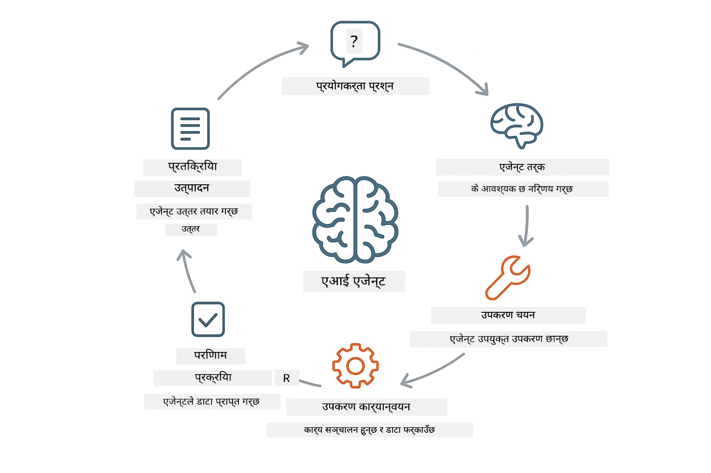
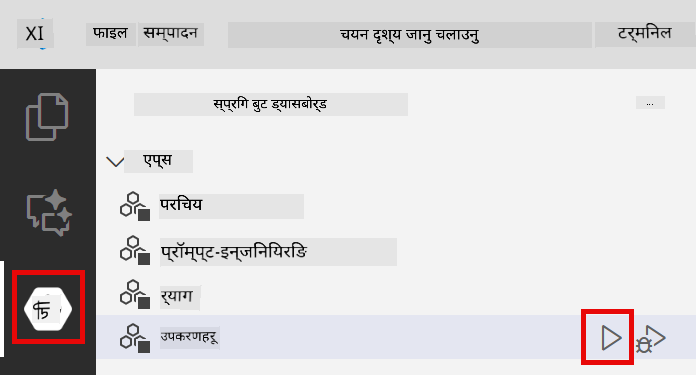
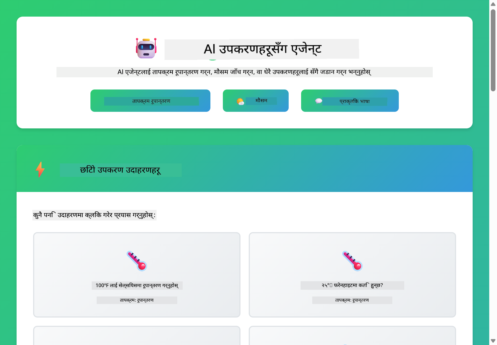

<!--
CO_OP_TRANSLATOR_METADATA:
{
  "original_hash": "aa23f106e7f53270924c9dd39c629004",
  "translation_date": "2025-12-13T18:43:25+00:00",
  "source_file": "04-tools/README.md",
  "language_code": "ne"
}
-->
# Module 04: उपकरणहरूसँग AI एजेन्टहरू

## सामग्री तालिका

- [तपाईंले के सिक्नुहुनेछ](../../../04-tools)
- [पूर्वआवश्यकताहरू](../../../04-tools)
- [उपकरणहरूसँग AI एजेन्टहरू बुझ्न](../../../04-tools)
- [उपकरण कल कसरी काम गर्छ](../../../04-tools)
  - [उपकरण परिभाषाहरू](../../../04-tools)
  - [निर्णय लिनु](../../../04-tools)
  - [कार्यान्वयन](../../../04-tools)
  - [प्रतिक्रिया उत्पादन](../../../04-tools)
- [उपकरण श्रृंखला](../../../04-tools)
- [एप्लिकेसन चलाउनुहोस्](../../../04-tools)
- [एप्लिकेसन प्रयोग गर्दै](../../../04-tools)
  - [सरल उपकरण प्रयोग प्रयास गर्नुहोस्](../../../04-tools)
  - [उपकरण श्रृंखला परीक्षण गर्नुहोस्](../../../04-tools)
  - [संवाद प्रवाह हेर्नुहोस्](../../../04-tools)
  - [तर्क अवलोकन गर्नुहोस्](../../../04-tools)
  - [विभिन्न अनुरोधहरूसँग प्रयोग गर्नुहोस्](../../../04-tools)
- [मुख्य अवधारणाहरू](../../../04-tools)
  - [ReAct ढाँचा (तर्क र कार्य)](../../../04-tools)
  - [उपकरण विवरणहरू महत्त्वपूर्ण छन्](../../../04-tools)
  - [सत्र व्यवस्थापन](../../../04-tools)
  - [त्रुटि व्यवस्थापन](../../../04-tools)
- [उपलब्ध उपकरणहरू](../../../04-tools)
- [कहिले उपकरण-आधारित एजेन्टहरू प्रयोग गर्ने](../../../04-tools)
- [अर्को कदमहरू](../../../04-tools)

## तपाईंले के सिक्नुहुनेछ

अहिलेसम्म, तपाईंले AI सँग संवाद कसरी गर्ने, प्रभावकारी रूपमा प्रॉम्प्टहरू संरचना गर्ने, र तपाईंका कागजातहरूमा प्रतिक्रियाहरू कसरी आधार गर्ने सिक्नुभएको छ। तर अझै एउटा मौलिक सीमा छ: भाषा मोडेलहरूले केवल पाठ मात्र उत्पादन गर्न सक्छन्। तिनीहरूले मौसम जाँच्न, गणना गर्न, डाटाबेस सोध्न, वा बाह्य प्रणालीहरूसँग अन्तरक्रिया गर्न सक्दैनन्।

उपकरणहरूले यो परिवर्तन गर्छन्। मोडेललाई कल गर्न सकिने कार्यहरू उपलब्ध गराएर, तपाईं यसलाई पाठ उत्पादन गर्ने यन्त्रबाट कार्यहरू लिन सक्ने एजेन्टमा रूपान्तरण गर्नुहुन्छ। मोडेलले कहिले उपकरण चाहिन्छ, कुन उपकरण प्रयोग गर्ने, र कुन प्यारामिटरहरू पास गर्ने निर्णय गर्छ। तपाईंको कोडले कार्यान्वयन गर्छ र परिणाम फर्काउँछ। मोडेलले त्यो परिणामलाई आफ्नो प्रतिक्रियामा समावेश गर्छ।

## पूर्वआवश्यकताहरू

- Module 01 पूरा गरिएको (Azure OpenAI स्रोतहरू तैनाथ गरिएको)
- रुट डाइरेक्टरीमा `.env` फाइल Azure प्रमाणपत्रहरूसँग (Module 01 मा `azd up` द्वारा सिर्जना गरिएको)

> **सूचना:** यदि तपाईंले Module 01 पूरा गर्नुभएको छैन भने, पहिले त्यहाँका तैनाथीकरण निर्देशनहरू पालना गर्नुहोस्।

## उपकरणहरूसँग AI एजेन्टहरू बुझ्न

उपकरणहरूसँग AI एजेन्टले तर्क र कार्य गर्ने ढाँचा (ReAct) अनुसरण गर्छ:

1. प्रयोगकर्ताले प्रश्न सोध्छ
2. एजेन्टले के जान्न आवश्यक छ भनेर तर्क गर्छ
3. एजेन्टले जवाफ दिन उपकरण चाहिन्छ कि छैन निर्णय गर्छ
4. यदि हो भने, एजेन्टले उपयुक्त उपकरणलाई सही प्यारामिटरहरूसँग कल गर्छ
5. उपकरणले कार्यान्वयन गर्छ र डाटा फर्काउँछ
6. एजेन्टले परिणाम समावेश गरी अन्तिम उत्तर दिन्छ



*ReAct ढाँचा - AI एजेन्टहरूले समस्याहरू समाधान गर्न तर्क र कार्य बीच कसरी बारी-बारीले काम गर्छन्*

यो स्वतः हुन्छ। तपाईंले उपकरणहरू र तिनीहरूको विवरणहरू परिभाषित गर्नुहुन्छ। मोडेलले कहिले र कसरी तिनीहरू प्रयोग गर्ने निर्णय गर्छ।

## उपकरण कल कसरी काम गर्छ

**उपकरण परिभाषाहरू** - [WeatherTool.java](../../../04-tools/src/main/java/com/example/langchain4j/agents/tools/WeatherTool.java) | [TemperatureTool.java](../../../04-tools/src/main/java/com/example/langchain4j/agents/tools/TemperatureTool.java)

तपाईंले स्पष्ट विवरण र प्यारामिटर विनिर्देशहरूसँग कार्यहरू परिभाषित गर्नुहुन्छ। मोडेलले यी विवरणहरू आफ्नो सिस्टम प्रॉम्प्टमा देख्छ र प्रत्येक उपकरणले के गर्छ बुझ्छ।

```java
@Component
public class WeatherTool {
    
    @Tool("Get the current weather for a location")
    public String getCurrentWeather(@P("Location name") String location) {
        // तपाईंको मौसम खोज्ने तर्क
        return "Weather in " + location + ": 22°C, cloudy";
    }
}

@AiService
public interface Assistant {
    String chat(@MemoryId String sessionId, @UserMessage String message);
}

// सहायक स्वचालित रूपमा Spring Boot द्वारा जडित छ:
// - ChatModel बीन
// - @Component कक्षाहरूबाट सबै @Tool विधिहरू
// - सत्र व्यवस्थापनको लागि ChatMemoryProvider
```

> **🤖 [GitHub Copilot](https://github.com/features/copilot) च्याटसँग प्रयास गर्नुहोस्:** [`WeatherTool.java`](../../../04-tools/src/main/java/com/example/langchain4j/agents/tools/WeatherTool.java) खोल्नुहोस् र सोध्नुहोस्:
> - "मक डेटा सट्टा वास्तविक मौसम API जस्तै OpenWeatherMap कसरी एकीकृत गर्ने?"
> - "एआईलाई सही रूपमा उपकरण प्रयोग गर्न मद्दत गर्ने राम्रो उपकरण विवरण के हो?"
> - "उपकरण कार्यान्वयनमा API त्रुटिहरू र दर सीमाहरू कसरी व्यवस्थापन गर्ने?"

**निर्णय लिनु**

जब प्रयोगकर्ताले "सिएटलमा मौसम कस्तो छ?" सोध्छ, मोडेलले मौसम उपकरण चाहिन्छ भनेर चिन्ह लगाउँछ। यसले स्थान प्यारामिटर "Seattle" सेट गरेर कार्य कल उत्पन्न गर्छ।

**कार्यान्वयन** - [AgentService.java](../../../04-tools/src/main/java/com/example/langchain4j/agents/service/AgentService.java)

Spring Boot ले सबै दर्ता गरिएका उपकरणहरूसँग घोषणात्मक `@AiService` इन्टरफेसलाई अटो-वायर गर्छ, र LangChain4j ले उपकरण कलहरू स्वतः कार्यान्वयन गर्छ।

> **🤖 [GitHub Copilot](https://github.com/features/copilot) च्याटसँग प्रयास गर्नुहोस्:** [`AgentService.java`](../../../04-tools/src/main/java/com/example/langchain4j/agents/service/AgentService.java) खोल्नुहोस् र सोध्नुहोस्:
> - "ReAct ढाँचा कसरी काम गर्छ र किन AI एजेन्टहरूका लागि प्रभावकारी छ?"
> - "एजेन्टले कुन उपकरण प्रयोग गर्ने र कुन क्रममा निर्णय कसरी गर्छ?"
> - "यदि उपकरण कार्यान्वयन असफल भयो भने के हुन्छ - त्रुटिहरू कसरी मजबुत रूपमा व्यवस्थापन गर्ने?"

**प्रतिक्रिया उत्पादन**

मोडेलले मौसम डाटा प्राप्त गर्छ र प्रयोगकर्ताका लागि प्राकृतिक भाषामा प्रतिक्रिया तयार गर्छ।

### घोषणात्मक AI सेवाहरू किन प्रयोग गर्ने?

यो मोड्युलले LangChain4j को Spring Boot एकीकरण प्रयोग गर्छ जसमा घोषणात्मक `@AiService` इन्टरफेसहरू छन्:

- **Spring Boot अटो-वायरिङ** - ChatModel र उपकरणहरू स्वतः इन्जेक्ट हुन्छन्
- **@MemoryId ढाँचा** - स्वतः सत्र-आधारित मेमोरी व्यवस्थापन
- **एकल उदाहरण** - सहायक एक पटक सिर्जना गरी पुन: प्रयोग गरिन्छ प्रदर्शन सुधारका लागि
- **प्रकार-सुरक्षित कार्यान्वयन** - Java विधिहरू सिधै प्रकार रूपान्तरणसहित कल गरिन्छ
- **बहु-टर्न समन्वय** - उपकरण श्रृंखला स्वतः व्यवस्थापन गर्छ
- **शून्य बोइलरप्लेट** - कुनै म्यानुअल AiServices.builder() कल वा मेमोरी HashMap आवश्यक छैन

वैकल्पिक तरिकाहरू (म्यानुअल `AiServices.builder()`) मा बढी कोड चाहिन्छ र Spring Boot एकीकरणका फाइदाहरू छुट्छन्।

## उपकरण श्रृंखला

**उपकरण श्रृंखला** - AI ले एकपछि अर्को धेरै उपकरणहरू कल गर्न सक्छ। "सिएटलमा मौसम कस्तो छ र छाता ल्याउनु पर्छ?" सोध्नुहोस् र यसले `getCurrentWeather` लाई वर्षा गियरको तर्कसहित श्रृंखला बनाउँछ।

<a href="images/tool-chaining.png"></a>

*क्रमिक उपकरण कलहरू - एउटा उपकरणको आउटपुट अर्को निर्णयमा प्रयोग हुन्छ*

**सौम्य असफलताहरू** - नकली डाटामा नभएको शहरको मौसम सोध्नुहोस्। उपकरणले त्रुटि सन्देश फर्काउँछ, र AI ले मद्दत गर्न नसक्ने व्याख्या गर्छ। उपकरणहरू सुरक्षित रूपमा असफल हुन्छन्।

यो एकल संवाद चरणमा हुन्छ। एजेन्टले स्वतन्त्र रूपमा धेरै उपकरण कलहरू समन्वय गर्छ।

## एप्लिकेसन चलाउनुहोस्

**तैनाथीकरण पुष्टि गर्नुहोस्:**

रुट डाइरेक्टरीमा `.env` फाइल Azure प्रमाणपत्रहरूसँग छ भनी सुनिश्चित गर्नुहोस् (Module 01 मा सिर्जना गरिएको):
```bash
cat ../.env  # AZURE_OPENAI_ENDPOINT, API_KEY, DEPLOYMENT देखाउनु पर्छ
```

**एप्लिकेसन सुरु गर्नुहोस्:**

> **सूचना:** यदि तपाईंले Module 01 बाट `./start-all.sh` प्रयोग गरी सबै एप्लिकेसनहरू पहिले नै सुरु गर्नुभएको छ भने, यो मोड्युल पोर्ट 8084 मा पहिले नै चलिरहेको छ। तलका सुरु आदेशहरू छोडेर सिधै http://localhost:8084 मा जान सक्नुहुन्छ।

**विकल्प 1: Spring Boot ड्यासबोर्ड प्रयोग गर्दै (VS Code प्रयोगकर्ताहरूका लागि सिफारिस गरिएको)**

डेभ कन्टेनरमा Spring Boot ड्यासबोर्ड एक्सटेन्सन समावेश छ, जसले सबै Spring Boot एप्लिकेसनहरू व्यवस्थापन गर्न दृश्यात्मक इन्टरफेस दिन्छ। VS Code को Activity Bar को बाँया पट्टि (Spring Boot आइकन खोज्नुहोस्) मा फेला पार्न सकिन्छ।

Spring Boot ड्यासबोर्डबाट तपाईंले:
- कार्यक्षेत्रमा सबै उपलब्ध Spring Boot एप्लिकेसनहरू देख्न सक्नुहुन्छ
- एक क्लिकमा एप्लिकेसनहरू सुरु/रोक्न सक्नुहुन्छ
- एप्लिकेसन लगहरू वास्तविक समयमा हेर्न सक्नुहुन्छ
- एप्लिकेसन स्थिति अनुगमन गर्न सक्नुहुन्छ

"tools" को छेउमा प्ले बटन क्लिक गरेर यो मोड्युल सुरु गर्नुहोस्, वा सबै मोड्युलहरू एकैपटक सुरु गर्नुहोस्।



**विकल्प 2: शेल स्क्रिप्टहरू प्रयोग गर्दै**

सबै वेब एप्लिकेसनहरू (मोड्युल 01-04) सुरु गर्नुहोस्:

**Bash:**
```bash
cd ..  # मूल निर्देशिका बाट
./start-all.sh
```

**PowerShell:**
```powershell
cd ..  # मूल निर्देशिका बाट
.\start-all.ps1
```

वा केवल यो मोड्युल सुरु गर्नुहोस्:

**Bash:**
```bash
cd 04-tools
./start.sh
```

**PowerShell:**
```powershell
cd 04-tools
.\start.ps1
```

दुवै स्क्रिप्टहरूले स्वतः रुट `.env` फाइलबाट वातावरण चरहरू लोड गर्छन् र JAR फाइलहरू नभए निर्माण गर्छन्।

> **सूचना:** यदि तपाईं सबै मोड्युलहरू म्यानुअल रूपमा निर्माण गर्न चाहनुहुन्छ भने:
>
> **Bash:**
> ```bash
> cd ..  # Go to root directory
> mvn clean package -DskipTests
> ```
>
> **PowerShell:**
> ```powershell
> cd ..  # Go to root directory
> mvn clean package -DskipTests
> ```

तपाईंको ब्राउजरमा http://localhost:8084 खोल्नुहोस्।

**रोक्न:**

**Bash:**
```bash
./stop.sh  # यो मोड्युल मात्र
# वा
cd .. && ./stop-all.sh  # सबै मोड्युलहरू
```

**PowerShell:**
```powershell
.\stop.ps1  # यो मोड्युल मात्र
# वा
cd ..; .\stop-all.ps1  # सबै मोड्युलहरू
```

## एप्लिकेसन प्रयोग गर्दै

एप्लिकेसनले वेब इन्टरफेस प्रदान गर्छ जहाँ तपाईं मौसम र तापक्रम रूपान्तरण उपकरणहरू पहुँच भएको AI एजेन्टसँग अन्तरक्रिया गर्न सक्नुहुन्छ।

<a href="images/tools-homepage.png"></a>

*AI एजेन्ट उपकरण इन्टरफेस - उपकरणहरूसँग अन्तरक्रिया गर्न छिटो उदाहरणहरू र च्याट इन्टरफेस*

**सरल उपकरण प्रयोग प्रयास गर्नुहोस्**

सिधा अनुरोधबाट सुरु गर्नुहोस्: "100 डिग्री फरेनहाइटलाई सेल्सियसमा रूपान्तरण गर्नुहोस्"। एजेन्टले तापक्रम रूपान्तरण उपकरण चाहिन्छ भनेर चिन्ह लगाउँछ, सही प्यारामिटरहरूसँग कल गर्छ, र परिणाम फर्काउँछ। यो कत्तिको प्राकृतिक महसुस हुन्छ ध्यान दिनुहोस् - तपाईंले कुन उपकरण प्रयोग गर्ने वा कसरी कल गर्ने निर्दिष्ट गर्नुभएन।

**उपकरण श्रृंखला परीक्षण गर्नुहोस्**

अब केही जटिल प्रयास गर्नुहोस्: "सिएटलमा मौसम कस्तो छ र यसलाई फरेनहाइटमा रूपान्तरण गर्नुहोस्?" एजेन्टले चरणहरूमा काम गर्छ। पहिले मौसम प्राप्त गर्छ (जसले सेल्सियस फर्काउँछ), रूपान्तरण गर्न आवश्यक छ भनेर चिन्ह लगाउँछ, रूपान्तरण उपकरण कल गर्छ, र दुवै परिणामहरूलाई एक प्रतिक्रियामा संयोजन गर्छ।

**संवाद प्रवाह हेर्नुहोस्**

च्याट इन्टरफेसले संवाद इतिहास राख्छ, जसले तपाईंलाई बहु-टर्न अन्तरक्रियाहरू गर्न अनुमति दिन्छ। तपाईंले सबै अघिल्ला प्रश्नहरू र प्रतिक्रियाहरू देख्न सक्नुहुन्छ, जसले संवाद ट्र्याक गर्न र एजेन्टले कसरी सन्दर्भ निर्माण गर्छ बुझ्न सजिलो बनाउँछ।

<a href="images/tools-conversation-demo.png"></a>

*सरल रूपान्तरणहरू, मौसम खोजहरू, र उपकरण श्रृंखला देखाउने बहु-टर्न संवाद*

**विभिन्न अनुरोधहरूसँग प्रयोग गर्नुहोस्**

विभिन्न संयोजनहरू प्रयास गर्नुहोस्:
- मौसम खोजहरू: "टोकियोमा मौसम कस्तो छ?"
- तापक्रम रूपान्तरणहरू: "२५°C कति केल्भिन हो?"
- संयुक्त प्रश्नहरू: "पेरिसमा मौसम जाँच गर्नुहोस् र २०°C भन्दा माथि छ कि छैन भन्नुहोस्"

एजेन्टले प्राकृतिक भाषा कसरी व्याख्या गर्छ र उपयुक्त उपकरण कलहरूमा कसरी नक्साङ्कन गर्छ ध्यान दिनुहोस्।

## मुख्य अवधारणाहरू

**ReAct ढाँचा (तर्क र कार्य)**

एजेन्टले तर्क (के गर्ने निर्णय) र कार्य (उपकरण प्रयोग) बीच बारी-बारी काम गर्छ। यो ढाँचा स्वतन्त्र समस्या समाधान सक्षम पार्छ, केवल निर्देशनहरूमा प्रतिक्रिया दिनुभन्दा।

**उपकरण विवरणहरू महत्त्वपूर्ण छन्**

तपाईंका उपकरण विवरणहरूको गुणस्तरले एजेन्टले तिनीहरूलाई कत्तिको राम्रोसँग प्रयोग गर्छ निर्धारण गर्छ। स्पष्ट, विशिष्ट विवरणहरूले मोडेललाई कहिले र कसरी प्रत्येक उपकरण कल गर्ने बुझ्न मद्दत गर्छ।

**सत्र व्यवस्थापन**

`@MemoryId` एनोटेशनले स्वतः सत्र-आधारित मेमोरी व्यवस्थापन सक्षम पार्छ। प्रत्येक सत्र ID लाई `ChatMemory` को आफ्नै उदाहरण प्राप्त हुन्छ जुन `ChatMemoryProvider` बीनले व्यवस्थापन गर्छ, म्यानुअल मेमोरी ट्र्याकिङ आवश्यक पर्दैन।

**त्रुटि व्यवस्थापन**

उपकरणहरू असफल हुन सक्छन् - API समय समाप्त हुन सक्छ, प्यारामिटरहरू अमान्य हुन सक्छन्, बाह्य सेवाहरू डाउन हुन सक्छन्। उत्पादन एजेन्टहरूले त्रुटि व्यवस्थापन आवश्यक छ ताकि मोडेलले समस्याहरू व्याख्या गर्न वा विकल्पहरू प्रयास गर्न सकोस्।

## उपलब्ध उपकरणहरू

**मौसम उपकरणहरू** (प्रदर्शनका लागि नकली डाटा):
- स्थानको लागि वर्तमान मौसम प्राप्त गर्नुहोस्
- बहु-दिने पूर्वानुमान प्राप्त गर्नुहोस्

**तापक्रम रूपान्तरण उपकरणहरू**:
- सेल्सियसबाट फरेनहाइट
- फरेनहाइटबाट सेल्सियस
- सेल्सियसबाट केल्भिन
- केल्भिनबाट सेल्सियस
- फरेनहाइटबाट केल्भिन
- केल्भिनबाट फरेनहाइट

यी सरल उदाहरणहरू हुन्, तर ढाँचा कुनै पनि कार्यमा विस्तार गर्न सकिन्छ: डाटाबेस सोधपुछ, API कलहरू, गणना, फाइल अपरेसनहरू, वा प्रणाली आदेशहरू।

## कहिले उपकरण-आधारित एजेन्टहरू प्रयोग गर्ने

**उपकरणहरू प्रयोग गर्नुहोस् जब:**
- जवाफ दिन वास्तविक-समय डाटा आवश्यक छ (मौसम, स्टक मूल्य, सूची)
- साधारण गणितभन्दा बढी गणना गर्न आवश्यक छ
- डाटाबेस वा API पहुँच गर्नुपर्छ
- कार्यहरू लिनु पर्छ (इमेल पठाउने, टिकट सिर्जना गर्ने, रेकर्ड अपडेट गर्ने)
- धेरै डाटा स्रोतहरू संयोजन गर्नुपर्छ

**उपकरणहरू प्रयोग नगर्नुहोस् जब:**
- प्रश्नहरू सामान्य ज्ञानबाट जवाफ दिन सकिन्छ
- प्रतिक्रिया पूर्ण रूपमा संवादात्मक छ
- उपकरण विलम्बले अनुभव धेरै ढिलो बनाउँछ

## अर्को कदमहरू

**अर्को मोड्युल:** [05-mcp - मोडेल सन्दर्भ प्रोटोकल (MCP)](../05-mcp/README.md)

---

**नेभिगेसन:** [← अघिल्लो: Module 03 - RAG](../03-rag/README.md) | [मुख्यमा फर्कनुहोस्](../README.md) | [अर्को: Module 05 - MCP →](../05-mcp/README.md)

---

<!-- CO-OP TRANSLATOR DISCLAIMER START -->
**अस्वीकरण**:
यो दस्तावेज AI अनुवाद सेवा [Co-op Translator](https://github.com/Azure/co-op-translator) प्रयोग गरी अनुवाद गरिएको हो। हामी शुद्धताका लागि प्रयासरत छौं, तर कृपया ध्यान दिनुहोस् कि स्वचालित अनुवादमा त्रुटि वा अशुद्धता हुन सक्छ। मूल दस्तावेज यसको मूल भाषामा आधिकारिक स्रोत मानिनु पर्छ। महत्वपूर्ण जानकारीका लागि व्यावसायिक मानव अनुवाद सिफारिस गरिन्छ। यस अनुवादको प्रयोगबाट उत्पन्न कुनै पनि गलतफहमी वा गलत व्याख्याका लागि हामी जिम्मेवार छैनौं।
<!-- CO-OP TRANSLATOR DISCLAIMER END -->