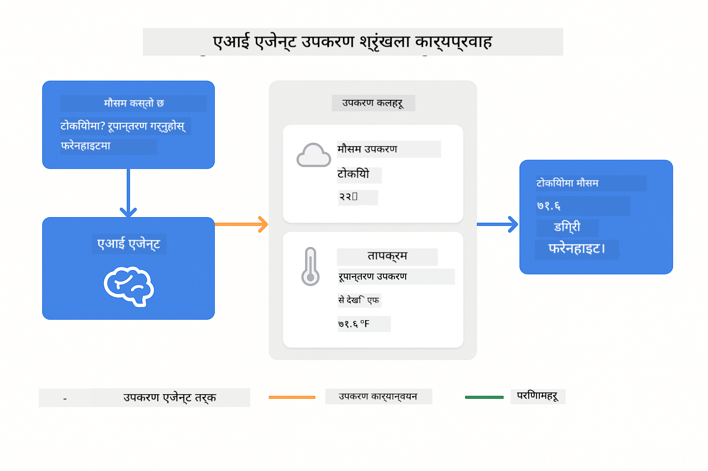
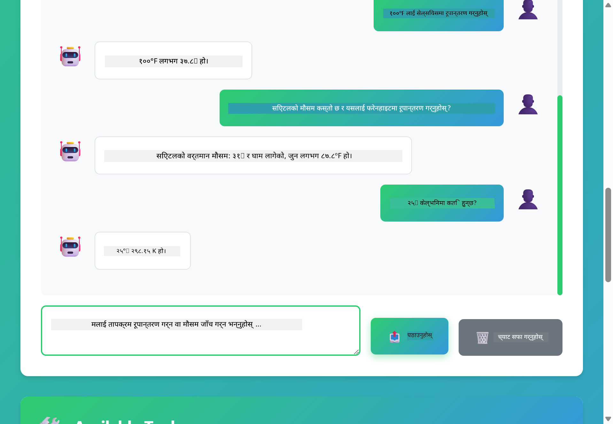

<!--
CO_OP_TRANSLATOR_METADATA:
{
  "original_hash": "13ec450c12cdd1a863baa2b778f27cd7",
  "translation_date": "2025-12-30T23:11:06+00:00",
  "source_file": "04-tools/README.md",
  "language_code": "ne"
}
-->
# Module 04: टुल्स सहित AI एजेन्टहरू

## Table of Contents

- [What You'll Learn](../../../04-tools)
- [Prerequisites](../../../04-tools)
- [Understanding AI Agents with Tools](../../../04-tools)
- [How Tool Calling Works](../../../04-tools)
  - [Tool Definitions](../../../04-tools)
  - [Decision Making](../../../04-tools)
  - [Execution](../../../04-tools)
  - [Response Generation](../../../04-tools)
- [Tool Chaining](../../../04-tools)
- [Run the Application](../../../04-tools)
- [Using the Application](../../../04-tools)
  - [Try Simple Tool Usage](../../../04-tools)
  - [Test Tool Chaining](../../../04-tools)
  - [See Conversation Flow](../../../04-tools)
  - [Observe the Reasoning](../../../04-tools)
  - [Experiment with Different Requests](../../../04-tools)
- [Key Concepts](../../../04-tools)
  - [ReAct Pattern (Reasoning and Acting)](../../../04-tools)
  - [Tool Descriptions Matter](../../../04-tools)
  - [Session Management](../../../04-tools)
  - [Error Handling](../../../04-tools)
- [Available Tools](../../../04-tools)
- [When to Use Tool-Based Agents](../../../04-tools)
- [Next Steps](../../../04-tools)

## What You'll Learn

अहिले सम्म, तपाईंले AI सँग संवाद गर्ने, प्रभावकारी तरिकाले प्राम्प्ट संरचना गर्ने, र जवाफहरूलाई तपाईंको कागजातहरूसँग जमीन गर्ने तरिका सिक्नुभएको छ। तर एउटा मौलिक सीमितता अझै छ: भाषा मोडेलहरू केवल पाठ मात्र उत्पन्न गर्न सक्छन्। तिनीहरूले मौसम जाँच गर्न, गणना गर्न, डेटाबेस क्वेरी गर्न, वा बाह्य प्रणालीहरूसँग अन्तरक्रिया गर्न सक्दैनन्।

टुलहरूले यसलाई परिवर्तन गर्छन्। मोडेललाई कल गर्न मिल्ने फङ्सनहरूको पहुँच दिएर, तपाईं यसलाई एउटा टेक्स्ट जेनेरेटरबाट यस्तो एजेन्टमा रूपान्तरण गर्नुहुन्छ जुन क्रियाहरू लिन सक्छ। मोडेलले कहिल्यै टुल चाहिन्छ भन्ने, कुन टुल प्रयोग गर्ने, र कुन प्यारामिटर पठाउने निर्णय गर्छ। तपाईंको कोडले फङ्सन कार्यान्वयन गर्छ र नतिजा फर्काउँछ। मोडेलले त्यो नतिजालाई आफ्नो जवाफमा समावेश गर्छ।

## Prerequisites

- Module 01 पूरा गरेको (Azure OpenAI स्रोतहरू डिप्लोय भएका)
- Root डाइरेक्टरीमा `.env` फाइल जसमा Azure क्रेडेन्सियल्स छन् (Module 01 मा `azd up` ले सिर्जना गरेको)

> **नोट:** यदि तपाईंले Module 01 पूरा गर्नुभएको छैन भने, पहिले त्यहाँको डिप्लोयमेन्ट निर्देशनहरू पालना गर्नुहोस्।

## Understanding AI Agents with Tools

> **📝 नोट:** यस मोड्युलमा "एजेन्टहरू" शब्दले टुल-कलिङ क्षमताहरूले सशक्त भएका AI सहायकहरू जनाउँछ। यो तिनीहरू भन्दा फरक छ जुन हामी [Module 05: MCP](../05-mcp/README.md) मा समेट्नेछौं — **Agentic AI** नमूनाहरू (आत्मनिर्णयकारी एजेन्टहरू योजना, स्मृति, र बहु-चरण तर्कसंग्रहसँग)।

टुल्स सहितको AI एजेन्टले एक reasoning र acting ढाँचा (ReAct) अनुसरण गर्दछ:

1. प्रयोगकर्ताले प्रश्न सोध्छ
2. एजेन्टले के जान्नु आवश्यक छ भनेर तर्क गर्छ
3. एजेन्टले निर्णय गर्छ कि जवाफका लागि टुल चाहिन्छ कि छैन
4. यदि आवश्यक छ भने, एजेन्टले सही प्यारामिटरहरूसँग उपयुक्त टुल कल गर्छ
5. टुलले कार्यान्वयन गर्छ र डाटा फिर्ता गर्छ
6. एजेन्टले नतिजा समावेश गरेर अन्तिम उत्तर दिन्छ


*ReAct ढाँचा - कसरि AI एजेन्टहरूले समस्या समाधान गर्न तर्क र क्रिया बीच साटासाट गर्छन्*

यो स्वतः रूपमा हुन्छ। तपाईंले टुलहरू र तिनका विवरणहरू परिभाषित गर्नुहुन्छ। मोडेलले कहिले र कसरी तिनीहरू प्रयोग गर्ने बारे निर्णय गर्दछ।

## How Tool Calling Works

**Tool Definitions** - [WeatherTool.java](../../../04-tools/src/main/java/com/example/langchain4j/agents/tools/WeatherTool.java) | [TemperatureTool.java](../../../04-tools/src/main/java/com/example/langchain4j/agents/tools/TemperatureTool.java)

तपाईं स्पष्ट विवरण र प्यारामिटर निर्दिष्टीकरणहरूसँग फङ्सनहरू परिभाषित गर्नुहुन्छ। मोडेलले यी विवरणहरूलाई आफ्नो सिस्टम प्राम्प्टमा देख्छ र प्रत्येक टुलले के गर्छ भनेर बुझ्छ।

```java
@Component
public class WeatherTool {
    
    @Tool("Get the current weather for a location")
    public String getCurrentWeather(@P("Location name") String location) {
        // तपाईंको मौसम खोज्ने तर्क
        return "Weather in " + location + ": 22°C, cloudy";
    }
}

@AiService
public interface Assistant {
    String chat(@MemoryId String sessionId, @UserMessage String message);
}

// सहायक स्वचालित रूपमा Spring Boot सँग जोडिएको छ:
// - ChatModel बीन
// - @Component क्लासहरूका सबै @Tool विधिहरू
// - सत्र व्यवस्थापनको लागि ChatMemoryProvider
```

> **🤖 Try with [GitHub Copilot](https://github.com/features/copilot) Chat:** Open [`WeatherTool.java`](../../../04-tools/src/main/java/com/example/langchain4j/agents/tools/WeatherTool.java) and ask:
> - "How would I integrate a real weather API like OpenWeatherMap instead of mock data?"
> - "What makes a good tool description that helps the AI use it correctly?"
> - "How do I handle API errors and rate limits in tool implementations?"

**Decision Making**

जब प्रयोगकर्ताले "What's the weather in Seattle?" भन्छ, मोडेलले त्यसले weather tool चाहिन्छ भन्ने चिन्ह गर्छ। यसले स्थान प्यारामिटरलाई "Seattle" सेट गरी एक फङ्सन कल उत्पन्न गर्छ।

**Execution** - [AgentService.java](../../../04-tools/src/main/java/com/example/langchain4j/agents/service/AgentService.java)

Spring Boot ले सबै रजिष्टर गरिएको टुलहरूसँग declarative `@AiService` इन्टरफेसलाई अटो-वायर गर्छ, र LangChain4j ले टुल कॉलहरू स्वतः रूपमा कार्यान्वयन गर्छ।

> **🤖 Try with [GitHub Copilot](https://github.com/features/copilot) Chat:** Open [`AgentService.java`](../../../04-tools/src/main/java/com/example/langchain4j/agents/service/AgentService.java) and ask:
> - "How does the ReAct pattern work and why is it effective for AI agents?"
> - "How does the agent decide which tool to use and in what order?"
> - "What happens if a tool execution fails - how should I handle errors robustly?"

**Response Generation**

मोडेलले मौसम डाटा प्राप्त गर्छ र प्रयोगकर्ताका लागि प्राकृतिक भाषामा जवाफ फर्म्याट गर्छ।

### किन Declarative AI Services प्रयोग गर्ने?

यो मोड्युलले LangChain4j को Spring Boot एकीकरण प्रयोग गरेर declarative `@AiService` इन्टरफेसहरू प्रयोग गर्दछ:

- **Spring Boot auto-wiring** - ChatModel र टुलहरू स्वतः इन्जेक्ट गरिन्छन्
- **@MemoryId pattern** - स्वतः सेसन-आधारित मेमोरी व्यवस्थापन
- **Single instance** - असिस्टेन्ट एक पटक सिर्जना हुन्छ र राम्रो प्रदर्शनका लागि पुन: उपयोग गरिन्छ
- **Type-safe execution** - Java मेथडहरू सिधै प्रकार रूपान्तरणसहित कल गरिन्छ
- **Multi-turn orchestration** - टुल चेनिङ स्वतः ह्याण्डल गर्छ
- **Zero boilerplate** - कुनै म्यानुअल AiServices.builder() कल वा मेमोरी HashMap आवश्यक छैन

वैकल्पिक दृष्टिकोणहरू (म्यानुअल `AiServices.builder()`) मा थप कोड आवश्यक पर्छ र Spring Boot एकीकरणका फाइदाहरू हराउँछन्।

## Tool Chaining

**Tool Chaining** - AI ले क्रमशः धेरै टुलहरू कल गर्न सक्छ। "What's the weather in Seattle and should I bring an umbrella?" जस्तो सोध्दा यसले `getCurrentWeather` कल गरेर बरसाको सम्भाव्यतालाई लिएर रेन गेयरबारे तर्क गरेर चेन गर्छ।

<a href="images/tool-chaining.png"></a>

*क्रमिक टुल कलहरू - एक टुलको आउटपुट अर्को निर्णयमा फीड हुन्छ*

**Graceful Failures** - mock डाटामा नभएको शहरको मौसम चाहनुहोस्। टुलले त्रुटि सन्देश फर्काउँछ, र AI ले असमर्थ भएको व्याख्या गर्छ। टुलहरू सुरक्षित रूपमा फेल हुन्छन्।

यो एकल संवाद टर्नमा हुन्छ। एजेन्टले स्वतन्त्र रूपमा धेरै टुल कलहरू समायोजन गर्छ।

## Run the Application

**Verify deployment:**

Root डाइरेक्टरीमा Azure क्रेडेन्सियल्स सहित `.env` फाइल छ भनेर सुनिश्चित गर्नुहोस् (Module 01 का क्रममा सिर्जना गरिएको):
```bash
cat ../.env  # AZURE_OPENAI_ENDPOINT, API_KEY, DEPLOYMENT देखाउनुपर्छ
```

**Start the application:**

> **नोट:** यदि तपाईंले पहिले नै Module 01 बाट `./start-all.sh` प्रयोग गरेर सबै एप्लिकेसनहरू सुरू गरेको हुनुहुन्छ भने, यो मोड्युल पोर्ट 8084 मा पहिले नै चलिरहेको हुन्छ। तपाईंले तलका स्टार्ट कमाण्डहरू स्किप गरी सिधै http://localhost:8084 मा जान सक्नुहुन्छ।

**Option 1: Using Spring Boot Dashboard (Recommended for VS Code users)**

Dev container मा Spring Boot Dashboard एक्सटेन्सन समावेश छ, जसले सबै Spring Boot एप्लिकेसनहरू व्यवस्थापन गर्न दृश्य इन्टरफेस प्रदान गर्छ। तपाईंले यो VS Code को Activity Bar (बायाँपट्टि) मा Spring Boot आइकन पहिचान गरेर फेला पार्न सक्नुहुन्छ।

Spring Boot Dashboard बाट, तपाईं:
- कार्यक्षेत्रमा उपलब्ध सबै Spring Boot एप्लिकेसनहरू हेर्न सक्नुहुन्छ
- एक क्लिकमा एप्लिकेसनहरू सुरु/बन्द गर्न सक्नुहुन्छ
- वास्तविक समयमा एप्लिकेसन लगहरू हेर्न सक्नुहुन्छ
- एप्लिकेसन स्थिति अनुगमन गर्न सक्नुहुन्छ

Simply click the play button next to "tools" to start this module, or start all modules at once.


**Option 2: Using shell scripts**

Start all web applications (modules 01-04):

**Bash:**
```bash
cd ..  # रूट निर्देशिकाबाट
./start-all.sh
```

**PowerShell:**
```powershell
cd ..  # रूट निर्देशिकाबाट
.\start-all.ps1
```

Or start just this module:

**Bash:**
```bash
cd 04-tools
./start.sh
```

**PowerShell:**
```powershell
cd 04-tools
.\start.ps1
```

Both scripts automatically load environment variables from the root `.env` file and will build the JARs if they don't exist.

> **Note:** If you prefer to build all modules manually before starting:
>
> **Bash:**
> ```bash
> cd ..  # Go to root directory
> mvn clean package -DskipTests
> ```
>
> **PowerShell:**
> ```powershell
> cd ..  # Go to root directory
> mvn clean package -DskipTests
> ```

Open http://localhost:8084 in your browser.

**To stop:**

**Bash:**
```bash
./stop.sh  # यो मोड्युल मात्र
# वा
cd .. && ./stop-all.sh  # सबै मोड्युलहरू
```

**PowerShell:**
```powershell
.\stop.ps1  # यो मोड्युल मात्रै
# वा
cd ..; .\stop-all.ps1  # सबै मोड्युलहरू
```

## Using the Application

The application provides a web interface where you can interact with an AI agent that has access to weather and temperature conversion tools.

<a href="images/tools-homepage.png"></a>

*AI एजेन्ट टुल्स इन्टरफेस - छिटो उदाहरणहरू र टुलहरूसँग अन्तरक्रिया गर्नका लागि च्याट इन्टरफेस*

**Try Simple Tool Usage**

सुरुमा एउटा सिधा अनुरोधले सुरु गर्नुहोस्: "Convert 100 degrees Fahrenheit to Celsius"। एजेन्टले तापक्रम रूपान्तरण टुल चाहिन्छ भनेर चिन्ह लगाउँछ, सही प्यारामिटरहरूसँग कल गर्छ, र नतिजा फर्काउँछ। ध्यान दिनुहोस् कति प्राकृतिक महसुस हुन्छ - तपाईंले कुन टुल प्रयोग गर्ने वा कसरी कल गर्ने भन्ने कुरा निर्दिष्ट गर्नुभएन।

**Test Tool Chaining**

अब केहि जटिल प्रयास गर्नुहोस्: "What's the weather in Seattle and convert it to Fahrenheit?" एजेन्टले चरणहरूमा काम गर्न हेर्नुहोस्। यसले पहिले मौसम प्राप्त गर्छ (जुन Celsius मा फर्कन्छ), पछि Fahrenheit मा रूपान्तरण गर्नुपर्ने कुरा पहिचान गर्छ, रूपान्तरण टुल कल गर्छ, र दुवै नतिजा एउटै जवाफमा मिलाउँछ।

**See Conversation Flow**

च्याट इन्टरफेसले संवाद इतिहास राख्छ, जसले तपाइँलाई बहु-टर्न अन्तरक्रियाहरू गर्न अनुमति दिन्छ। तपाईंले सबै अघिल्लो क्वेरीहरू र जवाफहरू हेर्न सक्नुहुन्छ, जसले संवाद अनुगमन गर्न र एजेन्टले कसरी सन्दर्भ निर्माण गर्दैछ बुझ्न सजिलो बनाउँछ।

<a href="images/tools-conversation-demo.png"></a>

*सादा रूपान्तरणहरू, मौसम खोजीहरू, र टुल चेनिङ देखाउने बहु-टर्न संवाद*

**Experiment with Different Requests**

विभिन्न संयोजनहरू प्रयास गर्नुहोस्:
- मौसम खोजीहरू: "What's the weather in Tokyo?"
- तापमान रूपान्तरणहरू: "What is 25°C in Kelvin?"
- संयुक्त प्रश्नहरू: "Check the weather in Paris and tell me if it's above 20°C"

ध्यान दिनुहोस् कि एजेन्टले प्राकृतिक भाषालाई कसरी व्याख्या गर्छ र उपयुक्त टुल कलहरूमा कसरी नक्शांकन गर्दछ।

## Key Concepts

**ReAct Pattern (Reasoning and Acting)**

एजेन्टले तर्क (के गर्ने निर्णय) र क्रिया (टुल प्रयोग) बीच साटासाट गर्छ। यो ढाँचाले केवल निर्देशनमा प्रतिक्रिया दिनुको सट्टा autonomia समस्या समाधान सक्षम बनाउँछ।

**Tool Descriptions Matter**

टुल विवरणहरूको गुणस्तरले सीधा प्रभाव पार्छ कि एजेन्ट तिनीहरूलाई कति राम्रोसँग प्रयोग गर्छ। स्पष्ट, विशिष्ट विवरणहरूले मोडेललाई कहिले र कसरी हरेक टुल कल गर्ने भन्ने बुझ्न मद्दत गर्छ।

**Session Management**

`@MemoryId` एनोटेशनले स्वतः सेसन-आधारित मेमोरी व्यवस्थापन सक्षम बनाउँछ। हरेक सेसन ID लाई `ChatMemoryProvider` बीनले व्यवस्थापन गर्ने आफ्नै `ChatMemory` उदाहरण प्राप्त हुन्छ, जसले म्यानुअल मेमोरी ट्र्याकिङको आवश्यकता हटाउँछ।

**Error Handling**

टुलहरू फेल हुन सक्छन् - API हरू टाइमआउट हुन्छन्, प्यारामिटरहरू अमान्य हुन सक्छन्, बाह्य सर्भिसहरू डाउन हुन सक्छन्। प्रोडक्सन एजेन्टहरूलाई त्रुटि ह्यान्डलिङ चाहिन्छ ताकि मोडेल समस्याहरू व्याख्या गर्न वा वैकल्पिक प्रयासहरू गर्न सकोस।

## Available Tools

**Weather Tools** (प्रदर्शनका लागि mock डाटा):
- कुनै स्थानको वर्तमान मौसम प्राप्त गर्नुहोस्
- बहु-दिने पूर्वानुमान प्राप्त गर्नुहोस्

**Temperature Conversion Tools**:
- Celsius देखि Fahrenheit
- Fahrenheit देखि Celsius
- Celsius देखि Kelvin
- Kelvin देखि Celsius
- Fahrenheit देखि Kelvin
- Kelvin देखि Fahrenheit

यी साधारण उदाहरणहरू हुन्, तर ढाँचा कुनै पनि फङ्सनमा फैलिन्छ: डेटाबेस क्वेरीहरू, API कलहरू, गणना, फाइल अपरेसनहरू, वा सिस्टम कमाण्डहरू।

## When to Use Tool-Based Agents

**Use tools when:**
- जवाफको लागि वास्तविक-समय डाटा चाहिन्छ (मौसम, स्टक मूल्यहरू, इन्वेन्टरी)
- साधारण गणित भन्दा बाहिर गणना गर्नुपर्ने हुन्छ
- डेटाबेस वा API हरूमा पहुँच आवश्यक छ
- कार्यहरू लिनु पर्दछ (इमेल पठाउनु, टिकट बनाउनु, रेकर्ड अपडेट गर्नु)
- बहु डाटा स्रोतहरू संयोजन गर्नु पर्दछ

**Don't use tools when:**
- प्रश्नहरू सामान्य ज्ञानबाट जवाफ दिन सकिन्छ
- प्रतिक्रिया शुद्ध रूपमा संवादात्मक छ
- टुल लेटेन्सीले अनुभवलाई धेरै ढिलो बनाउनेछ

## Next Steps

**Next Module:** [05-mcp - Model Context Protocol (MCP)](../05-mcp/README.md)

---

**Navigation:** [← Previous: Module 03 - RAG](../03-rag/README.md) | [Back to Main](../README.md) | [Next: Module 05 - MCP →](../05-mcp/README.md)

---

<!-- CO-OP TRANSLATOR DISCLAIMER START -->
अस्वीकरण:
यो दस्तावेज AI अनुवाद सेवा [Co-op Translator](https://github.com/Azure/co-op-translator) प्रयोग गरेर अनुवाद गरिएको हो। हामी शुद्धताको लागि प्रयास गर्छौं, तर कृपया ध्यान दिनुहोस् कि स्वचालित अनुवादमा त्रुटि वा अशुद्धता हुनसक्छ। मूल भाषामा रहेको दस्तावेजलाई अधिकारिक स्रोत मान्नुपर्छ। महत्वपूर्ण जानकारीका लागि व्यावसायिक मानवीय अनुवाद सिफारिस गरिन्छ। यस अनुवादको प्रयोगबाट उत्पन्न कुनै पनि गलतफहमी वा गलत व्याख्याका लागि हामी उत्तरदायी छैनौं।
<!-- CO-OP TRANSLATOR DISCLAIMER END -->