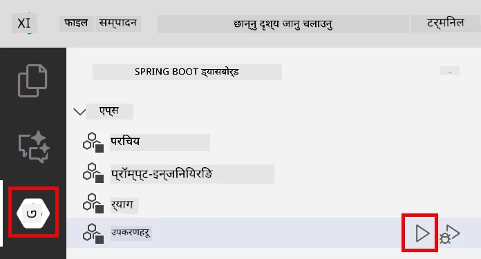
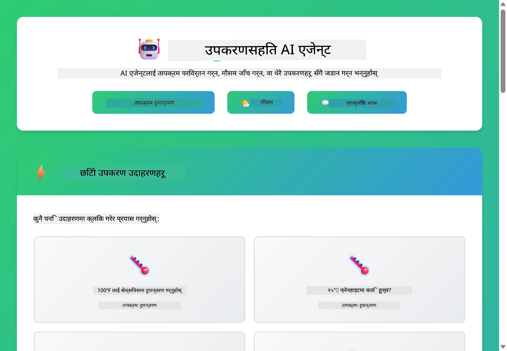
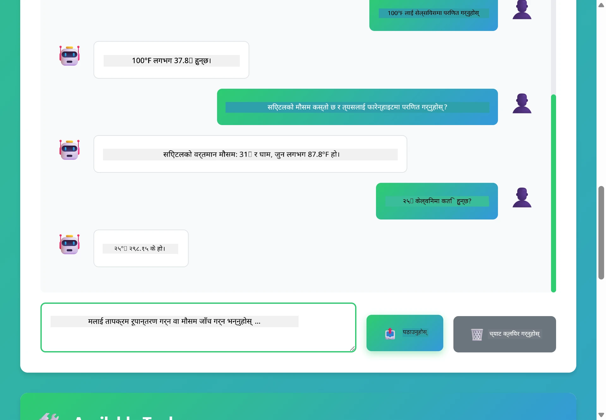

# Module 04: उपकरणहरूसँग एआई एजेन्टहरू

## सामग्री तालिका

- [भिडियो वाकथ्रू](#भिडियो-वाकथ्रू)
- [तपाईंले के सिक्नुहुनेछ](#तपाईंले-के-सिक्नुहुनेछ)
- [पूर्व आवश्यकताहरू](#पूर्व-आवश्यकताहरू)
- [उपकरणहरू सहित एआई एजेन्टहरू बुझ्ने](#उपकरणहरूसँग-एआई-एजेन्टहरू-बुझ्न)
- [उपकरण कल कसरी काम गर्छ](#उपकरण-कल-कसरी-काम-गर्छ)
  - [उपकरण परिभाषाहरू](#उपकरण-परिभाषाहरू)
  - [निर्णय लिनु](#निर्णय-लिनु)
  - [कार्यन्वयन](#कार्यान्वयन)
  - [प्रतिक्रिया उत्पादन](#प्रतिक्रिया-उत्पादन)
  - [वास्तुकला: स्प्रिंग बूट ऑटो-वारिङ](#वास्तुकला-स्प्रिंग-बूट-ऑटो-वारिङ)
- [उपकरण चेनिङ](#उपकरण-चेनिङ)
- [एप्लिकेसन चलाउनुहोस्](#एप्लिकेसन-चलाउनुहोस्)
- [एप्लिकेसन प्रयोग गर्दै](#एप्लिकेशन-प्रयोग-गर्दै)
  - [साधारण उपकरण प्रयोग कोशिश गर्नुहोस्](#साधारण-उपकरण-प्रयोग-प्रयास-गर्नुहोस्)
  - [उपकरण चेनिङ परीक्षण गर्नुहोस्](#उपकरण-श्रृंखला-परीक्षण-गर्नुहोस्)
  - [वार्तालाप प्रवाह हेर्नुहोस्](#कुराकानी-प्रवाह-हेर्नुहोस्)
  - [विभिन्न अनुरोधहरूसँग प्रयोग गर्नुहोस्](#विभिन्न-अनुरोधहरूसँग-प्रयोग-गर्नुहोस्)
- [मुख्य अवधारणाहरू](#प्रमुख-अवधारणाहरू)
  - [ReAct ढाँचा (तर्क र कार्य)](#react-ढाँचा-कारण-र-कार्य)
  - [उपकरण विवरणहरूको महत्व](#उपकरणको-विवरण-महत्त्वपूर्ण-छ)
  - [सेसन व्यवस्थापन](#सत्र-व्यवस्थापन)
  - [त्रुटि ह्यान्डलिङ](#त्रुटि-व्यवस्थापन)
- [उपलब्ध उपकरणहरू](#उपलब्ध-उपकरणहरू)
- [कहिले उपकरण आधारित एजेन्टहरू प्रयोग गर्ने](#कहिले-उपकरण-आधारित-एजेन्टहरू-प्रयोग-गर्ने)
- [उपकरणहरू विरुद्ध RAG](#उपकरणहरू-बनाम-rag)
- [अर्को कदमहरू](#अर्को-कदम)

## भिडियो वाकथ्रू

यस लाइभ सत्रलाई हेर्नुहोस् जसले यो मोड्युल कसरी सुरु गर्ने भनेर व्याख्या गर्छ:

<a href="https://www.youtube.com/watch?v=O_J30kZc0rw"></a>

## तपाईंले के सिक्नुहुनेछ

अहिलेसम्म तपाईंले एआईसँग कसरी कुराकानी गर्ने, प्रभावकारी रूपमा प्रॉम्प्ट कसरी निर्माण गर्ने, र प्रतिक्रियाहरूलाई तपाईंका कागजातहरूमा कसरी आधार गर्ने सिक्नुभयो। तर अझै एउटा आधारभूत सिमाना छ: भाषा मोडेलहरूले मात्र पाठ उत्पादन गर्न सक्छन्। तिनीहरू मौसम जाँच गर्न, गणना गर्न, डेटा बेस सोध्न वा बाह्य प्रणालीहरूसँग अन्तरक्रिया गर्न सक्दैनन्।

उपकरणहरूले यसलाई परिवर्तन गर्छन्। मोडेललाई कल गर्न सकिने कार्यहरू उपलब्ध गराएर, तपाईं यसलाई पाठ उत्पादन गर्ने यन्त्रबाट कार्य गर्न सक्ने एजेन्टमा परिणत गर्नुहुन्छ। मोडेलले कहिले उपकरण चाहिन्छ, कुन उपकरण प्रयोग गर्ने, र कुन प्यारामिटरहरू पास गर्ने निर्णय गर्छ। तपाईंको कोडले त्यो कार्य सञ्चालन गर्छ र नतिजा फर्काउँछ। मोडेल त्यो नतिजा आफ्नो प्रतिक्रियामा समावेश गर्छ।

## पूर्व आवश्यकताहरू

- [मोड्युल ०१ - परिचय](../01-introduction/README.md) पूरा भएको (Azure OpenAI स्रोतहरू तैनाथ गरिएको)
- सिफारिस गरिएको अघिल्लो मोड्युलहरू पूरा गरिएको (यो मोड्युलले [मोड्युल ०३ बाट RAG अवधारणाहरू](../03-rag/README.md) लाई उपकरणहरू विरुद्ध RAG तुलनामा सन्दर्भ गर्दछ)
- मूल डाइरेक्टरीमा `.env` फाइल Azure प्रमाणपत्रहरू सहित (मोड्युल ०१ मा `azd up` द्वारा सिर्जना गरिएको)

> **टिप्पणी:** यदि तपाईंले मोड्युल ०१ पूरा गर्नुभएको छैन भने, पहिले त्यहाँका तैनाती निर्देशनहरू पालना गर्नुहोस्।

## उपकरणहरूसँग एआई एजेन्टहरू बुझ्न

> **📝 नोट:** यस मोड्युलमा "एजेन्टहरू" भनी जनाइएको छ एआई सहायकहरूलाई जसले उपकरण कल गर्ने क्षमता वृद्धि गरिएको छ। यो [मोड्युल ०५: MCP](../05-mcp/README.md) मा समेटिने **एजेन्सिक AI** ढाँचाहरू (स्वायत्त एजेन्टहरू जसमा योजना, सम्झना, र बहु-चरण तर्क हुन्छ) भन्दा फरक छ।

उपकरण बिना, भाषा मोडेलले केवल यसको प्रशिक्षण डेटाबाट पाठ मात्र उत्पादन गर्न सक्छ। वर्तमान मौसम सोध्नुहोस्, र त्यसले केवल अनुमान लगाउँछ। उपकरणहरू उपलब्ध गराउँदा, यसले मौसम API कल गर्न सक्छ, गणना गर्न सक्छ वा डेटाबेस सोध्न सक्छ — अनि ती वास्तविक नतिजाहरू आफ्ना प्रतिक्रियामा जोड्न सक्छ।


*उपकरण बिना मोडेलले मात्र अनुमान लगाउँछ — उपकरणहरूसँग यो API कल गर्न, गणना गर्न र वास्तविक-समय डेटा फिर्ता गर्न सक्छ।*

उपकरण भएको एआई एजेन्टले **तर्क र कार्य (ReAct)** ढाँचा अनुसरण गर्छ। मोडेलले मात्र जवाफ दिँदैन — यसले के चाहिन्छ भनी सोच्छ, उपकरण कल गरेर कार्य गर्छ, नतिजा अवलोकन गर्छ, अनि फेरि कार्य गर्ने वा अन्तिम उत्तर दिने निर्णय गर्छ:

1. **तर्क गर्नुहोस्** — एजेन्ट प्रयोगकर्ताको प्रश्न विश्लेषण गर्छ र के सूचना चाहिन्छ निर्धारण गर्छ
2. **कार्य गर्नुहोस्** — एजेन्ट सही उपकरण छान्छ, सहि प्यारामिटरहरू उत्पादन गर्छ, र कल गर्छ
3. **अवलोकन गर्नुहोस्** — एजेन्टले उपकरणबाट प्राप्त नतिजा पाउँछ र मूल्याङ्कन गर्छ
4. **दोहर्याउनुहोस् वा प्रतिक्रिया दिनुहोस्** — यदि थप डाटा चाहिन्छ भने पुनः लूप हुन्छ; नभए, प्राकृतिक भाषा जवाफ तयार गर्छ


*ReAct चक्र — एजेन्टले के गर्ने भनी तर्क गर्छ, उपकरण कल गरेर कार्य गर्छ, नतिजा अवलोकन गर्छ, र अन्तिम उत्तर दिन लूप गर्दै जान्छ।*

यसले स्वचालित रूपमा हुन्छ। तपाईंले उपकरणहरू र तिनका विवरणहरू परिभाषित गर्नुहुन्छ। मोडेलले कहिले र कसरी प्रयोग गर्ने निर्णय गर्छ।

## उपकरण कल कसरी काम गर्छ

### उपकरण परिभाषाहरू

[WeatherTool.java](../../../04-tools/src/main/java/com/example/langchain4j/agents/tools/WeatherTool.java) | [TemperatureTool.java](../../../04-tools/src/main/java/com/example/langchain4j/agents/tools/TemperatureTool.java)

तपाईं स्पष्ट विवरणहरू र प्यारामिटर निर्दिष्टहरूसँग कार्यहरू परिभाषित गर्नुहुन्छ। मोडेलले यी विवरणहरू सिस्टम प्रॉम्प्टमा हेर्छ र बुझ्छ कि प्रत्येक उपकरण के गर्छ।

```java
@Component
public class WeatherTool {
    
    @Tool("Get the current weather for a location")
    public String getCurrentWeather(@P("Location name") String location) {
        // तपाईंको मौसम खोज्ने तर्क
        return "Weather in " + location + ": 22°C, cloudy";
    }
}

@AiService
public interface Assistant {
    String chat(@MemoryId String sessionId, @UserMessage String message);
}

// असिस्टेन्ट स्वचालित रूपमा Spring Boot द्वारा जोडिएको छ:
// - ChatModel बीन
// - @Component वर्गहरूबाट सबै @Tool विधिहरू
// - सत्र व्यवस्थापनको लागि ChatMemoryProvider
```

तलको चित्रले प्रत्येक एनोटेशनलाई तोड्छ र देखाउँछ कसरी प्रत्येक भागले एआईलाई उपकरण कहिले कल गर्ने र के तर्कहरू पास गर्ने बुझ्न सहयोग गर्छ:


*उपकरण परिभाषाको संरचना — @Tool ले एआईलाई कहिले प्रयोग गर्ने बताउँछ, @P प्रत्येक प्यारामिटरको विवरण दिन्छ, र @AiService सबैलाई सुरुमा जोड्छ।*

> **🤖 [GitHub Copilot](https://github.com/features/copilot) च्याटसँग प्रयास गर्नुहोस्:** [`WeatherTool.java`](../../../04-tools/src/main/java/com/example/langchain4j/agents/tools/WeatherTool.java) खोल्नुहोस् र सोध्नुहोस्:
> - "मक डाटा सट्टा वास्तविक OpenWeatherMap जस्तो वास्तविक मौसम API कसरी समावेश गर्ने?"
> - "एआईलाई सहि तरिकाले प्रयोग गर्न मद्दत गर्ने राम्रो उपकरण विवरण के हो?"
> - "उपकरण कार्यान्वयनमा API त्रुटि र दर सीमाहरू कसरी ह्यान्डल गर्ने?"

### निर्णय लिनु

जब प्रयोगकर्ताले "सिएटलमा मौसम कस्तो छ?" भन्छ, मोडेलले मनमानी रूपमा उपकरण छान्दैन। यसले प्रयोगकर्ताको अभिप्राय प्रत्येक उपकरण विवरणसँग तुलना गर्छ, सम्बन्धितताको आधारमा स्कोर गर्छ, र सबैभन्दा उपयुक्त छान्छ। त्यसपछि सही प्यारामिटरहरू सहित संरचित कार्य कल सिर्जना गर्छ — यस अवस्थामा, `location` लाई `"Seattle"` सेट गरेर।

यदि कुनै उपकरण प्रयोगकर्ताको अनुरोधसँग मेल खाँदैन भने, मोडेल आफ्नै ज्ञानबाट जवाफ दिन्छ। यदि धेरै उपकरण मेल खान्छ भने, सबैभन्दा विशिष्ट उपकरण चयन गरिन्छ।


*मोडेलले उपलब्ध प्रत्येक उपकरणलाई प्रयोगकर्ताको अभिप्रायसँग तुलना गरेर सबैभन्दा उपयुक्त छनोट गर्छ — त्यसैले स्पष्ट र विशिष्ट उपकरण विवरण लेख्नु महत्त्वपूर्ण हुन्छ।*

### कार्यान्वयन

[AgentService.java](../../../04-tools/src/main/java/com/example/langchain4j/agents/service/AgentService.java)

स्प्रिंग बुटले घोषणा गरिएको `@AiService` इन्टरफेसलाई सबै दर्ता भएका उपकरणहरूसँग स्वचालित रूपमा जोड्दछ, र LangChain4j ले उपकरण कलहरू स्वचालित रूपमा सञ्चालन गर्छ। पछाडि, एक पूर्ण उपकरण कल प्रयोगकर्ताको प्राकृतिक भाषाको प्रश्नदेखि प्राकृतिक भाषाको जवाफसम्म छेउछाउ छः


*अन्त-देखि-अन्त प्रवाह — प्रयोगकर्ताले प्रश्न सोध्छ, मोडेलले उपकरण छान्छ, LangChain4j कार्यान्वयन गर्छ, र मोडेल नतिजालाई प्राकृतिक जवाफमा बुन्छ।*

पछाडि, `AiServices` ले जुनसुकै उपकरणका लागि समान उपकरण-कल लूप चलाउँछ — यहाँ एक साधारण `Calculator` साथ उदाहरण देखाइएको छ। तलको सिक्वेन्स डाइग्रामले ठीक के हुन्छ देखाउँछ:


*उपकरण-कल लूप — `AiServices` ले तपाईंको सन्देश र उपकरण स्किमा LLM लाई पठाउँछ, LLM ले `add(42, 58)` जस्तो कार्य कल जवाफ दिन्छ, LangChain4j ले `Calculator` मेथड स्थानीय रूपमा चलाउँछ, र नतिजा फिर्ता गर्दै अन्तिम उत्तर दिन्छ।*

> **🤖 [GitHub Copilot](https://github.com/features/copilot) च्याटसँग प्रयास गर्नुहोस्:** [`AgentService.java`](../../../04-tools/src/main/java/com/example/langchain4j/agents/service/AgentService.java) खोल्नुहोस् र सोध्नुहोस्:
> - "ReAct ढाँचाले कसरी काम गर्छ र किन यो एआई एजेन्टहरूका लागि प्रभावकारी छ?"
> - "एजेन्टले कुन उपकरण प्रयोग गर्ने र कुन क्रममा प्रयोग गर्ने कसरी निर्णय गर्छ?"
> - "यदि उपकरण कार्यान्वयन असफल भयो भने के हुन्छ - त्रुटिहरूलाई कसरी मजबुदीले ह्यान्डल गर्ने?"

### प्रतिक्रिया उत्पादन

मोडेलले मौसम डाटा प्राप्त गर्छ र प्रयोगकर्ताको लागि प्राकृतिक भाषामा प्रतिक्रिया तयार गर्छ।

### वास्तुकला: स्प्रिंग बूट ऑटो-वारिङ

यो मोड्युलले LangChain4j को स्प्रिंग बूट इन्टिग्रेसन प्रयोग गर्छ जुन घोषणा गरिएको `@AiService` इन्टरफेसहरूसँग छ। सुरुमा स्प्रिंग बुटले प्रत्येक `@Component` जुन `@Tool` मेथडहरू समावेश गर्छ पत्ता लगाउँछ, तपाईंको `ChatModel` बीन, र `ChatMemoryProvider` — अनि सबैलाई एउटै `Assistant` इन्टरफेसमा जोड्छ, कुनै बोइलरप्लेट बिना।


*@AiService इन्टरफेसले ChatModel, उपकरण कम्पोनेंटहरू, र मेमोरी प्रदायकलाई जोड्छ — स्प्रिंग बुटले पूरै वारिङ स्वचालित रूपमा व्यवस्थापन गर्छ।*

यहाँ पूर्ण अनुरोध जीवनचक्र छ सिक्वेन्स डाइग्राममा — HTTP अनुरोधबाट कन्ट्रोलर, सर्भिस, र ऑटो-वार्ड प्रोक्सी हुँदै, उपकरण कार्यान्वयन सम्म र फिर्तासम्म:


*पूर्ण स्प्रिंग बुट अनुरोध जीवनचक्र — HTTP अनुरोध कन्ट्रोलर र सर्भिसबाट ऑटो-वार्डेड Assistant प्रोसीमा जान्छ, जसले LLM र उपकरण कलहरू स्वचालित रूपमा समन्वय गर्छ।*

यस दृष्टिकोणका मुख्य फाइदाहरू:

- **स्प्रिंग बुट ऑटो-वारिङ** — ChatModel र उपकरणहरू स्वचालित इंजेक्ट गरिएको
- **@MemoryId ढाँचा** — स्वचालित सेसन-आधारित मेमोरी व्यवस्थापन
- **एकल उदाहरण** — Assistant एकपटक सिर्जना गरिन्छ र पुन: प्रयोग गरिन्छ प्रदर्शन सुधारका लागि
- **टाइप-सेफ कार्यान्वयन** — Java मेथडहरू प्रत्यक्ष प्रकार रूपान्तरणसहित कल गरिन्छ
- **बहु-चरण समन्वय** — उपकरण चेनिङ स्वचालित रूपमा ह्यान्डल गर्छ
- **शून्य बोइलरप्लेट** — कुनै म्यानुअल `AiServices.builder()` कल वा मेमोरी ह्यास म्याप आवश्यक छैन

वैकल्पिक दृष्टिकोणहरू (म्यानुअल `AiServices.builder()`) मा बढी कोड चाहिन्छ र स्प्रिंग बूट इन्टिग्रेसन फाइदाहरू मिस हुन्छन्।

## उपकरण चेनिङ

**उपकरण चेनिङ** — उपकरण-आधारित एजेन्टहरूको वास्तविक शक्ति तब प्रकट हुन्छ जब एक प्रश्नले धेरै उपकरणहरू प्रयोग गर्नुपर्छ। "सिएटलको मौसम फर्नहाइटमा कस्तो छ?" सोध्दा, एजेन्टले स्वचालित रूपमा दुई उपकरणहरू जडान गर्छ: पहिले `getCurrentWeather` कल गरेर सेल्सियसमा तापक्रम पाउँछ, त्यसपछि त्यो मान `celsiusToFahrenheit` लाई पास गरेर रूपान्तरण गर्छ — सबै एकै वार्तालाप चरणमा।


*उपकरण चेनिङ क्रियाको अवस्था — एजेन्टले पहिले getCurrentWeather कल गर्छ, त्यसपछि सेल्सियस नतिजा celsiusToFahrenheit मा पठाउँछ, र मिलाइएको उत्तर दिन्छ।*

**सहनशील असफलताहरू** — नकली डाटामा नभएको शहरको मौसम सोध्दा उपकरणले त्रुटि सन्देश फर्काउँछ, र एआईले सहयोग गर्न नसक्ने व्याख्या गर्छ, क्र्यासिंग हुँदैन। उपकरणहरू सुरक्षित रूपमा असफल हुन्छन्। तलको चित्रले दुबै दृष्टिकोणको तुलना गर्छ — सहि त्रुटि ह्यान्डलिङमा एजेन्टले अपवाद समात्छ र सहयोगी प्रतिक्रिया दिन्छ, नभए पूरै एप्लिकेसन क्र्यास हुन्छ:


*जब उपकरण असफल हुन्छ, एजेन्टले त्रुटि समात्छ र क्र्यास नगरी सहयोगी व्याख्या सहित प्रतिक्रिया दिन्छ।*

यो एकै वार्तालाप चरणमा हुन्छ। एजेन्टले स्वतन्त्र रूपमा धेरै उपकरण कलहरू समन्वय गर्छ।

## एप्लिकेसन चलाउनुहोस्

**तैनाती पुष्टि गर्नुहोस्:**

मूल डाइरेक्टरीमा Azure प्रमाणपत्रहरू सहित `.env` फाइल छ भनेर सुनिश्चित गर्नुहोस् (मोड्युल ०१ मा सिर्जना गरिएको)। मोड्युल डाइरेक्टरीबाट यसलाई चलाउनुहोस् (`04-tools/`):

**Bash:**
```bash
cat ../.env  # AZURE_OPENAI_ENDPOINT, API_KEY, DEPLOYMENT देखाउनु पर्छ
```

**PowerShell:**
```powershell
Get-Content ..\.env  # Azure_OpenAI_Endpoint, API_KEY, DEPLOYMENT देखाउनु पर्छ
```

**एप्लिकेसन सुरु गर्नुहोस्:**

> **टिप्पणी:** यदि तपाईंले पहिले नै मूल डाइरेक्टरीबाट `./start-all.sh` चलाएर सबै एप्लिकेसनहरू सुरु गर्नुभएको छ (जसरी मोड्युल ०१ मा वर्णन गरिएको), यो मोड्युल पोर्ट 8084 मा चलिरहेको छ। तलका सुरु आदेशहरू छोडेर सिधै http://localhost:8084 जानुहोस्।

**विकल्प १: स्प्रिंग बुट ड्यासबोर्ड प्रयोग गरी (VS Code प्रयोगकर्ताहरूका लागि सिफारिस गरिएको)**

डेभ कन्टेनरमा स्प्रिंग बुट ड्यासबोर्ड विस्तार समावेश छ, जुन सबै स्प्रिंग बुट एप्लिकेसनहरू व्यवस्थापन गर्न दृश्यात्मक इन्टरफेस प्रदान गर्दछ। तपाईं यसलाई VS Code को Activity Bar मा बायाँतिर स्प्रिंग बुट आइकनमा फेला पार्न सक्नुहुन्छ।

स्प्रिंग बुट ड्यासबोर्डबाट तपाईं:
- कार्यक्षेत्रमा सबै उपलब्ध स्प्रिंग बुट एप्लिकेसनहरू देख्न सक्नुहुन्छ
- एक क्लिकमा एप्लिकेसनहरू सुरु/रोक्न सक्नुहुन्छ
- एप्लिकेसन लगहरू वास्तविक समयमा हेर्न सक्नुहुन्छ
- एप्लिकेसनको स्थिति अनुगमन गर्न सक्नुहुन्छ

"tools" का छेउ प्ले बटन क्लिक गरेर यस मोड्युल सुरु गर्नुहोस्, वा सबै मोड्युलहरू सँगै सुरु गर्न सक्नुहुन्छ।

VS Code मा स्प्रिंग बुट ड्यासबोर्ड कस्तो देखिन्छ त्यो यहाँ छ:


*VS Code मा स्प्रिंग बुट ड्यासबोर्ड — सबै मोड्युलहरू एकै स्थानबाट सुरु, रोकथाम, र अनुगमन गर्नुहोस्*

**विकल्प २: Shell स्क्रिप्टहरू प्रयोग गर्दै**

सबै वेब एप्लिकेशनहरू (मोड्युल ०१-०४) सुरु गर्नुहोस्:

**Bash:**
```bash
cd ..  # रुट निर्देशिका बाट
./start-all.sh
```

**PowerShell:**
```powershell
cd ..  # रुट निर्देशिकाबाट
.\start-all.ps1
```

वा यो मोड्युल मात्र सुरु गर्नुहोस्:

**Bash:**
```bash
cd 04-tools
./start.sh
```

**PowerShell:**
```powershell
cd 04-tools
.\start.ps1
```

दुवै स्क्रिप्टहरूले स्वतः रुट `.env` फाइलबाट वातावरणीय भेरिएबलहरू लोड गर्छन् र यदि JAR हरू छैनन् भने निर्माण गर्नेछन्।

> **टिप्पणी:** यदि तपाईं सबै मोड्युलहरू सुरु गर्नु अघि म्यानुअली निर्माण गर्न चाहनुहुन्छ भने:
>
> **Bash:**
> ```bash
> cd ..  # Go to root directory
> mvn clean package -DskipTests
> ```
>
> **PowerShell:**
> ```powershell
> cd ..  # Go to root directory
> mvn clean package -DskipTests
> ```

तपाईंको ब्राउजरमा http://localhost:8084 खोल्नुहोस्।

**रोक्नका लागि:**

**Bash:**
```bash
./stop.sh  # यो मोड्युल मात्र
# वा
cd .. && ./stop-all.sh  # सबै मोड्युलहरू
```

**PowerShell:**
```powershell
.\stop.ps1  # यो मोड्यूल मात्र
# वा
cd ..; .\stop-all.ps1  # सबै मोड्यूलहरू
```

## एप्लिकेशन प्रयोग गर्दै

एप्लिकेशनले एक वेब इन्टरफेस प्रदान गर्दछ जहाँ तपाईं जलवायु र तापक्रम रूपान्तरण उपकरणहरू पहुँच भएको एआई एजेन्टसँग अन्तरक्रिया गर्न सक्नुहुन्छ। यस्तो देखिन्छ इन्टरफेस — यसमा द्रुत-शुरुवाती उदाहरणहरू र अनुरोध पठाउनको लागि च्याट प्यानल समावेश छ:

<a href="images/tools-homepage.png"></a>

*एआई एजेन्ट उपकरण इन्टरफेस - उपकरणहरूसँग अन्तरक्रिया गर्ने द्रुत उदाहरणहरू र च्याट इन्टरफेस*

### साधारण उपकरण प्रयोग प्रयास गर्नुहोस्

सिधा अनुरोधबाट सुरु गर्नुहोस्: "१०० डिग्री फारेनहाइटलाई सेल्सियसमा रूपान्तरण गर्नुहोस्"। एजेन्टले चिन्ह लगाउँछ कि तापक्रम रूपान्तरण उपकरण आवश्यक छ, त्यसलाई सही प्यारामिटरहरूका साथ कल गर्छ र परिणाम फर्काउँछ। यो कति प्राकृतिक लाग्छ हेर्नुहोस् — तपाईंले कुन उपकरण प्रयोग गर्ने वा कसरी कल गर्ने भन्ने निर्दिष्ट गर्नुभएको थिएन।

### उपकरण श्रृंखला परीक्षण गर्नुहोस्

अब केही बढी जटिल प्रयास गर्नुहोस्: "सिएटलको मौसम कस्तो छ र यसलाई फारेनहाइटमा रूपान्तरण गर्नुहोस्?" एजेन्टले यो कदमहरूमार्फत काम गर्छ। पहिलो मौसम पाउँछ (जसले सेल्सियस फर्काउँछ), यो देख्छ कि फारेनहाइटमा रूपान्तरण गर्न आवश्यक छ, रूपान्तरण उपकरण कल गर्छ, र दुई परिणामहरूलाई एउटै प्रतिक्रिया मा जोड्छ।

### कुराकानी प्रवाह हेर्नुहोस्

च्याट इन्टरफेसले कुराकानी इतिहास कायम राख्छ, जसले तपाईंलाई बहु-पटक अन्तरक्रियाहरू गर्न अनुमति दिन्छ। तपाईं सबै अघिल्ला प्रश्न र प्रतिक्रिया हेर्न सक्नुहुन्छ, यसले कुराकानीलाई ट्र्याक गर्न र कसरी एजेन्टले धेरै आदानप्रदानमा सन्दर्भ निर्माण गर्छ बुझ्न सजिलो बनाउँछ।

<a href="images/tools-conversation-demo.png"></a>

*साधारण रूपान्तरण, मौसम खोजीहरू, र उपकरण श्रृंखला देखाउँदै बहु-पटकको कुराकानी*

### विभिन्न अनुरोधहरूसँग प्रयोग गर्नुहोस्

विभिन्न संयोजनहरू प्रयास गर्नुहोस्:
- मौसम खोजी: "टोकियोमा मौसम कस्तो छ?"
- तापक्रम रूपान्तरण: "२५°C कति केल्विन हुन्छ?"
- संयुक्त प्रश्नहरू: "पेरिसमा मौसम जाँच्नुहोस् र यदि यो २०°C भन्दा माथि छ भने भन्नुहोस्"

एजेन्टले प्राकृतिक भाषा कसरी व्याख्या गर्छ र उपयुक्त उपकरण कलहरूमा कसरी नक्शा बनाउँछ ध्यान दिनुहोस्।

## प्रमुख अवधारणाहरू

### ReAct ढाँचा (कारण र कार्य)

एजेन्टले कारण (के गर्ने निर्णय) र कार्य (उपकरणहरू प्रयोग गर्ने) बिच बारी-बारीले काम गर्छ। यस ढाँचाले स्वतन्त्र समस्या समाधान सक्षम बनाउँछ, केवल निर्देशनहरूको प्रतिक्रिया मात्र नभई।

### उपकरणको विवरण महत्त्वपूर्ण छ

तपाईंको उपकरणको वर्णनको गुणस्तरले एजेन्टले ती उपकरणहरू कति राम्ररी प्रयोग गर्छ भन्ने प्रत्यक्ष प्रभाव पार्छ। स्पष्ट, विशिष्ट विवरणहरूले मोडेललाई जब र कसरी प्रत्येक उपकरण कल गर्ने बुझ्न मद्दत गर्दछ।

### सत्र व्यवस्थापन

`@MemoryId` एनोटेसनले स्वचालित सत्र-आधारित मेमोरी व्यवस्थापन सक्षम बनाउँछ। प्रत्येक सत्र ID लाई यसको आफ्नै `ChatMemory` इन्स्टेन्स मिल्छ जुन `ChatMemoryProvider` bean द्वारा व्यवस्थापन गरिन्छ, जसले धेरै प्रयोगकर्ताहरूलाई एजेन्टसँग समानान्तर अन्तरक्रिया गर्न अनुमति दिन्छ बिना उनीहरूको कुराकानी मिश्रण हुने। तलको चित्रले देखाउँछ कसरी धेरै प्रयोगकर्ताहरूलाई उनीहरूको सत्र ID अनुसार अलग-अलग मेमोरी स्टोरहरूमा रूट गरिन्छ:


*प्रत्येक सत्र ID अलग कुराकानी इतिहाससँग मेल खान्छ — प्रयोगकर्ताहरू कहिल्यै अरूका सन्देशहरू देख्दैनन्।*

### त्रुटि व्यवस्थापन

उपकरणहरू असफल हुन सक्छन् — API हरूको समय समाप्त हुन सक्छ, प्यारामिटरहरू अमान्य हुन सक्छन्, बाह्य सेवाहरू बन्द हुन सक्छन्। उत्पादन एजेन्टहरूले त्रुटि व्यवस्थापन आवश्यक हुन्छ ताकि मोडेलले समस्या व्याख्या गर्न वा विकल्पहरू प्रयास गर्न सकून्, सम्पूर्ण एप्लिकेशन क्र्यास नगरोस्। जब उपकरणले अपवाद फ्याँक्छ, LangChain4j ले यसलाई समात्छ र त्रुटि सन्देश मोडेलमा फिडब्याक गर्छ, जसले त्यसपछि प्राकृतिक भाषामा समस्या व्याख्या गर्न सक्छ।

## उपलब्ध उपकरणहरू

तलको चित्रले तपाईंले बनाउन सक्ने उपकरणहरूको व्यापक पारिस्थितिकी देखाउँछ। यस मोड्युलले मौसम र तापक्रम उपकरणहरू देखाउँछ, तर त्यही `@Tool` ढाँचा कुनै पनि Java मेथडमा लागू हुन्छ — डेटाबेस क्वेरीहरूदेखि भुक्तानी प्रक्रिया सम्म।


*कुनै पनि Java मेथड `@Tool` संग एनोटेट गरिएको छ भने AI को लागि उपलब्ध हुन्छ — यो ढाँचा डेटाबेस, API, इमेल, फाइल अपरेसनहरू र अझ धेरैमा फैलिएको छ।*

## कहिले उपकरण आधारित एजेन्टहरू प्रयोग गर्ने

हरेक अनुरोधलाई उपकरणहरू चाहिँदैन। निर्णय यसमा निर्भर गर्दछ कि AI लाई बाह्य प्रणालीहरूसँग अन्तरक्रिया गर्नु आवश्यक छ वा त्यो आफ्नै ज्ञानबाट उत्तर दिन सक्छ। तलको मार्गदर्शकले सारांश गर्छ कहिले उपकरणले मूल्य थप्छ र कहिले आवश्यक हुँदैन:


*छिटो निर्णय मार्गदर्शक — उपकरणहरू वास्तविक-समय डाटा, गणना, र कार्यहरूका लागि; सामान्य ज्ञान र सिर्जनात्मक कार्यहरूलाई आवश्यकता छैन।*

## उपकरणहरू बनाम RAG

मोड्युल ०३ र ०४ ले दुबै AI ले के गर्न सक्छ भन्दार विस्तार गर्छ, तर मौलिक रूपमा फरक तरिकाले। RAG ले मोडेललाई **ज्ञान** प्रदान गर्छ दस्तावेजहरू पुन: प्राप्त गरेर। उपकरणहरूले मोडेललाई **कार्यहरू** गर्न अनुमति दिन्छ फंक्शनहरू कल गरेर। तलको चित्रले यी दुई दृष्टिकोणहरू साइड-बाइ-साइड तुलना गर्छ — प्रत्येक कार्यप्रवाह कसरी चल्छ र तिनीहरूबीचको साटासाटहरू:


*RAG ले स्थिर दस्तावेजहरूबाट जानकारी ल्याउँछ — उपकरणहरूले कार्यहरू कार्यान्वयन गर्छन् र गतिशील, वास्तविक-समय डाटा फेच गर्छन्। धेरै उत्पादन प्रणालीहरूले दुबै संयोजन गर्छन्।*

व्यावहारिक रूपमा, धेरै उत्पादन प्रणालीहरूले दुबै दृष्टिकोण संयोजन गर्छन्: RAG लाई तपाईंको कागजातहरूमा उत्तरहरू आधारभूत बनाउन, र उपकरणहरूलाई प्रत्यक्ष डाटा ल्याउन वा अपरेशनहरू प्रदर्शन गर्न।

## अर्को कदम

**अर्को मोड्युल:** [05-mcp - मोडेल सन्दर्भ प्रोटोकॉल (MCP)](../05-mcp/README.md)

---

**नेभिगेसन:** [← अघिल्लो: मोड्युल ०३ - RAG](../03-rag/README.md) | [मुख्यमा फर्कनुहोस्](../README.md) | [अर्को: मोड्युल ०५ - MCP →](../05-mcp/README.md)

---

<!-- CO-OP TRANSLATOR DISCLAIMER START -->
**अस्वीकरण**:
यो दस्तावेज़ AI अनुवाद सेवा [Co-op Translator](https://github.com/Azure/co-op-translator) प्रयोग गरेर अनुवाद गरिएको हो। हामी सही हुन प्रयास गर्छौं, तर कृपया जानकार हुनुस् कि स्वचालित अनुवादमा त्रुटिहरू वा अशुद्धताहरू हुन सक्छन्। मूल दस्तावेज़ यसको मूल भाषामा आधिकारिक स्रोत मानिनुपर्छ। महत्वपूर्ण जानकारीका लागि व्यावसायिक मानव अनुवाद सिफारिस गरिन्छ। यस अनुवादको प्रयोगबाट उत्पन्न कुनै पनि गलत बुझाइ वा त्रुटिको लागि हामी जिम्मेवार छैनौं।
<!-- CO-OP TRANSLATOR DISCLAIMER END -->