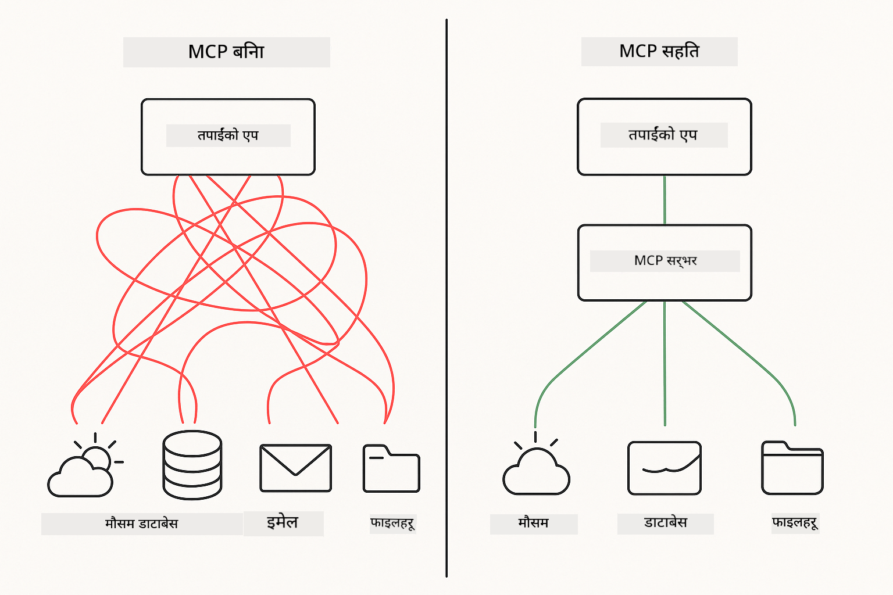
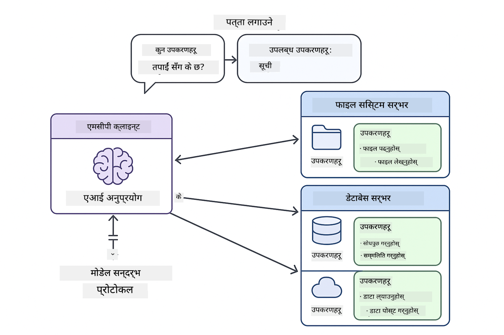
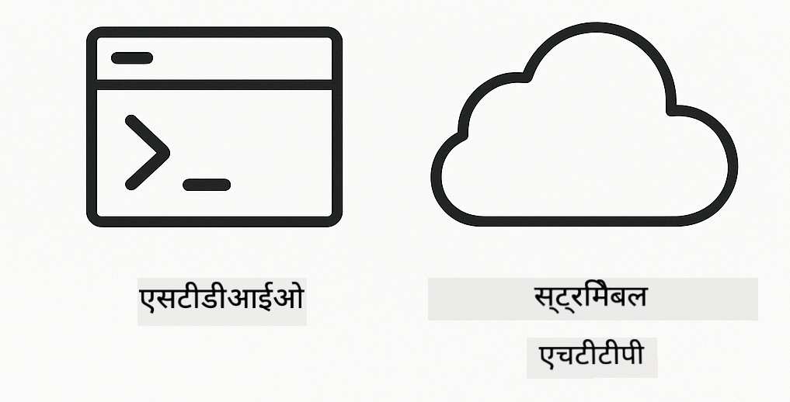

<!--
CO_OP_TRANSLATOR_METADATA:
{
  "original_hash": "c25ec1f10ef156c53e190cdf8b0711ab",
  "translation_date": "2025-12-13T17:47:02+00:00",
  "source_file": "05-mcp/README.md",
  "language_code": "ne"
}
-->
# Module 05: मोडेल सन्दर्भ प्रोटोकल (MCP)

## Table of Contents

- [तपाईंले के सिक्नुहुनेछ](../../../05-mcp)
- [MCP बुझ्न](../../../05-mcp)
- [MCP कसरी काम गर्छ](../../../05-mcp)
  - [सर्भर-क्लाइन्ट आर्किटेक्चर](../../../05-mcp)
  - [टूल डिस्कभरी](../../../05-mcp)
  - [ट्रान्सपोर्ट मेकानिज्महरू](../../../05-mcp)
- [पूर्वआवश्यकताहरू](../../../05-mcp)
- [यस मोड्युलले के समेट्छ](../../../05-mcp)
- [छिटो सुरु](../../../05-mcp)
  - [उदाहरण 1: रिमोट क्यालकुलेटर (Streamable HTTP)](../../../05-mcp)
  - [उदाहरण 2: फाइल अपरेसनहरू (Stdio)](../../../05-mcp)
  - [उदाहरण 3: गिट विश्लेषण (Docker)](../../../05-mcp)
- [मुख्य अवधारणाहरू](../../../05-mcp)
  - [ट्रान्सपोर्ट चयन](../../../05-mcp)
  - [टूल डिस्कभरी](../../../05-mcp)
  - [सेसन व्यवस्थापन](../../../05-mcp)
  - [क्रस-प्लेटफर्म विचारहरू](../../../05-mcp)
- [कहिले MCP प्रयोग गर्ने](../../../05-mcp)
- [MCP इकोसिस्टम](../../../05-mcp)
- [बधाई छ!](../../../05-mcp)
  - [अर्को के हो?](../../../05-mcp)
- [समस्या समाधान](../../../05-mcp)

## तपाईंले के सिक्नुहुनेछ

तपाईंले संवादात्मक AI निर्माण गर्नुभयो, प्रॉम्प्टहरूमा दक्षता हासिल गर्नुभयो, कागजातहरूमा आधारित जवाफहरू तयार गर्नुभयो, र उपकरणहरूसँग एजेन्टहरू सिर्जना गर्नुभयो। तर ती सबै उपकरणहरू तपाईंको विशिष्ट अनुप्रयोगका लागि अनुकूलित थिए। यदि तपाईंले तपाईंको AI लाई यस्तो मानकीकृत उपकरण इकोसिस्टममा पहुँच दिन सक्नुहुन्थ्यो जुन कुनै पनि व्यक्ति सिर्जना र साझा गर्न सक्छ भने के हुन्थ्यो?

मोडेल सन्दर्भ प्रोटोकल (MCP) ठीक त्यही प्रदान गर्छ - AI अनुप्रयोगहरूले बाह्य उपकरणहरू पत्ता लगाउन र प्रयोग गर्नको लागि एक मानक तरिका। प्रत्येक डेटा स्रोत वा सेवाको लागि अनुकूलित एकीकरण लेख्नको सट्टा, तपाईं MCP सर्भरहरूसँग जडान गर्नुहुन्छ जसले आफ्नो क्षमता एक समान ढाँचामा प्रदर्शन गर्छन्। तपाईंको AI एजेन्टले त्यसपछि यी उपकरणहरू स्वचालित रूपमा पत्ता लगाउन र प्रयोग गर्न सक्छ।



*MCP अघि: जटिल पोइन्ट-टु-पोइन्ट एकीकरणहरू। MCP पछि: एक प्रोटोकल, अनन्त सम्भावनाहरू।*

## MCP बुझ्न

MCP AI विकासमा एउटा मौलिक समस्या समाधान गर्छ: प्रत्येक एकीकरण अनुकूलित हुन्छ। GitHub पहुँच गर्न चाहनुहुन्छ? अनुकूलित कोड। फाइलहरू पढ्न चाहनुहुन्छ? अनुकूलित कोड। डेटाबेस सोध्न चाहनुहुन्छ? अनुकूलित कोड। र यी मध्ये कुनै पनि एकीकरण अन्य AI अनुप्रयोगहरूसँग काम गर्दैन।

MCP यसलाई मानकीकृत गर्छ। एक MCP सर्भरले स्पष्ट विवरण र स्किमासहित उपकरणहरू प्रदर्शन गर्छ। कुनै पनि MCP क्लाइन्ट जडान गर्न सक्छ, उपलब्ध उपकरणहरू पत्ता लगाउन सक्छ, र तिनीहरू प्रयोग गर्न सक्छ। एक पटक बनाउनुहोस्, सबै ठाउँमा प्रयोग गर्नुहोस्।



*मोडेल सन्दर्भ प्रोटोकल आर्किटेक्चर - मानकीकृत उपकरण पत्ता लगाउने र कार्यान्वयन*

## MCP कसरी काम गर्छ

**सर्भर-क्लाइन्ट आर्किटेक्चर**

MCP ले क्लाइन्ट-सर्भर मोडेल प्रयोग गर्छ। सर्भरहरूले उपकरणहरू प्रदान गर्छन् - फाइलहरू पढ्ने, डेटाबेस सोध्ने, API कल गर्ने। क्लाइन्टहरू (तपाईंको AI अनुप्रयोग) सर्भरहरूसँग जडान हुन्छन् र तिनीहरूको उपकरणहरू प्रयोग गर्छन्।

**टूल डिस्कभरी**

जब तपाईंको क्लाइन्ट MCP सर्भरसँग जडान हुन्छ, यसले सोध्छ "तपाईंको के-के उपकरणहरू छन्?" सर्भरले उपलब्ध उपकरणहरूको सूची प्रतिक्रिया दिन्छ, प्रत्येकसँग विवरण र प्यारामिटर स्किमासहित। तपाईंको AI एजेन्टले त्यसपछि प्रयोगकर्ताको अनुरोधको आधारमा कुन उपकरणहरू प्रयोग गर्ने निर्णय गर्न सक्छ।

**ट्रान्सपोर्ट मेकानिज्महरू**

MCP ले दुई ट्रान्सपोर्ट मेकानिज्महरू परिभाषित गर्छ: रिमोट सर्भरहरूको लागि HTTP, स्थानीय प्रक्रियाहरू (डोकर कन्टेनरहरू सहित) को लागि Stdio:



*MCP ट्रान्सपोर्ट मेकानिज्महरू: रिमोट सर्भरहरूको लागि HTTP, स्थानीय प्रक्रियाहरू (डोकर कन्टेनरहरू सहित) को लागि Stdio*

**Streamable HTTP** - [StreamableHttpDemo.java](../../../05-mcp/src/main/java/com/example/langchain4j/mcp/StreamableHttpDemo.java)

रिमोट सर्भरहरूको लागि। तपाईंको अनुप्रयोगले नेटवर्कमा कहीं चलिरहेको सर्भरमा HTTP अनुरोधहरू गर्छ। वास्तविक-समय सञ्चारको लागि Server-Sent Events प्रयोग गर्छ।

```java
McpTransport httpTransport = new StreamableHttpMcpTransport.Builder()
    .url("http://localhost:3001/mcp")
    .timeout(Duration.ofSeconds(60))
    .logRequests(true)
    .logResponses(true)
    .build();
```

> **🤖 [GitHub Copilot](https://github.com/features/copilot) Chat सँग प्रयास गर्नुहोस्:** [`StreamableHttpDemo.java`](../../../05-mcp/src/main/java/com/example/langchain4j/mcp/StreamableHttpDemo.java) खोल्नुहोस् र सोध्नुहोस्:
> - "MCP कसरी Module 04 मा जस्तो प्रत्यक्ष उपकरण एकीकरणबाट फरक छ?"
> - "अनुप्रयोगहरू बीच उपकरण साझेदारीका लागि MCP प्रयोग गर्दा के फाइदाहरू छन्?"
> - "MCP सर्भरहरूसँग जडान विफलता वा टाइमआउट कसरी व्यवस्थापन गर्ने?"

**Stdio** - [StdioTransportDemo.java](../../../05-mcp/src/main/java/com/example/langchain4j/mcp/StdioTransportDemo.java)

स्थानीय प्रक्रियाहरूको लागि। तपाईंको अनुप्रयोगले एक सर्भरलाई सबप्रोसेसको रूपमा स्पन गर्छ र मानक इनपुट/आउटपुट मार्फत सञ्चार गर्छ। फाइल सिस्टम पहुँच वा कमाण्ड-लाइन उपकरणहरूको लागि उपयोगी।

```java
McpTransport stdioTransport = new StdioMcpTransport.Builder()
    .command(List.of(
        npmCmd, "exec",
        "@modelcontextprotocol/server-filesystem@0.6.2",
        resourcesDir
    ))
    .logEvents(false)
    .build();
```

> **🤖 [GitHub Copilot](https://github.com/features/copilot) Chat सँग प्रयास गर्नुहोस्:** [`StdioTransportDemo.java`](../../../05-mcp/src/main/java/com/example/langchain4j/mcp/StdioTransportDemo.java) खोल्नुहोस् र सोध्नुहोस्:
> - "Stdio ट्रान्सपोर्ट कसरी काम गर्छ र HTTP सँग तुलना गर्दा कहिले प्रयोग गर्ने?"
> - "LangChain4j ले स्पन गरिएको MCP सर्भर प्रक्रियाहरूको जीवनचक्र कसरी व्यवस्थापन गर्छ?"
> - "AI लाई फाइल सिस्टम पहुँच दिनुका सुरक्षा प्रभावहरू के हुन्?"

**Docker (Stdio प्रयोग गर्छ)** - [GitRepositoryAnalyzer.java](../../../05-mcp/src/main/java/com/example/langchain4j/mcp/GitRepositoryAnalyzer.java)

कन्टेनराइज्ड सेवाहरूको लागि। `docker run` मार्फत डोकर कन्टेनरसँग सञ्चार गर्न stdio ट्रान्सपोर्ट प्रयोग गर्छ। जटिल निर्भरताहरू वा पृथक वातावरणहरूको लागि राम्रो।

```java
McpTransport dockerTransport = new StdioMcpTransport.Builder()
    .command(List.of(
        "docker", "run",
        "-e", "GITHUB_PERSONAL_ACCESS_TOKEN=" + System.getenv("GITHUB_TOKEN"),
        "-v", volumeMapping,
        "-i", "mcp/git"
    ))
    .logEvents(true)
    .build();
```

> **🤖 [GitHub Copilot](https://github.com/features/copilot) Chat सँग प्रयास गर्नुहोस्:** [`GitRepositoryAnalyzer.java`](../../../05-mcp/src/main/java/com/example/langchain4j/mcp/GitRepositoryAnalyzer.java) खोल्नुहोस् र सोध्नुहोस्:
> - "Docker ट्रान्सपोर्टले MCP सर्भरहरूलाई कसरी पृथक गर्छ र के फाइदाहरू छन्?"
> - "होस्ट र MCP कन्टेनरहरू बीच डाटा साझा गर्न भोल्युम माउन्टहरू कसरी कन्फिगर गर्ने?"
> - "उत्पादनमा Docker-आधारित MCP सर्भर जीवनचक्र व्यवस्थापनका लागि उत्तम अभ्यासहरू के हुन्?"

## उदाहरणहरू चलाउने

### पूर्वआवश्यकताहरू

- Java 21+, Maven 3.9+
- Node.js 16+ र npm (MCP सर्भरहरूको लागि)
- **Docker Desktop** - उदाहरण 3 को लागि **चलिरहेको** हुनुपर्छ (मात्र इन्स्टल गरिएको होइन)
- GitHub व्यक्तिगत पहुँच टोकन `.env` फाइलमा कन्फिगर गरिएको (Module 00 बाट)

> **सूचना:** यदि तपाईंले अझै GitHub टोकन सेटअप गर्नुभएको छैन भने, [Module 00 - Quick Start](../00-quick-start/README.md) हेर्नुहोस्।

> **⚠️ Docker प्रयोगकर्ताहरू:** उदाहरण 3 चलाउनु अघि, `docker ps` कमाण्डले Docker Desktop चलिरहेको छ कि छैन जाँच गर्नुहोस्। जडान त्रुटिहरू देखिएमा, Docker Desktop सुरु गर्नुहोस् र करिब ३० सेकेन्ड पर्खनुहोस्।

## छिटो सुरु

**VS Code प्रयोग गर्दा:** एक्सप्लोररमा कुनै पनि डेमो फाइलमा राइट-क्लिक गरी **"Run Java"** चयन गर्नुहोस्, वा Run and Debug प्यानलबाट लन्च कन्फिगरेसनहरू प्रयोग गर्नुहोस् (पहिले `.env` फाइलमा टोकन थप्न नबिर्सनुहोस्)।

**Maven प्रयोग गर्दा:** वैकल्पिक रूपमा, तलका उदाहरणहरू कमाण्ड लाइनबाट चलाउन सक्नुहुन्छ।

**⚠️ महत्त्वपूर्ण:** केही उदाहरणहरूमा पूर्वआवश्यकताहरू छन् (जस्तै MCP सर्भर सुरु गर्नु वा Docker इमेजहरू बनाउनु)। प्रत्येक उदाहरणका आवश्यकताहरू चलाउनु अघि जाँच गर्नुहोस्।

### उदाहरण 1: रिमोट क्यालकुलेटर (Streamable HTTP)

यो नेटवर्क-आधारित उपकरण एकीकरण देखाउँछ।

**⚠️ पूर्वआवश्यकता:** पहिले MCP सर्भर सुरु गर्नुपर्छ (तलको टर्मिनल 1 हेर्नुहोस्)।

**टर्मिनल 1 - MCP सर्भर सुरु गर्नुहोस्:**

**Bash:**
```bash
git clone https://github.com/modelcontextprotocol/servers.git
cd servers/src/everything
npm install
node dist/streamableHttp.js
```

**PowerShell:**
```powershell
git clone https://github.com/modelcontextprotocol/servers.git
cd servers/src/everything
npm install
node dist/streamableHttp.js
```

**टर्मिनल 2 - उदाहरण चलाउनुहोस्:**

**VS Code प्रयोग गर्दा:** `StreamableHttpDemo.java` मा राइट-क्लिक गरी **"Run Java"** चयन गर्नुहोस्।

**Maven प्रयोग गर्दा:**

**Bash:**
```bash
export GITHUB_TOKEN=your_token_here
cd 05-mcp
mvn compile exec:java -Dexec.mainClass=com.example.langchain4j.mcp.StreamableHttpDemo
```

**PowerShell:**
```powershell
$env:GITHUB_TOKEN=your_token_here
cd 05-mcp
mvn --% compile exec:java -Dexec.mainClass=com.example.langchain4j.mcp.StreamableHttpDemo
```

एजेन्टले उपलब्ध उपकरणहरू पत्ता लगाउनेछ, त्यसपछि क्यालकुलेटर प्रयोग गरेर जोड गर्ने कार्य गर्नुहोस्।

### उदाहरण 2: फाइल अपरेसनहरू (Stdio)

यो स्थानीय सबप्रोसेस-आधारित उपकरणहरू देखाउँछ।

**✅ कुनै पूर्वआवश्यकता छैन** - MCP सर्भर स्वचालित रूपमा स्पन हुन्छ।

**VS Code प्रयोग गर्दा:** `StdioTransportDemo.java` मा राइट-क्लिक गरी **"Run Java"** चयन गर्नुहोस्।

**Maven प्रयोग गर्दा:**

**Bash:**
```bash
export GITHUB_TOKEN=your_token_here
cd 05-mcp
mvn compile exec:java -Dexec.mainClass=com.example.langchain4j.mcp.StdioTransportDemo
```

**PowerShell:**
```powershell
$env:GITHUB_TOKEN=your_token_here
cd 05-mcp
mvn --% compile exec:java -Dexec.mainClass=com.example.langchain4j.mcp.StdioTransportDemo
```

अनुप्रयोगले स्वचालित रूपमा फाइल सिस्टम MCP सर्भर स्पन गर्छ र स्थानीय फाइल पढ्छ। कसरी सबप्रोसेस व्यवस्थापन गरिएको छ ध्यान दिनुहोस्।

**अपेक्षित आउटपुट:**
```
Assistant response: The content of the file is "Kaboom!".
```

### उदाहरण 3: गिट विश्लेषण (Docker)

यो कन्टेनराइज्ड उपकरण सर्भरहरू देखाउँछ।

**⚠️ पूर्वआवश्यकताहरू:** 
1. **Docker Desktop चलिरहेको हुनुपर्छ** (मात्र इन्स्टल गरिएको होइन)
2. **Windows प्रयोगकर्ताहरू:** WSL 2 मोड सिफारिस गरिएको (Docker Desktop Settings → General → "Use the WSL 2 based engine")। Hyper-V मोडमा म्यानुअल फाइल साझेदारी कन्फिगरेसन आवश्यक छ।
3. पहिले Docker इमेज बनाउनुहोस् (तलको टर्मिनल 1 हेर्नुहोस्)

**Docker चलिरहेको छ कि छैन जाँच गर्नुहोस्:**

**Bash:**
```bash
docker ps  # कन्टेनर सूची देखाउनु पर्छ, त्रुटि होइन
```

**PowerShell:**
```powershell
docker ps  # कन्टेनर सूची देखाउनु पर्छ, त्रुटि होइन
```

यदि "Cannot connect to Docker daemon" वा "The system cannot find the file specified" जस्ता त्रुटि देखिन्छ भने, Docker Desktop सुरु गर्नुहोस् र करिब ३० सेकेन्ड पर्खनुहोस्।

**समस्या समाधान:**
- AI ले खाली रिपोजिटरी वा फाइलहरू नभएको रिपोर्ट गरेमा, भोल्युम माउन्ट (`-v`) काम गरिरहेको छैन।
- **Windows Hyper-V प्रयोगकर्ताहरू:** प्रोजेक्ट डाइरेक्टरीलाई Docker Desktop Settings → Resources → File sharing मा थप्नुहोस्, त्यसपछि Docker Desktop पुनः सुरु गर्नुहोस्।
- **सिफारिस गरिएको समाधान:** स्वचालित फाइल साझेदारीका लागि WSL 2 मोडमा स्विच गर्नुहोस् (Settings → General → "Use the WSL 2 based engine" सक्षम गर्नुहोस्)।

**टर्मिनल 1 - Docker इमेज बनाउनुहोस्:**

**Bash:**
```bash
cd servers/src/git
docker build -t mcp/git .
```

**PowerShell:**
```powershell
cd servers/src/git
docker build -t mcp/git .
```

**टर्मिनल 2 - विश्लेषक चलाउनुहोस्:**

**VS Code प्रयोग गर्दा:** `GitRepositoryAnalyzer.java` मा राइट-क्लिक गरी **"Run Java"** चयन गर्नुहोस्।

**Maven प्रयोग गर्दा:**

**Bash:**
```bash
export GITHUB_TOKEN=your_token_here
cd 05-mcp
mvn compile exec:java -Dexec.mainClass=com.example.langchain4j.mcp.GitRepositoryAnalyzer
```

**PowerShell:**
```powershell
$env:GITHUB_TOKEN=your_token_here
cd 05-mcp
mvn --% compile exec:java -Dexec.mainClass=com.example.langchain4j.mcp.GitRepositoryAnalyzer
```

अनुप्रयोगले Docker कन्टेनर सुरु गर्छ, तपाईंको रिपोजिटरी माउन्ट गर्छ, र AI एजेन्टमार्फत रिपोजिटरी संरचना र सामग्री विश्लेषण गर्छ।

## मुख्य अवधारणाहरू

**ट्रान्सपोर्ट चयन**

तपाईंका उपकरणहरू कहाँ छन् भन्ने आधारमा छनौट गर्नुहोस्:
- रिमोट सेवाहरू → Streamable HTTP
- स्थानीय फाइल सिस्टम → Stdio
- जटिल निर्भरताहरू → Docker

**टूल डिस्कभरी**

MCP क्लाइन्टहरूले जडान हुँदा उपलब्ध उपकरणहरू स्वचालित रूपमा पत्ता लगाउँछन्। तपाईंको AI एजेन्टले उपकरण विवरणहरू देख्छ र प्रयोगकर्ताको अनुरोध अनुसार कुन उपकरण प्रयोग गर्ने निर्णय गर्छ।

**सेसन व्यवस्थापन**

Streamable HTTP ट्रान्सपोर्टले सेसनहरू कायम राख्छ, जसले रिमोट सर्भरहरूसँग राज्यपूर्ण अन्तरक्रिया अनुमति दिन्छ। Stdio र Docker ट्रान्सपोर्टहरू सामान्यतया स्टेटलेस हुन्छन्।

**क्रस-प्लेटफर्म विचारहरू**

उदाहरणहरूले प्लेटफर्म भिन्नताहरू स्वचालित रूपमा व्यवस्थापन गर्छन् (Windows र Unix कमाण्ड भिन्नता, Docker का लागि पथ रूपान्तरणहरू)। यो विभिन्न वातावरणहरूमा उत्पादन तैनाथीकरणका लागि महत्त्वपूर्ण छ।

## कहिले MCP प्रयोग गर्ने

**MCP प्रयोग गर्नुहोस् जब:**
- तपाईंले अवस्थित उपकरण इकोसिस्टमहरू उपयोग गर्न चाहनुहुन्छ
- धेरै अनुप्रयोगहरूले प्रयोग गर्ने उपकरणहरू निर्माण गर्दै हुनुहुन्छ
- तेस्रो-पक्ष सेवाहरूलाई मानक प्रोटोकलहरूसँग एकीकृत गर्दै हुनुहुन्छ
- तपाईंले कोड परिवर्तन बिना उपकरण कार्यान्वयनहरू स्वाप गर्न चाहनुहुन्छ

**अनुकूलित उपकरणहरू (Module 04) प्रयोग गर्नुहोस् जब:**
- अनुप्रयोग-विशिष्ट कार्यक्षमता निर्माण गर्दै हुनुहुन्छ
- प्रदर्शन अत्यावश्यक छ (MCP ले ओभरहेड थप्छ)
- तपाईंका उपकरणहरू सरल छन् र पुन: प्रयोग हुँदैनन्
- तपाईंलाई कार्यान्वयनमा पूर्ण नियन्त्रण चाहिन्छ

## MCP इकोसिस्टम

मोडेल सन्दर्भ प्रोटोकल एक खुला मानक हो जसको इकोसिस्टम बढ्दैछ:

- सामान्य कार्यहरूको लागि आधिकारिक MCP सर्भरहरू (फाइल सिस्टम, Git, डेटाबेसहरू)
- विभिन्न सेवाहरूका लागि समुदायले योगदान गरेका सर्भरहरू
- मानकीकृत उपकरण विवरण र स्किमाहरू
- क्रस-फ्रेमवर्क अनुकूलता (कुनै पनि MCP क्लाइन्टसँग काम गर्छ)

यस मानकीकरणले एउटा AI अनुप्रयोगका लागि बनाइएका उपकरणहरू अन्यहरूसँग पनि काम गर्छन्, क्षमता साझा गर्ने इकोसिस्टम सिर्जना गर्छ।

## बधाई छ!

तपाईंले LangChain4j for Beginners कोर्स पूरा गर्नुभयो। तपाईंले सिक्नुभयो:

- मेमोरीसहित संवादात्मक AI कसरी बनाउने (Module 01)
- विभिन्न कार्यहरूको लागि प्रॉम्प्ट इन्जिनियरिङ्ग ढाँचाहरू (Module 02)
- RAG मार्फत कागजातहरूमा आधारित जवाफहरू (Module 03)
- अनुकूलित उपकरणहरूसँग AI एजेन्टहरू सिर्जना गर्ने (Module 04)
- MCP मार्फत मानकीकृत उपकरणहरू एकीकृत गर्ने (Module 05)

अब तपाईंले उत्पादन AI अनुप्रयोगहरू निर्माण गर्ने आधार तयार गर्नुभएको छ। तपाईंले सिकेका अवधारणाहरू विशिष्ट फ्रेमवर्क वा मोडेलहरू भन्दा स्वतन्त्र छन् - यी AI इन्जिनियरिङ्गका मौलिक ढाँचाहरू हुन्।

### अर्को के हो?

मोड्युलहरू पूरा गरेपछि, LangChain4j परीक्षण अवधारणाहरूलाई क्रियामा हेर्न [Testing Guide](../docs/TESTING.md) अन्वेषण गर्नुहोस्।

**आधिकारिक स्रोतहरू:**
- [LangChain4j Documentation](https://docs.langchain4j.dev/) - व्यापक मार्गदर्शन र API सन्दर्भ
- [LangChain4j GitHub](https://github.com/langchain4j/langchain4j) - स्रोत कोड र उदाहरणहरू
- [LangChain4j Tutorials](https://docs.langchain4j.dev/tutorials/) - विभिन्न प्रयोगका लागि चरण-दर-चरण ट्यूटोरियलहरू

यो कोर्स पूरा गर्नुभएकोमा धन्यवाद!

---

**नेभिगेसन:** [← अघिल्लो: Module 04 - Tools](../04-tools/README.md) | [मुख्यमा फर्कनुहोस्](../README.md)

---

## समस्या समाधान

### PowerShell Maven कमाण्ड सिन्ट्याक्स
**समस्या**: Maven आदेशहरू `Unknown lifecycle phase ".mainClass=..."` त्रुटिसँग असफल हुन्छन्

**कारण**: PowerShell ले `=` लाई भेरिएबल असाइनमेन्ट अपरेटरको रूपमा व्याख्या गर्छ, जसले Maven प्रोपर्टी सिन्ट्याक्सलाई तोड्छ

**समाधान**: Maven आदेश अघि stop-parsing अपरेटर `--%` प्रयोग गर्नुहोस्:

**PowerShell:**
```powershell
mvn --% compile exec:java -Dexec.mainClass=com.example.langchain4j.mcp.StreamableHttpDemo
```

**Bash:**
```bash
mvn compile exec:java -Dexec.mainClass=com.example.langchain4j.mcp.StreamableHttpDemo
```

`--%` अपरेटरले PowerShell लाई बाँकी सबै आर्गुमेन्टहरू Maven लाई व्याख्या नगरी सिधै पास गर्न भन्छ।

### Docker कनेक्शन समस्याहरू

**समस्या**: Docker आदेशहरू "Cannot connect to Docker daemon" वा "The system cannot find the file specified" सन्देशसहित असफल हुन्छन्

**कारण**: Docker Desktop चलिरहेको छैन वा पूर्ण रूपमा सुरु भएको छैन

**समाधान**: 
1. Docker Desktop सुरु गर्नुहोस्
2. पूर्ण रूपमा सुरु हुन करिब ३० सेकेन्ड पर्खनुहोस्
3. `docker ps` सँग जाँच गर्नुहोस् (कन्टेनर सूची देखाउनु पर्छ, त्रुटि होइन)
4. त्यसपछि तपाईंको उदाहरण चलाउनुहोस्

### Windows Docker भोल्युम माउन्टिङ

**समस्या**: Git रिपोजिटरी विश्लेषकले खाली रिपोजिटरी वा कुनै फाइलहरू नभएको रिपोर्ट गर्छ

**कारण**: फाइल सेयरिङ कन्फिगरेसनका कारण भोल्युम माउन्ट (`-v`) काम गरिरहेको छैन

**समाधान**:
- **सिफारिस गरिएको:** WSL 2 मोडमा स्विच गर्नुहोस् (Docker Desktop Settings → General → "Use the WSL 2 based engine")
- **वैकल्पिक (Hyper-V):** प्रोजेक्ट डाइरेक्टरीलाई Docker Desktop Settings → Resources → File sharing मा थप्नुहोस्, त्यसपछि Docker Desktop पुनः सुरु गर्नुहोस्

---

<!-- CO-OP TRANSLATOR DISCLAIMER START -->
**अस्वीकरण**:
यो दस्तावेज AI अनुवाद सेवा [Co-op Translator](https://github.com/Azure/co-op-translator) प्रयोग गरी अनुवाद गरिएको हो। हामी शुद्धताका लागि प्रयासरत छौं, तर कृपया ध्यान दिनुहोस् कि स्वचालित अनुवादमा त्रुटि वा अशुद्धता हुन सक्छ। मूल दस्तावेज यसको मूल भाषामा आधिकारिक स्रोत मानिनु पर्छ। महत्वपूर्ण जानकारीका लागि व्यावसायिक मानव अनुवाद सिफारिस गरिन्छ। यस अनुवादको प्रयोगबाट उत्पन्न कुनै पनि गलतफहमी वा गलत व्याख्याका लागि हामी जिम्मेवार छैनौं।
<!-- CO-OP TRANSLATOR DISCLAIMER END -->