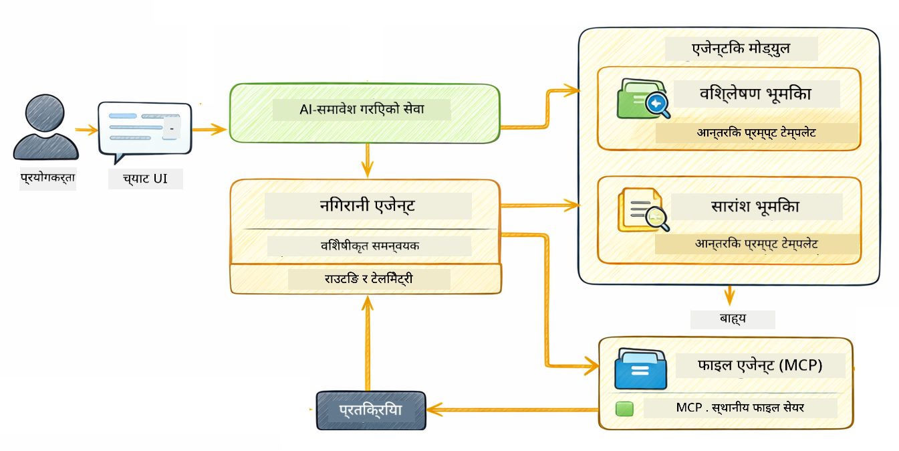

<!--
CO_OP_TRANSLATOR_METADATA:
{
  "original_hash": "f89f4c106d110e4943c055dd1a2f1dff",
  "translation_date": "2025-12-30T23:07:56+00:00",
  "source_file": "05-mcp/README.md",
  "language_code": "ne"
}
-->
# मोड्युल 05: मोडेल कन्टекст प्रोटोकल (MCP)

## सामग्री तालिका

- [तपाईंले के सिक्नुहुनेछ](../../../05-mcp)
- [MCP के हो?](../../../05-mcp)
- [MCP कसरी काम गर्छ](../../../05-mcp)
- [एजेण्टिक मोड्युल](../../../05-mcp)
- [उदाहरणहरू चलाउने तरिका](../../../05-mcp)
  - [पूर्वआवश्यकताहरू](../../../05-mcp)
- [छिटो सुरु](../../../05-mcp)
  - [फाइल अपरेसनहरू (Stdio)](../../../05-mcp)
  - [सुपरवाइजर एजेण्ट](../../../05-mcp)
    - [आउटपुट समझनुहोस्](../../../05-mcp)
    - [एजेण्टिक मोड्युल सुविधाहरूको व्याख्या](../../../05-mcp)
- [मुख्य अवधारणाहरू](../../../05-mcp)
- [बधाई छ!](../../../05-mcp)
  - [अर्को के?](../../../05-mcp)

## तपाईंले के सिक्नुहुनेछ

तपाईंले वार्तालापात्मक AI बनाउनु भयो, प्रम्प्टहरू मास्टर गर्नुभयो, दस्तावेजमा आधारित जवाफहरू बनाउनु भयो, र उपकरणसहितका एजेन्टहरू सिर्जना गर्नुभयो। तर ती सबै उपकरणहरू तपाईंको विशेष एप्लिकेशनका लागि अनुकूलित थिए। के हुन्छ भने तपाईंले आफ्नो AI लाई यस्तो मानकीकृत उपकरण इकोसिस्टममा पहुँच दिनुहोस् जसलाई कुनै पनि व्यक्तिले बनाउन र साझा गर्न सक्छ? यस मोड्युलमा, तपाईंले Model Context Protocol (MCP) र LangChain4j को agentic मोड्युल प्रयोग गरेर त्यही गर्न सिक्नुहुनेछ। हामी पहिले एउटा सादृश्य MCP फाइल रिडर देखाउनेछौं र त्यसपछि कसरी यसलाई सुपरवाइजर एजेण्ट नमुना प्रयोग गरेर उन्नत agentic वर्कफ्लोहरूसँग सजिलै एकीकृत गर्छ भनेर देखाउँछौं।

## MCP के हो?

Model Context Protocol (MCP) ले ठीक त्यही प्रदान गर्छ - AI अनुप्रयोगहरूले बाह्य उपकरणहरू पत्ता लगाउन र प्रयोग गर्नको लागि एक मानकीकृत तरिका। प्रत्येक डाटास्रोत वा सेवाका लागि अनुकूलन एकीकरण लेख्ने सट्टा, तपाईं MCP सर्भरहरूसँग जडान गर्नुहुन्छ जसले आफ्ना क्षमताहरू एकसमान ढाँचामा सार्वजनिक गर्दछन्। तपाईंको AI एजेण्टले त्यसपछि ती उपकरणहरू स्वचालित रूपमा पत्ता लगाउन र प्रयोग गर्न सक्छ।


*MCP अघि: जटिल बिन्दु-देखि-बिन्दु एकीकरणहरू। MCP पछि: एउटै प्रोटोकल, अनन्त सम्भावनाहरू।*

MCP ले AI विकासको एउटा मौलिक समस्या समाधान गर्छ: प्रत्येक एकीकरण अनुकूलन हुन्छ। GitHub पहुँच गर्न चाहनुहुन्छ? अनुकूलन कोड। फाइलहरू पढ्न चाहनुहुन्छ? अनुकूलन कोड। डेटाबेस प्रश्न गर्न चाहनुहुन्छ? अनुकूलन कोड। र ती मध्ये कुनै पनि एकीकरणले अन्य AI अनुप्रयोगहरूसँग काम गर्दैनन्।

MCP यसलाई मानकीकृत गर्छ। एउटा MCP सर्भरले उपकरणहरू स्पष्ट विवरण र स्किमाहरू सहित सार्वजनिक गर्छ। कुनै पनि MCP क्लाइन्टले जडान गरेर उपलब्ध उपकरणहरू पत्ता लगाउन र प्रयोग गर्न सक्छ। एकपटक निर्माण गर्नुहोस्, हरेक ठाउँमा प्रयोग गर्नुहोस्।


*Model Context Protocol वास्तुकला - मानकीकृत उपकरण पत्ता लगाउने र निष्पादन गर्ने प्रणाली*

## MCP कसरी काम गर्छ

**सर्भर-क्लाइन्ट वास्तुकला**

MCP ले क्लाइन्ट-सर्भर मोडेल प्रयोग गर्छ। सर्भरहरूले उपकरणहरू प्रदान गर्छन् - फाइल पढ्ने, डेटाबेस क्वेरी गर्ने, API कल गर्ने। क्लाइन्टहरू (तपाईंको AI अनुप्रयोग) सर्भरसँग जडान गर्छन् र तिनीहरूको उपकरणहरू प्रयोग गर्छन्।

To use MCP with LangChain4j, add this Maven dependency:

```xml
<dependency>
    <groupId>dev.langchain4j</groupId>
    <artifactId>langchain4j-mcp</artifactId>
    <version>${langchain4j.version}</version>
</dependency>
```

**उपकरण पत्ता लगाउने प्रक्रिया**

जब तपाईंको क्लाइन्टले कुनै MCP सर्भरसँग जडान गर्छ, यसले सोध्छ "तपाईंसँग के के उपकरणहरू छन्?" सर्भरले उपलब्ध उपकरणहरूको सूची फर्काउँछ, प्रत्येकमा विवरण र प्यारामिटर स्किमा हुनेछ। तपाईंको AI एजेण्टले त्यसपछि प्रयोगकर्ताको अनुरोधको आधारमा कुन उपकरणहरू प्रयोग गर्ने निर्णय गर्न सक्छ।

**ट्रान्सपोर्ट मेकानिज्महरू**

MCP ले विभिन्न ट्रान्सपोर्ट मेकानिज्महरू समर्थन गर्छ। यो मोड्युलले स्थानीय प्रक्रियाहरूको लागि Stdio ट्रान्सपोर्ट देखाउँछ:


*MCP ट्रान्सपोर्ट मेकानिज्महरू: टाढाका सर्भरहरूका लागि HTTP, स्थानीय प्रक्रियाहरूका लागि Stdio*

**Stdio** - [StdioTransportDemo.java](../../../05-mcp/src/main/java/com/example/langchain4j/mcp/StdioTransportDemo.java)

स्थानीय प्रक्रियाहरूका लागि। तपाईंको एप्लिकेशनले एक सर्भरलाई सबप्रोसेसको रूपमा स्पान गर्छ र स्ट्यान्डर्ड इनपुट/आउटपुट मार्फत संवाद गर्छ। फाइलसिस्टम पहुँच वा कमाण्ड-लाइन उपकरणहरूको लागि उपयोगी।

```java
McpTransport stdioTransport = new StdioMcpTransport.Builder()
    .command(List.of(
        npmCmd, "exec",
        "@modelcontextprotocol/server-filesystem@2025.12.18",
        resourcesDir
    ))
    .logEvents(false)
    .build();
```

> **🤖 Try with [GitHub Copilot](https://github.com/features/copilot) Chat:** Open [`StdioTransportDemo.java`](../../../05-mcp/src/main/java/com/example/langchain4j/mcp/StdioTransportDemo.java) and ask:
> - "How does Stdio transport work and when should I use it vs HTTP?"
> - "How does LangChain4j manage the lifecycle of spawned MCP server processes?"
> - "What are the security implications of giving AI access to the file system?"

## एजेण्टिक मोड्युल

जबकि MCP ले मानकीकृत उपकरणहरू प्रदान गर्छ, LangChain4j को **agentic मोड्युल** ले ती उपकरणहरू समन्वय गर्न declarative तरिका दिन्छ। `@Agent` एनोटेशन र `AgenticServices` ले तपाईंलाई इन्टरफेसहरू मार्फत एजेन्ट व्यवहार परिभाषित गर्न सक्षम बनाउँछन्, imperative कोडको सट्टा।

यस मोड्युलमा, तपाईंले **सुपरवाइजर एजेण्ट** नमुनालाई अन्वेषण गर्नुहुनेछ — एक उन्नत agentic AI दृष्टिकोण जहाँ "सुपरवाइजर" एजेण्टले प्रयोगकर्ताको अनुरोधको आधारमा गतिशील रूपमा कुन उप-एजेण्टहरूलाई बोलाउने निर्णय गर्छ। हामी दुवै अवधारणाहरूलाई संयोजन गर्नेछौं र हाम्रा उप-एजेण्टमध्ये एकलाई MCP-शक्तिकृत फाइल पहुँच क्षमताहरू दिनेछौं।

To use the agentic module, add this Maven dependency:

```xml
<dependency>
    <groupId>dev.langchain4j</groupId>
    <artifactId>langchain4j-agentic</artifactId>
    <version>${langchain4j.mcp.version}</version>
</dependency>
```

> **⚠️ Experimental:** `langchain4j-agentic` मोड्युल **प्रयोगात्मक** छ र परिवर्तन हुन सक्छ। AI सहायकहरू निर्माण गर्ने स्थिर तरिका भनेको `langchain4j-core` र अनुकूलन उपकरणहरू (मोड्युल 04) नै हो।

## उदाहरणहरू चलाउने तरिका

### पूर्वआवश्यकताहरू

- Java 21+, Maven 3.9+
- Node.js 16+ र npm (MCP सर्भरहरूसँगका लागि)
- `.env` फाइलमा कन्फिगर गरिएको वातावरण भेरिएबलहरू (रुट डाइरेक्टरीबाट):
  - **StdioTransportDemo का लागि:** `GITHUB_TOKEN` (GitHub Personal Access Token)
  - **SupervisorAgentDemo का लागि:** `AZURE_OPENAI_ENDPOINT`, `AZURE_OPENAI_API_KEY`, `AZURE_OPENAI_DEPLOYMENT` (मोड्युल 01-04 सँगै का समान)

> **Note:** यदि तपाईंले अझै आफ्नो वातावरण भेरिएबलहरू सेट गर्नु भएको छैन भने, निर्देशहरूको लागि हेर्नुहोस् [Module 00 - Quick Start](../00-quick-start/README.md), वा रुट डाइरेक्टरीमा `.env.example` लाई `.env` मा कपी गरी आफ्नो मानहरू भर्नुहोस्।

## छिटो सुरु

**VS Code प्रयोग गर्दै:** Explorer मा कुनै पनि डेमो फाइलमा राइट-क्लिक गरेर **"Run Java"** चयन गर्नुहोस्, वा Run and Debug प्यानलबाट लन्च कन्फिगरेसनहरू प्रयोग गर्नुहोस् (पहिले तपाईंले आफ्नो टोकन `.env` फाइलमा थप्नुभएको छ भनी सुनिश्चित गर्नुहोस्)।

**Maven प्रयोग गर्दै:** वैकल्पिक रूपमा, तपाईं तलका उदाहरणहरूसँग कमाण्डलाइनबाट चलाउन सक्नुहुन्छ।

### फाइल अपरेसनहरू (Stdio)

यो स्थानीय सबप्रोसेस-आधारित उपकरणहरू प्रदर्शन गर्दछ।

**✅ कुनै पूर्वआवश्यकता छैन** - MCP सर्भर स्वचालित रूपमा स्पन हुन्छ।

**VS Code प्रयोग गर्दै:** `StdioTransportDemo.java` मा राइट-क्लिक गरी **"Run Java"** चयन गर्नुहोस्।

**Maven प्रयोग गर्दै:**

**Bash:**
```bash
export GITHUB_TOKEN=your_token_here
cd 05-mcp
mvn compile exec:java -Dexec.mainClass=com.example.langchain4j.mcp.StdioTransportDemo
```

**PowerShell:**
```powershell
$env:GITHUB_TOKEN=your_token_here
cd 05-mcp
mvn --% compile exec:java -Dexec.mainClass=com.example.langchain4j.mcp.StdioTransportDemo
```

एप्लिकेशनले फाइलसिस्टम MCP सर्भर स्वचालित रूपमा स्पन गर्छ र स्थानीय फाइल पढ्छ। कसरी सबप्रोसेस व्यवस्थापन तपाईंका लागि ह्यान्डल गरिन्छ भन्ने कुरामा ध्यान दिनुहोस्।

**अपेक्षित आउटपुट:**
```
Assistant response: The file provides an overview of LangChain4j, an open-source Java library
for integrating Large Language Models (LLMs) into Java applications...
```

### सुपरवाइजर एजेण्ट




**सुपरवाइजर एजेण्ट नमुना** एक **लचिलो** प्रकारको agentic AI हो। निर्णायक वर्कफ्लोहरू (अनुक्रमिक, लूप, समानान्तर) भन्दा फरक, एक सुपरवाइजरले प्रयोगकर्ताको अनुरोधको आधारमा कुन एजेण्टहरू बोलाउने स्वतन्त्र निर्णय लिन LLM प्रयोग गर्छ।

**सुपरवाइजर र MCP को संयोजन:** यस उदाहरणमा, हामीले `FileAgent` लाई `toolProvider(mcpToolProvider)` मार्फत MCP फाइल सिस्टम उपकरणहरूको पहुँच दिन्छौं। जब प्रयोगकर्ताले "फाइल पढेर विश्लेषण गर" भनेर माग्छ, सुपरवाइजरले अनुरोध विश्लेषण गरी एक कार्य योजना उत्पादन गर्छ। त्यसपछि यो अनुरोध `FileAgent` तर्फ राउट गर्छ, जुन MCP को `read_file` उपकरण प्रयोग गरी सामग्री प्राप्त गर्छ। सुपरवाइजरले त्यो सामग्री `AnalysisAgent` लाई व्याख्या गर्न दिन्छ, र आवश्यक परे `SummaryAgent` लाई नतिजा संक्षेप गर्न बोलाउँछ।

यसले देखाउँछ कि MCP उपकरणहरू कसरी agentic वर्कफ्लोहरूसँग सहज रूपमा एकीकृत हुन्छन् — सुपरवाइजरले फाइलहरू कसरी पढिन्छ थाहा पाउन आवश्यक छैन, केवल `FileAgent` ले त्यो गर्न सक्छ भन्ने ज्ञान चाहिन्छ। सुपरवाइजर विभिन्न प्रकारका अनुरोधहरूमा गतिशील रूपमा अनुकूल हुन्छ र अन्तिम एजेण्टको प्रतिक्रिया वा सबै अपरेशनहरूको सारांश फर्काउँछ।

**स्टार्ट स्क्रिप्टहरू प्रयोग गर्दै (सिफारिस गरिन्छ):**

स्टार्ट स्क्रिप्टहरूले रुट `.env` फाइलबाट वातावरण भेरिएबलहरू स्वचालित रूपमा लोड गर्छन्:

**Bash:**
```bash
cd 05-mcp
chmod +x start.sh
./start.sh
```

**PowerShell:**
```powershell
cd 05-mcp
.\start.ps1
```

**VS Code प्रयोग गर्दै:** `SupervisorAgentDemo.java` मा राइट-क्लिक गरी **"Run Java"** चयन गर्नुहोस् (तपाईंको `.env` फाइल कन्फिगर गरिएको छ भनी सुनिश्चित गर्नुहोस्)।

**सुपरवाइजर कसरी काम गर्छ:**

```java
// विशिष्ट क्षमताहरू भएका बहु एजेन्टहरू परिभाषित गर्नुहोस्
FileAgent fileAgent = AgenticServices.agentBuilder(FileAgent.class)
        .chatModel(model)
        .toolProvider(mcpToolProvider)  // फाइल सञ्चालनका लागि MCP उपकरणहरू छन्
        .build();

AnalysisAgent analysisAgent = AgenticServices.agentBuilder(AnalysisAgent.class)
        .chatModel(model)
        .build();

SummaryAgent summaryAgent = AgenticServices.agentBuilder(SummaryAgent.class)
        .chatModel(model)
        .build();

// यी एजेन्टहरूलाई समन्वय गर्ने एक सुपरवाइजर सिर्जना गर्नुहोस्
SupervisorAgent supervisor = AgenticServices.supervisorBuilder()
        .chatModel(model)  // "planner" मोडेल
        .subAgents(fileAgent, analysisAgent, summaryAgent)
        .responseStrategy(SupervisorResponseStrategy.SUMMARY)
        .build();

// सुपरवाइजरले स्वतः कुन एजेन्टहरूलाई आह्वान गर्ने निर्णय गर्छ
// बस प्राकृतिक भाषा अनुरोध पठाउनुहोस् - LLM ले कार्यान्वयनको योजना बनाउँछ
String response = supervisor.invoke("Read the file at /path/file.txt and analyze it");
```

पूरा कार्यान्वयनका लागि हेर्नुहोस् [SupervisorAgentDemo.java](../../../05-mcp/src/main/java/com/example/langchain4j/mcp/SupervisorAgentDemo.java)।

> **🤖 Try with [GitHub Copilot](https://github.com/features/copilot) Chat:** Open [`SupervisorAgentDemo.java`](../../../05-mcp/src/main/java/com/example/langchain4j/mcp/SupervisorAgentDemo.java) and ask:
> - "How does the Supervisor decide which agents to invoke?"
> - "What's the difference between Supervisor and Sequential workflow patterns?"
> - "How can I customize the Supervisor's planning behavior?"

#### आउटपुट समझनुहोस्

जब तपाईं डेमो चलाउनुहुन्छ, तपाईंले सुपरवाइजरले कसरी बहु एजेण्टहरू समन्वय गर्छ भन्ने संरचित walkthrough देख्नुहुनेछ। प्रत्येक सेक्सनले के अर्थ राख्छ:

```
======================================================================
  SUPERVISOR AGENT DEMO
======================================================================

This demo shows how a Supervisor Agent orchestrates multiple specialized agents.
The Supervisor uses an LLM to decide which agent to call based on the task.
```

**हेडर** ले डेमो परिचय गराउँछ र मुख्य अवधारणा बुझाउँछ: सुपरवाइजरले कुन एजेण्टहरू कल गर्ने निर्णय गर्न LLM प्रयोग गर्छ (हार्डकोड गरिएको नियम होइन)।

```
--- AVAILABLE AGENTS -------------------------------------------------
  [FILE]     FileAgent     - Reads files using MCP filesystem tools
  [ANALYZE]  AnalysisAgent - Analyzes content for structure, tone, and themes
  [SUMMARY]  SummaryAgent  - Creates concise summaries of content
```

**उपलब्ध एजेण्टहरू** ले सुपरवाइजरले रोज्न सक्ने तीन विशेषज्ञ एजेण्टहरू देखाउँछ। प्रत्येक एजेण्टसँग एक विशेष क्षमता हुन्छ:
- **FileAgent** ले MCP उपकरणहरू प्रयोग गरी फाइलहरू पढ्न सक्छ (बाह्य क्षमता)
- **AnalysisAgent** ले सामग्री विश्लेषण गर्छ (सिर्फ LLM क्षमता)
- **SummaryAgent** ले सारांश तयार गर्छ (सिर्फ LLM क्षमता)

```
--- USER REQUEST -----------------------------------------------------
  "Read the file at .../file.txt and analyze what it's about"
```

**प्रयोगकर्ता अनुरोध** ले के सोधियो भन्ने देखाउँछ। सुपरवाइजरले यसलाई पार्स गरेर कुन एजेण्टहरू बोलाउने निर्णय गर्नुपर्छ।

```
--- SUPERVISOR ORCHESTRATION -----------------------------------------
  The Supervisor will now decide which agents to invoke and in what order...

  +-- STEP 1: Supervisor chose -> FileAgent (reading file via MCP)
  |
  |   Input: .../file.txt
  |
  |   Result: LangChain4j is an open-source Java library designed to simplify...
  +-- [OK] FileAgent (reading file via MCP) completed

  +-- STEP 2: Supervisor chose -> AnalysisAgent (analyzing content)
  |
  |   Input: LangChain4j is an open-source Java library...
  |
  |   Result: Structure: The content is organized into clear paragraphs that int...
  +-- [OK] AnalysisAgent (analyzing content) completed
```

**सुपरवाइजर समन्वय** त्यही ठाउँ हो जहाँ जादु हुन्छ। हेर्नुहोस् कसरी:
1. सुपरवाइजरले **पहिले FileAgent छाने** किनकि अनुरोधमा "फाइल पढ" भन्ने उल्लेख थियो
2. FileAgent ले फाइल सामग्री प्राप्त गर्न MCP को `read_file` उपकरण प्रयोग गर्यो
3. त्यसपछि सुपरवाइजरले **AnalysisAgent छाने** र फाइल सामग्री त्यसलाई पास गर्यो
4. AnalysisAgent ले संरचना, टोन, र थीमहरू विश्लेषण गर्यो

ध्यान दिनुहोस् सुपरवाइजरले यी निर्णयहरू प्रयोगकर्ताको अनुरोधको आधारमा **स्वतन्त्रतापूर्वक** बनायो — कुनै हार्डकोड गरिएको वर्कफ्लो थिएन!

**अन्तिम उत्तर** सुपरवाइजरले संयोजन गरेको उत्तर हो, जसले सबै एजेण्टहरूको आउटपुटहरू समावेश गर्छ। उदाहरणले प्रत्येक एजेण्टद्वारा स्टोर गरिएको सारांश र विश्लेषण नतिजाहरू देखाउँदै agentic scope डम्प गर्छ।

```
--- FINAL RESPONSE ---------------------------------------------------
I read the contents of the file and analyzed its structure, tone, and key themes.
The file introduces LangChain4j as an open-source Java library for integrating
large language models...

--- AGENTIC SCOPE (Shared Memory) ------------------------------------
  Agents store their results in a shared scope for other agents to use:
  * summary: LangChain4j is an open-source Java library...
  * analysis: Structure: The content is organized into clear paragraphs that in...
```

### एजेण्टिक मोड्युल सुविधाहरूको व्याख्या

उदाहरणले agentic मोड्युलका केही उन्नत सुविधाहरू देखाउँछ। आउनुहोस् Agentic Scope र Agent Listeners नजिकबाट हेरौं।

**Agentic Scope** ले साझा मेमोरी देखाउँछ जहाँ एजेण्टहरूले आफ्नो नतिजा `@Agent(outputKey="...")` प्रयोग गरी भण्डार गर्छन्। यसले अनुमति दिन्छ:
- पछि आउने एजेण्टहरूले पहिलेका एजेण्टहरूको आउटपुटहरू पहुँच गर्न
- सुपरवाइजरले अन्तिम प्रतिक्रिया संश्लेषण गर्न
- तपाईंले हरेक एजेण्टले के उत्पादन गर्यो भनेर निरीक्षण गर्न

```java
ResultWithAgenticScope<String> result = supervisor.invokeWithAgenticScope(request);
AgenticScope scope = result.agenticScope();
String story = scope.readState("story");
List<AgentInvocation> history = scope.agentInvocations("analysisAgent");
```

**Agent Listeners** ले एजेण्ट कार्यान्वयनको अनुगमन र डिबगिंग सक्षम पार्दछ। डेमोमा देखिने चरण-दर-चरण आउटपुट AgentListener बाट आउँछ जुन हरेक एजेण्ट आह्वानमा हुक हुन्छ:
- **beforeAgentInvocation** - जब सुपरवाइजरले एजेण्ट चयन गर्छ तब बोलाइन्छ, जसले कुन एजेण्ट र किन चयन भयो देखाउँछ
- **afterAgentInvocation** - जब एजेण्ट पूरा हुन्छ तब बोलाइन्छ, यसको परिणाम देखाउँदै
- **inheritedBySubagents** - जब true हुन्छ, लिस्नरले हाइरार्कीमा रहेका सबै एजेण्टहरूलाई अनुगमन गर्छ

```java
AgentListener monitor = new AgentListener() {
    private int step = 0;
    
    @Override
    public void beforeAgentInvocation(AgentRequest request) {
        step++;
        System.out.println("  +-- STEP " + step + ": " + request.agentName());
    }
    
    @Override
    public void afterAgentInvocation(AgentResponse response) {
        System.out.println("  +-- [OK] " + response.agentName() + " completed");
    }
    
    @Override
    public boolean inheritedBySubagents() {
        return true; // सबै उप-एजेन्टहरूमा प्रसारित गर्नुहोस्
    }
};
```

सुपरवाइजर नमुनाबाट बाहिर पनि, `langchain4j-agentic` मोड्युलले विभिन्न शक्तिशाली वर्कफ्लो नमुनाहरू र सुविधाहरू प्रदान गर्छ:

| नमुना | वर्णन | प्रयोग केस |
|---------|-------------|----------|
| **Sequential** | एजेण्टहरूलाई क्रमिक रूपमा कार्यान्वयन गर्नुहोस्, आउटपुट अर्कोमा प्रवाह गर्दछ | पाइपलाइनहरू: अनुसन्धान → विश्लेषण → रिपोर्ट |
| **Parallel** | एजेण्टहरूलाई एकैसाथ चलाउनुहोस् | स्वतन्त्र कार्यहरू: मौसम + समाचार + स्टकहरू |
| **Loop** | सर्त पूरा नहुन्जेल दोहोर्याउनुहोस् | गुणस्तर मूल्यांकन: स्कोर ≥ 0.8 नभएसम्म सुधार |
| **Conditional** | सर्तहरूको आधारमा राउट गर्नुहोस् | वर्गीकरण → विशेषज्ञ एजेण्ट तर्फ राउट गर्नु |
| **Human-in-the-Loop** | मानव जाँचबिन्दु थप्नुहोस् | अनुमोदन वर्कफ्लोहरू, सामग्री समीक्षा |

## मुख्य अवधारणाहरू

**MCP** उपयुक्त छ जब तपाईं पहिलेको उपकरण इकोसिस्टमहरू उपयोग गर्न चाहनुहुन्छ, त्यस्ता उपकरणहरू बनाउन चाहनुहुन्छ जुन धेरै अनुप्रयोगहरूले साझा गर्न सकून्, तेस्रो-पक्ष सेवाहरूलाई मानक प्रोटोकलहरूसँग एकीकृत गर्न चाहनुहुन्छ, वा उपकरणको कार्यान्वयन परिवर्तन गर्दा कोड परिवर्तन नगरी स्वैप गर्न चाहनुहुन्छ।

**एजेण्टिक मोड्युल** सबैभन्दा राम्रो काम गर्छ जब तपाईंले `@Agent` एनोटेशनहरूसँग घोषणात्मक एजेण्ट परिभाषाहरू चाहनुहुन्छ, वर्कफ्लो समन्वय (अनुक्रमिक, लूप, समानान्तर) आवश्यक छ, इन्टरफेस-आधारित एजेण्ट डिजाइन प्राथमिकता दिनुहुन्छ, वा बहु एजेण्टहरू जसले `outputKey` मार्फत आउटपुट साझा गर्छन् संयुक्त गर्दै हुनुहुन्छ।

**सुपरवाइजर एजेण्ट नमुना** त्यति बेला चम्किन्छ जब वर्कफ्लो पहिलेबाट पूर्वानुमेय हुँदैन र तपाईंले LLM ले निर्णय गर्न चाहनुहुन्छ, जब तपाईंसँग धेरै विशेषज्ञ एजेण्टहरू छन् जुन गतिशील समन्वय आवश्यक पर्छ, कुराकानी प्रणालीहरू निर्माण गर्दा जुन विभिन्न क्षमताहरूमा राउट गर्छन्, वा जब तपाईंले सबैभन्दा लचिलो, अनुकूलनीय एजेण्ट व्यवहार चाहनुहुन्छ।

## बधाई छ!

तपाईंले LangChain4j for Beginners कोर्स पूरा गर्नुभयो। तपाईंले सिक्नुभएको छ:

- मेमोरीसहितको वार्तालापात्मक AI कसरी बनाउने (मोड्युल 01)
- विभिन्न कार्यहरूको लागि प्रम्प्ट इञ्जिनियरिङ्ग ढाँचा (मोड्युल 02)
- RAG प्रयोग गरेर तपाईंको दस्तावेजहरूमा आधारित जवाफहरू कसरी गर्न सकिन्छ (मोड्युल 03)
- अनुकूलन उपकरणहरूसँग आधारभूत AI एजेण्टहरू कसरी सिर्जना गर्ने (मोड्युल 04)
- LangChain4j MCP र Agentic मोड्युलहरूसँग मानकीकृत औजारहरू एकीकृत गर्दै (मोड्युल 05)

### अब के?

मोड्युलहरू पूरा गरेपछि, LangChain4j परीक्षण अवधारणाहरू क्रियाशील अवस्थामा देख्नका लागि [परीक्षण मार्गदर्शिका](../docs/TESTING.md) अन्वेषण गर्नुहोस्।

**आधिकारिक स्रोतहरू:**
- [LangChain4j Documentation](https://docs.langchain4j.dev/) - व्यापक मार्गदर्शिका र API सन्दर्भ
- [LangChain4j GitHub](https://github.com/langchain4j/langchain4j) - स्रोत कोड र उदाहरणहरू
- [LangChain4j Tutorials](https://docs.langchain4j.dev/tutorials/) - विभिन्न प्रयोग मामिलाहरूका लागि चरण-दर-चरण ट्युटोरियलहरू

यो पाठ्यक्रम पूरा गर्नुभएकोमा धन्यवाद!

---

**नेभिगेसन:** [← अघिल्लो: मोड्युल 04 - उपकरणहरू](../04-tools/README.md) | [मुख्य पृष्ठमा फर्कनुहोस्](../README.md)

---

<!-- CO-OP TRANSLATOR DISCLAIMER START -->
अस्वीकरण:
यो दस्तावेज AI अनुवाद सेवा [Co-op Translator](https://github.com/Azure/co-op-translator) प्रयोग गरेर अनुवाद गरिएको हो। हामी सटीकताका लागि प्रयासरत भए तापनि, कृपया ध्यान दिनुहोस् कि स्वचालित अनुवादमा त्रुटि वा अशुद्धता हुन सक्छ। मूल दस्तावेजलाई यसको मूल भाषामा रहेको आधिकारिक स्रोत मानिनुपर्छ। महत्त्वपूर्ण जानकारीका लागि व्यावसायिक मानव अनुवाद सिफारिस गरिन्छ। यस अनुवादको प्रयोगबाट उत्पन्न हुने कुनै पनि गलतफहमी वा गलत व्याख्याका लागि हामी जिम्मेवार हुनेछैनौं।
<!-- CO-OP TRANSLATOR DISCLAIMER END -->