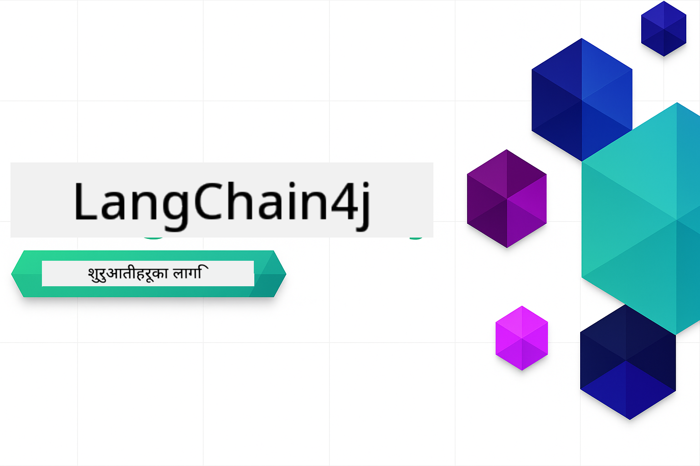
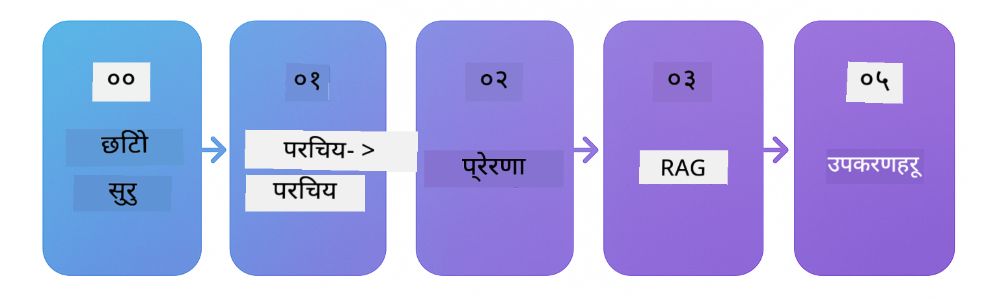

<!--
CO_OP_TRANSLATOR_METADATA:
{
  "original_hash": "1e85afe0b0ee47fc09b20442b0ee4ca5",
  "translation_date": "2025-12-23T09:13:34+00:00",
  "source_file": "README.md",
  "language_code": "ne"
}
-->


### 🌐 बहु-भाषा समर्थन

#### GitHub Action मार्फत समर्थन (स्वचालित र सधैं अद्यावधिक)

<!-- CO-OP TRANSLATOR LANGUAGES TABLE START -->
[अरबी](../ar/README.md) | [बंगाली](../bn/README.md) | [बुल्गेरियन](../bg/README.md) | [बर्मी (म्यान्मार)](../my/README.md) | [चिनियाँ (सरलीकृत)](../zh/README.md) | [चिनियाँ (परम्परागत, हङकङ)](../hk/README.md) | [चिनियाँ (परम्परागत, मकाउ)](../mo/README.md) | [चिनियाँ (परम्परागत, ताइवान)](../tw/README.md) | [क्रोएशियन](../hr/README.md) | [चेक](../cs/README.md) | [डेनीश](../da/README.md) | [डच](../nl/README.md) | [एस्टोनियाली](../et/README.md) | [फिनिश](../fi/README.md) | [फ्रेन्च](../fr/README.md) | [जर्मन](../de/README.md) | [ग्रीक](../el/README.md) | [हिब्रु](../he/README.md) | [हिन्दी](../hi/README.md) | [हंगेरीयन](../hu/README.md) | [इन्डोनेशियाली](../id/README.md) | [इटालियन](../it/README.md) | [जापानी](../ja/README.md) | [कन्नड](../kn/README.md) | [कोरियन](../ko/README.md) | [लिथुआनियन](../lt/README.md) | [मलय](../ms/README.md) | [मलयालम](../ml/README.md) | [मराठी](../mr/README.md) | [नेपाली](./README.md) | [नाइजेरियन पिजिन](../pcm/README.md) | [नर्वेजियन](../no/README.md) | [फारसी (Farsi)](../fa/README.md) | [पोलिश](../pl/README.md) | [पुर्तगाली (ब्राजिल)](../br/README.md) | [पुर्तगाली (पुर्तगाल)](../pt/README.md) | [पंजाबी (गुरमुखी)](../pa/README.md) | [रोमानियन](../ro/README.md) | [रूसी](../ru/README.md) | [सर्बियाली (सिरिलिक)](../sr/README.md) | [स्लोभाक](../sk/README.md) | [स्लोभेनियन](../sl/README.md) | [स्पेनिश](../es/README.md) | [स्वाहिली](../sw/README.md) | [स्वीडिश](../sv/README.md) | [ट्यागालोग (फिलिपिनो)](../tl/README.md) | [तमिल](../ta/README.md) | [तेलुगु](../te/README.md) | [थाई](../th/README.md) | [टर्की](../tr/README.md) | [युक्रेनी](../uk/README.md) | [उर्दु](../ur/README.md) | [भियतनामी](../vi/README.md)
<!-- CO-OP TRANSLATOR LANGUAGES TABLE END -->

# LangChain4j शुरुवातकर्ताहरूका लागि

LangChain4j र Azure OpenAI GPT-5 सँग AI अनुप्रयोगहरू बनाउनको लागि एउटा कोर्स, आधारभूत चैटदेखि AI एजेन्टहरूसम्म।

**LangChain4j नयाँ हुनुहुन्छ?** प्रमुख शर्तहरू र अवधारणाहरूका परिभाषाहरूको लागि [Glossary](docs/GLOSSARY.md) हेर्नुहोस्।

## सामग्री तालिका

1. [Quick Start](00-quick-start/README.md) - LangChain4j सुरु गर्नुहोस्
2. [Introduction](01-introduction/README.md) - LangChain4j का आधारभूत सिद्धान्तहरू जान्नुहोस्
3. [Prompt Engineering](02-prompt-engineering/README.md) - प्रभावकारी प्रम्प्ट डिजाइनमा दक्षता हासिल गर्नुहोस्
4. [RAG (Retrieval-Augmented Generation)](03-rag/README.md) - बुद्धिमान ज्ञान-आधारित प्रणालीहरू बनाउनुहोस्
5. [Tools](04-tools/README.md) - बाह्य उपकरणहरू र API हरूलाई AI एजेन्टहरूसँग एकीकृत गर्नुहोस्
6. [MCP (Model Context Protocol)](05-mcp/README.md) - Model Context Protocol सँग काम गर्नुहोस्
---

##  सिकाइ मार्ग

> **द्रुत सुरु**

1. यो repository लाई तपाईंको GitHub खातामा Fork गर्नुहोस्
2. क्लिक गर्नुहोस् **Code** → **Codespaces** tab → **...** → **New with options...**
3. पूर्वनिर्धारित सेटिङहरू प्रयोग गर्नुहोस् – यसले यस कोर्सको लागि सिर्जना गरिएको Development container चयन गर्नेछ
4. क्लिक गर्नुहोस् **Create codespace**
5. वातावरण तयार हुन 5-10 मिनेट पर्खनुहोस्
6. सुरु गर्न [Quick Start](./00-quick-start/README.md) मा सिधै जानुहोस्!

> **स्थानीय रूपमा Clone गर्न रुचाउनुहुन्छ?**
>
> यस repository मा 50+ भाषा अनुवादहरू समावेश छन् जसले डाउनलोड साइज उल्लेखनीय रूपमा बढाउँछ। अनुवादहरू बिना क्लोन गर्न, sparse checkout प्रयोग गर्नुहोस्:
> ```bash
> git clone --filter=blob:none --sparse https://github.com/microsoft/LangChain4j-for-Beginners.git
> cd LangChain4j-for-Beginners
> git sparse-checkout set --no-cone '/*' '!translations' '!translated_images'
> ```
> यसले पाठ्यक्रम पूरा गर्न आवश्यक सबै कुरा दिन्छ र डाउनलोड धेरै छिटो हुन्छ।

[Quick Start](00-quick-start/README.md) मोड्युलबाट सुरु गर्नुहोस् र हरेक मोड्युलमार्फत प्रगति गर्दै चरण-दर-चरण आफ्नो सीप निर्माण गर्नुहोस्। आधारभूत उदाहरणहरू प्रयास गरेर तपाईंले मूल सिद्धान्तहरू बुझ्नु हुनेछ र त्यसपछि GPT-5 सँग गहिरो जानकारीका लागि [Introduction](01-introduction/README.md) मोड्युलमा जानुहोस्।



मोड्युलहरू पूरा गरेपछि, LangChain4j परीक्षण अवधारणाहरूलाई व्यवहारमा कसरी लागू गरिन्छ हेर्न [Testing Guide](docs/TESTING.md) अन्वेषण गर्नुहोस्।

> **नोट:** यो प्रशिक्षणले GitHub Models र Azure OpenAI दुबै प्रयोग गर्दछ। [Quick Start](00-quick-start/README.md) र [MCP](05-mcp/README.md) मोड्युलहरूले GitHub Models प्रयोग गर्छन् (Azure सदस्यता आवश्यक छैन), जबकि मोड्युल 1-4 मा Azure OpenAI GPT-5 प्रयोग गरिन्छ।


## GitHub Copilot सँग सिकाइ

छिटो कोड लेख्न सुरु गर्न, यो प्रोजेक्ट GitHub Codespace मा खोल्नुहोस् वा प्रदान गरिएको devcontainer सहित तपाईंको स्थानीय IDE मा खोल्नुहोस्। यस कोर्समा प्रयोग गरिएको devcontainer GitHub Copilot सँग AI जोडिएको प्रोग्रामिङका लागि पूर्व-कन्फिगर गरिएको हुन्छ।

हरेक कोड उदाहरणमा GitHub Copilot लाई सोध्न सकिने सुझाब प्रश्नहरू समावेश छन् जसले तपाईंको बुझाइलाई गहिरो बनाउँछ। तलका स्थानमा 💡/🤖 संकेतहरू खोज्नुहोस्:

- **Java file headers** - हरेक उदाहरणका लागि विशिष्ट प्रश्नहरू
- **Module READMEs** - कोड उदाहरणहरू पछि अन्वेषण गर्ने प्रश्नहरू

**कसरी प्रयोग गर्ने:** कुनै पनि कोड फाइल खोल्नुहोस् र सुझाइएको प्रश्नहरू Copilot लाई सोध्नुहोस्। यससँग कोडबेसको पूर्ण सन्दर्भ हुन्छ र यो व्याख्या, विस्तार र वैकल्पिक सुझावहरू दिन सक्छ।

अझै सिक्न चाहनुहुन्छ? हेर्नुहोस् [Copilot for AI Paired Programming](https://aka.ms/GitHubCopilotAI).


## थप स्रोतहरू

<!-- CO-OP TRANSLATOR OTHER COURSES START -->
### LangChain
[](https://aka.ms/langchain4j-for-beginners)
[](https://aka.ms/langchainjs-for-beginners?WT.mc_id=m365-94501-dwahlin)

---

### Azure / Edge / MCP / Agents
[](https://github.com/microsoft/AZD-for-beginners?WT.mc_id=academic-105485-koreyst)
[](https://github.com/microsoft/edgeai-for-beginners?WT.mc_id=academic-105485-koreyst)
[](https://github.com/microsoft/mcp-for-beginners?WT.mc_id=academic-105485-koreyst)
[](https://github.com/microsoft/ai-agents-for-beginners?WT.mc_id=academic-105485-koreyst)

---
 
### Generative AI Series
[](https://github.com/microsoft/generative-ai-for-beginners?WT.mc_id=academic-105485-koreyst)
[-9333EA?style=for-the-badge&labelColor=E5E7EB&color=9333EA)](https://github.com/microsoft/Generative-AI-for-beginners-dotnet?WT.mc_id=academic-105485-koreyst)
[-C084FC?style=for-the-badge&labelColor=E5E7EB&color=C084FC)](https://github.com/microsoft/generative-ai-for-beginners-java?WT.mc_id=academic-105485-koreyst)
[-E879F9?style=for-the-badge&labelColor=E5E7EB&color=E879F9)](https://github.com/microsoft/generative-ai-with-javascript?WT.mc_id=academic-105485-koreyst)

---
 
### Core Learning
[](https://aka.ms/ml-beginners?WT.mc_id=academic-105485-koreyst)
[](https://aka.ms/datascience-beginners?WT.mc_id=academic-105485-koreyst)
[](https://aka.ms/ai-beginners?WT.mc_id=academic-105485-koreyst)
[](https://github.com/microsoft/Security-101?WT.mc_id=academic-96948-sayoung)
[](https://aka.ms/webdev-beginners?WT.mc_id=academic-105485-koreyst)
[](https://aka.ms/iot-beginners?WT.mc_id=academic-105485-koreyst)

[](https://github.com/microsoft/xr-development-for-beginners?WT.mc_id=academic-105485-koreyst)

---
 
### Copilot शृंखला
[](https://aka.ms/GitHubCopilotAI?WT.mc_id=academic-105485-koreyst)
[](https://github.com/microsoft/mastering-github-copilot-for-dotnet-csharp-developers?WT.mc_id=academic-105485-koreyst)
[](https://github.com/microsoft/CopilotAdventures?WT.mc_id=academic-105485-koreyst)
<!-- CO-OP TRANSLATOR OTHER COURSES END -->

## सहायता

यदि तपाईं अड्किनुभयो वा AI एपहरू निर्माण सम्बन्धी कुनै प्रश्न छ भने, सामेल हुनुहोस्:

[](https://aka.ms/foundry/discord)

यदि तपाईंको उत्पादन सम्बन्धी प्रतिक्रिया वा निर्माण गर्दा त्रुटिहरू छन् भने भ्रमण गर्नुहोस्:

[](https://aka.ms/foundry/forum)

## लाइसेन्स

MIT License - विस्तृत जानकारीका लागि [LICENSE](../../LICENSE) file for details.

---

<!-- CO-OP TRANSLATOR DISCLAIMER START -->
अस्वीकरण:
यो दस्तावेज AI अनुवाद सेवा Co-op Translator (https://github.com/Azure/co-op-translator) प्रयोग गरी अनुवाद गरिएको हो। हामी शुद्धताको लागि प्रयास गर्छौं, तर कृपया ध्यान दिनुहोस् कि स्वचालित अनुवादहरूमा त्रुटि वा अशुद्धता हुन सक्छ। मूल भाषामा रहेको दस्तावेजलाई अधिकारिक स्रोत मानिनुपर्छ। महत्वपूर्ण जानकारीका लागि पेशेवर मानव अनुवाद सिफारिस गरिन्छ। यो अनुवादको प्रयोगबाट उत्पन्न हुने कुनै पनि गलतफहमी वा गलत व्याख्याका लागि हामी जिम्मेवार छैनौं।
<!-- CO-OP TRANSLATOR DISCLAIMER END -->