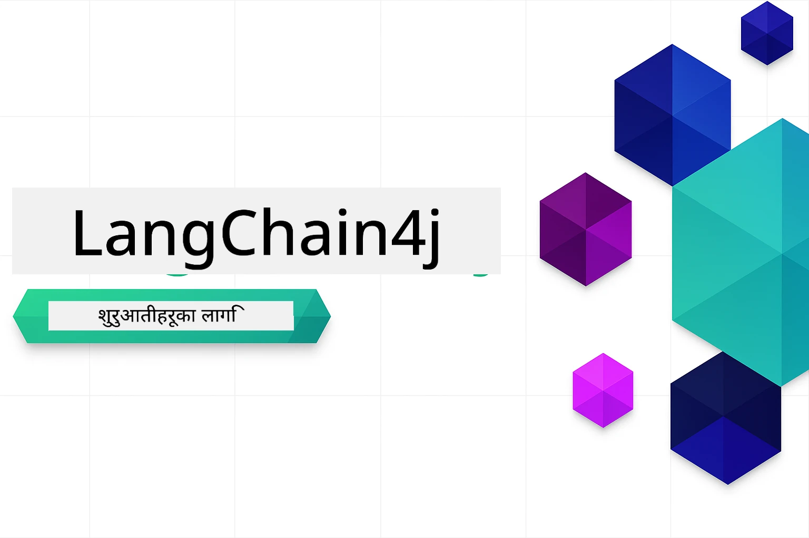

# LangChain4j आरम्भकर्ताहरूका लागि

LangChain4j र Azure OpenAI GPT-5.2 सँग AI अनुप्रयोगहरू निर्माण गर्ने पाठ्यक्रम, आधारभूत च्याटदेखि AI एजेन्टहरू सम्म।

### 🌐 बहुभाषिक समर्थन

#### GitHub Action मार्फत समर्थन गरिएको (स्वचालित र सँधै अद्यावधिक)

<!-- CO-OP TRANSLATOR LANGUAGES TABLE START -->
[Arabic](../ar/README.md) | [Bengali](../bn/README.md) | [Bulgarian](../bg/README.md) | [Burmese (Myanmar)](../my/README.md) | [Chinese (Simplified)](../zh-CN/README.md) | [Chinese (Traditional, Hong Kong)](../zh-HK/README.md) | [Chinese (Traditional, Macau)](../zh-MO/README.md) | [Chinese (Traditional, Taiwan)](../zh-TW/README.md) | [Croatian](../hr/README.md) | [Czech](../cs/README.md) | [Danish](../da/README.md) | [Dutch](../nl/README.md) | [Estonian](../et/README.md) | [Finnish](../fi/README.md) | [French](../fr/README.md) | [German](../de/README.md) | [Greek](../el/README.md) | [Hebrew](../he/README.md) | [Hindi](../hi/README.md) | [Hungarian](../hu/README.md) | [Indonesian](../id/README.md) | [Italian](../it/README.md) | [Japanese](../ja/README.md) | [Kannada](../kn/README.md) | [Khmer](../km/README.md) | [Korean](../ko/README.md) | [Lithuanian](../lt/README.md) | [Malay](../ms/README.md) | [Malayalam](../ml/README.md) | [Marathi](../mr/README.md) | [Nepali](./README.md) | [Nigerian Pidgin](../pcm/README.md) | [Norwegian](../no/README.md) | [Persian (Farsi)](../fa/README.md) | [Polish](../pl/README.md) | [Portuguese (Brazil)](../pt-BR/README.md) | [Portuguese (Portugal)](../pt-PT/README.md) | [Punjabi (Gurmukhi)](../pa/README.md) | [Romanian](../ro/README.md) | [Russian](../ru/README.md) | [Serbian (Cyrillic)](../sr/README.md) | [Slovak](../sk/README.md) | [Slovenian](../sl/README.md) | [Spanish](../es/README.md) | [Swahili](../sw/README.md) | [Swedish](../sv/README.md) | [Tagalog (Filipino)](../tl/README.md) | [Tamil](../ta/README.md) | [Telugu](../te/README.md) | [Thai](../th/README.md) | [Turkish](../tr/README.md) | [Ukrainian](../uk/README.md) | [Urdu](../ur/README.md) | [Vietnamese](../vi/README.md)

> **स्थानीय रूपमा क्लोन गर्न मन छ?**
>
> यो रिपोजिटरीमा ५०+ भाषा अनुवादहरू समावेश गरिएको छ जसले डाउनलोड आकारलाई उल्लेखनीय रूपमा बढाउँछ। अनुवादहरू बिना क्लोन गर्नको लागि, sparse checkout प्रयोग गर्नुहोस्:
>
> **Bash / macOS / Linux:**
> ```bash
> git clone --filter=blob:none --sparse https://github.com/microsoft/LangChain4j-for-Beginners.git
> cd LangChain4j-for-Beginners
> git sparse-checkout set --no-cone '/*' '!translations' '!translated_images'
> ```
>
> **CMD (Windows):**
> ```cmd
> git clone --filter=blob:none --sparse https://github.com/microsoft/LangChain4j-for-Beginners.git
> cd LangChain4j-for-Beginners
> git sparse-checkout set --no-cone "/*" "!translations" "!translated_images"
> ```
>
> यसले तपाईंलाई कोर्स पूरा गर्न आवश्यक सबै कुरा छिटो डाउनलोडको साथ दिन्छ।
<!-- CO-OP TRANSLATOR LANGUAGES TABLE END -->

## विषय सूची

1. [परिचय](01-introduction/README.md) - LangChain4j का आधारभूत कुरा सिक्नुहोस्
2. [प्रॉम्प्ट इन्जिनियरिङ](02-prompt-engineering/README.md) - प्रभावकारी प्रॉम्प्ट डिजाइनमा दक्षता हासिल गर्नुहोस्
3. [RAG (Retrieval-Augmented Generation)](03-rag/README.md) - बुद्धिमान ज्ञान-आधारित प्रणालीहरू निर्माण गर्नुहोस्
4. [साधनहरू](04-tools/README.md) - बाह्य उपकरण र सरल सहायकहरू एकीकृत गर्नुहोस्
5. [MCP (मोडेल सन्दर्भ प्रोटोकल)](05-mcp/README.md) - मोडेल सन्दर्भ प्रोटोकल (MCP) र एजेन्टिक मोड्युलहरूसँग काम गर्नुहोस्

### भिडियो वाकथ्रु

हरेक मोड्युलसँगसँगै एकप्रत्यक्ष सत्र हुन्छ जहाँ हामी अवधारणाहरू र कोडलाई चरण-द्वारा-चरण हिँडाउँछौं।

| मोड्युल | भिडियो |
|--------|-------|
| 01 - परिचय | [LangChain4j सँग सुरु गर्दै](https://www.youtube.com/live/nl_troDm8rQ) |
| 02 - प्रॉम्प्ट इन्जिनियरिङ | [LangChain4j सँग प्रॉम्प्ट इन्जिनियरिङ](https://www.youtube.com/live/PJ6aBaE6bog) |
| 03 - RAG | [LangChain4j सँग RAG](https://www.youtube.com/watch?v=_olq75ZH_eY) |
| 04 - उपकरण र 05 - MCP | [उपकरण र MCP सँग AI एजेन्टहरू](https://www.youtube.com/watch?v=O_J30kZc0rw) |

---

## सिक्ने मार्ग

**LangChain4j मा नयाँ हुनुहुन्छ?** मुख्य शब्दहरू र अवधारणा हरूका परिभाषाहरूको लागि [शब्द सूची](docs/GLOSSARY.md) हेरौं।

> **छिटो सुरु गर्न**

1. यो रिपोजिटरी तपाईंको GitHub खातामा Fork गर्नुहोस्
2. क्लिक गर्नुहोस् **Code** → **Codespaces** ट्याब → **...** → **New with options...**
3. डिफल्टहरू प्रयोग गर्नुहोस् – यसले यस पाठ्यक्रमको लागि बनाइएको Development container चयन गर्नेछ
4. क्लिक गर्नुहोस् **Create codespace**
5. वातावरण तयार हुन ५-१० मिनेट पर्खनुहोस्
6. सुरूवात गर्न [परिचय](./01-introduction/README.md) सँग सिधै जानुहोस्!

मोड्युलहरू पूरा गरेपछि, LangChain4j परीक्षण अवधारणाहरूलाई क्रियामा हेर्न [परीक्षण मार्गदर्शिका](docs/TESTING.md) अन्वेषण गर्नुहोस्।

> **सुझाव:** यो प्रशिक्षण Azure OpenAI प्रयोग गर्दछ। तपाइंसँग नभएमा [FREE Azure account](https://aka.ms/azure-free-account) बाट शुरू गर्नुहोस्।


## GitHub Copilot सङ्ग सिकाई

छिटो कोडिङ सुरु गर्न, यस परियोजनालाई GitHub Codespace मा वा तपाईंको स्थानीय IDE मा devcontainer सहित खोल्नुहोस्। यस कोर्समा प्रयोग गरिएको devcontainer मा AI जोडी प्रोग्रामिङका लागि GitHub Copilot पहिले देखि नै कन्फिगर गरिएको छ।

हरेक कोड उदाहरणमा GitHub Copilot सँग तपाईंले सोध्न सक्ने सुझाइएको प्रश्नहरू समावेश छन् जसले तपाईंको बुझाइलाई गहिरो बनाउँछन्। 💡/🤖 संकेतहरू हेर्नुहोस्:

- **Java फाइल हेडरहरू** - प्रत्येक उदाहरणका लागि विशेष प्रश्नहरू
- **मोड्युल READMEहरू** - कोड उदाहरण पछिको अन्वेषण प्रश्नहरू

**कसरी प्रयोग गर्ने:** कुनै पनि कोड फाइल खोल्नुहोस् र सुझाइएको प्रश्नहरू Copilot लाई सोध्नुहोस्। यसलाई कोडबेसको पूर्ण सन्दर्भ छ र यो व्याख्या, विस्तार, र वैकल्पिक सुझाव दिन सक्छ।

थप जान्न चाहनुहुन्छ? [AI जोडी प्रोग्रामिङका लागि Copilot](https://aka.ms/GitHubCopilotAI) हेरौं।


## थप स्रोतहरू

<!-- CO-OP TRANSLATOR OTHER COURSES START -->
### LangChain
[](https://aka.ms/langchain4j-for-beginners)
[](https://aka.ms/langchainjs-for-beginners?WT.mc_id=m365-94501-dwahlin)
[](https://github.com/microsoft/langchain-for-beginners?WT.mc_id=m365-94501-dwahlin)
---

### Azure / Edge / MCP / Agents
[](https://github.com/microsoft/AZD-for-beginners?WT.mc_id=academic-105485-koreyst)
[](https://github.com/microsoft/edgeai-for-beginners?WT.mc_id=academic-105485-koreyst)
[](https://github.com/microsoft/mcp-for-beginners?WT.mc_id=academic-105485-koreyst)
[](https://github.com/microsoft/ai-agents-for-beginners?WT.mc_id=academic-105485-koreyst)

---
 
### Generative AI Series
[](https://github.com/microsoft/generative-ai-for-beginners?WT.mc_id=academic-105485-koreyst)
[-9333EA?style=for-the-badge&labelColor=E5E7EB&color=9333EA)](https://github.com/microsoft/Generative-AI-for-beginners-dotnet?WT.mc_id=academic-105485-koreyst)
[-C084FC?style=for-the-badge&labelColor=E5E7EB&color=C084FC)](https://github.com/microsoft/generative-ai-for-beginners-java?WT.mc_id=academic-105485-koreyst)
[-E879F9?style=for-the-badge&labelColor=E5E7EB&color=E879F9)](https://github.com/microsoft/generative-ai-with-javascript?WT.mc_id=academic-105485-koreyst)

---
 
### मूल सिकाइ
[](https://aka.ms/ml-beginners?WT.mc_id=academic-105485-koreyst)
[](https://aka.ms/datascience-beginners?WT.mc_id=academic-105485-koreyst)
[](https://aka.ms/ai-beginners?WT.mc_id=academic-105485-koreyst)
[](https://github.com/microsoft/Security-101?WT.mc_id=academic-96948-sayoung)

[](https://aka.ms/webdev-beginners?WT.mc_id=academic-105485-koreyst)
[](https://aka.ms/iot-beginners?WT.mc_id=academic-105485-koreyst)
[](https://github.com/microsoft/xr-development-for-beginners?WT.mc_id=academic-105485-koreyst)

---
 
### कोपायलट सिरिज
[](https://aka.ms/GitHubCopilotAI?WT.mc_id=academic-105485-koreyst)
[](https://github.com/microsoft/mastering-github-copilot-for-dotnet-csharp-developers?WT.mc_id=academic-105485-koreyst)
[](https://github.com/microsoft/CopilotAdventures?WT.mc_id=academic-105485-koreyst)
<!-- CO-OP TRANSLATOR OTHER COURSES END -->

## सहायता प्राप्त गर्नुहोस्

यदि तपाईं अड्किनुभयो वा AI एपहरू निर्माण गर्दा कुनै प्रश्नहरू छन् भने, सम्मिलित हुनुहोस्:

[](https://aka.ms/foundry/discord)

यदि तपाईंलाई उत्पादन प्रतिक्रिया वा त्रुटिहरू छन् भने, भ्रमण गर्नुहोस्:

[](https://aka.ms/foundry/forum)

## अनुज्ञा पत्र

MIT License - विवरणहरूको लागि [LICENSE](../../LICENSE) फाइल हेर्नुहोस्।

---

<!-- CO-OP TRANSLATOR DISCLAIMER START -->
**अस्वीकरण**:
यो दस्तावेज़ AI अनुवाद सेवा [Co-op Translator](https://github.com/Azure/co-op-translator) प्रयोग गरेर अनुवाद गरिएको हो। हामी सही हुन प्रयास गर्छौं, तर कृपया जानकार हुनुस् कि स्वचालित अनुवादमा त्रुटिहरू वा अशुद्धताहरू हुन सक्छन्। मूल दस्तावेज़ यसको मूल भाषामा आधिकारिक स्रोत मानिनुपर्छ। महत्वपूर्ण जानकारीका लागि व्यावसायिक मानव अनुवाद सिफारिस गरिन्छ। यस अनुवादको प्रयोगबाट उत्पन्न कुनै पनि गलत बुझाइ वा त्रुटिको लागि हामी जिम्मेवार छैनौं।
<!-- CO-OP TRANSLATOR DISCLAIMER END -->