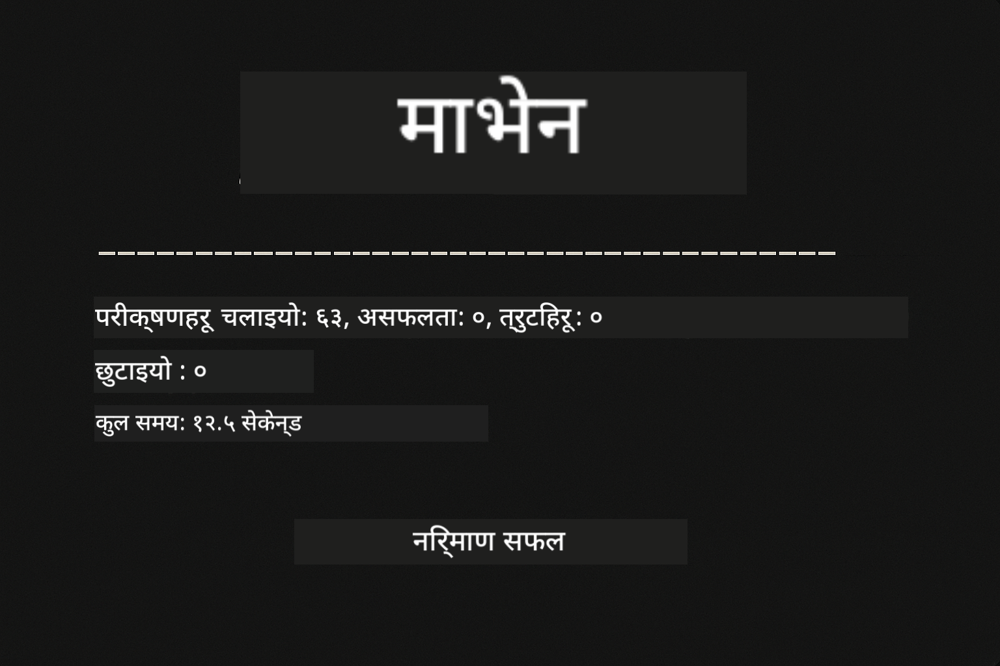
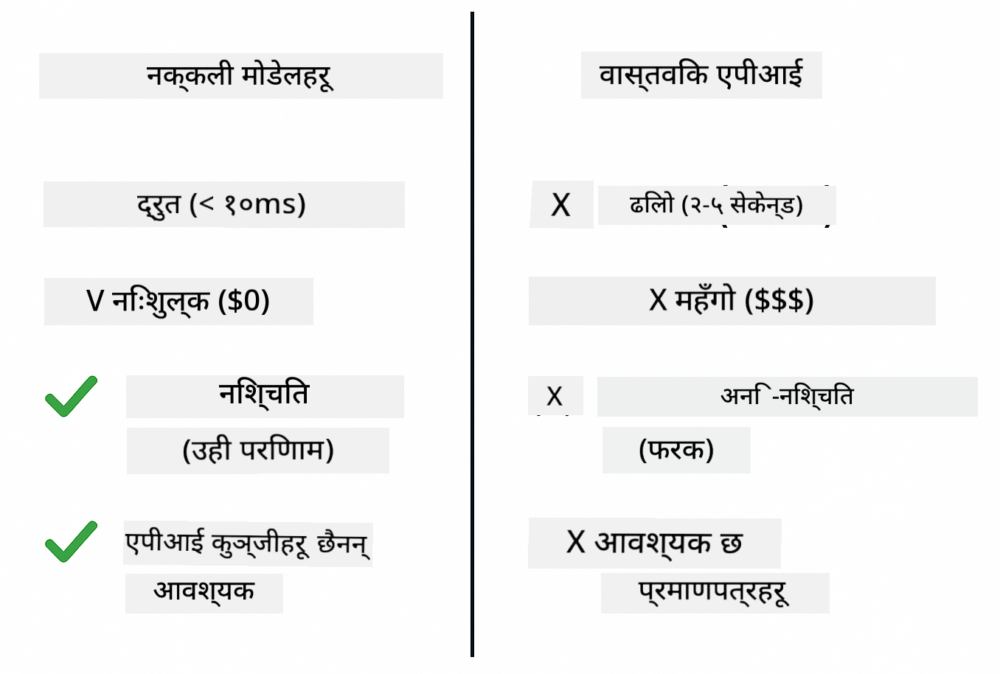
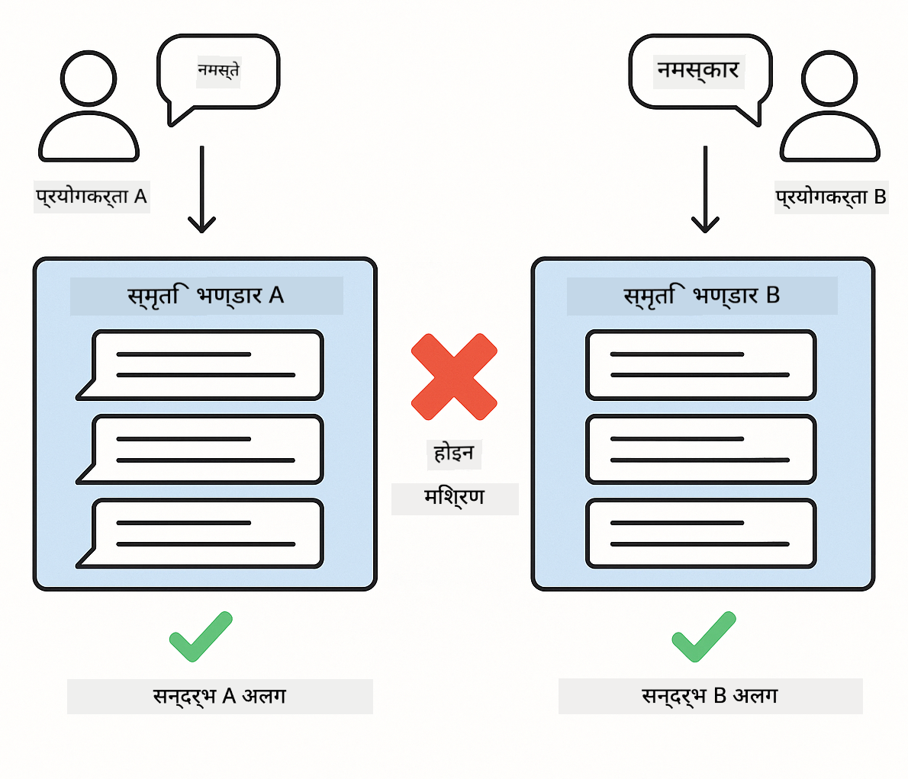
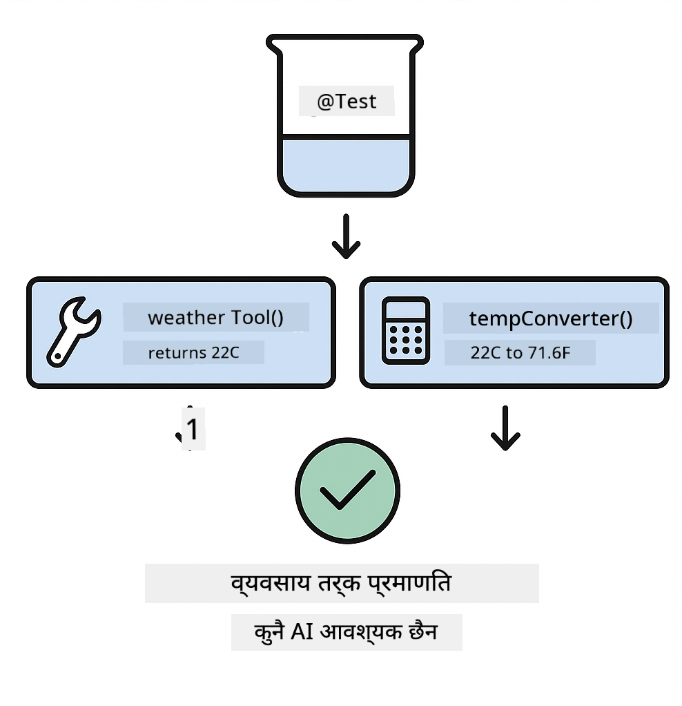

<!--
CO_OP_TRANSLATOR_METADATA:
{
  "original_hash": "b975537560c404d5f254331832811e78",
  "translation_date": "2025-12-13T20:53:05+00:00",
  "source_file": "docs/TESTING.md",
  "language_code": "ne"
}
-->
# LangChain4j अनुप्रयोगहरूको परीक्षण

## सामग्री तालिका

- [छिटो सुरु](../../../docs)
- [परीक्षणहरूले के समेट्छन्](../../../docs)
- [परीक्षणहरू चलाउने](../../../docs)
- [VS कोडमा परीक्षणहरू चलाउने](../../../docs)
- [परीक्षण ढाँचाहरू](../../../docs)
- [परीक्षण दर्शन](../../../docs)
- [अर्को कदमहरू](../../../docs)

यो मार्गदर्शकले तपाईंलाई ती परीक्षणहरू मार्फत लैजान्छ जुन API कुञ्जीहरू वा बाह्य सेवाहरू बिना AI अनुप्रयोगहरू कसरी परीक्षण गर्ने देखाउँछन्।

## छिटो सुरु

एकै आदेशले सबै परीक्षणहरू चलाउनुहोस्:

**Bash:**
```bash
mvn test
```

**PowerShell:**
```powershell
mvn --% test
```



*सफल परीक्षण कार्यान्वयन जसले सबै परीक्षणहरू पास भएको देखाउँछ र कुनै असफलता छैन*

## परीक्षणहरूले के समेट्छन्

यो कोर्सले **युनिट परीक्षणहरू** मा केन्द्रित छ जुन स्थानीय रूपमा चल्छन्। प्रत्येक परीक्षणले एक विशिष्ट LangChain4j अवधारणा अलग्गै देखाउँछ।


*परीक्षण पिरामिडले युनिट परीक्षणहरू (छिटो, अलग्गै), एकीकरण परीक्षणहरू (वास्तविक कम्पोनेन्टहरू), र अन्त-देखि-अन्त परीक्षणहरू (पूर्ण प्रणाली डोकरसँग) बीच सन्तुलन देखाउँछ। यो तालिम युनिट परीक्षण समेट्छ।*

| मोड्युल | परीक्षणहरू | केन्द्रित | मुख्य फाइलहरू |
|--------|-------|-------|-----------|
| **00 - छिटो सुरु** | 6 | प्रॉम्प्ट टेम्प्लेटहरू र भेरिएबल प्रतिस्थापन | `SimpleQuickStartTest.java` |
| **01 - परिचय** | 8 | संवाद स्मृति र स्थिति-आधारित च्याट | `SimpleConversationTest.java` |
| **02 - प्रॉम्प्ट इन्जिनियरिङ** | 12 | GPT-5 ढाँचाहरू, उत्साह स्तरहरू, संरचित आउटपुट | `SimpleGpt5PromptTest.java` |
| **03 - RAG** | 10 | कागजात इन्टेक, एम्बेडिङहरू, समानता खोज | `DocumentServiceTest.java` |
| **04 - उपकरणहरू** | 12 | फंक्शन कलिङ र उपकरण चेनिङ | `SimpleToolsTest.java` |
| **05 - MCP** | 15 | मोडेल कन्टेक्स्ट प्रोटोकल डोकरसँग | `SimpleMcpTest.java`, `McpDockerTransportTest.java`` |

## परीक्षणहरू चलाउने

**रुटबाट सबै परीक्षणहरू चलाउनुहोस्:**

**Bash:**
```bash
mvn test
```

**PowerShell:**
```powershell
mvn --% test
```

**विशिष्ट मोड्युलका लागि परीक्षणहरू चलाउनुहोस्:**

**Bash:**
```bash
cd 01-introduction && mvn test
# वा रुटबाट
mvn test -pl 01-introduction
```

**PowerShell:**
```powershell
cd 01-introduction; mvn --% test
# वा रुटबाट
mvn --% test -pl 01-introduction
```

**एकल परीक्षण क्लास चलाउनुहोस्:**

**Bash:**
```bash
mvn test -Dtest=SimpleConversationTest
```

**PowerShell:**
```powershell
mvn --% test -Dtest=SimpleConversationTest
```

**विशिष्ट परीक्षण विधि चलाउनुहोस्:**

**Bash:**
```bash
mvn test -Dtest=SimpleConversationTest#कुराकानी इतिहास कायम राख्नुपर्छ
```

**PowerShell:**
```powershell
mvn --% test -Dtest=SimpleConversationTest#कुराकानी इतिहास कायम राख्नुपर्छ
```

## VS कोडमा परीक्षणहरू चलाउने

यदि तपाईं Visual Studio Code प्रयोग गर्दै हुनुहुन्छ भने, Test Explorer ले परीक्षणहरू चलाउन र डिबग गर्न ग्राफिकल इन्टरफेस प्रदान गर्दछ।


*VS कोड टेस्ट एक्सप्लोररले सबै Java परीक्षण क्लासहरू र व्यक्तिगत परीक्षण विधिहरूको परीक्षण रूख देखाउँछ*

**VS कोडमा परीक्षणहरू चलाउन:**

1. एक्टिभिटी बारमा बीकर आइकन क्लिक गरेर टेस्ट एक्सप्लोरर खोल्नुहोस्
2. सबै मोड्युल र परीक्षण क्लासहरू हेर्न परीक्षण रूख विस्तार गर्नुहोस्
3. कुनै पनि परीक्षणको छेउमा प्ले बटन क्लिक गरेर व्यक्तिगत रूपमा चलाउनुहोस्
4. "Run All Tests" क्लिक गरेर सम्पूर्ण सूट कार्यान्वयन गर्नुहोस्
5. कुनै पनि परीक्षणमा राइट-क्लिक गरेर "Debug Test" चयन गरी ब्रेकप्वाइन्ट सेट गर्नुहोस् र कोडमा स्टेप गर्नुहोस्

टेस्ट एक्सप्लोररले पास भएका परीक्षणहरूका लागि हरियो चेकमार्क देखाउँछ र असफल हुँदा विस्तृत त्रुटि सन्देशहरू प्रदान गर्दछ।

## परीक्षण ढाँचाहरू


*LangChain4j अनुप्रयोगहरूको लागि छ वटा परीक्षण ढाँचाहरू: प्रॉम्प्ट टेम्प्लेटहरू, मोडल मोकिङ, संवाद अलगाव, उपकरण परीक्षण, इन-मेमोरी RAG, र डोकर एकीकरण*

### ढाँचा १: प्रॉम्प्ट टेम्प्लेट परीक्षण

सबैभन्दा सरल ढाँचाले कुनै AI मोडल कल नगरी प्रॉम्प्ट टेम्प्लेटहरू परीक्षण गर्छ। तपाईंले भेरिएबल प्रतिस्थापन सही छ कि छैन र प्रॉम्प्टहरू अपेक्षित रूपमा ढाँचाबद्ध छन् कि छैनन् भनी जाँच गर्नुहुन्छ।


*प्रॉम्प्ट टेम्प्लेट परीक्षणले भेरिएबल प्रतिस्थापन प्रवाह देखाउँछ: प्लेसहोल्डरहरू सहित टेम्प्लेट → मानहरू लागू → ढाँचाबद्ध आउटपुट पुष्टि*

```java
@Test
@DisplayName("Should format prompt template with variables")
void testPromptTemplateFormatting() {
    PromptTemplate template = PromptTemplate.from(
        "Best time to visit {{destination}} for {{activity}}?"
    );
    
    Prompt prompt = template.apply(Map.of(
        "destination", "Paris",
        "activity", "sightseeing"
    ));
    
    assertThat(prompt.text()).isEqualTo("Best time to visit Paris for sightseeing?");
}
```

यो परीक्षण `00-quick-start/src/test/java/com/example/langchain4j/quickstart/SimpleQuickStartTest.java` मा छ।

**यसलाई चलाउनुहोस्:**

**Bash:**
```bash
cd 00-quick-start && mvn test -Dtest=SimpleQuickStartTest#परीक्षणप्रॉम्प्टटेम्प्लेटफर्म्याटिङ
```

**PowerShell:**
```powershell
cd 00-quick-start; mvn --% test -Dtest=SimpleQuickStartTest#परीक्षणप्रॉम्प्टटेम्प्लेटफर्म्याटिङ
```

### ढाँचा २: भाषा मोडलहरू मोकिङ

संवाद तर्क परीक्षण गर्दा, Mockito प्रयोग गरेर नकली मोडलहरू सिर्जना गर्नुहोस् जसले पूर्वनिर्धारित प्रतिक्रिया फर्काउँछन्। यसले परीक्षणहरू छिटो, निःशुल्क, र निर्धारक बनाउँछ।



*परीक्षणका लागि मोकहरू किन प्राथमिकता दिइन्छ देखाउने तुलना: ती छिटो, निःशुल्क, निर्धारक, र API कुञ्जीहरू आवश्यक पर्दैन*

```java
@ExtendWith(MockitoExtension.class)
class SimpleConversationTest {
    
    private ConversationService conversationService;
    
    @Mock
    private OpenAiOfficialChatModel mockChatModel;
    
    @BeforeEach
    void setUp() {
        ChatResponse mockResponse = ChatResponse.builder()
            .aiMessage(AiMessage.from("This is a test response"))
            .build();
        when(mockChatModel.chat(anyList())).thenReturn(mockResponse);
        
        conversationService = new ConversationService(mockChatModel);
    }
    
    @Test
    void shouldMaintainConversationHistory() {
        String conversationId = conversationService.startConversation();
        
        ChatResponse mockResponse1 = ChatResponse.builder()
            .aiMessage(AiMessage.from("Response 1"))
            .build();
        ChatResponse mockResponse2 = ChatResponse.builder()
            .aiMessage(AiMessage.from("Response 2"))
            .build();
        ChatResponse mockResponse3 = ChatResponse.builder()
            .aiMessage(AiMessage.from("Response 3"))
            .build();
        
        when(mockChatModel.chat(anyList()))
            .thenReturn(mockResponse1)
            .thenReturn(mockResponse2)
            .thenReturn(mockResponse3);

        conversationService.chat(conversationId, "First message");
        conversationService.chat(conversationId, "Second message");
        conversationService.chat(conversationId, "Third message");

        List<ChatMessage> history = conversationService.getHistory(conversationId);
        assertThat(history).hasSize(6); // ३ प्रयोगकर्ता + ३ एआई सन्देशहरू
    }
}
```

यो ढाँचा `01-introduction/src/test/java/com/example/langchain4j/service/SimpleConversationTest.java` मा देखिन्छ। मोकले स्थिर व्यवहार सुनिश्चित गर्छ ताकि तपाईं स्मृति व्यवस्थापन सही छ कि छैन भनी जाँच गर्न सक्नुहुन्छ।

### ढाँचा ३: संवाद अलगाव परीक्षण

संवाद स्मृतिले धेरै प्रयोगकर्ताहरूलाई अलग राख्नुपर्छ। यो परीक्षणले संवादहरूले सन्दर्भहरू मिसाउँदैनन् भनी पुष्टि गर्छ।



*संवाद अलगाव परीक्षणले विभिन्न प्रयोगकर्ताहरूका लागि अलग स्मृति भण्डारण देखाउँछ जसले सन्दर्भ मिसावट रोक्छ*

```java
@Test
void shouldIsolateConversationsByid() {
    String conv1 = conversationService.startConversation();
    String conv2 = conversationService.startConversation();
    
    ChatResponse mockResponse = ChatResponse.builder()
        .aiMessage(AiMessage.from("Response"))
        .build();
    when(mockChatModel.chat(anyList())).thenReturn(mockResponse);

    conversationService.chat(conv1, "Message for conversation 1");
    conversationService.chat(conv2, "Message for conversation 2");

    List<ChatMessage> history1 = conversationService.getHistory(conv1);
    List<ChatMessage> history2 = conversationService.getHistory(conv2);
    
    assertThat(history1).hasSize(2);
    assertThat(history2).hasSize(2);
}
```

प्रत्येक संवादले आफ्नै स्वतन्त्र इतिहास राख्छ। उत्पादन प्रणालीहरूमा, यो अलगाव बहु-प्रयोगकर्ता अनुप्रयोगहरूको लागि अत्यावश्यक छ।

### ढाँचा ४: उपकरणहरू स्वतन्त्र रूपमा परीक्षण

उपकरणहरू AI ले कल गर्न सक्ने फंक्शनहरू हुन्। तिनीहरूलाई सिधै परीक्षण गर्नुहोस् ताकि AI निर्णयहरूबाट स्वतन्त्र रूपमा तिनीहरू सही काम गर्छन् भनी सुनिश्चित गर्न सकियोस्।



*उपकरणहरू स्वतन्त्र रूपमा परीक्षण गर्दै नकली उपकरण कार्यान्वयन बिना AI कलहरू व्यापार तर्क पुष्टि गर्दै*

```java
@Test
void shouldConvertCelsiusToFahrenheit() {
    TemperatureTool tempTool = new TemperatureTool();
    String result = tempTool.celsiusToFahrenheit(25.0);
    assertThat(result).containsPattern("77[.,]0°F");
}

@Test
void shouldDemonstrateToolChaining() {
    WeatherTool weatherTool = new WeatherTool();
    TemperatureTool tempTool = new TemperatureTool();

    String weatherResult = weatherTool.getCurrentWeather("Seattle");
    assertThat(weatherResult).containsPattern("\\d+°C");

    String conversionResult = tempTool.celsiusToFahrenheit(22.0);
    assertThat(conversionResult).containsPattern("71[.,]6°F");
}
```

यी परीक्षणहरू `04-tools/src/test/java/com/example/langchain4j/agents/tools/SimpleToolsTest.java` बाट छन् जसले AI संलग्नता बिना उपकरण तर्क प्रमाणित गर्छ। चेनिङ उदाहरणले कसरी एउटा उपकरणको आउटपुट अर्कोको इनपुटमा जान्छ देखाउँछ।

### ढाँचा ५: इन-मेमोरी RAG परीक्षण

RAG प्रणालीहरूले सामान्यतया भेक्टर डाटाबेस र एम्बेडिङ सेवाहरू आवश्यक पर्छ। इन-मेमोरी ढाँचाले तपाईंलाई बाह्य निर्भरता बिना सम्पूर्ण पाइपलाइन परीक्षण गर्न दिन्छ।


*इन-मेमोरी RAG परीक्षण कार्यप्रवाहले कागजात पार्सिङ, एम्बेडिङ भण्डारण, र समानता खोज देखाउँछ जुन डाटाबेस आवश्यक पर्दैन*

```java
@Test
void testProcessTextDocument() {
    String content = "This is a test document.\nIt has multiple lines.";
    InputStream inputStream = new ByteArrayInputStream(content.getBytes(StandardCharsets.UTF_8));
    
    DocumentService.ProcessedDocument result = 
        documentService.processDocument(inputStream, "test.txt");

    assertNotNull(result);
    assertTrue(result.segments().size() > 0);
    assertEquals("test.txt", result.segments().get(0).metadata().getString("filename"));
}
```

यो परीक्षण `03-rag/src/test/java/com/example/langchain4j/rag/service/DocumentServiceTest.java` बाट हो जसले मेमोरीमा कागजात सिर्जना गर्छ र चंकिङ र मेटाडाटा ह्यान्डलिङ पुष्टि गर्छ।

### ढाँचा ६: डोकरसँग एकीकरण परीक्षण

केही सुविधाहरूलाई वास्तविक पूर्वाधार आवश्यक पर्छ। MCP मोड्युलले Testcontainers प्रयोग गरेर डोकर कन्टेनरहरू स्पिन अप गर्छ एकीकरण परीक्षणका लागि। यीले तपाईंको कोड वास्तविक सेवाहरूसँग काम गर्छ भनी प्रमाणित गर्छन् र परीक्षण अलगाव कायम राख्छन्।


*MCP एकीकरण परीक्षण Testcontainers सँग स्वचालित कन्टेनर जीवनचक्र देखाउँदै: सुरु, परीक्षण कार्यान्वयन, रोक, र सफाइ*

`05-mcp/src/test/java/com/example/langchain4j/mcp/McpDockerTransportTest.java` मा परीक्षणहरूका लागि डोकर चलिरहेको हुनुपर्छ।

**तिनीहरूलाई चलाउनुहोस्:**

**Bash:**
```bash
cd 05-mcp && mvn test
```

**PowerShell:**
```powershell
cd 05-mcp; mvn --% test
```

## परीक्षण दर्शन

तपाईंको कोड परीक्षण गर्नुहोस्, AI होइन। तपाईंका परीक्षणहरूले तपाईंले लेखेको कोडलाई प्रमाणीकरण गर्नुपर्छ, जस्तै प्रॉम्प्टहरू कसरी बनाइन्छ, स्मृति कसरी व्यवस्थापन हुन्छ, र उपकरणहरू कसरी कार्यान्वयन हुन्छन्। AI प्रतिक्रियाहरू फरक-फरक हुन्छन् र परीक्षण दाबीहरूको भाग हुनु हुँदैन। आफैंलाई सोध्नुहोस् कि तपाईंको प्रॉम्प्ट टेम्प्लेटले भेरिएबलहरू सही प्रतिस्थापन गर्छ कि गर्दैन, AI ले सही उत्तर दिन्छ कि दिदैन भनेर होइन।

भाषा मोडलहरूको लागि मोकहरू प्रयोग गर्नुहोस्। ती बाह्य निर्भरता हुन् जुन ढिलो, महँगो, र गैर-निर्धारक हुन्छन्। मोकिङले परीक्षणहरूलाई छिटो बनाउँछ (सेकेन्डको सट्टा मिलिसेकेन्डमा), निःशुल्क बनाउँछ (API लागत बिना), र निर्धारक बनाउँछ (हरेक पटक एउटै परिणाम)।

परीक्षणहरू स्वतन्त्र राख्नुहोस्। प्रत्येक परीक्षणले आफ्नै डेटा सेटअप गर्नुपर्छ, अन्य परीक्षणहरूमा निर्भर हुनु हुँदैन, र आफैं सफा गर्नुपर्छ। परीक्षणहरू कार्यान्वयन क्रम जस्तो भए पनि पास हुनुपर्छ।

खुसी मार्गभन्दा बाहिरका किनाराहरू परीक्षण गर्नुहोस्। खाली इनपुटहरू, धेरै ठूलो इनपुटहरू, विशेष अक्षरहरू, अमान्य प्यारामिटरहरू, र सिमाना अवस्थाहरू प्रयास गर्नुहोस्। यीले प्रायः सामान्य प्रयोगले नदेखाउने बगहरू पत्ता लगाउँछन्।

वर्णनात्मक नामहरू प्रयोग गर्नुहोस्। `shouldMaintainConversationHistoryAcrossMultipleMessages()` लाई `test1()` सँग तुलना गर्नुहोस्। पहिलोले के परीक्षण भइरहेको छ स्पष्ट बताउँछ, जसले असफलता डिबग गर्न सजिलो बनाउँछ।

## अर्को कदमहरू

अब तपाईंले परीक्षण ढाँचाहरू बुझ्नुभयो, प्रत्येक मोड्युलमा गहिराइमा जानुहोस्:

- **[00 - छिटो सुरु](../00-quick-start/README.md)** - प्रॉम्प्ट टेम्प्लेट आधारभूतहरूबाट सुरु गर्नुहोस्
- **[01 - परिचय](../01-introduction/README.md)** - संवाद स्मृति व्यवस्थापन सिक्नुहोस्
- **[02 - प्रॉम्प्ट इन्जिनियरिङ](../02-prompt-engineering/README.md)** - GPT-5 प्रॉम्प्टिङ ढाँचाहरूमा निपुण हुनुहोस्
- **[03 - RAG](../03-rag/README.md)** - रिट्रिभल-अग्मेन्टेड जेनेरेशन प्रणालीहरू बनाउनुहोस्
- **[04 - उपकरणहरू](../04-tools/README.md)** - फंक्शन कलिङ र उपकरण चेनहरू कार्यान्वयन गर्नुहोस्
- **[05 - MCP](../05-mcp/README.md)** - मोडेल कन्टेक्स्ट प्रोटोकल डोकरसँग एकीकृत गर्नुहोस्

प्रत्येक मोड्युलको README यहाँ परीक्षण गरिएका अवधारणाहरूको विस्तृत व्याख्या प्रदान गर्दछ।

---

**नेभिगेसन:** [← मुख्यमा फर्कनुहोस्](../README.md)

---

<!-- CO-OP TRANSLATOR DISCLAIMER START -->
**अस्वीकरण**:
यो दस्तावेज AI अनुवाद सेवा [Co-op Translator](https://github.com/Azure/co-op-translator) प्रयोग गरी अनुवाद गरिएको हो। हामी शुद्धताका लागि प्रयासरत छौं, तर कृपया ध्यान दिनुहोस् कि स्वचालित अनुवादमा त्रुटि वा अशुद्धता हुन सक्छ। मूल दस्तावेज यसको मूल भाषामा नै अधिकारिक स्रोत मानिनु पर्छ। महत्वपूर्ण जानकारीका लागि व्यावसायिक मानव अनुवाद सिफारिस गरिन्छ। यस अनुवादको प्रयोगबाट उत्पन्न कुनै पनि गलतफहमी वा गलत व्याख्याका लागि हामी जिम्मेवार छैनौं।
<!-- CO-OP TRANSLATOR DISCLAIMER END -->