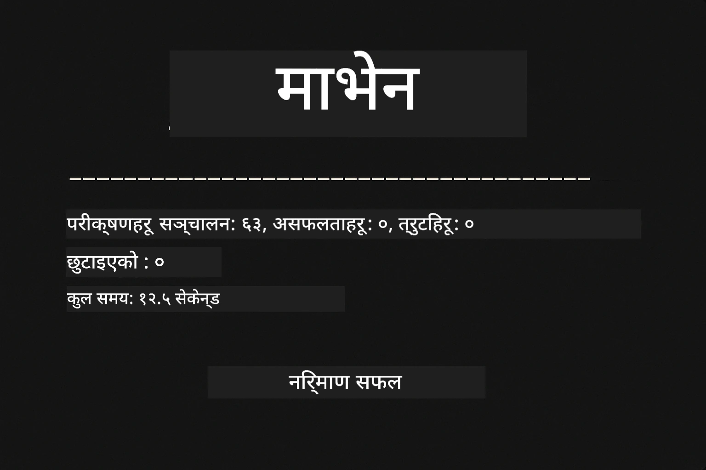
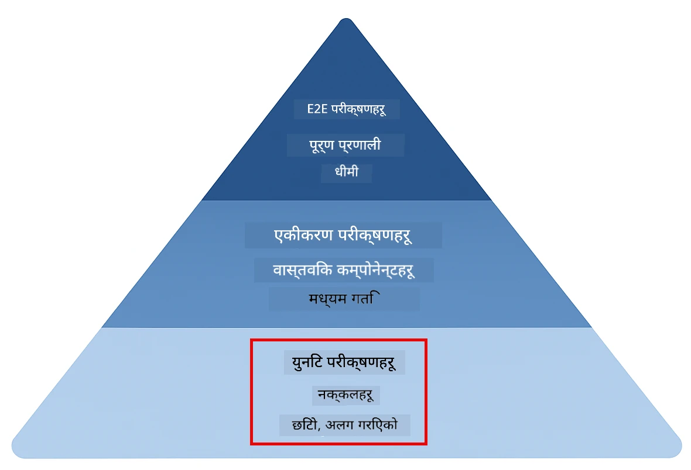
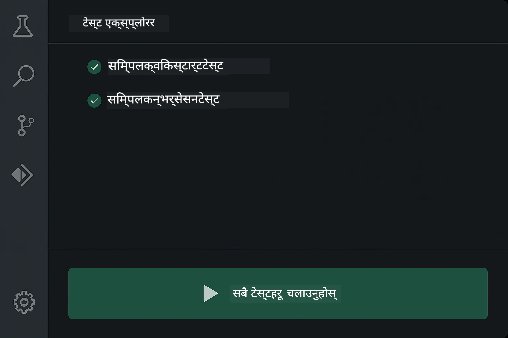
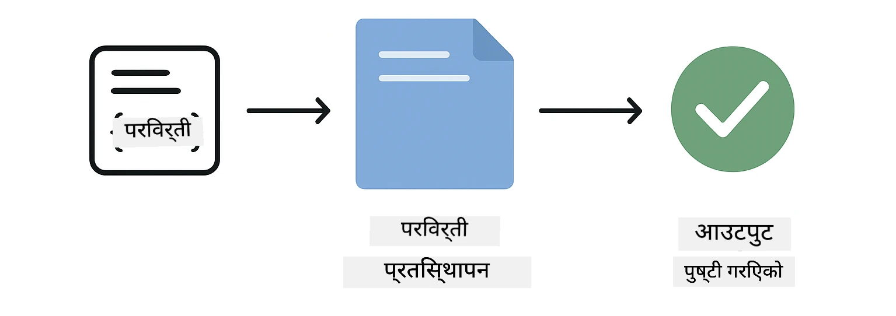
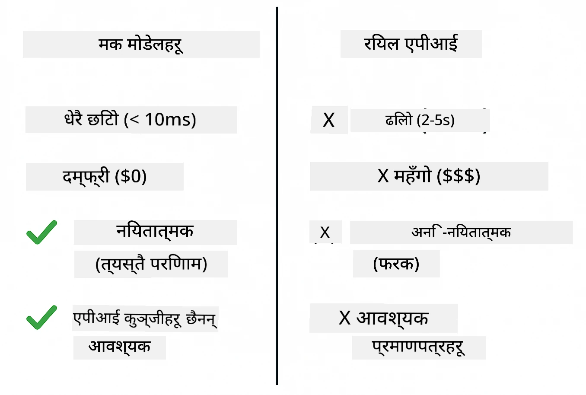
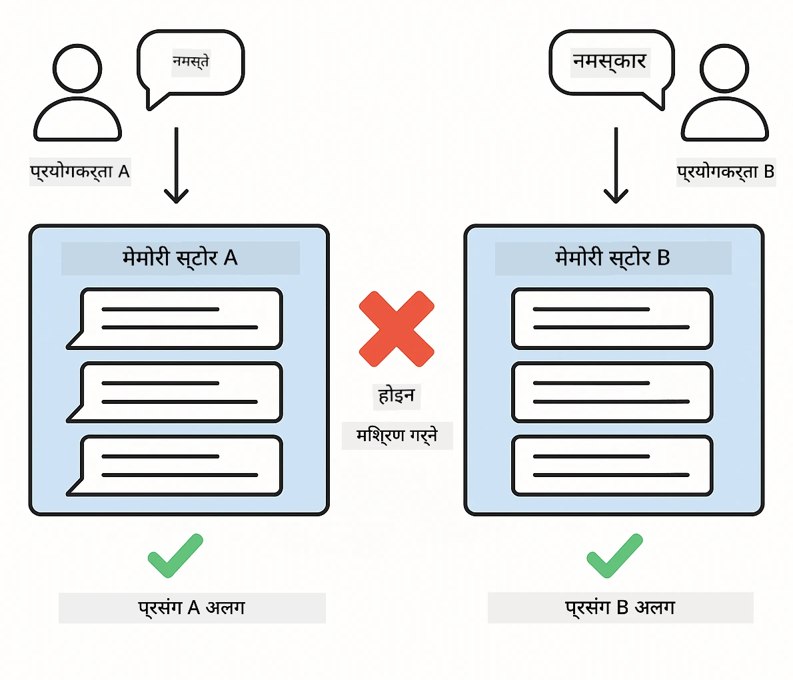
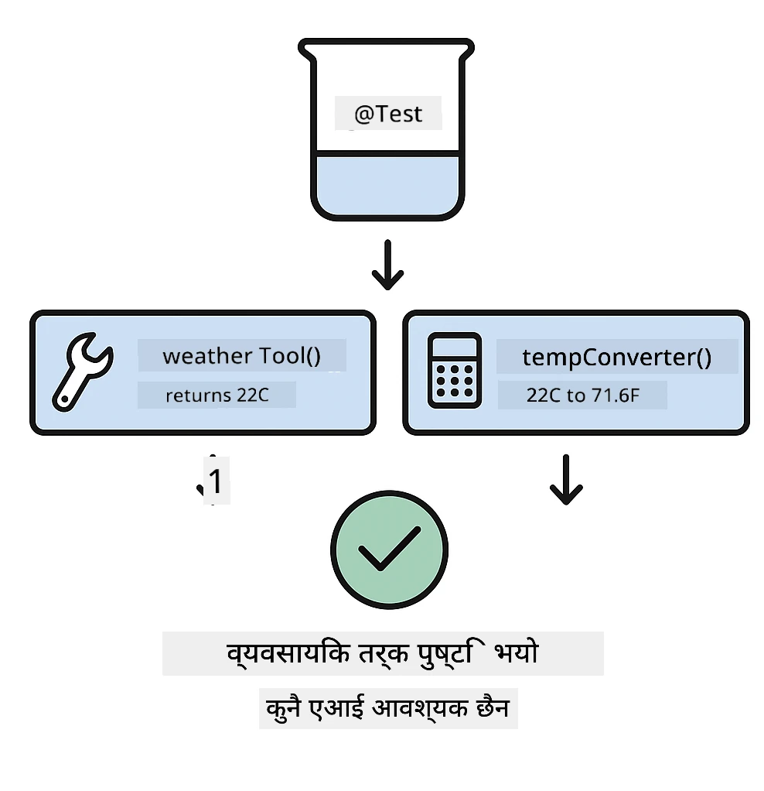
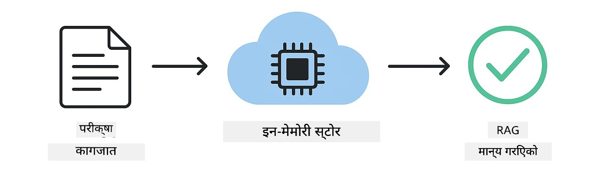

# LangChain4j अनुप्रयोगहरू परीक्षण गर्दै

## सामग्री तालिका

- [छिटो सुरु](#छिटो-सुरु)
- [परीक्षणहरूले कभर गर्ने कुरा](#परीक्षणहरूले-कभर-गर्ने-कुरा)
- [परीक्षणहरू चलाउँदै](#परीक्षणहरू-चलाउँदै)
- [VS कोडमा परीक्षणहरू चलाउँदै](#vs-कोडमा-परीक्षणहरू-चलाउँदै)
- [परीक्षण ढाँचाहरू](#परीक्षण-ढाँचाहरू)
- [परीक्षण दर्शन](#परीक्षण-दर्शन)
- [अर्को चरणहरू](#अर्को-चरणहरू)

यो मार्गदर्शनले तपाईंलाई API कुञ्जी वा बाह्य सेवाहरू आवश्यक नपर्ने तरिकाले AI अनुप्रयोगहरू कसरी परीक्षण गर्ने भनेर देखाउने परीक्षणहरू मार्फत लैजान्छ।

## छिटो सुरु

एकै कमाण्डले सबै परीक्षणहरू चलाउनुहोस्:

**Bash:**
```bash
mvn test
```

**PowerShell:**
```powershell
mvn --% test
```

जब सबै परीक्षणहरू पास हुन्छन्, तपाईंले तलको स्क्रिनशट जस्तो आउटपुट देख्नुपर्छ — परीक्षणहरू शून्य असफलतासँग चल्नेछन्।



*शून्य असफलता सहित सबै परीक्षणहरू पास भएको सफल परीक्षण निष्पादन देखाउँदै*

## परीक्षणहरूले कभर गर्ने कुरा

यो कोर्सले स्थानीय चल्ने **युनिट परीक्षणहरू** मा केन्द्रित छ। प्रत्येक परीक्षणले एक विशिष्ट LangChain4j अवधारणालाई अलग्गै देखाउँछ। तलको परीक्षण पिरामिडले देखाउँछ युनिट परीक्षणहरूले कहाँ फिट हुन्छन् — यी छिटो, भरपर्दो आधार हुन् जसको आधारमा तपाईंको परीक्षण रणनीतिले निर्माण गर्छ।



*परीक्षण पिरामिडले युनिट परीक्षणहरू (छिटो, अलग), एकीकरण परीक्षणहरू (सचोटा कम्पोनेन्टहरू), र अन्त-देखि-अन्त परीक्षणहरू बीचको सन्तुलन देखाउछ। यो तालिम युनिट परीक्षण कभर गर्छ।*

| मोड्युल | परीक्षणहरू | केन्द्रित क्षेत्र | प्रमुख फाईलहरू |
|--------|-------|-------|-----------|
| **01 - परिचय** | 8 | संवाद मेमोरी र अवस्थावान च्याट | `SimpleConversationTest.java` |
| **02 - प्रम्प्ट इन्जिनियरिङ** | 12 | GPT-5.2 ढाँचाहरू, उत्साह स्तरहरू, संरचित आउटपुट | `SimpleGpt5PromptTest.java` |
| **03 - RAG** | 10 | दस्तावेज़ इन्टेक, एम्बेडिङ, समानता खोज | `DocumentServiceTest.java` |
| **04 - उपकरणहरू** | 12 | फङ्क्शन कलिंग र उपकरण श्रृंखला | `SimpleToolsTest.java` |
| **05 - MCP** | 8 | मोडेल कन्टेक्स्ट प्रोटोकल स्टडियो ट्रान्सपोर्टसँग | `SimpleMcpTest.java` |

## परीक्षणहरू चलाउँदै

**रुटबाट सबै परीक्षणहरू चलाउनुहोस्:**

**Bash:**
```bash
mvn test
```

**PowerShell:**
```powershell
mvn --% test
```

**विशिष्ट मोड्युलको परीक्षणहरू चलाउनुहोस्:**

**Bash:**
```bash
cd 01-introduction && mvn test
# वा मूलबाट
mvn test -pl 01-introduction
```

**PowerShell:**
```powershell
cd 01-introduction; mvn --% test
# वा रुटबाट
mvn --% test -pl 01-introduction
```

**एकल परीक्षण क्लास चलाउनुहोस्:**

**Bash:**
```bash
mvn test -Dtest=SimpleConversationTest
```

**PowerShell:**
```powershell
mvn --% test -Dtest=SimpleConversationTest
```

**विशिष्ट परीक्षण विधि चलाउनुहोस्:**

**Bash:**
```bash
mvn test -Dtest=SimpleConversationTest#संवाद इतिहास कायम राख्नुपर्छ
```

**PowerShell:**
```powershell
mvn --% test -Dtest=SimpleConversationTest#कुराकानीको इतिहास कायम राख्नुपर्छ
```

## VS कोडमा परीक्षणहरू चलाउँदै

Visual Studio Code प्रयोग गरीरहनुभएको भए, Test Explorer ले परीक्षणहरू चलाउन र डिबग गर्न ग्राफिकल इन्टरफेस प्रदान गर्छ।



*VS Code Test Explorer ले सबै Java परीक्षण क्लासहरू र व्यक्तिगत परीक्षण विधिहरू सहित परीक्षण रूख देखाउँदै*

**VS Code मा परीक्षणहरू चलाउन:**

1. Activity Bar मा रहेको बेकเกอร์ आइकनमा क्लिक गरी Test Explorer खोल्नुहोस्
2. सबै मोड्युलहरू र परीक्षण क्लासहरू हेर्न परीक्षण रूख विस्तार गर्नुहोस्
3. कुनै पनि परीक्षणको छेउमा प्ले बटनमा क्लिक गरी व्यक्तिगत रूपमा चलाउनुहोस्
4. "Run All Tests" क्लिक गरी पूर्ण सूट execute गर्नुहोस्
5. कुनै पनि परीक्षणमा राइट-क्लिक गरी "Debug Test" छान्नुहोस् जसले ब्रेकप्वाइन्ट सेट गरी कोड हिँड्न दिन्छ

Test Explorer ले पास भएका परीक्षणहरूको लागि हरियो चेकमार्क देखाउँछ र असफल भएका परीक्षणहरूको लागि विस्तारपूर्वक त्रुटि सन्देश प्रदान गर्छ।

## परीक्षण ढाँचाहरू

### ढाँचा १: प्रम्प्ट टेम्प्लेट परीक्षण

सर्वाधिक सरल ढाँचाले कुनै AI मोडेल कल नगरी प्रम्प्ट टेम्प्लेटहरू परीक्षण गर्छ। तपाईं परिवर्तनशील प्रतिस्थापन सही छ कि छैन र प्रम्प्टहरू अपेक्षाअनुसार स्वरूपित छन् कि छैनन् भनेर प्रमाणित गर्नुहुन्छ।



*प्रम्प्ट टेम्प्लेट परीक्षणले परिवर्तनशील प्रतिस्थापन प्रवाह देखाउँछ: प्लेसहोल्डर भएको टेम्प्लेट → मानहरू लागू → स्वरूपित आउटपुट प्रमाणित*

```java
@Test
@DisplayName("Should format prompt template with variables")
void testPromptTemplateFormatting() {
    PromptTemplate template = PromptTemplate.from(
        "Best time to visit {{destination}} for {{activity}}?"
    );
    
    Prompt prompt = template.apply(Map.of(
        "destination", "Paris",
        "activity", "sightseeing"
    ));
    
    assertThat(prompt.text()).isEqualTo("Best time to visit Paris for sightseeing?");
}
```

यस ढाँचाले परिवर्तनशील प्रतिस्थापन सही छ कि छैन र प्रम्प्टहरू अपेक्षाअनुसार स्वरूपित छन् कि छैनन् भनेर पुष्टि गर्छ — कुनै API कुञ्जी वा मोडेल कल आवश्यक छैन।

### ढाँचा २: भाषा मोडेलहरूको मोकिंग

संवाद तार्किकताको परीक्षण गर्दा Mockito प्रयोग गरी नकली मोडेलहरू बनाइन्छ जुन पूर्वनिर्धारित जवाफहरू फर्काउँछन्। यसले परीक्षणहरू छिटो, निःशुल्क, र निर्णयात्मक बनाउँछ।



*परीक्षणका लागि मोकहरू किन प्राथमिकता दिइन्छ भन्ने तुलना: ती छिटो, निःशुल्क, निर्णयात्मक र API कुञ्जीहरू आवश्यक गर्दैनन्*

```java
@ExtendWith(MockitoExtension.class)
class SimpleConversationTest {
    
    private ConversationService conversationService;
    
    @Mock
    private OpenAiOfficialChatModel mockChatModel;
    
    @BeforeEach
    void setUp() {
        ChatResponse mockResponse = ChatResponse.builder()
            .aiMessage(AiMessage.from("This is a test response"))
            .build();
        when(mockChatModel.chat(anyList())).thenReturn(mockResponse);
        
        conversationService = new ConversationService(mockChatModel);
    }
    
    @Test
    void shouldMaintainConversationHistory() {
        String conversationId = conversationService.startConversation();
        
        ChatResponse mockResponse1 = ChatResponse.builder()
            .aiMessage(AiMessage.from("Response 1"))
            .build();
        ChatResponse mockResponse2 = ChatResponse.builder()
            .aiMessage(AiMessage.from("Response 2"))
            .build();
        ChatResponse mockResponse3 = ChatResponse.builder()
            .aiMessage(AiMessage.from("Response 3"))
            .build();
        
        when(mockChatModel.chat(anyList()))
            .thenReturn(mockResponse1)
            .thenReturn(mockResponse2)
            .thenReturn(mockResponse3);

        conversationService.chat(conversationId, "First message");
        conversationService.chat(conversationId, "Second message");
        conversationService.chat(conversationId, "Third message");

        List<ChatMessage> history = conversationService.getHistory(conversationId);
        assertThat(history).hasSize(6); // ३ प्रयोगकर्ता + ३ एआई सन्देशहरू
    }
}
```

यो ढाँचा `01-introduction/src/test/java/com/example/langchain4j/service/SimpleConversationTest.java` मा देख्न सकिन्छ। मोकले निरन्तर व्यवहार सुनिश्चित गर्छ ताकि तपाईं मेमोरी व्यवस्थापन सही छ कि छैन भनेर प्रमाणित गर्न सक्नुहुन्छ।

### ढाँचा ३: संवाद अलगाव परीक्षण

संवाद मेमोरीले धेरै प्रयोगकर्ताहरूलाई अलग्गै राख्नुपर्छ। यो परीक्षणले प्रमाणित गर्छ कि संवादहरू सन्दर्भ मिक्स गर्दैनन्।



*संवाद अलगाव परीक्षणले फरक-फरक प्रयोगकर्ताहरूको लागि अलग्गै मेमोरी स्टोर देखाउँछ जसले सन्दर्भ मिक्सिंग रोक्छ*

```java
@Test
void shouldIsolateConversationsByid() {
    String conv1 = conversationService.startConversation();
    String conv2 = conversationService.startConversation();
    
    ChatResponse mockResponse = ChatResponse.builder()
        .aiMessage(AiMessage.from("Response"))
        .build();
    when(mockChatModel.chat(anyList())).thenReturn(mockResponse);

    conversationService.chat(conv1, "Message for conversation 1");
    conversationService.chat(conv2, "Message for conversation 2");

    List<ChatMessage> history1 = conversationService.getHistory(conv1);
    List<ChatMessage> history2 = conversationService.getHistory(conv2);
    
    assertThat(history1).hasSize(2);
    assertThat(history2).hasSize(2);
}
```

प्रत्येक संवादले आफ्नै स्वतन्त्र इतिहास राख्छ। उत्पादन प्रणालीहरूमा, यो अलगाव बहुपयोगकर्ता अनुप्रयोगहरूका लागि अत्यावश्यक हुन्छ।

### ढाँचा ४: उपकरणहरू स्वतन्त्र रूपमा परीक्षण गर्दै

उपकरणहरू त्यस्ता फङ्क्शनहरू हुन् जसलाई AI ले कल गर्न सक्छ। उनीहरूलाई सोझै परीक्षण गर्नुहोस् ताकि ती AI निर्णयसँग कुनै सम्बन्ध नभए पनि सहीसँग काम गर्छन् भनेर निश्चित होस्।



*उपकरणहरू स्वतन्त्र रूपमा परीक्षण गर्दै मोक उपकरण कार्यान्वयन बिना AI कलहरू देखाउँदै व्यावसायिक तर्क प्रमाणित*

```java
@Test
void shouldConvertCelsiusToFahrenheit() {
    TemperatureTool tempTool = new TemperatureTool();
    String result = tempTool.celsiusToFahrenheit(25.0);
    assertThat(result).containsPattern("77[.,]0°F");
}

@Test
void shouldDemonstrateToolChaining() {
    WeatherTool weatherTool = new WeatherTool();
    TemperatureTool tempTool = new TemperatureTool();

    String weatherResult = weatherTool.getCurrentWeather("Seattle");
    assertThat(weatherResult).containsPattern("\\d+°C");

    String conversionResult = tempTool.celsiusToFahrenheit(22.0);
    assertThat(conversionResult).containsPattern("71[.,]6°F");
}
```

यी परीक्षणहरू `04-tools/src/test/java/com/example/langchain4j/agents/tools/SimpleToolsTest.java` बाट हुन् जसले AI सम्मिलित नभई उपकरण तर्क प्रमाणीकरण गर्छ। श्रृंखला उदाहरणले कसरी एउटा उपकरणको आउटपुट अर्कोको इनपुटमा जान्छ देखाउँछ।

### ढाँचा ५: इन-मेमोरी RAG परीक्षण

RAG प्रणालीहरूले सामान्यतया भेक्टर डाटाबेस र एम्बेडिङ सेवाहरू चाहिन्छ। इन-मेमोरी ढाँचाले तपाईंलाई बाह्य निर्भरता बिना पुरै पाइपलाइन परीक्षण गर्न अनुमति दिन्छ।



*इन-मेमोरी RAG परीक्षण कार्यप्रवाहले दस्तावेज पार्सिङ, एम्बेडिङ भण्डारण, र समानता खोज देखाउँछ जुन डाटाबेस आवश्यक पर्दैन*

```java
@Test
void testProcessTextDocument() {
    String content = "This is a test document.\nIt has multiple lines.";
    InputStream inputStream = new ByteArrayInputStream(content.getBytes(StandardCharsets.UTF_8));
    
    DocumentService.ProcessedDocument result = 
        documentService.processDocument(inputStream, "test.txt");

    assertNotNull(result);
    assertTrue(result.segments().size() > 0);
    assertEquals("test.txt", result.segments().get(0).metadata().getString("filename"));
}
```

यो परीक्षण `03-rag/src/test/java/com/example/langchain4j/rag/service/DocumentServiceTest.java` बाट छ जसले स्मृतिमा दस्तावेज बनाउँछ र चंकिङ तथा मेटाडाटा ह्यान्डलिङ प्रमाणित गर्छ।

### ढाँचा ६: MCP एकीकरण परीक्षण

MCP मोड्युलले स्टडियो ट्रान्सपोर्ट प्रयोग गरेर मोडेल कन्टेक्स्ट प्रोटोकल एकीकरण परीक्षण गर्छ। यी परीक्षणहरूले तपाईंको अनुप्रयोगले MCP सर्भरहरूलाई सबप्रोसेसको रूपमा सुरु र सञ्‍चार गर्न सक्ने सुनिश्चित गर्छ।

`05-mcp/src/test/java/com/example/langchain4j/mcp/SimpleMcpTest.java` मा रहेका परीक्षणहरूले MCP क्लाइन्ट व्यवहार प्रमाणीकरण गर्छन्।

**चलाउनुहोस्:**

**Bash:**
```bash
cd 05-mcp && mvn test
```

**PowerShell:**
```powershell
cd 05-mcp; mvn --% test
```

## परीक्षण दर्शन

तपाईंको कोडलाई परीक्षण गर्नुहोस्, AI लाई होइन। तपाईंको परीक्षणहरूले तपाईं लेखेको कोडलाई प्रमाणित गर्नुपर्छ — कसरि प्रम्प्टहरू बनाइन्छ, मेमोरी कसरी व्यवस्थापन हुन्छ, र उपकरणहरू कसरी कार्यान्वित हुन्छन् जाँच गरेर। AI प्रतिक्रियाहरू फरक-फरक हुन्छन् र परीक्षण दावीहरूको भाग हुनुहुँदैन। आफ्नो प्रम्प्ट टेम्प्लेटले सही तरिकाले परिवर्तनशीलहरू प्रतिस्थापन गर्छ कि गर्दैन सोध्नुहोस्, AI ले सहि उत्तर दिन्छ कि दिमाग गढ्नु होइन।

भाषा मोडेलहरूको लागि मोकहरू प्रयोग गर्नुहोस्। ती बाह्य निर्भरताहरू हुन् जुन सुस्त, महँगो, र गैर-निर्णायक हुन्छन्। मोकिंगले परीक्षणलाई छिटो बनाउँछ (सेकेन्डको सट्टा मिलिसेकेन्ड), निःशुल्क बनाउँछ (API शुल्क बिना), र निर्णयात्मक बनाउँछ (हरेक पटक उस्तै परिणाम)।

परीक्षणहरू स्वतन्त्र राख्नुहोस्। प्रत्येक परीक्षणले आफ्नै डेटा सेटअप गर्नुपर्छ, अन्य परीक्षणमा निर्भर हुनु हुँदैन, र आफै सफा गर्नुपर्छ। परीक्षण सञ्चालनको क्रममा निर्भर नगरी पास हुनुपर्छ।

खुसी मार्ग (happy path) भन्दा बाहिरका केसहरू पनि परीक्षण गर्नुहोस्। खाली इनपुट, धेरै ठूलो इनपुट, विशेष वर्णहरू, अमान्य पैरामीटरहरू, र सिमानाका अवस्थाहरू प्रयास गर्नुहोस्। यी प्रायः सामान्य प्रयोगले देखाउन नसक्ने बगहरू खुलाउँछन्।

वर्णनात्मक नामहरू प्रयोग गर्नुहोस्। `shouldMaintainConversationHistoryAcrossMultipleMessages()` सँग `test1()` तुलना गर्नुहोस्। पहिलोले के परीक्षण भइरहेको छ ठ्याक्कै बताउँछ, जसले असफलता डिबग गर्न सजिलो बनाउँछ।

## अर्को चरणहरू

अब जब तपाईं परीक्षण ढाँचाहरू बुझ्नुभयो, प्रत्येक मोड्युलमा गहिराईमा जानुहोस्:

- **[01 - परिचय](../01-introduction/README.md)** - संवाद मेमोरी व्यवस्थापन सिक्नुहोस्
- **[02 - प्रम्प्ट इन्जिनियरिङ](../02/prompt-engineering/README.md)** - GPT-5.2 प्रम्प्टिङ ढाँचाहरू मास्टर गर्नुहोस्
- **[03 - RAG](../03-rag/README.md)** - पुनः प्राप्ति-वृद्धि उत्पादन प्रणालीहरू निर्माण गर्नुहोस्
- **[04 - उपकरणहरू](../04-tools/README.md)** - फङ्क्शन कलिंग र उपकरण श्रृंखलाहरू लागू गर्नुहोस्
- **[05 - MCP](../05-mcp/README.md)** - मोडेल कन्टेक्स्ट प्रोटोकल एकीकरण गर्नुहोस्

हरेक मोड्युलको README यहाँ परीक्षण गरिएका अवधारणाहरूको विस्तृत व्याख्या प्रदान गर्छ।

---

**नेभिगेशन:** [← मुख्यमा फर्कनुहोस्](../README.md)

---

<!-- CO-OP TRANSLATOR DISCLAIMER START -->
**अस्वीकरण**:
यो दस्तावेज़ AI अनुवाद सेवा [Co-op Translator](https://github.com/Azure/co-op-translator) प्रयोग गरेर अनुवाद गरिएको हो। हामी सही हुन प्रयास गर्छौं, तर कृपया जानकार हुनुस् कि स्वचालित अनुवादमा त्रुटिहरू वा अशुद्धताहरू हुन सक्छन्। मूल दस्तावेज़ यसको मूल भाषामा आधिकारिक स्रोत मानिनुपर्छ। महत्वपूर्ण जानकारीका लागि व्यावसायिक मानव अनुवाद सिफारिस गरिन्छ। यस अनुवादको प्रयोगबाट उत्पन्न कुनै पनि गलत बुझाइ वा त्रुटिको लागि हामी जिम्मेवार छैनौं।
<!-- CO-OP TRANSLATOR DISCLAIMER END -->