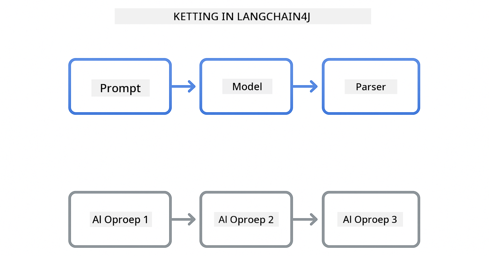

<!--
CO_OP_TRANSLATOR_METADATA:
{
  "original_hash": "377b3e3e6f8d02965bf0fbbc9ccb45c5",
  "translation_date": "2025-12-13T15:03:33+00:00",
  "source_file": "00-quick-start/README.md",
  "language_code": "nl"
}
-->
# Module 00: Snel Starten

## Inhoudsopgave

- [Introductie](../../../00-quick-start)
- [Wat is LangChain4j?](../../../00-quick-start)
- [LangChain4j Afhankelijkheden](../../../00-quick-start)
- [Vereisten](../../../00-quick-start)
- [Installatie](../../../00-quick-start)
  - [1. Verkrijg je GitHub-token](../../../00-quick-start)
  - [2. Stel je token in](../../../00-quick-start)
- [Voer de Voorbeelden uit](../../../00-quick-start)
  - [1. Basis Chat](../../../00-quick-start)
  - [2. Prompt Patronen](../../../00-quick-start)
  - [3. Functie Aanroepen](../../../00-quick-start)
  - [4. Document V&A (RAG)](../../../00-quick-start)
- [Wat Elk Voorbeeld Laat Zien](../../../00-quick-start)
- [Volgende Stappen](../../../00-quick-start)
- [Probleemoplossing](../../../00-quick-start)

## Introductie

Deze snelstart is bedoeld om je zo snel mogelijk aan de slag te helpen met LangChain4j. Het behandelt de absolute basis van het bouwen van AI-toepassingen met LangChain4j en GitHub Models. In de volgende modules gebruik je Azure OpenAI met LangChain4j om meer geavanceerde toepassingen te bouwen.

## Wat is LangChain4j?

LangChain4j is een Java-bibliotheek die het bouwen van AI-gestuurde toepassingen vereenvoudigt. In plaats van te werken met HTTP-clients en JSON-parsing, werk je met schone Java-API's.

De "chain" in LangChain verwijst naar het aaneenschakelen van meerdere componenten - je kunt een prompt koppelen aan een model, dat weer aan een parser, of meerdere AI-aanroepen aan elkaar schakelen waarbij de output van de ene de input van de volgende voedt. Deze snelstart richt zich op de basisprincipes voordat complexere ketens worden verkend.



*Componenten aaneenschakelen in LangChain4j - bouwstenen verbinden om krachtige AI-workflows te creëren*

We gebruiken drie kerncomponenten:

**ChatLanguageModel** - De interface voor AI-modelinteracties. Roep `model.chat("prompt")` aan en krijg een antwoordstring terug. We gebruiken `OpenAiOfficialChatModel` die werkt met OpenAI-compatibele eindpunten zoals GitHub Models.

**AiServices** - Maakt type-veilige AI-service interfaces. Definieer methoden, annoteer ze met `@Tool`, en LangChain4j regelt de orkestratie. De AI roept automatisch je Java-methoden aan wanneer nodig.

**MessageWindowChatMemory** - Houdt de gespreksgeschiedenis bij. Zonder dit is elk verzoek onafhankelijk. Met deze component onthoudt de AI eerdere berichten en behoudt context over meerdere beurten.


*LangChain4j architectuur - kerncomponenten werken samen om je AI-toepassingen aan te drijven*

## LangChain4j Afhankelijkheden

Deze snelstart gebruikt twee Maven-afhankelijkheden in de [`pom.xml`](../../../00-quick-start/pom.xml):

```xml
<!-- Core LangChain4j library -->
<dependency>
    <groupId>dev.langchain4j</groupId>
    <artifactId>langchain4j</artifactId> <!-- Inherited from BOM in root pom.xml -->
</dependency>

<!-- OpenAI integration (works with GitHub Models) -->
<dependency>
    <groupId>dev.langchain4j</groupId>
    <artifactId>langchain4j-open-ai-official</artifactId> <!-- Inherited from BOM in root pom.xml -->
</dependency>
```

De `langchain4j-open-ai-official` module levert de `OpenAiOfficialChatModel` klasse die verbinding maakt met OpenAI-compatibele API's. GitHub Models gebruikt hetzelfde API-formaat, dus er is geen speciale adapter nodig - wijs gewoon de basis-URL toe aan `https://models.github.ai/inference`.

## Vereisten

**Gebruik je de Dev Container?** Java en Maven zijn al geïnstalleerd. Je hebt alleen een GitHub Personal Access Token nodig.

**Lokale Ontwikkeling:**
- Java 21+, Maven 3.9+
- GitHub Personal Access Token (instructies hieronder)

> **Opmerking:** Deze module gebruikt `gpt-4.1-nano` van GitHub Models. Wijzig de modelnaam in de code niet - het is geconfigureerd om te werken met de beschikbare modellen van GitHub.

## Installatie

### 1. Verkrijg je GitHub-token

1. Ga naar [GitHub Instellingen → Personal Access Tokens](https://github.com/settings/personal-access-tokens)
2. Klik op "Generate new token"
3. Geef een beschrijvende naam op (bijv. "LangChain4j Demo")
4. Stel een vervaldatum in (7 dagen aanbevolen)
5. Onder "Account permissions", zoek "Models" en zet deze op "Read-only"
6. Klik op "Generate token"
7. Kopieer en bewaar je token - je ziet het niet nogmaals

### 2. Stel je token in

**Optie 1: Gebruik VS Code (Aanbevolen)**

Als je VS Code gebruikt, voeg je je token toe aan het `.env` bestand in de projectroot:

Als het `.env` bestand niet bestaat, kopieer dan `.env.example` naar `.env` of maak een nieuw `.env` bestand aan in de projectroot.

**Voorbeeld `.env` bestand:**
```bash
# In /workspaces/LangChain4j-for-Beginners/.env
GITHUB_TOKEN=your_token_here
```

Dan kun je eenvoudig met de rechtermuisknop op een demo-bestand (bijv. `BasicChatDemo.java`) in de Verkenner klikken en **"Run Java"** selecteren of de launch-configuraties gebruiken vanuit het Run and Debug-paneel.

**Optie 2: Gebruik Terminal**

Stel het token in als een omgevingsvariabele:

**Bash:**
```bash
export GITHUB_TOKEN=your_token_here
```

**PowerShell:**
```powershell
$env:GITHUB_TOKEN=your_token_here
```

## Voer de Voorbeelden uit

**Met VS Code:** Klik met de rechtermuisknop op een demo-bestand in de Verkenner en selecteer **"Run Java"**, of gebruik de launch-configuraties vanuit het Run and Debug-paneel (zorg dat je token eerst in het `.env` bestand staat).

**Met Maven:** Je kunt ook vanaf de opdrachtregel uitvoeren:

### 1. Basis Chat

**Bash:**
```bash
mvn compile exec:java -Dexec.mainClass=com.example.langchain4j.quickstart.BasicChatDemo
```

**PowerShell:**
```powershell
mvn --% compile exec:java -Dexec.mainClass=com.example.langchain4j.quickstart.BasicChatDemo
```

### 2. Prompt Patronen

**Bash:**
```bash
mvn compile exec:java -Dexec.mainClass=com.example.langchain4j.quickstart.PromptEngineeringDemo
```

**PowerShell:**
```powershell
mvn --% compile exec:java -Dexec.mainClass=com.example.langchain4j.quickstart.PromptEngineeringDemo
```

Toont zero-shot, few-shot, chain-of-thought en rol-gebaseerde prompting.

### 3. Functie Aanroepen

**Bash:**
```bash
mvn compile exec:java -Dexec.mainClass=com.example.langchain4j.quickstart.ToolIntegrationDemo
```

**PowerShell:**
```powershell
mvn --% compile exec:java -Dexec.mainClass=com.example.langchain4j.quickstart.ToolIntegrationDemo
```

De AI roept automatisch je Java-methoden aan wanneer nodig.

### 4. Document V&A (RAG)

**Bash:**
```bash
mvn compile exec:java -Dexec.mainClass=com.example.langchain4j.quickstart.SimpleReaderDemo
```

**PowerShell:**
```powershell
mvn --% compile exec:java -Dexec.mainClass=com.example.langchain4j.quickstart.SimpleReaderDemo
```

Stel vragen over de inhoud in `document.txt`.

## Wat Elk Voorbeeld Laat Zien

**Basis Chat** - [BasicChatDemo.java](../../../00-quick-start/src/main/java/com/example/langchain4j/quickstart/BasicChatDemo.java)

Begin hier om LangChain4j in zijn eenvoudigste vorm te zien. Je maakt een `OpenAiOfficialChatModel` aan, stuurt een prompt met `.chat()` en krijgt een antwoord terug. Dit toont de basis: hoe je modellen initialiseert met aangepaste eindpunten en API-sleutels. Zodra je dit patroon begrijpt, bouwt alles daarop voort.

```java
ChatLanguageModel model = OpenAiOfficialChatModel.builder()
    .baseUrl("https://models.github.ai/inference")
    .apiKey(System.getenv("GITHUB_TOKEN"))
    .modelName("gpt-4.1-nano")
    .build();

String response = model.chat("What is LangChain4j?");
System.out.println(response);
```

> **🤖 Probeer met [GitHub Copilot](https://github.com/features/copilot) Chat:** Open [`BasicChatDemo.java`](../../../00-quick-start/src/main/java/com/example/langchain4j/quickstart/BasicChatDemo.java) en vraag:
> - "Hoe schakel ik in deze code over van GitHub Models naar Azure OpenAI?"
> - "Welke andere parameters kan ik configureren in OpenAiOfficialChatModel.builder()?"
> - "Hoe voeg ik streaming responses toe in plaats van te wachten op het volledige antwoord?"

**Prompt Engineering** - [PromptEngineeringDemo.java](../../../00-quick-start/src/main/java/com/example/langchain4j/quickstart/PromptEngineeringDemo.java)

Nu je weet hoe je met een model praat, verkennen we wat je tegen het model zegt. Deze demo gebruikt dezelfde modelconfiguratie maar toont vier verschillende prompting-patronen. Probeer zero-shot prompts voor directe instructies, few-shot prompts die leren van voorbeelden, chain-of-thought prompts die redeneerstappen onthullen, en rol-gebaseerde prompts die context instellen. Je ziet hoe hetzelfde model dramatisch verschillende resultaten geeft afhankelijk van hoe je je verzoek formuleert.

```java
PromptTemplate template = PromptTemplate.from(
    "What's the best time to visit {{destination}} for {{activity}}?"
);

Prompt prompt = template.apply(Map.of(
    "destination", "Paris",
    "activity", "sightseeing"
));

String response = model.chat(prompt.text());
```

> **🤖 Probeer met [GitHub Copilot](https://github.com/features/copilot) Chat:** Open [`PromptEngineeringDemo.java`](../../../00-quick-start/src/main/java/com/example/langchain4j/quickstart/PromptEngineeringDemo.java) en vraag:
> - "Wat is het verschil tussen zero-shot en few-shot prompting, en wanneer gebruik ik welke?"
> - "Hoe beïnvloedt de temperatuurparameter de reacties van het model?"
> - "Wat zijn technieken om prompt injection aanvallen in productie te voorkomen?"
> - "Hoe maak ik herbruikbare PromptTemplate-objecten voor veelvoorkomende patronen?"

**Tool Integratie** - [ToolIntegrationDemo.java](../../../00-quick-start/src/main/java/com/example/langchain4j/quickstart/ToolIntegrationDemo.java)

Hier wordt LangChain4j krachtig. Je gebruikt `AiServices` om een AI-assistent te maken die je Java-methoden kan aanroepen. Annoteer methoden met `@Tool("beschrijving")` en LangChain4j regelt de rest - de AI beslist automatisch wanneer elke tool te gebruiken op basis van wat de gebruiker vraagt. Dit demonstreert functie-aanroepen, een belangrijke techniek om AI te bouwen die acties kan uitvoeren, niet alleen vragen beantwoorden.

```java
@Tool("Performs addition of two numeric values")
public double add(double a, double b) {
    return a + b;
}

MathAssistant assistant = AiServices.create(MathAssistant.class, model);
String response = assistant.chat("What is 25 plus 17?");
```

> **🤖 Probeer met [GitHub Copilot](https://github.com/features/copilot) Chat:** Open [`ToolIntegrationDemo.java`](../../../00-quick-start/src/main/java/com/example/langchain4j/quickstart/ToolIntegrationDemo.java) en vraag:
> - "Hoe werkt de @Tool annotatie en wat doet LangChain4j erachter de schermen mee?"
> - "Kan de AI meerdere tools achter elkaar aanroepen om complexe problemen op te lossen?"
> - "Wat gebeurt er als een tool een uitzondering gooit - hoe moet ik fouten afhandelen?"
> - "Hoe integreer ik een echte API in plaats van dit rekenvoorbeeld?"

**Document V&A (RAG)** - [SimpleReaderDemo.java](../../../00-quick-start/src/main/java/com/example/langchain4j/quickstart/SimpleReaderDemo.java)

Hier zie je de basis van RAG (retrieval-augmented generation). In plaats van te vertrouwen op de trainingsdata van het model, laad je inhoud uit [`document.txt`](../../../00-quick-start/document.txt) en neem je die op in de prompt. De AI antwoordt op basis van jouw document, niet op zijn algemene kennis. Dit is de eerste stap naar het bouwen van systemen die met je eigen data kunnen werken.

```java
Document document = FileSystemDocumentLoader.loadDocument("document.txt");
String content = document.text();

String prompt = "Based on this document: " + content + 
                "\nQuestion: What is the main topic?";
String response = model.chat(prompt);
```

> **Opmerking:** Deze eenvoudige aanpak laadt het hele document in de prompt. Voor grote bestanden (>10KB) overschrijd je de contextlimieten. Module 03 behandelt chunking en vectorzoekopdrachten voor productie-RAG-systemen.

> **🤖 Probeer met [GitHub Copilot](https://github.com/features/copilot) Chat:** Open [`SimpleReaderDemo.java`](../../../00-quick-start/src/main/java/com/example/langchain4j/quickstart/SimpleReaderDemo.java) en vraag:
> - "Hoe voorkomt RAG AI-hallucinaties vergeleken met het gebruik van de trainingsdata van het model?"
> - "Wat is het verschil tussen deze eenvoudige aanpak en het gebruik van vector embeddings voor retrieval?"
> - "Hoe schaal ik dit om meerdere documenten of grotere kennisbases te verwerken?"
> - "Wat zijn best practices voor het structureren van de prompt zodat de AI alleen de gegeven context gebruikt?"

## Debuggen

De voorbeelden bevatten `.logRequests(true)` en `.logResponses(true)` om API-aanroepen in de console te tonen. Dit helpt bij het oplossen van authenticatiefouten, snelheidslimieten of onverwachte reacties. Verwijder deze vlaggen in productie om logruis te verminderen.

## Volgende Stappen

**Volgende Module:** [01-introduction - Aan de slag met LangChain4j en gpt-5 op Azure](../01-introduction/README.md)

---

**Navigatie:** [← Terug naar Hoofdmenu](../README.md) | [Volgende: Module 01 - Introductie →](../01-introduction/README.md)

---

## Probleemoplossing

### Eerste Maven Build

**Probleem**: Eerste `mvn clean compile` of `mvn package` duurt lang (10-15 minuten)

**Oorzaak**: Maven moet alle projectafhankelijkheden downloaden (Spring Boot, LangChain4j bibliotheken, Azure SDK's, enz.) bij de eerste build.

**Oplossing**: Dit is normaal gedrag. Volgende builds zijn veel sneller omdat afhankelijkheden lokaal worden gecachet. Downloadtijd hangt af van je netwerksnelheid.

### PowerShell Maven Command Syntax

**Probleem**: Maven-commando's falen met fout `Unknown lifecycle phase ".mainClass=..."`

**Oorzaak**: PowerShell interpreteert `=` als een variabele-toewijzing, waardoor Maven-eigenschapssyntaxis breekt.

**Oplossing**: Gebruik de stop-parsing operator `--%` vóór het Maven-commando:

**PowerShell:**
```powershell
mvn --% compile exec:java -Dexec.mainClass=com.example.langchain4j.quickstart.BasicChatDemo
```

**Bash:**
```bash
mvn compile exec:java -Dexec.mainClass=com.example.langchain4j.quickstart.BasicChatDemo
```

De `--%` operator vertelt PowerShell om alle resterende argumenten letterlijk door te geven aan Maven zonder interpretatie.

### Windows PowerShell Emoji Weergave

**Probleem**: AI-antwoorden tonen onleesbare tekens (bijv. `????` of `â??`) in plaats van emoji's in PowerShell

**Oorzaak**: De standaardcodering van PowerShell ondersteunt geen UTF-8 emoji's

**Oplossing**: Voer dit commando uit voordat je Java-applicaties start:
```cmd
chcp 65001
```

Dit forceert UTF-8 codering in de terminal. Gebruik eventueel Windows Terminal, dat betere Unicode-ondersteuning heeft.

---

<!-- CO-OP TRANSLATOR DISCLAIMER START -->
**Disclaimer**:  
Dit document is vertaald met behulp van de AI-vertalingsdienst [Co-op Translator](https://github.com/Azure/co-op-translator). Hoewel we streven naar nauwkeurigheid, dient u er rekening mee te houden dat geautomatiseerde vertalingen fouten of onnauwkeurigheden kunnen bevatten. Het originele document in de oorspronkelijke taal moet als de gezaghebbende bron worden beschouwd. Voor cruciale informatie wordt professionele menselijke vertaling aanbevolen. Wij zijn niet aansprakelijk voor eventuele misverstanden of verkeerde interpretaties die voortvloeien uit het gebruik van deze vertaling.
<!-- CO-OP TRANSLATOR DISCLAIMER END -->