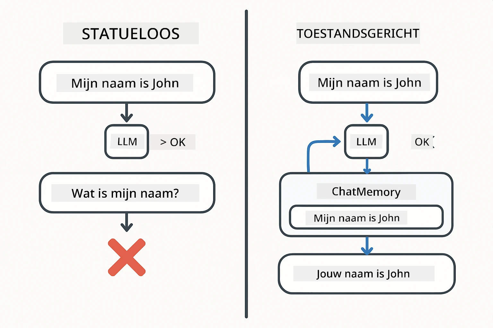
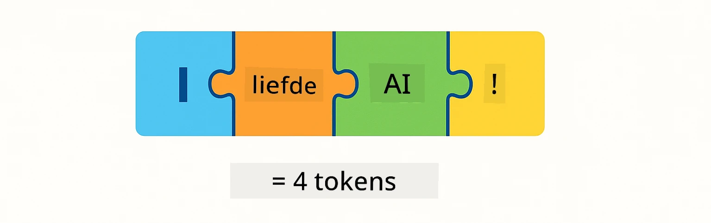
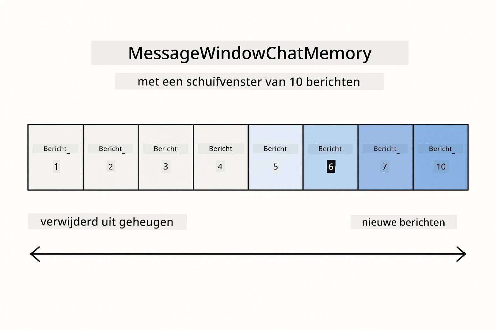
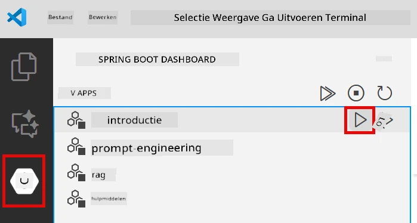
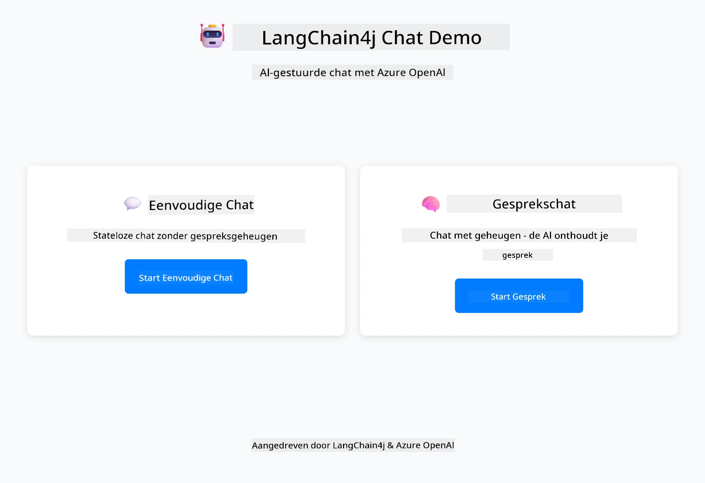
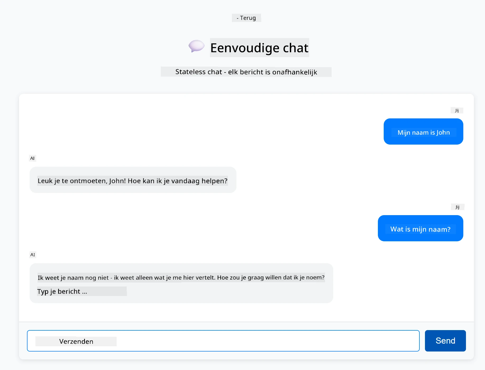
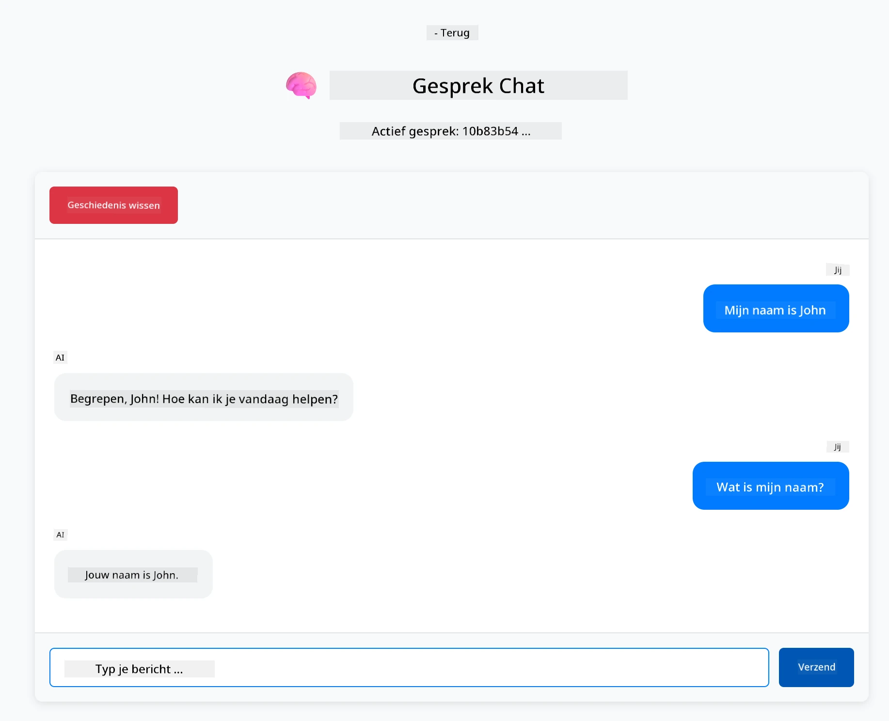

<!--
CO_OP_TRANSLATOR_METADATA:
{
  "original_hash": "c3e07ca58d0b8a3f47d3bf5728541e0a",
  "translation_date": "2025-12-13T13:45:51+00:00",
  "source_file": "01-introduction/README.md",
  "language_code": "nl"
}
-->
# Module 01: Aan de slag met LangChain4j

## Inhoudsopgave

- [Wat je zult leren](../../../01-introduction)
- [Vereisten](../../../01-introduction)
- [Het kernprobleem begrijpen](../../../01-introduction)
- [Tokens begrijpen](../../../01-introduction)
- [Hoe geheugen werkt](../../../01-introduction)
- [Hoe dit LangChain4j gebruikt](../../../01-introduction)
- [Azure OpenAI-infrastructuur implementeren](../../../01-introduction)
- [De applicatie lokaal uitvoeren](../../../01-introduction)
- [De applicatie gebruiken](../../../01-introduction)
  - [Stateless Chat (linkerpaneel)](../../../01-introduction)
  - [Stateful Chat (rechterpaneel)](../../../01-introduction)
- [Volgende stappen](../../../01-introduction)

## Wat je zult leren

Als je de quick start hebt voltooid, heb je gezien hoe je prompts kunt verzenden en reacties kunt ontvangen. Dat is de basis, maar echte applicaties hebben meer nodig. Deze module leert je hoe je conversatie-AI bouwt die context onthoudt en de status bijhoudt - het verschil tussen een eenmalige demo en een productieklare applicatie.

We gebruiken Azure OpenAI's GPT-5 door deze gids heen omdat de geavanceerde redeneercapaciteiten het gedrag van verschillende patronen duidelijker maken. Wanneer je geheugen toevoegt, zie je het verschil duidelijk. Dit maakt het makkelijker te begrijpen wat elk onderdeel aan je applicatie toevoegt.

Je bouwt één applicatie die beide patronen demonstreert:

**Stateless Chat** - Elke aanvraag is onafhankelijk. Het model heeft geen geheugen van eerdere berichten. Dit is het patroon dat je in de quick start gebruikte.

**Stateful Conversation** - Elke aanvraag bevat de gespreksgeschiedenis. Het model behoudt context over meerdere beurten. Dit is wat productieapplicaties vereisen.

## Vereisten

- Azure-abonnement met toegang tot Azure OpenAI
- Java 21, Maven 3.9+
- Azure CLI (https://learn.microsoft.com/en-us/cli/azure/install-azure-cli)
- Azure Developer CLI (azd) (https://learn.microsoft.com/en-us/azure/developer/azure-developer-cli/install-azd)

> **Opmerking:** Java, Maven, Azure CLI en Azure Developer CLI (azd) zijn vooraf geïnstalleerd in de meegeleverde devcontainer.

> **Opmerking:** Deze module gebruikt GPT-5 op Azure OpenAI. De implementatie wordt automatisch geconfigureerd via `azd up` - wijzig de modelnaam in de code niet.

## Het kernprobleem begrijpen

Taalmodellen zijn stateless. Elke API-aanroep is onafhankelijk. Als je "Mijn naam is John" stuurt en daarna vraagt "Wat is mijn naam?", heeft het model geen idee dat je jezelf net hebt voorgesteld. Het behandelt elke aanvraag alsof het de eerste conversatie ooit is.

Dit is prima voor eenvoudige Q&A, maar nutteloos voor echte applicaties. Klantenservicebots moeten onthouden wat je ze vertelde. Persoonlijke assistenten hebben context nodig. Elke multi-turn conversatie vereist geheugen.



*Het verschil tussen stateless (onafhankelijke oproepen) en stateful (contextbewuste) gesprekken*

## Tokens begrijpen

Voordat je in gesprekken duikt, is het belangrijk tokens te begrijpen - de basiseenheden van tekst die taalmodellen verwerken:



*Voorbeeld van hoe tekst wordt opgedeeld in tokens - "I love AI!" wordt 4 aparte verwerkingsunits*

Tokens zijn hoe AI-modellen tekst meten en verwerken. Woorden, leestekens en zelfs spaties kunnen tokens zijn. Je model heeft een limiet aan hoeveel tokens het tegelijk kan verwerken (400.000 voor GPT-5, met tot 272.000 inputtokens en 128.000 outputtokens). Tokens begrijpen helpt je de lengte van gesprekken en kosten te beheren.

## Hoe geheugen werkt

Chatgeheugen lost het stateless probleem op door de gespreksgeschiedenis bij te houden. Voordat je je verzoek naar het model stuurt, voegt het framework relevante eerdere berichten toe. Wanneer je vraagt "Wat is mijn naam?", stuurt het systeem eigenlijk de hele gespreksgeschiedenis mee, waardoor het model kan zien dat je eerder zei "Mijn naam is John."

LangChain4j biedt geheugenimplementaties die dit automatisch afhandelen. Je kiest hoeveel berichten je wilt bewaren en het framework beheert het contextvenster.



*MessageWindowChatMemory houdt een schuivend venster van recente berichten bij en verwijdert automatisch oude*

## Hoe dit LangChain4j gebruikt

Deze module breidt de quick start uit door Spring Boot te integreren en gespreksgeheugen toe te voegen. Zo passen de onderdelen samen:

**Dependencies** - Voeg twee LangChain4j-bibliotheken toe:

```xml
<dependency>
    <groupId>dev.langchain4j</groupId>
    <artifactId>langchain4j</artifactId> <!-- Inherited from BOM in root pom.xml -->
</dependency>
<dependency>
    <groupId>dev.langchain4j</groupId>
    <artifactId>langchain4j-open-ai-official</artifactId> <!-- Inherited from BOM in root pom.xml -->
</dependency>
```

**Chat Model** - Configureer Azure OpenAI als een Spring bean ([LangChainConfig.java](../../../01-introduction/src/main/java/com/example/langchain4j/config/LangChainConfig.java)):

```java
@Bean
public OpenAiOfficialChatModel openAiOfficialChatModel() {
    return OpenAiOfficialChatModel.builder()
            .baseUrl(azureEndpoint)
            .apiKey(azureApiKey)
            .modelName(deploymentName)
            .timeout(Duration.ofMinutes(5))
            .maxRetries(3)
            .build();
}
```

De builder leest referenties uit omgevingsvariabelen die door `azd up` zijn ingesteld. Het instellen van `baseUrl` op je Azure-eindpunt zorgt dat de OpenAI-client met Azure OpenAI werkt.

**Gespreksgeheugen** - Houd chatgeschiedenis bij met MessageWindowChatMemory ([ConversationService.java](../../../01-introduction/src/main/java/com/example/langchain4j/service/ConversationService.java)):

```java
ChatMemory memory = MessageWindowChatMemory.withMaxMessages(10);

memory.add(UserMessage.from("My name is John"));
memory.add(AiMessage.from("Nice to meet you, John!"));

memory.add(UserMessage.from("What's my name?"));
AiMessage aiMessage = chatModel.chat(memory.messages()).aiMessage();
memory.add(aiMessage);
```

Maak geheugen aan met `withMaxMessages(10)` om de laatste 10 berichten te bewaren. Voeg gebruikers- en AI-berichten toe met getypte wrappers: `UserMessage.from(text)` en `AiMessage.from(text)`. Haal geschiedenis op met `memory.messages()` en stuur die naar het model. De service slaat aparte geheugeninstanties per gesprek-ID op, zodat meerdere gebruikers tegelijk kunnen chatten.

> **🤖 Probeer met [GitHub Copilot](https://github.com/features/copilot) Chat:** Open [`ConversationService.java`](../../../01-introduction/src/main/java/com/example/langchain4j/service/ConversationService.java) en vraag:
> - "Hoe bepaalt MessageWindowChatMemory welke berichten worden verwijderd als het venster vol is?"
> - "Kan ik aangepaste geheugenopslag implementeren met een database in plaats van in-memory?"
> - "Hoe zou ik samenvatting toevoegen om oude gespreksgeschiedenis te comprimeren?"

De stateless chat endpoint slaat geheugen volledig over - gewoon `chatModel.chat(prompt)` zoals in de quick start. De stateful endpoint voegt berichten toe aan geheugen, haalt geschiedenis op en voegt die context toe aan elke aanvraag. Zelfde modelconfiguratie, verschillende patronen.

## Azure OpenAI-infrastructuur implementeren

**Bash:**
```bash
cd 01-introduction
azd up  # Selecteer abonnement en locatie (eastus2 aanbevolen)
```

**PowerShell:**
```powershell
cd 01-introduction
azd up  # Selecteer abonnement en locatie (eastus2 aanbevolen)
```

> **Opmerking:** Als je een time-out fout krijgt (`RequestConflict: Cannot modify resource ... provisioning state is not terminal`), voer dan gewoon `azd up` opnieuw uit. Azure-resources kunnen nog steeds worden ingericht op de achtergrond, en opnieuw proberen laat de implementatie voltooien zodra resources een terminale status bereiken.

Dit zal:
1. Azure OpenAI-resource implementeren met GPT-5 en text-embedding-3-small modellen
2. Automatisch een `.env`-bestand genereren in de projectroot met referenties
3. Alle vereiste omgevingsvariabelen instellen

**Problemen met implementatie?** Zie de [Infrastructure README](infra/README.md) voor gedetailleerde probleemoplossing inclusief subdomeinnaamconflicten, handmatige Azure Portal-implementatiestappen en modelconfiguratieadvies.

**Controleer of implementatie geslaagd is:**

**Bash:**
```bash
cat ../.env  # Moet AZURE_OPENAI_ENDPOINT, API_KEY, enz. tonen.
```

**PowerShell:**
```powershell
Get-Content ..\.env  # Moet AZURE_OPENAI_ENDPOINT, API_KEY, enz. tonen.
```

> **Opmerking:** Het `azd up`-commando genereert automatisch het `.env`-bestand. Als je het later moet bijwerken, kun je het `.env`-bestand handmatig bewerken of opnieuw genereren door:
>
> **Bash:**
> ```bash
> cd ..
> bash .azd-env.sh
> ```
>
> **PowerShell:**
> ```powershell
> cd ..
> .\.azd-env.ps1
> ```

## De applicatie lokaal uitvoeren

**Controleer implementatie:**

Zorg dat het `.env`-bestand in de hoofdmap bestaat met Azure-referenties:

**Bash:**
```bash
cat ../.env  # Moet AZURE_OPENAI_ENDPOINT, API_KEY, DEPLOYMENT tonen
```

**PowerShell:**
```powershell
Get-Content ..\.env  # Moet AZURE_OPENAI_ENDPOINT, API_KEY, DEPLOYMENT tonen
```

**Start de applicaties:**

**Optie 1: Gebruik Spring Boot Dashboard (aanbevolen voor VS Code-gebruikers)**

De devcontainer bevat de Spring Boot Dashboard-extensie, die een visuele interface biedt om alle Spring Boot-applicaties te beheren. Je vindt het in de Activiteitenbalk aan de linkerkant van VS Code (zoek naar het Spring Boot-pictogram).

Vanaf het Spring Boot Dashboard kun je:
- Alle beschikbare Spring Boot-applicaties in de werkruimte zien
- Applicaties starten/stoppen met één klik
- Applicatielogs in realtime bekijken
- Applicatiestatus monitoren

Klik simpelweg op de afspeelknop naast "introduction" om deze module te starten, of start alle modules tegelijk.



**Optie 2: Gebruik shell-scripts**

Start alle webapplicaties (modules 01-04):

**Bash:**
```bash
cd ..  # Vanuit de hoofdmap
./start-all.sh
```

**PowerShell:**
```powershell
cd ..  # Vanuit de hoofdmap
.\start-all.ps1
```

Of start alleen deze module:

**Bash:**
```bash
cd 01-introduction
./start.sh
```

**PowerShell:**
```powershell
cd 01-introduction
.\start.ps1
```

Beide scripts laden automatisch omgevingsvariabelen uit het root `.env`-bestand en bouwen de JAR's als die nog niet bestaan.

> **Opmerking:** Als je alle modules handmatig wilt bouwen voordat je start:
>
> **Bash:**
> ```bash
> cd ..  # Go to root directory
> mvn clean package -DskipTests
> ```
>
> **PowerShell:**
> ```powershell
> cd ..  # Go to root directory
> mvn clean package -DskipTests
> ```

Open http://localhost:8080 in je browser.

**Om te stoppen:**

**Bash:**
```bash
./stop.sh  # Alleen deze module
# Of
cd .. && ./stop-all.sh  # Alle modules
```

**PowerShell:**
```powershell
.\stop.ps1  # Alleen deze module
# Of
cd ..; .\stop-all.ps1  # Alle modules
```

## De applicatie gebruiken

De applicatie biedt een webinterface met twee chatimplementaties naast elkaar.



*Dashboard toont zowel Simple Chat (stateless) als Conversational Chat (stateful) opties*

### Stateless Chat (linkerpaneel)

Probeer dit eerst. Vraag "Mijn naam is John" en vraag dan direct "Wat is mijn naam?" Het model zal het niet onthouden omdat elk bericht onafhankelijk is. Dit toont het kernprobleem van basisintegratie van taalmodellen - geen gesprekcontext.



*AI herinnert zich je naam niet van het vorige bericht*

### Stateful Chat (rechterpaneel)

Probeer nu dezelfde volgorde hier. Vraag "Mijn naam is John" en dan "Wat is mijn naam?" Deze keer onthoudt het. Het verschil is MessageWindowChatMemory - het houdt de gespreksgeschiedenis bij en voegt die toe aan elke aanvraag. Zo werkt productieconversatie-AI.



*AI herinnert zich je naam van eerder in het gesprek*

Beide panelen gebruiken hetzelfde GPT-5-model. Het enige verschil is geheugen. Dit maakt duidelijk wat geheugen aan je applicatie toevoegt en waarom het essentieel is voor echte gebruikssituaties.

## Volgende stappen

**Volgende module:** [02-prompt-engineering - Prompt Engineering met GPT-5](../02-prompt-engineering/README.md)

---

**Navigatie:** [← Vorige: Module 00 - Quick Start](../00-quick-start/README.md) | [Terug naar hoofdmenu](../README.md) | [Volgende: Module 02 - Prompt Engineering →](../02-prompt-engineering/README.md)

---

<!-- CO-OP TRANSLATOR DISCLAIMER START -->
**Disclaimer**:  
Dit document is vertaald met behulp van de AI-vertalingsdienst [Co-op Translator](https://github.com/Azure/co-op-translator). Hoewel we streven naar nauwkeurigheid, dient u er rekening mee te houden dat geautomatiseerde vertalingen fouten of onnauwkeurigheden kunnen bevatten. Het originele document in de oorspronkelijke taal moet als de gezaghebbende bron worden beschouwd. Voor cruciale informatie wordt professionele menselijke vertaling aanbevolen. Wij zijn niet aansprakelijk voor eventuele misverstanden of verkeerde interpretaties die voortvloeien uit het gebruik van deze vertaling.
<!-- CO-OP TRANSLATOR DISCLAIMER END -->