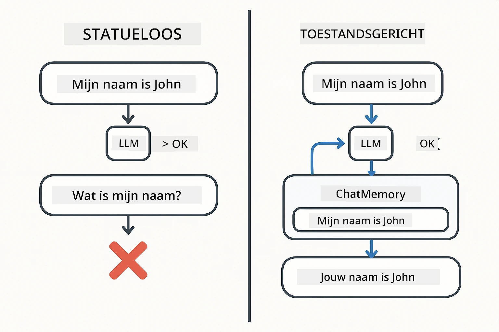
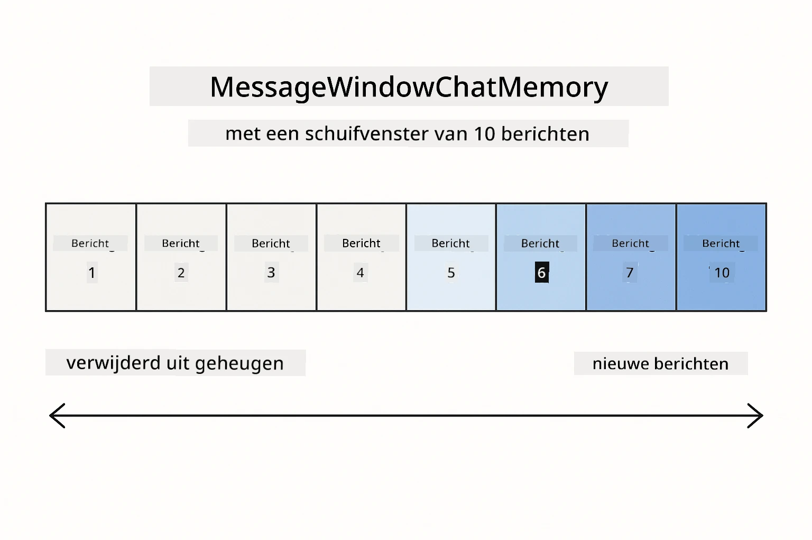
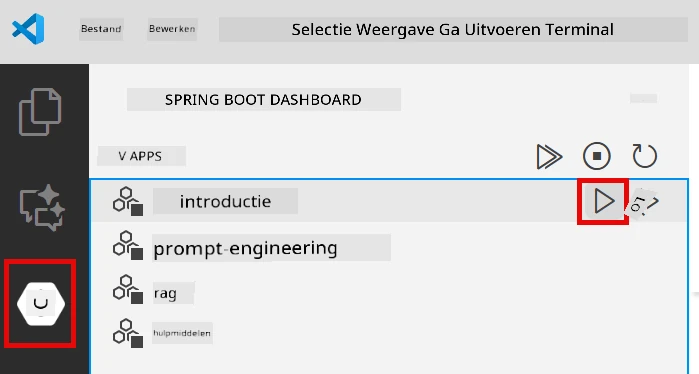
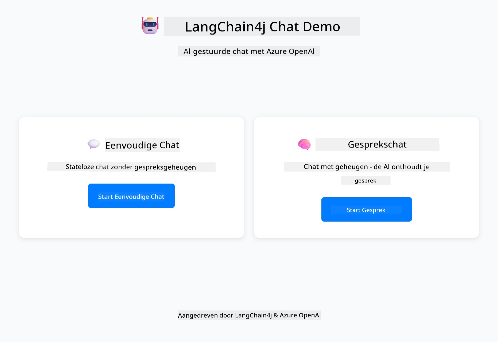
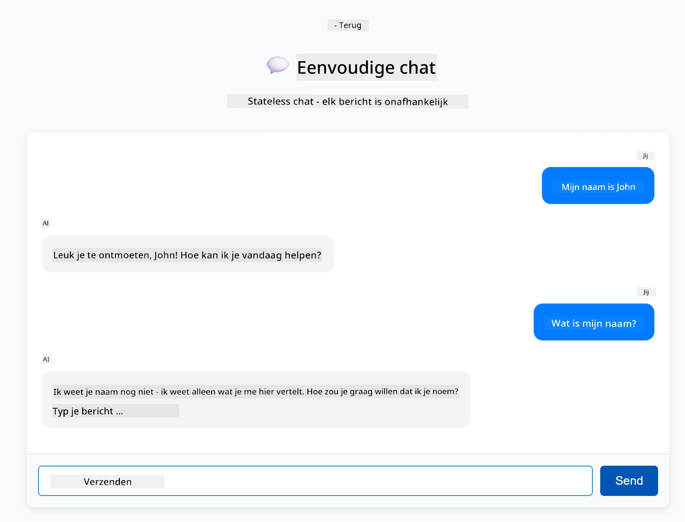
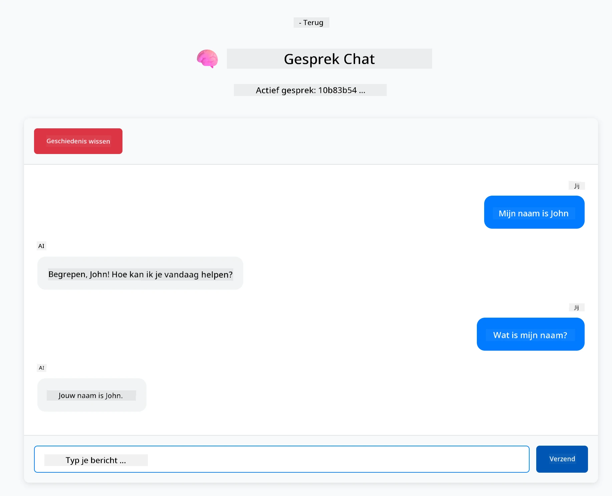

# Module 01: Aan de slag met LangChain4j

## Inhoudsopgave

- [Video Walkthrough](#video-walkthrough)
- [Wat Je Zal Leren](#wat-je-zal-leren)
- [Vereisten](#vereisten)
- [Begrijpen van het Kernprobleem](#begrijpen-van-het-kernprobleem)
- [Begrijpen van Tokens](#begrijpen-van-tokens)
- [Hoe Geheugen Werkt](#hoe-geheugen-werkt)
- [Hoe Dit LangChain4j Gebruikt](#hoe-dit-langchain4j-gebruikt)
- [Azure OpenAI Infrastructuur Implementeren](#azure-openai-infrastructuur-implementeren)
- [De Applicatie Lokaal Uitvoeren](#de-applicatie-lokaal-uitvoeren)
- [De Applicatie Gebruiken](#de-applicatie-gebruiken)
  - [Stateless Chat (Linker Paneel)](#stateless-chat-linker-paneel)
  - [Stateful Chat (Rechter Paneel)](#stateful-chat-rechter-paneel)
- [Volgende Stappen](#volgende-stappen)

## Video Walkthrough

Bekijk deze live sessie die uitlegt hoe je met deze module aan de slag gaat:

<a href="https://www.youtube.com/live/nl_troDm8rQ?si=6b85S8xGjWnT2fX9"></a>

## Wat Je Zal Leren

Dit is je startpunt met LangChain4j en Azure OpenAI. We beginnen met de basisprincipes en bouwen productie-achtige applicaties. Deze module richt zich op conversational AI die context onthoudt en staat behoudt — dit zijn de fundamentele concepten waar alle latere modules op voortbouwen.

We gebruiken Azure OpenAI's GPT-5.2 door deze hele gids omdat de geavanceerde redeneer-mogelijkheden van dit model het gedrag van verschillende patronen duidelijker maken. Wanneer je geheugen toevoegt, zie je het verschil glashelder. Dit maakt het gemakkelijker om te begrijpen wat elke component voor je applicatie doet.

Je bouwt één applicatie die beide patronen demonstreert:

**Stateless Chat** – Elk verzoek is onafhankelijk. Het model heeft geen geheugen van eerdere berichten. Dit is het eenvoudigste startpunt.

**Stateful Conversation** – Elk verzoek bevat het gesprekshistorie. Het model behoudt context over meerdere beurten. Dit is wat productieapplicaties vereisen.

## Vereisten

- Azure-abonnement met Azure OpenAI-toegang
- Java 21, Maven 3.9+ 
- Azure CLI (https://learn.microsoft.com/en-us/cli/azure/install-azure-cli)
- Azure Developer CLI (azd) (https://learn.microsoft.com/en-us/azure/developer/azure-developer-cli/install-azd)

> **Opmerking:** Java, Maven, Azure CLI en Azure Developer CLI (azd) zijn vooraf geïnstalleerd in de meegeleverde devcontainer.

> **Opmerking:** Deze module gebruikt GPT-5.2 op Azure OpenAI. De deployment wordt automatisch geconfigureerd via `azd up` - wijzig de modelnaam niet in de code.

## Begrijpen van het Kernprobleem

Taalmodellen zijn stateless. Elke API-aanroep is onafhankelijk. Als je zegt "Mijn naam is John" en daarna vraagt "Wat is mijn naam?", weet het model niet dat je jezelf zojuist hebt voorgesteld. Het behandelt elk verzoek alsof het de eerste keer is dat je praat.

Dit is prima voor eenvoudige Q&A, maar nutteloos voor echte applicaties. Klantenservice-bots moeten onthouden wat je ze vertelde. Persoonlijke assistenten hebben context nodig. Elke multi-turn conversatie vereist geheugen.

Het volgende diagram zet de twee benaderingen tegenover elkaar — links een stateless aanroep die je naam vergeet; rechts een stateful aanroep ondersteund door ChatMemory die het onthoudt.



*Het verschil tussen stateless (onafhankelijke aanroepen) en stateful (contextbewuste) gesprekken*

## Begrijpen van Tokens

Voordat we in gesprekken duiken, is het belangrijk om tokens te begrijpen – de basiseenheden van tekst die taalmodellen verwerken:


*Voorbeeld van hoe tekst in tokens wordt opgedeeld - "I love AI!" wordt 4 aparte verwerkingsunits*

Tokens zijn hoe AI-modellen tekst meten en verwerken. Woorden, leestekens en zelfs spaties kunnen tokens zijn. Je model heeft een limiet aan hoeveel tokens het tegelijk kan verwerken (400.000 voor GPT-5.2, met maximaal 272.000 inputtokens en 128.000 outputtokens). Tokens begrijpen helpt je de lengte van het gesprek en kosten te beheren.

## Hoe Geheugen Werkt

Chatgeheugen lost het stateless probleem op door gesprekshistorie te behouden. Voordat je je verzoek naar het model stuurt, voegt het framework relevante vorige berichten toe. Wanneer je vraagt "Wat is mijn naam?", stuurt het systeem daadwerkelijk de hele gesprekshistorie mee, zodat het model ziet dat je eerder zei "Mijn naam is John."

LangChain4j biedt geheugenimplementaties die dit automatisch afhandelen. Je kiest hoeveel berichten je wil bewaren en het framework beheert het contextvenster. Het onderstaande diagram toont hoe MessageWindowChatMemory een schuivend venster van recente berichten onderhoudt.



*MessageWindowChatMemory onderhoudt een schuivend venster van recente berichten en verwijdert automatisch oude*

## Hoe Dit LangChain4j Gebruikt

Deze module integreert Spring Boot en voegt gesprekgeheugen toe. Zo passen de onderdelen samen:

**Dependencies** – Voeg twee LangChain4j-bibliotheken toe:

```xml
<dependency>
    <groupId>dev.langchain4j</groupId>
    <artifactId>langchain4j</artifactId> <!-- Inherited from BOM in root pom.xml -->
</dependency>
<dependency>
    <groupId>dev.langchain4j</groupId>
    <artifactId>langchain4j-open-ai-official</artifactId> <!-- Inherited from BOM in root pom.xml -->
</dependency>
```

**Chat Model** – Configureer Azure OpenAI als een Spring bean ([LangChainConfig.java](../../../01-introduction/src/main/java/com/example/langchain4j/config/LangChainConfig.java)):

```java
@Bean
public OpenAiOfficialChatModel openAiOfficialChatModel() {
    return OpenAiOfficialChatModel.builder()
            .baseUrl(azureEndpoint)
            .apiKey(azureApiKey)
            .modelName(deploymentName)
            .timeout(Duration.ofMinutes(5))
            .maxRetries(3)
            .build();
}
```

De builder leest de credentials uit omgevingsvariabelen die door `azd up` zijn gezet. Het instellen van `baseUrl` op je Azure endpoint laat de OpenAI client met Azure OpenAI werken.

**Gesprekgeheugen** – Houd chatgeschiedenis bij met MessageWindowChatMemory ([ConversationService.java](../../../01-introduction/src/main/java/com/example/langchain4j/service/ConversationService.java)):

```java
ChatMemory memory = MessageWindowChatMemory.withMaxMessages(10);

memory.add(UserMessage.from("My name is John"));
memory.add(AiMessage.from("Nice to meet you, John!"));

memory.add(UserMessage.from("What's my name?"));
AiMessage aiMessage = chatModel.chat(memory.messages()).aiMessage();
memory.add(aiMessage);
```

Maak geheugen aan met `withMaxMessages(10)` om de laatste 10 berichten te bewaren. Voeg gebruiker- en AI-berichten toe met getypeerde wrappers: `UserMessage.from(text)` en `AiMessage.from(text)`. Haal de geschiedenis op met `memory.messages()` en stuur die naar het model. De service slaat per gesprek-ID afzonderlijke geheugeninstanties op, wat meerdere gebruikers tegelijk laat chatten.

> **🤖 Probeer met [GitHub Copilot](https://github.com/features/copilot) Chat:** Open [`ConversationService.java`](../../../01-introduction/src/main/java/com/example/langchain4j/service/ConversationService.java) en vraag:
> - "Hoe beslist MessageWindowChatMemory welke berichten worden verwijderd als het venster vol is?"
> - "Kan ik eigen geheugentoegang implementeren met een database in plaats van in-memory?"
> - "Hoe voeg ik samenvatting toe om oude gesprekshistorie te comprimeren?"

De stateless chat endpoint slaat geheugen helemaal over – gewoon `chatModel.chat(prompt)` zoals de snelle start. De stateful endpoint voegt berichten toe aan geheugen, haalt de geschiedenis op en voegt die context toe aan elk verzoek. Zelfde modelconfiguratie, andere patronen.

## Azure OpenAI Infrastructuur Implementeren

**Bash:**
```bash
cd 01-introduction
azd up  # Selecteer abonnement en locatie (aanbevolen is eastus2)
```

**PowerShell:**
```powershell
cd 01-introduction
azd up  # Selecteer abonnement en locatie (eastus2 aanbevolen)
```

> **Opmerking:** Als je een time-out fout krijgt (`RequestConflict: Cannot modify resource ... provisioning state is not terminal`), voer dan gewoon opnieuw `azd up` uit. Azure resources kunnen nog worden ingericht op de achtergrond, en opnieuw proberen laat de deployment voltooien zodra de resources een eindtoestand bereiken.

Dit zal:
1. De Azure OpenAI resource uitrollen met GPT-5.2 en text-embedding-3-small modellen
2. Automatisch een `.env` bestand genereren in de projectroot met credentials
3. Alle benodigde omgevingsvariabelen instellen

**Problemen met deployment?** Bekijk de [Infrastructure README](infra/README.md) voor gedetailleerde troubleshooting waaronder subdomeinnaam-conflicten, handmatige Azure Portal deployment stappen en modelconfiguratie richtlijnen.

**Controleer of deployment is gelukt:**

**Bash:**
```bash
cat ../.env  # Moet AZURE_OPENAI_ENDPOINT, API_KEY, enz. tonen
```

**PowerShell:**
```powershell
Get-Content ..\.env  # Moet AZURE_OPENAI_ENDPOINT, API_KEY, enz. tonen.
```

> **Opmerking:** Het `azd up` commando genereert automatisch het `.env` bestand. Als je het later moet bijwerken, kun je het `.env` bestand handmatig aanpassen of opnieuw genereren door:
>
> **Bash:**
> ```bash
> cd ..
> bash .azd-env.sh
> ```
>
> **PowerShell:**
> ```powershell
> cd ..
> .\.azd-env.ps1
> ```

## De Applicatie Lokaal Uitvoeren

**Controleer de deployment:**

Zorg dat het `.env` bestand aanwezig is in de root map met Azure-gegevens. Voer dit uit vanuit de module-directory (`01-introduction/`):

**Bash:**
```bash
cat ../.env  # Zou AZURE_OPENAI_ENDPOINT, API_KEY, DEPLOYMENT moeten tonen
```

**PowerShell:**
```powershell
Get-Content ..\.env  # Moet AZURE_OPENAI_ENDPOINT, API_KEY, DEPLOYMENT weergeven
```

**Start de applicaties:**

**Optie 1: Gebruik Spring Boot Dashboard (Aanbevolen voor VS Code gebruikers)**

De devcontainer bevat de Spring Boot Dashboard extensie, die een visuele interface biedt om alle Spring Boot applicaties te beheren. Je vindt deze in de Activity Bar aan de linkerkant in VS Code (zoek naar het Spring Boot icoon).

Vanaf het Spring Boot Dashboard kun je:
- Alle beschikbare Spring Boot applicaties in de workspace zien
- Applicaties starten/stoppen met één klik
- Applicatielogs realtime bekijken
- Applicatiestatus monitoren

Klik simpelweg op de play-knop naast "introduction" om deze module te starten, of start alle modules tegelijk.



*Het Spring Boot Dashboard in VS Code — start, stop en monitor alle modules vanaf één plek*

**Optie 2: Gebruik shell-scripts**

Start alle webapplicaties (modules 01-04):

**Bash:**
```bash
cd ..  # Vanuit de root directory
./start-all.sh
```

**PowerShell:**
```powershell
cd ..  # Vanuit de hoofdmap
.\start-all.ps1
```

Of start alleen deze module:

**Bash:**
```bash
cd 01-introduction
./start.sh
```

**PowerShell:**
```powershell
cd 01-introduction
.\start.ps1
```

Beide scripts laden automatisch omgevingsvariabelen vanuit de root `.env` en bouwen de JARs als die nog niet bestaan.

> **Opmerking:** Wil je liever eerst zelf alle modules handmatig bouwen voordat je start:
>
> **Bash:**
> ```bash
> cd ..  # Go to root directory
> mvn clean package -DskipTests
> ```
>
> **PowerShell:**
> ```powershell
> cd ..  # Go to root directory
> mvn clean package -DskipTests
> ```

Open http://localhost:8080 in je browser.

**Om te stoppen:**

**Bash:**
```bash
./stop.sh  # Alleen deze module
# Of
cd .. && ./stop-all.sh  # Alle modules
```

**PowerShell:**
```powershell
.\stop.ps1  # Alleen deze module
# Of
cd ..; .\stop-all.ps1  # Alle modules
```

## De Applicatie Gebruiken

De applicatie biedt een webinterface met twee chatimplementaties naast elkaar.



*Dashboard toont zowel Simple Chat (stateless) als Conversational Chat (stateful) opties*

### Stateless Chat (Linker Paneel)

Probeer dit eerst. Vraag "Mijn naam is John" en vraag dan meteen "Wat is mijn naam?" Het model zal het niet onthouden omdat elk bericht onafhankelijk is. Dit toont het kernprobleem van basisintegratie met taalmodellen - geen gesprekcontext.



*AI onthoudt je naam niet van het vorige bericht*

### Stateful Chat (Rechter Paneel)

Probeer nu dezelfde volgorde hier. Vraag "Mijn naam is John" en daarna "Wat is mijn naam?" Deze keer herinnert het zich dat wel. Het verschil is MessageWindowChatMemory - het onderhoudt gesprekshistorie en voegt die met elk verzoek mee. Zo werkt conversatie-AI in productie.



*AI onthoudt je naam van eerder in het gesprek*

Beide panelen gebruiken hetzelfde GPT-5.2 model. Het enige verschil is geheugen. Dit maakt duidelijk wat geheugen voor je applicatie betekent en waarom het essentieel is voor echte toepassingen.

## Volgende Stappen

**Volgende Module:** [02-prompt-engineering - Prompt Engineering met GPT-5.2](../02-prompt-engineering/README.md)

---

**Navigatie:** [← Terug naar Hoofdmenu](../README.md) | [Volgende: Module 02 - Prompt Engineering →](../02-prompt-engineering/README.md)

---

<!-- CO-OP TRANSLATOR DISCLAIMER START -->
**Disclaimer**:
Dit document is vertaald met behulp van de AI vertaaldienst [Co-op Translator](https://github.com/Azure/co-op-translator). Hoewel we streven naar nauwkeurigheid, dient u er rekening mee te houden dat geautomatiseerde vertalingen fouten of onnauwkeurigheden kunnen bevatten. Het originele document in de oorspronkelijke taal moet worden beschouwd als de gezaghebbende bron. Voor kritieke informatie wordt professionele menselijke vertaling aanbevolen. Wij zijn niet aansprakelijk voor eventuele misverstanden of verkeerde interpretaties die voortvloeien uit het gebruik van deze vertaling.
<!-- CO-OP TRANSLATOR DISCLAIMER END -->