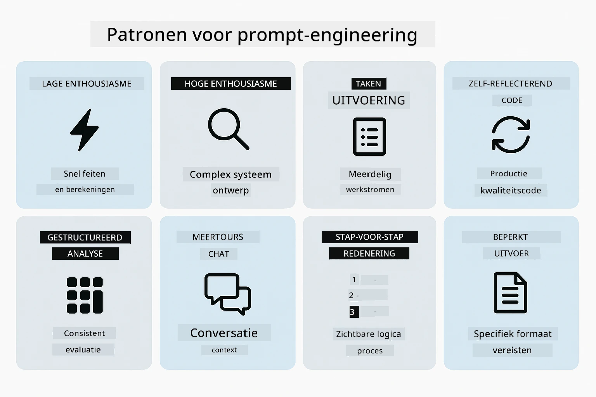
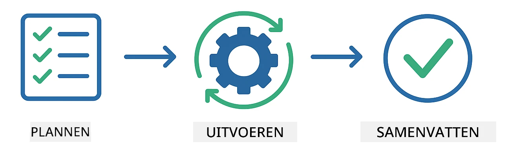
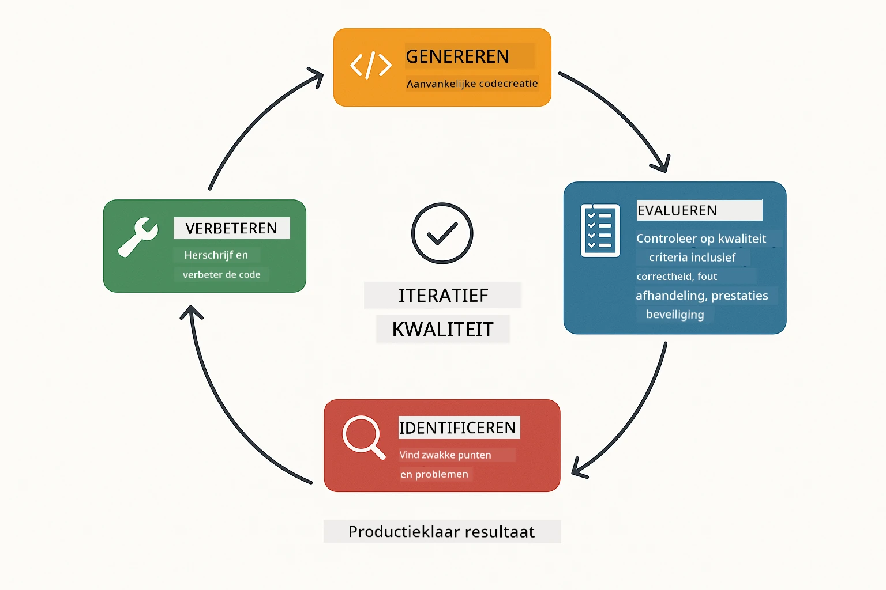
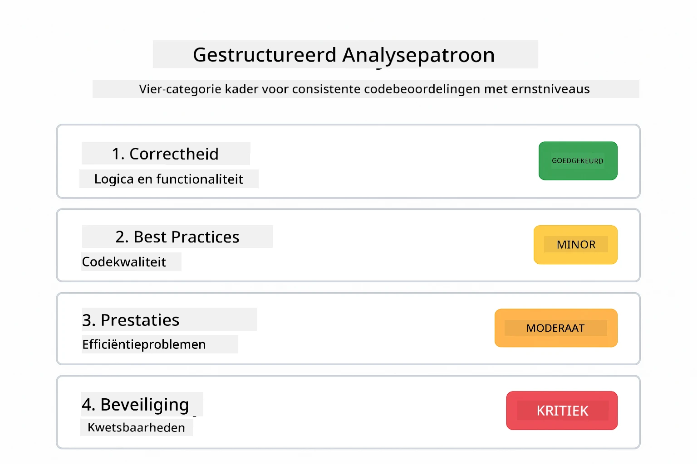
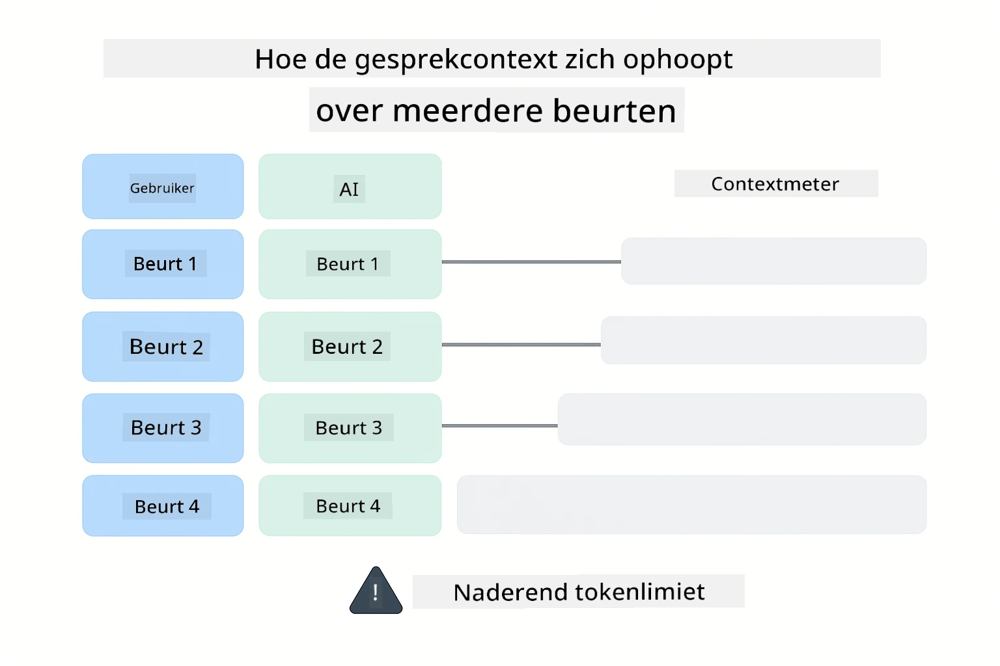
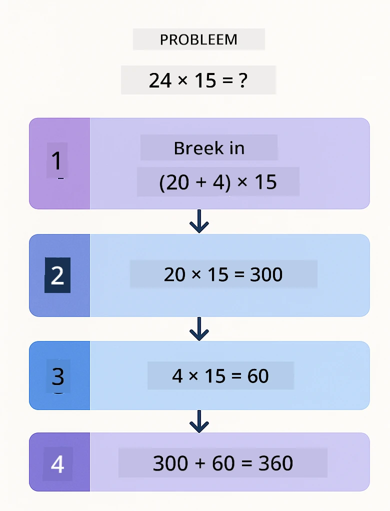
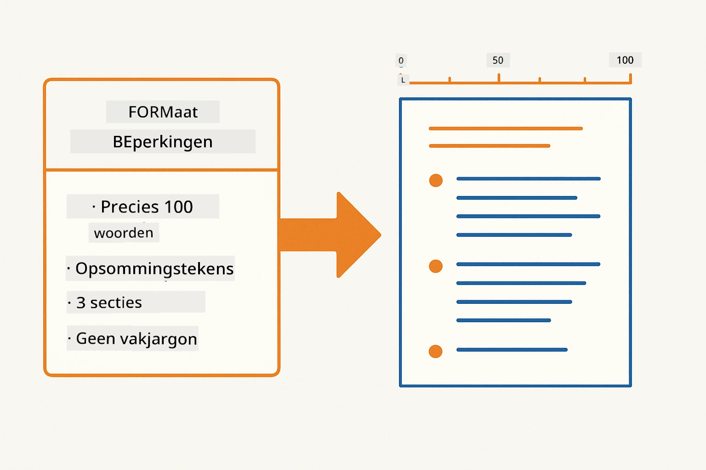
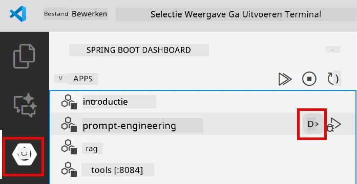
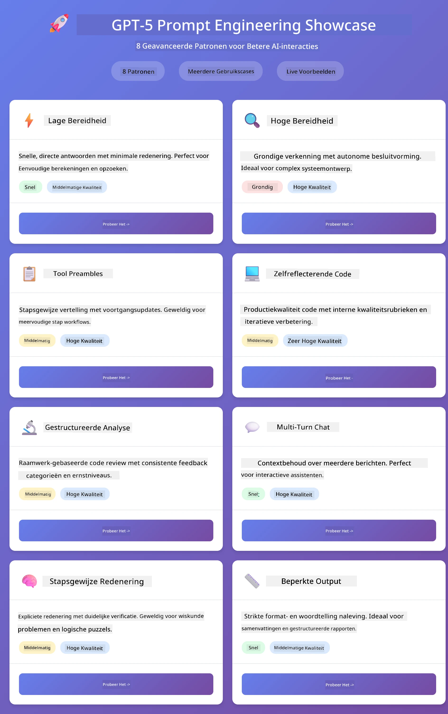
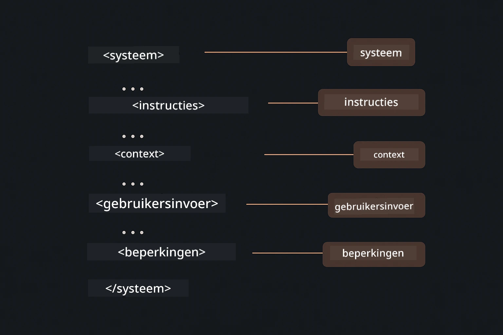

# Module 02: Prompt Engineering met GPT-5.2

## Inhoudsopgave

- [Video Walkthrough](#video-walkthrough)
- [Wat je zult leren](#wat-je-zult-leren)
- [Vereisten](#vereisten)
- [Begrijpen van Prompt Engineering](#begrijpen-van-prompt-engineering)
- [Fundamenten van Prompt Engineering](#fundamenten-van-prompt-engineering)
  - [Zero-Shot Prompting](#zero-shot-prompting)
  - [Few-Shot Prompting](#few-shot-prompting)
  - [Chain of Thought](#chain-of-thought)
  - [Role-Based Prompting](#role-based-prompting)
  - [Prompt Templates](#prompt-templates)
- [Geavanceerde Patronen](#geavanceerde-patronen)
- [Start de Applicatie](#start-de-applicatie)
- [Applicatie Screenshots](#applicatie-screenshots)
- [Patronen Verkennen](#patronen-verkennen)
  - [Lage vs Hoge Enthousiasme](#lage-vs-hoge-enthousiasme)
  - [Taakuitvoering (Tool Preambles)](#taakuitvoering-tool-preambles)
  - [Zelfreflecterende Code](#zelfreflecterende-code)
  - [Gestructureerde Analyse](#gestructureerde-analyse)
  - [Multi-Turn Chat](#meertraps-chat)
  - [Stap-voor-Stap Redenering](#stap-voor-stap-redenering)
  - [Beperkte Output](#beperkte-output)
- [Wat je echt leert](#wat-je-echt-leert)
- [Volgende stappen](#volgende-stappen)

## Video Walkthrough

Bekijk deze live sessie waarin wordt uitgelegd hoe je aan deze module kunt beginnen:

<a href="https://www.youtube.com/live/PJ6aBaE6bog?si=LDshyBrTRodP-wke"></a>

## Wat je zult leren

Het volgende diagram geeft een overzicht van de belangrijkste onderwerpen en vaardigheden die je in deze module ontwikkelt — van prompt verfijningstechnieken tot de stap-voor-stap workflow die je volgt.


In de vorige module zag je hoe geheugen conversatie-AI met Azure OpenAI mogelijk maakt. Nu richten we ons op hoe je vragen stelt — de prompts zelf — met behulp van Azure OpenAI’s GPT-5.2. De manier waarop je je prompts structureert, beïnvloedt drastisch de kwaliteit van de antwoorden die je ontvangt. We beginnen met een herziening van de fundamentele prompting technieken, en gaan vervolgens over naar acht geavanceerde patronen die optimaal gebruikmaken van de mogelijkheden van GPT-5.2.

We gebruiken GPT-5.2 omdat het redeneersturing introduceert - je kunt het model vertellen hoeveel het moet nadenken voor het antwoorden. Dit maakt verschillende prompting strategieën duidelijker en helpt je begrijpen wanneer je welke aanpak moet gebruiken.

## Vereisten

- Module 01 voltooid (Azure OpenAI resources gedeployed)
- `.env` bestand in de root directory met Azure credentials (gemaakt door `azd up` in Module 01)

> **Opmerking:** Als je Module 01 nog niet hebt voltooid, volg dan eerst de implementatie-instructies daar.

## Begrijpen van Prompt Engineering

In de kern is prompt engineering het verschil tussen vage instructies en precieze instructies, zoals de onderstaande vergelijking illustreert.


Prompt engineering gaat over het ontwerpen van invoertekst die consequent de resultaten oplevert die je nodig hebt. Het gaat niet alleen om het stellen van vragen - het gaat om het structureren van verzoeken zodat het model precies begrijpt wat je wilt en hoe het dat moet leveren.

Denk eraan als het geven van instructies aan een collega. "Los de bug op" is vaag. "Los de null pointer exception op in UserService.java regel 45 door een null-check toe te voegen" is specifiek. Taalmodellen werken op dezelfde manier - specificiteit en structuur zijn van belang.

Het onderstaande diagram toont hoe LangChain4j in dit plaatje past — door je promptpatronen via bouwstenen SystemMessage en UserMessage te verbinden met het model.


LangChain4j biedt de infrastructuur — modelverbindingen, geheugen en berichttypen — terwijl promptpatronen simpelweg zorgvuldig gestructureerde tekst zijn die je door die infrastructuur stuurt. De belangrijkste bouwstenen zijn `SystemMessage` (die het gedrag en de rol van de AI bepaalt) en `UserMessage` (die je daadwerkelijke verzoek draagt).

## Fundamenten van Prompt Engineering

De vijf kerntechnieken hieronder vormen de basis van effectieve prompt engineering. Elk adresseren een ander aspect van hoe je met taalmodellen communiceert.


Voordat we ingaan op de geavanceerde patronen in deze module, herzien we vijf fundamentele prompting technieken. Dit zijn de bouwstenen die elke prompt engineer moet kennen.

### Zero-Shot Prompting

De eenvoudigste aanpak: geef het model een directe instructie zonder voorbeelden. Het model vertrouwt volledig op zijn training om de taak te begrijpen en uit te voeren. Dit werkt goed voor rechttoe rechtaan verzoeken waarbij het verwachte gedrag duidelijk is.


*Directe instructie zonder voorbeelden — het model leidt de taak af uit de instructie alleen*

```java
String prompt = "Classify this sentiment: 'I absolutely loved the movie!'";
String response = model.chat(prompt);
// Antwoord: "Positief"
```

**Wanneer te gebruiken:** Simpele classificaties, directe vragen, vertalingen, of elke taak die het model zonder extra aanwijzingen kan uitvoeren.

### Few-Shot Prompting

Geef voorbeelden die het patroon aantonen dat je wilt dat het model volgt. Het model leert het verwachte input-output formaat van je voorbeelden en past dit toe op nieuwe inputs. Dit verbetert de consistentie enorm voor taken waarbij het gewenste formaat of gedrag niet duidelijk is.


*Leren van voorbeelden — het model herkent het patroon en past het toe op nieuwe inputs*

```java
String prompt = """
    Classify the sentiment as positive, negative, or neutral.
    
    Examples:
    Text: "This product exceeded my expectations!" → Positive
    Text: "It's okay, nothing special." → Neutral
    Text: "Waste of money, very disappointed." → Negative
    
    Now classify this:
    Text: "Best purchase I've made all year!"
    """;
String response = model.chat(prompt);
```

**Wanneer te gebruiken:** Maatwerk classificaties, consistente formatting, domeinspecifieke taken, of wanneer zero-shot resultaten inconsistent zijn.

### Chain of Thought

Vraag het model om zijn redenering stap voor stap te tonen. In plaats van direct met een antwoord te komen, breekt het model het probleem op en werkt elk deel expliciet uit. Dit verhoogt de nauwkeurigheid bij wiskundige, logische en meervoudige stap redeneringstaken.


*Stap-voor-stap redenering — complexe problemen opdelen in expliciete, logische stappen*

```java
String prompt = """
    Problem: A store has 15 apples. They sell 8 apples and then 
    receive a shipment of 12 more apples. How many apples do they have now?
    
    Let's solve this step-by-step:
    """;
String response = model.chat(prompt);
// Het model laat zien: 15 - 8 = 7, daarna 7 + 12 = 19 appels
```

**Wanneer te gebruiken:** Wiskundeproblemen, logische puzzels, debugging, of elke taak waarbij het tonen van het redeneerproces de nauwkeurigheid en het vertrouwen verbetert.

### Role-Based Prompting

Stel een persona of rol in voor de AI voordat je je vraag stelt. Dit biedt context die de toon, diepte en focus van het antwoord vormt. Een "software architect" geeft andere adviezen dan een "junior developer" of een "security auditor".


*Context en persona instellen — dezelfde vraag krijgt een ander antwoord afhankelijk van de toegewezen rol*

```java
String prompt = """
    You are an experienced software architect reviewing code.
    Provide a brief code review for this function:
    
    def calculate_total(items):
        total = 0
        for item in items:
            total = total + item['price']
        return total
    """;
String response = model.chat(prompt);
```

**Wanneer te gebruiken:** Code reviews, tutoring, domeinspecifieke analyses, of wanneer je antwoorden wilt die zijn afgestemd op een bepaald expertise niveau of perspectief.

### Prompt Templates

Maak herbruikbare prompts met variabele placeholders. In plaats van elke keer een nieuwe prompt te schrijven, definieer je eenmaal een template en vul je verschillende waarden in. De `PromptTemplate` klasse van LangChain4j maakt dit gemakkelijk met `{{variable}}` syntaxis.


*Herbruikbare prompts met variabele placeholders — één template, veel toepassingen*

```java
PromptTemplate template = PromptTemplate.from(
    "What's the best time to visit {{destination}} for {{activity}}?"
);

Prompt prompt = template.apply(Map.of(
    "destination", "Paris",
    "activity", "sightseeing"
));

String response = model.chat(prompt.text());
```

**Wanneer te gebruiken:** Herhaalde queries met verschillende inputs, batch processing, het bouwen van herbruikbare AI workflows, of elke situatie waarin de promptstructuur hetzelfde blijft maar de data verandert.

---

Deze vijf fundamenten geven je een stevige toolkit voor de meeste prompting taken. De rest van deze module bouwt hierop voort met **acht geavanceerde patronen** die gebruikmaken van GPT-5.2’s redeneersturing, zelfevaluatie en gestructureerde output mogelijkheden.

## Geavanceerde Patronen

Met de fundamenten behandeld, gaan we naar de acht geavanceerde patronen die deze module uniek maken. Niet alle problemen vragen om dezelfde aanpak. Sommige vragen hebben snelle antwoorden nodig, andere diepgaande reflectie. Sommige vragen hebben zichtbare redenering nodig, andere alleen resultaten. Elk patroon hieronder is geoptimaliseerd voor een andere situatie — en GPT-5.2’s redeneersturing maakt de verschillen nog duidelijker.



*Overzicht van acht prompt engineering patronen en hun toepassingen*

GPT-5.2 voegt een extra dimensie toe aan deze patronen: *redeneersturing*. De schuifregelaar hieronder laat zien hoe je de denkinspanning van het model kunt aanpassen — van snelle, directe antwoorden tot diepgaande, grondige analyses.


*GPT-5.2’s redeneersturing stelt je in staat te specificeren hoeveel het model moet nadenken — van snelle directe antwoorden tot diepgaande exploratie*

**Lage Enthousiasme (Snel & Gericht)** - Voor eenvoudige vragen waarbij je snelle, directe antwoorden wilt. Het model doet minimale redenering - maximaal 2 stappen. Gebruik dit voor berekeningen, opzoeken of eenvoudige vragen.

```java
String prompt = """
    <context_gathering>
    - Search depth: very low
    - Bias strongly towards providing a correct answer as quickly as possible
    - Usually, this means an absolute maximum of 2 reasoning steps
    - If you think you need more time, state what you know and what's uncertain
    </context_gathering>
    
    Problem: What is 15% of 200?
    
    Provide your answer:
    """;

String response = chatModel.chat(prompt);
```

> 💡 **Verken met GitHub Copilot:** Open [`Gpt5PromptService.java`](../../../02-prompt-engineering/src/main/java/com/example/langchain4j/prompts/service/Gpt5PromptService.java) en vraag:
> - "Wat is het verschil tussen lage en hoge enthousiasme promptpatronen?"
> - "Hoe helpen de XML-tags in prompts bij het structureren van het AI-antwoord?"
> - "Wanneer moet ik zelfreflectiepatronen gebruiken versus directe instructie?"

**Hoge Enthousiasme (Diepgaand & Grondig)** - Voor complexe problemen waarbij je een uitgebreide analyse wilt. Het model onderzoekt grondig en toont gedetailleerde redenering. Gebruik dit voor systeemontwerp, architectuurbeslissingen of complex onderzoek.

```java
String prompt = """
    Analyze this problem thoroughly and provide a comprehensive solution.
    Consider multiple approaches, trade-offs, and important details.
    Show your analysis and reasoning in your response.
    
    Problem: Design a caching strategy for a high-traffic REST API.
    """;

String response = chatModel.chat(prompt);
```

**Taakuitvoering (Stap-voor-stap voortgang)** - Voor workflows met meerdere stappen. Het model geeft eerst een plan, bespreekt elke stap tijdens uitvoering, en geeft een samenvatting aan het einde. Gebruik dit voor migraties, implementaties of elk multi-stap proces.

```java
String prompt = """
    <task_execution>
    1. First, briefly restate the user's goal in a friendly way
    
    2. Create a step-by-step plan:
       - List all steps needed
       - Identify potential challenges
       - Outline success criteria
    
    3. Execute each step:
       - Narrate what you're doing
       - Show progress clearly
       - Handle any issues that arise
    
    4. Summarize:
       - What was completed
       - Any important notes
       - Next steps if applicable
    </task_execution>
    
    <tool_preambles>
    - Always begin by rephrasing the user's goal clearly
    - Outline your plan before executing
    - Narrate each step as you go
    - Finish with a distinct summary
    </tool_preambles>
    
    Task: Create a REST endpoint for user registration
    
    Begin execution:
    """;

String response = chatModel.chat(prompt);
```

Chain-of-Thought prompting vraagt expliciet aan het model om het redeneerproces te tonen, wat de nauwkeurigheid bij complexe taken verbetert. De stap-voor-stap opsplitsing helpt zowel mensen als AI om de logica te begrijpen.

> **🤖 Probeer met [GitHub Copilot](https://github.com/features/copilot) Chat:** Vraag over dit patroon:
> - "Hoe pas ik het taakuitvoeringspatroon aan voor langlopende operaties?"
> - "Wat zijn best practices voor het structureren van tool-preambles in productieapplicaties?"
> - "Hoe kan ik tussentijdse voortgangsupdates vastleggen en tonen in een UI?"

Het onderstaande diagram illustreert deze Plan → Uitvoeren → Samenvatten workflow.



*Plan → Uitvoeren → Samenvatten workflow voor multi-stap taken*

**Zelfreflecterende Code** - Voor het genereren van code van productiekwaliteit. Het model genereert code volgens productiestandaarden met degelijke foutafhandeling. Gebruik dit bij het bouwen van nieuwe features of services.

```java
String prompt = """
    Generate Java code with production-quality standards: Create an email validation service
    Keep it simple and include basic error handling.
    """;

String response = chatModel.chat(prompt);
```

Het onderstaande diagram toont deze iteratieve verbeterlus — genereren, evalueren, zwakke punten identificeren, en verfijnen totdat de code aan productiestandaarden voldoet.



*Iteratieve verbeterlus - genereren, evalueren, problemen identificeren, verbeteren, herhalen*

**Gestructureerde Analyse** - Voor consistente evaluatie. Het model beoordeelt code aan de hand van een vast framework (correctheid, praktijken, prestaties, beveiliging, onderhoudbaarheid). Gebruik dit voor code reviews of kwaliteitsbeoordelingen.

```java
String prompt = """
    <analysis_framework>
    You are an expert code reviewer. Analyze the code for:
    
    1. Correctness
       - Does it work as intended?
       - Are there logical errors?
    
    2. Best Practices
       - Follows language conventions?
       - Appropriate design patterns?
    
    3. Performance
       - Any inefficiencies?
       - Scalability concerns?
    
    4. Security
       - Potential vulnerabilities?
       - Input validation?
    
    5. Maintainability
       - Code clarity?
       - Documentation?
    
    <output_format>
    Provide your analysis in this structure:
    - Summary: One-sentence overall assessment
    - Strengths: 2-3 positive points
    - Issues: List any problems found with severity (High/Medium/Low)
    - Recommendations: Specific improvements
    </output_format>
    </analysis_framework>
    
    Code to analyze:
    ```
    public List getUsers() {
        return database.query("SELECT * FROM users");
    }
    ```
    Provide your structured analysis:
    """;

String response = chatModel.chat(prompt);
```

> **🤖 Probeer met [GitHub Copilot](https://github.com/features/copilot) Chat:** Vraag over gestructureerde analyse:
> - "Hoe kan ik het analyseframework aanpassen voor verschillende soorten code reviews?"
> - "Wat is de beste manier om gestructureerde output programmatisch te parseren en te verwerken?"
> - "Hoe zorg ik voor consistente ernstniveaus over verschillende review sessies?"

Het volgende diagram toont hoe dit gestructureerde framework een code review organiseert in consistente categorieën met ernstniveaus.



*Framework voor consistente code reviews met ernstniveaus*

**Multi-Turn Chat** - Voor gesprekken die context nodig hebben. Het model onthoudt eerdere berichten en bouwt daarop voort. Gebruik dit voor interactieve hulpsessies of complexe Q&A.

```java
ChatMemory memory = MessageWindowChatMemory.withMaxMessages(10);

memory.add(UserMessage.from("What is Spring Boot?"));
AiMessage aiMessage1 = chatModel.chat(memory.messages()).aiMessage();
memory.add(aiMessage1);

memory.add(UserMessage.from("Show me an example"));
AiMessage aiMessage2 = chatModel.chat(memory.messages()).aiMessage();
memory.add(aiMessage2);
```

Het onderstaande diagram visualiseert hoe gesprekscontext zich opbouwt met elke beurt en hoe dit zich verhoudt tot de tokenlimiet van het model.



*Hoe gesprekcontext zich ophoopt over meerdere beurten tot het tokenlimiet wordt bereikt*

**Stap-voor-Stap Redenering** - Voor problemen die zichtbare logica vereisen. Het model toont expliciete redenering voor elke stap. Gebruik dit voor wiskundeproblemen, logische puzzels, of wanneer je het denkproces wilt begrijpen.

```java
String prompt = """
    <instruction>Show your reasoning step-by-step</instruction>
    
    If a train travels 120 km in 2 hours, then stops for 30 minutes,
    then travels another 90 km in 1.5 hours, what is the average speed
    for the entire journey including the stop?
    """;

String response = chatModel.chat(prompt);
```

Het onderstaande diagram toont hoe het model problemen opsplitst in expliciete, genummerde logische stappen.


*Problemen ontleden in expliciete logische stappen*

**Beperkte output** - Voor reacties met specifieke formatteervereisten. Het model volgt strikt de format- en lengteregels. Gebruik dit voor samenvattingen of wanneer je een precies outputformaat nodig hebt.

```java
String prompt = """
    <constraints>
    - Exactly 100 words
    - Bullet point format
    - Technical terms only
    </constraints>
    
    Summarize the key concepts of machine learning.
    """;

String response = chatModel.chat(prompt);
```

Het onderstaande diagram toont hoe beperkingen het model sturen om output te genereren die strikt voldoet aan jouw format- en lengteeisen.



*Het afdwingen van specifieke format-, lengte- en structuureisen*

## Start de applicatie

**Controleer de deployment:**

Zorg ervoor dat het `.env`-bestand aanwezig is in de hoofdmap met Azure-referenties (gemaakt tijdens Module 01). Voer dit uit vanuit de modulemap (`02-prompt-engineering/`):

**Bash:**
```bash
cat ../.env  # Moet AZURE_OPENAI_ENDPOINT, API_KEY, DEPLOYMENT weergeven
```

**PowerShell:**
```powershell
Get-Content ..\.env  # Moet AZURE_OPENAI_ENDPOINT, API_KEY, DEPLOYMENT tonen
```

**Start de applicatie:**

> **Opmerking:** Als je alle applicaties al gestart hebt met `./start-all.sh` vanuit de hoofdmap (zoals beschreven in Module 01), draait deze module al op poort 8083. Je kunt de startcommando's hieronder overslaan en direct naar http://localhost:8083 gaan.

**Optie 1: Gebruik van Spring Boot Dashboard (Aanbevolen voor VS Code-gebruikers)**

De dev container bevat de Spring Boot Dashboard-extensie, die een visuele interface biedt om alle Spring Boot-applicaties te beheren. Je vindt deze in de Activiteitenbalk aan de linkerkant van VS Code (zoek naar het Spring Boot-pictogram).

Vanaf het Spring Boot Dashboard kun je:
- Alle beschikbare Spring Boot-applicaties in de werkruimte zien
- Applicaties met één klik starten/stoppen
- Applicatielogs realtime bekijken
- Applicatiestatus monitoren

Klik simpelweg op de afspeelknop naast "prompt-engineering" om deze module te starten, of start alle modules tegelijk.



*Het Spring Boot Dashboard in VS Code — start, stop en monitor alle modules vanaf één plek*

**Optie 2: Gebruik van shell-scripts**

Start alle webapplicaties (modules 01–04):

**Bash:**
```bash
cd ..  # Vanaf de rootdirectory
./start-all.sh
```

**PowerShell:**
```powershell
cd ..  # Vanuit de hoofdmap
.\start-all.ps1
```

Of start alleen deze module:

**Bash:**
```bash
cd 02-prompt-engineering
./start.sh
```

**PowerShell:**
```powershell
cd 02-prompt-engineering
.\start.ps1
```

Beide scripts laden automatisch omgevingsvariabelen vanuit het root `.env`-bestand en bouwen de JARs indien deze nog niet bestaan.

> **Opmerking:** Als je de voorkeur geeft aan handmatig bouwen van alle modules vóór het starten:
>
> **Bash:**
> ```bash
> cd ..  # Go to root directory
> mvn clean package -DskipTests
> ```

> **PowerShell:**
> ```powershell
> cd ..  # Go to root directory
> mvn clean package -DskipTests
> ```

Open http://localhost:8083 in je browser.

**Om te stoppen:**

**Bash:**
```bash
./stop.sh  # Alleen deze module
# Of
cd .. && ./stop-all.sh  # Alle modules
```

**PowerShell:**
```powershell
.\stop.ps1  # Alleen deze module
# Of
cd ..; .\stop-all.ps1  # Alle modules
```

## Applicatieschermen

Hier is de hoofdinterface van de prompt engineering-module, waar je met alle acht patronen naast elkaar kunt experimenteren.



*Het hoofd dashboard met alle 8 prompt engineering-patronen met hun kenmerken en toepassingsgevallen*

## Patronen verkennen

De webinterface laat je experimenteren met verschillende promptstrategieën. Elk patroon lost andere problemen op – probeer ze om te zien wanneer welk patroon het beste werkt.

> **Opmerking: Streaming versus niet-streaming** — Elke patroonpagina biedt twee knoppen: **🔴 Stream Response (Live)** en een **Niet-streaming** optie. Streaming gebruikt Server-Sent Events (SSE) om tokens realtime te tonen terwijl het model ze genereert, zodat je direct voortgang ziet. De niet-streaming optie wacht op het volledige antwoord voordat het wordt weergegeven. Voor prompts die diep redeneren vereisen (bijv. Hoge Enthousiasme, Zelfreflecterende Code), kan de niet-streaming call erg lang duren — soms minutenlang — zonder zichtbare feedback. **Gebruik streaming bij experimenteren met complexe prompts** zodat je het model ziet werken en niet de indruk krijgt dat het verzoek is verlopen.
>
> **Opmerking: Browservereiste** — De streamingfunctie gebruikt de Fetch Streams API (`response.body.getReader()`), welke een volledige browser vereist (Chrome, Edge, Firefox, Safari). Het werkt **niet** in de ingebouwde Simple Browser van VS Code, omdat de webview de ReadableStream API niet ondersteunt. Als je de Simple Browser gebruikt, werken de niet-streaming knoppen normaal — alleen de streamingknoppen zijn beperkt. Open `http://localhost:8083` in een externe browser voor de volledige ervaring.

### Lage versus Hoge Enthousiasme

Stel een eenvoudige vraag zoals "Wat is 15% van 200?" met Lage Enthousiasme. Je krijgt een direct, onmiddellijk antwoord. Stel nu iets complexers als "Ontwerp een cachingstrategie voor een drukbezochte API" met Hoge Enthousiasme. Klik op **🔴 Stream Response (Live)** en kijk hoe het model uitgebreid redeneert, token voor token. Zelfde model, zelfde vraagstructuur – maar de prompt vertelt hoeveel denkwerk het moet doen.

### Taakuitvoering (Tool Preambles)

Workflows met meerdere stappen profiteren van vooraf plannen en voortgangsnarratie. Het model schetst wat het gaat doen, vertelt elke stap en vat de resultaten samen.

### Zelfreflecterende Code

Probeer "Maak een e-mailvalidatieservice". In plaats van alleen code te genereren en te stoppen, genereert het model, beoordeelt op kwaliteitscriteria, identificeert zwakke punten en verbetert. Je ziet het itereren totdat de code aan productienormen voldoet.

### Gestructureerde Analyse

Code reviews hebben consistente beoordelingskaders nodig. Het model analyseert code met vaste categorieën (correctheid, praktijk, prestaties, beveiliging) en ernstniveaus.

### Meertraps Chat

Vraag "Wat is Spring Boot?" en volg direct op met "Geef mij een voorbeeld". Het model onthoudt je eerste vraag en geeft je specifiek een Spring Boot voorbeeld. Zonder geheugen zou die tweede vraag te vaag zijn.

### Stap-voor-stap Redenering

Kies een wiskundig probleem en probeer het met zowel Stap-voor-stap Redenering als Lage Enthousiasme. Lage enthousiasme geeft alleen het antwoord – snel maar ondoorzichtig. Stap-voor-stap laat elke berekening en beslissing zien.

### Beperkte Output

Als je specifieke formaten of woordenaantallen nodig hebt, zorgt dit patroon voor strikte naleving. Probeer een samenvatting te genereren met precies 100 woorden in bulletpoints.

## Wat Je Eigenlijk Leert

**Redeneerinspanning Verandert Alles**

GPT-5.2 laat je de rekeninspanning sturen via je prompts. Lage inspanning betekent snelle antwoorden met minimale exploratie. Hoge inspanning betekent dat het model veel tijd neemt om diep te denken. Je leert de inspanning af te stemmen op de complexiteit van de taak – verspil geen tijd aan simpele vragen, maar wees ook niet gehaast bij complexe beslissingen.

**Structuur Stuurt Gedrag**

Zie je de XML-tags in de prompts? Die zijn niet decoratief. Modellen volgen gestructureerde instructies betrouwbaarder dan vrije tekst. Als je meerstapsprocessen of complexe logica nodig hebt, helpt structuur het model te volgen waar het is en wat erna komt. Het onderstaande diagram analyseert een goed gestructureerde prompt, waarin tags als `<system>`, `<instructions>`, `<context>`, `<user-input>`, en `<constraints>` je instructies in duidelijke secties organiseren.



*Anatomie van een goed gestructureerde prompt met duidelijke secties en XML-achtige organisatie*

**Kwaliteit Door Zelfevaluatie**

De zelfreflecterende patronen werken door kwaliteitscriteria expliciet te maken. In plaats van te hopen dat het model "het goed doet", vertel je precies wat "goed" betekent: correcte logica, foutafhandeling, prestaties, beveiliging. Het model kan dan zijn eigen output beoordelen en verbeteren. Dit verandert codegeneratie van een loterij in een proces.

**Context Is Beperkt**

Meertrapsgesprekken werken door de berichtgeschiedenis bij elke aanvraag te voegen. Maar er is een limiet – elk model heeft een maximum aantal tokens. Naarmate gesprekken langer worden, heb je strategieën nodig om relevante context te behouden zonder die limiet te overschrijden. Deze module laat je zien hoe geheugen werkt; later leer je wanneer samenvatten, vergeten en ophalen zinvol is.

## Volgende Stappen

**Volgende module:** [03-rag - RAG (Retrieval-Augmented Generation)](../03-rag/README.md)

---

**Navigatie:** [← Vorige: Module 01 - Introductie](../01-introduction/README.md) | [Terug naar Hoofdmenu](../README.md) | [Volgende: Module 03 - RAG →](../03-rag/README.md)

---

<!-- CO-OP TRANSLATOR DISCLAIMER START -->
**Disclaimer**:
Dit document is vertaald met behulp van de AI vertaaldienst [Co-op Translator](https://github.com/Azure/co-op-translator). Hoewel we streven naar nauwkeurigheid, dient u er rekening mee te houden dat geautomatiseerde vertalingen fouten of onnauwkeurigheden kunnen bevatten. Het originele document in de oorspronkelijke taal moet worden beschouwd als de gezaghebbende bron. Voor kritieke informatie wordt professionele menselijke vertaling aanbevolen. Wij zijn niet aansprakelijk voor eventuele misverstanden of verkeerde interpretaties die voortvloeien uit het gebruik van deze vertaling.
<!-- CO-OP TRANSLATOR DISCLAIMER END -->