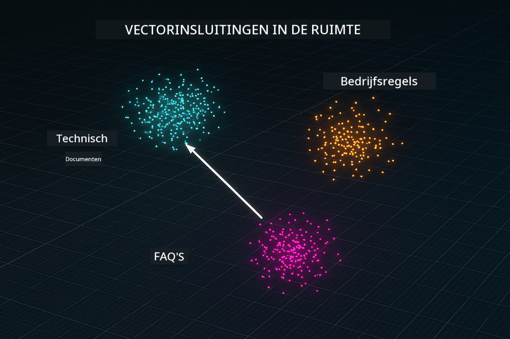
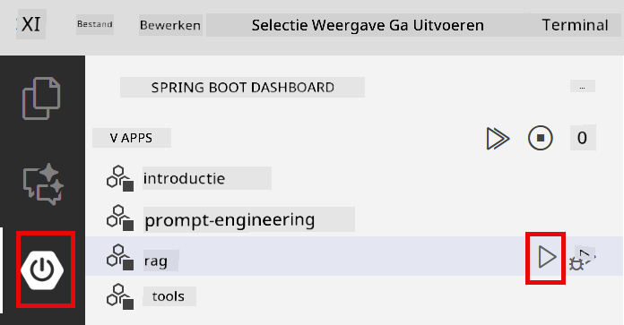
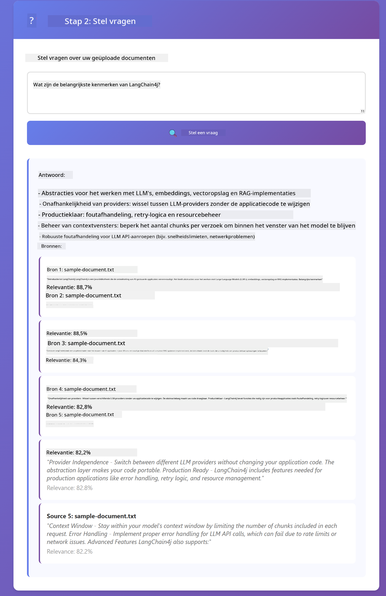

<!--
CO_OP_TRANSLATOR_METADATA:
{
  "original_hash": "f538a51cfd13147d40d84e936a0f485c",
  "translation_date": "2025-12-13T17:08:29+00:00",
  "source_file": "03-rag/README.md",
  "language_code": "nl"
}
-->
# Module 03: RAG (Retrieval-Augmented Generation)

## Inhoudsopgave

- [Wat Je Zal Leren](../../../03-rag)
- [Vereisten](../../../03-rag)
- [RAG Begrijpen](../../../03-rag)
- [Hoe Het Werkt](../../../03-rag)
  - [Documentverwerking](../../../03-rag)
  - [Embeddings Maken](../../../03-rag)
  - [Semantisch Zoeken](../../../03-rag)
  - [Antwoordgeneratie](../../../03-rag)
- [De Applicatie Starten](../../../03-rag)
- [De Applicatie Gebruiken](../../../03-rag)
  - [Upload een Document](../../../03-rag)
  - [Stel Vragen](../../../03-rag)
  - [Controleer Bronverwijzingen](../../../03-rag)
  - [Experimenteer met Vragen](../../../03-rag)
- [Belangrijke Concepten](../../../03-rag)
  - [Chunking Strategie](../../../03-rag)
  - [Gelijkenisscores](../../../03-rag)
  - [In-Memory Opslag](../../../03-rag)
  - [Contextvensterbeheer](../../../03-rag)
- [Wanneer RAG Belangrijk Is](../../../03-rag)
- [Volgende Stappen](../../../03-rag)

## Wat Je Zal Leren

In de vorige modules heb je geleerd hoe je gesprekken met AI voert en je prompts effectief structureert. Maar er is een fundamentele beperking: taalmodellen weten alleen wat ze tijdens de training hebben geleerd. Ze kunnen geen vragen beantwoorden over het beleid van jouw bedrijf, je projectdocumentatie, of informatie waarop ze niet getraind zijn.

RAG (Retrieval-Augmented Generation) lost dit probleem op. In plaats van het model jouw informatie te leren (wat duur en onpraktisch is), geef je het de mogelijkheid om door je documenten te zoeken. Wanneer iemand een vraag stelt, vindt het systeem relevante informatie en voegt die toe aan de prompt. Het model beantwoordt dan op basis van die opgehaalde context.

Zie RAG als het geven van een referentiebibliotheek aan het model. Wanneer je een vraag stelt, doet het systeem het volgende:

1. **Gebruikersvraag** - Je stelt een vraag  
2. **Embedding** - Zet je vraag om in een vector  
3. **Vectorzoektocht** - Vindt vergelijkbare documentstukken  
4. **Contextsamenstelling** - Voegt relevante stukken toe aan de prompt  
5. **Antwoord** - LLM genereert een antwoord op basis van de context  

Dit verankert de antwoorden van het model in jouw daadwerkelijke data in plaats van te vertrouwen op zijn trainingskennis of het verzinnen van antwoorden.


*RAG workflow - van gebruikersvraag naar semantisch zoeken tot contextueel antwoord genereren*

## Vereisten

- Module 01 voltooid (Azure OpenAI-resources gedeployed)  
- `.env` bestand in de hoofdmap met Azure-gegevens (gemaakt door `azd up` in Module 01)  

> **Opmerking:** Als je Module 01 nog niet hebt voltooid, volg dan eerst de deploymentinstructies daar.

## Hoe Het Werkt

**Documentverwerking** - [DocumentService.java](../../../03-rag/src/main/java/com/example/langchain4j/rag/service/DocumentService.java)

Wanneer je een document uploadt, breekt het systeem het op in stukken - kleinere delen die comfortabel in het contextvenster van het model passen. Deze stukken overlappen licht zodat je geen context verliest aan de randen.

```java
Document document = FileSystemDocumentLoader.loadDocument("sample-document.txt");

DocumentSplitter splitter = DocumentSplitters
    .recursive(300, 30, new OpenAiTokenizer());

List<TextSegment> segments = splitter.split(document);
```
  
> **🤖 Probeer met [GitHub Copilot](https://github.com/features/copilot) Chat:** Open [`DocumentService.java`](../../../03-rag/src/main/java/com/example/langchain4j/rag/service/DocumentService.java) en vraag:  
> - "Hoe splitst LangChain4j documenten in stukken en waarom is overlap belangrijk?"  
> - "Wat is de optimale chunkgrootte voor verschillende documenttypes en waarom?"  
> - "Hoe ga ik om met documenten in meerdere talen of met speciale opmaak?"

**Embeddings Maken** - [LangChainRagConfig.java](../../../03-rag/src/main/java/com/example/langchain4j/rag/config/LangChainRagConfig.java)

Elk stuk wordt omgezet in een numerieke representatie genaamd embedding - in feite een wiskundige vingerafdruk die de betekenis van de tekst vastlegt. Vergelijkbare tekst levert vergelijkbare embeddings op.

```java
@Bean
public EmbeddingModel embeddingModel() {
    return OpenAiOfficialEmbeddingModel.builder()
        .baseUrl(azureOpenAiEndpoint)
        .apiKey(azureOpenAiKey)
        .modelName(azureEmbeddingDeploymentName)
        .build();
}

EmbeddingStore<TextSegment> embeddingStore = 
    new InMemoryEmbeddingStore<>();
```
  


*Documenten weergegeven als vectoren in embedding-ruimte - vergelijkbare inhoud clustert samen*

**Semantisch Zoeken** - [RagService.java](../../../03-rag/src/main/java/com/example/langchain4j/rag/service/RagService.java)

Wanneer je een vraag stelt, wordt je vraag ook een embedding. Het systeem vergelijkt de embedding van je vraag met alle embeddings van de documentstukken. Het vindt de stukken met de meest vergelijkbare betekenissen - niet alleen overeenkomende trefwoorden, maar daadwerkelijke semantische gelijkenis.

```java
Embedding queryEmbedding = embeddingModel.embed(question).content();

List<EmbeddingMatch<TextSegment>> matches = 
    embeddingStore.findRelevant(queryEmbedding, 5, 0.7);

for (EmbeddingMatch<TextSegment> match : matches) {
    String relevantText = match.embedded().text();
    double score = match.score();
}
```
  
> **🤖 Probeer met [GitHub Copilot](https://github.com/features/copilot) Chat:** Open [`RagService.java`](../../../03-rag/src/main/java/com/example/langchain4j/rag/service/RagService.java) en vraag:  
> - "Hoe werkt gelijkeniszoeken met embeddings en wat bepaalt de score?"  
> - "Welke gelijkenisdrempel moet ik gebruiken en hoe beïnvloedt dat de resultaten?"  
> - "Hoe ga ik om met gevallen waarin geen relevante documenten worden gevonden?"

**Antwoordgeneratie** - [RagService.java](../../../03-rag/src/main/java/com/example/langchain4j/rag/service/RagService.java)

De meest relevante stukken worden opgenomen in de prompt voor het model. Het model leest die specifieke stukken en beantwoordt je vraag op basis van die informatie. Dit voorkomt hallucinaties - het model kan alleen antwoorden vanuit wat het voor zich heeft.

## De Applicatie Starten

**Controleer deployment:**

Zorg dat het `.env` bestand in de hoofdmap bestaat met Azure-gegevens (gemaakt tijdens Module 01):  
```bash
cat ../.env  # Moet AZURE_OPENAI_ENDPOINT, API_KEY, DEPLOYMENT tonen
```
  
**Start de applicatie:**

> **Opmerking:** Als je alle applicaties al gestart hebt met `./start-all.sh` uit Module 01, draait deze module al op poort 8081. Je kunt de startcommando's hieronder overslaan en direct naar http://localhost:8081 gaan.

**Optie 1: Gebruik Spring Boot Dashboard (Aanbevolen voor VS Code gebruikers)**

De dev container bevat de Spring Boot Dashboard extensie, die een visuele interface biedt om alle Spring Boot applicaties te beheren. Je vindt deze in de Activiteitenbalk aan de linkerkant van VS Code (zoek naar het Spring Boot icoon).

Vanuit het Spring Boot Dashboard kun je:  
- Alle beschikbare Spring Boot applicaties in de workspace zien  
- Applicaties starten/stoppen met één klik  
- Applicatielogs realtime bekijken  
- Applicatiestatus monitoren  

Klik simpelweg op de play-knop naast "rag" om deze module te starten, of start alle modules tegelijk.



**Optie 2: Gebruik shell scripts**

Start alle webapplicaties (modules 01-04):

**Bash:**  
```bash
cd ..  # Vanuit de hoofdmap
./start-all.sh
```
  
**PowerShell:**  
```powershell
cd ..  # Vanuit de hoofdmap
.\start-all.ps1
```
  
Of start alleen deze module:

**Bash:**  
```bash
cd 03-rag
./start.sh
```
  
**PowerShell:**  
```powershell
cd 03-rag
.\start.ps1
```
  
Beide scripts laden automatisch omgevingsvariabelen uit het `.env` bestand in de hoofdmap en bouwen de JARs als die nog niet bestaan.

> **Opmerking:** Als je alle modules handmatig wilt bouwen voordat je start:  
>  
> **Bash:**  
> ```bash
> cd ..  # Go to root directory
> mvn clean package -DskipTests
> ```
  
> **PowerShell:**  
> ```powershell
> cd ..  # Go to root directory
> mvn clean package -DskipTests
> ```
  
Open http://localhost:8081 in je browser.

**Om te stoppen:**

**Bash:**  
```bash
./stop.sh  # Alleen deze module
# Of
cd .. && ./stop-all.sh  # Alle modules
```
  
**PowerShell:**  
```powershell
.\stop.ps1  # Alleen deze module
# Of
cd ..; .\stop-all.ps1  # Alle modules
```
  
## De Applicatie Gebruiken

De applicatie biedt een webinterface voor documentupload en het stellen van vragen.

<a href="images/rag-homepage.png"></a>

*De RAG applicatie-interface - upload documenten en stel vragen*

**Upload een Document**

Begin met het uploaden van een document - TXT-bestanden werken het beste voor testen. Er is een `sample-document.txt` beschikbaar in deze map met informatie over LangChain4j functies, RAG-implementatie en best practices - perfect om het systeem te testen.

Het systeem verwerkt je document, breekt het op in stukken en maakt embeddings voor elk stuk. Dit gebeurt automatisch bij uploaden.

**Stel Vragen**

Stel nu specifieke vragen over de inhoud van het document. Probeer iets feitelijks dat duidelijk in het document staat. Het systeem zoekt naar relevante stukken, voegt die toe aan de prompt en genereert een antwoord.

**Controleer Bronverwijzingen**

Let op dat elk antwoord bronverwijzingen bevat met gelijkenisscores. Deze scores (0 tot 1) tonen hoe relevant elk stuk was voor je vraag. Hogere scores betekenen betere overeenkomsten. Dit stelt je in staat het antwoord te verifiëren aan de hand van de bron.

<a href="images/rag-query-results.png"></a>

*Queryresultaten tonen antwoord met bronverwijzingen en relevantiescores*

**Experimenteer met Vragen**

Probeer verschillende soorten vragen:  
- Specifieke feiten: "Wat is het hoofdonderwerp?"  
- Vergelijkingen: "Wat is het verschil tussen X en Y?"  
- Samenvattingen: "Vat de belangrijkste punten over Z samen"  

Bekijk hoe de relevantiescores veranderen afhankelijk van hoe goed je vraag aansluit bij de documentinhoud.

## Belangrijke Concepten

**Chunking Strategie**

Documenten worden opgesplitst in stukken van 300 tokens met 30 tokens overlap. Deze balans zorgt ervoor dat elk stuk genoeg context heeft om betekenisvol te zijn, terwijl het klein genoeg blijft om meerdere stukken in een prompt te kunnen opnemen.

**Gelijkenisscores**

Scores variëren van 0 tot 1:  
- 0.7-1.0: Zeer relevant, exacte match  
- 0.5-0.7: Relevant, goede context  
- Onder 0.5: Gefilterd, te verschillend  

Het systeem haalt alleen stukken op boven de minimale drempel om kwaliteit te waarborgen.

**In-Memory Opslag**

Deze module gebruikt in-memory opslag voor eenvoud. Wanneer je de applicatie herstart, gaan geüploade documenten verloren. Productiesystemen gebruiken persistente vectordatabases zoals Qdrant of Azure AI Search.

**Contextvensterbeheer**

Elk model heeft een maximaal contextvenster. Je kunt niet elk stuk van een groot document opnemen. Het systeem haalt de top N meest relevante stukken op (standaard 5) om binnen de limieten te blijven en toch genoeg context te bieden voor accurate antwoorden.

## Wanneer RAG Belangrijk Is

**Gebruik RAG wanneer:**  
- Je vragen beantwoordt over propriëtaire documenten  
- Informatie vaak verandert (beleid, prijzen, specificaties)  
- Nauwkeurigheid bronvermelding vereist  
- Inhoud te groot is om in één prompt te passen  
- Je verifieerbare, gefundeerde antwoorden nodig hebt  

**Gebruik RAG niet wanneer:**  
- Vragen algemene kennis vereisen die het model al heeft  
- Real-time data nodig is (RAG werkt op geüploade documenten)  
- Inhoud klein genoeg is om direct in prompts op te nemen  

## Volgende Stappen

**Volgende Module:** [04-tools - AI Agents met Tools](../04-tools/README.md)

---

**Navigatie:** [← Vorige: Module 02 - Prompt Engineering](../02-prompt-engineering/README.md) | [Terug naar Hoofdmenu](../README.md) | [Volgende: Module 04 - Tools →](../04-tools/README.md)

---

<!-- CO-OP TRANSLATOR DISCLAIMER START -->
**Disclaimer**:  
Dit document is vertaald met behulp van de AI-vertalingsdienst [Co-op Translator](https://github.com/Azure/co-op-translator). Hoewel we streven naar nauwkeurigheid, dient u er rekening mee te houden dat geautomatiseerde vertalingen fouten of onnauwkeurigheden kunnen bevatten. Het originele document in de oorspronkelijke taal moet als de gezaghebbende bron worden beschouwd. Voor cruciale informatie wordt professionele menselijke vertaling aanbevolen. Wij zijn niet aansprakelijk voor eventuele misverstanden of verkeerde interpretaties die voortvloeien uit het gebruik van deze vertaling.
<!-- CO-OP TRANSLATOR DISCLAIMER END -->